<!-- Carátula UPC -->

<p align="center">
  
</p>

<h2 align="center">UNIVERSIDAD PERUANA DE CIENCIAS APLICADAS</h2>

<h3 align="center">
INGENIERÍA DE SOFTWARE
</h3>

<p align="center"><strong>PERIODO:</strong> 202610 </p>

<p align="center">
  1ACC0238 - Aplicaciones para Dispositivos Móviles<br>
  <strong>NRC:</strong> 3248<br>
  <strong>Docente:</strong> David Gerardo Quevedo Velazco
</p>

<hr style="width:60%; border:1px solid #ccc;">

<h1 align="center">Informe de Trabajo Final</h1>

<p align="center">
  <strong>Startup:</strong> Mova<br>
  <strong>Producto:</strong> Courtly
</p>

<h3 align="center">Integrantes</h3>

<div align="center" style="line-height: 1.8; text-align: center;">
  <p>U202317692 — Angulo Abud, Juan Carlos</p>
  <p>U202324129 — Chacaliaza Minaya, Eduardo Fabian</p>
  <p>u202214572 — Espinoza Vivas, Camilla Leonor</p>
  <p>U202215462 — Nanfuñay Liza, Pedro Jesús</p>
  <p>U202320442 — Quispe Barzola, Fabricio Fabian</p>
  
</div>

<br>

<p align="center" style="font-weight: bold;">202604</p>


<div style="page-break-after: always;"></div>


<!--Registro de versiones-->
<h1 align="left">Registro de versiones del Informe</h1>
</br>
<table border="1" cellpadding="10" cellspacing="0" style="border-collapse: collapse; width: 100%;">
  <tr>
    <td align="center" style="border: 1px solid #ddd; padding: 8px;">Versión</td>
    <td align="center" style="border: 1px solid #ddd; padding: 8px;">Fecha</td>
    <td align="center" style="border: 1px solid #ddd; padding: 8px;">Autores</td>
    <td align="center" style="border: 1px solid #ddd; padding: 8px;">Descripción</td>
  </tr>
  <tr>
    <td style="border: 1px solid #ddd; padding: 8px;">AV1</td>
    <td style="border: 1px solid #ddd; padding: 8px;">21/04/2026</td>
    <td style="border: 1px solid #ddd; padding: 8px;">
      <ul>
        <li>Juan Carlos Angulo Abud</li>
      </ul>
    </td>
    <td style="border: 1px solid #ddd; padding: 8px;">            
      <ul>
        <li>Capítulo II: Punto 2.5.1.1 (Candidate Context Discovery)</li>
        <li>Capítulo II: Punto 2.5.1.2 (Domain Message Flows Modeling)</li>
        <li>Capítulo II: Punto 2.6.5 (Bounded Context: Courts)</li>
        <li>Capítulo II: Punto 2.6.6 (Bounded Context: Availabilities)</li>
        </ul>
    </td>
  </tr>
  <tr>
  <td style="border: 1px solid #ddd; padding: 8px;">AV1</td>
  <td style="border: 1px solid #ddd; padding: 8px;">21/04/2026</td>
  <td style="border: 1px solid #ddd; padding: 8px;">
    <ul>
      <li>Eduardo Fabian Chacaliaza Minaya</li>
    </ul>
  </td>
  <td style="border: 1px solid #ddd; padding: 8px;">            
    <ul>
      <li>Capítulo I: Punto 1.1, 1.2 y 1.3</li>
      <li>Capítulo II: Punto 2.5.2</li>
      <li>Capítulo II: Punto 2.6.3 (Users)</li>
      <li>Capítulo II: Punto 2.6.10 (Notifications)</li>
      <li>Capítulo II: Punto 2.6.11 (IAM)</li>
    </ul>
  </td>
</tr>
  <tr>
  <td style="border: 1px solid #ddd; padding: 8px;">AV1</td>
  <td style="border: 1px solid #ddd; padding: 8px;">21/04/2026</td>
  <td style="border: 1px solid #ddd; padding: 8px;">
    <ul>
      <li>Camilla Espinoza</li>
    </ul>
  </td>
  <td style="border: 1px solid #ddd; padding: 8px;">            
    <ul>
      <li>Capítulo II: Punto 2.4</li>
      <li>Capítulo II: Punto 2.5.3</li>
      <li>Capítulo II: Punto 2.6.4 (Coaches)</li>
      <li>Capítulo II: Punto 2.6.7 (Reviews)</li>
    </ul>
  </td>
</tr>
  <tr>
  <td style="border: 1px solid #ddd; padding: 8px;">AV1</td>
  <td style="border: 1px solid #ddd; padding: 8px;">21/04/2026</td>
  <td style="border: 1px solid #ddd; padding: 8px;">
    <ul>
      <li>Fabricio Fabian Quispe Barzola</li>
    </ul>
  </td>
  <td style="border: 1px solid #ddd; padding: 8px;">            
    <ul>
      <li>Capítulo II: Punto 2.1</li>
      <li>Capítulo II: Punto 2.1.1</li>
      <li>Capítulo II: Punto 2.1.2</li>
      <li>Capítulo II: Punto 2.2.1</li>
      <li>Capítulo II: Punto 2.2.2</li>
      <li>Capítulo II: Punto 2.2.3</li>
      <li>Capítulo II: Punto 2.6.1 (Bookings)</li>
      <li>Capítulo II: Punto 2.6.8 (Analytics)</li>
    </ul>
  </td>
</tr>
<tr>
  <td style="border: 1px solid #ddd; padding: 8px;">AV1</td>
  <td style="border: 1px solid #ddd; padding: 8px;">21/04/2026</td>
  <td style="border: 1px solid #ddd; padding: 8px;">
    <ul>
      <li>Pedro Jesús Nanfuñay Liza</li>
    </ul>
  </td>
  <td style="border: 1px solid #ddd; padding: 8px;">            
    <ul>
      <li>Capítulo II: Punto 2.3</li>
      <li>Capítulo II: Punto 2.3.1</li>
      <li>Capítulo II: Punto 2.3.2</li>
      <li>Capítulo II: Punto 2.3.3</li>
      <li>Capítulo II: Punto 2.3.4</li>
      <li>Capítulo II: Punto 2.3.5</li>
      <li>Capítulo II: Punto 2.3.6</li>
      <li>Capítulo II: Punto 2.6.2 (Payments)</li>
      <li>Capítulo II: Punto 2.6.9 (Matches)</li>
    </ul>
  </td>
</tr>

<tr>
    <td style="border: 1px solid #ddd; padding: 8px;">TB1</td>
    <td style="border: 1px solid #ddd; padding: 8px;">13/05/2026</td>
    <td style="border: 1px solid #ddd; padding: 8px;">
      <ul>
        <li>Pedro Jesús Nanfuñay Liza</li>
      </ul>
    </td>
    <td style="border: 1px solid #ddd; padding: 8px;">            
      <ul>
        <li>Capítulo IV: Punto 4.2.1.3</li>
        <li>Capítulo IV: Punto 4.2.1.4</li>
        <li>Capítulo IV: Punto 4.2.1.5</li>
        </ul>
    </td>
  </tr>
  <tr>
    <td style="border: 1px solid #ddd; padding: 8px;">TB1</td>
    <td style="border: 1px solid #ddd; padding: 8px;">13/05/2026</td>
    <td style="border: 1px solid #ddd; padding: 8px;">
      <ul>
        <li>Camilla Leonor Espinoza Vivas</li>
      </ul>
    </td>
    <td style="border: 1px solid #ddd; padding: 8px;">            
      <ul>
        <li>Capítulo III: Punto 3.1.4</li>
        <li>Capítulo IV: Punto 4.2.1.1</li>
        <li>Capítulo IV: Punto 4.2.1.2</li>
        </ul>
    </td>
  </tr>
  <tr>
  <td style="border: 1px solid #ddd; padding: 8px;">TB1</td>
  <td style="border: 1px solid #ddd; padding: 8px;">13/05/2026</td>
  <td style="border: 1px solid #ddd; padding: 8px;">
    <ul>
      <li>Eduardo Fabian Chacaliaza Minaya</li>
    </ul>
  </td>
  <td style="border: 1px solid #ddd; padding: 8px;">            
    <ul>
      <li>Capítulo III: Punto 3.1.1</li>
      <li>Capítulo III: Punto 3.1.2</li>
      <li>Capítulo III: Punto 3.1.3</li>
    </ul>
  </td>
</tr>
<tr>
  <td style="border: 1px solid #ddd; padding: 8px;">TB1</td>
  <td style="border: 1px solid #ddd; padding: 8px;">13/05/2026</td>
  <td style="border: 1px solid #ddd; padding: 8px;">
    <ul>
      <li>Fabricio Fabian Quispe Barzola</li>
    </ul>
  </td>
  <td style="border: 1px solid #ddd; padding: 8px;">            
    <ul>
      <li>Capítulo IV: Punto 4.2.1.6</li>
      <li>Capítulo IV: Punto 4.2.1.7</li>
      <li>Capítulo IV: Punto 4.2.1.8</li>
    </ul>
  </td>
</tr>
<tr>
  <td style="border: 1px solid #ddd; padding: 8px;">AV2</td>
  <td style="border: 1px solid #ddd; padding: 8px;">24/06/2026</td>
  <td style="border: 1px solid #ddd; padding: 8px;">
    <ul>
      <li>Todos</li>
    </ul>
  </td>
  <td style="border: 1px solid #ddd; padding: 8px;">            
    <ul>
      <li>Capítulo IV: Punto 4.2.2</li>
    </ul>
  </td>
</tr>
</table><br>


<h1>Project Report Collaboration Insights</h1>

<h2>AV1</h2>

<p>Para el desarrollo del informe perteneciente a la entrega AV1, se dividió la implementación de secciones del Capítulo I y II en bloques de trabajo, asignando cada conjunto de secciones a un integrante del equipo.</p>

<p align="center">
  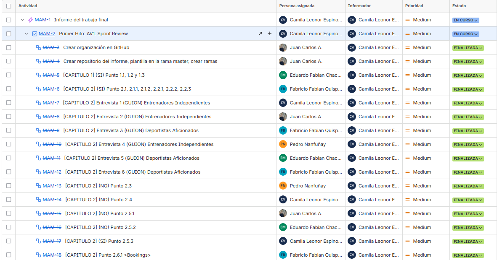
</p>

<p align="center">
  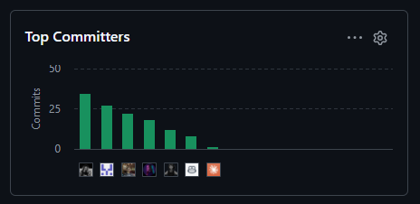
</p>

<table align="center" border="1" cellpadding="10" cellspacing="0" style="border-collapse: collapse; width: 100%;">
  <tr>
    <td align="center"><strong>Integrante</strong></td>
    <td align="center"><strong>Tareas Asignadas</strong></td>
  </tr>

  <!-- BLOQUE 1 -->
  <tr>
    <td>Eduardo Fabian Chacaliaza Minaya</td>
    <td>
      <ul>
        <li><strong>Capítulo I – Presentación</strong></li>
        <li>1.1 Startup Profile</li>
        <li>1.1.1 Descripción de la Startup</li>
        <li>1.1.2 Perfiles de integrantes del equipo</li>
        <li>1.2 Solution Profile</li>
        <li>1.2.1 Antecedentes y problemática</li>
        <li>1.2.2 Lean UX Process</li>
        <li>1.2.2.1 Lean UX Problem Statements</li>
        <li>1.2.2.2 Lean UX Assumptions</li>
        <li>1.2.2.3 Lean UX Hypothesis Statements</li>
        <li>1.2.2.4 Lean UX Canvas</li>
        <li>1.3 Segmentos objetivo</li>
      </ul>
    </td>
  </tr>
  <tr>
    <td>Fabricio Fabian Quispe Barzola</td>
    <td>
      <ul>
        <li><strong>Capítulo II</strong></li>
        <li>2.1 Competidores</li>
        <li>2.1.1 Análisis competitivo</li>
        <li>2.1.2 Estrategias y tácticas frente a competidores</li>
        <li>2.2 Entrevistas</li>
        <li>2.2.1 Diseño de entrevistas</li>
        <li>2.2.2 Registro de entrevistas</li>
        <li>2.2.3 Análisis de entrevistas</li>
      </ul>
    </td>
  </tr>

  <!-- BLOQUE 2 -->
  <tr>
    <td>Pedro Jesús Nanfuñay Liza</td>
    <td>
      <ul>
        <li>2.3 Needfinding</li>
        <li>2.3.1 User Personas</li>
        <li>2.3.2 User Task Matrix</li>
        <li>2.3.3 User Journey Mapping</li>
        <li>2.3.4 Empathy Mapping</li>
        <li>2.3.5 Big Picture EventStorming</li>
        <li>2.3.6 Ubiquitous Language</li>
      </ul>
    </td>
  </tr>

  <!-- BLOQUE 3 -->
  <tr>
    <td>Camilla Espinoza</td>
    <td>
      <ul>
        <li>2.4 Requirements Specification</li>
        <li>2.4.1 User Stories</li>
        <li>2.4.2 Impact Mapping</li>
        <li>2.4.3 Product Backlog</li>
      </ul>
    </td>
  </tr>

  <!-- BLOQUE 4 -->
  <tr>
    <td>Juan Carlos Angulo</td>
    <td>
      <ul>
        <li>2.5.1 EventStorming</li>
        <li>2.5.1.1 Candidate Context Discovery</li>
        <li>2.5.1.2 Domain Message Flows Modeling</li>
        <li>2.5.1.3 Bounded Context Canvases</li>
      </ul>
    </td>
  </tr>

  <!-- BLOQUE 5 -->
  <tr>
    <td>Eduardo Fabian Chacaliaza Minaya</td>
    <td>
      <ul>
        <li>2.5.2 Context Mapping</li>
      </ul>
    </td>
  </tr>

  <!-- BLOQUE 6 -->
  <tr>
    <td>Camilla Espinoza</td>
    <td>
      <ul>
        <li>2.5.3 Software Architecture</li>
        <li>2.5.3.1 Context Level Diagrams</li>
        <li>2.5.3.2 Container Level Diagrams</li>
        <li>2.5.3.3 Deployment Diagrams</li>
      </ul>
    </td>
  </tr>

  <!-- BLOQUE 7 -->
  <tr>
    <td>Fabricio Fabian Quispe Barzola</td>
    <td>
      <ul>
        <li><strong>2.6.1 Bounded Context: Bookings</strong></li>
        <li>2.6.1.1 Domain Layer</li>
        <li>2.6.1.2 Interface Layer</li>
        <li>2.6.1.3 Application Layer</li>
        <li>2.6.1.4 Infrastructure Layer</li>
        <li>2.6.1.5 Component Level Diagrams</li>
        <li>2.6.1.6 Code Level Diagrams</li>
        <li>2.6.1.6.1 Class Diagram</li>
        <li>2.6.1.6.2 Database Diagram</li>
</ul>
    </td>
  </tr>
<tr>
    <td>Pedro Jesús Nanfuñay Liza</td>
    <td>
      <ul>
        <li><strong>2.6.2 Bounded Context: Payments</strong></li>
        <li>2.6.2.1 Domain Layer</li>
        <li>2.6.2.2 Interface Layer</li>
        <li>2.6.2.3 Application Layer</li>
        <li>2.6.2.4 Infrastructure Layer</li>
        <li>2.6.2.5 Component Level Diagrams</li>
        <li>2.6.2.6 Code Level Diagrams</li>
        <li>2.6.2.6.1 Class Diagram</li>
        <li>2.6.2.6.2 Database Diagram</li>
</ul>
    </td>
  </tr>
  <tr>
    <td>Eduardo Fabian Chacaliaza Minaya</td>
    <td>
      <ul>
        <li><strong>2.6.3 Bounded Context: Users</strong></li>
        <li>2.6.3.1 Domain Layer</li>
        <li>2.6.3.2 Interface Layer</li>
        <li>2.6.3.3 Application Layer</li>
        <li>2.6.3.4 Infrastructure Layer</li>
        <li>2.6.3.5 Component Level Diagrams</li>
        <li>2.6.3.6 Code Level Diagrams</li>
        <li>2.6.3.6.1 Class Diagram</li>
        <li>2.6.3.6.2 Database Diagram</li>
      </ul>
    </td>
  </tr>

  <!-- BLOQUE 8 -->
  <tr>
    <td>Camilla Espinoza</td>
    <td>
      <ul>
        <li><strong>2.6.4 Bounded Context: Coaches</strong></li>
        <li>2.6.4.1 Domain Layer</li>
        <li>2.6.4.2 Interface Layer</li>
        <li>2.6.4.3 Application Layer</li>
        <li>2.6.4.4 Infrastructure Layer</li>
        <li>2.6.4.5 Component Level Diagrams</li>
        <li>2.6.4.6 Code Level Diagrams</li>
        <li>2.6.4.6.1 Class Diagram</li>
        <li>2.6.4.6.2 Database Diagram</li>
        </ul>
    </td>
  </tr>
<tr>
    <td>Juan Carlos Angulo</td>
    <td>
      <ul>
        <li><strong>2.6.5 Bounded Context: Courts</strong></li>
        <li>2.6.5.1 Domain Layer</li>
        <li>2.6.5.2 Interface Layer</li>
        <li>2.6.5.3 Application Layer</li>
        <li>2.6.5.4 Infrastructure Layer</li>
        <li>2.6.5.5 Component Level Diagrams</li>
        <li>2.6.5.6 Code Level Diagrams</li>
        <li>2.6.5.6.1 Class Diagram</li>
        <li>2.6.5.6.2 Database Diagram</li>
        </ul>
    </td>
  </tr>
<tr>
    <td>Juan Carlos Angulo</td>
    <td>
      <ul>
        <li><strong>2.6.6 Bounded Context: Availabilities</strong></li>
        <li>2.6.6.1 Domain Layer</li>
        <li>2.6.6.2 Interface Layer</li>
        <li>2.6.6.3 Application Layer</li>
        <li>2.6.6.4 Infrastructure Layer</li>
        <li>2.6.6.5 Component Level Diagrams</li>
        <li>2.6.6.6 Code Level Diagrams</li>
        <li>2.6.6.6.1 Class Diagram</li>
        <li>2.6.6.6.2 Database Diagram</li>
        </ul>
    </td>
  </tr>
  <tr>
    <td>Camilla Espinoza</td>
    <td>
      <ul>
        <li><strong>2.6.7 Bounded Context: Reviews</strong></li>
        <li>2.6.7.1 Domain Layer</li>
        <li>2.6.7.2 Interface Layer</li>
        <li>2.6.7.3 Application Layer</li>
        <li>2.6.7.4 Infrastructure Layer</li>
        <li>2.6.7.5 Component Level Diagrams</li>
        <li>2.6.7.6 Code Level Diagrams</li>
        <li>2.6.7.6.1 Class Diagram</li>
        <li>2.6.7.6.2 Database Diagram</li>
      </ul>
    </td>
  </tr>
<tr>
    <td>Fabricio Fabian Quispe Barzola</td>
    <td>
      <ul>
        <li><strong>2.6.8 Bounded Context: Analytics</strong></li>
        <li>2.6.8.1 Domain Layer</li>
        <li>2.6.8.2 Interface Layer</li>
        <li>2.6.8.3 Application Layer</li>
        <li>2.6.8.4 Infrastructure Layer</li>
        <li>2.6.8.5 Component Level Diagrams</li>
        <li>2.6.8.6 Code Level Diagrams</li>
        <li>2.6.8.6.1 Class Diagram</li>
        <li>2.6.8.6.2 Database Diagram</li>
        </ul>
    </td>
  </tr>
  <tr>
    <td>Pedro Jesús Nanfuñay Liza</td>
    <td>
      <ul>
        <li><strong>2.6.9 Bounded Context: Matches</strong></li>
        <li>2.6.9.1 Domain Layer</li>
        <li>2.6.9.2 Interface Layer</li>
        <li>2.6.9.3 Application Layer</li>
        <li>2.6.9.4 Infrastructure Layer</li>
        <li>2.6.9.5 Component Level Diagrams</li>
        <li>2.6.9.6 Code Level Diagrams</li>
        <li>2.6.9.6.1 Class Diagram</li>
        <li>2.6.9.6.2 Database Diagram</li>
        </ul>
    </td>
  </tr>
 <tr>
    <td>Eduardo Fabian Chacaliaza Minaya</td>
    <td>
      <ul>
        <li><strong>2.6.10 Bounded Context: Notifications</strong></li>
        <li>2.6.10.1 Domain Layer</li>
        <li>2.6.10.2 Interface Layer</li>
        <li>2.6.10.3 Application Layer</li>
        <li>2.6.10.4 Infrastructure Layer</li>
        <li>2.6.10.5 Component Level Diagrams</li>
        <li>2.6.10.6 Code Level Diagrams</li>
        <li>2.6.10.6.1 Class Diagram</li>
        <li>2.6.10.6.2 Database Diagram</li>
        </ul>
    </td>
  </tr>
  <tr>
    <td>Eduardo Fabian Chacaliaza Minaya</td>
    <td>
      <ul>
        <li><strong>2.6.11 Bounded Context: IAM</strong></li>
        <li>2.6.11.1 Domain Layer</li>
        <li>2.6.11.2 Interface Layer</li>
        <li>2.6.11.3 Application Layer</li>
        <li>2.6.11.4 Infrastructure Layer</li>
        <li>2.6.11.5 Component Level Diagrams</li>
        <li>2.6.11.6 Code Level Diagrams</li>
        <li>2.6.11.6.1 Class Diagram</li>
        <li>2.6.11.6.2 Database Diagram</li>
        </ul>
    </td>
  </tr>
  <tr>
    <td>Camilla Leonor Espinoza Vivas</td>
    <td>
      <ul>
        <li><strong>2.6.12 Bounded Context: TrainingSessions</strong></li>
        <li>2.6.12.1 Domain Layer</li>
        <li>2.6.12.2 Interface Layer</li>
        <li>2.6.12.3 Application Layer</li>
        <li>2.6.12.4 Infrastructure Layer</li>
        <li>2.6.12.5 Component Level Diagrams</li>
        <li>2.6.12.6 Code Level Diagrams</li>
        <li>2.6.12.6.1 Class Diagram</li>
        <li>2.6.12.6.2 Database Diagram</li>
        </ul>
    </td>
  </tr>

</table>

<h2>TB1</h2>

<p>Para el desarrollo del informe perteneciente a la entrega TB1, se dividió la implementación de secciones del Capítulo III y IV en bloques de trabajo, asignando cada conjunto de secciones a un integrante del equipo.</p>

<p align="center">
  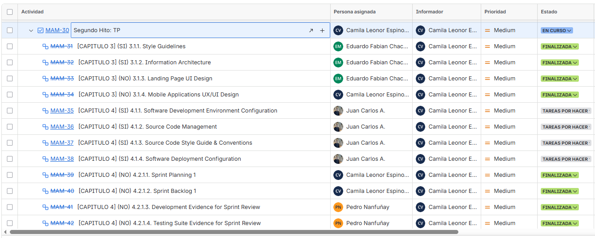
</p>

<p align="center">
  
</p>

<table align="center" border="1" cellpadding="10" cellspacing="0" style="border-collapse: collapse; width: 100%;">
  <tr>
    <td align="center"><strong>Integrante</strong></td>
    <td align="center"><strong>Tareas Asignadas</strong></td>
  </tr>

  <!-- BLOQUE 1 -->
  <tr>
    <td>Eduardo Fabian Chacaliaza Minaya</td>
    <td>
      <ul>
        <li><strong>Capítulo III: Solution UI/UX Design</strong></li>
        <li>3.1. Product design</li>
        <li>3.1.1. Style Guidelines</li>
        <li>3.1.3. Landing Page UI Design</li>
      </ul>
    </td>
  </tr>
  <tr>
    <td>Camilla Leonor Espinoza Vivas</td>
    <td>
      <ul>
        <li><strong>3.1.4. Mobile Applications UX/UI Design</strong></li>
        <li>3.1.4.1. Mobile Applications Wireframes</li>
        <li>3.1.4.2. Mobile Applications Wireflow Diagrams</li>
        <li>3.1.4.3. Mobile Applications Mock-ups</li>
        <li>3.1.4.4. Mobile Applications User Flow Diagrams</li>
        <li>3.1.4.5. Mobile Applications Prototyping</li>
      </ul>
    </td>
  </tr>
  <tr>
    <td>Juan Carlos Angulo Abud</td>
    <td>
      <ul>
        <li><strong>Capítulo IV: Product Implementation & Validation</strong></li>
        <li>4.1. Software Configuration Management</li>
        <li>4.1.1. Software Development Environment Configuration</li>
        <li>4.1.2. Source Code Management</li>
        <li>4.1.3. Source Code Style Guide & Conventions</li>
        <li>4.1.4. Software Deployment Configuration</li>
      </ul>
    </td>
  </tr>
  <tr>
    <td>Camilla Leonor Espinoza Vivas</td>
    <td>
      <ul>
        <li><strong>4.2. Landing Page & Mobile Application Implementation</strong></li>
        <li>4.2.1. Sprint 1</li>
        <li>4.2.1.1. Sprint Planning 1</li>
        <li>4.2.1.2. Sprint Backlog 1</li>
      </ul>
    </td>
  </tr>
  <tr>
    <td>Pedro Jesús Nanfuñay Liza</td>
    <td>
      <ul>
        <li><strong>4.2.1.3. Development Evidence for Sprint Review</strong></li>
        <li>4.2.1.4. Testing Suite Evidence for Sprint Review</li>
        <li>4.2.1.5. Execution Evidence for Sprint Review</li>
      </ul>
    </td>
  </tr>
  <tr>
    <td>Fabricio Fabian Quispe Barzola</td>
    <td>
      <ul>
        <li><strong>4.2.1.6. Services Documentation Evidence for Sprint Review</strong></li>
        <li>4.2.1.7. Software Deployment Evidence for Sprint Review</li>
        <li>4.2.1.8. Team Collaboration Insights during Sprint</li>
      </ul>
    </td>
  </tr>
</table>

<h2>AV2</h2>

<p>Para el desarrollo del informe perteneciente a la entrega AV1, se dividió la implementación de secciones del Capítulo IV en bloques de trabajo, asignando cada conjunto de secciones a un integrante del equipo.</p>

<p align="center">
  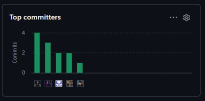
</p>

<table align="center" border="1" cellpadding="10" cellspacing="0" style="border-collapse: collapse; width: 100%;">
  <tr>
    <td align="center"><strong>Integrante</strong></td>
    <td align="center"><strong>Tareas Asignadas</strong></td>
  </tr>

  <!-- BLOQUE 1 -->
  <tr>
    <td>Fabricio Fabian Quispe Barzola</td>
    <td>
      <ul>
        <li>4.2.2. Sprint 2</li>
        <li>4.2.2.1. Sprint Planning 2</li>
        <li>4.2.2.2. Sprint Backlog 2</li>
      </ul>
    </td>
  </tr>
  <tr>
    <td>Pedro Jesús Nanfuñay Liza</td>
    <td>
      <ul>
        <li>4.2.2.3. Development Evidence for Sprint Review</li>
      </ul>
    </td>
  </tr>
  <tr>
    <td>Juan Carlos Angulo Abud</td>
    <td>
      <ul>
        <li>4.2.2.5. Execution Evidence for Sprint Review</li>       
      </ul>
    </td>
  </tr>
  <tr>
    <td>Fabricio Fabian Quispe Barzola</td>
    <td>
      <ul>        
        <li>4.2.2.7. Software Deployment Evidence for Sprint Review</li>
      </ul>
    </td>
  </tr>
  <tr>
    <td>Camilla Leonor Espinoza Vivas</td>
    <td>
      <ul>
        <li>4.2.2.8. Team Collaboration Insights during Sprint</li>
      </ul>
    </td>
  </tr>
</table>
<!--ÍNDICE-->
# Contenido
[Student Outcome](#student-outcome)

[Capítulo I: Introducción](#capítulo-i-introducción)
- [1.1. Startup Profile](#11-startup-profile)
  - [1.1.1. Descripción de la Startup](#111-descripción-de-la-startup)
  - [1.1.2. Perfiles de integrantes del equipo](#112-perfiles-de-integrantes-del-equipo)
- [1.2. Solution Profile](#12-solution-profile)
- [1.2.1 Antecedentes y problemática](#121-antecedentes-y-problemática)
  - [1.2.2 Lean UX Process](#122-lean-ux-process)
  -  [1.2.2.1. Lean UX Problem Statements](#1221-lean-ux-problem-statements)
    - [1.2.2.2. Lean UX Assumptions](#1222-lean-ux-assumptions)
    - [1.2.2.3. Lean UX Hypothesis Statements](#1223-lean-ux-hypothesis-statements)
    - [1.2.2.4. Lean UX Canvas](#1224-lean-ux-canvas)
- [1.3. Segmentos objetivo](#13-segmentos-objetivo)
  
[Capítulo II: Requirements Elicitation \& Analysis](#capítulo-ii-Requirements-Development-and-Software-Solution-Design)
  - [2.1. Competidores](#21-competidores)
    - [2.1.1. Análisis competitivo](#211-análisis-competitivo)
    - [2.1.2. Estrategias y tácticas frente a competidores](#212-estrategias-y-tácticas-frente-a-competidores)
  - [2.2. Entrevistas](#22-entrevistas)
    - [2.2.1. Diseño de entrevistas](#221-diseño-de-entrevistas)
    - [2.2.2. Registro de entrevistas](#222-registro-de-entrevistas)
    - [2.2.3. Análisis de entrevistas](#223-análisis-de-entrevistas)
  - [2.3. Needfinding](#23-needfinding)
    - [2.3.1. User Personas](#231-user-personas)
    - [2.3.2. User Task Matrix](#232-user-task-matrix)
    - [2.3.3. User Journey Mapping](#233-user-journey-mapping)
    - [2.3.4. Empathy Mapping](#234-empathy-mapping)
    - [2.3.5. Ubiquitous Language](#235-UbiquitousLanguage)
  - [2.4 Requirements specification](#236-Requirements-specification)
- [2.4.1. User Stories](#241-user-stories)  
- [2.4.2. Impact Mapping](#242-impact-mapping)  
- [2.4.3. Product Backlog](#243-product-backlog)  
- [2.5. Strategic-Level Domain-Driven Design](#25-strategic-level-domain-driven-design)  
  - [2.5.1. EventStorming](#251-eventstorming)  
    - [2.5.1.1. Candidate Context Discovery](#2511-candidate-context-discovery)  
    - [2.5.1.2. Domain Message Flows Modeling](#2512-domain-message-flows-modeling)  
    - [2.5.1.3. Bounded Context Canvases](#2513-bounded-context-canvases)  
  - [2.5.2. Context Mapping](#252-context-mapping)  
- [2.5.3. Software Architecture](#253-software-architecture)  
  - [2.5.3.1. Software Architecture Context Level Diagrams](#2531-software-architecture-context-level-diagrams)  
  - [2.5.3.2. Software Architecture Container Level Diagrams](#2532-software-architecture-container-level-diagrams)  
  - [2.5.3.3. Software Architecture Deployment Diagrams](#2533-software-architecture-deployment-diagrams)  
- [2.6. Tactical-Level Domain-Driven Design](#26-tactical-level-domain-driven-design)  
  - [2.6.1. Bounded Context: Bookings](#26x-bounded-context-bounded-context-name)  
    - [2.6.1.1. Domain Layer](#26x1-domain-layer)  
    - [2.6.1.2. Interface Layer](#26x2-interface-layer)  
    - [2.6.1.3. Application Layer](#26x3-application-layer)  
    - [2.6.1.4. Infrastructure Layer](#26x4-infrastructure-layer)  
    - [2.6.1.5. Bounded Context Software Architecture Component Level Diagrams](#26x5-bounded-context-software-architecture-component-level-diagrams)  
    - [2.6.1.6. Bounded Context Software Architecture Code Level Diagrams](#26x6-bounded-context-software-architecture-code-level-diagrams)  
    - [2.6.1.6.1. Bounded Context Domain Layer Class Diagrams](#26x61-bounded-context-domain-layer-class-diagrams)  
    - [2.6.1.6.2. Bounded Context Database Design Diagram](#26x62-bounded-context-database-design-diagram)
  - [2.6.2. Bounded Context: Payments](#26x-bounded-context-bounded-context-name)  
    - [2.6.2.1. Domain Layer](#26x1-domain-layer)  
    - [2.6.2.2. Interface Layer](#26x2-interface-layer)  
    - [2.6.2.3. Application Layer](#26x3-application-layer)  
    - [2.6.2.4. Infrastructure Layer](#26x4-infrastructure-layer)  
    - [2.6.2.5. Bounded Context Software Architecture Component Level Diagrams](#26x5-bounded-context-software-architecture-component-level-diagrams)  
    - [2.6.2.6. Bounded Context Software Architecture Code Level Diagrams](#26x6-bounded-context-software-architecture-code-level-diagrams)  
    - [2.6.2.6.1. Bounded Context Domain Layer Class Diagrams](#26x61-bounded-context-domain-layer-class-diagrams)  
    - [2.6.2.6.2. Bounded Context Database Design Diagram](#26x62-bounded-context-database-design-diagram)
  - [2.6.3. Bounded Context: Users](#26x-bounded-context-bounded-context-name)  
    - [2.6.3.1. Domain Layer](#26x1-domain-layer)  
    - [2.6.3.2. Interface Layer](#26x2-interface-layer)  
    - [2.6.3.3. Application Layer](#26x3-application-layer)  
    - [2.6.3.4. Infrastructure Layer](#26x4-infrastructure-layer)  
    - [2.6.3.5. Bounded Context Software Architecture Component Level Diagrams](#26x5-bounded-context-software-architecture-component-level-diagrams)  
    - [2.6.3.6. Bounded Context Software Architecture Code Level Diagrams](#26x6-bounded-context-software-architecture-code-level-diagrams)  
    - [2.6.3.6.1. Bounded Context Domain Layer Class Diagrams](#26x61-bounded-context-domain-layer-class-diagrams)  
    - [2.6.3.6.2. Bounded Context Database Design Diagram](#26x62-bounded-context-database-design-diagram)
  - [2.6.4. Bounded Context: Coaches](#26x-bounded-context-bounded-context-name)  
    - [2.6.4.1. Domain Layer](#26x1-domain-layer)  
    - [2.6.4.2. Interface Layer](#26x2-interface-layer)  
    - [2.6.4.3. Application Layer](#26x3-application-layer)  
    - [2.6.4.4. Infrastructure Layer](#26x4-infrastructure-layer)  
    - [2.6.4.5. Bounded Context Software Architecture Component Level Diagrams](#26x5-bounded-context-software-architecture-component-level-diagrams)  
    - [2.6.4.6. Bounded Context Software Architecture Code Level Diagrams](#26x6-bounded-context-software-architecture-code-level-diagrams)  
    - [2.6.4.6.1. Bounded Context Domain Layer Class Diagrams](#26x61-bounded-context-domain-layer-class-diagrams)  
    - [2.6.4.6.2. Bounded Context Database Design Diagram](#26x62-bounded-context-database-design-diagram)
  - [2.6.5. Bounded Context: Courts](#26x-bounded-context-bounded-context-name)  
    - [2.6.5.1. Domain Layer](#26x1-domain-layer)  
    - [2.6.5.2. Interface Layer](#26x2-interface-layer)  
    - [2.6.5.3. Application Layer](#26x3-application-layer)  
    - [2.6.5.4. Infrastructure Layer](#26x4-infrastructure-layer)  
    - [2.6.5.5. Bounded Context Software Architecture Component Level Diagrams](#26x5-bounded-context-software-architecture-component-level-diagrams)  
    - [2.6.5.6. Bounded Context Software Architecture Code Level Diagrams](#26x6-bounded-context-software-architecture-code-level-diagrams)  
    - [2.6.5.6.1. Bounded Context Domain Layer Class Diagrams](#26x61-bounded-context-domain-layer-class-diagrams)  
    - [2.6.5.6.2. Bounded Context Database Design Diagram](#26x62-bounded-context-database-design-diagram)
  - [2.6.6. Bounded Context: Availabilities](#26x-bounded-context-bounded-context-name)  
    - [2.6.6.1. Domain Layer](#26x1-domain-layer)  
    - [2.6.6.2. Interface Layer](#26x2-interface-layer)  
    - [2.6.6.3. Application Layer](#26x3-application-layer)  
    - [2.6.6.4. Infrastructure Layer](#26x4-infrastructure-layer)  
    - [2.6.6.5. Bounded Context Software Architecture Component Level Diagrams](#26x5-bounded-context-software-architecture-component-level-diagrams)  
    - [2.6.6.6. Bounded Context Software Architecture Code Level Diagrams](#26x6-bounded-context-software-architecture-code-level-diagrams)  
    - [2.6.6.6.1. Bounded Context Domain Layer Class Diagrams](#26x61-bounded-context-domain-layer-class-diagrams)  
    - [2.6.6.6.2. Bounded Context Database Design Diagram](#26x62-bounded-context-database-design-diagram)
  - [2.6.7. Bounded Context: Reviews](#26x-bounded-context-bounded-context-name)  
    - [2.6.7.1. Domain Layer](#26x1-domain-layer)  
    - [2.6.7.2. Interface Layer](#26x2-interface-layer)  
    - [2.6.7.3. Application Layer](#26x3-application-layer)  
    - [2.6.7.4. Infrastructure Layer](#26x4-infrastructure-layer)  
    - [2.6.7.5. Bounded Context Software Architecture Component Level Diagrams](#26x5-bounded-context-software-architecture-component-level-diagrams)  
    - [2.6.7.6. Bounded Context Software Architecture Code Level Diagrams](#26x6-bounded-context-software-architecture-code-level-diagrams)  
    - [2.6.7.6.1. Bounded Context Domain Layer Class Diagrams](#26x61-bounded-context-domain-layer-class-diagrams)  
    - [2.6.7.6.2. Bounded Context Database Design Diagram](#26x62-bounded-context-database-design-diagram)
  - [2.6.8. Bounded Context: Analytics](#26x-bounded-context-bounded-context-name)  
    - [2.6.8.1. Domain Layer](#26x1-domain-layer)  
    - [2.6.8.2. Interface Layer](#26x2-interface-layer)  
    - [2.6.8.3. Application Layer](#26x3-application-layer)  
    - [2.6.8.4. Infrastructure Layer](#26x4-infrastructure-layer)  
    - [2.6.8.5. Bounded Context Software Architecture Component Level Diagrams](#26x5-bounded-context-software-architecture-component-level-diagrams)  
    - [2.6.8.6. Bounded Context Software Architecture Code Level Diagrams](#26x6-bounded-context-software-architecture-code-level-diagrams)  
    - [2.6.8.6.1. Bounded Context Domain Layer Class Diagrams](#26x61-bounded-context-domain-layer-class-diagrams)  
    - [2.6.8.6.2. Bounded Context Database Design Diagram](#26x62-bounded-context-database-design-diagram)
  - [2.6.9. Bounded Context: Matches](#26x-bounded-context-bounded-context-name)  
    - [2.6.9.1. Domain Layer](#26x1-domain-layer)  
    - [2.6.9.2. Interface Layer](#26x2-interface-layer)  
    - [2.6.9.3. Application Layer](#26x3-application-layer)  
    - [2.6.9.4. Infrastructure Layer](#26x4-infrastructure-layer)  
    - [2.6.9.5. Bounded Context Software Architecture Component Level Diagrams](#26x5-bounded-context-software-architecture-component-level-diagrams)  
    - [2.6.9.6. Bounded Context Software Architecture Code Level Diagrams](#26x6-bounded-context-software-architecture-code-level-diagrams)  
    - [2.6.9.6.1. Bounded Context Domain Layer Class Diagrams](#26x61-bounded-context-domain-layer-class-diagrams)  
    - [2.6.9.6.2. Bounded Context Database Design Diagram](#26x62-bounded-context-database-design-diagram)
  - [2.6.10. Bounded Context: Notifications](#26x-bounded-context-bounded-context-name)  
    - [2.6.10.1. Domain Layer](#26x1-domain-layer)  
    - [2.6.10.2. Interface Layer](#26x2-interface-layer)  
    - [2.6.10.3. Application Layer](#26x3-application-layer)  
    - [2.6.10.4. Infrastructure Layer](#26x4-infrastructure-layer)  
    - [2.6.10.5. Bounded Context Software Architecture Component Level Diagrams](#26x5-bounded-context-software-architecture-component-level-diagrams)  
    - [2.6.10.6. Bounded Context Software Architecture Code Level Diagrams](#26x6-bounded-context-software-architecture-code-level-diagrams)  
    - [2.6.10.6.1. Bounded Context Domain Layer Class Diagrams](#26x61-bounded-context-domain-layer-class-diagrams)  
    - [2.6.10.6.2. Bounded Context Database Design Diagram](#26x62-bounded-context-database-design-diagram)
  - [2.6.11. Bounded Context: IAM](#26x-bounded-context-bounded-context-name)  
    - [2.6.11.1. Domain Layer](#26x1-domain-layer)  
    - [2.6.11.2. Interface Layer](#26x2-interface-layer)  
    - [2.6.11.3. Application Layer](#26x3-application-layer)  
    - [2.6.11.4. Infrastructure Layer](#26x4-infrastructure-layer)  
    - [2.6.11.5. Bounded Context Software Architecture Component Level Diagrams](#26x5-bounded-context-software-architecture-component-level-diagrams)  
    - [2.6.11.6. Bounded Context Software Architecture Code Level Diagrams](#26x6-bounded-context-software-architecture-code-level-diagrams)  
    - [2.6.11.6.1. Bounded Context Domain Layer Class Diagrams](#26x61-bounded-context-domain-layer-class-diagrams)  
    - [2.6.11.6.2. Bounded Context Database Design Diagram](#26x62-bounded-context-database-design-diagram)
  - [2.6.12. Bounded Context: TrainingSessions](#26x-bounded-context-bounded-context-name)  
    - [2.6.12.1. Domain Layer](#26x1-domain-layer)  
    - [2.6.12.2. Interface Layer](#26x2-interface-layer)  
    - [2.6.12.3. Application Layer](#26x3-application-layer)  
    - [2.6.12.4. Infrastructure Layer](#26x4-infrastructure-layer)  
    - [2.6.12.5. Bounded Context Software Architecture Component Level Diagrams](#26x5-bounded-context-software-architecture-component-level-diagrams)  
    - [2.6.12.6. Bounded Context Software Architecture Code Level Diagrams](#26x6-bounded-context-software-architecture-code-level-diagrams)  
    - [2.6.12.6.1. Bounded Context Domain Layer Class Diagrams](#26x61-bounded-context-domain-layer-class-diagrams)  
    - [2.6.12.6.2. Bounded Context Database Design Diagram](#26x62-bounded-context-database-design-diagram)

[Capítulo III: Solution UI/UX Design](#capítulo-iii-solution-uiux-design)
- [3.1. Product design](#31-product-design)
  - [3.1.1. Style Guidelines](#311-style-guidelines)
    - [3.1.1.1. General Style Guidelines](#3111-general-style-guidelines)
  - [3.1.2. Information Architecture](#312-information-architecture)
    - [3.1.2.1. Organization Systems](#3121-organization-systems)
    - [3.1.2.2. Labelling Systems](#3122-labelling-systems)
    - [3.1.2.3. SEO Tags and Meta Tags](#3123-seo-tags-and-meta-tags)
    - [3.1.2.4. Searching Systems](#3124-searching-systems)
    - [3.1.2.5. Navigation Systems](#3125-navigation-systems)
  - [3.1.3. Landing Page UI Design](#313-landing-page-ui-design)
    - [3.1.3.1. Landing Page Wireframe](#3131-landing-page-wireframe)
    - [3.1.3.2. Landing Page Mock-up](#3132-landing-page-mock-up)
  - [3.1.4. Mobile Applications UX/UI Design](#314-mobile-applications-uxui-design)
    - [3.1.4.1. Mobile Applications Wireframes](#3141-mobile-applications-wireframes)
    - [3.1.4.2. Mobile Applications Wireflow Diagrams](#3142-mobile-applications-wireflow-diagrams)
    - [3.1.4.3. Mobile Applications Mock-ups](#3143-mobile-applications-mock-ups)
    - [3.1.4.4. Mobile Applications User Flow Diagrams](#3144-mobile-applications-user-flow-diagrams)
    - [3.1.4.5. Mobile Applications Prototyping](#3145-mobile-applications-prototyping)

[Capítulo IV: Product Implementation & Validation](#capítulo-iv-product-implementation--validation)
- [4.1. Software Configuration Management](#41-software-configuration-management)
  - [4.1.1. Software Development Environment Configuration](#411-software-development-environment-configuration)
  - [4.1.2. Source Code Management](#412-source-code-management)
  - [4.1.3. Source Code Style Guide & Conventions](#413-source-code-style-guide--conventions)
  - [4.1.4. Software Deployment Configuration](#414-software-deployment-configuration)
- [4.2. Landing Page & Mobile Application Implementation](#42-landing-page--mobile-application-implementation)
  - [4.2.1. Sprint 1](#421-sprint-n)
    - [4.2.1.1. Sprint Planning 1](#4211-sprint-planning-n)
    - [4.2.1.2. Sprint Backlog 1](#4212-sprint-backlog-n)
    - [4.2.1.3. Development Evidence for Sprint Review](#4213-development-evidence-for-sprint-review)
    - [4.2.1.4. Testing Suite Evidence for Sprint Review](#4214-testing-suite-evidence-for-sprint-review)
    - [4.2.1.5. Execution Evidence for Sprint Review](#4215-execution-evidence-for-sprint-review)
    - [4.2.1.6. Services Documentation Evidence for Sprint Review](#4216-services-documentation-evidence-for-sprint-review)
    - [4.2.1.7. Software Deployment Evidence for Sprint Review](#4217-software-deployment-evidence-for-sprint-review)
    - [4.2.1.8. Team Collaboration Insights during Sprint](#4218-team-collaboration-insights-during-sprint)
  - [4.2.2. Sprint 2](#421-sprint-n)
    - [4.2.2.1. Sprint Planning 2](#4211-sprint-planning-n)
    - [4.2.2.2. Sprint Backlog 2](#4212-sprint-backlog-n)
    - [4.2.2.3. Development Evidence for Sprint Review](#4213-development-evidence-for-sprint-review)
    - [4.2.2.4. Execution Evidence for Sprint Review](#4215-execution-evidence-for-sprint-review)
    - [4.2.2.5. Software Deployment Evidence for Sprint Review](#4217-software-deployment-evidence-for-sprint-review)
    - [4.2.2.6. Team Collaboration Insights during Sprint](#4218-team-collaboration-insights-during-sprint)
- [4.3. Validation Interviews](#43-validation-interviews)
  - [4.3.1. Diseño de Entrevistas](#431-diseño-de-entrevistas)
  - [4.3.2. Registro de Entrevistas](#432-registro-de-entrevistas)
  - [4.3.3. Evaluaciones según heurísticas](#433-evaluaciones-según-heurísticas)

[Conclusiones](#Conclusiones)
- [Conclusiones y recomendaciones.]()
- [Video App Validation]()
- [Video About the product]()
- [Video About the team]()

[Glosario](#Glosario)

[Bibliografía](#Bibliografía)

[Anexos](#Anexos)

<!--STUDENT OUTCOME-->

# Student Outcome
<div style="text-align:center;">
    <table align="center" border="1" cellpadding="8" cellspacing="0" style="border-collapse: collapse; width: 100%;">
        <tr>
            <th style="text-align:center; border: 1px solid #ddd;">Student Outcomes</th>
            <th style="text-align:center; border: 1px solid #ddd;">Acciones realizadas</th>
            <th style="text-align:center; border: 1px solid #ddd;">Conclusiones</th>
        </tr>
        <tr>
            <td style="border: 1px solid #ddd; vertical-align: top;">
                Actualiza conceptos y conocimientos necesarios para su desarrollo profesional y en especial para su proyecto en soluciones de software.
            </td>
            <td style="border: 1px solid #ddd; vertical-align: top;">
                <strong>Juan Carlos Angulo</strong><br>
                AV1:<br>Durante el desarrollo del AV1, actualizó y aplicó conocimientos avanzados en Domain-Driven Design mediante la elaboración completa del EventStorming, incluyendo Candidate Context Discovery y Domain Message Flows Modeling. Además, diseñó e implementó dos bounded contexts completos (Courts y Availabilities) con todas sus capas (Domain, Interface, Application e Infrastructure), así como diagramas de arquitectura a nivel de componentes y código (Class Diagrams y Database Design Diagrams).<br>
                AV2: <br>Durante el desarrollo del AV2, apliqué y actualicé mis conocimientos en el proceso de desarrollo e implementación de funciones en el frontend móvil, específicamente en el bounded context Availabilities para permitir la gestión de la agenda del entrenador, incluyendo la creación, edición y eliminación de bloques de disponibilidad, así como el manejo de los estados de las sesiones de entrenamiento y la edición del perfil del entrenador, aplicando buenas prácticas de desarrollo de software y documentación de evidencias de ejecución.<br>
                <strong>Camilla Espinoza</strong><br>
                AV1:<br>
                Durante el desarrollo del AV1, actualizó y aplicó conocimientos en arquitectura de software y Domain-Driven Design mediante la elaboración de User Stories, Impact Mapping y Product Backlog. Además, diseñó los bounded contexts de Coaches y Reviews, así como diagramas de arquitectura (contexto, contenedores y componentes) y diagramas UML del dominio.<br>
                TB1:<br>
                Actualicé y mejoré los User Stories del proyecto móvil Courtly, apoyé en la planificación del Sprint Planning y Sprint Backlog, participé en la mejora del reporte del proyecto y colaboré en el diseño del prototipo móvil mediante mockups y wireframes desarrollados en HTML, CSS y JavaScript. Además, apoyé en la definición de reglas de negocio para el backend, fortaleciendo mis conocimientos en metodologías ágiles, diseño UI/UX, desarrollo frontend y lógica funcional para aplicaciones móviles.<br>
                AV2: <br>
                Durante el desarrollo del AV2, actualicé y apliqué conocimientos en diseño de agendas y administración de horarios para implementar de manera funcional la creación, edición, listado y eliminación de disponibilidades del entrenador. Esto implicó organizar la representación de bloques horarios en la interfaz, validar rangos de tiempo consistentes y conectar cada operación con los servicios del backend, asegurando que la gestión de disponibilidades respondiera adecuadamente a las necesidades del segmento de entrenadores dentro de Courtly.<br>
                <strong>Fabricio Fabian Quispe Barzola</strong><br>
                AV1:<br>
                Durante el desarrollo del AV1, actualizó y aplicó conocimientos en análisis de dominio y arquitectura de software mediante la elaboración del análisis competitivo, estrategias y tácticas frente a competidores, así como el diseño del Context Mapping utilizando Domain-Driven Design. Además, desarrolló los bounded contexts de Bookings y Analytics, incluyendo sus respectivas capas (Domain, Application, Interface e Infrastructure), junto con diagramas de arquitectura (Component Level) y diagramas de código (Class Diagram y Database Design).<br>
                TB1:<br>
                Durante el desarrollo del TB1, actualicé y apliqué conocimientos relacionados con el desarrollo e integración de soluciones de software en diferentes frentes del proyecto Courtly. Participé en actividades vinculadas al backend, landing page y frontend, apoyando en la revisión funcional, documentación técnica y validación de evidencias del Sprint. Además, desarrollé la documentación de Web Services mediante OpenAPI/Swagger, registrando endpoints, métodos HTTP, parámetros, ejemplos de request y response, así como capturas de evidencia para el Sprint Review. También participé en la documentación del deployment del backend en Render y de la landing page en GitHub Pages, fortaleciendo mis conocimientos en despliegue, integración de repositorios, validación de servicios y presentación técnica del producto.<br>
                AV2: <br>
                Durante el desarrollo del AV2, actualicé y apliqué conocimientos relacionados con la implementación y validación de aplicaciones móviles orientadas a un segmento específico de usuario. Mi trabajo se enfocó en el segmento de deportista aficionado dentro del proyecto Courtly, considerando principalmente los bounded contexts Users y Courts. Desde Users, participé en la documentación y avance de funcionalidades relacionadas con la edición del perfil personal del jugador. Desde Courts, apoyé el avance de funcionalidades como búsqueda de canchas por ubicación, filtrado y visualización del detalle de cancha. Asimismo, participé en la documentación del Sprint 2, incluyendo Sprint Planning, Sprint Backlog y Software Deployment Evidence, registrando evidencias de sincronización de dependencias, compilación, ejecución en Android y validación del backend mediante Swagger UI. Este trabajo fortaleció mis conocimientos en desarrollo móvil con Flutter, integración con servicios backend, organización de evidencias técnicas y documentación para Sprint Review.
                <br><strong>Pedro Jesús Nanfuñay Liza</strong><br>
                AV1:<br>
                Durante el desarrollo del AV1, apliqué y actualicé mis conocimientos en el proceso de creación de elementos needfinding, tales como los User Persona, User Journey Mapping, Empathy Mapping, entre otros. Así como en el proceso de Big Picture EventStorming, e identificación y desarrollo de bounded context relacionados al negocio como payments y matches, a partir de sus respectivas capas, junto con sus diagramas de arquitectura y diagramas de código.<br>
                TB1:<br>
                Durante el desarrollo del Tb1, apliqué y actualicé mis conocimientos relacionados con el desarrollo del backend e implementación de pruebas de software para la automatización y validación de servicios REST. Pude reforzar conceptos vinculados al diseño e implementación de Unit Tests, Integration Tests y Acceptance Tests bajo el enfoque BDD, así como el uso de herramientas como JUnit, Mockito y Cucumber; asegurando una mejor comprensión de la calidad del software y de las prácticas necesarias para construir soluciones más confiables y mantenibles.<br>
                AV2:<br>
                Durante el desarrollo del AV2, apliqué y actualicé mis conocimientos en el proceso de desarrollo e implementación de funciones en el frontend, específicamente en el bounded context Bookings para permitir la reserva de canchas deportivas, así como, la cancelación de la misma, aplicando buenas prácticas de desarrollo de software y documentación.<br>
                <br><strong>Eduardo Fabian Chacaliaza Minaya</strong><br>
                AV1:<br>
                Durante el desarrollo del AV1, actualizó y aplicó sus conocimientos en arquitectura de software y diseño centrado en el usuario mediante la aplicación de Lean UX, realizando entrevistas, definición de hipótesis y validación de necesidades. Asimismo, participó en la construcción del Context Mapping bajo el enfoque de Domain-Driven Design y en el modelado de los bounded contexts de IAM, Users y Notifications, desarrollando sus capas principales y los diagramas de soporte (componentes, clases y base de datos), lo que permitió una mejor comprensión de la organización y estructura del sistema.<br>
                TB1:<br>
                Durante el desarrollo del TB1, actualizó y aplicó conocimientos relacionados con el diseño UI/UX y el desarrollo de soluciones de software para el proyecto Courtly. Participó en la elaboración del Capítulo III: Solution UI/UX Design, desarrollando secciones como Product Design, Style Guidelines y Landing Page UI Design. Además, aportó en el desarrollo de código del proyecto, colaborando en la landing page, frontend y backend. Esto le permitió reforzar conocimientos en diseño de interfaces, lineamientos visuales, estructura de páginas web, integración de funcionalidades y desarrollo técnico orientado a la construcción de una solución de software más completa y coherente.
                <br>
                AV2:<br>
                Durante el desarrollo del AV2, actualicé y apliqué conocimientos en autenticación móvil, consumo de APIs y persistencia de sesión para implementar correctamente los flujos de inicio de sesión, registro y recuperación del estado autenticado dentro de la aplicación. Asimismo, reforcé mis conocimientos en la construcción de perfiles profesionales y en la gestión de datos del entrenador, lo que permitió soportar la visualización y edición de su información en Android de forma coherente con la arquitectura del proyecto. Este proceso contribuyó a consolidar mis competencias en integración móvil con servicios backend y en el diseño de funcionalidades orientadas a usuarios con roles específicos dentro de Courtly.
                <br>
           </td>
            <td style="border: 1px solid #ddd; vertical-align: top;">
                AV1<br>
                El equipo demostró un efectivo liderazgo conjunto durante el AV1, donde cada miembro asumió responsabilidades compartidas de coordinación y toma de decisiones. Se evidenció una colaboración fluida que abarcó desde aspectos estratégicos y técnicos del proyecto hasta la planificación operativa y distribución de tareas. La comunicación continua, las reuniones regulares y el trabajo colaborativo. El compromiso colectivo por mantener una sana relación de equipo y la capacidad para resolver conflictos de manera conjunta permitieron lograr consensos efectivos y entregar un trabajo cohesivo y de calidad, demostrando que el liderazgo fue verdaderamente compartido y distribuido entre todos los integrantes.<br>
                TB1<br>
                El equipo profundizó su modelo de liderazgo conjunto, evolucionando desde la coordinación estratégica hacia la ejecución operativa de soluciones concretas. Durante el TB1, se evidenció no solo el mantenimiento de responsabilidades compartidas y colaboración fluida, sino una mayor especialización donde cada miembro asumió roles técnicos específicos (UI/UX, backend, frontend, infraestructura) sin perder la visión integral del proyecto. La comunicación continua y las reuniones regulares se complementaron con nuevas prácticas como Sprint Planning, validación de entregables y coordinación cross-funcional entre disciplinas. El equipo demostró capacidad para resolver conflictos técnicos y de integración de manera conjunta, permitiendo la armonización entre diseño, implementación y despliegue. La entrega de artefactos tangibles desplegados en producción (landing page y backend en Render y GitHub Pages) refleja un liderazgo compartido que trascendió de la planificación a la materialización de resultados, consolidando un equipo que no solo trabaja de manera cohesiva, sino que genera valor medible para el producto Courtly.<br>
                AV2<br>
                Durante el AV2, el equipo consolidó sus conocimientos en desarrollo móvil aplicado a soluciones de software, pasando de la definición del dominio a la implementación de experiencias funcionales para dos segmentos distintos del producto Courtly: deportistas aficionados en Flutter y entrenadores en Android. Esta etapa evidenció una mayor madurez técnica, ya que el trabajo no solo se centró en construir pantallas, sino en integrar flujos completos de autenticación, navegación, gestión de canchas y administración de disponibilidades, manteniendo coherencia con el backend existente. Asimismo, se reforzaron habilidades en consumo de servicios REST, organización por bounded contexts, persistencia de sesión, diseño de interfaces intuitivas y adaptación de la arquitectura a cada plataforma. La colaboración entre los miembros permitió avanzar de forma coordinada en ambos repositorios, validando entregables reales y consolidando una solución móvil más sólida, alineada con las necesidades funcionales del proyecto y con un enfoque más profesional en la construcción de software.
            </td>
        </tr>
        <tr>
            <td style="border: 1px solid #ddd; vertical-align: top;">
                Reconoce la necesidad del aprendizaje permanente para el desempeño profesional y el desarrollo de proyectos en soluciones de software.
            </td>
            <td style="border: 1px solid #ddd; vertical-align: top;">
                <strong>Juan Carlos Angulo</strong><br>
                AV1: <br>Durante el AV1, investigué y apliqué metodologías avanzadas de Domain-Driven Design, incluyendo técnicas de EventStorming para descubrimiento de contextos acotados y modelado de flujos de dominio. Investigué patrones de arquitectura de software (C4 Model, patrones tácticos de DDD) y utilicé herramientas para la elaboración de diagramas UML complejos, diagramas de componentes y diseño de bases de datos relacionales. Esto fortaleció significativamente mis habilidades en modelado de sistemas complejos, separación de responsabilidades y arquitectura orientada al dominio.<br>
                TB1:<br> Durante el desarrollo del TB1, reconocí la importancia del aprendizaje permanente en configuración y gestión de infraestructura de software. Investigué y apliqué mejores prácticas en **configuración de entornos de desarrollo** basados en Java 21 LTS y Spring Boot, documentando estándares de ambiente y perfiles de configuración para múltiples ambientes. Además, profundicé en **estrategias de control de versiones** con Git Flow, convenciones de commits semantificados y políticas de code review. Investigué y documenté **estándares de código** incluyendo convenciones de nombrado, estructura de paquetes y patrones arquitectónicos (CQRS, assemblers) aplicables a 13 bounded contexts. Finalmente, aprendí y configuré **pipelines de deployment** automatizados con Docker multi-stage y Render, incluyendo variables de entorno seguras, health checks y estrategias de rollback. Este aprendizaje continuo en infraestructura y DevOps fortalece mi capacidad para diseñar sistemas mantenibles, escalables y seguros en producción.<br><br>
                AV2: <br>Durante el AV2, reconocí la importancia del aprendizaje constante en el desarrollo frontend móvil con Flutter, que permita a los usuarios acceder de manera satisfactoria a las funciones de la aplicación, aplicando y reforzando mis conocimientos de desarrollo de software y de pruebas apropiadas que validen la disponibilidad y eficiencia de las funciones implementadas.<br>
                <strong>Camilla Espinoza</strong><br>
                AV1:<br>
                Durante el AV1, investigó y aplicó nuevas herramientas y metodologías como Structurizr para diagramas C4, PlantUML para modelado de clases y Miro para Impact Mapping. Esto permitió mejorar la calidad del diseño arquitectónico y fortalecer sus habilidades en modelado de sistemas y documentación técnica.<br>
                TB1:<br>
                Reconocí la importancia del aprendizaje permanente mediante la actualización y mejora continua de los User Stories, la participación en actividades ágiles como Sprint Planning y Sprint Backlog, y el apoyo en el diseño del prototipo móvil utilizando HTML, CSS y JavaScript. Asimismo, colaboré en la definición de reglas de negocio para el backend, fortaleciendo constantemente mis conocimientos en desarrollo de aplicaciones móviles, metodologías ágiles y diseño de soluciones de software orientadas a las necesidades del proyecto Courtly.<br>
                AV2: <br>
                Durante el desarrollo del AV2, reconocí la necesidad de actualizar mis conocimientos en diseño de agendas, administración de horarios y consumo de servicios backend para implementar adecuadamente la gestión de disponibilidades del entrenador. Fue necesario comprender con mayor profundidad la forma de representar bloques horarios en la interfaz, registrar información consistente, validar rangos de tiempo y sincronizar las operaciones de creación, edición, consulta y eliminación con los endpoints del sistema. Este proceso me permitió fortalecer mis capacidades para construir flujos móviles más intuitivos, funcionales y alineados con las necesidades reales del proyecto Courtly.
                </br>
                <br><strong>Fabricio Fabian Quispe Barzola</strong><br>
                AV1:<br>
                Durante el AV1, investigó y aplicó conceptos de Domain-Driven Design y modelado arquitectónico, utilizando herramientas para la elaboración de diagramas UML, diagramas de componentes y diseño de bases de datos. Esto le permitió mejorar su capacidad de estructurar bounded contexts, comprender mejor la separación de responsabilidades y fortalecer sus habilidades en documentación técnica y diseño de soluciones de software.<br>
                TB1:<br>
                Durante el desarrollo del TB1, reconocí la importancia del aprendizaje permanente al tener que reforzar conocimientos en backend, frontend, documentación técnica y despliegue de aplicaciones. Fue necesario comprender mejor el uso de Swagger para documentar y validar endpoints, así como el proceso de publicación del backend en Render y de la landing page mediante GitHub Pages. También reforcé mi aprendizaje sobre la organización del trabajo en repositorios, el uso de evidencias para Sprint Review y la integración de aportes del equipo en el reporte. Esto me permitió mejorar mi capacidad para adaptarme a distintas áreas del proyecto y entender que el desarrollo de software requiere aprendizaje continuo, tanto en implementación como en documentación, validación y deployment.
                <br>
                AV2: <br>Durante el desarrollo del AV2, reconocí la importancia del aprendizaje permanente al trabajar en la preparación y validación del flujo móvil del Sprint 2. Fue necesario reforzar conocimientos sobre Flutter, ejecución de aplicaciones móviles desde Android Studio, sincronización de dependencias mediante Flutter Pub, generación de APK en modo debug y validación de servicios backend desplegados. Además, al documentar el Software Deployment Evidence, comprendí mejor la relación entre la aplicación móvil, el backend en la nube y las evidencias necesarias para sustentar un Sprint Review. Este proceso me permitió mejorar mi capacidad para organizar entregables técnicos, validar funcionalidades implementadas y comunicar de forma clara el avance del producto Courtly dentro de un entorno de trabajo colaborativo.<br>
                <br><strong>Pedro Jesús Nanfuñay Liza</strong><br>
                AV1:<br>
                Durante el desarrollo del AV1, comprendí la importancia del constante aprendizaje autodidacta para mi desarrollo profesional en el desarrollo de proyectos de software, tomando en cuenta temas esenciales como Domain Driven Design (DDD) y modelado arquitectónico de diagramas de componentes, clases y bases de datos. Ello me incentivó a seguir expandiendo mis conocimientos para mejorar mi capacidad de estructurar bounded context, su respectiva documentación técnica, entre otras áreas de este tipo de proyectos.<br>
                TB1:<br>
                Durante el desarrollo del TB1, comprendí la importancia de mantener un aprendizaje constante en relación al desarrollo, despliegue e implementación de pruebas para el backend. Donde fue necesario investigar nuevas herramientas y entender diferentes enfoques de pruebas. Demostrando, la importancia de aprender continuamente para mejorar mis habilidades profesionales con el objetivo de desarrollar soluciones de software más sólidas, confiables y alineadas con buenas prácticas.<br>
                AV2:<br>Durante el AV2, reconocí la importancia del aprendizaje constante de desarrollo en la parte frontend que permita a los usuarios acceder de manera satisfactoria a funciones de una aplicación, aplicando y reforzando mis conocimientos de desarrollo de software y testings apropiados que validen la disponibilidad y eficiencia de las funciones.<br>
                <br><strong>Eduardo Fabian Chacaliaza Minaya</strong><br>
                AV1:<br>
                Durante el desarrollo del AV1, exploró y utilizó herramientas orientadas al modelado y diseño de software como Structurizr, PlantUML y Miro, integrándolas en la elaboración de diagramas C4, modelos de clases y actividades de Impact Mapping. Este proceso le permitió no solo mejorar la representación visual de la arquitectura del sistema, sino también afianzar su capacidad de organizar ideas, estructurar soluciones y documentar de manera más clara los distintos componentes del proyecto.<br>
                TB1:<br>
                Durante el desarrollo del TB1, reconoció la importancia del aprendizaje permanente al reforzar conocimientos en diseño UI/UX, desarrollo frontend, landing page y backend. Para cumplir con sus responsabilidades, tuvo que investigar y aplicar criterios de diseño visual, organización de interfaces, lineamientos de estilo y estructura de páginas web. Además, al colaborar en el desarrollo de código, fortaleció su capacidad para adaptarse a distintas áreas del proyecto, comprendiendo que una solución de software requiere aprendizaje continuo tanto en diseño como en implementación técnica, integración y validación del producto.<br>
                AV2: <br>Durante el desarrollo del AV2, reconocí la importancia del aprendizaje permanente al profundizar en la integración de autenticación móvil, manejo de sesiones y consumo de servicios backend dentro de la aplicación. Fue necesario reforzar conocimientos sobre persistencia de sesión, validación de credenciales, gestión de estados autenticados y conexión con APIs REST para asegurar que el inicio de sesión funcionara correctamente y que la experiencia del usuario se mantuviera estable entre ejecuciones. Asimismo, en la implementación de la vista del entrenador, comprendí la necesidad de seguir fortaleciendo mis conocimientos en desarrollo Android, modelado de perfiles y organización de pantallas, lo que me permitió estructurar mejor la edición de datos, la navegación interna y la representación funcional de los flujos asociados al entrenador. Este proceso contribuyó a mejorar mi capacidad para adaptar soluciones móviles a requerimientos reales del proyecto y consolidó mi formación técnica dentro de un entorno de desarrollo colaborativo.<br>
            </td>
            <td style="border: 1px solid #ddd; vertical-align: top;">
                AV1<br>
                El equipo logró mantener un entorno colaborativo e inclusivo mediante la distribución clara de responsabilidades, la coordinación constante y la planificación progresiva de actividades durante las entregas. Cada integrante aportó desde su área de trabajo, lo que permitió avanzar de manera ordenada y alineada con los objetivos del proyecto. La organización de tareas, el seguimiento de avances y la comunicación permanente favorecieron el cumplimiento de metas parciales y la construcción de un proceso de trabajo más estructurado y cooperativo.<br>
                TB1<br>
                El equipo consolidó y evolucionó su modelo de colaboración desde el AV1, logrando integrar exitosamente el diseño UI/UX con la implementación técnica del backend y frontend. Más allá del mantenimiento de un entorno colaborativo e inclusivo, se evidenció una mayor madurez en la gestión de entregas, donde cada integrante asumió responsabilidades tanto en su área especializada como en actividades transversales de validación e integración.<br>
                AV2<br>
                Durante el AV2, el equipo consolidó un trabajo colaborativo más especializado, orientado al desarrollo del frontend móvil para los dos segmentos del proyecto. La distribución de responsabilidades permitió avanzar de forma paralela en Flutter para deportistas aficionados y en Android para entrenadores, manteniendo coordinación constante para asegurar coherencia entre ambos repositorios. La comunicación continua, la validación cruzada de avances y la integración de los flujos principales facilitaron una ejecución más madura y ordenada, evidenciando una colaboración efectiva enfocada en la construcción de soluciones de software funcionales y alineadas con los objetivos del proyecto.<br>
            </td>
        </tr>
    </table>
</div>

<!--TODAS LAS SECCIONES A COMPLETAR-->

##  Objetivos SMART

En esta sección, cada miembro del equipo de trabajo formulará al menos dos objetivos SMART que se centren en el desarrollo profesional una vez finalizada su carrera. Estos objetivos deben ser claros, medibles y alcanzables, reflejando cómo cada integrante planea continuar con su crecimiento profesional después de la graduación.

### Miembro 1: Juan Carlos Angulo Abud

### Objetivo 1
**Específico:** Consolidar competencias en **Domain-Driven Design (DDD) y arquitectura de software orientada al dominio**, mediante el diseño e implementación de bounded contexts complejos con todas sus capas arquitectónicas (Domain, Interface, Application, Infrastructure) en el proyecto Courtly.

**Medible:**
- Diseñar y documentar completamente **al menos 2 bounded contexts** (Courts y Availabilities) incluyendo: Domain Layer con entidades, value objects y domain services; Interface Layer con REST controllers y DTOs; Application Layer con command/event handlers; Infrastructure Layer con repositories y adapters; más diagramas de componentes C4 y diagramas UML completos.

**Alcanzable:** Aplicar conocimientos adquiridos en patrones DDD, arquitectura hexagonal y modelado de sistemas, utilizando herramientas como PlantUML y Structurizr, dedicando 10-12 horas semanales al diseño y documentación arquitectónica.

**Relevante:** Las habilidades en DDD y arquitectura de bounded contexts son fundamentales para desempeñarme como **Software Architect o Backend Engineer**, permitiéndome diseñar sistemas escalables y mantenibles con clara separación de responsabilidades.

**Tiempo:**
- Completar el diseño y documentación de ambos bounded contexts en **12 semanas**, con validación iterativa de arquitectura cada 3 semanas.

---

### Objetivo 2
**Específico:** Dominar la técnica de **EventStorming para modelado del dominio**, aplicándola en proyectos reales para identificar eventos clave, descubrir bounded contexts y modelar flujos de mensajes entre dominios.

**Específico:** Desarrollar expertise en EventStorming mediante la aplicación completa de la técnica en Courtly: realizar Candidate Context Discovery para identificar y validar contextos acotados, modelar Domain Message Flows para visualizar colaboración entre contextos, y crear Bounded Context Canvases con especificación completa de propósito, capacidades, reglas de negocio y dependencias.

**Medible:**
- Elaborar **sesión completa de EventStorming** con al menos **8 bounded contexts identificados**; crear **4+ diagramas de Domain Message Flows** con responsabilidades claramente definidas; producir **8 Bounded Context Canvases completos** con documentación de vocabulario ubicuo, reglas de negocio y capacidades.

**Alcanzable:** Aplicar metodologías de discovery vistas en clase (Start-with-Value, Start-with-Simple, Look-for-Pivotal-Events), usar herramientas colaborativas como Miro, y dedicar 8-10 horas semanales a facilitar sesiones y documentar hallazgos.

**Relevante:** EventStorming es una competencia clave para roles como **Solution Architect o Technical Lead**, mejorando la capacidad de comunicación con stakeholders técnicos y no técnicos, y asegurando alineación entre visión de negocio y diseño técnico.

**Tiempo:**
- Completar EventStorming en **8 semanas**, en fases: sesión de discovery (2 sem), análisis de contextos (2 sem), modelado de flujos (2 sem), generación de canvases (2 sem).

---
## Miembro 2: Camilla Espinoza

### Objetivo 1
**Específico:** Consolidar competencias en **arquitectura de software y Domain-Driven Design (DDD)** mediante el diseño e implementación de la arquitectura backend de COURTLY, incluyendo la definición de bounded contexts, relaciones entre dominios y diagramas C4 (Contexto, Contenedores y Componentes).

**Medible:**  
- Diseñar y documentar **al menos 10 bounded contexts** del sistema (iam, users, courts, bookings, payments, coaches, reviews, notifications, matches, availabilities, analytics).  
- Elaborar **3 diagramas C4 completos** (Context Level, Container Level y Component Level).  
- Desarrollar **diagramas UML de dominio y ERD** para mínimo 2 bounded contexts (Coaches y Reviews).  
- Integrar todos los artefactos en el repositorio con documentación estructurada.

**Alcanzable:** Uso de herramientas como **Structurizr, PlantUML y Miro**, junto con conocimientos adquiridos en el curso y práctica progresiva en el proyecto.

**Relevante:** Fortalece habilidades clave para desempeñarse como **Software Engineer con enfoque en arquitectura backend**, alineado a estándares modernos de diseño de sistemas.

**Tiempo:** **12 semanas**:  
- Semanas 1–4: Definición de dominios y bounded contexts.  
- Semanas 5–8: Desarrollo de diagramas C4 y arquitectura.  
- Semanas 9–12: Diagramas UML, ERD y documentación final.

---

### Objetivo 2
**Específico:** Desarrollar habilidades en **diseño de soluciones digitales centradas en el usuario**, aplicando técnicas como User Stories, Impact Mapping y Product Backlog en el proyecto COURTLY.

**Medible:**  
- Elaborar **más de 20 User Stories** completas con criterios de aceptación.  
- Construir **1 Impact Mapping completo** alineado a objetivos SMART del negocio.  
- Definir y priorizar un **Product Backlog funcional** para el MVP.  
- Validar consistencia entre historias de usuario y arquitectura definida.

**Alcanzable:** Aplicación directa de metodologías ágiles vistas en clase y uso de herramientas como **Miro y documentación en GitHub**.

**Relevante:** Permite fortalecer el enfoque en **product thinking**, alineando necesidades del usuario con la solución tecnológica.

**Tiempo:** **10 semanas**:  
- Semanas 1–3: User Personas y User Stories.  
- Semanas 4–6: Impact Mapping y validación.  
- Semanas 7–10: Product Backlog y ajustes finales.

---

### Objetivo 3
**Específico:** Mejorar competencias técnicas en **modelado y documentación de software**, utilizando herramientas profesionales para representar arquitectura y diseño del sistema.

**Medible:**  
- Crear **diagramas de componentes** para mínimo 2 bounded contexts.  
- Generar **diagramas UML de clases del dominio** alineados al código backend.  
- Elaborar **diagramas de base de datos (ERD)** consistentes con la implementación.  
- Mantener documentación clara y organizada en el repositorio del proyecto.

**Alcanzable:** Uso de herramientas como **PlantUML, Structurizr y Markdown**, con práctica continua durante el desarrollo del proyecto.

**Relevante:** Refuerza habilidades esenciales para roles como **Backend Developer o Software Architect**, mejorando la capacidad de comunicar soluciones técnicas.

**Tiempo:** **12 semanas**, en paralelo con el desarrollo del proyecto.

---

### Miembro 3: Pedro Nanfuñay

### Objetivo 1:  

**Específico:** Fortalecer mis competencias en desarrollo backend orientado a aplicaciones móviles mediante el diseño e implementación de bounded contexts del sistema COURTLY, aplicando principios de Domain-Driven Design (DDD) y asegurando que los servicios sean consumibles de manera eficiente por una aplicación móvil.

**Medible:**
- Diseñar, documentar e implementar al menos 2 bounded contexts funcionales (Matches y Payments).
- Desarrollar diagramas UML de clases para ambos contextos.
- Elaborar diagramas de base de datos (ERD) alineados con la implementación real.
- Implementar endpoints REST completos (CRUD) para ser consumidos por frontend móvil.

**Alcanzable:** Se logrará mediante el uso de tecnologías como Java, Spring Boot y JPA, junto con herramientas de modelado como PlantUML y documentación en GitHub.

**Relevante:** Fortalece mi perfil como Software Engineering al desarrollador backend enfocado en aplicaciones móviles, asegurando que los servicios construidos respondan a necesidades reales de consumo desde el cliente.

**Tiempo:** 12 semanas

- Semanas 1–4: Modelado de dominio y definición de bounded contexts.
- Semanas 5–8: Diagramas UML, ERD y documentación técnica.
- Semanas 9–12: Implementación de lógica backend y endpoints.

---

### Objetivo 2:

**Específico:** Desarrollar habilidades para la integración entre frontend móvil y backend, asegurando que los servicios construidos respondan correctamente a las necesidades del cliente y mejoren la experiencia del usuario en la aplicación.

**Medible:**
- Implementar al menos 10 endpoints REST consumidos por el frontend móvil.
- Validar respuestas estructuradas (DTOs) para mínimo 3 módulos (Matches, Bookings, Notifications).
- Realizar pruebas funcionales de integración entre frontend móvil y backend utilizando herramientas como Postman.
- Documentar las APIs siguiendo buenas prácticas (nombres, estructuras y consistencias).

**Alcanzable:** Se apoyará en el trabajo conjunto con el frontend del equipo y en herramientas de prueba y validación de servicios.

**Relevante:** Permite desarrollar una visión end-to-end del sistema, clave para el desarrollo de aplicaciones móviles funcionales y bien integradas.

**Tiempo:** 10 semanas

- Semanas 1–3: Definición de endpoints y contratos API.
- Semanas 4–7: Integración con frontend móvil y pruebas.
- Semanas 8–10: Ajustes, validación y documentación final.

---

### Objetivo 3:

**Específico:** Mejorar mis habilidades en documentación técnica y comunicación de soluciones de software, asegurando que la arquitectura del sistema y su integración con aplicaciones móviles sean claras, entendibles y mantenibles.

**Medible:**
- Elaborar documentación técnica del sistema (Report, arquitectura y diagramas principales).
- Crear al menos 3 diagramas de arquitectura (C4: contexto, contenedores y componentes).
- Documentar endpoints y contratos API orientados al consumo móvil.
- Mantener actualizado el repositorio con una estructura clara, organizada y alineada a buenas prácticas.

**Alcanzable:** Se utilizarán herramientas como Markdown, GitHub y PlantUML, junto con la práctica continua durante el desarrollo del proyecto.

**Relevante:** Refuerza habilidades de comunicación para el trabajo en equipo y el desarrollo profesional, especialmente en entornos donde backend y frontend móvil deben integrarse correctamente.

**Tiempo:** 8 semanas

- Semanas 1–2: Estructuración inicial de la documentación.
- Semanas 3–6: Desarrollo de diagramas y contenido técnico.
- Semanas 7–8: Revisión, mejora y cierre de la documentación.

---

### Miembro 4: Eduardo Fabian Chacaliaza Minaya

### Objetivo 1
**Específico:** Desarrollar experiencia profesional como desarrollador de software en una empresa tecnológica reconocida, participando en proyectos reales de frontend y backend.

**Medible:**
- Conseguir un puesto de practicante preprofesional antes de finalizar la carrera.
- Completar al menos 6 meses de experiencia comprobable en un equipo de desarrollo.
- Participar en al menos 2 proyectos internos con entregables documentados.

**Alcanzable:** Cuento con bases sólidas en programación, frameworks modernos (Angular y Vue) y buenas prácticas, lo que me permite aplicar a convocatorias del sector y adaptarme a entornos reales de trabajo.

**Relevante:** Este objetivo fortalece mi empleabilidad y consolida mi perfil para iniciar mi carrera como Software Engineer al concluir la universidad.

**Tiempo:** 12 meses.
- Meses 1-3: preparación de CV, portafolio y simulaciones técnicas.
- Meses 4-6: postulación activa y entrevistas.
- Meses 7-12: ejecución de prácticas y consolidación de experiencia.

---

### Objetivo 2
**Específico:** Obtener una certificación internacional en desarrollo web (por ejemplo, AWS Cloud Practitioner o una certificación en Angular).

**Medible:**
- Completar un curso de preparación con al menos 40 horas de estudio.
- Resolver 3 simulacros de examen con puntaje mayor o igual al 75%.
- Aprobar 1 certificación reconocida y obtener el diploma correspondiente.

**Alcanzable:** Dedicaré entre 6 a 8 horas semanales al estudio, combinando recursos online, cursos especializados y práctica en proyectos personales.

**Relevante:** La certificación fortalecerá mi CV y me diferenciará frente a otros candidatos al momento de postular a empleos.

**Tiempo:** 18 meses tras mi graduación.
- Meses 1-6: estudio base y prácticas guiadas.
- Meses 7-12: simulacros y refuerzo en temas débiles.
- Meses 13-18: inscripción, examen oficial y cierre.

---

### Objetivo 3
**Específico:** Fortalecer mi perfil profesional en arquitectura de software y backend moderno mediante la implementación de soluciones con Spring Boot y buenas prácticas de diseño.

**Medible:**
- Desarrollar 2 proyectos personales backend desplegables con documentación técnica.
- Implementar en cada proyecto autenticación, pruebas unitarias y persistencia con base de datos relacional.
- Publicar al menos 8 aportes técnicos en GitHub (issues, PRs o mejoras documentadas).

**Alcanzable:** Aprovecharé la experiencia obtenida en el proyecto académico y recursos formativos en línea para construir soluciones incrementales y medibles.

**Relevante:** Este objetivo me permitirá consolidar competencias clave para roles de Backend Developer y mejorar mi capacidad de diseñar sistemas mantenibles.

**Tiempo:** 12 meses.
- Meses 1-4: diseño e implementación del primer proyecto.
- Meses 5-8: desarrollo del segundo proyecto y mejora de calidad.
- Meses 9-12: hardening técnico, documentación final y publicación en portafolio.

---


### Miembro 5: Fabricio Fabian Quispe Barzola

### Objetivo 1
**Específico:** Fortalecer mis competencias en diseño arquitectónico de software mediante la elaboración de diagramas de arquitectura a nivel de componentes y código para bounded contexts del proyecto.

**Medible:**
- Completar al menos 2 diagramas de componentes (Component Level).
- Completar al menos 2 diagramas de código (Class Diagram) alineados con la implementación.
- Validar los diagramas con el equipo y documentarlos en el repositorio del proyecto.

**Alcanzable:** Aplicaré mis conocimientos en UML y C4-Model, usando herramientas de diagramación como PlantUML y Structurizr con dedicación semanal constante.

**Relevante:** Este objetivo mejora mi capacidad para diseñar y comunicar arquitecturas de software, una habilidad clave para roles backend y de arquitectura.

**Tiempo:** 10 semanas.
- Semanas 1-3: levantamiento de requerimientos técnicos y estructura de diagramas.
- Semanas 4-7: desarrollo y refinamiento de diagramas de componentes y código.
- Semanas 8-10: revisión con el equipo, ajustes y documentación final.

---

### Objetivo 2
**Específico:** Consolidar habilidades en modelado de dominio y diseño de base de datos para bounded contexts del proyecto, asegurando consistencia entre dominio, persistencia e implementación.

**Medible:**
- Elaborar al menos 2 diagramas de dominio (Domain Layer Class Diagram).
- Elaborar al menos 2 diagramas de base de datos (Database Design/ERD).
- Verificar que los modelos cubran entidades, relaciones, claves y restricciones principales.

**Alcanzable:** Me basaré en los requerimientos funcionales y artefactos del proyecto, aplicando buenas prácticas de modelado y revisión técnica con el equipo.

**Relevante:** El modelado correcto de dominio y datos asegura mantenibilidad, escalabilidad y reduce retrabajo durante la implementación backend.

**Tiempo:** 10 semanas.
- Semanas 1-3: análisis de reglas de negocio y definición de entidades.
- Semanas 4-7: construcción de diagramas de dominio y base de datos.
- Semanas 8-10: validación cruzada con código y ajustes finales.

---

### Objetivo 3
**Específico:** Mejorar mi perfil profesional en ingeniería de software mediante la documentación técnica integral de bounded contexts y decisiones de diseño arquitectónico del proyecto.

**Medible:**
- Documentar al menos 2 bounded contexts con su Domain, Application, Interface e Infrastructure Layer.
- Registrar al menos 6 decisiones técnicas relevantes (patrones, trade-offs, convenciones).
- Publicar la documentación consolidada en Markdown con estructura clara y trazabilidad.

**Alcanzable:** Utilizaré plantillas de documentación, revisión por pares y seguimiento semanal para mantener consistencia y calidad en los entregables.

**Relevante:** La documentación técnica sólida fortalece la colaboración del equipo y me prepara para entornos profesionales donde la mantenibilidad y transferencia de conocimiento son esenciales.

**Tiempo:** 12 semanas.
- Semanas 1-4: estructura documental y levantamiento de información.
- Semanas 5-8: redacción técnica y vinculación con diagramas.
- Semanas 9-12: revisión, estandarización y entrega final.

# Capítulo I: Presentación

## 1.1. Startup Profile  

En un contexto donde el acceso al deporte continúa ganando relevancia como parte del bienestar y la vida cotidiana, surge **Mova**, una startup orientada a desarrollar soluciones digitales que faciliten la práctica deportiva de manera más organizada, accesible y eficiente. La propuesta nace a partir de la necesidad de simplificar procesos que, en la actualidad, suelen ser desordenados o poco confiables, como la búsqueda de canchas disponibles, la coordinación entre jugadores o el acceso a entrenadores confiables.  

Mova busca responder a estas limitaciones mediante el uso de tecnología, permitiendo que los usuarios puedan gestionar sus actividades deportivas de forma más práctica y sin complicaciones. En este sentido, la propuesta incorpora un enfoque centrado en dispositivos móviles, aprovechando la inmediatez y accesibilidad que estos ofrecen en la vida diaria de los usuarios.  

Más allá de digitalizar procesos, **Mova** propone una forma más simple de interactuar con el deporte, adaptándose a las dinámicas actuales y promoviendo una comunidad más conectada y activa.  

### 1.1.1. Descripción de la Startup  

Mova es una startup tecnológica enfocada en el desarrollo de soluciones digitales para el sector deportivo amateur. Su principal producto, **Courtly**, es una aplicación que permite conectar a deportistas con canchas deportivas y entrenadores independientes, facilitando la búsqueda, comparación y reserva de servicios en función de sus necesidades.  

A través de Courtly, los usuarios pueden consultar disponibilidad en tiempo real, acceder a información relevante sobre precios, horarios y características de los servicios, y realizar reservas de manera rápida desde su dispositivo móvil. Asimismo, incorpora funcionalidades que apoyan la organización de partidos, la contratación de entrenadores y la interacción entre usuarios, contribuyendo a una experiencia más completa.  

Por otro lado, la plataforma también brinda valor a los entrenadores independientes, quienes pueden ofrecer sus servicios, aumentar su visibilidad y gestionar reservas y pagos de manera digital y organizada.  

De esta forma, Courtly integra la oferta y la demanda en un solo entorno digital, mientras que Mova se posiciona como una propuesta que impulsa la transformación del deporte amateur a través de soluciones tecnológicas accesibles y eficientes.

### 1.1.2. Perfiles de integrantes del equipo

| Integrantes | Descripción | Conocimientos |
| :---------- | :---------- | :------------ |
| <div style="display: flex; align-items: center;">&nbsp;&nbsp;<br>**Juan Carlos Angulo Abud**<br>u202317692</div> | Estudiante de Ingeniería de Software con experiencia en desarrollo frontend y consumo de APIs. Posee conocimientos en SEO y optimización de interfaces orientadas al usuario. | JavaScript, TypeScript, SEO, desarrollo frontend y consumo de APIs. |
| <div style="display: flex; align-items: center;">&nbsp;&nbsp;<br>**Eduardo Fabian Chacaliaza Minaya**<br>u202324129</div> | Estudiante de Ingeniería de Software, interesado en el desarrollo de aplicaciones y soluciones tecnológicas orientadas al usuario. Se caracteriza por su enfoque analítico y capacidad de adaptación a nuevos entornos de desarrollo. | Conocimientos en desarrollo web, lógica de programación y manejo de herramientas de desarrollo. |
| <div style="display: flex; align-items: center;">&nbsp;&nbsp;<br>**Camilla Leonor Espinoza Vivas**<br>u202214572</div> | Estudiante de Ingeniería de Software interesada en el diseño y desarrollo de soluciones digitales centradas en el usuario. Destaca por su creatividad y organización en el trabajo colaborativo. | Conocimientos en desarrollo de software, diseño de interfaces y herramientas digitales. |
| <div style="display: flex; align-items: center;">&nbsp;&nbsp;<br>**Pedro Jesús Nanfuñay Liza**<br>u202215462</div> | Mi nombre es Pedro Jesús Nanfuñay Liza, tengo 20 años y soy estudiante de la carrera de Ingeniería de Software. Me considero una persona creativa, responsable, perseverante y siempre dispuesto a trabajar en equipo. Espero aportar de manera positiva al equipo y cumplir con los objetivos establecidos. | Tengo conocimientos en lenguajes de programación como C++, Java y Python; en el desarrollo web con frameworks Angular y Primevue, y en base de datos relacionales y no relacionales como SQL y MongoDB. |
| <div style="display: flex; align-items: center;">&nbsp;&nbsp;<br>**Fabricio Fabián Quispe Barzola**<br>u202320442</div> | Estudiante de Ingeniería de Software con interés en la creación de soluciones tecnológicas eficientes. Destaca por su disposición al aprendizaje continuo y trabajo en equipo. | Conocimientos en programación, estructuras de datos y desarrollo de aplicaciones. |

## 1.2. Solution Profile 

### 1.2.1. Antecedentes y problemática

#### Antecedentes y problemática

En los últimos años, el interés por el deporte y la actividad física ha crecido de forma constante, consolidándose como una práctica clave para el bienestar físico y mental. Sin embargo, este crecimiento también ha evidenciado diversas limitaciones en la manera en que los deportistas aficionados acceden a espacios deportivos y a servicios de entrenamiento.  

Uno de los principales problemas radica en la dificultad para encontrar canchas disponibles en horarios adecuados, así como entrenadores confiables que se ajusten a las necesidades de los usuarios. En muchos casos, los deportistas dependen de llamadas, mensajes o redes sociales para coordinar, lo que genera desorganización, pérdida de tiempo y experiencias poco confiables.  

Por otro lado, los entrenadores independientes enfrentan dificultades para ofrecer sus servicios de manera estructurada, ya que carecen de herramientas digitales que les permitan gestionar reservas, pagos y su visibilidad frente a potenciales clientes. Esto limita sus oportunidades de crecimiento y profesionalización dentro del entorno deportivo.  

En este contexto, surge la necesidad de una solución que permita centralizar la información, optimizar la gestión de reservas y facilitar la conexión entre deportistas y entrenadores en un solo entorno digital.  

#### What?

Courtly es una aplicación desarrollada por Mova, diseñada para facilitar la búsqueda y reserva de canchas deportivas, así como la conexión con entrenadores independientes de manera rápida y organizada. La solución permite a los usuarios acceder a información actualizada sobre disponibilidad, precios, ubicación y servicios, integrando en una sola plataforma todo el proceso deportivo.  

#### Why?

Porque actualmente existe una gran dificultad para acceder a canchas disponibles y entrenadores confiables de forma rápida, organizada y segura.  
Los usuarios suelen invertir tiempo en coordinar manualmente con diferentes proveedores, enfrentando problemas como falta de respuesta, información desactualizada o reservas no confirmadas.  

#### Where?

Esta problemática se presenta principalmente en zonas urbanas, donde la demanda por espacios deportivos y servicios de entrenamiento es alta y la organización de estos servicios no siempre está digitalizada. Afecta especialmente a usuarios en ciudades de Perú y otras regiones de Latinoamérica con características similares.  

#### When?

La necesidad se evidencia en el día a día de los usuarios, especialmente al momento de organizar partidos o entrenamientos. Asimismo, se intensifica en un contexto donde la inmediatez y el uso de herramientas digitales forman parte del comportamiento habitual de las personas.  

#### Who?

Los principales afectados son los deportistas aficionados, grupos de amigos y equipos amateurs que buscan organizar sus actividades deportivas de manera rápida y confiable.  
Asimismo, se incluyen los entrenadores independientes que requieren herramientas digitales para ofrecer sus servicios, gestionar reservas y aumentar su visibilidad.  

#### How?

Courtly aborda esta problemática mediante una aplicación que permite a los usuarios buscar canchas y entrenadores según su ubicación, disponibilidad y necesidades, consultar información en tiempo real y realizar reservas de manera rápida.  
Al mismo tiempo, ofrece a los entrenadores herramientas para gestionar sus servicios, organizar su agenda y conectar con nuevos clientes, generando una experiencia más eficiente para ambas partes.  

#### How Much?

El impacto de esta problemática se refleja en la pérdida de tiempo al momento de buscar y coordinar reservas, así como en la dificultad de acceder a servicios confiables. Muchos usuarios no logran concretar sus actividades deportivas debido a la falta de disponibilidad confirmada, mientras que los entrenadores pierden oportunidades al no contar con un canal centralizado para ofrecer sus servicios. Esto evidencia una brecha significativa entre la oferta y la demanda que podría optimizarse mediante una solución digital adecuada.

### 1.2.2. Lean UX Process

#### 1.2.2.1. Lean UX Problem Statements

#### Courtly - Solución a la Reserva Deportiva y Conexión con Entrenadores

El acceso a canchas deportivas y entrenadores independientes dentro del entorno amateur se caracteriza actualmente por una oferta fragmentada, procesos poco digitalizados y una gestión poco eficiente. Aunque existen alternativas como redes sociales, contactos directos o grupos informales, estas no logran cubrir completamente las necesidades de los deportistas que buscan disponibilidad inmediata, confianza y organización.

Por un lado, los usuarios enfrentan dificultades para encontrar canchas disponibles en horarios adecuados y entrenadores confiables. Por otro lado, los entrenadores independientes carecen de herramientas digitales que les permitan gestionar sus reservas, pagos y visibilidad de manera organizada, lo que limita su crecimiento.

Las soluciones actuales no ofrecen una plataforma centralizada que integre todo el proceso deportivo: búsqueda, reserva, pago y coordinación. Esto genera desorganización, pérdida de tiempo y oportunidades desaprovechadas para ambos segmentos.

Nuestro producto, Courtly, abordará esta problemática mediante una solución que conecte a deportistas con canchas y entrenadores en un solo entorno digital. Permitirá buscar, reservar y pagar de manera rápida y confiable, mientras que los entrenadores podrán ofrecer sus servicios y gestionar sus reservas de forma sencilla.

Sabremos que hemos tenido éxito cuando los usuarios utilicen la aplicación de forma recurrente para organizar sus actividades deportivas, cuando los entrenadores incrementen su participación en la plataforma, y cuando exista una comunidad activa con altos niveles de retención y satisfacción.

---

#### 1.2.2.2. Lean UX Assumptions

##### Courtly - Información del Producto

##### ¿Quién es el usuario?

Los usuarios de Courtly son principalmente dos grupos:

1. Deportistas aficionados y equipos amateurs que buscan canchas disponibles y entrenadores confiables para organizar sus actividades deportivas.  
2. Entrenadores independientes que desean ofrecer sus servicios, aumentar su visibilidad y gestionar reservas de manera digital.  

##### ¿Dónde encaja nuestro producto, en su trabajo o en su vida?

- Para los deportistas, Courtly se convierte en una herramienta central en su vida deportiva y social, al permitirles organizar partidos y entrenamientos de forma rápida y sin complicaciones.  
- Para los entrenadores, forma parte de su actividad profesional, ayudándoles a conseguir más alumnos, administrar sus horarios y gestionar sus reservas de manera organizada.

##### ¿Qué problema resuelve nuestro producto?

Courtly resuelve la dificultad de encontrar canchas disponibles y entrenadores confiables en un solo lugar.  
Además, soluciona la falta de herramientas digitales que permitan a los entrenadores gestionar sus servicios de forma organizada.  

##### ¿Cuándo y cómo se utiliza nuestro producto?

El producto se utiliza cuando un usuario desea organizar un partido, reservar una cancha o contratar un entrenador.  
Los usuarios acceden a la aplicación, buscan según ubicación, disponibilidad o disciplina, reservan en tiempo real y realizan el pago.  
Los entrenadores utilizan la plataforma para ofrecer sus servicios y gestionar sus reservas.  

##### ¿Qué características son importantes?

- Buscador de canchas y entrenadores con filtros por ubicación, deporte y disponibilidad.  
- Sistema de reservas con confirmación en tiempo real.  
- Perfiles de entrenadores con información y valoraciones.  
- Sistema de pagos integrado.  
- Herramientas básicas para gestionar reservas y disponibilidad.  
- Organización de partidos y entrenamientos.  

##### ¿Cómo debe verse y comportarse nuestro producto?

Courtly debe tener una interfaz clara, intuitiva y dinámica.  
La experiencia debe ser rápida, con navegación sencilla y procesos sin fricción.  
El diseño debe transmitir confianza y permitir que los usuarios completen sus objetivos en pocos pasos.  

---

#### 1.2.2.3. Lean UX Hypothesis Statements

##### Hipótesis 1:

Creemos que el incremento en las reservas se logrará si los deportistas pueden buscar y reservar canchas fácilmente mediante un sistema con filtros.

**Business Outcome**: Incremento en la cantidad de reservas realizadas.  
**Users**: Deportistas aficionados y equipos amateurs.  
**User Outcome**: Mayor facilidad para encontrar canchas y entrenadores disponibles.  
**Feature**: Buscador integrado con filtros y sistema de reservas.  

---

##### Hipótesis 2:

Creemos que crecerá la cantidad de entrenadores en la plataforma si pueden ofrecer sus servicios mediante perfiles visibles.

**Business Outcome**: Aumento en el número de entrenadores registrados y activos.  
**Users**: Entrenadores independientes.  
**User Outcome**: Mayor visibilidad y captación de clientes.  
**Feature**: Perfiles de entrenadores con información y valoraciones.  

---

##### Hipótesis 3:

Creemos que aumentará el uso de la aplicación si los usuarios pueden organizar partidos de forma rápida.

**Business Outcome**: Mayor frecuencia de uso de la aplicación.  
**Users**: Deportistas aficionados.  
**User Outcome**: Facilidad para organizar actividades deportivas.  
**Feature**: Funcionalidad para organizar partidos y entrenamientos.  

---

##### Hipótesis 4:

Creemos que aumentará la confianza en la plataforma si los usuarios pueden ver valoraciones de entrenadores.

**Business Outcome**: Incremento en la retención de usuarios.  
**Users**: Deportistas y entrenadores.  
**User Outcome**: Mayor confianza al seleccionar servicios.  
**Feature**: Sistema de valoraciones y reseñas.  

---

#### 1.2.2.4. Lean UX Canvas

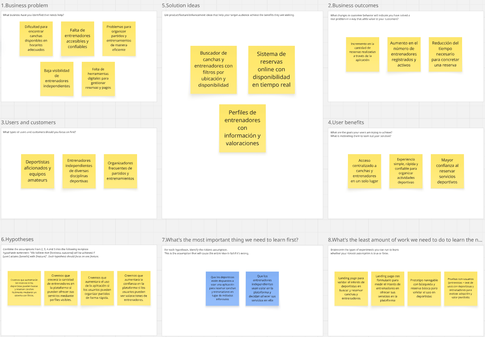

[Enlace al Lean UX Canvas en Miro](https://miro.com/welcomeonboard/d3htMStsWFVEUFhBY1NwdGlFR0RkekZjcHlJMUNKcU9TOVJ1U2E1S3ptSXE2QUMyU2RKYnFhRzZIdzFoZE1oNnFBT3pnbCtLaUZoc1NYRU5LY2FuNEJ2UXV1VEM4OWZ3bExlZWJiN0p4dlprbytlUkUvUytLT2h5Vjk0azB6RXJzVXVvMm53MW9OWFg5bkJoVXZxdFhRPT0hdjE=?share_link_id=265390215415)

## 1.3. Segmentos objetivo

La propuesta de valor de Courtly se dirige a dos segmentos principales dentro del ecosistema deportivo amateur. Estos segmentos han sido definidos considerando tanto las necesidades identificadas en el problema como el contexto actual de digitalización, en el cual el acceso a dispositivos móviles y tecnologías de la información permite la adopción de soluciones digitales para la organización de actividades deportivas.

En el Perú, el acceso a telefonía móvil alcanza a más del 95% de los hogares, lo que evidencia un alto nivel de conectividad y facilita el uso de aplicaciones móviles como principal canal de interacción para este tipo de servicios. Este contexto respalda la viabilidad de Courtly como una solución digital orientada al deporte amateur.

---

### 1. Deportistas aficionados (usuarios en búsqueda de canchas y entrenadores)

Este segmento está conformado principalmente por jóvenes y adultos entre 18 y 40 años que practican deporte de manera recreativa o amateur. En su mayoría, residen en zonas urbanas donde existe mayor disponibilidad de infraestructura deportiva y acceso a servicios digitales.

Incluye a equipos de amigos, comunidades deportivas y personas que organizan partidos de forma regular en su tiempo libre. Asimismo, abarca usuarios interesados en mejorar su rendimiento físico y técnico mediante el apoyo de entrenadores.

Estos usuarios suelen recurrir a herramientas digitales como redes sociales o aplicaciones de mensajería para coordinar sus actividades deportivas, lo que evidencia una necesidad de soluciones más estructuradas, confiables y eficientes. En este contexto, Courtly representa una alternativa que permite centralizar la búsqueda, reserva y organización de actividades deportivas en una sola plataforma.

---

### 2. Entrenadores independientes (proveedores de servicios deportivos)

Este segmento está compuesto por entrenadores personales y profesionales deportivos que ofrecen servicios en disciplinas como fútbol, tenis, pádel, básquet, vóley, entre otros. Generalmente, se trata de trabajadores independientes que gestionan sus actividades de manera autónoma.

En términos demográficos, este grupo está conformado por adultos jóvenes y adultos, usualmente entre 22 y 45 años, que operan principalmente en entornos urbanos donde existe mayor demanda por servicios deportivos personalizados.

Muchos de estos entrenadores utilizan redes sociales o contactos directos para promocionar sus servicios, lo que limita su alcance y dificulta la gestión organizada de sus reservas. En este sentido, requieren herramientas digitales que les permitan aumentar su visibilidad, estructurar su oferta de servicios y facilitar la coordinación con sus clientes.

Courtly responde a esta necesidad al ofrecer un espacio digital donde los entrenadores pueden presentar sus servicios, gestionar reservas y conectar con nuevos usuarios, contribuyendo a reducir la informalidad y mejorar la organización dentro del ecosistema deportivo amateur.

---

<div style="page-break-after:always;"></div>

# Capítulo II: Requirements Development and Software Solution Design

## 2.1. Competidores

En esta sección se identifican y analizan los principales competidores de la startup Mova, a través de su aplicación Courtly, con el objetivo de comprender el entorno competitivo y detectar oportunidades de diferenciación en el mercado de soluciones digitales para la gestión de actividades deportivas.

Se han seleccionado tres competidores relevantes que presentan modelos de negocio similares o parcialmente relacionados con la propuesta de valor de Courtly.

---

### 2.1.1. Análisis competitivo

<table>
  <tr>
    <th colspan="6" align="center">Competitive Analysis Landscape</th>
  </tr>
  <tr>
    <th>¿Por qué llevar a cabo este análisis?</th>
    <th colspan="5" align="center">¿Cómo se posicionan los competidores en el mercado de aplicaciones móviles deportivas y qué oportunidades existen para que Courtly se diferencie mediante una experiencia más rápida, intuitiva y centrada en el usuario?</th>
  </tr>
  <tr>
    <th>Categoría</th>
    <th>Subcategoría</th>
    <th>Courtly (Startup)</th>
    <th>Playtomic</th>
    <th>MATCHi</th>
    <th>RacketPal</th>
  </tr>
  <tr>
    <td></td>
    <td></td>
    <td align="center">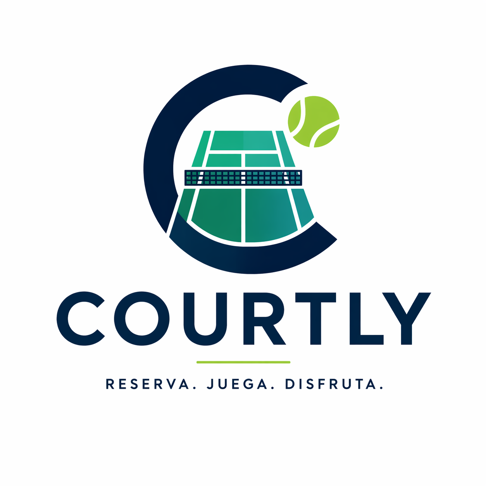</td>
    <td align="center"></td>
    <td align="center">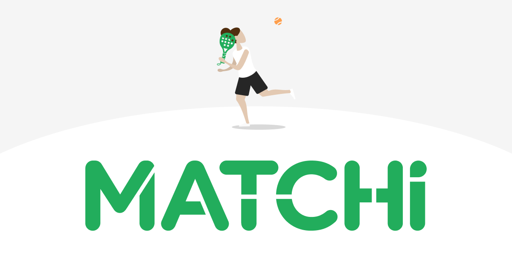</td>
    <td align="center"></td>
  </tr>
  <tr>
    <td>Perfil</td>
    <td>Overview</td>
    <td>Aplicación móvil orientada a facilitar la búsqueda, reserva y gestión de canchas deportivas en tiempo real, priorizando una experiencia rápida, intuitiva y centrada en el usuario.</td>
    <td>Aplicación móvil global que permite reservar canchas, encontrar jugadores y organizar partidos dentro de una comunidad activa.</td>
    <td>Aplicación móvil enfocada en la reserva de instalaciones deportivas y gestión de actividades para clubes y usuarios.</td>
    <td>Aplicación móvil orientada a conectar jugadores, organizar partidos y descubrir espacios deportivos cercanos.</td>
  </tr>
  <tr>
    <td>Perfil</td>
    <td>Ventaja competitiva / valor</td>
    <td>Experiencia mobile-first optimizada; flujo de reserva rápido; integración de servicios; sistema de reseñas.</td>
    <td>Gran base de usuarios, red internacional de canchas y funcionalidades sociales avanzadas.</td>
    <td>Versatilidad multi-deporte y herramientas de gestión para clubes deportivos.</td>
    <td>Enfoque en comunidad y emparejamiento de jugadores según nivel y ubicación.</td>
  </tr>
  <tr>
    <td>Perfil de Marketing</td>
    <td>Mercado objetivo</td>
    <td>Deportistas urbanos que buscan soluciones rápidas desde el móvil.</td>
    <td>Jugadores de deportes de raqueta a nivel global.</td>
    <td>Clubes deportivos y usuarios que practican distintas disciplinas.</td>
    <td>Deportistas amateurs que buscan compañeros de juego.</td>
  </tr>
  <tr>
    <td>Perfil de Marketing</td>
    <td>Estrategias de marketing</td>
    <td>Posicionamiento en simplicidad; confianza mediante reseñas; enfoque mobile.</td>
    <td>Construcción de comunidad global; alianzas con clubes y centros deportivos.</td>
    <td>Alianzas con clubes; enfoque en gestión integral de actividades.</td>
    <td>Marketing basado en comunidad y engagement entre usuarios.</td>
  </tr>
  <tr>
    <td>Perfil de Producto</td>
    <td>Productos &amp; Servicios</td>
    <td>Reserva de canchas; gestión de reservas; evaluación de servicios.</td>
    <td>Reserva de canchas; organización de partidos; ranking y comunidad.</td>
    <td>Reserva de instalaciones; gestión de membresías; organización de actividades.</td>
    <td>Búsqueda de jugadores; organización de partidos; descubrimiento de canchas.</td>
  </tr>
  <tr>
    <td>Perfil de Producto</td>
    <td>Precios &amp; Costos</td>
    <td>Modelo freemium (gratis + premium).</td>
    <td>Variable según ubicación y club.</td>
    <td>Variable según servicio y club.</td>
    <td>Modelo freemium.</td>
  </tr>
  <tr>
    <td>Perfil de Producto</td>
    <td>Canales de distribución</td>
    <td>Móvil (principal) y web.</td>
    <td>Móvil (iOS y Android).</td>
    <td>Móvil y web.</td>
    <td>Móvil (principal).</td>
  </tr>
  <tr>
    <td>Análisis SWOT</td>
    <td>Fortalezas</td>
    <td>Experiencia mobile-first, flujo de reserva más ágil e integración de servicios, lo que le permite diferenciarse de competidores con mayor complejidad operativa.</td>
    <td>Amplia red global de usuarios y canchas; funciones sociales que fortalecen la comunidad deportiva.</td>
    <td>Herramientas completas para clubes y gestión de actividades deportivas.</td>
    <td>Fuerte enfoque en comunidad y facilidad para encontrar jugadores compatibles.</td>
  </tr>
  <tr>
    <td>Análisis SWOT</td>
    <td>Debilidades</td>
    <td>Baja base inicial de usuarios y dependencia de la disponibilidad de canchas afiliadas.</td>
    <td>Interfaz con mayor complejidad y posibles fricciones en el proceso de reserva.</td>
    <td>Menor enfoque en experiencia del usuario individual; más orientado a organizaciones.</td>
    <td>No integra completamente reservas y pagos en todos los casos.</td>
  </tr>
  <tr>
    <td>Análisis SWOT</td>
    <td>Oportunidades</td>
    <td>Crecimiento del uso de apps móviles y digitalización del deporte amateur.</td>
    <td>Expansión en nuevos mercados y mejora de experiencia de usuario.</td>
    <td>Creciente digitalización de clubes deportivos.</td>
    <td>Expansión de la comunidad y nuevas funcionalidades sociales.</td>
  </tr>
  <tr>
    <td>Análisis SWOT</td>
    <td>Amenazas</td>
    <td>Competidores con mayor posicionamiento y base de usuarios.</td>
    <td>Nuevas apps con mejor experiencia de usuario.</td>
    <td>Soluciones más simples centradas en el usuario final.</td>
    <td>Plataformas integrales que combinen reservas, pagos y comunidad.</td>
  </tr>
</table>

---

#### Análisis e interpretación

El análisis competitivo muestra que el mercado de soluciones deportivas digitales presenta una oferta fragmentada. Por un lado, existen plataformas enfocadas principalmente en la reserva de canchas, como ATC y Serpar; por otro, propuestas especializadas en la contratación de entrenadores, como BuscaEntrenador. Esta fragmentación evidencia que, aunque ya existen alternativas digitales, varias de ellas resuelven solo una parte de la necesidad del usuario.

En ese escenario, Courtly se diferencia al proponer una experiencia centrada en el entorno móvil, con un flujo de búsqueda, reserva y gestión más ágil. Su principal valor competitivo no radica únicamente en ofrecer un servicio digital, sino en integrar funciones relevantes dentro de una experiencia más simple, rápida e intuitiva que la de soluciones con mayor fricción operativa o menor enfoque mobile-first.

Además, el análisis permite identificar una oportunidad clara en contextos donde los usuarios valoran la inmediatez, la facilidad de uso y la confianza al momento de realizar una reserva deportiva. Por ello, la propuesta de Courtly no solo compite por funcionalidad, sino también por calidad de experiencia, aspecto que puede convertirse en su principal ventaja competitiva frente a alternativas más rígidas, parciales o menos orientadas al usuario móvil.

---

### 2.1.2. Estrategias y tácticas frente a competidores

A partir del análisis competitivo realizado, se han definido estrategias y tácticas orientadas a posicionar a Courtly frente a aplicaciones móviles como Playtomic, MATCHi y RacketPal, respondiendo directamente a sus fortalezas, debilidades, oportunidades y amenazas.

---

#### Estrategias

**1. Diferenciación basada en experiencia mobile-first simplificada**

Frente a competidores como Playtomic, que ofrecen múltiples funcionalidades pero con mayor complejidad en la interacción, Courtly se enfocará en una experiencia más simple, rápida e intuitiva, reduciendo fricciones en el proceso de reserva.

---

**2. Generación de confianza mediante sistema de reseñas y transparencia**

Dado que los usuarios valoran recomendaciones y reseñas (identificado en entrevistas), Courtly incorporará valoraciones verificadas, respondiendo a la falta de transparencia presente en algunos competidores y fortaleciendo la confianza en la plataforma.

---

**3. Integración de funciones en una sola plataforma**

A diferencia de apps como RacketPal (enfocadas en comunidad) o MATCHi (orientadas a clubes), Courtly buscará integrar búsqueda, reserva, pagos y evaluación en un solo flujo, reduciendo la fragmentación del mercado.

---

**4. Aprovechamiento del crecimiento del mercado mobile**

Ante la oportunidad del aumento en el uso de aplicaciones móviles, Courtly se posicionará como una solución nativa digital, adaptada al comportamiento mobile-first del usuario moderno.

---

#### Tácticas

**1. Optimización del flujo de reserva en comparación con la competencia**

Se diseñará un proceso de reserva más corto que el de competidores actuales, minimizando pasos y tiempos de carga, lo que permitirá mejorar la conversión de usuarios.

---

**2. Implementación de sistema de reseñas post-servicio**

Se incentivará el feedback después de cada reserva, generando una base de confianza superior a la de plataformas donde la información es limitada o poco estructurada.

---

**3. Alianzas estratégicas para ampliar cobertura**

Se establecerán alianzas con complejos deportivos para competir con la amplia oferta de apps como Playtomic, incrementando la disponibilidad de canchas en la plataforma.

---

**4. Estrategias de retención basadas en experiencia de usuario**

Se aplicarán promociones, descuentos y beneficios dentro de la app para contrarrestar la fidelización de usuarios en plataformas ya posicionadas.

---

**5. Mejora continua basada en feedback del usuario**

Se utilizarán métricas y opiniones de usuarios para iterar el producto rápidamente, superando la lentitud de adaptación presente en algunos competidores.

---

##### Conclusión estratégica

Courtly tiene la oportunidad de posicionarse como una solución competitiva dentro del mercado de aplicaciones deportivas móviles al enfocarse en resolver las principales debilidades identificadas en la competencia: complejidad, fragmentación y falta de experiencia centrada en el usuario.

Al aprovechar el crecimiento del entorno mobile y priorizar simplicidad, confianza e integración de servicios, Courtly puede diferenciarse no solo por funcionalidad, sino por ofrecer una experiencia superior que responda directamente a las necesidades del usuario.

---

## 2.2. Entrevistas

En esta sección se presenta la investigación realizada mediante entrevistas a representantes de los segmentos objetivo de Courtly, con el fin de comprender sus hábitos deportivos, los problemas que enfrentan al organizar actividades y sus expectativas frente a una solución digital. Para ello, se consideraron dos segmentos principales: deportistas aficionados y entrenadores independientes, utilizando entrevistas semiestructuradas que permitieron recopilar tanto información objetiva como subjetiva, como datos demográficos, contexto personal, uso de tecnología, motivaciones, frustraciones y percepción de la propuesta. La información obtenida servirá como base para la construcción de arquetipos de usuario y para las siguientes etapas de análisis y definición de requisitos del proyecto.

---

### 2.2.1. Diseño de entrevistas

### Diseño de entrevistas para el segmento deportistas aficionados

En el caso de los deportistas aficionados, la entrevista fue diseñada para conocer cómo integran el deporte en su vida cotidiana, con qué frecuencia lo practican, cómo organizan actualmente sus partidos o reservas y qué tan cómodos se sienten utilizando herramientas digitales para esas tareas. Asimismo, se buscó identificar factores de confianza, métodos de pago preferidos, dispositivos utilizados y aspectos que podrían incentivar o desalentar el uso de una app como Courtly.

#### Preguntas principales y complementarias para deportistas aficionados

**Bloque 1: Datos demográficos y contexto personal**
- ¿Cómo te llamas?
- ¿Cuántos años tienes y en qué distrito vives actualmente?
- ¿A qué te dedicas hoy en día?
- ¿Vives solo o con tu familia?
- ¿Actualmente tienes pareja o estás soltero?

**Bloque 2: Relación con el deporte**
- ¿Cómo entra el deporte en tu vida?
- ¿Con qué frecuencia sueles practicar deporte actualmente?
- ¿Sueles hacerlo solo o con otras personas?
- ¿Qué es lo que más valoras al practicar deporte?

**Bloque 3: Organización de partidos y reservas**
- Cuando organizan un partido, ¿cómo hacen para conseguir cancha?
- ¿Qué tal te ha funcionado ese proceso?
- ¿Te ha pasado alguna experiencia incómoda al respecto?
- Cuando organizan partidos, ¿prefieres planificar con tiempo o hacerlo de manera más espontánea?
- Cuando eliges una cancha o servicio, ¿qué te genera confianza?

**Bloque 4: Tecnología y canales digitales**
- ¿Desde qué dispositivos sueles hacer estas coordinaciones?
- ¿Qué aplicaciones utilizas normalmente para organizarte?
- ¿Te consideras bueno organizando partidos o usando apps para coordinar?

**Bloque 5: Pagos y percepción de la solución**
- Si existiera una app donde puedas ver disponibilidad en tiempo real, reservar y pagar desde ahí, ¿la usarías?
- ¿Qué tendría que tener esa app para que realmente te sea útil?
- ¿Hay algo que te haría dejar de usar una app así?
- ¿Cómo sueles pagar actualmente cuando alquilas una cancha?
- ¿Te sentirías cómodo pagando dentro de una app?
- ¿Sigues alguna marca o contenido relacionado con el deporte?

#### Justificación del diseño para deportistas aficionados

Estas preguntas fueron seleccionadas porque permiten identificar elementos clave del comportamiento del segmento. Por un lado, recogen información objetiva como edad, distrito, ocupación y composición familiar; por otro, exploran aspectos subjetivos como la motivación para practicar deporte, el nivel de confianza al reservar, la tolerancia a fallos en una plataforma digital y la disposición a realizar pagos desde una aplicación.

Además, este diseño permite reconocer hábitos tecnológicos concretos, como el uso del celular, WhatsApp, Facebook, transferencia o Yape, así como preferencias relacionadas con claridad de precios, confirmación inmediata y seguridad. Todos estos factores son relevantes para definir las características del producto y para construir posteriormente el perfil del usuario aficionado que utilizaría Courtly.

---

### Diseño de entrevistas para el segmento entrenadores independientes

En el caso de los entrenadores independientes, la entrevista fue diseñada para comprender cómo desarrollan actualmente su actividad profesional, qué dificultades enfrentan para conseguir clientela, cómo gestionan sus reservas y qué herramientas utilizan para comunicarse, promocionarse y organizar su trabajo. También se buscó conocer su nivel de confianza en soluciones digitales, sus principales preocupaciones frente a una nueva plataforma y las funcionalidades que considerarían más valiosas dentro de Courtly.

#### Preguntas principales y complementarias para entrenadores independientes

**Bloque 1: Datos demográficos y contexto personal**
- ¿Cuál es tu nombre y apellidos?
- ¿Cuántos años tienes?
- ¿Cuál es tu lugar de nacimiento?

**Bloque 2: Relación con el deporte y contexto laboral**
- ¿Haces deporte a menudo?
- Si la respuesta anterior es sí, ¿dónde?
- ¿Tuviste que alquilar alguna vez una cancha? ¿Fue fácil?
- ¿Qué te motiva a seguir entrenando personas?

**Bloque 3: Captación de clientes y experiencia profesional**
- ¿Cuáles son los principales problemas que se te presentan al momento de conseguir clientela?
- ¿Ya posees una buena cantidad de clientes fieles?
- ¿Intentaste ya promocionarte desde el mundo digital?
- ¿Cómo describirías tu forma de trabajo?

**Bloque 4: Tecnología y comunicación**
- ¿Qué dispositivos utilizas con mayor frecuencia?
- ¿Qué aplicaciones utilizas para comunicarte con clientes?

**Bloque 5: Percepción de Courtly y expectativas**
- ¿Te gustaría ser capaz de promocionarte desde una aplicación fácil de utilizar?
- ¿Cuáles serían tus mayores preocupaciones al momento de ingresar en esta aplicación?
- ¿Qué funciones te gustaría que tenga la aplicación?
- ¿Sigues alguna marca o referente deportivo?

#### Justificación del diseño para entrenadores independientes

El diseño de preguntas para este segmento responde a la necesidad de entender al entrenador no solo como usuario de espacios deportivos, sino también como un actor que busca visibilidad, reputación y herramientas de gestión. Por ello, además de indagar en la dificultad para alquilar canchas, se incorporaron preguntas orientadas a conocer cómo consigue clientes, qué tan dependiente es de recomendaciones, qué tan útil le resulta el entorno digital actual y qué barreras percibe para adoptar una nueva aplicación.

Asimismo, este bloque permite obtener información importante para el diseño del producto, como la necesidad de perfiles profesionales, horarios visibles, pagos integrados, reseñas de alumnos y mayor orden en la coordinación de reservas. En conjunto, estas preguntas ayudan a construir un perfil más completo del entrenador independiente como usuario potencial de Courtly.

---

### Estructura aplicada en el diseño de entrevistas

En ambos segmentos, la estructura de preguntas siguió una lógica progresiva. Primero se abordaron temas personales y contextuales para generar confianza y conocer al entrevistado. Luego se profundizó en su relación con el deporte y en la manera en que actualmente resuelve sus necesidades. Finalmente, se exploró su experiencia con herramientas digitales y su percepción frente a una aplicación como Courtly.

Esta estructura permitió obtener entrevistas más naturales y mejor conectadas con los objetivos del proyecto, evitando preguntas aisladas y facilitando la recolección de información útil tanto para la validación de la problemática como para el diseño posterior de la solución.

---

### 2.2.2. Registro de entrevistas

En esta sección se presentan las entrevistas realizadas a representantes de los segmentos objetivo de **Courtly**. Para cada entrevista se incluye la información general del entrevistado, la evidencia audiovisual correspondiente y un resumen descriptivo de sus respuestas. El propósito de este registro es documentar de manera ordenada los hallazgos obtenidos, de modo que las características identificadas en los futuros arquetipos puedan trazarse directamente a la información recolectada.

- **URL del video:** [**link**](https://upcedupe-my.sharepoint.com/:v:/g/personal/u202214572_upc_edu_pe/IQDh0efpi-2rSrJaL5-em4T8ATBMyBh-bdU49hsRmGYVLx8?nav=eyJyZWZlcnJhbEluZm8iOnsicmVmZXJyYWxBcHAiOiJPbmVEcml2ZUZvckJ1c2luZXNzIiwicmVmZXJyYWxBcHBQbGF0Zm9ybSI6IldlYiIsInJlZmVycmFsTW9kZSI6InZpZXciLCJyZWZlcnJhbFZpZXciOiJNeUZpbGVzTGlua0NvcHkifX0&e=f3SvAK)

---

### Segmento 1: Deportistas aficionados

#### Entrevista N.° 1

- **Nombres y apellidos:** Xin Yu Shi Lin  
- **Edad:** 31 años  
- **Distrito de residencia:** Santiago de Surco  
- **Ocupación:** Analista administrativo en una empresa privada  
- **Estado civil:** Casado  
- **Composición familiar:** Vive con su esposa  
- **Inicio de la entrevista:** 0:03
- **Fin de la entrevista:** 3:50  

#### Registro visual de la entrevista


#### Resumen descriptivo de la entrevista

El entrevistado, Xin Yu Shi Lin, es un deportista aficionado de 31 años que reside en Santiago de Surco y trabaja como analista administrativo en una empresa privada. Comentó que el deporte forma parte de su rutina principalmente como una forma de liberar estrés después del trabajo, por lo que lo asocia más con bienestar personal y recreación que con competencia. Debido a sus responsabilidades laborales, no dispone de mucho tiempo libre y por ello suele practicar deporte solo una o dos veces por semana, sobre todo durante los fines de semana.

En cuanto a la forma en que participa en actividades deportivas, señaló que normalmente juega con amigos del trabajo o del barrio, lo que muestra que su experiencia deportiva está ligada al aspecto social. Cuando deben organizar un partido, indicó que el proceso para conseguir cancha suele depender de que alguien del grupo tenga un contacto previo o de búsquedas en Facebook, tras lo cual se comunican para consultar disponibilidad. Sin embargo, percibe este método como poco confiable, ya que suelen ocurrir demoras en la respuesta, cambios de último momento e incluso cancelaciones inesperadas. Como ejemplo, relató que una vez les cancelaron la reserva el mismo día, lo que obligó a reorganizar todo.

Respecto al uso de tecnología, comentó que realiza estas coordinaciones principalmente desde el celular, lo que confirma que su dispositivo principal de interacción es el smartphone. Las aplicaciones que más utiliza para organizarse son WhatsApp y, en algunas ocasiones, Facebook. También reconoció que no se considera especialmente hábil organizando partidos o usando aplicaciones para coordinar este tipo de actividades, por lo que prefiere que otra persona del grupo se encargue. Aun así, señaló que prefiere planificar con anticipación, especialmente por las exigencias de su trabajo.

Desde el punto de vista de sus motivaciones y expectativas, explicó que lo que más valora al practicar deporte es desestresarse y compartir tiempo con amigos. Al elegir una cancha o servicio, lo que más confianza le genera es que tenga buenas referencias o que alguien conocido ya la haya usado antes. Frente a la idea de Courtly, mostró una disposición positiva, afirmando que sí usaría una aplicación donde pueda ver disponibilidad en tiempo real, reservar y pagar desde un mismo lugar, ya que la consideraría más ordenada y práctica.

Además, indicó que para que una app de este tipo realmente le resulte útil debería ofrecer confirmación inmediata, precios claros y facilidad para reservar. También señaló que dejaría de usar una aplicación si esta no cumple lo que promete o presenta errores frecuentes, lo que revela una baja tolerancia a fallas en la experiencia digital. En relación con pagos, comentó que actualmente suele pagar por transferencia bancaria o Yape, y que sí se sentiría cómodo pagando dentro de una aplicación, siempre que esta sea segura. Finalmente, mencionó que sigue la marca Adidas y algunas páginas de fútbol, lo que muestra afinidad con marcas deportivas reconocidas y contenido relacionado con este ámbito.

#### Características identificadas a partir de la entrevista

- Practica deporte con una frecuencia moderada, principalmente los fines de semana.
- Se relaciona con el deporte como actividad de recreación, desestrés y socialización.
- Usa el celular como dispositivo principal.
- Utiliza WhatsApp y Facebook como principales canales digitales de coordinación.
- Tiene un nivel funcional de uso digital, pero no le gusta asumir el rol de organizador.
- Prefiere procesos planificados con anticipación.
- Valora la confianza, la confirmación inmediata, la claridad de precios y la seguridad en los pagos.
- Muestra disposición a usar una app de reservas si esta realmente simplifica el proceso.
- Tiene afinidad con Adidas y contenido relacionado con fútbol.

---

#### Entrevista N.° 2

- **Nombres y apellidos:** Diego Andrés Rojas Pérez  
- **Edad:** 24 años  
- **Distrito de residencia:** San Miguel  
- **Ocupación:** Estudiante universitario y trabajador de medio tiempo  
- **Estado civil:** Soltero  
- **Composición familiar:** Vive con sus padres y su hermana menor  
- **Inicio de la entrevista:** 0:02
- **Fin de la entrevista:** 5:36 


#### Registro visual de la entrevista


#### Resumen descriptivo de la entrevista

El entrevistado, Diego Andrés Rojas Pérez, es un deportista aficionado de 24 años que vive en San Miguel. Actualmente es estudiante universitario y también trabaja medio tiempo, por lo que combina sus actividades académicas y laborales con la práctica deportiva. Comentó que el deporte, especialmente el fútbol, forma parte de su vida desde la etapa escolar y que hoy sigue presente en su rutina como una forma de despejarse, relajarse y mantenerse activo. Suele practicar deporte entre dos y tres veces por semana, dependiendo del tiempo que tenga disponible.

Señaló que casi siempre juega con amigos, lo que muestra que su experiencia deportiva está estrechamente vinculada a la socialización. En cuanto a la organización de partidos, explicó que normalmente buscan opciones de cancha en internet o a partir de recomendaciones de conocidos, y luego se comunican por WhatsApp o llamada para consultar disponibilidad. Sin embargo, percibe este proceso como poco confiable y desordenado, ya que en ocasiones no reciben respuesta, reciben confirmaciones erróneas o descubren al llegar que la cancha ya está ocupada. De hecho, relató una experiencia incómoda en la que él y su grupo perdieron tiempo porque la reserva no fue respetada.

En el ámbito tecnológico, indicó que realiza todas estas coordinaciones desde el celular, lo que confirma que este es su dispositivo principal. Las aplicaciones que utiliza con mayor frecuencia para organizar partidos son WhatsApp y, en algunos casos, Instagram, sobre todo para explorar opciones de canchas. A diferencia de otros usuarios menos participativos en la coordinación, Diego señaló que normalmente él asume el rol de organizar con sus amigos, por lo que se considera bastante acostumbrado a usar aplicaciones y medios digitales para estos fines. También mencionó que suele planificar los partidos de forma más espontánea, ya que muchas veces coordinan el mismo día o un día antes.

Respecto a lo que valora al practicar deporte, comentó que para él lo más importante es pasarla bien con sus amigos, relajarse y mantenerse activo. Cuando debe elegir una cancha o un servicio, afirmó que lo que más confianza le genera son las buenas recomendaciones, que alguien conocido ya la haya usado antes o poder revisar comentarios y fotos. Frente a la propuesta de Courtly, mostró una actitud claramente positiva y señaló que sí utilizaría una aplicación que le permita ver disponibilidad en tiempo real, reservar y pagar desde un mismo lugar, porque lo consideraría mucho más práctico.

Además, precisó que una app de este tipo le resultaría realmente útil si fuera fácil de usar, si mostrara información real, si permitiera consultar la disponibilidad al instante, realizar pagos seguros y ver reseñas de otros usuarios. También mencionó que dejaría de usarla si presentara fallas, si no respetara las reservas o si fuera complicada de utilizar. En cuanto a pagos, señaló que actualmente suele pagar por Yape o en efectivo, y que sí se sentiría cómodo pagando dentro de una app siempre que la perciba como segura y confiable. Finalmente, indicó que sigue marcas deportivas como Nike y Adidas, además de páginas de fútbol en redes sociales, lo que muestra afinidad con contenido deportivo digital y marcas reconocidas del sector.

#### Características identificadas a partir de la entrevista

- Practica deporte con frecuencia moderada, entre dos y tres veces por semana.
- Vincula el deporte con recreación, relajación y socialización.
- Usa el celular como dispositivo principal de coordinación.
- Utiliza WhatsApp e Instagram como canales digitales relacionados con la organización de partidos y búsqueda de opciones.
- Tiene mayor iniciativa organizativa que otros usuarios, ya que suele encargarse de coordinar con su grupo.
- Prefiere coordinar de forma más espontánea, incluso el mismo día o un día antes.
- Valora especialmente la disponibilidad real, la facilidad de uso, las reseñas, la seguridad en el pago y el respeto de las reservas.
- Está dispuesto a usar una app como Courtly si esta reduce el desorden actual del proceso.
- Tiene afinidad con marcas como Nike y Adidas, así como con páginas de fútbol en redes sociales.
---

#### Entrevista N.° 3

- **Nombres y apellidos:** Pedro Luis Medina Vera  
- **Edad:** 20 años  
- **Distrito de residencia:** Los Olivos  
- **Ocupación:** Estudiante universitario  
- **Estado civil:** Soltero  
- **Composición familiar:** Vive con sus padres  
- **Inicio de la entrevista:** 0:00
- **Fin de la entrevista:** 3:20     

#### Registro visual de la entrevista


#### Resumen descriptivo de la entrevista

El entrevistado, Pedro Luis Medina Vera, es un deportista aficionado de 20 años que reside en Los Olivos y actualmente es estudiante universitario. Mencionó que el deporte forma parte de su vida principalmente como una actividad recreativa, orientada a la diversión y al tiempo libre con amigos. A diferencia de otros perfiles más constantes, su frecuencia de práctica es menor, ya que suele jugar una vez por semana o incluso con menor regularidad, dependiendo de su disponibilidad.

Indicó que siempre practica deporte en grupo, lo que refuerza el carácter social de su participación. En cuanto a la organización de partidos, explicó que muchas veces se coordina de manera espontánea, ya sea buscando canchas en el momento o preguntando directamente en espacios deportivos cercanos. Sin embargo, este método le ha resultado poco eficiente, ya que en varias ocasiones no han encontrado disponibilidad, lo que les ha impedido jugar. Comentó que ha tenido experiencias incómodas en las que, pese a tener intención de jugar, no lograron conseguir una cancha libre.

Desde el punto de vista tecnológico, señaló que utiliza el celular como principal dispositivo para coordinar, y que la aplicación que más emplea es WhatsApp. A diferencia de otros perfiles más activos en la organización, Pedro indicó que no suele encargarse de coordinar partidos, sino que normalmente se suma a lo que organizan otros, lo que evidencia un rol más pasivo dentro del grupo. Asimismo, manifestó que prefiere una organización espontánea, más que una planificación anticipada.

En relación con sus motivaciones, indicó que lo que más valora al practicar deporte es divertirse y pasar el rato, lo que refuerza su perfil recreativo. Al momento de elegir una cancha o servicio, lo que más confianza le genera es que esta sea recomendada por alguien conocido. Frente a la propuesta de Courtly, mostró interés en una aplicación que permita ver disponibilidad en tiempo real, reservar y pagar desde un mismo lugar, ya que considera que esto facilitaría el proceso actual.

Además, señaló que una app de este tipo debería ser rápida y fácil de usar para resultarle realmente útil. También indicó que dejaría de usarla si fuera complicada o si no funcionara correctamente, lo que muestra una baja tolerancia a problemas de usabilidad o fallas técnicas. En cuanto a pagos, mencionó que actualmente utiliza efectivo o Yape, y que se sentiría cómodo realizando pagos dentro de una aplicación. Finalmente, señaló que sigue marcas deportivas como Nike y páginas de fútbol, lo que refleja afinidad con contenido digital deportivo y marcas reconocidas.

#### Características identificadas a partir de la entrevista

- Practica deporte de forma ocasional, generalmente una vez por semana o menos.
- Tiene una motivación principalmente recreativa, enfocada en la diversión y socialización.
- Usa el celular como dispositivo principal.
- Utiliza WhatsApp como principal canal de coordinación.
- Tiene un rol pasivo en la organización de actividades deportivas.
- Prefiere procesos espontáneos en lugar de planificación anticipada.
- Enfrenta problemas frecuentes de disponibilidad de canchas.
- Valora la rapidez, la facilidad de uso y la disponibilidad en tiempo real.
- Está dispuesto a usar una app como Courtly si simplifica el proceso.
- Usa métodos de pago como efectivo y Yape, y acepta pagos digitales.
- Tiene afinidad con marcas como Nike y contenido de fútbol.

---

### Segmento 2: Entrenadores independientes

#### Entrevista N.° 1

- **Nombres y apellidos:** Julio César Falcón Bustamante  
- **Edad:** 28 años  
- **Distrito de residencia:** Carabayllo, Lima  
- **Ocupación:** Entrenador independiente (entrenamientos personalizados)  
- **Estado civil:** **Por completar**  
- **Composición familiar:** Vive con su esposa  
- **Inicio de la entrevista:** 0:03
- **Fin de la entrevista:** 4:23 


#### Registro visual de la entrevista


#### Resumen descriptivo de la entrevista

El entrevistado, Julio César Falcón Bustamante, es un entrenador independiente de 28 años, nacido en Carabayllo (Lima), que se dedica a brindar entrenamientos personalizados. Su actividad profesional está directamente vinculada al deporte, ya que lo practica de manera constante no solo como rutina personal, sino también como parte de su trabajo. Comentó que suele realizar entrenamientos tanto en un espacio acondicionado en su hogar como en servicios a domicilio, lo que muestra flexibilidad en su forma de trabajo.

En relación con el uso de espacios deportivos, indicó que ha tenido que alquilar canchas en múltiples ocasiones. Sin embargo, este proceso no siempre resulta sencillo, ya que necesita encontrar lugares que cumplan con ciertos requisitos para poder instalar su equipo de entrenamiento. Esto evidencia una limitación en la disponibilidad y adecuación de espacios para entrenadores independientes.

Respecto a la captación de clientes, señaló que uno de sus principales problemas es la coordinación de horarios y detalles de entrenamiento, lo cual le demanda mucho tiempo. A pesar de ello, mencionó que cuenta con una buena cantidad de clientes fieles, principalmente gracias a recomendaciones de amigos, familiares y vecinos, lo que indica que su crecimiento depende en gran medida del boca a boca.

En el ámbito digital, indicó que ya utiliza plataformas como Instagram y TikTok para promocionarse, trabajando en conjunto con su esposa, lo que le permite mantener visibilidad en redes sociales. No obstante, mostró interés en contar con una aplicación adicional que le permita potenciar su presencia y organización, señalando que una app como Courtly sería un “plus” a las herramientas que ya utiliza.

En cuanto a sus preocupaciones, destacó la importancia de que la aplicación realmente simplifique los procesos de búsqueda, coordinación y gestión, además de considerar la seguridad, tanto a nivel personal como familiar. Sobre las funcionalidades deseadas, mencionó que le gustaría contar con un dashboard con analíticas mensuales, lo que indica interés en herramientas que le permitan evaluar su desempeño y crecimiento dentro de la plataforma.

#### Características identificadas a partir de la entrevista

- Practica deporte de forma constante como parte de su trabajo.
- Ofrece entrenamientos personalizados en casa y a domicilio.
- Ha experimentado dificultades para encontrar espacios adecuados para entrenar.
- Depende principalmente de recomendaciones para conseguir clientes.
- Tiene presencia activa en redes sociales como Instagram y TikTok.
- Busca optimizar la coordinación de horarios y servicios.
- Valora herramientas que le permitan medir su desempeño (dashboard y analíticas).
- Tiene apertura a nuevas plataformas digitales que complementen su trabajo.
- Considera importante la seguridad y la simplicidad de uso en una aplicación.
---

#### Entrevista N.° 2

- **Nombres y apellidos:** Jose Luis Quispe Huaman  
- **Edad:** 29 años  
- **Distrito de residencia:** Lima (Los Olivos / Comas)  
- **Ocupación:** Entrenador independiente  
- **Estado civil:** **Por completar**  
- **Composición familiar:** **Por completar**  
- **Inicio de la entrevista:** 0:03
- **Fin de la entrevista:** 7:03 

#### Registro visual de la entrevista


#### Resumen descriptivo de la entrevista

El entrevistado, Jose Luis Quispe Huaman, es un entrenador independiente de 29 años que reside en Lima y desarrolla su actividad principalmente en distritos como Los Olivos y Comas. Señaló que el deporte forma parte fundamental de su vida diaria, ya que entrena todos los días no solo como parte de su trabajo, sino también como un hábito personal que le permite mantenerse activo y dar un buen ejemplo a sus alumnos.

En relación con el uso de espacios deportivos, indicó que ha tenido que alquilar canchas en diversas ocasiones, pero que este proceso suele ser complicado. Comentó que muchas veces enfrenta problemas como falta de respuesta, cambios inesperados en la disponibilidad o desorganización en la coordinación, ya que todo se gestiona a través de llamadas o WhatsApp, lo que vuelve el proceso poco confiable y desordenado. Esto evidencia una fuerte dependencia de canales informales y una falta de sistemas estructurados para la gestión de reservas.

Respecto a la captación de clientes, mencionó que uno de sus principales problemas es la falta de visibilidad, ya que depende en gran medida de recomendaciones. Explicó que, si un cliente potencial no lo conoce o no recibe una referencia, es difícil generar confianza. Además, indicó que no cuenta con un espacio adecuado donde pueda mostrar de forma organizada su experiencia, especialidad, horarios, precios o reseñas de otros alumnos. Aunque tiene algunos clientes recurrentes, señaló que no son completamente constantes, por lo que necesita seguir buscando nuevos clientes de manera continua.

En el ámbito digital, comentó que ha intentado promocionarse mediante redes sociales y estados de WhatsApp, pero con resultados limitados. Indicó que, aunque puede tener cierta visibilidad, no siempre logra convertir ese alcance en reservas reales. En este sentido, mostró interés en una aplicación como Courtly, ya que le permitiría mostrar sus servicios de manera más estructurada, llegar a más personas y proyectar una imagen más profesional.

En cuanto a sus preocupaciones, destacó que una de las principales sería que la aplicación no tenga suficientes usuarios, lo que limitaría las oportunidades de conseguir clientes. También mencionó la importancia de que la app sea segura y fácil de usar. Sobre las funcionalidades deseadas, señaló que le gustaría contar con un perfil completo donde pueda mostrar su experiencia, horarios y reseñas, así como opciones de reservas y pagos integrados.

Desde el punto de vista tecnológico, indicó que utiliza exclusivamente el celular como herramienta principal para su trabajo, ya que le permite coordinar rápidamente con clientes y gestionar su día a día. La aplicación que más utiliza es WhatsApp, debido a su rapidez y facilidad de uso. Además, describió su forma de trabajo como práctica y adaptable, aunque reconoce que carece de herramientas que le permitan organizar mejor sus horarios, reservas y pagos.

Finalmente, señaló que su principal motivación para seguir entrenando es ayudar a otros a mejorar, ver su progreso y generar un impacto positivo en sus alumnos. También mencionó que sigue marcas como Nike y contenido relacionado con entrenamiento y fútbol, lo que demuestra afinidad con el ecosistema deportivo y consumo de contenido digital especializado.

#### Características identificadas a partir de la entrevista

- Practica deporte de manera constante como parte de su trabajo y estilo de vida.
- Trabaja en múltiples ubicaciones (Los Olivos y Comas).
- Depende de canales informales como WhatsApp para coordinar.
- Presenta dificultades en la gestión de reservas y disponibilidad de canchas.
- Tiene baja visibilidad y depende de recomendaciones para captar clientes.
- Usa redes sociales, pero con bajo nivel de conversión a clientes reales.
- Utiliza el celular como único dispositivo de trabajo.
- Tiene una forma de trabajo práctica y adaptable, pero poco estructurada.
- Valora herramientas que le permitan organizar mejor su trabajo (reservas, pagos, horarios).
- Busca proyectar una imagen más profesional.
- Tiene afinidad con marcas como Nike y contenido deportivo digital.

---

#### Entrevista N.° 3

- **Nombres y apellidos:** Cesjhoan Feliu   
- **Edad:** 25 años
- **Distrito de residencia:** Bogotá, Colombia  
- **Ocupación:** Entrenador de pádel  
- **Estado civil:** Casado  
- **Composición familiar:** Vive con su pareja 
- **Inicio de la entrevista:** 0:01
- **Fin de la entrevista:** 7:19 


#### Registro visual de la entrevista


#### Resumen descriptivo de la entrevista

El entrevistado es un entrenador personal con aproximadamente 4 años de experiencia, especializado en entrenamiento funcional, preparación física para fútbol y rutinas de gimnasio. Su jornada laboral inicia desde las 6:00 a.m. y se extiende hasta la noche, con horarios fragmentados que combinan clases, tiempos de espera y coordinación con alumnos, lo que evidencia una carga operativa intensa y poco optimizada.

Actualmente maneja entre 12 y 15 alumnos activos por semana, combinando clases grupales y personalizadas. Uno de los principales problemas que enfrenta en su día a día es la gestión de espacios deportivos, ya que cuando no cuenta con un lugar fijo debe coordinar manualmente la disponibilidad de canchas. Este proceso implica contactar a múltiples administradores vía WhatsApp, esperar respuestas y luego validar horarios con el cliente, lo que resulta lento, desordenado y poco eficiente.

Además, ha experimentado problemas críticos en reservas, como errores en la asignación de horarios por parte de los administradores, lo que afecta directamente su reputación profesional. En una ocasión, una reserva no fue respetada y tuvo que improvisar la clase en un parque, generando una experiencia negativa para el cliente.

En cuanto a los criterios de selección de espacios, prioriza la **ubicación, la seguridad del lugar y el estado de la infraestructura, además de considerar el precio para no afectar su margen de ganancia. Respecto a la organización de su trabajo, utiliza el calendario del celular y notas físicas, aunque reconoce que este sistema es propenso a errores, especialmente cuando hay cambios o cancelaciones de último momento.

La gestión de cancelaciones también representa un problema importante, ya que si un alumno cancela tarde, el entrenador puede perder el dinero de la cancha o asumir penalidades. En términos de pagos, utiliza métodos digitales como Yape, Plin y transferencias, manejando paquetes de sesiones, aunque considera tedioso el seguimiento manual de pagos y deudas.

Para generar confianza con nuevos clientes, indicó que estos suelen pedir información sobre tarifas, ubicación, fotos o videos de entrenamientos, lo que demuestra la importancia de contar con un perfil profesional bien estructurado. En este sentido, expresó que una de las tareas que más le gustaría eliminar es la búsqueda manual de disponibilidad de canchas, proponiendo como solución ideal un sistema donde pueda ver un calendario y reservar directamente.

Respecto a Courtly, señaló que sus principales preocupaciones serían la retención de pagos dentro de la app y la falta de confiabilidad en las reservas. También indicó que dejaría de usar la aplicación si presenta fallas constantes. En cuanto a funcionalidades deseadas, destacó la importancia de contar con estadísticas como ingresos mensuales, número de clases realizadas y análisis de horarios más demandados, lo que le permitiría mejorar su organización.

Finalmente, mencionó que otro problema relevante es la falta de información previa sobre lo que incluye el alquiler de una cancha, como materiales disponibles, lo que afecta la planificación de sus sesiones.

#### Características identificadas a partir de la entrevista

- Cuenta con experiencia profesional (4 años) como entrenador.
- Maneja múltiples alumnos y horarios fragmentados.
- Depende de WhatsApp para coordinar reservas (proceso ineficiente).
- Presenta problemas frecuentes con disponibilidad y confiabilidad de canchas.
- Ha tenido experiencias negativas que afectan su imagen profesional.
- Usa herramientas básicas (calendario + notas), con riesgo de errores.
- Enfrenta pérdidas económicas por cancelaciones y mala gestión.
- Utiliza pagos digitales (Yape, Plin, transferencias).
- Necesita mejorar el control de ingresos y clientes.
- Valora la automatización de reservas (calendario en tiempo real).
- Busca herramientas de analítica y gestión de negocio.
- Tiene baja tolerancia a fallas técnicas o problemas de confianza.

### 2.2.3. Análisis de entrevistas


En esta sección se presenta el análisis de la información recopilada a partir de las entrevistas realizadas a los segmentos objetivo de Courtly. Nuestro objetivo es identificar patrones comunes tanto en características objetivas como subjetivas, sustentados mediante cuadros y porcentajes, que permitan construir los arquetipos de usuario de manera fundamentada.

---

#### Análisis del Segmento 1: Deportistas aficionados

A partir de las 3 entrevistas realizadas, se identificaron patrones claros en comportamiento, uso de tecnología, motivaciones y problemas actuales al organizar actividades deportivas.

#### 1. Frecuencia de práctica deportiva

| Frecuencia | Cantidad | Porcentaje |
|----------|--------|------------|
| 1 vez por semana o menos | 1 | 33% |
| 1-2 veces por semana | 1 | 33% |
| 2-3 veces por semana | 1 | 33% |

**Análisis:**  
El segmento presenta una práctica deportiva moderada, principalmente concentrada en fines de semana o tiempos libres. Esto evidencia que el deporte no es una actividad principal, sino complementaria a estudios o trabajo.

---

#### 2. Forma de organización de partidos

| Tipo de organización | Cantidad | Porcentaje |
|----------------------|--------|------------|
| Espontánea | 2 | 67% |
| Planificada | 1 | 33% |

**Análisis:**  
La mayoría de usuarios prefiere una organización espontánea, lo que implica la necesidad de soluciones rápidas y en tiempo real.

---

#### 3. Problemas en la reserva de canchas

| Problema identificado | Cantidad | Porcentaje |
|----------------------|--------|------------|
| Falta de disponibilidad | 2 | 67% |
| Desorganización / mala coordinación | 2 | 67% |
| Cancelaciones o errores en reservas | 2 | 67% |

**Análisis:**  
Existe una clara insatisfacción con los métodos actuales, evidenciando un problema estructural en la gestión de reservas.

---

#### 4. Uso de tecnología

| Elemento | Cantidad | Porcentaje |
|----------|--------|------------|
| Uso de celular | 3 | 100% |
| Uso de WhatsApp | 3 | 100% |
| Uso de redes sociales (Facebook/Instagram) | 2 | 67% |

**Análisis:**  
El segmento es completamente mobile-first, con alta dependencia de herramientas informales.

---

#### 5. Rol en la organización

| Rol | Cantidad | Porcentaje |
|-----|--------|------------|
| Organizador activo | 1 | 33% |
| Participante pasivo | 2 | 67% |

**Análisis:**  
La mayoría no quiere encargarse de coordinar, lo que refuerza la necesidad de automatización.

---

#### 6. Factores de confianza

| Factor | Cantidad | Porcentaje |
|--------|--------|------------|
| Recomendaciones | 3 | 100% |
| Reseñas | 2 | 67% |
| Información clara | 2 | 67% |

---

#### 7. Disposición a usar Courtly

| Respuesta | Cantidad | Porcentaje |
|----------|--------|------------|
| Sí usaría la app | 3 | 100% |

---

#### 8. Características más valoradas en la app

- Confirmación inmediata → 67%  
- Facilidad de uso → 100%  
- Disponibilidad en tiempo real → 100%  
- Seguridad en pagos → 100%  

---

### Conclusión del Segmento 1

Los deportistas aficionados presentan un perfil social, recreativo y mobile-first, con una fuerte dependencia de herramientas informales como WhatsApp. El principal problema identificado es la ineficiencia en la reserva de canchas, caracterizada por desorganización, falta de disponibilidad y poca confiabilidad.

Existe una alta disposición a adoptar una solución como Courtly, siempre que esta sea **rápida, simple, confiable y segura**.

---

### Análisis del Segmento 2: Entrenadores independientes

A partir de las entrevistas realizadas, se identificaron patrones relacionados con gestión operativa, captación de clientes y uso de tecnología.

---

#### 1. Experiencia profesional

| Nivel de experiencia | Cantidad | Porcentaje |
|---------------------|--------|------------|
| Más de 3 años | 2 | 67% |
| Variable / no especificado | 1 | 33% |

---

#### 2. Principales problemas identificados

| Problema | Cantidad | Porcentaje |
|----------|--------|------------|
| Coordinación de horarios | 3 | 100% |
| Búsqueda de canchas | 3 | 100% |
| Dependencia de WhatsApp | 3 | 100% |
| Falta de visibilidad | 2 | 67% |
| Problemas en reservas | 2 | 67% |

---

#### 3. Uso de tecnología

| Elemento | Cantidad | Porcentaje |
|----------|--------|------------|
| Uso de celular como principal herramienta | 3 | 100% |
| Uso de WhatsApp | 3 | 100% |
| Uso de redes sociales | 2 | 67% |

---

#### 4. Captación de clientes

| Método | Cantidad | Porcentaje |
|--------|--------|------------|
| Recomendaciones | 3 | 100% |
| Redes sociales | 2 | 67% |

---

#### 5. Gestión del trabajo

| Característica | Cantidad | Porcentaje |
|--------------|--------|------------|
| Uso de herramientas básicas (notas/calendario) | 2 | 67% |
| Falta de sistema organizado | 3 | 100% |

---

#### 6. Problemas económicos

| Problema | Cantidad | Porcentaje |
|----------|--------|------------|
| Pérdidas por cancelaciones | 2 | 67% |
| Dificultad para gestionar pagos | 2 | 67% |

---

#### 7. Disposición a usar Courtly

| Respuesta | Cantidad | Porcentaje |
|----------|--------|------------|
| Sí usaría la app | 3 | 100% |

---

#### 8. Funcionalidades más valoradas

- Reservas automatizadas → 100%  
- Perfil profesional → 100%  
- Pagos integrados → 100%  
- Dashboard / analíticas → 67%  

---

### Conclusión del Segmento 2

Los entrenadores independientes presentan un perfil operativo, multitarea y altamente dependiente del celular, con procesos poco estructurados y basados en herramientas informales como WhatsApp.

El principal problema identificado es la ineficiencia en la gestión de reservas y clientes, lo que impacta directamente en su tiempo, ingresos y reputación profesional.

Existe una clara oportunidad para Courtly de posicionarse como una solución integral que permita:
- centralizar reservas,
- mejorar visibilidad,
- automatizar pagos,
- y optimizar la gestión del negocio.

---

### Conclusión general del análisis

Ambos segmentos coinciden en un punto crítico: la falta de digitalización estructurada en la organización de actividades deportivas.

Mientras los deportistas enfrentan desorden y poca confiabilidad, los entrenadores enfrentan problemas de gestión, tiempo y monetización. Esta coincidencia valida la propuesta de Courtly como una solución que conecta ambos lados del mercado, generando valor mediante eficiencia, confianza y centralización de procesos.

---

## 2.3. Needfinding

### 2.3.1. User Personas

En esta sección se presentan los User Personas definidos a partir del análisis de entrevistas realizada. Estos representan a cada segmento objetivo identificado para nuestra solución: Deportistas Aficionados y Entrenadores Independientes. Con esto, se nos permite comprender mejor las necesidades, comportamientos y motivaciones de los usuarios, facilitando el diseño de una solución alineada a sus expectativas.

**Deportistas Aficionados:**


**Entrenadores Independientes:**


### 2.3.2. User Task Matrix

En esta sección se presenta el User Task Matrix construido a partir de los User Persona, quienes representan a cada segmento objetivo identificado. En este se listan las tareas realizadas por estos usuarios basado en el análisis de entrevistas, cada una fue evaluada según su frecuencia y nivel de importancia para los respectivos perfiles.

| Actividades | Frecuencia (Diego Rojas) | Importancia (Diego Rojas) | Frecuencia (César Falcón) | Importancia (César Falcón) |
| ----------- | ------------------------ | ------------------------- | ------------------------- | -------------------------- |
| Buscar canchas disponibles según la ubicación | Alta | Alta | Media | Media |
| Comparar precios y horarios | Alta | Alta | Baja | Media |
| Reservar espacios deportivos | Alta | Alta | Media | Alta |
| Coordinar partidos o entrenamientos | Alta | Alta | Alta | Alta |
| Evaluar calidad y servicios del espacio deportivo | Media | Alta | Media | Media |
| Coordinar horarios con el dueño | Alta | Alta | Alta | Alta |
| Buscar entrenadores o clases | Media | Alta | Baja | Baja |
| Realizar pago por alquiler | Alta | Alta | Alta | Alta |
| Promocionar servicios deportivos | Baja | Baja | Alta | Alta |
| Gestionar horarios y disponibilidad | Baja | Media | Alta | Alta |
| Administrar clientes/alumnos | Baja | Baja | Alta | Alta |
| Fidelizar o mantener clientes | Baja | Media | Alta | Alta |

**Análisis:**

A partir de la tabla anterior, podemos identificar las tareas más críticas según el rol de cada usuario. Los deportistas aficionados se enfocan en tareas que les permita organizar sus partidos de forma rápida y sin complicaciones con actividades como la búsqueda de canchas, comparar opciones, reservar y coordinar con sus amigos. Por otro lado, los entrenadores independientes están más centrados en coordinar entrenamientos, gestionar horarios, manejar pagos, administrar clientes y promocionar sus servicios. Su necesidad principal es ordenar y hacer crecer su actividad como un negocio.

Ambos coinciden en tareas clave como coordinar actividades, comunicarse y gestionar pagos. Pero la diferencia principal está en el enfoque: mientras unos consumen el servicio, otros lo gestionan y monetizan. Por eso, la solución debe ser rápida y sencilla para unos, pero más completa y organizada para otros.

### 2.3.3. User Journey Mapping

En esta sección se presentan los User Journey Maps donde se describe el proceso actual que siguen nuestros User Personas para lograr su objetivo sin contar aún con una solución tecnológica integrada, mostrando los puntos críticos, emociones, tareas clave y oportunidades de mejora. Estos recorridos nos permiten entender los desafíos que enfrentan los usuarios día a día.

**Deportistas Aficionados:**


**Entrenadores Independientes:**


### 2.3.4. Empathy Mapping

En esta sección se presentan los Empathy Mappings. Estos nos ayudarán a comprender las experiencias, emociones y pensamientos que expresan los usuarios de cada segmento objetivo.

**Deportistas Aficionados:**


**Entrenadores Independientes:**


### 2.3.5. Big Picture EventStorming

En esta sección se presenta el trabajo realizado durante la sesión de Big Picture Event Storming, enfocada en comprender el dominio general del negocio. Para ello se utilizaron post-its en LucidChart para mapear los eventos significativos que ocurren en el flujo operativo. A través de este proceso, se nos permitió identificar procesos clave, actores involucrados, relaciones entre eventos y oportunidades de mejora para el desarrollo de nuestra solución.

Para este proceso se siguieron los siguientes Steps (Pasos):

1. **Preparing the room:** Se organizó una reunión con los miembros del equipo a través de Discord.

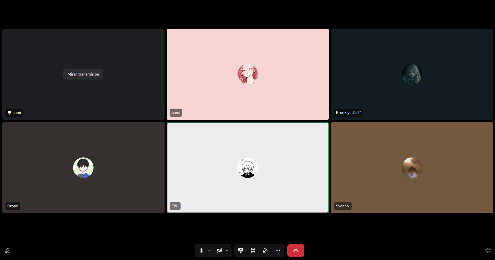

2. **Energizing the audience:** Se realizó una breve dinámica inicial para incentivar la participación activa de todos los miembros del equipo.

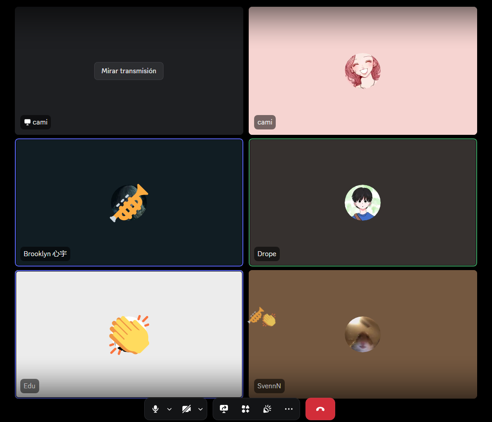

3. **Briefing and presenting the plan:** Se explicó la dinámica de Event Storming y se presentó la agenda de la sesión para identificar los eventos claves y comprender el flujo del negocio de nuestra solución.

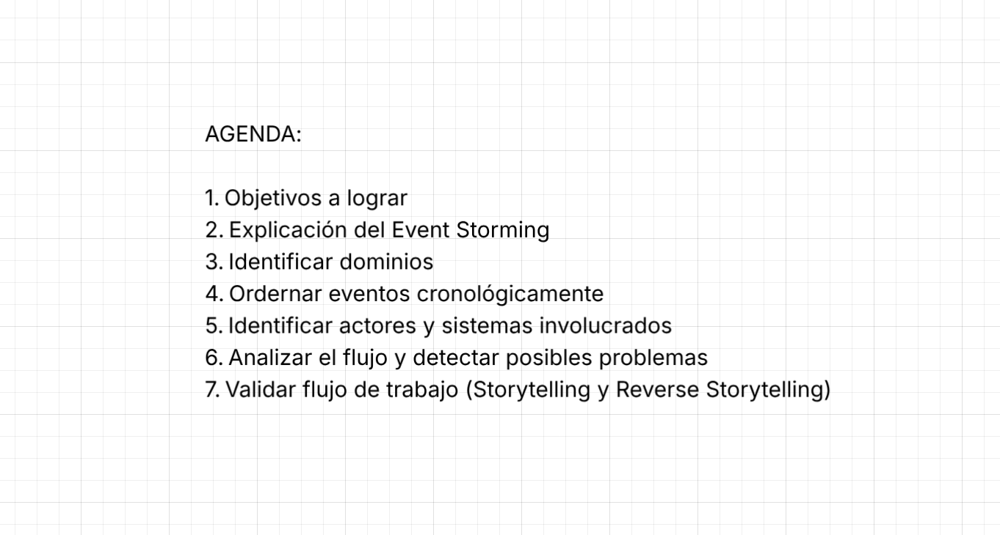

4. **Generating Domain Events:** Se identificó y registró los eventos más importantes del dominio en una lluvia de ideas. Estos eventos permitieron visualizar de manera general las acciones más relevantes que forman parte de la experiencia actual de los usuarios.

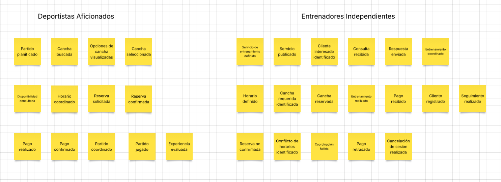

5. **Sorting Domain Events:** Los eventos identificados en el paso anterior fueron ordenados cronológicamente, desde el inicio hasta el final del flujo. Esto permitió comprender mejor cómo se desarrolla el proceso, identificando la secuencia natural de acciones que siguen nuestros usuarios.

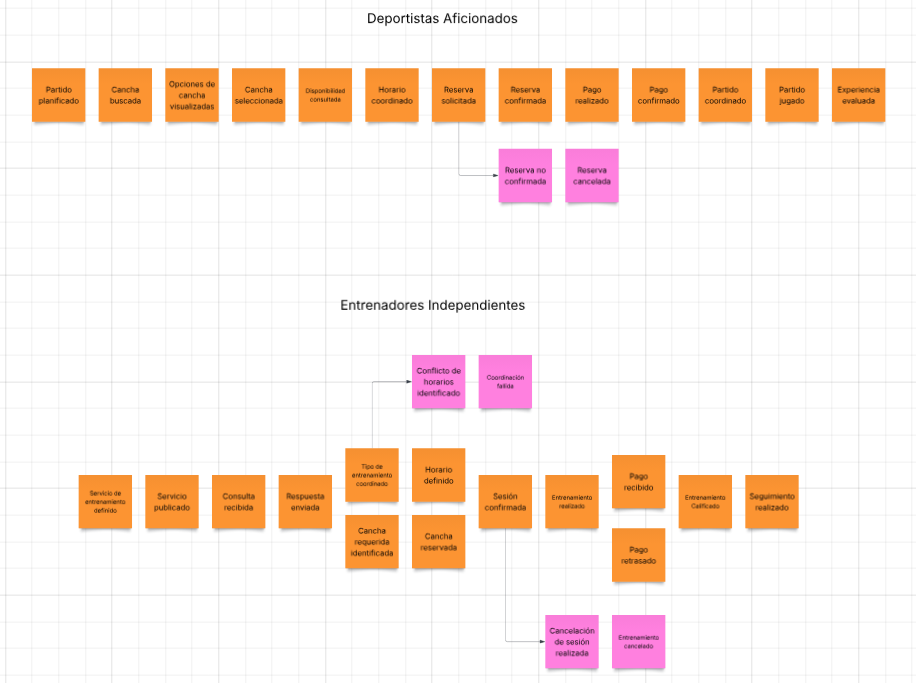

6. **Adding Actors and External Systems:** Se incorporaron los actores principales y sistemas externos que intervienen en el proceso. Se identifican actores como los deportistas aficionados, entrenadores independientes y administradores de canchas deportivas. Así mismo, se reconocieron medios externos como WhatsApp, llamadas telefónicas, redes sociales y transferencias bancarias o en efectivo. De esta manera, entendimos mejor quién y que herramientas participan en cada parte del flujo.

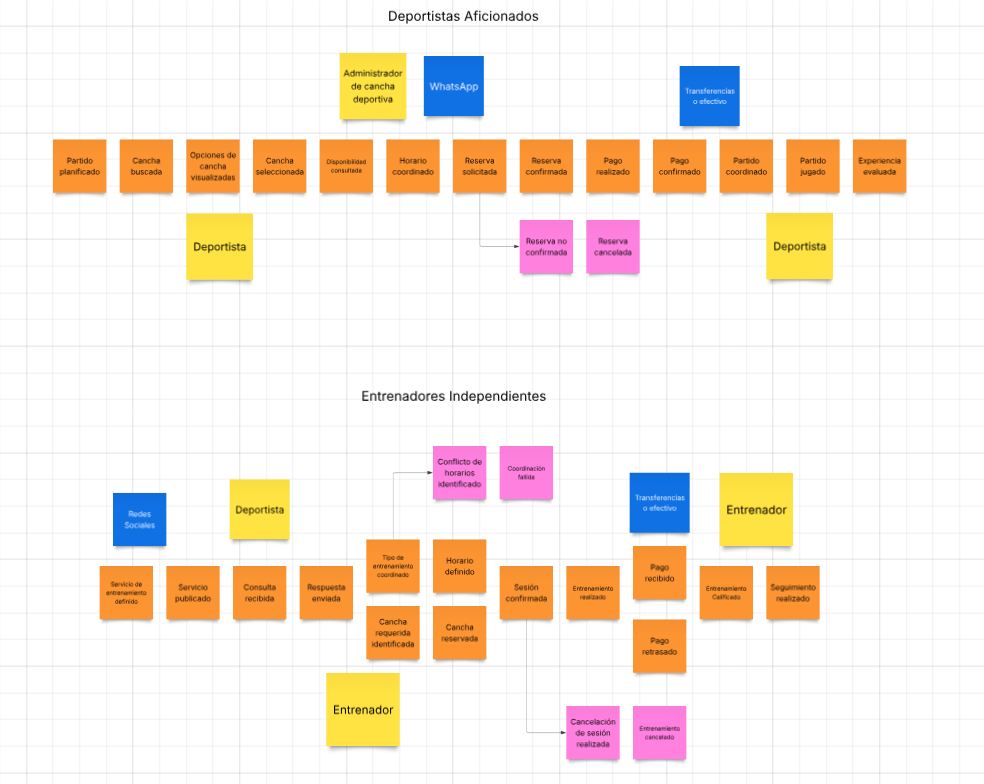

7. **Storytelling:** Con los eventos y actores organizados, el equipo construyó una historia del proceso para explicar de forma sencilla cómo se desarrolla la experiencia del flujo de la aplicación.

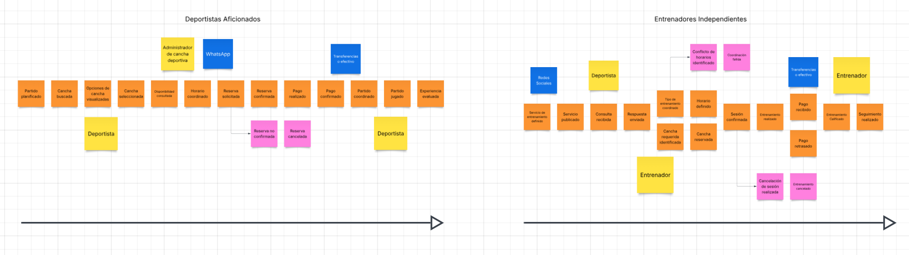

8. **Reverse storytelling:** Del mismo modo que el paso anterior, se realizó una revisión en sentido inverso para validar la coherencia de los eventos y comprobar que el proceso tuviera lógica de principio a fin. Con esto, garantizamos que cada evento estaba correctamente conectado con el anterior y el siguiente, además de detectar posibles vacíos, repeticiones o pasos innecesarios; identificar problemas y oportunidades de mejora.

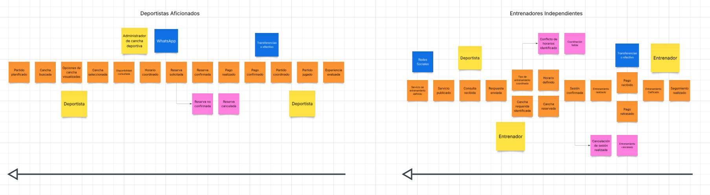

9. **Closing:** Finalmente, el equipo cerró la sesión resumiendo los hallazgos más importantes, demostrando haber comprendido el flujo de trabajo de la solución. Con nuestro análisis, logramos evidenciar los problemas como la desorganización en la coordinación, dependencia de canales informales y falta de información centralizada. Por lo que nuestra solución, responde a estas necesidades, reduciendo la complejidad del proceso y mejorando la experiencia de los usuarios.

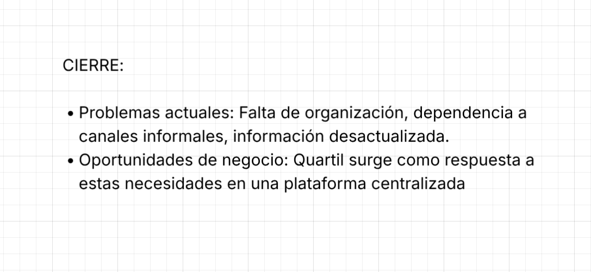

### 2.3.6. Ubiquitous Language

1. **Player (Deportista):** Usuario que participa en partidos o actividades deportivas de forma recreativa o amateur.
2. **Coach (Entrenador):** Profesional independiente que ofrece servicios de entrenamiento o clases deportivas a usuarios.
3. **Court (Cancha):** Espacio deportivo destinado a la práctica de un deporte específico, como fútbol, básquet, voley, etc.
4. **Court Availability (Disponibilidad de cancha):** Estado que indica si una cancha deportiva se encuentra disponible en el horario seleccionado.
5. **Booking (Reserva):** Acción de asegurar el uso de un espacio deportivo en una fecha y horario determinado.
6. **Match (Partido):** Actividad deportiva que ocurre después de coordinar participantes y confirmar una reserva.
7. **Training Session (Sesión de entrenamiento):** Actividad organizada entre un coach y uno o más usuarios, que se lleva a cabo luego de coordinar horario, cancha y participantes.
8. **Schedule (Horario):** Estructura de tiempos organizados que define la disponibilidad o programación de actividades deportivas.
9. **Time Slot (Bloque de tiempo):** Intervalo específico de tiempo en el que se puede realizar una reserva o actividad.
10. **Payment (Pago):** Transacción económica realizada para el uso de una cancha o la contratación de un servicio deportivo.
11. **Confirmation (Confirmación):** Validación de que una reserva, pago o sesión ha sido aceptada y registrada correctamente.
12. **Cancellation (Cancelación):** Evento que ocurre cuando una reserva o sesión previamente coordinada es anulada antes de su ejecución.
13. **Participant (Participante):** Persona que forma parte de un partido, entrenamiento u otra actividad deportiva.
14. **Owner (Administrador / Propietario):** Persona responsable de la gestión de una o más canchas, incluyendo su disponibilidad y reservas.
15. **Profile (Perfil):** Información relevante que representa a un usuario dentro de la plataforma.
16. **Location (Ubicación):** Lugar donde se encuentra la cancha seleccionada para la realización de la actividad deportiva.
17. **Review (Reseña):** Evaluación u opinión que un usuario deja sobre una cancha, entrenador o experiencia.
18. **Visibility (Visibilidad):** Nivel de exposición que tiene un entrenador o una cancha frente a otros usuarios.
19. **Sports Activity (Actividad deportiva):** Representa la práctica del deporte, como partidos o entrenamientos.
20. **Notification (Notificación):** Mensajes enviados automáticamente para informar sobre eventos confirmados, cancelados o modificados.

---

## 2.4. Requirements specification

### 2.4.1. User Stories

| Epic ID | Epic | Descripción |
|---|---|---|
| EP01 | Gestión de cuentas y acceso | Permite a jugadores y entrenadores registrarse, iniciar sesión, cerrar sesión y administrar el acceso seguro a la aplicación móvil Courtly. |
| EP02 | Búsqueda y exploración | Permite a los usuarios buscar canchas y entrenadores, consultar sus detalles y revisar disponibilidad relevante antes de operar dentro de Courtly. |
| EP03 | Reservas y agenda | Permite gestionar dos flujos: reserva simple de cancha y solicitud de sesión con entrenador, además de la administración de disponibilidades y estados. |
| EP04 | Pagos y transacciones | Permite procesar pagos asociados a reservas y sesiones, confirmar operaciones y visualizar movimientos relacionados dentro de la plataforma. |
| EP05 | Reseñas y reputación | Permite a los jugadores calificar canchas y entrenadores, fortaleciendo la confianza y transparencia dentro de la plataforma. |
| EP06 | Comunidad y partidos | Permite organizar partidos, unirse a eventos deportivos y visualizar participantes desde la aplicación móvil. |
| EP07 | Perfil, notificaciones y actividad | Permite a los usuarios administrar su perfil, visualizar su actividad y recibir notificaciones relevantes dentro de la app. |

<div>

  <h2>USM01</h2>
  <table border="1" cellspacing="0" cellpadding="8" width="100%">
    <tr>
      <th>Story ID</th>
      <th>User</th>
      <th>Priority</th>
      <th>Epic</th>
    </tr>
    <tr>
      <td>USM01</td>
      <td>Jugador</td>
      <td>Alta</td>
      <td>EP01</td>
    </tr>
    <tr>
      <th>Title</th>
      <td colspan="3">Registrar cuenta de jugador en Courtly</td>
    </tr>
    <tr>
      <th colspan="4">Description</th>
    </tr>
    <tr>
      <td colspan="4">Como jugador, quiero registrarme en la aplicación móvil Courtly, para acceder a las funcionalidades de búsqueda, reserva y gestión de actividades deportivas.</td>
    </tr>
    <tr>
      <th colspan="4">Acceptance Criteria</th>
    </tr>
    <tr>
      <td colspan="4">
        <b>Escenario 1: Registro exitoso</b><br>
        Given que el jugador se encuentra en la pantalla de registro,<br>
        When completa sus datos obligatorios correctamente y confirma el formulario,<br>
        Then la aplicación crea su cuenta y muestra un mensaje de confirmación.<br><br>
        <b>Escenario 2: Campos obligatorios incompletos</b><br>
        Given que el jugador deja campos requeridos vacíos,<br>
        When intenta registrarse,<br>
        Then la aplicación muestra mensajes de validación y no permite continuar.<br><br>
        <b>Escenario 3: Correo duplicado</b><br>
        Given que el correo ingresado ya existe en la plataforma,<br>
        When el jugador confirma su registro,<br>
        Then la aplicación informa que el correo ya está en uso.
      </td>
    </tr>
  </table>

  <br>

  <h2>USM02</h2>
  <table border="1" cellspacing="0" cellpadding="8" width="100%">
    <tr>
      <th>Story ID</th>
      <th>User</th>
      <th>Priority</th>
      <th>Epic</th>
    </tr>
    <tr>
      <td>USM02</td>
      <td>Jugador</td>
      <td>Alta</td>
      <td>EP01</td>
    </tr>
    <tr>
      <th>Title</th>
      <td colspan="3">Iniciar sesión como jugador</td>
    </tr>
    <tr>
      <th colspan="4">Description</th>
    </tr>
    <tr>
      <td colspan="4">Como jugador, quiero iniciar sesión en Courtly, para acceder rápidamente a mi perfil, reservas y funciones personalizadas.</td>
    </tr>
    <tr>
      <th colspan="4">Acceptance Criteria</th>
    </tr>
    <tr>
      <td colspan="4">
        <b>Escenario 1: Inicio de sesión válido</b><br>
        Given que el jugador ingresa credenciales correctas,<br>
        When pulsa el botón de iniciar sesión,<br>
        Then la aplicación permite el acceso y muestra la pantalla principal.<br><br>
        <b>Escenario 2: Credenciales inválidas</b><br>
        Given que el jugador ingresa datos incorrectos,<br>
        When intenta iniciar sesión,<br>
        Then la aplicación muestra un mensaje de error y mantiene al usuario en la pantalla de acceso.<br><br>
        <b>Escenario 3: Sesión persistente</b><br>
        Given que el jugador inició sesión correctamente,<br>
        When vuelve a abrir la aplicación,<br>
        Then Courtly conserva la sesión mientras siga vigente.
      </td>
    </tr>
  </table>

  <br>

  <h2>USM03</h2>
  <table border="1" cellspacing="0" cellpadding="8" width="100%">
    <tr>
      <th>Story ID</th>
      <th>User</th>
      <th>Priority</th>
      <th>Epic</th>
    </tr>
    <tr>
      <td>USM03</td>
      <td>Jugador</td>
      <td>Alta</td>
      <td>EP02</td>
    </tr>
    <tr>
      <th>Title</th>
      <td colspan="3">Buscar canchas por ubicación</td>
    </tr>
    <tr>
      <th colspan="4">Description</th>
    </tr>
    <tr>
      <td colspan="4">Como jugador, quiero buscar canchas deportivas por ubicación desde la app, para encontrar opciones cercanas y disponibles.</td>
    </tr>
    <tr>
      <th colspan="4">Acceptance Criteria</th>
    </tr>
    <tr>
      <td colspan="4">
        <b>Escenario 1: Búsqueda con resultados</b><br>
        Given que el jugador selecciona una ubicación válida,<br>
        When ejecuta la búsqueda,<br>
        Then la aplicación muestra una lista de canchas relacionadas con esa ubicación.<br><br>
        <b>Escenario 2: Búsqueda sin resultados</b><br>
        Given que no existen canchas disponibles en la zona consultada,<br>
        When el jugador realiza la búsqueda,<br>
        Then la aplicación muestra un mensaje indicando que no hay resultados.<br><br>
        <b>Escenario 3: Visualización del detalle resumido</b><br>
        Given que la búsqueda devuelve canchas disponibles,<br>
        When el jugador revisa la lista,<br>
        Then cada cancha muestra nombre, ubicación, precio y disponibilidad.
      </td>
    </tr>
  </table>

  <br>

  <h2>USM04</h2>
  <table border="1" cellspacing="0" cellpadding="8" width="100%">
    <tr>
      <th>Story ID</th>
      <th>User</th>
      <th>Priority</th>
      <th>Epic</th>
    </tr>
    <tr>
      <td>USM04</td>
      <td>Jugador</td>
      <td>Alta</td>
      <td>EP02</td>
    </tr>
    <tr>
      <th>Title</th>
      <td colspan="3">Filtrar canchas por deporte, precio y horario</td>
    </tr>
    <tr>
      <th colspan="4">Description</th>
    </tr>
    <tr>
      <td colspan="4">Como jugador, quiero aplicar filtros en la búsqueda de canchas, para encontrar la opción que mejor se adapte a mis necesidades.</td>
    </tr>
    <tr>
      <th colspan="4">Acceptance Criteria</th>
    </tr>
    <tr>
      <td colspan="4">
        <b>Escenario 1: Filtrado por deporte</b><br>
        Given que el jugador selecciona un deporte específico,<br>
        When aplica el filtro correspondiente,<br>
        Then la aplicación muestra solo canchas de ese deporte.<br><br>
        <b>Escenario 2: Filtrado por precio</b><br>
        Given que el jugador define un rango de precios,<br>
        When confirma los filtros,<br>
        Then la aplicación actualiza la lista según el rango seleccionado.<br><br>
        <b>Escenario 3: Filtrado combinado</b><br>
        Given que el jugador utiliza filtros de deporte, horario y precio al mismo tiempo,<br>
        When ejecuta la búsqueda,<br>
        Then la aplicación muestra únicamente resultados que cumplan todas las condiciones.
      </td>
    </tr>
  </table>

  <br>

  <h2>USM05</h2>
  <table border="1" cellspacing="0" cellpadding="8" width="100%">
    <tr>
      <th>Story ID</th>
      <th>User</th>
      <th>Priority</th>
      <th>Epic</th>
    </tr>
    <tr>
      <td>USM05</td>
      <td>Jugador</td>
      <td>Alta</td>
      <td>EP02</td>
    </tr>
    <tr>
      <th>Title</th>
      <td colspan="3">Ver detalle de cancha</td>
    </tr>
    <tr>
      <th colspan="4">Description</th>
    </tr>
    <tr>
      <td colspan="4">Como jugador, quiero visualizar el detalle de una cancha, para decidir si se ajusta a lo que necesito antes de reservar.</td>
    </tr>
    <tr>
      <th colspan="4">Acceptance Criteria</th>
    </tr>
    <tr>
      <td colspan="4">
        <b>Escenario 1: Consulta de información completa</b><br>
        Given que el jugador selecciona una cancha desde los resultados,<br>
        When abre la pantalla de detalle,<br>
        Then la aplicación muestra información ampliada de la cancha.<br><br>
        <b>Escenario 2: Visualización de horarios</b><br>
        Given que la cancha tiene horarios configurados,<br>
        When el jugador revisa el detalle,<br>
        Then la aplicación muestra la disponibilidad correspondiente.<br><br>
        <b>Escenario 3: Cancha sin disponibilidad</b><br>
        Given que la cancha no tiene horarios libres,<br>
        When el jugador revisa el detalle,<br>
        Then la aplicación informa que no existen espacios disponibles.
      </td>
    </tr>
  </table>

  <br>

  <h2>USM06</h2>
  <table border="1" cellspacing="0" cellpadding="8" width="100%">
    <tr>
      <th>Story ID</th>
      <th>User</th>
      <th>Priority</th>
      <th>Epic</th>
    </tr>
    <tr>
      <td>USM06</td>
      <td>Jugador</td>
      <td>Alta</td>
      <td>EP03</td>
    </tr>
    <tr>
      <th>Title</th>
      <td colspan="3">Reservar cancha desde Courtly</td>
    </tr>
    <tr>
      <th colspan="4">Description</th>
    </tr>
    <tr>
      <td colspan="4">Como jugador, quiero crear una reserva simple de cancha desde la app, para separar un horario disponible en una fecha y hora determinadas.</td>
    </tr>
    <tr>
      <th colspan="4">Acceptance Criteria</th>
    </tr>
    <tr>
      <td colspan="4">
        <b>Escenario 1: Reserva creada</b><br>
        Given que el jugador selecciona una cancha y un horario disponible,<br>
        When confirma la reserva,<br>
        Then la aplicación registra la operación y la deja lista para continuar con el pago.<br><br>
        <b>Escenario 2: Horario ocupado</b><br>
        Given que otro usuario tomó el mismo horario previamente,<br>
        When el jugador intenta confirmar la reserva,<br>
        Then la aplicación informa que el espacio ya no está disponible.<br><br>
        <b>Escenario 3: Resumen antes de confirmar</b><br>
        Given que el jugador está por finalizar la reserva,<br>
        When revisa el paso final del proceso,<br>
        Then la aplicación muestra cancha, fecha, hora y costo.
      </td>
    </tr>
  </table>

  <br>

  <h2>USM07</h2>
  <table border="1" cellspacing="0" cellpadding="8" width="100%">
    <tr>
      <th>Story ID</th>
      <th>User</th>
      <th>Priority</th>
      <th>Epic</th>
    </tr>
    <tr>
      <td>USM07</td>
      <td>Jugador</td>
      <td>Alta</td>
      <td>EP04</td>
    </tr>
    <tr>
      <th>Title</th>
      <td colspan="3">Pagar reserva desde la aplicación</td>
    </tr>
    <tr>
      <th colspan="4">Description</th>
    </tr>
    <tr>
      <td colspan="4">Como jugador, quiero pagar mi reserva desde Courtly, para completar el proceso de forma rápida y segura.</td>
    </tr>
    <tr>
      <th colspan="4">Acceptance Criteria</th>
    </tr>
    <tr>
      <td colspan="4">
        <b>Escenario 1: Pago aprobado</b><br>
        Given que el jugador tiene una reserva pendiente de pago,<br>
        When ingresa un método válido y confirma la operación,<br>
        Then la aplicación procesa el pago y actualiza el estado de la reserva.<br><br>
        <b>Escenario 2: Pago rechazado</b><br>
        Given que ocurre un error durante la transacción,<br>
        When el jugador intenta pagar,<br>
        Then la aplicación muestra el rechazo y mantiene la reserva pendiente según corresponda.<br><br>
        <b>Escenario 3: Confirmación de pago</b><br>
        Given que la operación fue exitosa,<br>
        When el jugador revisa la reserva,<br>
        Then la aplicación muestra el comprobante o confirmación asociada.
      </td>
    </tr>
  </table>

  <br>

  <h2>USM08</h2>
  <table border="1" cellspacing="0" cellpadding="8" width="100%">
    <tr>
      <th>Story ID</th>
      <th>User</th>
      <th>Priority</th>
      <th>Epic</th>
    </tr>
    <tr>
      <td>USM08</td>
      <td>Jugador</td>
      <td>Media</td>
      <td>EP05</td>
    </tr>
    <tr>
      <th>Title</th>
      <td colspan="3">Valorar una cancha utilizada</td>
    </tr>
    <tr>
      <th colspan="4">Description</th>
    </tr>
    <tr>
      <td colspan="4">Como jugador, quiero valorar una cancha después de usarla, para compartir mi experiencia con otros usuarios.</td>
    </tr>
    <tr>
      <th colspan="4">Acceptance Criteria</th>
    </tr>
    <tr>
      <td colspan="4">
        <b>Escenario 1: Reseña publicada</b><br>
        Given que el jugador completó una reserva,<br>
        When registra una calificación y comentario válidos,<br>
        Then la aplicación publica la reseña en el perfil de la cancha.<br><br>
        <b>Escenario 2: Restricción por no haber usado el servicio</b><br>
        Given que el jugador no completó ninguna reserva de esa cancha,<br>
        When intenta valorar el servicio,<br>
        Then la aplicación no permite publicar la reseña.<br><br>
        <b>Escenario 3: Visualización de reseña</b><br>
        Given que la reseña fue registrada correctamente,<br>
        When otros usuarios ingresan al detalle de la cancha,<br>
        Then la aplicación muestra la valoración publicada.
      </td>
    </tr>
  </table>

  <br>

  <h2>USM09</h2>
  <table border="1" cellspacing="0" cellpadding="8" width="100%">
    <tr>
      <th>Story ID</th>
      <th>User</th>
      <th>Priority</th>
      <th>Epic</th>
    </tr>
    <tr>
      <td>USM09</td>
      <td>Jugador</td>
      <td>Media</td>
      <td>EP06</td>
    </tr>
    <tr>
      <th>Title</th>
      <td colspan="3">Crear partido con amigos</td>
    </tr>
    <tr>
      <th colspan="4">Description</th>
    </tr>
    <tr>
      <td colspan="4">Como jugador, quiero crear un partido desde Courtly, para organizar encuentros deportivos con mis amigos o contactos.</td>
    </tr>
    <tr>
      <th colspan="4">Acceptance Criteria</th>
    </tr>
    <tr>
      <td colspan="4">
        <b>Escenario 1: Partido creado correctamente</b><br>
        Given que el jugador completa los datos del partido,<br>
        When confirma la creación,<br>
        Then la aplicación registra el evento y lo muestra en su agenda.<br><br>
        <b>Escenario 2: Datos incompletos</b><br>
        Given que faltan datos obligatorios del partido,<br>
        When el jugador intenta guardarlo,<br>
        Then la aplicación solicita completar la información requerida.<br><br>
        <b>Escenario 3: Invitación a participantes</b><br>
        Given que el partido fue creado,<br>
        When el jugador selecciona contactos para invitar,<br>
        Then la aplicación registra o envía las invitaciones correspondientes.
      </td>
    </tr>
  </table>

  <br>

  <h2>USM10</h2>
  <table border="1" cellspacing="0" cellpadding="8" width="100%">
    <tr>
      <th>Story ID</th>
      <th>User</th>
      <th>Priority</th>
      <th>Epic</th>
    </tr>
    <tr>
      <td>USM10</td>
      <td>Jugador</td>
      <td>Media</td>
      <td>EP06</td>
    </tr>
    <tr>
      <th>Title</th>
      <td colspan="3">Unirse a un partido disponible</td>
    </tr>
    <tr>
      <th colspan="4">Description</th>
    </tr>
    <tr>
      <td colspan="4">Como jugador, quiero unirme a partidos publicados en la plataforma, para participar en actividades deportivas organizadas por otros usuarios.</td>
    </tr>
    <tr>
      <th colspan="4">Acceptance Criteria</th>
    </tr>
    <tr>
      <td colspan="4">
        <b>Escenario 1: Unión exitosa a partido</b><br>
        Given que existe un partido con cupos disponibles,<br>
        When el jugador selecciona la opción de participar,<br>
        Then la aplicación registra su incorporación al evento.<br><br>
        <b>Escenario 2: Partido sin cupos</b><br>
        Given que el partido ya alcanzó su límite de participantes,<br>
        When el jugador intenta unirse,<br>
        Then la aplicación informa que no hay cupos disponibles.<br><br>
        <b>Escenario 3: Confirmación de participación</b><br>
        Given que el jugador se unió correctamente al partido,<br>
        When revisa el detalle del evento,<br>
        Then la aplicación lo muestra dentro de la lista de participantes.
      </td>
    </tr>
  </table>

  <br>

  <h2>USM11</h2>
  <table border="1" cellspacing="0" cellpadding="8" width="100%">
    <tr>
      <th>Story ID</th>
      <th>User</th>
      <th>Priority</th>
      <th>Epic</th>
    </tr>
    <tr>
      <td>USM11</td>
      <td>Entrenador</td>
      <td>Alta</td>
      <td>EP01</td>
    </tr>
    <tr>
      <th>Title</th>
      <td colspan="3">Registrar cuenta de entrenador</td>
    </tr>
    <tr>
      <th colspan="4">Description</th>
    </tr>
    <tr>
      <td colspan="4">Como entrenador, quiero registrarme en Courtly, para ofrecer mis servicios y ser encontrado por jugadores dentro de la plataforma.</td>
    </tr>
    <tr>
      <th colspan="4">Acceptance Criteria</th>
    </tr>
    <tr>
      <td colspan="4">
        <b>Escenario 1: Registro profesional exitoso</b><br>
        Given que el entrenador completa sus datos personales y profesionales correctamente,<br>
        When confirma el registro,<br>
        Then la aplicación crea su cuenta y habilita su perfil profesional.<br><br>
        <b>Escenario 2: Datos profesionales incompletos</b><br>
        Given que faltan campos obligatorios del perfil profesional,<br>
        When intenta registrarse,<br>
        Then la aplicación solicita completar la información faltante.<br><br>
        <b>Escenario 3: Correo ya existente</b><br>
        Given que el correo del entrenador ya está registrado,<br>
        When confirma el formulario,<br>
        Then la aplicación informa que no puede crear una nueva cuenta con ese correo.
      </td>
    </tr>
  </table>

  <br>

  <h2>USM12</h2>
  <table border="1" cellspacing="0" cellpadding="8" width="100%">
    <tr>
      <th>Story ID</th>
      <th>User</th>
      <th>Priority</th>
      <th>Epic</th>
    </tr>
    <tr>
      <td>USM12</td>
      <td>Entrenador</td>
      <td>Alta</td>
      <td>EP07</td>
    </tr>
    <tr>
      <th>Title</th>
      <td colspan="3">Actualizar perfil profesional</td>
    </tr>
    <tr>
      <th colspan="4">Description</th>
    </tr>
    <tr>
      <td colspan="4">Como entrenador, quiero actualizar mi perfil profesional, para mostrar información vigente y atractiva a los jugadores.</td>
    </tr>
    <tr>
      <th colspan="4">Acceptance Criteria</th>
    </tr>
    <tr>
      <td colspan="4">
        <b>Escenario 1: Actualización exitosa</b><br>
        Given que el entrenador accede a su perfil,<br>
        When edita y guarda sus datos correctamente,<br>
        Then la aplicación actualiza la información visible en su perfil.<br><br>
        <b>Escenario 2: Datos inválidos</b><br>
        Given que el entrenador ingresa valores con formato incorrecto,<br>
        When intenta guardar cambios,<br>
        Then la aplicación muestra mensajes de validación.<br><br>
        <b>Escenario 3: Visualización pública actualizada</b><br>
        Given que el perfil fue actualizado con éxito,<br>
        When los jugadores consultan ese perfil,<br>
        Then la aplicación muestra la información más reciente.
      </td>
    </tr>
  </table>

  <br>

  <h2>USM13</h2>
  <table border="1" cellspacing="0" cellpadding="8" width="100%">
    <tr>
      <th>Story ID</th>
      <th>User</th>
      <th>Priority</th>
      <th>Epic</th>
    </tr>
    <tr>
      <td>USM13</td>
      <td>Entrenador</td>
      <td>Alta</td>
      <td>EP03</td>
    </tr>
    <tr>
      <th>Title</th>
      <td colspan="3">Publicar disponibilidad de horarios</td>
    </tr>
    <tr>
      <th colspan="4">Description</th>
    </tr>
    <tr>
      <td colspan="4">Como entrenador, quiero publicar mis horarios disponibles, para que los jugadores puedan reservar sesiones conmigo.</td>
    </tr>
    <tr>
      <th colspan="4">Acceptance Criteria</th>
    </tr>
    <tr>
      <td colspan="4">
        <b>Escenario 1: Agenda publicada</b><br>
        Given que el entrenador configura horarios disponibles,<br>
        When guarda la información,<br>
        Then la aplicación publica esos espacios en su perfil.<br><br>
        <b>Escenario 2: Edición de disponibilidad</b><br>
        Given que el entrenador ya tiene horarios registrados,<br>
        When modifica su agenda y guarda los cambios,<br>
        Then la aplicación actualiza la disponibilidad mostrada.<br><br>
        <b>Escenario 3: Visualización por jugadores</b><br>
        Given que el entrenador tiene disponibilidad activa,<br>
        When un jugador revisa su perfil,<br>
        Then la aplicación muestra los horarios disponibles para reserva.
      </td>
    </tr>
  </table>

  <br>

  <h2>USM14</h2>
  <table border="1" cellspacing="0" cellpadding="8" width="100%">
    <tr>
      <th>Story ID</th>
      <th>User</th>
      <th>Priority</th>
      <th>Epic</th>
    </tr>
    <tr>
      <td>USM14</td>
      <td>Entrenador</td>
      <td>Alta</td>
      <td>EP03</td>
    </tr>
    <tr>
      <th>Title</th>
      <td colspan="3">Aceptar o rechazar solicitudes de entrenamiento</td>
    </tr>
    <tr>
      <th colspan="4">Description</th>
    </tr>
    <tr>
      <td colspan="4">Como entrenador, quiero aceptar o rechazar solicitudes de sesión de entrenamiento, para administrar adecuadamente mi tiempo y mi agenda.</td>
    </tr>
    <tr>
      <th colspan="4">Acceptance Criteria</th>
    </tr>
    <tr>
      <td colspan="4">
        <b>Escenario 1: Solicitud aceptada</b><br>
        Given que el entrenador recibe una solicitud pendiente,<br>
        When selecciona la opción de aceptar,<br>
        Then la aplicación cambia el estado de la sesión y notifica al jugador.<br><br>
        <b>Escenario 2: Solicitud rechazada</b><br>
        Given que el entrenador recibe una solicitud pendiente,<br>
        When selecciona la opción de rechazar,<br>
        Then la aplicación actualiza el estado de la sesión y comunica la decisión al jugador.<br><br>
        <b>Escenario 3: Consulta de solicitudes</b><br>
        Given que existen solicitudes enviadas al entrenador,<br>
        When accede a su bandeja o sección de solicitudes,<br>
        Then la aplicación muestra el listado de solicitudes pendientes y procesadas.
      </td>
    </tr>
  </table>

  <br>

  <h2>USM15</h2>
  <table border="1" cellspacing="0" cellpadding="8" width="100%">
    <tr>
      <th>Story ID</th>
      <th>User</th>
      <th>Priority</th>
      <th>Epic</th>
    </tr>
    <tr>
      <td>USM15</td>
      <td>Entrenador</td>
      <td>Media</td>
      <td>EP04</td>
    </tr>
    <tr>
      <th>Title</th>
      <td colspan="3">Visualizar pagos recibidos</td>
    </tr>
    <tr>
      <th colspan="4">Description</th>
    </tr>
    <tr>
      <td colspan="4">Como entrenador, quiero visualizar mis pagos recibidos en Courtly, para tener control de mis ingresos dentro de la plataforma.</td>
    </tr>
    <tr>
      <th colspan="4">Acceptance Criteria</th>
    </tr>
    <tr>
      <td colspan="4">
        <b>Escenario 1: Consulta de historial de pagos</b><br>
        Given que el entrenador tiene ingresos registrados,<br>
        When accede a la sección de pagos,<br>
        Then la aplicación muestra su historial de movimientos.<br><br>
        <b>Escenario 2: Detalle de transacción</b><br>
        Given que el entrenador selecciona un pago específico,<br>
        When abre el detalle del movimiento,<br>
        Then la aplicación muestra información ampliada de la operación.<br><br>
        <b>Escenario 3: Sin pagos registrados</b><br>
        Given que el entrenador aún no tiene ingresos asociados,<br>
        When ingresa a la sección de pagos,<br>
        Then la aplicación muestra un mensaje indicando que no hay movimientos.
      </td>
    </tr>
  </table>

  <br>

  <h2>USM16</h2>
  <table border="1" cellspacing="0" cellpadding="8" width="100%">
    <tr>
      <th>Story ID</th>
      <th>User</th>
      <th>Priority</th>
      <th>Epic</th>
    </tr>
    <tr>
      <td>USM16</td>
      <td>Entrenador</td>
      <td>Media</td>
      <td>EP05</td>
    </tr>
    <tr>
      <th>Title</th>
      <td colspan="3">Recibir reseñas de jugadores</td>
    </tr>
    <tr>
      <th colspan="4">Description</th>
    </tr>
    <tr>
      <td colspan="4">Como entrenador, quiero recibir reseñas de mis clientes, para fortalecer mi reputación dentro de Courtly.</td>
    </tr>
    <tr>
      <th colspan="4">Acceptance Criteria</th>
    </tr>
    <tr>
      <td colspan="4">
        <b>Escenario 1: Publicación de reseña</b><br>
        Given que un jugador completó una sesión con el entrenador,<br>
        When registra su valoración,<br>
        Then la aplicación publica la reseña en el perfil del entrenador.<br><br>
        <b>Escenario 2: Reputación actualizada</b><br>
        Given que existen nuevas valoraciones registradas,<br>
        When otros usuarios revisan el perfil del entrenador,<br>
        Then la aplicación refleja la reputación actualizada.<br><br>
        <b>Escenario 3: Restricción de reseña inválida</b><br>
        Given que un usuario no tuvo una reserva válida con el entrenador,<br>
        When intenta publicar una opinión,<br>
        Then la aplicación no permite registrar la reseña.
      </td>
    </tr>
  </table>

  <br>

  <h2>USM17</h2>
  <table border="1" cellspacing="0" cellpadding="8" width="100%">
    <tr>
      <th>Story ID</th>
      <th>User</th>
      <th>Priority</th>
      <th>Epic</th>
    </tr>
    <tr>
      <td>USM17</td>
      <td>Entrenador</td>
      <td>Media</td>
      <td>EP07</td>
    </tr>
    <tr>
      <th>Title</th>
      <td colspan="3">Ver estadísticas de rendimiento</td>
    </tr>
    <tr>
      <th colspan="4">Description</th>
    </tr>
    <tr>
      <td colspan="4">Como entrenador, quiero visualizar estadísticas de mi actividad en la aplicación, para medir mi desempeño y mejorar mis servicios.</td>
    </tr>
    <tr>
      <th colspan="4">Acceptance Criteria</th>
    </tr>
    <tr>
      <td colspan="4">
        <b>Escenario 1: Consulta de métricas</b><br>
        Given que el entrenador accede a su panel de estadísticas,<br>
        When abre la sección correspondiente,<br>
        Then la aplicación muestra indicadores de actividad y rendimiento.<br><br>
        <b>Escenario 2: Datos históricos disponibles</b><br>
        Given que el entrenador tiene actividad previa registrada,<br>
        When revisa sus estadísticas,<br>
        Then la aplicación presenta datos acumulados o resumidos.<br><br>
        <b>Escenario 3: Ausencia de datos</b><br>
        Given que el entrenador todavía no cuenta con historial suficiente,<br>
        When consulta su panel,<br>
        Then la aplicación informa que aún no hay información para mostrar.
      </td>
    </tr>
  </table>

  <br>

  <h2>USM18</h2>
  <table border="1" cellspacing="0" cellpadding="8" width="100%">
    <tr>
      <th>Story ID</th>
      <th>User</th>
      <th>Priority</th>
      <th>Epic</th>
    </tr>
    <tr>
      <td>USM18</td>
      <td>Usuario</td>
      <td>Alta</td>
      <td>EP07</td>
    </tr>
    <tr>
      <th>Title</th>
      <td colspan="3">Recibir notificaciones relevantes en la app</td>
    </tr>
    <tr>
      <th colspan="4">Description</th>
    </tr>
    <tr>
      <td colspan="4">Como usuario, quiero recibir notificaciones relevantes dentro de Courtly, para enterarme oportunamente de cambios, reservas y novedades importantes.</td>
    </tr>
    <tr>
      <th colspan="4">Acceptance Criteria</th>
    </tr>
    <tr>
      <td colspan="4">
        <b>Escenario 1: Notificación por reserva</b><br>
        Given que ocurre un evento relacionado con una reserva del usuario,<br>
        When el sistema registra dicho cambio,<br>
        Then la aplicación envía una notificación correspondiente.<br><br>
        <b>Escenario 2: Notificación por cambio de estado</b><br>
        Given que una solicitud fue aceptada, rechazada o modificada,<br>
        When el sistema actualiza su estado,<br>
        Then la aplicación notifica al usuario afectado.<br><br>
        <b>Escenario 3: Consulta del historial</b><br>
        Given que el usuario accede a la sección de notificaciones,<br>
        When revisa su historial,<br>
        Then la aplicación muestra las notificaciones registradas previamente.
      </td>
    </tr>
  </table>

  <br>

  <h2>USM19</h2>
  <table border="1" cellspacing="0" cellpadding="8" width="100%">
    <tr>
      <th>Story ID</th>
      <th>User</th>
      <th>Priority</th>
      <th>Epic</th>
    </tr>
    <tr>
      <td>USM19</td>
      <td>Usuario</td>
      <td>Media</td>
      <td>EP07</td>
    </tr>
    <tr>
      <th>Title</th>
      <td colspan="3">Editar perfil personal</td>
    </tr>
    <tr>
      <th colspan="4">Description</th>
    </tr>
    <tr>
      <td colspan="4">Como usuario, quiero editar mi perfil personal en Courtly, para mantener actualizada mi información dentro de la aplicación.</td>
    </tr>
    <tr>
      <th colspan="4">Acceptance Criteria</th>
    </tr>
    <tr>
      <td colspan="4">
        <b>Escenario 1: Actualización correcta del perfil</b><br>
        Given que el usuario accede a su perfil,<br>
        When modifica sus datos y guarda los cambios,<br>
        Then la aplicación actualiza su información correctamente.<br><br>
        <b>Escenario 2: Validación de datos erróneos</b><br>
        Given que el usuario ingresa información inválida,<br>
        When intenta guardar los cambios,<br>
        Then la aplicación muestra errores de validación y no registra datos incorrectos.<br><br>
        <b>Escenario 3: Persistencia de datos</b><br>
        Given que el usuario actualizó su perfil exitosamente,<br>
        When vuelve a ingresar posteriormente a la aplicación,<br>
        Then la información modificada permanece almacenada.
      </td>
    </tr>
  </table>

  <br>

  <h2>USM20</h2>
  <table border="1" cellspacing="0" cellpadding="8" width="100%">
    <tr>
      <th>Story ID</th>
      <th>User</th>
      <th>Priority</th>
      <th>Epic</th>
    </tr>
    <tr>
      <td>USM20</td>
      <td>Usuario</td>
      <td>Media</td>
      <td>EP03</td>
    </tr>
    <tr>
      <th>Title</th>
      <td colspan="3">Cancelar una reserva o sesión registrada</td>
    </tr>
    <tr>
      <th colspan="4">Description</th>
    </tr>
        <tr>
      <td colspan="4">
        Como usuario, quiero cancelar una reserva o sesión registrada desde la aplicación móvil Courtly, para poder liberar el horario reservado cuando ya no pueda asistir.
      </td>
    </tr>
    <tr>
      <th colspan="4">Acceptance Criteria</th>
    </tr>
    <tr>
      <td colspan="4">
        <b>Escenario 1: Cancelación exitosa de operación</b><br>
        <b>Given</b> que el usuario tiene una reserva o sesión activa registrada en Courtly,<br>
        <b>When</b> selecciona la opción de cancelar y confirma la acción dentro del tiempo permitido,<br>
        <b>Then</b> la aplicación cambia el estado de la operación a cancelada y muestra un mensaje de confirmación.<br><br>
        <b>Escenario 2: Visualización del estado actualizado</b><br>
        <b>Given</b> que el usuario canceló correctamente una operación,<br>
        <b>When</b> accede al listado de sus reservas o sesiones,<br>
        <b>Then</b> la aplicación muestra la operación con estado cancelado.<br><br>
        <b>Escenario 3: Restricción por política de cancelación</b><br>
        <b>Given</b> que la reserva o sesión ya no cumple con las reglas de cancelación establecidas,<br>
        <b>When</b> el usuario intenta cancelarla,<br>
        <b>Then</b> la aplicación informa que la cancelación no está permitida.<br><br>
        <b>Escenario 4: Liberación de disponibilidad</b><br>
        <b>Given</b> que una reserva o sesión fue cancelada exitosamente,<br>
        <b>When</b> el sistema actualiza la agenda correspondiente,<br>
        <b>Then</b> el horario reservado vuelve a quedar disponible para futuras reservas.
      </td>
    </tr>
  </table>

  <br>

  <h2>USM21</h2>
  <table border="1" cellspacing="0" cellpadding="8" width="100%">
    <tr>
      <th>Story ID</th>
      <th>User</th>
      <th>Priority</th>
      <th>Epic</th>
    </tr>
    <tr>
      <td>USM21</td>
      <td>Entrenador</td>
      <td>Alta</td>
      <td>EP01</td>
    </tr>
    <tr>
      <th>Title</th>
      <td colspan="3">Iniciar sesión como entrenador</td>
    </tr>
    <tr>
      <th colspan="4">Description</th>
    </tr>
    <tr>
      <td colspan="4">Como entrenador, quiero iniciar sesión en Courtly, para gestionar mi perfil profesional, disponibilidades, solicitudes y pagos.</td>
    </tr>
    <tr>
      <th colspan="4">Acceptance Criteria</th>
    </tr>
    <tr>
      <td colspan="4">
        <b>Escenario 1: Inicio de sesión válido</b><br>
        Given que el entrenador ingresa credenciales correctas,<br>
        When pulsa el botón de iniciar sesión,<br>
        Then la aplicación permite el acceso y muestra su panel profesional.<br><br>
        <b>Escenario 2: Credenciales inválidas</b><br>
        Given que el entrenador ingresa datos incorrectos,<br>
        When intenta iniciar sesión,<br>
        Then la aplicación muestra un mensaje de error y mantiene al usuario en la pantalla de acceso.<br><br>
        <b>Escenario 3: Sesión persistente</b><br>
        Given que el entrenador inició sesión correctamente,<br>
        When vuelve a abrir la aplicación,<br>
        Then Courtly conserva la sesión mientras siga vigente.
      </td>
    </tr>
  </table>

  <br>

  <h2>USM22</h2>
  <table border="1" cellspacing="0" cellpadding="8" width="100%">
    <tr>
      <th>Story ID</th>
      <th>User</th>
      <th>Priority</th>
      <th>Epic</th>
    </tr>
    <tr>
      <td>USM22</td>
      <td>Jugador</td>
      <td>Alta</td>
      <td>EP02</td>
    </tr>
    <tr>
      <th>Title</th>
      <td colspan="3">Buscar entrenadores disponibles</td>
    </tr>
    <tr>
      <th colspan="4">Description</th>
    </tr>
    <tr>
      <td colspan="4">Como jugador, quiero buscar entrenadores disponibles, para encontrar un profesional acorde a mi disciplina y necesidad.</td>
    </tr>
    <tr>
      <th colspan="4">Acceptance Criteria</th>
    </tr>
    <tr>
      <td colspan="4">
        <b>Escenario 1: Búsqueda con resultados</b><br>
        Given que existen entrenadores registrados con perfil profesional activo,<br>
        When el jugador accede a la sección de entrenadores,<br>
        Then la aplicación muestra un catálogo con los perfiles disponibles.<br><br>
        <b>Escenario 2: Consulta del perfil profesional</b><br>
        Given que el jugador selecciona un entrenador del catálogo,<br>
        When abre su perfil,<br>
        Then la aplicación muestra especialidad, disponibilidad y reseñas asociadas.<br><br>
        <b>Escenario 3: Sin entrenadores disponibles</b><br>
        Given que no existen entrenadores visibles para la consulta realizada,<br>
        When el jugador revisa el resultado,<br>
        Then la aplicación informa que no hay perfiles disponibles.
      </td>
    </tr>
  </table>

  <br>

  <h2>USM23</h2>
  <table border="1" cellspacing="0" cellpadding="8" width="100%">
    <tr>
      <th>Story ID</th>
      <th>User</th>
      <th>Priority</th>
      <th>Epic</th>
    </tr>
    <tr>
      <td>USM23</td>
      <td>Jugador</td>
      <td>Alta</td>
      <td>EP03</td>
    </tr>
    <tr>
      <th>Title</th>
      <td colspan="3">Solicitar una sesión con entrenador</td>
    </tr>
    <tr>
      <th colspan="4">Description</th>
    </tr>
    <tr>
      <td colspan="4">Como jugador, quiero solicitar una sesión con entrenador incluyendo cancha, disponibilidad y horario, para reservar una experiencia completa dentro de la app.</td>
    </tr>
    <tr>
      <th colspan="4">Acceptance Criteria</th>
    </tr>
    <tr>
      <td colspan="4">
        <b>Escenario 1: Solicitud creada</b><br>
        Given que el jugador selecciona un entrenador, una disponibilidad y una cancha compatible,<br>
        When confirma la solicitud,<br>
        Then la aplicación registra una sesión en estado pendiente.<br><br>
        <b>Escenario 2: Disponibilidad no válida</b><br>
        Given que la disponibilidad seleccionada ya no está libre,<br>
        When el jugador intenta confirmar la solicitud,<br>
        Then la aplicación informa que el horario ya no está disponible.<br><br>
        <b>Escenario 3: Resumen previo</b><br>
        Given que el jugador está por crear la solicitud,<br>
        When revisa el paso final del proceso,<br>
        Then la aplicación muestra entrenador, cancha, horario y costo estimado.
      </td>
    </tr>
  </table>

  <br>

  <h2>USM24</h2>
  <table border="1" cellspacing="0" cellpadding="8" width="100%">
    <tr>
      <th>Story ID</th>
      <th>User</th>
      <th>Priority</th>
      <th>Epic</th>
    </tr>
    <tr>
      <td>USM24</td>
      <td>Jugador</td>
      <td>Alta</td>
      <td>EP04</td>
    </tr>
    <tr>
      <th>Title</th>
      <td colspan="3">Pagar una sesión con entrenador aceptada</td>
    </tr>
    <tr>
      <th colspan="4">Description</th>
    </tr>
    <tr>
      <td colspan="4">Como jugador, quiero pagar una sesión con entrenador una vez aceptada, para completar la operación y asegurar el servicio.</td>
    </tr>
    <tr>
      <th colspan="4">Acceptance Criteria</th>
    </tr>
    <tr>
      <td colspan="4">
        <b>Escenario 1: Pago aprobado</b><br>
        Given que la sesión fue aceptada por el entrenador y está pendiente de pago,<br>
        When el jugador confirma un método de pago válido,<br>
        Then la aplicación procesa la transacción y registra la confirmación correspondiente.<br><br>
        <b>Escenario 2: Pago rechazado</b><br>
        Given que ocurre un error durante la transacción,<br>
        When el jugador intenta pagar la sesión,<br>
        Then la aplicación informa el rechazo y mantiene la operación pendiente.<br><br>
        <b>Escenario 3: Comprobante de la sesión</b><br>
        Given que la transacción fue exitosa,<br>
        When el jugador revisa el detalle de la sesión,<br>
        Then la aplicación muestra la confirmación o comprobante asociado.
      </td>
    </tr>
  </table>

  <br>

  <h2>USM25</h2>
  <table border="1" cellspacing="0" cellpadding="8" width="100%">
    <tr>
      <th>Story ID</th>
      <th>User</th>
      <th>Priority</th>
      <th>Epic</th>
    </tr>
    <tr>
      <td>USM25</td>
      <td>Jugador</td>
      <td>Media</td>
      <td>EP05</td>
    </tr>
    <tr>
      <th>Title</th>
      <td colspan="3">Valorar a un entrenador después de una sesión completada</td>
    </tr>
    <tr>
      <th colspan="4">Description</th>
    </tr>
    <tr>
      <td colspan="4">Como jugador, quiero valorar a un entrenador después de completar una sesión con él, para compartir mi experiencia y contribuir a su reputación dentro de Courtly.</td>
    </tr>
    <tr>
      <th colspan="4">Acceptance Criteria</th>
    </tr>
    <tr>
      <td colspan="4">
        <b>Escenario 1: Reseña publicada</b><br>
        Given que el jugador completó una sesión con el entrenador,<br>
        When registra una calificación y comentario válidos,<br>
        Then la aplicación publica la reseña en el perfil profesional del entrenador.<br><br>
        <b>Escenario 2: Restricción por sesión no completada</b><br>
        Given que el jugador no completó ninguna sesión con ese entrenador,<br>
        When intenta publicar una opinión,<br>
        Then la aplicación no permite registrar la reseña.<br><br>
        <b>Escenario 3: Reputación visible</b><br>
        Given que la reseña fue registrada correctamente,<br>
        When otros usuarios revisan el perfil del entrenador,<br>
        Then la aplicación muestra la valoración publicada.
      </td>
    </tr>
  </table>
</div>

<h2>SPM01</h2>
<table border="1" cellspacing="0" cellpadding="8" width="100%">
  <tr>
    <th>Story ID</th>
    <th>User</th>
    <th>Priority</th>
    <th>Epic</th>
  </tr>
  <tr>
    <td>SPM01</td>
    <td>Developer</td>
    <td>Alta</td>
    <td>EP04</td>
  </tr>
  <tr>
    <th>Title</th>
    <td colspan="3">Investigar la integración del módulo de pagos en Courtly</td>
  </tr>
  <tr>
    <th colspan="4">Description</th>
  </tr>
  <tr>
    <td colspan="4">
      Como Developer, quiero investigar la viabilidad técnica del módulo de pagos en Courtly, para identificar los datos, reglas, riesgos y dependencias necesarias antes de implementar el flujo de pago de reservas dentro de la aplicación móvil.
    </td>
  </tr>
  <tr>
    <th colspan="4">Acceptance Criteria</th>
  </tr>
  <tr>
    <td colspan="4">
      <b>Escenario 1: Análisis del flujo de pago</b><br>
      <b>Given</b> que Courtly requiere procesar pagos asociados a reservas deportivas,<br>
      <b>When</b> el Developer analiza el flujo desde la selección de reserva hasta la confirmación del pago,<br>
      <b>Then</b> se documentan los pasos principales del proceso, incluyendo usuario, monto, estado del pago y confirmación de la operación.<br><br>
      <b>Escenario 2: Revisión de datos requeridos</b><br>
      <b>Given</b> que el backend cuenta con un contexto de pagos,<br>
      <b>When</b> el Developer revisa los atributos necesarios para registrar una transacción,<br>
      <b>Then</b> se identifican los campos mínimos como amount, userId, paymentStatus y paymentDate.<br><br>
      <b>Escenario 3: Identificación de riesgos técnicos</b><br>
      <b>Given</b> que el pago es una funcionalidad crítica para el negocio,<br>
      <b>When</b> el Developer evalúa posibles errores de transacción, pagos rechazados o estados incompletos,<br>
      <b>Then</b> se documentan riesgos y recomendaciones para manejar estados como PENDING, COMPLETED, FAILED y CANCELLED.<br><br>
      <b>Escenario 4: Resultado documentado</b><br>
      <b>Given</b> que la investigación fue completada,<br>
      <b>When</b> el equipo revisa los hallazgos,<br>
      <b>Then</b> se genera un resumen técnico con conclusiones y recomendaciones para implementar correctamente el módulo de pagos.
    </td>
  </tr>
</table>

<br>

<h2>SPM02</h2>
<table border="1" cellspacing="0" cellpadding="8" width="100%">
  <tr>
    <th>Story ID</th>
    <th>User</th>
    <th>Priority</th>
    <th>Epic</th>
  </tr>
  <tr>
    <td>SPM02</td>
    <td>Developer</td>
    <td>Alta</td>
    <td>EP03</td>
  </tr>
  <tr>
    <th>Title</th>
    <td colspan="3">Investigar la arquitectura de reservas y disponibilidad en Courtly</td>
  </tr>
  <tr>
    <th colspan="4">Description</th>
  </tr>
  <tr>
    <td colspan="4">
      Como Developer, quiero investigar cómo deben relacionarse las reservas, canchas, usuarios y disponibilidad de entrenadores en Courtly, para validar una arquitectura coherente que evite cruces de horarios, reservas duplicadas o conflictos en la agenda.
    </td>
  </tr>
  <tr>
    <th colspan="4">Acceptance Criteria</th>
  </tr>
  <tr>
    <td colspan="4">
      <b>Escenario 1: Identificación de entidades relacionadas</b><br>
      <b>Given</b> que Courtly necesita gestionar reservas de canchas y sesiones con entrenadores,<br>
      <b>When</b> el Developer analiza los bounded contexts involucrados,<br>
      <b>Then</b> se identifican las relaciones entre Users, Courts, Bookings, Coaches y Availabilities.<br><br>
      <b>Escenario 2: Validación de reglas de disponibilidad</b><br>
      <b>Given</b> que una cancha o entrenador solo puede ser reservado en horarios disponibles,<br>
      <b>When</b> el Developer revisa el comportamiento esperado del flujo de reserva,<br>
      <b>Then</b> se documentan reglas para evitar reservas duplicadas, horarios ocupados o conflictos de agenda.<br><br>
      <b>Escenario 3: Revisión del flujo de cancelación</b><br>
      <b>Given</b> que el usuario puede cancelar una reserva registrada,<br>
      <b>When</b> el Developer analiza el impacto de la cancelación sobre la disponibilidad,<br>
      <b>Then</b> se define que el horario cancelado debe volver a quedar disponible según las reglas del sistema.<br><br>
      <b>Escenario 4: Resultado documentado</b><br>
      <b>Given</b> que el análisis de reservas y disponibilidad fue realizado,<br>
      <b>When</b> el equipo revisa los resultados,<br>
      <b>Then</b> se registra un documento técnico con reglas de negocio, riesgos detectados y recomendaciones para la implementación.
    </td>
  </tr>
</table>

<br>

<!-- Landing Page User Stories -->

<h2>LP01</h2>
<table border="1" cellspacing="0" cellpadding="8" width="100%">
  <tr>
    <th>Story ID</th>
    <th>User</th>
    <th>Priority</th>
    <th>Epic</th>
  </tr>
  <tr>
    <td>LP01</td>
    <td>Visitante potencial</td>
    <td>Alta</td>
    <td>Presentación del producto</td>
  </tr>
  <tr>
    <th>Title</th>
    <td colspan="3">Navegar por la landing page mediante el menú de navegación</td>
  </tr>
  <tr>
    <th colspan="4">Description</th>
  </tr>
  <tr>
    <td colspan="4">Como visitante, quiero navegar fácilmente por la landing page usando el menú principal, para acceder a las diferentes secciones de información sobre Courtly sin complicaciones.</td>
  </tr>
  <tr>
    <th colspan="4">Acceptance Criteria</th>
  </tr>
  <tr>
    <td colspan="4">
      <b>Escenario 1: Navegación en escritorio</b><br>
      Given que el visitante se encuentra en la landing page,<br>
      When hace clic en un elemento del menú de navegación (Inicio, Características, Beneficios, Cómo funciona, Equipo, Testimonios),<br>
      Then la página desplaza suavemente a la sección correspondiente.<br><br>
      <b>Escenario 2: Menú responsivo en dispositivos móviles</b><br>
      Given que el visitante accede desde un dispositivo móvil,<br>
      When hace clic en el botón de menú hamburguesa,<br>
      Then se despliega un menú lateral con todas las opciones de navegación disponibles.<br><br>
      <b>Escenario 3: Indicador de sección activa</b><br>
      Given que el visitante navega entre secciones,<br>
      When se encuentra en una sección específica,<br>
      Then el menú indica visualmente cuál es la sección activa actual.
    </td>
  </tr>
</table>

<br>

<h2>LP02</h2>
<table border="1" cellspacing="0" cellpadding="8" width="100%">
  <tr>
    <th>Story ID</th>
    <th>User</th>
    <th>Priority</th>
    <th>Epic</th>
  </tr>
  <tr>
    <td>LP02</td>
    <td>Visitante potencial</td>
    <td>Alta</td>
    <td>Presentación del producto</td>
  </tr>
  <tr>
    <th>Title</th>
    <td colspan="3">Visualizar carousel de héroe con diferentes propuestas de valor</td>
  </tr>
  <tr>
    <th colspan="4">Description</th>
  </tr>
  <tr>
    <td colspan="4">Como visitante, quiero ver un carousel en la sección héroe que muestre diferentes propuestas de valor de Courtly (para jugadores y para entrenadores), para entender rápidamente los beneficios principales según mi rol.</td>
  </tr>
  <tr>
    <th colspan="4">Acceptance Criteria</th>
  </tr>
  <tr>
    <td colspan="4">
      <b>Escenario 1: Visualización del carousel</b><br>
      Given que el visitante accede a la landing page,<br>
      When ve la sección héroe,<br>
      Then se muestra un carousel con al menos dos slides (uno para jugadores y otro para entrenadores).<br><br>
      <b>Escenario 2: Navegación entre slides</b><br>
      Given que el carousel contiene múltiples slides,<br>
      When el visitante hace clic en los botones de navegación (anterior/siguiente),<br>
      Then el carousel cambia al slide siguiente o anterior con una transición suave.<br><br>
      <b>Escenario 3: Contenido relevante por slide</b><br>
      Given que cada slide representa un persona (jugador o entrenador),<br>
      When se visualiza cada slide,<br>
      Then se muestra un título, descripción, imagen y botón de llamada a acción específico para ese persona.
    </td>
  </tr>
</table>

<br>

<h2>LP03</h2>
<table border="1" cellspacing="0" cellpadding="8" width="100%">
  <tr>
    <th>Story ID</th>
    <th>User</th>
    <th>Priority</th>
    <th>Epic</th>
  </tr>
  <tr>
    <td>LP03</td>
    <td>Visitante potencial</td>
    <td>Media</td>
    <td>Soporte multiidioma</td>
  </tr>
  <tr>
    <th>Title</th>
    <td colspan="3">Cambiar el idioma de la landing page</td>
  </tr>
  <tr>
    <th colspan="4">Description</th>
  </tr>
  <tr>
    <td colspan="4">Como visitante, quiero cambiar el idioma de la landing page, para visualizar el contenido en mi idioma preferido (español o inglés).</td>
  </tr>
  <tr>
    <th colspan="4">Acceptance Criteria</th>
  </tr>
  <tr>
    <td colspan="4">
      <b>Escenario 1: Acceso al selector de idioma</b><br>
      Given que el visitante se encuentra en la landing page,<br>
      When identifica el botón de cambio de idioma en el header,<br>
      Then puede ver un selector con opciones de idioma disponibles.<br><br>
      <b>Escenario 2: Cambio de idioma exitoso</b><br>
      Given que el visitante selecciona un idioma diferente,<br>
      When confirma su selección,<br>
      Then toda la página se actualiza al idioma elegido (textos, etiquetas, botones).<br><br>
      <b>Escenario 3: Persistencia de preferencia</b><br>
      Given que el visitante cambió el idioma,<br>
      When recarga la página o regresa más tarde,<br>
      Then el idioma seleccionado se mantiene en su preferencia.
    </td>
  </tr>
</table>

<br>

<h2>LP04</h2>
<table border="1" cellspacing="0" cellpadding="8" width="100%">
  <tr>
    <th>Story ID</th>
    <th>User</th>
    <th>Priority</th>
    <th>Epic</th>
  </tr>
  <tr>
    <td>LP04</td>
    <td>Visitante potencial</td>
    <td>Alta</td>
    <td>Llamada a la acción</td>
  </tr>
  <tr>
    <th>Title</th>
    <td colspan="3">Descargar la aplicación móvil desde la landing page</td>
  </tr>
  <tr>
    <th colspan="4">Description</th>
  </tr>
  <tr>
    <td colspan="4">Como visitante interesado, quiero encontrar un botón de descarga en la landing page para descargar la aplicación móvil de Courtly desde App Store o Google Play.</td>
  </tr>
  <tr>
    <th colspan="4">Acceptance Criteria</th>
  </tr>
  <tr>
    <td colspan="4">
      <b>Escenario 1: Botón de descarga visible</b><br>
      Given que el visitante navega por la landing page,<br>
      When busca la opción de descargar la aplicación,<br>
      Then encuentra botones de descarga accesibles en el header y en la sección héroe.<br><br>
      <b>Escenario 2: Enlaces funcionales a tiendas</b><br>
      Given que el visitante hace clic en un botón de descarga,<br>
      When selecciona su plataforma (iOS o Android),<br>
      Then es redirigido a la tienda de aplicaciones correspondiente (App Store o Google Play).<br><br>
      <b>Escenario 3: Redirección correcta según dispositivo</b><br>
      Given que el visitante accede desde un dispositivo específico,<br>
      When detecta la plataforma del dispositivo,<br>
      Then sugiere la descarga desde la tienda correspondiente.
    </td>
  </tr>
</table>

<br>

<h2>LP05</h2>
<table border="1" cellspacing="0" cellpadding="8" width="100%">
  <tr>
    <th>Story ID</th>
    <th>User</th>
    <th>Priority</th>
    <th>Epic</th>
  </tr>
  <tr>
    <td>LP05</td>
    <td>Visitante potencial</td>
    <td>Media</td>
    <td>Confianza y credibilidad</td>
  </tr>
  <tr>
    <th>Title</th>
    <td colspan="3">Ver testimonios de usuarios en la landing page</td>
  </tr>
  <tr>
    <th colspan="4">Description</th>
  </tr>
  <tr>
    <td colspan="4">Como visitante, quiero ver testimonios de usuarios reales que utilizan Courtly, para aumentar mi confianza sobre la calidad y utilidad de la aplicación.</td>
  </tr>
  <tr>
    <th colspan="4">Acceptance Criteria</th>
  </tr>
  <tr>
    <td colspan="4">
      <b>Escenario 1: Sección de testimonios visible</b><br>
      Given que el visitante navega a la sección de testimonios,<br>
      When carga la página,<br>
      Then se muestran al menos 3 testimonios con información del usuario (nombre, foto, experiencia).<br><br>
      <b>Escenario 2: Contenido auténtico</b><br>
      Given que se visualizan los testimonios,<br>
      When el visitante lee cada uno,<br>
      Then ve contenido específico sobre cómo Courtly ayudó al usuario en sus actividades deportivas.<br><br>
      <b>Escenario 3: Navegación de testimonios</b><br>
      Given que existen múltiples testimonios,<br>
      When el visitante desea ver más,<br>
      Then puede navegar entre testimonios usando botones de navegación o swipe en dispositivos móviles.
    </td>
  </tr>
</table>

<br>

<h2>LP06</h2>
<table border="1" cellspacing="0" cellpadding="8" width="100%">
  <tr>
    <th>Story ID</th>
    <th>User</th>
    <th>Priority</th>
    <th>Epic</th>
  </tr>
  <tr>
    <td>LP06</td>
    <td>Visitante potencial</td>
    <td>Media</td>
    <td>Transparencia corporativa</td>
  </tr>
  <tr>
    <th>Title</th>
    <td colspan="3">Ver información del equipo de Courtly</td>
  </tr>
  <tr>
    <th colspan="4">Description</th>
  </tr>
  <tr>
    <td colspan="4">Como visitante, quiero conocer al equipo detrás de Courtly mediante la sección de equipo, para sentir confianza en los profesionales que desarrollan y mantienen la plataforma.</td>
  </tr>
  <tr>
    <th colspan="4">Acceptance Criteria</th>
  </tr>
  <tr>
    <td colspan="4">
      <b>Escenario 1: Sección del equipo accesible</b><br>
      Given que el visitante navega a la sección de equipo,<br>
      When carga la información,<br>
      Then se muestra una presentación clara del equipo con perfiles de miembros.<br><br>
      <b>Escenario 2: Información de miembros del equipo</b><br>
      Given que se visualiza la sección del equipo,<br>
      When el visitante ve cada miembro,<br>
      Then se muestra foto, nombre, rol/posición y una breve descripción de su experiencia.<br><br>
      <b>Escenario 3: Perfil profesional</b><br>
      Given que existen perfiles de equipo,<br>
      When el visitante quiere conocer más sobre un miembro,<br>
      Then puede acceder a enlaces a redes profesionales o conexiones relacionadas (si están disponibles).
    </td>
  </tr>
</table>

<br>

<h2>LP07</h2>
<table border="1" cellspacing="0" cellpadding="8" width="100%">
  <tr>
    <th>Story ID</th>
    <th>User</th>
    <th>Priority</th>
    <th>Epic</th>
  </tr>
  <tr>
    <td>LP07</td>
    <td>Usuario/Visitante</td>
    <td>Media</td>
    <td>Cumplimiento legal</td>
  </tr>
  <tr>
    <th>Title</th>
    <td colspan="3">Acceder a la política de privacidad desde la landing page</td>
  </tr>
  <tr>
    <th colspan="4">Description</th>
  </tr>
  <tr>
    <td colspan="4">Como usuario, quiero acceder a la política de privacidad de Courtly desde la landing page, para entender cómo se protege mi información personal.</td>
  </tr>
  <tr>
    <th colspan="4">Acceptance Criteria</th>
  </tr>
  <tr>
    <td colspan="4">
      <b>Escenario 1: Enlace visible en el footer</b><br>
      Given que el visitante se encuentra en cualquier parte de la landing page,<br>
      When desplaza hacia el footer,<br>
      Then encuentra un enlace claramente visible a la política de privacidad.<br><br>
      <b>Escenario 2: Acceso al documento</b><br>
      Given que el visitante hace clic en el enlace de política de privacidad,<br>
      When confirma su selección,<br>
      Then accede a una página con el contenido completo de la política de privacidad.<br><br>
      <b>Escenario 3: Contenido actualizado</b><br>
      Given que el visitante accede al documento,<br>
      When lee la política,<br>
      Then ve información clara y actualizada sobre privacidad, protección de datos y derechos del usuario.
    </td>
  </tr>
</table>

<br>

<h2>LP08</h2>
<table border="1" cellspacing="0" cellpadding="8" width="100%">
  <tr>
    <th>Story ID</th>
    <th>User</th>
    <th>Priority</th>
    <th>Epic</th>
  </tr>
  <tr>
    <td>LP08</td>
    <td>Usuario/Visitante</td>
    <td>Media</td>
    <td>Cumplimiento legal</td>
  </tr>
  <tr>
    <th>Title</th>
    <td colspan="3">Acceder a los términos de servicio desde la landing page</td>
  </tr>
  <tr>
    <th colspan="4">Description</th>
  </tr>
  <tr>
    <td colspan="4">Como usuario, quiero acceder a los términos de servicio de Courtly desde la landing page, para conocer las condiciones y obligaciones de usar la aplicación.</td>
  </tr>
  <tr>
    <th colspan="4">Acceptance Criteria</th>
  </tr>
  <tr>
    <td colspan="4">
      <b>Escenario 1: Enlace visible en el footer</b><br>
      Given que el visitante se encuentra en cualquier parte de la landing page,<br>
      When desplaza hacia el footer,<br>
      Then encuentra un enlace claramente visible a los términos de servicio.<br><br>
      <b>Escenario 2: Acceso al documento</b><br>
      Given que el visitante hace clic en el enlace de términos de servicio,<br>
      When confirma su selección,<br>
      Then accede a una página con el contenido completo de los términos de servicio.<br><br>
      <b>Escenario 3: Contenido completo y legible</b><br>
      Given que el visitante accede al documento,<br>
      When lee los términos,<br>
      Then ve información clara sobre condiciones de uso, responsabilidades, limitaciones de liability y políticas de cancelación.
    </td>
  </tr>
</table>

### 2.4.2. Impact Mapping


### 2.4.3. Product Backlog

<div>
  <h2>Product Backlog - Courtly</h2>

  <table border="1" cellspacing="0" cellpadding="8" width="100%">
    <tr>
      <th># Orden</th>
      <th>User Story Id</th>
      <th>Título</th>
      <th>Story Points<br>(1 / 2 / 3 / 5 / 8)</th>
    </tr>
    <tr>
      <td>1</td>
      <td>USM01</td>
      <td>Registrar cuenta de jugador en Courtly</td>
      <td>3</td>
    </tr>
    <tr>
      <td>2</td>
      <td>USM02</td>
      <td>Iniciar sesión como jugador</td>
      <td>3</td>
    </tr>
    <tr>
      <td>3</td>
      <td>USM11</td>
      <td>Registrar cuenta de entrenador</td>
      <td>3</td>
    </tr>
    <tr>
      <td>4</td>
      <td>USM21</td>
      <td>Iniciar sesión como entrenador</td>
      <td>3</td>
    </tr>
    <tr>
      <td>5</td>
      <td>USM19</td>
      <td>Editar perfil personal</td>
      <td>2</td>
    </tr>
    <tr>
      <td>6</td>
      <td>USM12</td>
      <td>Actualizar perfil profesional</td>
      <td>3</td>
    </tr>
    <tr>
      <td>7</td>
      <td>USM03</td>
      <td>Buscar canchas por ubicación</td>
      <td>5</td>
    </tr>
    <tr>
      <td>8</td>
      <td>USM04</td>
      <td>Filtrar canchas por deporte, precio y horario</td>
      <td>5</td>
    </tr>
    <tr>
      <td>9</td>
      <td>USM05</td>
      <td>Ver detalle de cancha</td>
      <td>3</td>
    </tr>
    <tr>
      <td>10</td>
      <td>USM06</td>
      <td>Reservar cancha desde Courtly</td>
      <td>8</td>
    </tr>
    <tr>
      <td>11</td>
      <td>USM07</td>
      <td>Pagar reserva desde la aplicación</td>
      <td>8</td>
    </tr>
    <tr>
      <td>12</td>
      <td>USM20</td>
      <td>Cancelar una reserva o sesión registrada</td>
      <td>3</td>
    </tr>
    <tr>
      <td>13</td>
      <td>USM22</td>
      <td>Buscar entrenadores disponibles</td>
      <td>5</td>
    </tr>
    <tr>
      <td>14</td>
      <td>USM23</td>
      <td>Solicitar una sesión con entrenador</td>
      <td>8</td>
    </tr>
    <tr>
      <td>15</td>
      <td>USM14</td>
      <td>Aceptar o rechazar solicitudes de entrenamiento</td>
      <td>5</td>
    </tr>
    <tr>
      <td>16</td>
      <td>USM24</td>
      <td>Pagar una sesión con entrenador aceptada</td>
      <td>5</td>
    </tr>
    <tr>
      <td>17</td>
      <td>USM13</td>
      <td>Publicar disponibilidad de horarios</td>
      <td>5</td>
    </tr>
    <tr>
      <td>18</td>
      <td>USM09</td>
      <td>Crear partido con amigos</td>
      <td>5</td>
    </tr>
    <tr>
      <td>19</td>
      <td>USM10</td>
      <td>Unirse a un partido disponible</td>
      <td>3</td>
    </tr>
    <tr>
      <td>20</td>
      <td>USM18</td>
      <td>Recibir notificaciones relevantes en la app</td>
      <td>5</td>
    </tr>
    <tr>
      <td>21</td>
      <td>USM08</td>
      <td>Valorar una cancha utilizada</td>
      <td>2</td>
    </tr>
    <tr>
      <td>22</td>
      <td>USM25</td>
      <td>Valorar a un entrenador después de una sesión completada</td>
      <td>2</td>
    </tr>
    <tr>
      <td>23</td>
      <td>USM16</td>
      <td>Recibir reseñas de jugadores</td>
      <td>2</td>
    </tr>
    <tr>
      <td>24</td>
      <td>USM15</td>
      <td>Visualizar pagos recibidos</td>
      <td>3</td>
    </tr>
    <tr>
      <td>25</td>
      <td>USM17</td>
      <td>Ver estadísticas de rendimiento</td>
      <td>5</td>
    </tr>
    <tr>
      <td>26</td>
      <td>LP01</td>
      <td>Navegar por la landing page mediante el menú de navegación</td>
      <td>2</td>
    </tr>
    <tr>
      <td>27</td>
      <td>LP02</td>
      <td>Visualizar carousel de héroe con diferentes propuestas de valor</td>
      <td>3</td>
    </tr>
    <tr>
      <td>28</td>
      <td>LP03</td>
      <td>Cambiar el idioma de la landing page</td>
      <td>2</td>
    </tr>
    <tr>
      <td>29</td>
      <td>LP04</td>
      <td>Descargar la aplicación móvil desde la landing page</td>
      <td>2</td>
    </tr>
    <tr>
      <td>30</td>
      <td>LP05</td>
      <td>Ver testimonios de usuarios en la landing page</td>
      <td>3</td>
    </tr>
    <tr>
      <td>31</td>
      <td>LP06</td>
      <td>Ver información del equipo de Courtly</td>
      <td>2</td>
    </tr>
    <tr>
      <td>32</td>
      <td>LP07</td>
      <td>Acceder a la política de privacidad desde la landing page</td>
      <td>1</td>
    </tr>
    <tr>
      <td>33</td>
      <td>LP08</td>
      <td>Acceder a los términos de servicio desde la landing page</td>
      <td>1</td>
    </tr>
  </table>
</div>

## 2.5. Strategic-Level Domain-Driven Design

### 2.5.1. EventStorming

#### Introducción

EventStorming es una técnica colaborativa de modelado del dominio que permite al equipo visualizar y comprender los procesos de negocio a través de eventos que ocurren en el sistema. Para el proyecto Courtly, se realizó una sesión de EventStorming con el objetivo de identificar los eventos clave, los actores principales y los bounded contexts del dominio de reserva de canchas deportivas y conexión con entrenadores. Esta sesión facilitó la comunicación entre los miembros del equipo, permitiendo alinear una visión común del sistema y establecer una base sólida para el diseño de la arquitectura.

La sesión de EventStorming se llevó a cabo considerando los principales flujos de negocio: búsqueda y reserva de canchas, registro de entrenadores, gestión de pagos y sistema de valoraciones. El resultado fue un modelo visual que refleja las interacciones entre los actores principales (Deportistas, Entrenadores, Propietarios de Canchas) en el contexto del ecosistema deportivo amateur.

---

#### 2.5.1.1. Candidate Context Discovery

**Objetivo:**
Identificar y delimitar los contextos acotados (bounded contexts) que estructurarán el sistema Courtly, asegurando que cada contexto posea un propósito claro, un vocabulario ubicuo específico y reglas de negocio bien delimitadas.

**Proceso Realizado:**

La sesión de Candidate Context Discovery se llevó a cabo aplicando las técnicas recomendadas en Domain-Driven Design (DDD), que permitieron descomponer el dominio deportivo amateur en áreas funcionales coherentes y manejables.

1. **Start-with-Value (Comenzar por el Valor):**
   - Se identificaron las áreas de mayor valor de negocio en Courtly:
     - Búsqueda y reserva de canchas disponibles para deportistas
     - Registro y visibilidad de entrenadores independientes
     - Gestión de pagos y transacciones
     - Sistema de valoraciones y confianza entre usuarios

2. **Start-with-Simple (Comenzar con lo Simple):**
   - Se organizó el timeline del proceso en pasos secuenciales y lógicos:
     - **Registro:** Usuario (deportista/entrenador) se registra en la plataforma
     - **Búsqueda:** Usuario busca canchas o entrenadores según sus criterios
     - **Reserva:** Usuario realiza la reserva y pago
     - **Operación:** Realización de la actividad deportiva
     - **Evaluación:** Usuario deja valoración y comentarios
   - Este enfoque permitió agrupar eventos en bloques naturales de negocio.

3. **Look-for-Pivotal-Events (Buscar Eventos Clave):**
   - Se detectaron eventos pivotales que marcan cambios de estado críticos:
     - "Usuario Registrado" → inicio de participación en plataforma
     - "Reserva Confirmada" → cambio en disponibilidad de cancha/entrenador
     - "Pago Procesado" → activación de servicios
     - "Actividad Completada" → habilitación para valoración
     - "Reseña Publicada" → impacto en reputación
   - Estos eventos sirvieron como puntos de corte naturales para separar contextos.

**Bounded Contexts Identificados:**

1. **User Account & Authentication Context (Autenticación e Identidad)**
   - **Propósito:** Gestionar la seguridad, autenticación y perfiles de usuarios
   - **Responsabilidades:** Registro de usuarios, inicio de sesión, gestión de roles (Deportista, Entrenador, Administrador)
   - **Vocabulario:** Usuario, Credencial, Rol, Perfil, Token, Sesión
   - **Justificación:** Base fundamental del sistema que valida y controla el acceso de todos los actores

2. **Court & Venue Management Context (Gestión de Canchas)**
   - **Propósito:** Permitir que propietarios publiquen canchas y gestionen disponibilidad
   - **Responsabilidades:** Registro de canchas, gestión de horarios disponibles, información de servicios e instalaciones
   - **Vocabulario:** Cancha, Deporte, Horario, Disponibilidad, Ubicación, Tarifa
   - **Justificación:** Proporciona la oferta central de servicios deportivos en la plataforma

3. **Booking & Reservation Context (Gestión de Reservas)**
   - **Propósito:** Facilitar el proceso de búsqueda y reserva de canchas y entrenadores
   - **Responsabilidades:** Búsqueda con filtros, creación de reservas, confirmación y cancelación
   - **Vocabulario:** Reserva, Búsqueda, Filtro, Confirmación, Cancelación, Slot de Tiempo
   - **Justificación:** Core del negocio que conecta demanda y oferta de servicios deportivos

4. **Coach & Trainer Context (Gestión de Entrenadores)**
   - **Propósito:** Habilitar que entrenadores independientes ofrezcan sus servicios
   - **Responsabilidades:** Perfil de entrenador, especialidades, horarios disponibles, tarifas
   - **Vocabulario:** Entrenador, Especialidad, Experiencia, Disponibilidad, Tarifa, Certificación
   - **Justificación:** Soporta un segmento clave de usuarios que desean monetizar sus conocimientos

5. **Payment & Billing Context (Gestión de Pagos)**
   - **Propósito:** Procesar pagos y gestionar transacciones de manera segura
   - **Responsabilidades:** Procesamiento de pagos, generación de facturas, conciliación de transacciones
   - **Vocabulario:** Pago, Transacción, Factura, Método de Pago, Monto, Comisión
   - **Justificación:** Crítico para monetizar la plataforma y generar confianza en transacciones

6. **Review & Rating Context (Sistema de Valoraciones)**
   - **Propósito:** Construir confianza mediante valoraciones y reseñas de usuarios
   - **Responsabilidades:** Publicación de reseñas, cálculo de ratings, visualización de historial
   - **Vocabulario:** Reseña, Rating, Calificación, Comentario, Confianza, Historial
   - **Justificación:** Fundamental para establecer confianza entre usuarios en un marketplace

7. **Search & Discovery Context (Búsqueda y Descubrimiento)**
   - **Propósito:** Facilitar el descubrimiento de canchas y entrenadores mediante búsqueda inteligente
   - **Responsabilidades:** Indexación de contenido, búsqueda con filtros, recomendaciones
   - **Vocabulario:** Búsqueda, Filtro, Índice, Resultado, Recomendación, Ubicación
   - **Justificación:** Mejora significativamente la experiencia de usuario al encontrar servicios relevantes

8. **Notification & Communication Context (Notificaciones y Comunicación)**
   - **Propósito:** Facilitar la comunicación entre usuarios y con el sistema
   - **Responsabilidades:** Notificaciones de reservas, recordatorios, comunicación entre usuarios
   - **Vocabulario:** Notificación, Mensaje, Recordatorio, Canal, Preferencia
   - **Justificación:** Asegura que los usuarios se mantengan informados sobre sus reservas y oportunidades

---

#### 2.5.1.2. Domain Message Flows Modeling

**Objetivo:**
Visualizar cómo colaboran los bounded contexts para resolver los casos de negocio de Courtly, asegurando trazabilidad en el flujo de información y claridad en las responsabilidades.

**Técnica Aplicada:**
Se utilizó Domain Storytelling para modelar las interacciones entre actores, contextos y eventos principales. Esta técnica permite describir narrativamente cómo fluye la información entre contextos y qué eventos desencadenan acciones en otros dominios.

**Flujos de Mensajes Modelados:**

**1. Flujo: Deportista Busca y Reserva una Cancha**

```
Deportista (Actor)
     ↓
[Search & Discovery Context] - Recibe comando "BuscarCanchas"
     ├─ Aplica filtros (ubicación, deporte, horario, tarifa)
     ├─ Retorna resultados ordenados por relevancia
     └─ Genera evento "BúsquedaRealizada"
          ↓
[Booking & Reservation Context]
     ├─ Recibe comando "ConfirmarReserva"
     ├─ Valida disponibilidad de slot horario
     ├─ Genera evento "ReservaCreada"
     └─ Notifica a otros contextos
          ├─ Payment & Billing Context
          │   ├─ Procesa pago
          │   └─ Genera evento "PagoProcesado"
          │
          └─ Notification & Communication Context
              ├─ Envía confirmación al deportista
              └─ Notifica al propietario de la cancha
```

**Responsabilidades:**
- **Search & Discovery Context:** Búsqueda y filtrado eficiente
- **Booking & Reservation Context:** Validación y creación de reserva
- **Payment & Billing Context:** Procesamiento seguro de pago
- **Notification & Communication Context:** Confirmaciones a ambas partes

---

**2. Flujo: Entrenador se Registra y Ofrece Servicios**

```
Entrenador Independiente (Actor)
     ↓
[User Account & Authentication Context]
     ├─ Registra credenciales como Entrenador
     └─ Genera evento "UsuarioRegistrado"
          ↓
[Coach & Trainer Context]
     ├─ Crea perfil de entrenador
     ├─ Define especialidades y tarifas
     ├─ Establece horarios disponibles
     ├─ Genera evento "EntrenadorRegistrado"
     └─ Notifica a Search & Discovery Context
          ↓
[Search & Discovery Context]
     ├─ Indexa perfil de entrenador
     ├─ Hace disponible para búsqueda
     └─ Genera evento "EntrenadorIndizado"
```

**Responsabilidades:**
- **User Account & Authentication Context:** Validación de identidad
- **Coach & Trainer Context:** Gestión del perfil y disponibilidad
- **Search & Discovery Context:** Indexación para búsqueda

---

**3. Flujo: Deportista Reserva Sesión con Entrenador**

```
Deportista (Actor)
     ↓
[Search & Discovery Context]
     ├─ Busca por especialidad del entrenador
     └─ Retorna resultados con ratings
          ↓
[Booking & Reservation Context]
     ├─ Recibe comando "ReservarSesion"
     ├─ Valida disponibilidad del entrenador
     ├─ Genera evento "ReservaConEntrenador"
     └─ Coordina con
          ├─ Coach & Trainer Context
          │   ├─ Actualiza disponibilidad
          │   └─ Genera evento "DisponibilidadActualizada"
          │
          ├─ Payment & Billing Context
          │   ├─ Procesa pago a entrenador
          │   └─ Calcula comisión de plataforma
          │
          └─ Notification & Communication Context
              ├─ Notifica al entrenador
              └─ Confirma con deportista
```

**Responsabilidades:**
- **Booking & Reservation Context:** Coordinación de la reserva
- **Coach & Trainer Context:** Actualización de disponibilidad
- **Payment & Billing Context:** Distribución de pagos
- **Notification & Communication Context:** Notificaciones a ambas partes

---

**4. Flujo: Completar Actividad y Publicar Reseña**

```
Deportista y/o Entrenador (Actores)
     ↓
[Booking & Reservation Context]
     ├─ Marca actividad como completada
     └─ Genera evento "ActividadCompletada"
          ↓
[Review & Rating Context]
     ├─ Habilita creación de reseña
     ├─ Recibe comando "PublicarReseña"
     ├─ Valida que la actividad fue completada
     ├─ Genera evento "ReseñaPublicada"
     └─ Notifica a
          ├─ User Account & Authentication Context
          │   └─ Actualiza historial del usuario evaluado
          │
          └─ Notification & Communication Context
              ├─ Notifica al usuario evaluado
              └─ Genera notificación pública de reseña
```

**Responsabilidades:**
- **Booking & Reservation Context:** Marca actividad como completada
- **Review & Rating Context:** Gestión de reseñas y ratings
- **User Account & Authentication Context:** Actualiza reputación
- **Notification & Communication Context:** Notificaciones

---

#### 2.5.1.3. Bounded Context Canvases
**Objetivo:**
Documentar de forma detallada cada bounded context mediante el Bounded Context Canvas, especificando el propósito, las capacidades, las reglas de negocio y las dependencias de cada dominio.

**Proceso de Diseño:**
Se siguió un proceso iterativo para cada canvas que incluyó:
1. **Context Overview Definition:** Definición clara del nombre, propósito y alcance
2. **Business Rules Distillation & Ubiquitous Language Capture:** Extracción de reglas y vocabulario del dominio
3. **Capability Analysis:** Identificación de capacidades técnicas y de negocio
4. **Capability Layering:** Organización jerárquica de capacidades
5. **Dependencies Capture:** Mapeo de dependencias internas y externas
6. **Design Critique:** Validación con stakeholders

---

**Canvas 1: User Account & Authentication Context**

| Elemento | Descripción |
|----------|-------------|
| **Nombre** | User Account & Authentication Context |
| **Propósito** | Proveer autenticación, autorización y gestión de perfiles de usuario para toda la plataforma Courtly |
| **Descripción** | Contexto encargado de validar credenciales, gestionar sesiones seguras y mantener perfiles de usuario con roles diferenciados (Deportista, Entrenador, Administrador) |
| **Actores Principales** | Deportista, Entrenador, Administrador del Sistema |
| **Eventos Principales** | UsuarioRegistrado, SesionIniciada, SesionCerrada, PerfilActualizado, RolAsignado |
| **Comandos** | RegistrarUsuario, IniciarSesion, CerrarSesion, ActualizarPerfil, AsignarRol |
| **Reglas de Negocio** | • Las contraseñas deben cumplir estándares de seguridad (mínimo 8 caracteres)<br>• Las sesiones expiran después de 2 horas de inactividad<br>• Un usuario puede tener un único rol primario<br>• El email debe ser único en el sistema<br>• La validación de email es obligatoria antes de usar la cuenta |
| **Capacidades** | • Registro de usuarios con validación de datos<br>• Autenticación con email/contraseña<br>• Gestión de sesiones y tokens JWT<br>• Control de acceso basado en roles (RBAC)<br>• Recuperación de contraseña<br>• Actualización de perfil |
| **Dependencias** | → Notification & Communication Context (para enviar emails de verificación)<br>→ Review & Rating Context (para gestionar reputación de usuarios) |
| **Vocabulario Ubicuo** | Usuario, Credencial, Rol, Perfil, Token, Sesión, Autenticación, Autorización, Email |

---

**Canvas 2: Court & Venue Management Context**

| Elemento | Descripción |
|----------|-------------|
| **Nombre** | Court & Venue Management Context |
| **Propósito** | Habilitar que propietarios de canchas publiquen, gestionen y actualicen su oferta de servicios |
| **Descripción** | Contexto que permite a propietarios crear perfiles de canchas, gestionar horarios disponibles, precios y características de instalaciones |
| **Actores Principales** | Propietario de Cancha, Administrador de Sede |
| **Eventos Principales** | CanchaPublicada, HorarioActualizado, TarifaModificada, DisponibilidadCambiada, CanchaDesactivada |
| **Comandos** | PublicarCancha, ActualizarHorarios, ModificarTarifa, CambiarDisponibilidad, DesactivarCancha |
| **Reglas de Negocio** | • Una cancha debe tener al menos un deporte asociado<br>• Los horarios disponibles deben estar entre 06:00 y 23:00<br>• La tarifa debe ser mayor a cero<br>• Las modificaciones de disponibilidad se aplican de inmediato<br>• No puede reservarse un horario ya ocupado |
| **Capacidades** | • Registro de canchas con información completa<br>• Gestión de horarios y disponibilidad<br>• Gestión de tarifas y promociones<br>• Visualización de reservas próximas<br>• Estadísticas de ocupación<br>• Gestión de instalaciones y servicios adicionales |
| **Dependencias** | ← User Account & Authentication Context (para autenticación de propietarios)<br>↔ Booking & Reservation Context (para gestionar reservas)<br>→ Search & Discovery Context (para indexación)<br>→ Notification & Communication Context (para cambios de disponibilidad) |
| **Vocabulario Ubicuo** | Cancha, Deporte, Horario, Disponibilidad, Tarifa, Ubicación, Instalación, Reserva |

---

**Canvas 3: Booking & Reservation Context**

| Elemento | Descripción |
|----------|-------------|
| **Nombre** | Booking & Reservation Context |
| **Propósito** | Gestionar el ciclo completo de reservas desde búsqueda hasta confirmación y cancelación |
| **Descripción** | Contexto central que orquesta la creación, validación y gestión de reservas de canchas y entrenadores |
| **Actores Principales** | Deportista, Propietario de Cancha, Entrenador, Sistema de Pagos |
| **Eventos Principales** | ReservaCreada, ReservaConfirmada, PagoAutorizado, ReservaCancelada, ActividadCompletada |
| **Comandos** | CrearReserva, ConfirmarReserva, CancelarReserva, CompletarActividad, ModificarFecha |
| **Reglas de Negocio** | • No pueden crearse reservas retroactivas<br>• Una cancha no puede tener reservas solapadas<br>• El deportista debe estar autenticado para reservar<br>• La cancelación dentro de 24 horas antes de la actividad tiene penalidad<br>• Las reservas se confirman después del pago exitoso<br>• Máximo 5 reservas activas simultáneas por usuario |
| **Capacidades** | • Creación y validación de reservas<br>• Confirmación de disponibilidad en tiempo real<br>• Gestión del ciclo de vida de reservas<br>• Cancelación con políticas de reembolso<br>• Historial de reservas<br>• Notificaciones de cambios |
| **Dependencias** | ← User Account & Authentication Context (para validar usuarios)<br>← Court & Venue Management Context (para validar disponibilidad)<br>← Coach & Trainer Context (para validar disponibilidad de entrenadores)<br>↔ Payment & Billing Context (para procesar pagos)<br>→ Notification & Communication Context (para confirmar)<br>↔ Review & Rating Context (para permitir reseñas) |
| **Vocabulario Ubicuo** | Reserva, Slot Horario, Confirmación, Cancelación, Pago, Depósito, Penalidad, Reembolso |

---

**Canvas 4: Coach & Trainer Context**

| Elemento | Descripción |
|----------|-------------|
| **Nombre** | Coach & Trainer Context |
| **Propósito** | Habilitar que entrenadores independientes ofrezcan y gestionen sus servicios |
| **Descripción** | Contexto que permite a entrenadores crear perfiles profesionales, definir especialidades, horarios y tarifas |
| **Actores Principales** | Entrenador Independiente, Deportista Interesado |
| **Eventos Principales** | EntrenadorRegistrado, EspecialidadDefinida, HorarioPublicado, TarifaEstablecida, EntrenadorDesactivado |
| **Comandos** | CrearPerfilEntrenador, DefinirEspecialidades, PublicarHorarios, EstablecerTarifa, ActualizarExperiencia |
| **Reglas de Negocio** | • Un entrenador debe tener al menos una especialidad<br>• La experiencia debe ser un número positivo (años)<br>• Los horarios deben estar disponibles al menos 7 días a la semana<br>• La tarifa debe ser competitiva (rango: $5-$200 USD por sesión)<br>• Las certificaciones pueden ser opcionales pero aumentan confianza |
| **Capacidades** | • Creación de perfil profesional<br>• Gestión de especialidades y experiencia<br>• Publicación de horarios disponibles<br>• Gestión de tarifas por especialidad<br>• Visualización de sesiones próximas<br>• Estadísticas de ganancias<br>• Gestión de certificaciones |
| **Dependencias** | ← User Account & Authentication Context (para crear cuenta como entrenador)<br>↔ Booking & Reservation Context (para gestionar sesiones)<br>→ Search & Discovery Context (para ser descubible)<br>↔ Payment & Billing Context (para recibir pagos)<br>↔ Review & Rating Context (para construir reputación)<br>→ Notification & Communication Context (para confirmar sesiones) |
| **Vocabulario Ubicuo** | Entrenador, Especialidad, Experiencia, Certificación, Tarifa, Sesión, Horario, Disponibilidad |

---

**Canvas 5: Payment & Billing Context**

| Elemento | Descripción |
|----------|-------------|
| **Nombre** | Payment & Billing Context |
| **Propósito** | Procesar pagos de manera segura y gestionar la distribución de ingresos |
| **Descripción** | Contexto responsable de procesamiento de transacciones, generación de facturas y conciliación de pagos |
| **Actores Principales** | Deportista (pagador), Propietario/Entrenador (receptor), Gateway de Pagos |
| **Eventos Principales** | PagoProcesado, PagoAutorizado, PagoRechazado, FacturaGenerada, ReembolsoProcessado, ComisionCalculada |
| **Comandos** | ProcesarPago, AutorizarTransaccion, GenerarFactura, ProcessarReembolso, CalcularComision |
| **Reglas de Negocio** | • Todas las transacciones deben ser encriptadas con estándar PCI-DSS<br>• La comisión de plataforma es 15% por defecto<br>• Los reembolsos se procesan dentro de 5-7 días hábiles<br>• Los montos mínimos de transacción son $2 USD<br>• Se mantiene historial de transacciones por 7 años<br>• Las facturas son generadas automáticamente para cada pago |
| **Capacidades** | • Procesamiento seguro de pagos<br>• Soporte para múltiples métodos de pago (tarjeta, wallet, transferencia)<br>• Generación automática de facturas<br>• Gestión de reembolsos y devoluciones<br>• Cálculo de comisiones<br>• Conciliación bancaria<br>• Reportes de ingresos<br>• Detección de fraude |
| **Dependencias** | ← Booking & Reservation Context (para obtener monto a cobrar)<br>← User Account & Authentication Context (para validar beneficiarios)<br>→ Notification & Communication Context (para confirmar pagos)<br>→ Servicios Externos: Stripe, PayPal, transferencias bancarias |
| **Vocabulario Ubicuo** | Pago, Transacción, Factura, Comisión, Reembolso, Método de Pago, Gateway, PCI-DSS |

---

**Canvas 6: Review & Rating Context**

| Elemento | Descripción |
|----------|-------------|
| **Nombre** | Review & Rating Context |
| **Propósito** | Construir confianza mediante un sistema de valoraciones y reseñas verificadas |
| **Descripción** | Contexto que gestiona reseñas, ratings y reputación de usuarios basado en actividades completadas |
| **Actores Principales** | Deportista que Revisa, Entrenador Evaluado, Propietario Evaluado |
| **Eventos Principales** | ReseñaPublicada, RatingCalculado, RatingMaliciosoDetectado, ReputacionActualizada, ReseñaEliminada |
| **Comandos** | PublicarReseña, QuitarReseña, ReportarReseñaMaliciosa, CalcularRatingPromedio |
| **Reglas de Negocio** | • Solo pueden reseñar usuarios que completaron la actividad<br>• Las reseñas deben ser publicadas dentro de 30 días de completada la actividad<br>• El rating es un valor 1-5 (no decimales)<br>• Una reseña debe tener mínimo 10 caracteres y máximo 500<br>• Un usuario solo puede reseñar una vez por transacción<br>• Las reseñas no pueden modificarse, solo eliminarse |
| **Capacidades** | • Publicación de reseñas y ratings<br>• Cálculo de rating promedio ponderado<br>• Detección de reseñas anómalas o maliciosas<br>• Visualización de historial de reseñas<br>• Gestión de reportes de contenido inapropiado<br>• Cálculo de confianza de usuario<br>• Filtrado por calidad de reseña |
| **Dependencias** | ← User Account & Authentication Context (para validar usuarios)<br>← Booking & Reservation Context (para verificar actividades completadas)<br>→ Notification & Communication Context (para notificar sobre nuevas reseñas)<br>→ User Account & Authentication Context (para actualizar reputación) |
| **Vocabulario Ubicuo** | Reseña, Rating, Calificación, Comentario, Confianza, Reputación, Historial, Anomalía |

---

**Canvas 7: Search & Discovery Context**

| Elemento | Descripción |
|----------|-------------|
| **Nombre** | Search & Discovery Context |
| **Propósito** | Facilitar el descubrimiento rápido y relevante de canchas y entrenadores |
| **Descripción** | Contexto que mantiene índices optimizados de canchas y entrenadores, permitiendo búsquedas eficientes con múltiples criterios |
| **Actores Principales** | Deportista Buscador, Sistema de Indexación |
| **Eventos Principales** | BúsquedaRealizada, CanchaIndexada, EntrenadorIndexado, ResultadosRetornados, ÍndiceActualizado |
| **Comandos** | BuscarCanchas, BuscarEntrenadores, AplicarFiltros, Recomendar, IndexarContenido |
| **Reglas de Negocio** | • Los resultados se ordenan por relevancia (ubicación, rating, disponibilidad)<br>• Máximo 5km de distancia por defecto sin filtro de ubicación<br>• Solo se muestran canchas y entrenadores con rating >= 3.0<br>• Los índices se actualizan en tiempo real<br>• Se cachean búsquedas frecuentes por 1 hora<br>• Máximo 100 resultados por búsqueda |
| **Capacidades** | • Búsqueda de texto completo<br>• Filtrado por múltiples criterios (ubicación, deporte, precio, horario)<br>• Búsqueda geoespacial<br>• Ordenamiento por relevancia<br>• Recomendaciones personalizadas<br>• Autocomplete de búsquedas<br>• Análisis de tendencias de búsqueda |
| **Dependencias** | ← Court & Venue Management Context (para indexar canchas)<br>← Coach & Trainer Context (para indexar entrenadores)<br>← Review & Rating Context (para incluir ratings)<br>→ Notification & Communication Context (para tracking de búsquedas) |
| **Vocabulario Ubicuo** | Búsqueda, Índice, Filtro, Resultado, Relevancia, Ubicación, Deporte, Recomendación |

---

**Canvas 8: Notification & Communication Context**

| Elemento | Descripción |
|----------|-------------|
| **Nombre** | Notification & Communication Context |
| **Propósito** | Facilitar la comunicación efectiva entre usuarios y del sistema hacia usuarios |
| **Descripción** | Contexto transversal responsable de orquestar notificaciones multi-canal, recordatorios y mensajería entre usuarios |
| **Actores Principales** | Deportista, Entrenador, Sistema de Eventos, Servicios de Email |
| **Eventos Principales** | NotificacionEnviada, ReminderCreado, MensajeEnviado, NotificacionEntregada, NotificacionLeida |
| **Comandos** | EnviarNotificacion, CrearReminder, EnviarMensaje, ActualizarPreferencias, ConfirmarEntrega |
| **Reglas de Negocio** | • Las notificaciones respetan preferencias de usuario (push, email o SMS)<br>• No se envían notificaciones después de las 22:00 ni antes de las 08:00<br>• Los recordatorios de actividades se envían 1 hora antes<br>• El historial de notificaciones se mantiene por 90 días<br>• El usuario puede silenciar notificaciones por contexto<br>• Máximo 3 notificaciones por hora por usuario |
| **Capacidades** | • Sistema de notificaciones multi-canal (push, email, SMS)<br>• Recordatorios automáticos de actividades<br>• Mensajería directa entre usuarios<br>• Preferencias de notificación personalizables<br>• Historial de notificaciones<br>• Análisis de entrega<br>• Integración con Firebase Cloud Messaging |
| **Dependencias** | ↔ Todos los contextos (escucha y envía eventos)<br>→ Servicios Externos: Firebase FCM, SendGrid, Twilio |
| **Vocabulario Ubicuo** | Notificación, Mensaje, Reminder, Canal, Preferencia, Entrega, Leitura |

---

**Notas Sobre los Canvases:**

- Cada canvas ha sido diseñado iterativamente considerando la experiencia del usuario deportista y las necesidades operacionales de entrenadores.
- Las dependencias muestran explícitamente cómo los contextos colaboran para completar flujos de negocio complejos.
- El vocabulario ubicuo de cada contexto ha sido validado con stakeholders (deportistas, entrenadores, propietarios de canchas).
- Los canvases servirán de base para el diseño táctico de la arquitectura en las secciones posteriores (2.6.x).

### 2.5.2. Context Mapping

#### Proceso de elaboración del Context Mapping

Para elaborar el Context Mapping de Courtly, el equipo partió de los bounded contexts identificados en el análisis del backend actual: **IAM, Users, Coaches, Courts, Availabilities, Bookings, Matches, Payments, Reviews, Notifications y Analytics**. A partir de estos contextos, se revisó la información recolectada previamente sobre entidades, agregados, relaciones funcionales, endpoints expuestos y flujos esperados del frontend, con el objetivo de entender cómo se distribuyen las responsabilidades del dominio.

El proceso no consistió únicamente en listar módulos existentes, sino en cuestionar si la separación actual representaba de manera adecuada la lógica del negocio. Para ello, se analizaron dependencias reales entre contextos, especialmente aquellas relacionadas con la identidad del usuario, la reserva de canchas y la organización de partidos.

Durante esta etapa, el equipo utilizó preguntas guía propias de Domain-Driven Design, tales como: ¿qué pasaría si se mueve una capacidad a otro bounded context?, ¿qué ocurriría si se divide un contexto?, ¿qué pasaría si se agrupan capacidades?, o ¿qué sucede si se aíslan las capacidades core?

Estas preguntas permitieron generar distintos diseños candidatos, evaluados en función de cohesión, bajo acoplamiento y alineación con la propuesta de valor.

---

#### Diseños candidatos evaluados

##### Alternativa 1: Unificar IAM y Users

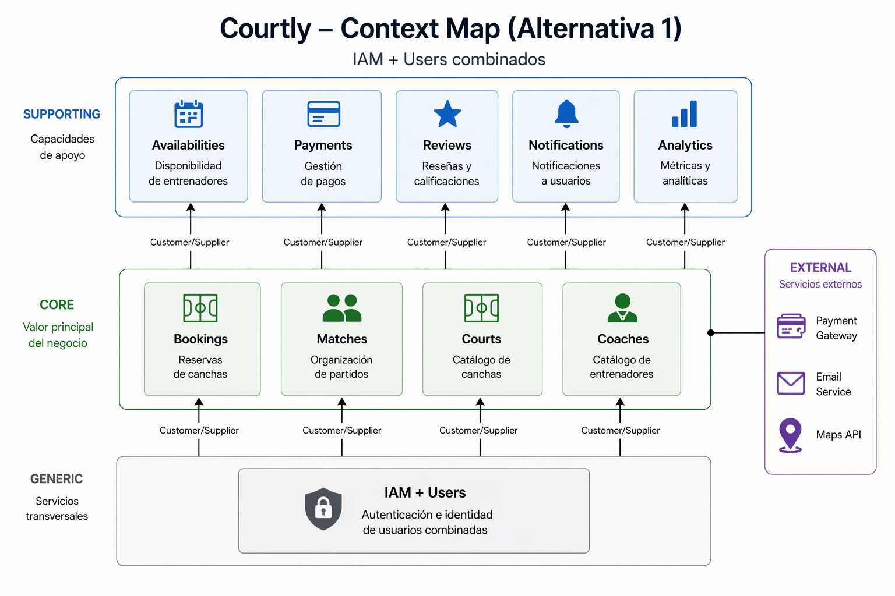

Esta alternativa proponía fusionar autenticación e identidad funcional en un solo contexto. Su principal ventaja era simplificar el flujo del frontend, ya que el usuario obtendría directamente una identidad válida para operar en reservas, partidos, pagos, reseñas y notificaciones después del login. Además, reducía la necesidad de resolver manualmente la relación entre `UserId` y `UserProfileId`.

Sin embargo, esta unificación mezclaba responsabilidades distintas dentro de un mismo bounded context. IAM pertenece al ámbito de seguridad, credenciales y autorización, mientras que Users representa la identidad funcional del negocio. Mantener ambas capacidades juntas aumentaba el acoplamiento y dificultaba la evolución independiente de cada una, por lo que esta alternativa fue descartada.

---

##### Alternativa 2: IAM y Users separados con ACL

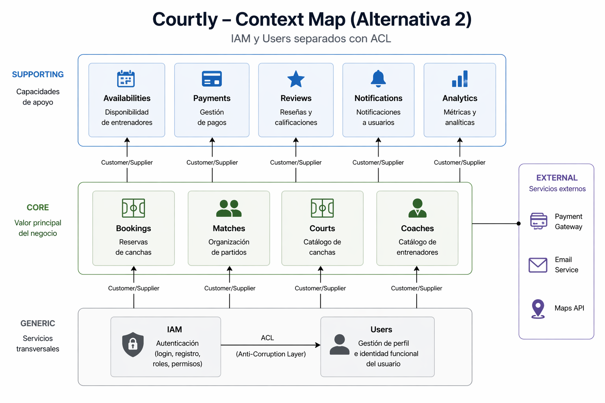

Esta alternativa mantiene separados los contextos de autenticación e identidad funcional, incorporando una capa **ACL** para traducir la identidad autenticada hacia la identidad de negocio. De esta forma, el sistema preserva la responsabilidad específica de cada contexto y evita contaminar el dominio operativo con conceptos propios de seguridad.

La principal ventaja de esta propuesta es que mantiene un modelo más limpio y alineado con Domain-Driven Design. IAM sigue resolviendo autenticación, roles y acceso, mientras Users continúa actuando como proveedor de la identidad funcional consumida por los contextos operativos. Debido a este equilibrio entre desacoplamiento y claridad de responsabilidades, esta alternativa fue seleccionada como base del diseño final.

---

##### Alternativa 3: Integrar Availabilities en Coaches

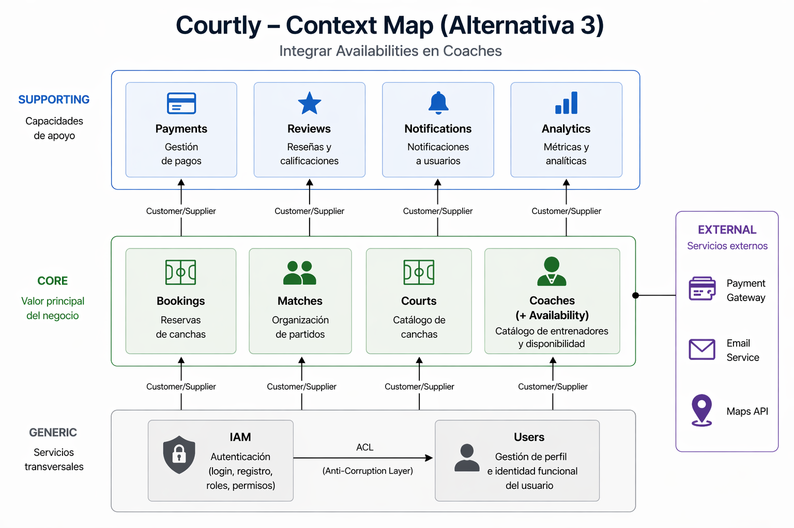

Esta alternativa buscaba reducir la cantidad de bounded contexts integrando la disponibilidad de entrenadores dentro del contexto **Coaches**. A simple vista, la decisión parecía razonable, ya que la disponibilidad depende directamente del entrenador y forma parte de su oferta de servicio.

No obstante, el análisis mostró que **Availabilities** posee reglas propias, estados específicos y una posible evolución independiente, por ejemplo en validación de solapamientos, reglas de agenda o automatización de disponibilidad. Integrarlo dentro de Coaches habría reducido contextos, pero también habría debilitado la cohesión del modelo del entrenador. Por ello, se descartó y se mantuvo como contexto separado.

---

##### Alternativa 4: Fusionar Bookings y Matches

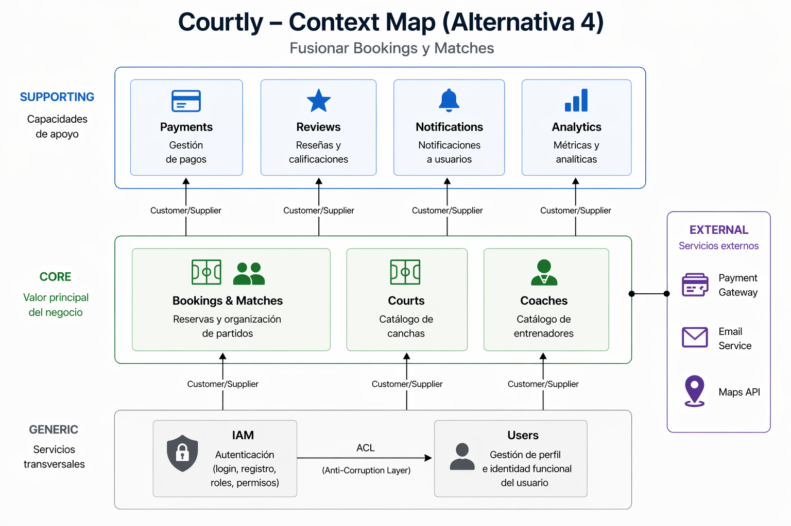

Esta alternativa agrupaba reservas y organización de partidos en un solo contexto operativo. La motivación principal era que ambos procesos utilizan canchas y usuarios, y están estrechamente relacionados dentro de la experiencia deportiva de la plataforma.

Sin embargo, al revisar las reglas del dominio se observó que representan procesos distintos. **Bookings** es principalmente transaccional, ya que modela la reserva de un recurso físico en un horario determinado. **Matches**, en cambio, incorpora una lógica más organizacional y social, con conceptos como cupos, estado del partido y usuario creador. Fusionarlos habría generado un contexto más grande pero menos claro, por lo que se descartó para evitar complejidad innecesaria.

---

##### Alternativa 5: Agrupar contextos de soporte

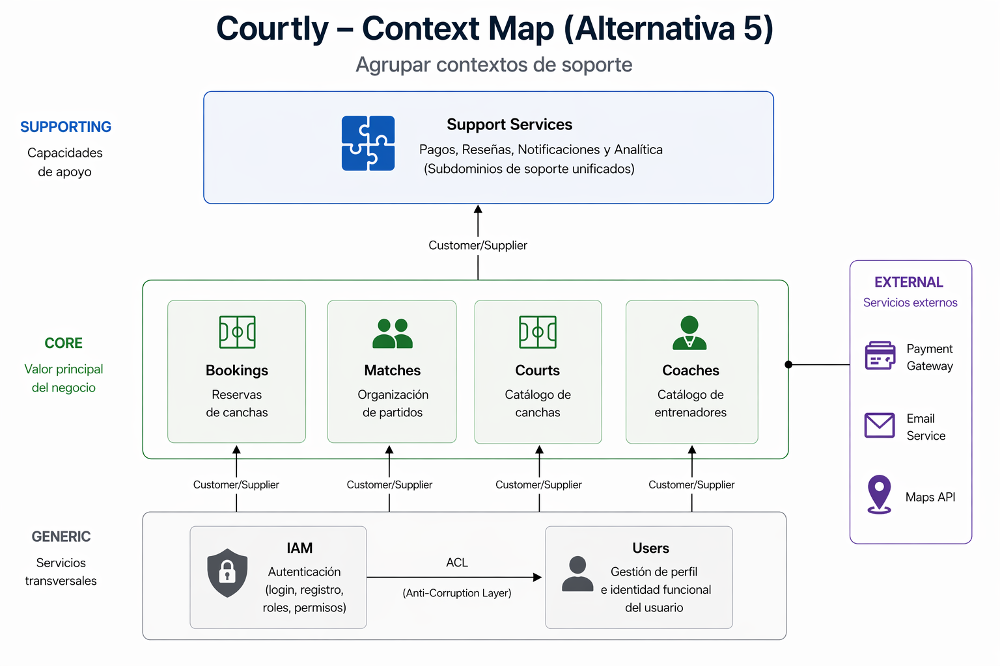

Esta alternativa proponía unificar **Payments, Reviews, Notifications y Analytics** dentro de un único contexto de soporte. Su ventaja principal era reducir la fragmentación estructural del sistema y simplificar visualmente el mapa general.

A pesar de ello, el equipo identificó que estos contextos responden a subdominios muy diferentes: pagos, reputación, mensajería y métricas. Agruparlos en una sola unidad habría disminuido la cohesión interna y dificultado su evolución futura, ya que cada uno tiene reglas, objetivos y ciclos de cambio distintos. Por esa razón, esta alternativa fue descartada.

---

##### Alternativa 6: Shared Kernel para Users

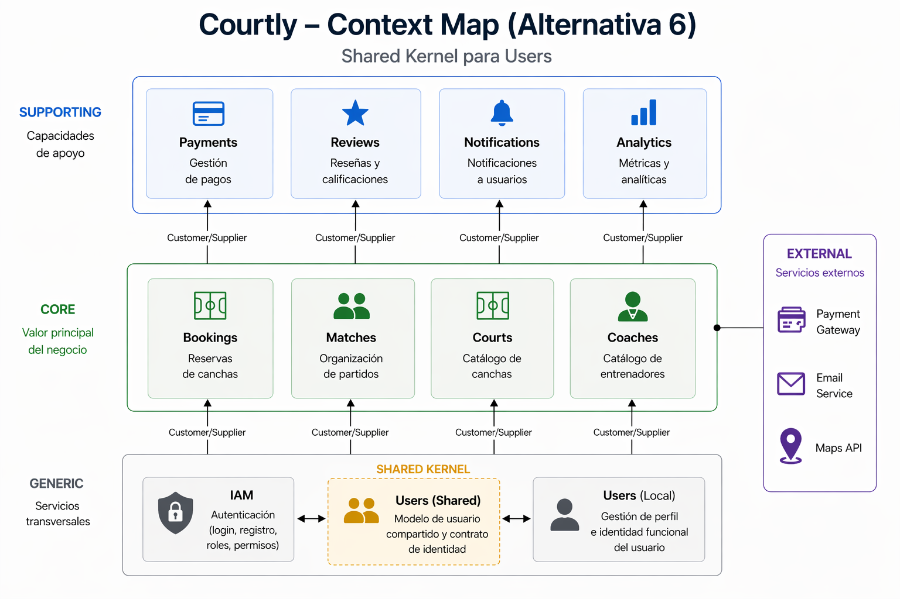

En esta alternativa se evaluó compartir la identidad de usuario mediante un **Shared Kernel**, con el objetivo de establecer un contrato común reutilizable entre múltiples contextos que dependen de `UserProfile`. Esta propuesta parecía útil porque varios módulos del sistema consumen la identidad funcional del usuario como referencia central.

Sin embargo, un Shared Kernel implica coordinación constante entre los contextos que lo comparten, lo que incrementa el costo de mantenimiento y vuelve más rígida la evolución del modelo. En un sistema como Courtly, donde varios bounded contexts necesitan consumir identidad, esta decisión podía generar dependencia excesiva. Por ello, no fue adoptada en el diseño final y se prefirió una relación más clara de tipo Customer/Supplier entre Users y los contextos que consumen la identidad funcional.

---

#### Discusión y selección de la mejor aproximación

La mejor solución fue mantener bounded contexts cohesionados y conectados mediante relaciones explícitas, evitando fusiones innecesarias.

Se definieron tres capas:

- **Generic**: IAM, Users  
- **Core**: Courts, Coaches, Bookings, Matches  
- **Supporting**: Availabilities, Payments, Reviews, Notifications, Analytics  

---

#### Context Map Final

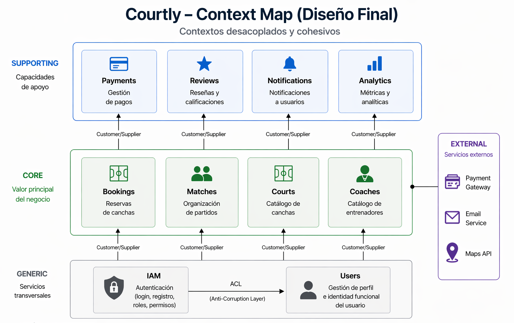

#### Context Map — Leyenda rápida

- **Core**: valor principal del negocio  
- **Supporting**: capacidades de apoyo  
- **Generic**: servicios transversales  

**Tipos de relación:**
- **Customer/Supplier**: el contexto consumidor depende del contrato del proveedor.  
- **ACL (Anti-Corruption Layer)**: capa que traduce o protege al dominio frente a otro contexto.  
- **Conformist**: el downstream adopta el modelo del upstream sin traducción.
- **Shared Kernel**: artefactos compartidos entre contextos.
---

#### Descripción de cada Bounded Context

#### Core
- **Bookings** – reservas de canchas  
- **Matches** – organización de partidos  
- **Courts** – catálogo de canchas  
- **Coaches** – catálogo de entrenadores  

#### Supporting
- **Availabilities** – disponibilidad de entrenadores  
- **Payments** – pagos  
- **Reviews** – reseñas  
- **Notifications** – notificaciones  
- **Analytics** – métricas  

#### Generic
- **IAM** – autenticación  
- **Users** – perfil de usuario  

---

#### Relaciones entre Contextos (con patrón DDD)

| # | Upstream (provee) | Downstream (consume) | Patrón | ¿Qué fluye? |
|---|---|---|---|---|
| R1 | IAM | Users | ACL | Traducción de UserId a UserProfileId |
| R2 | Users | Bookings | Customer/Supplier | UserProfileId |
| R3 | Users | Matches | Customer/Supplier | Usuario creador |
| R4 | Users | Payments | Customer/Supplier | Usuario |
| R5 | Users | Reviews | Customer/Supplier | Autor |
| R6 | Users | Notifications | Customer/Supplier | Destinatario |
| R7 | Courts | Bookings | Customer/Supplier | CourtId |
| R8 | Courts | Matches | Customer/Supplier | CourtId |
| R9 | Coaches | Availabilities | Customer/Supplier | CoachId |
| R10 | Coaches | Analytics | Customer/Supplier | Métricas |
| R11 | Coaches | Reviews | Referencia semántica | targetId |
| R12 | Courts | Reviews | Referencia semántica | targetId |

---

#### Contratos de Mensajes (mini-catálogo)

El siguiente catálogo resume de forma conceptual los principales comandos, queries y eventos asociados a cada contexto, con fines de modelado del Context Map. Estos contratos reflejan tanto las capacidades actuales del sistema como su comportamiento esperado a nivel de dominio.

> **Comandos** (→), **Eventos** (¡), **Queries** (¿)

---

#### IAM
- → SignUp(username, password, roles?)
- → SignIn(username, password)
- ¿ GetUserById(id)
- ¿ GetRoles()
- ¡ UserAuthenticated

---

#### Users
- → CreateUserProfile(name, email, phone)
- → UpdateUserProfile(id, data)
- → DeleteUserProfile(id)
- ¿ GetUserProfiles()
- ¿ GetUserProfileById(id)
- ¡ UserProfileCreated

---

#### Coaches
- → CreateCoach(name, expertise, phone)
- → UpdateCoach(id, data)
- → DeleteCoach(id)
- ¿ GetCoaches()
- ¿ GetCoachById(id)

---

#### Courts
- → CreateCourt(name, location, type)
- → UpdateCourt(id, data)
- → DeleteCourt(id)
- ¿ GetCourts()
- ¿ GetCourtById(id)

---

#### Availabilities
- → CreateAvailability(date, startTime, endTime, status, coachId)
- → UpdateAvailability(id, data)
- → DeleteAvailability(id)
- ¿ GetAvailabilities()
- ¿ GetAvailabilityById(id)

---

#### Bookings
- → CreateBooking(startTime, endTime, userProfileId, courtId)
- → UpdateBooking(id, data)
- → DeleteBooking(id)
- ¿ GetBookings()
- ¿ GetBookingById(id)
- ¡ BookingCreated

---

#### Matches
- → CreateMatch(title, description, dateTime, courtId, createdById)
- → UpdateMatch(id, data)
- → DeleteMatch(id)
- ¿ GetMatches()
- ¿ GetMatchById(id)
- ¡ MatchCreated

---

#### Payments
- → CreatePayment(amount, userProfileId)
- ¿ GetPaymentById(id)
- ¡ PaymentCreated

---

#### Reviews
- → CreateReview(score, comment, targetId, targetType, userProfileId)
- → UpdateReview(id, data)
- → DeleteReview(id)
- ¿ GetReviews()
- ¿ GetReviewById(id)

---

#### Notifications
- → CreateNotification(title, message, userProfileId)
- → UpdateNotification(id, data)
- → DeleteNotification(id)
- ¿ GetNotifications()
- ¿ GetNotificationById(id)

---

#### Analytics
- → CreateMetric(metricType, value, period, coachId)
- → UpdateMetric(id, data)
- → DeleteMetric(id)
- ¿ GetMetrics()
- ¿ GetMetricById(id)

---

#### Justificación del Context Map final

El diseño final mantiene separadas las responsabilidades de seguridad, identidad funcional, operación principal y soporte.

Los contextos core representan la propuesta de valor del sistema, mientras que los supporting complementan la experiencia. Los contextos generic permiten el funcionamiento transversal del sistema.

Esta estructura logra un equilibrio entre cohesión y bajo acoplamiento, alineado con los principios de Domain-Driven Design.

---

#### Capability Layering Map

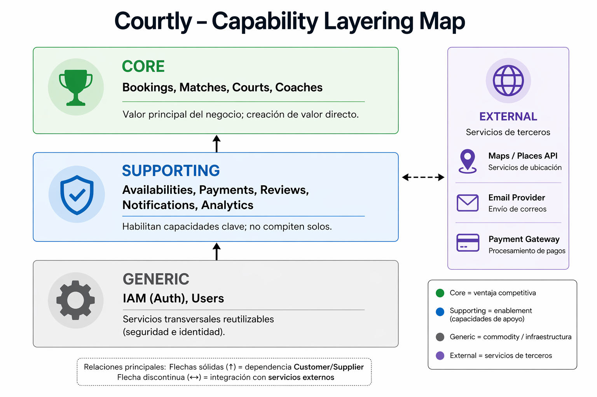

### 2.5.3. Software Architecture

#### 2.5.3.1. Software Architecture Context Level Diagrams


#### 2.5.3.2. Software Architecture Container Level Diagrams


#### 2.5.3.3. Software Architecture Deployment Diagrams

Diagrama de componentes IAM


Diagrama de componentes Users


Diagrama de componentes Courts


Diagrama de componentes Booking


Diagrama de componentes Payments


Diagrama de componentes Coaches


Diagrama de componentes Reviews


Diagrama de componentes Notificacions


Diagrama de componentes Matches


Diagrama de componentes Availabilities


Diagrama de componentes Analytics


Diagrama de componentes Training Sessions 


---

## 2.6. Tactical-Level Domain-Driven Design

La presente seccion desarrolla el Tactical-Level Domain-Driven Design del backend de Courtly a partir del codigo fuente actual. El objetivo es describir, para cada bounded context, su agregado principal, sus objetos de coordinacion, las reglas de negocio identificables en el codigo, sus puntos de integracion con otros contextos y los diagramas tecnicos que representan su estructura.

El analisis se realiza sobre la implementacion real del backend en `com.upc.courtly`, por lo que cada descripcion se ha construido a partir de controladores, agregados, servicios, comandos, queries, repositorios y recursos REST existentes. Cuando un elemento no se identifica de forma explicita en el codigo, se indica expresamente.

---

### 2.6.1. Bounded Context: Bookings

El bounded context **Bookings** representa la capacidad del sistema encargada de gestionar la reserva simple de canchas deportivas. Su proposito es permitir que un usuario cree, consulte, actualice, cancele, complete y elimine reservas asociadas a una cancha dentro de un intervalo de tiempo determinado. La entidad principal del contexto es `Booking`, ya que concentra la relacion entre el usuario funcional, la cancha reservada, el rango horario y el estado operativo de la reserva.

Este contexto se relaciona directamente con **Users**, **Courts**, **Payments** y **Notifications**. Depende de `UserProfile` y `Court` para construir la reserva, de `Payments` para confirmar economicamente la operacion y de `Notifications` para informar eventos como creacion, confirmacion o cancelacion.

#### 2.6.1.1. Domain Layer

La Domain Layer del bounded context **Bookings** contiene el agregado raiz, los comandos, las queries, los contratos de servicio y el repositorio que modelan el flujo de reserva simple de cancha.

##### a) Entity / Aggregate Root: `Booking`

**Nombre de la clase:** `Booking`  
**Paquete:** `com.upc.courtly.bookings.domain.model.aggregates`

**Proposito:**  
Representa la reserva simple de una cancha para un usuario funcional. Es el agregado raiz del contexto y encapsula el estado de negocio de la reserva.

**Atributos identificados en el codigo:**
- `id: Long`
- `startTime: LocalDateTime`
- `endTime: LocalDateTime`
- `user: UserProfile`
- `court: Court`
- `status: BookingStatus`
- `createdAt: LocalDateTime`

**Metodos identificados:**
- `Booking(LocalDateTime startTime, LocalDateTime endTime, UserProfile user, Court court)`
- `updateBooking(LocalDateTime startTime, LocalDateTime endTime)`
- `confirm()`
- `cancel()`
- `complete()`
- `onCreate()`

**Relaciones principales:**
- Un `Booking` pertenece a un solo `UserProfile`.
- Un `Booking` pertenece a una sola `Court`.
- Un `UserProfile` puede tener multiples bookings.
- Una `Court` puede participar en multiples bookings en distintos periodos.

##### b) Referencias externas del dominio

**`UserProfile`**  
**Bounded context de origen:** `Users`  
**Uso dentro de Bookings:** representa al usuario que crea la reserva.

**`Court`**  
**Bounded context de origen:** `Courts`  
**Uso dentro de Bookings:** representa la cancha reservada y aporta su identidad para validaciones de solapamiento.

##### c) Value Objects

En el codigo actual no se identifica un value object propio para el rango horario. Sin embargo, si existe el enum `BookingStatus` en `com.upc.courtly.bookings.domain.model.valueobjects`.

**`BookingStatus`**
- `PENDING_PAYMENT`
- `CONFIRMED`
- `CANCELLED`
- `COMPLETED`

##### d) Commands del dominio

**`CreateBookingCommand`**  
Paquete: `com.upc.courtly.bookings.domain.model.commands`
- `startTime`
- `endTime`
- `userId`
- `courtId`

**`UpdateBookingCommand`**
- `bookingId`
- `startTime`
- `endTime`

**`CancelBookingCommand`**
- `bookingId`

**`CompleteBookingCommand`**
- `bookingId`

**`DeleteBookingCommand`**
- `bookingId`

##### e) Queries del dominio

**`GetAllBookingsQuery`**  
No contiene atributos.

**`GetBookingByIdQuery`**
- `bookingId`

##### f) Domain Services

**`BookingCommandService`**
- `Optional<Booking> handle(CreateBookingCommand command)`
- `Optional<Booking> handle(UpdateBookingCommand command)`
- `Optional<Booking> handle(CancelBookingCommand command)`
- `Optional<Booking> handle(CompleteBookingCommand command)`
- `void handle(DeleteBookingCommand command)`

**`BookingQueryService`**
- `List<Booking> handle(GetAllBookingsQuery query)`
- `Optional<Booking> handle(GetBookingByIdQuery query)`

##### g) Repository

**`BookingRepository`**  
Paquete: `com.upc.courtly.bookings.infrastructure.persistence.jpa.repositories`

**Operaciones identificadas:**
- `save(...)`
- `findById(...)`
- `findAll()`
- `deleteById(...)`
- `existsById(...)`
- `existsOverlappingBooking(...)`

##### h) Reglas de negocio identificadas

**Reglas implementadas actualmente:**
- el usuario referenciado debe existir;
- la cancha referenciada debe existir;
- no se permite crear o actualizar una reserva si ya existe un booking solapado para la misma cancha con estados `PENDING_PAYMENT` o `CONFIRMED`;
- la reserva se crea inicialmente con estado `PENDING_PAYMENT`;
- una reserva puede pasar a `CONFIRMED` cuando se registra un pago valido;
- una reserva puede cancelarse y completarse mediante comandos especificos;
- el contexto emite notificaciones de creacion y cancelacion.

**Observaciones de mejora:**
- no se identifica una validacion explicita de `startTime < endTime` dentro del agregado `Booking`;
- no se modela el rango horario como value object;
- el contexto no incorpora politicas avanzadas de reprogramacion ni expiracion automatica.

#### 2.6.1.2. Interface Layer

La Interface Layer de **Bookings** expone las operaciones REST del contexto y transforma los recursos externos en comandos o respuestas.

##### a) `BookingsController`

**Paquete:** `com.upc.courtly.bookings.interfaces.rest`

**Responsabilidad principal:**  
Recibir solicitudes HTTP para el flujo de reserva simple y delegarlas a `BookingCommandService` y `BookingQueryService`.

**Endpoints expuestos:**
- `POST /api/v1/bookings`
- `GET /api/v1/bookings`
- `GET /api/v1/bookings/{id}`
- `PUT /api/v1/bookings/{id}`
- `POST /api/v1/bookings/{id}/cancel`
- `POST /api/v1/bookings/{id}/complete`
- `DELETE /api/v1/bookings/{id}`

##### b) Resources / DTOs

**`BookingResource`**
- `id`
- `startTime`
- `endTime`
- `status`
- `user: UserSummaryResource`
- `court: CourtSummaryResource`

**`CreateBookingResource`**
- `startTime`
- `endTime`
- `userId`
- `courtId`

**`UpdateBookingResource`**
- `startTime`
- `endTime`

##### c) Assemblers

**`BookingResourceFromEntityAssembler`**  
Transforma `Booking` en `BookingResource`.

**`CreateBookingCommandFromResourceAssembler`**  
Transforma `CreateBookingResource` en `CreateBookingCommand`.

**`UpdateBookingCommandFromResourceAssembler`**  
Transforma `UpdateBookingResource` y el id path en `UpdateBookingCommand`.

##### d) Responsabilidad de la capa de interfaz

La capa de interfaz recibe los datos del cliente, los adapta a la semantica del dominio y devuelve respuestas simplificadas para el frontend movil.

#### 2.6.1.3. Application Layer

La Application Layer coordina los casos de uso del bounded context **Bookings** y articula las dependencias hacia Users, Courts y Notifications.

##### a) Command Services / Command Handlers

**`BookingCommandServiceImpl`**  
Paquete: `com.upc.courtly.bookings.application.internal.commandservices`

**Dependencias identificadas:**
- `BookingRepository`
- `UserProfileRepository`
- `CourtRepository`
- `NotificationRepository`

**Operaciones que maneja:**
- crear booking;
- actualizar booking;
- cancelar booking;
- completar booking;
- eliminar booking.

##### b) Query Services / Query Handlers

**`BookingQueryServiceImpl`**

**Dependencias:**
- `BookingRepository`

**Operaciones:**
- recuperar todas las reservas;
- recuperar una reserva por identificador.

##### c) Flujos principales del negocio

**Flujo de creacion**
1. El cliente envia `CreateBookingResource`.
2. El controller genera `CreateBookingCommand`.
3. `BookingCommandServiceImpl` valida usuario, cancha y solapamientos.
4. Se construye `Booking` en estado `PENDING_PAYMENT`.
5. Se persiste la reserva y se registra una notificacion `BOOKING_CREATED`.

**Flujo de actualizacion**
1. Se recibe `UpdateBookingResource`.
2. El service recupera la reserva.
3. Se verifica que el nuevo horario no genere conflicto.
4. Se actualizan `startTime` y `endTime`.

**Flujo de cancelacion**
1. Se recibe `CancelBookingCommand`.
2. El booking cambia a `CANCELLED`.
3. Se registra una notificacion `BOOKING_CANCELLED`.

**Flujo de completado**
1. Se recibe `CompleteBookingCommand`.
2. El booking pasa a `COMPLETED`.

##### d) Observaciones de la capa de aplicacion

La capa de aplicacion ya no es un CRUD plano, porque incorpora control de estado, validacion de solapamiento y eventos de notificacion. Aun asi, no se identifica una politica de expiracion automatica para bookings pendientes de pago.

#### 2.6.1.4. Infrastructure Layer

La Infrastructure Layer implementa la persistencia JPA del agregado `Booking` y sus consultas de apoyo.

##### a) Repositorios de persistencia

**`BookingRepository`** extiende `JpaRepository<Booking, Long>` y agrega una consulta de solapamiento.

##### b) Persistencia de entidades

`Booking` se persiste con:
- `@Entity`
- `@Table(name = "bookings")`
- `@ManyToOne(fetch = FetchType.LAZY)` hacia `UserProfile`
- `@ManyToOne(fetch = FetchType.LAZY)` hacia `Court`
- `@Enumerated(EnumType.STRING)` para `status`

##### c) Diseno de persistencia

**Tabla principal:** `bookings`

**Columnas identificadas:**
- `id`
- `start_time`
- `end_time`
- `user_id`
- `court_id`
- `status`
- `created_at`

##### d) Integracion con otros bounded contexts

El contexto se integra con:
- `Users`, mediante `UserProfileRepository`;
- `Courts`, mediante `CourtRepository`;
- `Notifications`, mediante `NotificationRepository`;
- `Payments`, de forma indirecta, porque el pago confirma el booking.

##### e) Configuracion tecnica relevante

No se identifica configuracion especifica propia del contexto. El comportamiento de persistencia depende de la configuracion JPA global del proyecto.

##### f) Limitaciones de infraestructura

No se identifican indices ni restricciones fisicas para prevenir solapamientos a nivel de base de datos; la validacion se resuelve en la capa de aplicacion.

#### 2.6.1.5. Bounded Context Software Architecture Component Level Diagrams

**Descripcion:**  
El diagrama de componentes del bounded context **Bookings** representa la descomposicion del contexto en controller REST, transformadores, servicios de aplicacion, agregado de dominio, persistencia y acceso a contextos externos. La arquitectura separa lectura y escritura, y muestra que el contexto valida usuarios y canchas antes de persistir una reserva.

**Componentes principales:**
- REST API Component
- REST Resources and Assemblers Component
- Domain Services Component
- Application Command Component
- Application Query Component
- Domain Model Component
- Persistence Component
- External Context Access Component

**Diagrama de componentes propuesto:**

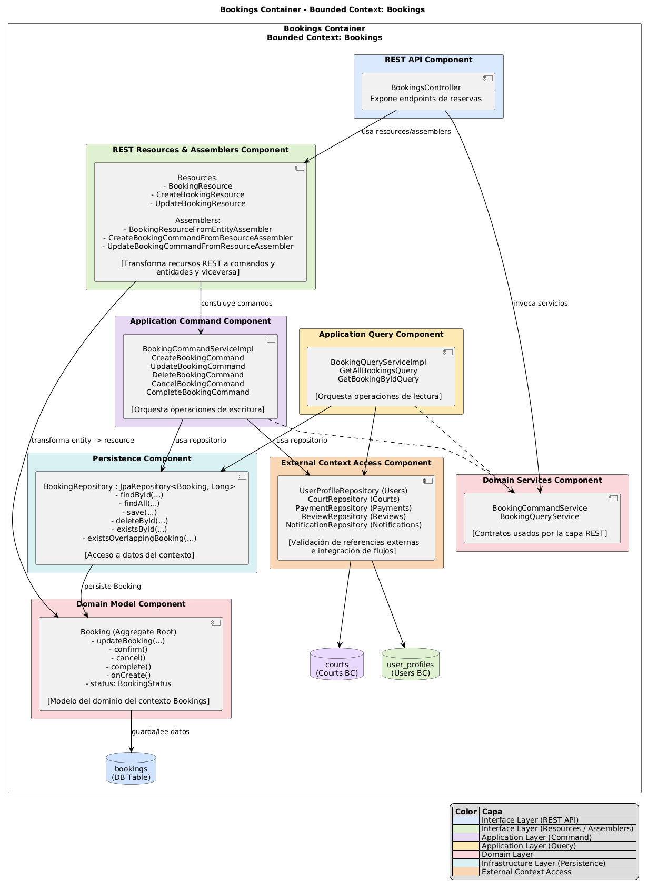

**Relaciones entre componentes:**
- el controller invoca servicios de comando y consulta;
- los assemblers convierten resources en comandos y entidades en resources;
- el command service utiliza repositorios externos para validar usuario y cancha;
- el repository persiste el agregado `Booking`;
- el contexto externo de notificaciones participa en eventos de negocio.

#### 2.6.1.6. Bounded Context Software Architecture Code Level Diagrams

En esta subseccion se presentan los diagramas a nivel de codigo del bounded context **Bookings**, orientados a mostrar la estructura del dominio y la persistencia relacional del agregado.

##### 2.6.1.6.1. Bounded Context Domain Layer Class Diagrams

**Descripcion:**  
El diagrama de clases del Domain Layer muestra a `Booking` como agregado raiz, el enum `BookingStatus`, los comandos que modelan las operaciones de escritura y las queries que representan las consultas del contexto.

**Diagrama UML de clases (Domain Layer):**

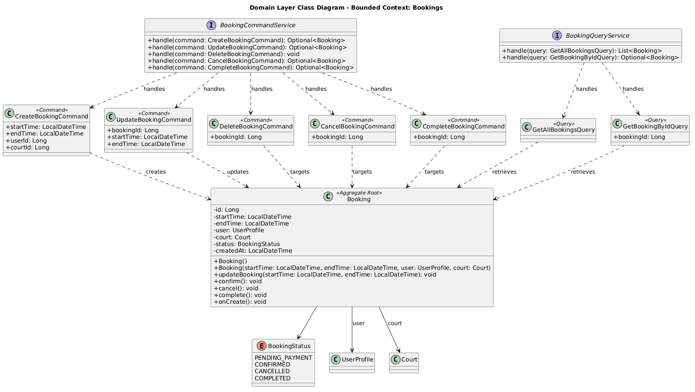

**Relaciones principales del modelo**
- `Booking` es el aggregate root;
- `Booking` referencia a `UserProfile` y `Court`;
- `BookingCommandService` coordina create, update, cancel, complete y delete;
- `BookingQueryService` coordina las consultas.

**Observaciones**
- el modelo ya incorpora estado explicito de reserva;
- no se identifica un value object propio para el rango de tiempo.

##### 2.6.1.6.2. Bounded Context Database Design Diagram

**Descripcion**  
El diagrama ERD del bounded context **Bookings** muestra la tabla `bookings` y sus relaciones con `user_profiles` y `courts`.

**Diagrama de base de datos (ERD)**

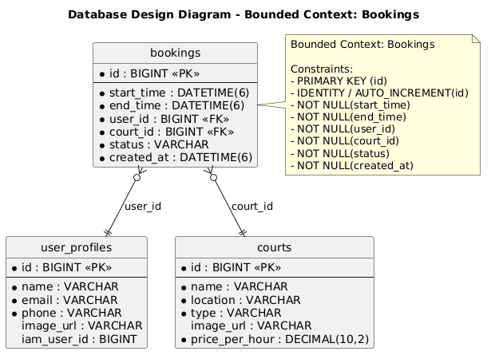

**Tablas y atributos**

Tabla `bookings`
- `id`
- `start_time`
- `end_time`
- `user_id`
- `court_id`
- `status`
- `created_at`

Tabla `user_profiles`
- `id`
- `name`
- `email`
- `phone`
- `image_url`
- `iam_user_id`

Tabla `courts`
- `id`
- `name`
- `location`
- `type`
- `image_url`
- `price_per_hour`

**Constraints**
- primary key en `bookings.id`;
- foreign key `user_id -> user_profiles.id`;
- foreign key `court_id -> courts.id`;
- `start_time`, `end_time`, `user_id`, `court_id`, `status` y `created_at` son obligatorios.

**Relaciones entre tablas**
- `user_profiles (1) ---- (*) bookings`
- `courts (1) ---- (*) bookings`

**Observaciones**
- la tabla refleja adecuadamente el estado del booking;
- la restriccion de no solapamiento no se implementa fisicamente en la base de datos.

---

### 2.6.2. Bounded Context: Payments

El bounded context **Payments** representa la capacidad encargada de registrar pagos asociados a una reserva simple de cancha o a una sesion con entrenador. Su proposito es consolidar la confirmacion economica de una operacion y enlazarla con el usuario que paga. La entidad principal es `Payment`, que actua como agregado raiz del contexto.

Este contexto se relaciona con **Users**, **Bookings**, **TrainingSessions** y **Notifications**, ya que requiere validar el usuario pagador, la operacion que se cancela y las notificaciones derivadas de la confirmacion del pago.

#### 2.6.2.1. Domain Layer

La Domain Layer de **Payments** modela el agregado de pago, sus value objects de estado y contexto, y los contratos de lectura y escritura asociados.

##### a) Entity / Aggregate Root: `Payment`

**Paquete:** `com.upc.courtly.payments.domain.model.aggregates`

**Atributos identificados:**
- `id: Long`
- `amount: BigDecimal`
- `user: UserProfile`
- `paymentStatus: PaymentStatus`
- `contextType: PaymentContextType`
- `booking: Booking`
- `trainingSession: TrainingSession`
- `createdAt: LocalDateTime`

**Metodos identificados:**
- constructores de creacion;
- `getPaymentDate()`
- `getStatus()`
- `updateStatus(PaymentStatus newStatus)`
- `onCreate()`

##### b) Referencias externas del dominio

**`UserProfile`** desde `Users`  
Representa al usuario que realiza el pago.

**`Booking`** desde `Bookings`  
Representa una reserva simple de cancha pagable.

**`TrainingSession`** desde `TrainingSessions`  
Representa una sesion con entrenador aceptada y pagable.

##### c) Value Objects

**`PaymentStatus`**
- `PENDING`
- `COMPLETED`
- `FAILED`
- `CANCELLED`

**`PaymentContextType`**
- `BOOKING`
- `TRAINING_SESSION`

##### d) Commands del dominio

**`CreatePaymentCommand`**
- `userId`
- `bookingId`
- `trainingSessionId`

No se identifican comandos de actualizacion o eliminacion propios del contexto.

##### e) Queries del dominio

**`GetPaymentByIdQuery`**
- `paymentId`

No se identifica una query formal de lista global; la consulta de pagos del usuario se materializa desde controller y repositorio.

##### f) Domain Services

**`PaymentCommandService`**
- `Optional<Payment> handle(CreatePaymentCommand command)`

**`PaymentQueryService`**
- `Optional<Payment> handle(GetPaymentByIdQuery query)`
- `List<Payment> handle()`

##### g) Repository

**`PaymentRepository`**
- `save(...)`
- `findById(...)`
- `findAll()`
- `findByUserIdOrderByCreatedAtDesc(...)`
- `existsByBookingIdAndPaymentStatus(...)`
- `existsByTrainingSessionIdAndPaymentStatus(...)`

##### h) Reglas de negocio identificadas

**Reglas implementadas actualmente:**
- el usuario debe existir;
- el pago debe apuntar exactamente a una operacion: booking o training session;
- si el pago apunta a un booking, este debe pertenecer al usuario;
- no se permite pagar dos veces un mismo booking con estado `COMPLETED`;
- el monto del booking se calcula en servidor usando la duracion y `pricePerHour`;
- si el pago apunta a una training session, esta debe pertenecer al jugador y estar en estado `ACCEPTED`;
- no se permite pagar dos veces una misma training session con pago completado;
- el pago completado actualiza el booking a `CONFIRMED` cuando corresponde;
- el contexto registra notificaciones de confirmacion.

**Observaciones de mejora:**
- no se identifica integracion con pasarela de pago externa;
- no existe un flujo de conciliacion o reintento;
- la clase `Payment` no encapsula por si sola las reglas de calculo del monto.

#### 2.6.2.2. Interface Layer

La Interface Layer del bounded context **Payments** expone las operaciones REST necesarias para crear pagos y consultar los pagos del usuario autenticado.

##### a) `PaymentsController`

**Paquete:** `com.upc.courtly.payments.interfaces.rest`

**Endpoints expuestos:**
- `POST /api/v1/payments`
- `GET /api/v1/payments`
- `GET /api/v1/payments/{id}`

**Dependencias principales:**
- `PaymentCommandService`
- `PaymentQueryService`
- `PaymentRepository`
- `AuthenticatedContextFacade`

##### b) Resources / DTOs

**`PaymentResource`**
- `id`
- `amount`
- `paymentDate`
- `status`
- `contextType`
- `bookingId`
- `trainingSessionId`
- `user`

**`CreatePaymentResource`**
- `userId`
- `bookingId`
- `trainingSessionId`

##### c) Assemblers

**`PaymentResourceFromEntityAssembler`**  
Transforma `Payment` en `PaymentResource`.

**`CreatePaymentCommandFromResourceAssembler`**  
Transforma `CreatePaymentResource` en `CreatePaymentCommand`.

##### d) Responsabilidad de la capa de interfaz

La capa de interfaz expone el alta de pagos y protege la consulta de pagos del usuario autenticado. El listado no es una consulta abierta del sistema, sino una vista de pagos propios.

#### 2.6.2.3. Application Layer

La Application Layer de **Payments** implementa la validacion del contexto pagado, el calculo del monto y la emision de notificaciones.

##### a) Command Services / Command Handlers

**`PaymentCommandServiceImpl`**

**Dependencias identificadas:**
- `PaymentRepository`
- `UserProfileRepository`
- `BookingRepository`
- `TrainingSessionRepository`
- `NotificationRepository`

**Operaciones que maneja:**
- crear pago para booking;
- crear pago para training session.

##### b) Query Services / Query Handlers

**`PaymentQueryServiceImpl`**

**Dependencias:**
- `PaymentRepository`

**Operaciones:**
- obtener pago por id;
- obtener lista general de pagos persistidos.

##### c) Flujos principales del negocio

**Flujo de pago de booking**
1. El cliente envia `CreatePaymentResource`.
2. El service valida usuario y booking.
3. Calcula el monto desde la duracion y el precio por hora de la cancha.
4. Persiste `Payment` como completado.
5. Confirma el booking.
6. Registra `PAYMENT_CONFIRMED` y `BOOKING_CONFIRMED`.

**Flujo de pago de training session**
1. Se valida que la sesion exista y pertenezca al jugador.
2. La sesion debe estar `ACCEPTED`.
3. El monto se obtiene de `trainingSession.price`.
4. Se persiste el pago y se notifica la confirmacion.

##### d) Observaciones de la capa de aplicacion

El contexto ya resuelve reglas transaccionales relevantes, pero todavia no integra infraestructura financiera real ni politicas de idempotencia externa.

#### 2.6.2.4. Infrastructure Layer

La Infrastructure Layer de **Payments** persiste el agregado `Payment` y sus referencias hacia bookings y training sessions.

##### a) Repositorios de persistencia

`PaymentRepository` extiende `JpaRepository<Payment, Long>` y agrega busquedas por usuario y validaciones de pago duplicado por contexto.

##### b) Persistencia de entidades

`Payment` utiliza relaciones `@ManyToOne` con `UserProfile`, `Booking` y `TrainingSession`, y enums persistidos como string para `paymentStatus` y `contextType`.

##### c) Diseno de persistencia

**Tabla principal:** `payments`

**Columnas identificadas:**
- `id`
- `amount`
- `user_id`
- `payment_status`
- `context_type`
- `booking_id`
- `training_session_id`
- `created_at`

##### d) Integracion con otros bounded contexts

El contexto depende de:
- `Users`, para resolver el pagador;
- `Bookings`, para pagos de reserva simple;
- `TrainingSessions`, para pagos de sesiones;
- `Notifications`, para registrar eventos.

##### e) Configuracion tecnica relevante

No se identifica configuracion tecnica propia del contexto.

##### f) Limitaciones de infraestructura

No existe pasarela de pago externa ni persistencia de auditoria financiera avanzada.

#### 2.6.2.5. Bounded Context Software Architecture Component Level Diagrams

**Descripcion:**  
El diagrama de componentes del bounded context **Payments** muestra como el controller REST convierte solicitudes en comandos, como el command service valida el contexto objetivo del pago y como la persistencia registra la transaccion.

**Componentes principales:**
- REST API Component
- REST Resources and Assemblers Component
- Domain Services Component
- Application Command Component
- Application Query Component
- Domain Model Component
- Persistence Component
- External Context Access Component

**Diagrama de componentes propuesto:**

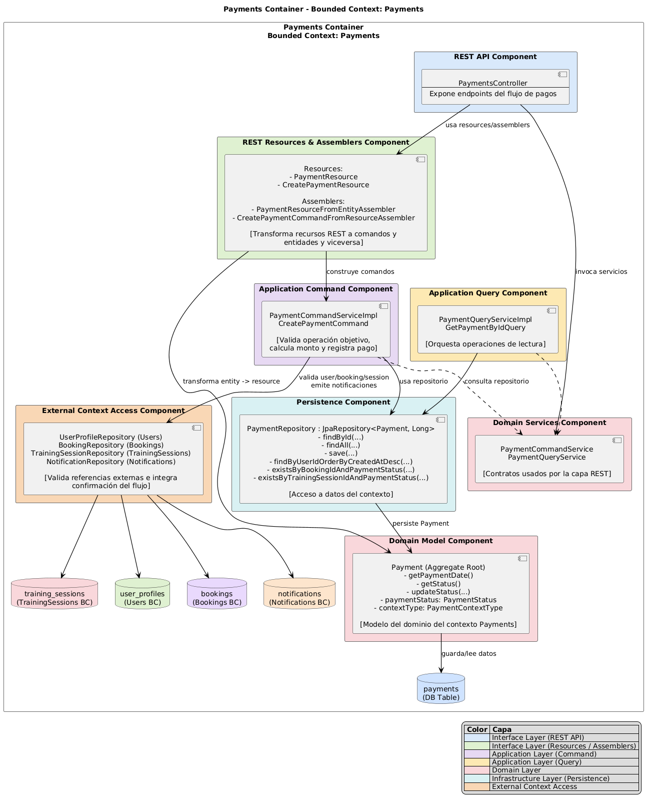

**Relaciones entre componentes:**
- el controller delega creacion y consultas;
- el command service valida usuario, booking o training session;
- el repository persiste `Payment`;
- el acceso externo integra notificaciones y estado del booking.

#### 2.6.2.6. Bounded Context Software Architecture Code Level Diagrams

La representacion a nivel de codigo de **Payments** muestra el agregado `Payment`, sus enums y la estructura relacional de la tabla `payments`.

##### 2.6.2.6.1. Bounded Context Domain Layer Class Diagrams

**Descripcion:**  
El diagrama de clases del Domain Layer presenta `Payment` como agregado raiz y expone su relacion con `UserProfile`, `Booking` y `TrainingSession`.

**Diagrama UML de clases (Domain Layer):**

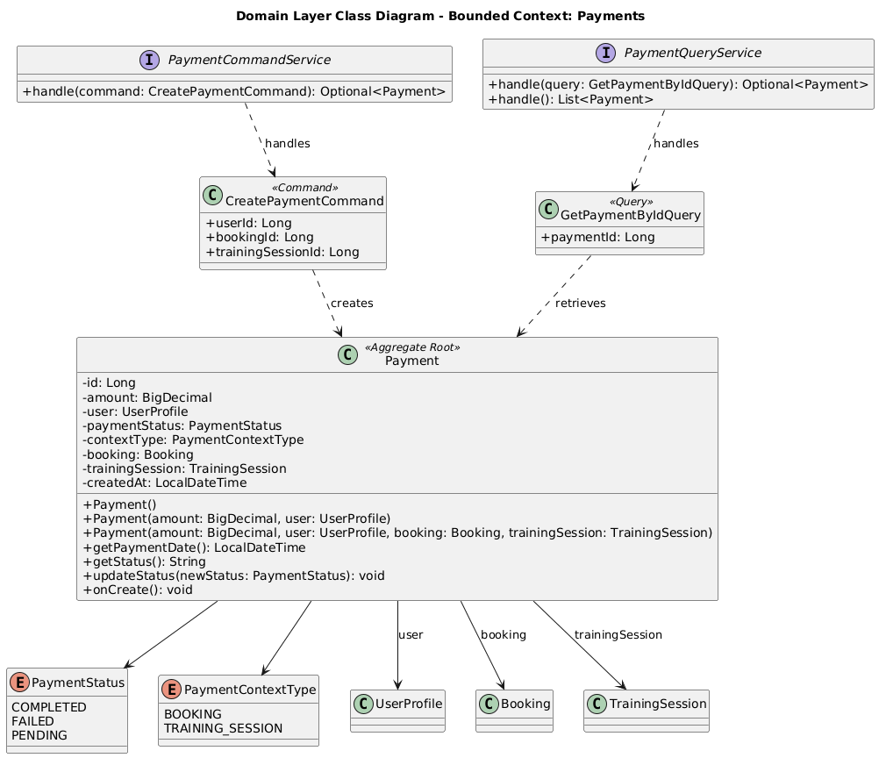

**Relaciones principales del modelo**
- `Payment` es el aggregate root;
- `Payment` utiliza `PaymentStatus` y `PaymentContextType`;
- `PaymentCommandService` gestiona el alta del pago;
- `PaymentQueryService` resuelve consultas.

**Observaciones**
- el modelo refleja bien el contexto pagado;
- las reglas fuertes residen en la capa de aplicacion.

##### 2.6.2.6.2. Bounded Context Database Design Diagram

**Descripcion**  
El ERD de **Payments** muestra la tabla `payments` y su relacion con `user_profiles`, `bookings` y `training_sessions`.

**Diagrama de base de datos (ERD)**

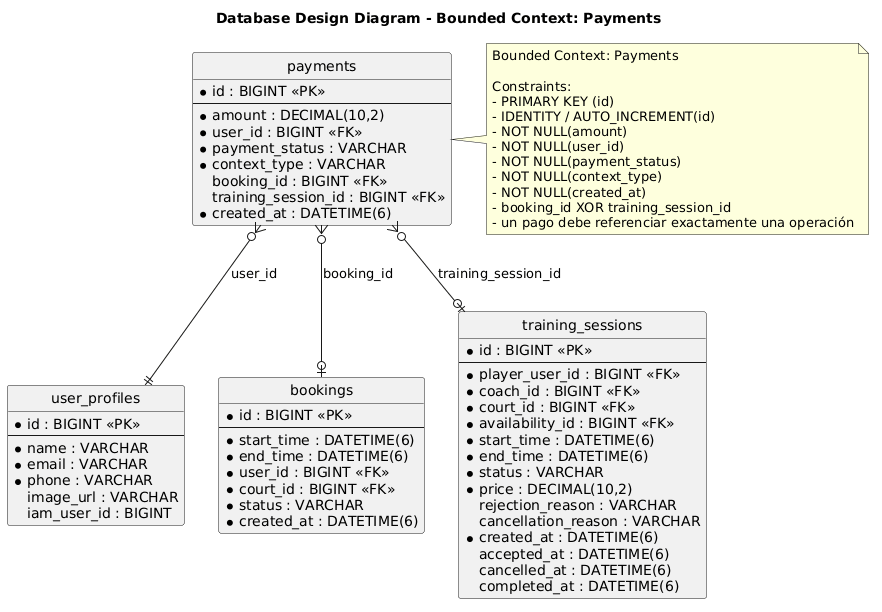

**Tablas y atributos**

Tabla `payments`
- `id`
- `amount`
- `user_id`
- `payment_status`
- `context_type`
- `booking_id`
- `training_session_id`
- `created_at`

**Constraints**
- primary key en `payments.id`;
- foreign key `user_id -> user_profiles.id`;
- `booking_id` y `training_session_id` son referencias opcionales mutuamente excluyentes a nivel logico;
- `amount`, `payment_status`, `context_type` y `created_at` son obligatorios.

**Relaciones entre tablas**
- `user_profiles (1) ---- (*) payments`
- `bookings (1) ---- (0..1) payments`
- `training_sessions (1) ---- (0..1) payments`

**Observaciones**
- la exclusividad entre booking y training session se controla en codigo, no mediante constraint fisico visible en el diagrama.

---

### 2.6.3. Bounded Context: Users

El bounded context **Users** representa la identidad funcional del usuario dentro del dominio del negocio. Su proposito es almacenar el perfil operativo que utiliza el resto del sistema para reservas, reseñas, partidos, pagos y notificaciones. La entidad principal es `UserProfile`.

El contexto se relaciona con **IAM**, porque vincula el perfil de negocio con `User`, y con practicamente todos los bounded contexts operativos, ya que `UserProfile` participa como actor del sistema.

#### 2.6.3.1. Domain Layer

##### a) Entity / Aggregate Root: `UserProfile`

**Paquete:** `com.upc.courtly.users.domain.model.aggregates`

**Atributos:**
- `id`
- `name`
- `email`
- `phone`
- `imageUrl`
- `user: User`

**Metodos identificados:**
- constructores de inicializacion;
- `updateProfile(...)`
- `assignUser(User user)`

##### b) Referencias externas del dominio

**`User`**  
**Bounded context de origen:** `IAM`  
Representa la cuenta autenticable a la que se vincula el perfil funcional.

##### c) Value Objects

No se identifican value objects propios en el codigo actual.

##### d) Commands del dominio

**`CreateUserProfileCommand`**
- `name`
- `email`
- `phone`
- `imageUrl`
- `userId`

**`UpdateUserProfileCommand`**
- `userProfileId`
- `name`
- `email`
- `phone`
- `imageUrl`

**`DeleteUserProfileCommand`**
- `userProfileId`

##### e) Queries del dominio

**`GetAllUserProfilesQuery`**  
Sin atributos.

**`GetUserProfileByIdQuery`**
- `userProfileId`

##### f) Domain Services

**`UserProfileCommandService`**
- create
- update
- delete

**`UserProfileQueryService`**
- get all
- get by id

##### g) Repository

**`UserProfileRepository`**
- `save(...)`
- `findById(...)`
- `findAll()`
- `deleteById(...)`
- `findByEmail(...)`
- `existsByEmail(...)`
- `findByUserId(...)`
- `existsByUserId(...)`

##### h) Reglas de negocio identificadas

**Reglas implementadas actualmente:**
- el email debe ser unico;
- un usuario IAM no puede tener mas de un `UserProfile`;
- si se proporciona `userId`, este debe existir en IAM;
- el perfil puede incluir `imageUrl`.

**Observaciones de mejora:**
- no se identifica validacion de formato de email;
- no se identifica un value object para informacion de contacto.

#### 2.6.3.2. Interface Layer

##### a) `UserProfilesController`

**Endpoints expuestos:**
- `POST /api/v1/user-profiles`
- `GET /api/v1/user-profiles/me`
- `GET /api/v1/user-profiles`
- `GET /api/v1/user-profiles/{id}`
- `PUT /api/v1/user-profiles/{id}`
- `DELETE /api/v1/user-profiles/{id}`

##### b) Resources / DTOs

**`UserProfileResource`**
- `id`
- `name`
- `email`
- `phone`
- `imageUrl`
- `userId`

**`CreateUserProfileResource`**
- `name`
- `email`
- `phone`
- `imageUrl`
- `userId`

**`UpdateUserProfileResource`**
- `name`
- `email`
- `phone`
- `imageUrl`

##### c) Assemblers

**`UserProfileResourceFromEntityAssembler`**  
Convierte entidad a resource.

**`CreateUserProfileCommandFromResourceAssembler`**  
Convierte el resource de creacion en comando.

**`UpdateUserProfileCommandFromResourceAssembler`**  
Convierte el resource de actualizacion en comando.

##### d) Responsabilidad de la capa de interfaz

Permite la gestion del perfil del usuario funcional y la consulta del propio perfil a traves de `/me`.

#### 2.6.3.3. Application Layer

##### a) Command Services / Command Handlers

**`UserProfileCommandServiceImpl`**

**Dependencias:**
- `UserProfileRepository`
- `UserRepository`

**Operaciones:**
- crear perfil;
- actualizar perfil;
- eliminar perfil.

##### b) Query Services / Query Handlers

**`UserProfileQueryServiceImpl`**

**Dependencias:**
- `UserProfileRepository`

##### c) Flujos principales del negocio

**Flujo de creacion**
1. Se recibe `CreateUserProfileResource`.
2. Se valida unicidad de email.
3. Si existe `userId`, se valida la cuenta IAM.
4. Se persiste el perfil.

**Flujo de consulta propia**
1. El controller consulta el usuario autenticado.
2. Resuelve su `UserProfile` asociado.

##### d) Observaciones de la capa de aplicacion

La logica de negocio es simple pero consistente. El contexto cumple la funcion de identidad operativa del usuario.

#### 2.6.3.4. Infrastructure Layer

##### a) Repositorios de persistencia

`UserProfileRepository` extiende `JpaRepository<UserProfile, Long>` y agrega busquedas por email y por usuario IAM asociado.

##### b) Persistencia de entidades

`UserProfile` se persiste en la tabla `user_profiles` y mantiene una relacion hacia `users` del bounded context IAM.

##### c) Diseno de persistencia

**Tabla principal:** `user_profiles`

**Columnas identificadas:**
- `id`
- `name`
- `email`
- `phone`
- `image_url`
- `iam_user_id`

##### d) Integracion con otros bounded contexts

Depende de `IAM` para enlazar el perfil con `User`.

##### e) Configuracion tecnica relevante

No se identifica configuracion especifica propia.

##### f) Limitaciones de infraestructura

No se identifican consultas dedicadas para busquedas paginadas o filtradas.

#### 2.6.3.5. Bounded Context Software Architecture Component Level Diagrams

**Descripcion:**  
El diagrama de componentes de **Users** muestra el controller, los assemblers, los servicios de aplicacion, el agregado `UserProfile`, el repositorio y el acceso al bounded context IAM.

**Componentes principales:**
- REST API Component
- REST Resources and Assemblers Component
- Domain Services Component
- Application Command Component
- Application Query Component
- Domain Model Component
- Persistence Component
- External Context Access Component

**Diagrama de componentes propuesto:**

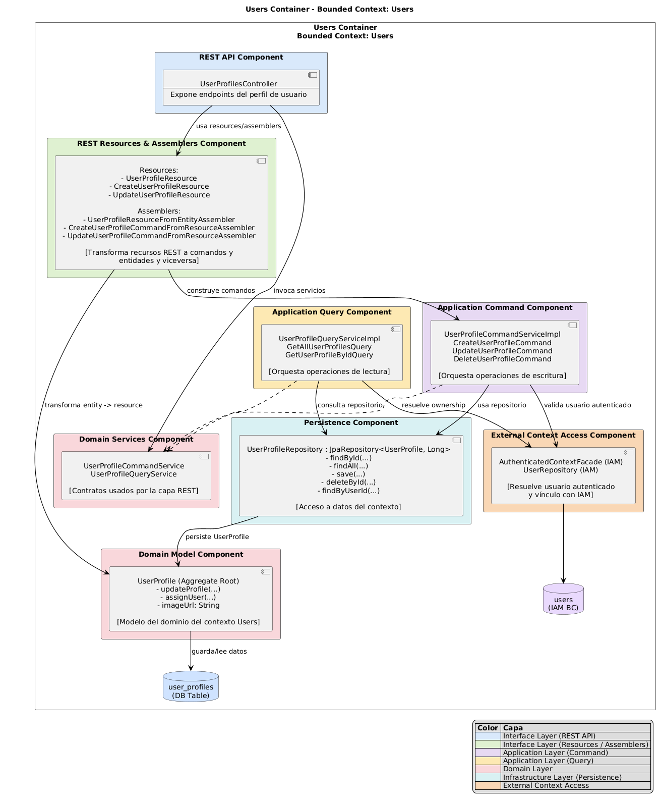

**Relaciones entre componentes:**
- el controller crea comandos y consultas;
- el service valida unicidad y relacion con IAM;
- el repository persiste `UserProfile`.

#### 2.6.3.6. Bounded Context Software Architecture Code Level Diagrams

##### 2.6.3.6.1. Bounded Context Domain Layer Class Diagrams

**Descripcion:**  
El diagrama de clases de **Users** presenta a `UserProfile` como agregado raiz y su relacion con `User`.

**Diagrama UML de clases (Domain Layer):**

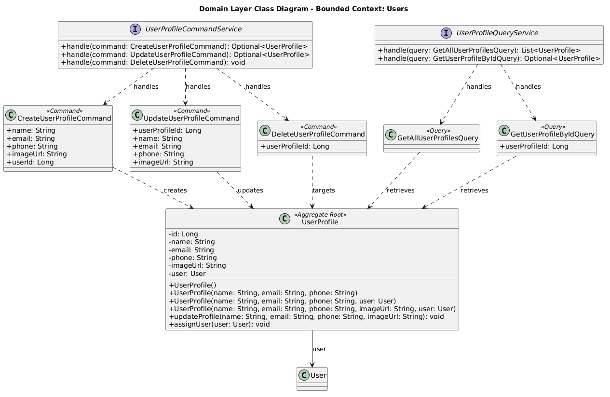

**Relaciones principales del modelo**
- `UserProfile` es el aggregate root;
- `UserProfile` referencia a `User`;
- los comandos encapsulan creacion, actualizacion y eliminacion.

**Observaciones**
- el modelo es simple y estable;
- no se identifican value objects especializados.

##### 2.6.3.6.2. Bounded Context Database Design Diagram

**Descripcion**  
El diagrama de base de datos de **Users** representa la tabla `user_profiles` y su vinculo con `users`.

**Diagrama de base de datos (ERD)**

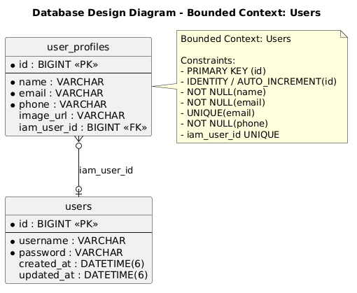

**Tablas y atributos**

Tabla `user_profiles`
- `id`
- `name`
- `email`
- `phone`
- `image_url`
- `iam_user_id`

**Constraints**
- primary key en `id`;
- unicidad logica de `email`;
- unicidad logica de `iam_user_id`.

**Relaciones entre tablas**
- `users (1) ---- (0..1) user_profiles`

**Observaciones**
- la asociacion con IAM separa correctamente identidad tecnica e identidad de negocio.

---

### 2.6.4. Bounded Context: Coaches

El bounded context **Coaches** representa el perfil profesional del entrenador dentro del sistema. Su proposito es registrar la identidad publica del instructor, su especialidad y sus datos de contacto operativos para que los jugadores puedan solicitar sesiones y ver su reputacion.

La entidad principal del contexto es `Coach`. Este contexto se relaciona con **IAM** para asociar el coach a un usuario autenticable, y con **Availabilities**, **TrainingSessions**, **Analytics** y **Reviews** como consumidor o productor de informacion asociada al entrenador.

#### 2.6.4.1. Domain Layer

##### a) Entity / Aggregate Root: `Coach`

**Paquete:** `com.upc.courtly.coaches.domain.model.aggregates`

**Atributos:**
- `id`
- `name`
- `expertise`
- `phone`
- `user: User`

**Metodos:**
- constructores;
- `updateCoach(...)`
- `assignUser(User user)`

##### b) Referencias externas del dominio

**`User`** desde `IAM`  
Representa la cuenta autenticable del instructor.

##### c) Value Objects

No se identifican value objects propios del contexto.

##### d) Commands del dominio

**`CreateCoachCommand`**
- `name`
- `expertise`
- `phone`
- `userId`

**`UpdateCoachCommand`**
- `coachId`
- `name`
- `expertise`
- `phone`

**`DeleteCoachCommand`**
- `coachId`

##### e) Queries del dominio

**`GetAllCoachesQuery`**  
Sin atributos.

**`GetCoachByIdQuery`**
- `coachId`

##### f) Domain Services

**`CoachCommandService`**
- create
- update
- delete

**`CoachQueryService`**
- get all
- get by id

##### g) Repository

**`CoachRepository`**
- `save(...)`
- `findById(...)`
- `findAll()`
- `deleteById(...)`
- `existsByName(...)`
- `findByUserId(...)`
- `existsByUserId(...)`

##### h) Reglas de negocio identificadas

**Reglas implementadas actualmente:**
- el nombre del coach debe ser unico;
- un usuario IAM no puede tener mas de un coach;
- si se proporciona `userId`, este debe existir;
- las operaciones de escritura del controller se restringen a `ROLE_INSTRUCTOR`.

**Observaciones de mejora:**
- no se identifica un modelo de certificaciones o especialidades estructuradas;
- `expertise` se maneja como string simple.

#### 2.6.4.2. Interface Layer

##### a) `CoachesController`

**Endpoints expuestos:**
- `POST /api/v1/coaches`
- `GET /api/v1/coaches/me`
- `GET /api/v1/coaches`
- `GET /api/v1/coaches/{id}`
- `PUT /api/v1/coaches/{id}`
- `DELETE /api/v1/coaches/{id}`

##### b) Resources / DTOs

**`CoachResource`**
- `id`
- `name`
- `expertise`
- `phone`
- `userId`

**`CreateCoachResource`**
- `name`
- `expertise`
- `phone`
- `userId`

**`UpdateCoachResource`**
- `name`
- `expertise`
- `phone`

##### c) Assemblers

**`CoachResourceFromEntityAssembler`**  
Convierte entidad en DTO.

**`CreateCoachCommandFromResourceAssembler`**

**`UpdateCoachCommandFromResourceAssembler`**

##### d) Responsabilidad de la capa de interfaz

Expone el perfil profesional del entrenador y la consulta del coach asociado al usuario autenticado.

#### 2.6.4.3. Application Layer

##### a) Command Services / Command Handlers

**`CoachCommandServiceImpl`**

**Dependencias:**
- `CoachRepository`
- `UserRepository`

##### b) Query Services / Query Handlers

**`CoachQueryServiceImpl`**
- consulta lista y detalle.

##### c) Flujos principales del negocio

**Flujo de alta del coach**
1. Se recibe el resource de creacion.
2. Se valida unicidad de nombre.
3. Se valida unicidad de `userId`.
4. Se persiste `Coach`.

##### d) Observaciones de la capa de aplicacion

La logica del contexto es sencilla, pero fundamental para habilitar disponibilidades y sesiones.

#### 2.6.4.4. Infrastructure Layer

##### a) Repositorios de persistencia

`CoachRepository` persiste el agregado y agrega consultas de unicidad por nombre y por usuario IAM.

##### b) Persistencia de entidades

`Coach` se persiste en `coaches` con referencia hacia `users`.

##### c) Diseno de persistencia

**Tabla principal:** `coaches`

**Columnas:**
- `id`
- `name`
- `expertise`
- `phone`
- `iam_user_id`

##### d) Integracion con otros bounded contexts

Se integra con `IAM` para asociar la cuenta tecnica del entrenador.

##### e) Configuracion tecnica relevante

No se identifica configuracion propia.

##### f) Limitaciones de infraestructura

No se identifican relaciones directas persistidas con disponibilidad o metricas dentro del mismo contexto; esas dependencias viven en otros bounded contexts.

#### 2.6.4.5. Bounded Context Software Architecture Component Level Diagrams

**Descripcion:**  
El diagrama de componentes de **Coaches** representa el flujo de gestion del perfil profesional del entrenador, desde el controller REST hasta la persistencia y su vinculacion con IAM.

**Componentes principales:**
- REST API Component
- REST Resources and Assemblers Component
- Domain Services Component
- Application Command Component
- Application Query Component
- Domain Model Component
- Persistence Component
- External Context Access Component

**Diagrama de componentes propuesto:**

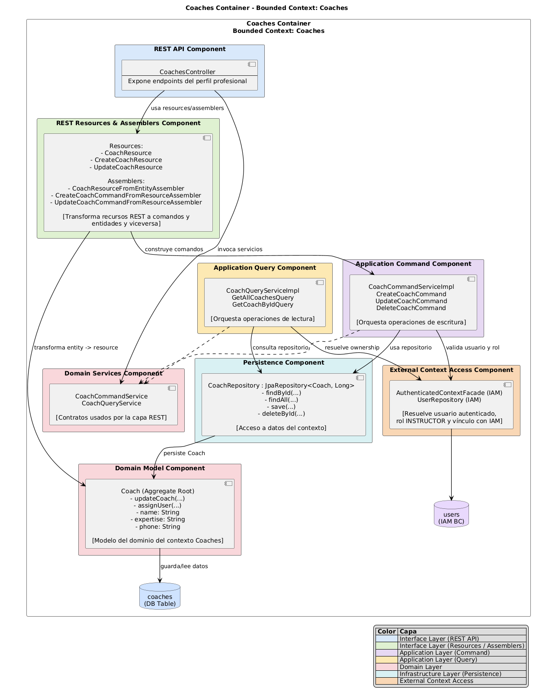

**Relaciones entre componentes:**
- la interfaz expone CRUD y consulta propia del coach;
- los services validan integridad con IAM;
- el repository persiste el agregado `Coach`.

#### 2.6.4.6. Bounded Context Software Architecture Code Level Diagrams

##### 2.6.4.6.1. Bounded Context Domain Layer Class Diagrams

**Descripcion:**  
El diagrama UML del contexto **Coaches** muestra `Coach` como agregado raiz y su relacion con `User`.

**Diagrama UML de clases (Domain Layer):**

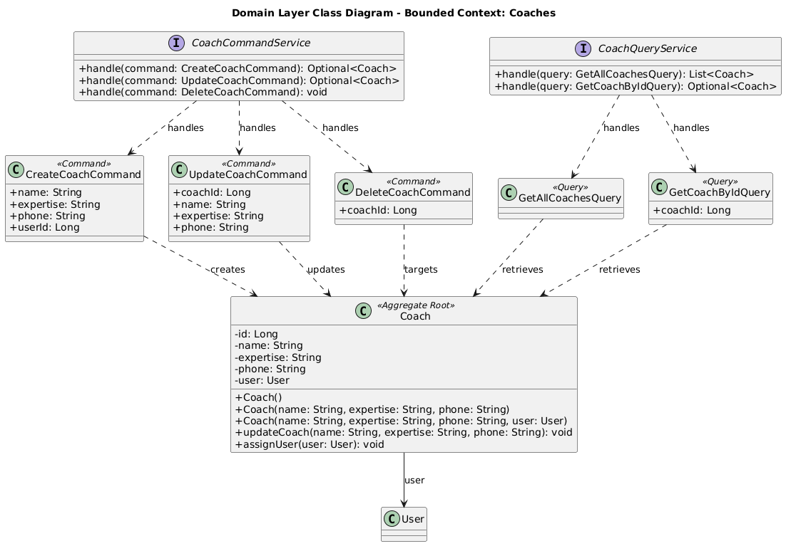

**Relaciones principales del modelo**
- `Coach` es el aggregate root;
- `Coach` referencia a `User`;
- los comandos coordinan create, update y delete.

**Observaciones**
- el dominio es intencionalmente ligero;
- la especialidad aun no se modela como enum o value object.

##### 2.6.4.6.2. Bounded Context Database Design Diagram

**Descripcion**  
El ERD de **Coaches** muestra la tabla `coaches` y su referencia hacia `users`.

**Diagrama de base de datos (ERD)**

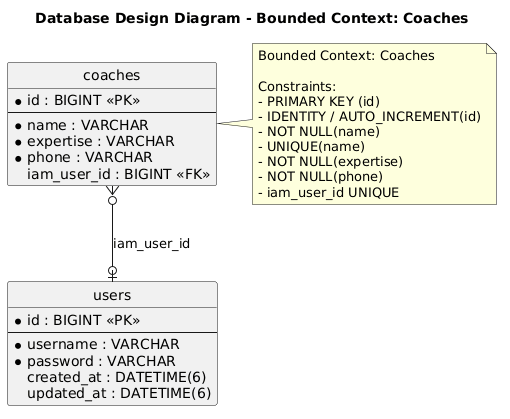

**Tablas y atributos**

Tabla `coaches`
- `id`
- `name`
- `expertise`
- `phone`
- `iam_user_id`

**Constraints**
- primary key en `id`;
- unicidad logica de `name`;
- unicidad logica de `iam_user_id`.

**Relaciones entre tablas**
- `users (1) ---- (0..1) coaches`

**Observaciones**
- el coach funciona como perfil profesional separado del perfil general del usuario.

---

### 2.6.5. Bounded Context: Courts

El bounded context **Courts** representa el catalogo de canchas deportivas disponibles en la plataforma. Su proposito es exponer la informacion necesaria para que los usuarios puedan evaluar una cancha, reservarla y utilizarla como parte de una sesion con entrenador. La entidad principal del contexto es `Court`.

Este contexto se relaciona con **Bookings**, **TrainingSessions**, **Matches** y **Reviews**, ya que la cancha es un recurso central del dominio deportivo.

#### 2.6.5.1. Domain Layer

##### a) Entity / Aggregate Root: `Court`

**Paquete:** `com.upc.courtly.courts.domain.model.aggregates`

**Atributos:**
- `id`
- `name`
- `location`
- `type`
- `imageUrl`
- `pricePerHour`

**Metodos:**
- constructor de creacion
- `updateCourt(...)`

##### b) Referencias externas del dominio

No se identifican referencias externas directas dentro del agregado `Court`.

##### c) Value Objects

No se identifican value objects propios en el codigo actual.

##### d) Commands del dominio

**`CreateCourtCommand`**
- `name`
- `location`
- `type`
- `imageUrl`
- `pricePerHour`

**`UpdateCourtCommand`**
- `courtId`
- `name`
- `location`
- `type`
- `imageUrl`
- `pricePerHour`

**`DeleteCourtCommand`**
- `courtId`

##### e) Queries del dominio

**`GetAllCourtsQuery`**

**`GetCourtByIdQuery`**
- `courtId`

##### f) Domain Services

**`CourtCommandService`**
- create
- update
- delete

**`CourtQueryService`**
- get all
- get by id

##### g) Repository

**`CourtRepository`**
- `save(...)`
- `findById(...)`
- `findAll()`
- `deleteById(...)`
- `existsByName(...)`

##### h) Reglas de negocio identificadas

**Reglas implementadas actualmente:**
- el nombre de la cancha debe ser unico;
- `pricePerHour` debe ser mayor que cero;
- las operaciones de escritura estan restringidas a `ROLE_ADMIN`.

**Observaciones de mejora:**
- no se identifica una taxonomia formal de deportes o tipos de cancha;
- no se identifica manejo de disponibilidad propia de la cancha dentro de este contexto.

#### 2.6.5.2. Interface Layer

##### a) `CourtsController`

**Endpoints expuestos:**
- `POST /api/v1/courts`
- `GET /api/v1/courts`
- `GET /api/v1/courts/{id}`
- `PUT /api/v1/courts/{id}`
- `DELETE /api/v1/courts/{id}`

##### b) Resources / DTOs

**`CourtResource`**
- `id`
- `name`
- `location`
- `type`
- `imageUrl`
- `pricePerHour`

**`CreateCourtResource`**
- `name`
- `location`
- `type`
- `imageUrl`
- `pricePerHour`

**`UpdateCourtResource`**
- `name`
- `location`
- `type`
- `imageUrl`
- `pricePerHour`

##### c) Assemblers

**`CourtResourceFromEntityAssembler`**

**`CreateCourtCommandFromResourceAssembler`**

**`UpdateCourtCommandFromResourceAssembler`**

##### d) Responsabilidad de la capa de interfaz

Expone el catalogo de canchas para lectura publica del backend y administra las operaciones de escritura reservadas al administrador.

#### 2.6.5.3. Application Layer

##### a) Command Services / Command Handlers

**`CourtCommandServiceImpl`**

**Dependencias:**
- `CourtRepository`

**Operaciones:**
- alta;
- actualizacion;
- eliminacion.

##### b) Query Services / Query Handlers

**`CourtQueryServiceImpl`**
- lista y detalle.

##### c) Flujos principales del negocio

**Flujo de alta de cancha**
1. Se recibe el resource de creacion.
2. Se valida unicidad del nombre.
3. Se valida `pricePerHour > 0`.
4. Se persiste la cancha.

##### d) Observaciones de la capa de aplicacion

El contexto es simple, pero aporta datos criticos para calculo de pagos y reservas.

#### 2.6.5.4. Infrastructure Layer

##### a) Repositorios de persistencia

`CourtRepository` extiende `JpaRepository<Court, Long>`.

##### b) Persistencia de entidades

`Court` se persiste en la tabla `courts`.

##### c) Diseno de persistencia

**Tabla principal:** `courts`

**Columnas:**
- `id`
- `name`
- `location`
- `type`
- `image_url`
- `price_per_hour`

##### d) Integracion con otros bounded contexts

Es consumido por `Bookings`, `TrainingSessions`, `Matches`, `Reviews` y `Payments`.

##### e) Configuracion tecnica relevante

No se identifica configuracion propia.

##### f) Limitaciones de infraestructura

No se identifica modelado de mantenimiento, aforo o disponibilidad nativa de la cancha.

#### 2.6.5.5. Bounded Context Software Architecture Component Level Diagrams

**Descripcion:**  
El diagrama de componentes de **Courts** representa el catalogo de canchas y su administracion por parte del backend, mostrando separacion entre interfaz, aplicacion, dominio y persistencia.

**Componentes principales:**
- REST API Component
- REST Resources and Assemblers Component
- Domain Services Component
- Application Command Component
- Application Query Component
- Domain Model Component
- Persistence Component

**Diagrama de componentes propuesto:**

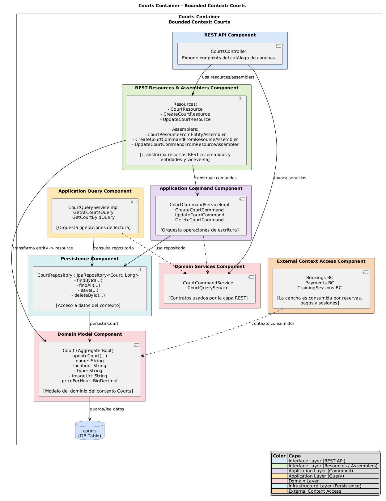

**Relaciones entre componentes:**
- el controller expone operaciones CRUD;
- los assemblers transforman DTOs;
- el repository persiste el agregado `Court`.

#### 2.6.5.6. Bounded Context Software Architecture Code Level Diagrams

##### 2.6.5.6.1. Bounded Context Domain Layer Class Diagrams

**Descripcion:**  
El diagrama UML de **Courts** muestra a `Court` como agregado raiz del catalogo.

**Diagrama UML de clases (Domain Layer):**

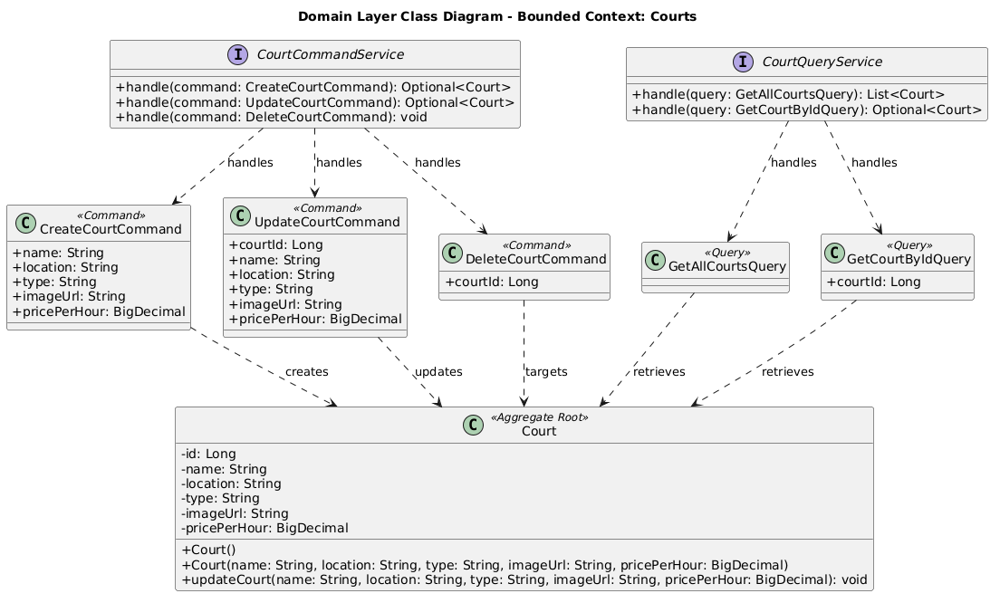

**Relaciones principales del modelo**
- `Court` es el aggregate root;
- los comandos gestionan create, update y delete;
- las queries resuelven lista y detalle.

**Observaciones**
- el modelo es deliberadamente simple para funcionar como catalogo compartido.

##### 2.6.5.6.2. Bounded Context Database Design Diagram

**Descripcion**  
El ERD de **Courts** representa la tabla `courts` como catalogo base del sistema.

**Diagrama de base de datos (ERD)**

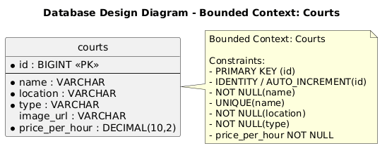

**Tablas y atributos**

Tabla `courts`
- `id`
- `name`
- `location`
- `type`
- `image_url`
- `price_per_hour`

**Constraints**
- primary key en `id`;
- unicidad logica del nombre;
- `price_per_hour` obligatorio y positivo por regla de aplicacion.

**Relaciones entre tablas**
- contexto raiz consumido externamente por bookings, matches y training sessions.

**Observaciones**
- el diagrama refleja la funcion de catalogo del contexto.

---

### 2.6.6. Bounded Context: Availabilities

El bounded context **Availabilities** representa la agenda publicada por los entrenadores. Su proposito es permitir que un coach declare bloques horarios disponibles para recibir solicitudes de sesiones, y que dichos bloques puedan cambiar de estado conforme se reservan o liberan. La entidad principal del contexto es `Availability`.

El contexto se relaciona con **Coaches**, porque cada disponibilidad pertenece a un coach, y con **TrainingSessions**, ya que una sesion utiliza y bloquea una disponibilidad concreta.

#### 2.6.6.1. Domain Layer

##### a) Entity / Aggregate Root: `Availability`

**Paquete:** `com.upc.courtly.availabilities.domain.model.aggregates`

**Atributos:**
- `id`
- `date`
- `startTime`
- `endTime`
- `status`
- `coach`
- `createdAt`

**Metodos:**
- constructor;
- `updateAvailability(...)`
- `onCreate()`

##### b) Referencias externas del dominio

**`Coach`** desde `Coaches`  
Representa al entrenador propietario de la disponibilidad.

##### c) Value Objects

**`AvailabilityStatus`**
- `AVAILABLE`
- `RESERVED`
- `UNAVAILABLE`

##### d) Commands del dominio

**`CreateAvailabilityCommand`**
- `date`
- `startTime`
- `endTime`
- `status`
- `coachId`

**`UpdateAvailabilityCommand`**
- `availabilityId`
- `date`
- `startTime`
- `endTime`
- `status`

**`DeleteAvailabilityCommand`**
- `availabilityId`

##### e) Queries del dominio

**`GetAllAvailabilitiesQuery`**

**`GetAvailabilityByIdQuery`**
- `availabilityId`

##### f) Domain Services

**`AvailabilityCommandService`**
- create
- update
- delete

**`AvailabilityQueryService`**
- get all
- get by id
- obtener disponibilidades del coach autenticado

##### g) Repository

**`AvailabilityRepository`**
- `save(...)`
- `findById(...)`
- `findAll()`
- `deleteById(...)`
- `findByCoachUserIdOrderByDateAscStartTimeAsc(...)`
- `existsOverlappingAvailability(...)`

##### h) Reglas de negocio identificadas

**Reglas implementadas actualmente:**
- el coach debe existir;
- `startTime` debe ser menor que `endTime`;
- no se permiten disponibilidades solapadas para el mismo coach en la misma fecha;
- una disponibilidad `RESERVED` no puede modificarse ni eliminarse.

**Observaciones de mejora:**
- no se identifica una politica de recurrencia semanal o mensual;
- el modelo separa fecha y hora, lo cual simplifica la agenda, pero no modela zona horaria explicita.

#### 2.6.6.2. Interface Layer

##### a) `AvailabilitiesController`

**Endpoints expuestos:**
- `POST /api/v1/availabilities`
- `GET /api/v1/availabilities`
- `GET /api/v1/availabilities/me`
- `GET /api/v1/availabilities/{id}`
- `PUT /api/v1/availabilities/{id}`
- `DELETE /api/v1/availabilities/{id}`

##### b) Resources / DTOs

**`AvailabilityResource`**
- `id`
- `date`
- `startTime`
- `endTime`
- `status`
- `createdAt`
- `coach`

**`CreateAvailabilityResource`**
- `date`
- `startTime`
- `endTime`
- `status`
- `coachId`

**`UpdateAvailabilityResource`**
- `date`
- `startTime`
- `endTime`
- `status`

##### c) Assemblers

**`AvailabilityResourceFromEntityAssembler`**

**`CreateAvailabilityCommandFromResourceAssembler`**

**`UpdateAvailabilityCommandFromResourceAssembler`**

##### d) Responsabilidad de la capa de interfaz

Expone la agenda del entrenador y permite gestionar sus bloques disponibles.

#### 2.6.6.3. Application Layer

##### a) Command Services / Command Handlers

**`AvailabilityCommandServiceImpl`**

**Dependencias:**
- `AvailabilityRepository`
- `CoachRepository`

##### b) Query Services / Query Handlers

**`AvailabilityQueryServiceImpl`**

**Dependencias:**
- `AvailabilityRepository`

##### c) Flujos principales del negocio

**Flujo de publicacion**
1. Se recibe la disponibilidad.
2. Se valida coach, horario y ausencia de solapamiento.
3. Se persiste con estado inicial definido por el request.

**Flujo de consulta propia**
1. El coach autenticado solicita `/me`.
2. Se recuperan sus disponibilidades ordenadas por fecha y hora.

##### d) Observaciones de la capa de aplicacion

El contexto ya incluye reglas utiles de agenda y ownership indirecto por coach, pero no incorpora recurrente ni optimizacion avanzada de calendario.

#### 2.6.6.4. Infrastructure Layer

##### a) Repositorios de persistencia

`AvailabilityRepository` agrega consultas por coach y validacion de solapamiento.

##### b) Persistencia de entidades

`Availability` se persiste en la tabla `availabilities` y se relaciona con `coaches`.

##### c) Diseno de persistencia

**Tabla principal:** `availabilities`

**Columnas:**
- `id`
- `date`
- `start_time`
- `end_time`
- `status`
- `coach_id`
- `created_at`

##### d) Integracion con otros bounded contexts

Depende de `Coaches` y es consumido fuertemente por `TrainingSessions`.

##### e) Configuracion tecnica relevante

No se identifica configuracion propia.

##### f) Limitaciones de infraestructura

La validacion de solapamiento se realiza en codigo, no como restriccion fisica de base de datos.

#### 2.6.6.5. Bounded Context Software Architecture Component Level Diagrams

**Descripcion:**  
El diagrama de componentes de **Availabilities** muestra la agenda del coach como un contexto separado, con validaciones de solapamiento y consulta especializada por propietario.

**Componentes principales:**
- REST API Component
- REST Resources and Assemblers Component
- Domain Services Component
- Application Command Component
- Application Query Component
- Domain Model Component
- Persistence Component
- External Context Access Component

**Diagrama de componentes propuesto:**

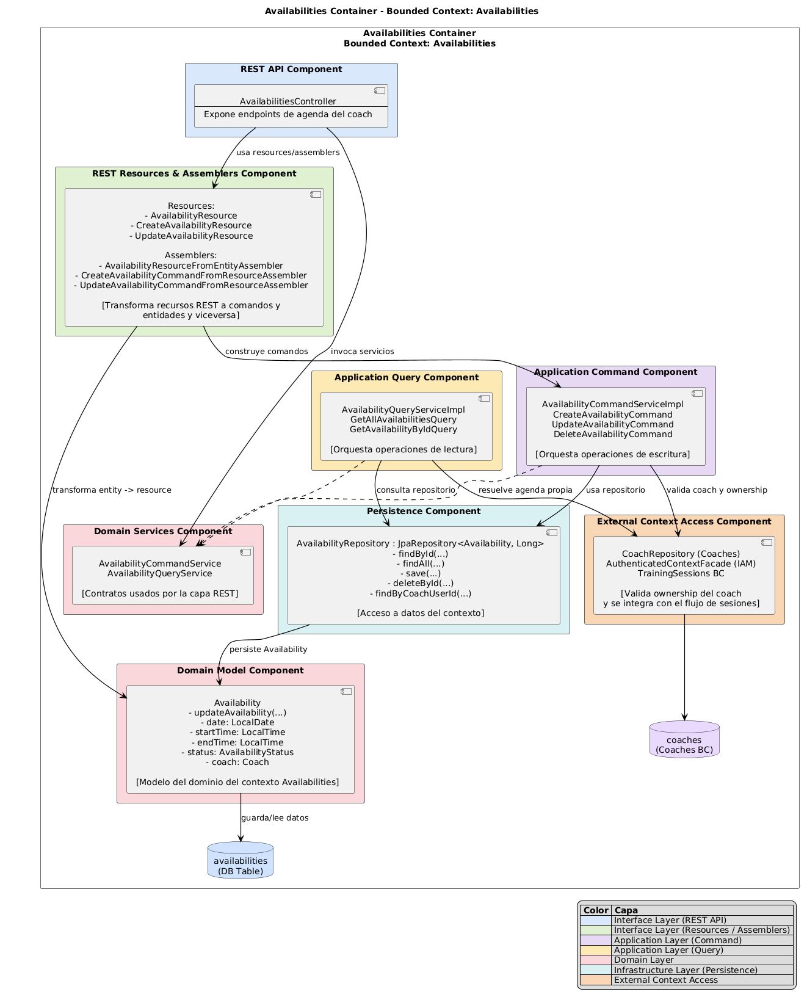

**Relaciones entre componentes:**
- el controller delega creacion, actualizacion y consultas;
- el command service valida el coach y el horario;
- el repository persiste la agenda;
- `TrainingSessions` consume la disponibilidad como recurso externo.

#### 2.6.6.6. Bounded Context Software Architecture Code Level Diagrams

##### 2.6.6.6.1. Bounded Context Domain Layer Class Diagrams

**Descripcion:**  
El diagrama de clases de **Availabilities** presenta a `Availability` junto con el enum `AvailabilityStatus` y la referencia al `Coach`.

**Diagrama UML de clases (Domain Layer):**

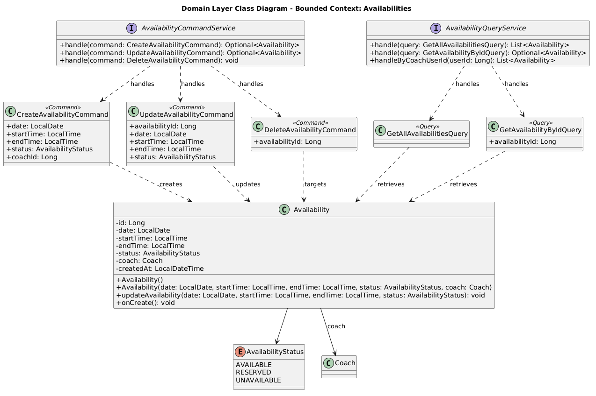

**Relaciones principales del modelo**
- `Availability` es el aggregate root;
- `Availability` referencia a `Coach`;
- `AvailabilityStatus` define el estado operativo de la agenda.

**Observaciones**
- el contexto modela correctamente la agenda minima necesaria para sesiones con entrenador.

##### 2.6.6.6.2. Bounded Context Database Design Diagram

**Descripcion**  
El ERD de **Availabilities** muestra la tabla `availabilities` y su relacion con `coaches`.

**Diagrama de base de datos (ERD)**

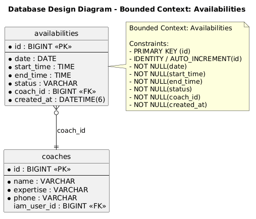

**Tablas y atributos**

Tabla `availabilities`
- `id`
- `date`
- `start_time`
- `end_time`
- `status`
- `coach_id`
- `created_at`

**Constraints**
- primary key en `id`;
- foreign key `coach_id -> coaches.id`;
- `date`, `start_time`, `end_time`, `status`, `coach_id` y `created_at` son obligatorios.

**Relaciones entre tablas**
- `coaches (1) ---- (*) availabilities`

**Observaciones**
- el bloqueo de disponibilidad por sesion aceptada se controla a nivel de dominio y aplicacion.

---

### 2.6.7. Bounded Context: Reviews

El bounded context **Reviews** representa la publicacion de reseñas legitimas sobre canchas o entrenadores. Su proposito es permitir que un usuario exprese una opinion luego de haber completado una operacion valida del sistema. La entidad principal es `Review`.

Este contexto se relaciona con **Users**, **Bookings**, **TrainingSessions**, **Courts** y **Coaches**, pues depende de la operacion completada para determinar el objetivo valido de la reseña.

#### 2.6.7.1. Domain Layer

##### a) Entity / Aggregate Root: `Review`

**Paquete:** `com.upc.courtly.reviews.domain.model.aggregates`

**Atributos:**
- `id`
- `score`
- `comment`
- `type`
- `targetId`
- `targetType`
- `bookingId`
- `trainingSessionId`
- `user`
- `createdAt`

**Metodos:**
- constructor;
- `updateReview(...)`
- `onCreate()`

##### b) Referencias externas del dominio

**`UserProfile`** desde `Users`  
Autor de la reseña.

**`Booking`** desde `Bookings`  
Operacion completada para reseña de cancha.

**`TrainingSession`** desde `TrainingSessions`  
Operacion completada para reseña de coach o cancha.

##### c) Value Objects

**`ReviewTargetType`**
- `COURT`
- `COACH`

##### d) Commands del dominio

**`CreateReviewCommand`**
- `score`
- `comment`
- `type`
- `targetId`
- `targetType`
- `bookingId`
- `trainingSessionId`
- `userId`

**`UpdateReviewCommand`**
- `reviewId`
- `score`
- `comment`
- `type`
- `targetId`
- `targetType`

**`DeleteReviewCommand`**
- `reviewId`

##### e) Queries del dominio

**`GetAllReviewsQuery`**

**`GetReviewByIdQuery`**
- `reviewId`

##### f) Domain Services

**`ReviewCommandService`**
- create
- update
- delete

**`ReviewQueryService`**
- get all
- get by id

##### g) Repository

**`ReviewRepository`**
- `save(...)`
- `findById(...)`
- `findAll()`
- `deleteById(...)`

##### h) Reglas de negocio identificadas

**Reglas implementadas actualmente:**
- una reseña debe referenciar un booking completado o una training session completada;
- una reseña derivada de booking solo puede apuntar a la cancha del booking;
- una reseña de training session solo puede apuntar al coach o a la cancha de esa sesion;
- el autor debe ser el propietario del booking o el jugador de la training session.

**Observaciones de mejora:**
- no se identifica una restriccion que impida multiples reseñas del mismo usuario para la misma operacion;
- el campo `type` se mantiene como string adicional al enum `targetType`.

#### 2.6.7.2. Interface Layer

##### a) `ReviewsController`

**Endpoints expuestos:**
- `POST /api/v1/reviews`
- `GET /api/v1/reviews`
- `GET /api/v1/reviews/{id}`
- `PUT /api/v1/reviews/{id}`
- `DELETE /api/v1/reviews/{id}`

##### b) Resources / DTOs

**`ReviewResource`**
- `id`
- `score`
- `comment`
- `type`
- `targetId`
- `targetType`
- `bookingId`
- `trainingSessionId`
- `createdAt`
- `user`

**`CreateReviewResource`**
- `score`
- `comment`
- `type`
- `targetId`
- `targetType`
- `bookingId`
- `trainingSessionId`
- `userId`

**`UpdateReviewResource`**
- `score`
- `comment`
- `type`
- `targetId`
- `targetType`

##### c) Assemblers

**`ReviewResourceFromEntityAssembler`**

**`CreateReviewCommandFromResourceAssembler`**

**`UpdateReviewCommandFromResourceAssembler`**

##### d) Responsabilidad de la capa de interfaz

Expone la lectura y escritura de reseñas, delegando las validaciones de legitimidad a la capa de aplicacion.

#### 2.6.7.3. Application Layer

##### a) Command Services / Command Handlers

**`ReviewCommandServiceImpl`**

**Dependencias:**
- `ReviewRepository`
- `UserProfileRepository`
- `BookingRepository`
- `TrainingSessionRepository`

##### b) Query Services / Query Handlers

**`ReviewQueryServiceImpl`**
- lista y detalle.

##### c) Flujos principales del negocio

**Flujo de reseña de cancha desde booking**
1. Se valida el booking.
2. El booking debe estar `COMPLETED`.
3. El autor debe coincidir con el usuario del booking.
4. El `targetType` debe ser `COURT` y el `targetId` debe coincidir con la cancha.

**Flujo de reseña desde training session**
1. Se valida la sesion.
2. Debe estar `COMPLETED`.
3. El jugador debe ser el autor.
4. El target debe ser el coach o la cancha de la sesion.

##### d) Observaciones de la capa de aplicacion

La capa de aplicacion contiene la parte mas relevante del contexto, ya que verifica la legitimidad real de la reseña.

#### 2.6.7.4. Infrastructure Layer

##### a) Repositorios de persistencia

`ReviewRepository` extiende `JpaRepository<Review, Long>`.

##### b) Persistencia de entidades

`Review` se persiste en la tabla `reviews` y referencia al autor mediante `user_id`.

##### c) Diseno de persistencia

**Tabla principal:** `reviews`

**Columnas:**
- `id`
- `score`
- `comment`
- `type`
- `target_id`
- `target_type`
- `booking_id`
- `training_session_id`
- `user_id`
- `created_at`

##### d) Integracion con otros bounded contexts

Depende de `Users`, `Bookings`, `TrainingSessions`, `Courts` y `Coaches`.

##### e) Configuracion tecnica relevante

No se identifica configuracion propia.

##### f) Limitaciones de infraestructura

No se identifica un indice funcional para evitar duplicidad de reseñas por operacion y usuario.

#### 2.6.7.5. Bounded Context Software Architecture Component Level Diagrams

**Descripcion:**  
El diagrama de componentes de **Reviews** muestra el controller REST, la transformacion de resources, los servicios de aplicacion y la validacion contra bookings o training sessions completadas.

**Componentes principales:**
- REST API Component
- REST Resources and Assemblers Component
- Domain Services Component
- Application Command Component
- Application Query Component
- Domain Model Component
- Persistence Component
- External Context Access Component

**Diagrama de componentes propuesto:**

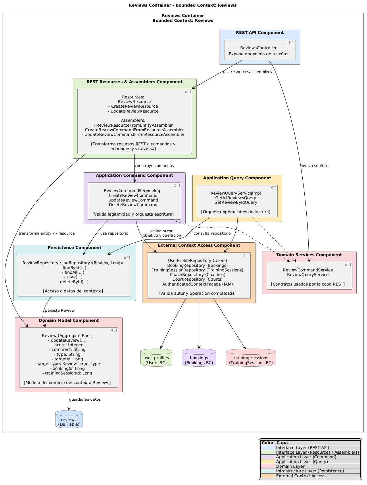

**Relaciones entre componentes:**
- el command service valida autor y operacion;
- el repository persiste la reseña;
- el acceso externo resuelve targets validos.

#### 2.6.7.6. Bounded Context Software Architecture Code Level Diagrams

##### 2.6.7.6.1. Bounded Context Domain Layer Class Diagrams

**Descripcion:**  
El diagrama de clases de **Reviews** muestra `Review` como agregado raiz y el enum `ReviewTargetType`.

**Diagrama UML de clases (Domain Layer):**

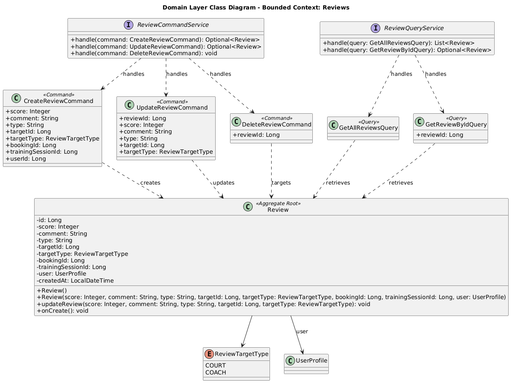

**Relaciones principales del modelo**
- `Review` es el aggregate root;
- `Review` utiliza `ReviewTargetType`;
- la reseña referencia al autor mediante `UserProfile`.

**Observaciones**
- el dominio distingue entre objetivo de cancha y de coach, pero conserva un campo `type` adicional en string.

##### 2.6.7.6.2. Bounded Context Database Design Diagram

**Descripcion**  
El ERD de **Reviews** representa la tabla `reviews` y su vinculo con `user_profiles`.

**Diagrama de base de datos (ERD)**

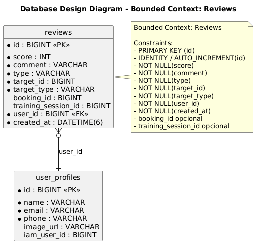

**Tablas y atributos**

Tabla `reviews`
- `id`
- `score`
- `comment`
- `type`
- `target_id`
- `target_type`
- `booking_id`
- `training_session_id`
- `user_id`
- `created_at`

**Constraints**
- primary key en `id`;
- foreign key `user_id -> user_profiles.id`;
- `score`, `comment`, `target_id`, `target_type`, `user_id` y `created_at` son obligatorios.

**Relaciones entre tablas**
- `user_profiles (1) ---- (*) reviews`

**Observaciones**
- `booking_id` y `training_session_id` se usan como referencias logicas opcionales de la operacion origen.

---

### 2.6.8. Bounded Context: Analytics

El bounded context **Analytics** representa la capacidad de exponer metricas del desempeno del entrenador. Su proposito es construir una vista de analitica a partir de informacion persistida y, sobre todo, de proyecciones derivadas desde otros bounded contexts operativos. La entidad principal persistida es `Metric`, aunque la logica principal del backend actual se concentra en la composicion de metricas por consulta.

Este contexto se relaciona con **Coaches**, **TrainingSessions**, **Payments** y **Reviews**.

#### 2.6.8.1. Domain Layer

##### a) Entity / Aggregate Root: `Metric`

**Paquete:** `com.upc.courtly.analytics.domain.model.aggregates`

**Atributos:**
- `id`
- `metricType`
- `value`
- `period`
- `coach`
- `createdAt`

**Metodos:**
- constructor;
- `updateMetric(...)`
- `setId(...)`
- `setCreatedAt(...)`
- `onCreate()`

##### b) Referencias externas del dominio

**`Coach`** desde `Coaches`  
Representa al entrenador propietario de la metrica.

##### c) Value Objects

**`MetricType`**
- `SESSIONS_COMPLETED`
- `BOOKINGS_RECEIVED`
- `REVENUE_TOTAL`
- `AVERAGE_RATING`

##### d) Commands del dominio

**`CreateMetricCommand`**
- `metricType`
- `value`
- `period`
- `coachId`

**`UpdateMetricCommand`**
- `metricId`
- `metricType`
- `value`
- `period`

**`DeleteMetricCommand`**
- `metricId`

##### e) Queries del dominio

**`GetAllMetricsQuery`**

**`GetMetricByIdQuery`**
- `metricId`

##### f) Domain Services

**`MetricCommandService`**
- create
- update
- delete

**`MetricQueryService`**
- get all
- get by id
- obtener metricas del coach

##### g) Repository

**`MetricRepository`**
- `save(...)`
- `findById(...)`
- `findAll()`
- `deleteById(...)`

##### h) Reglas de negocio identificadas

**Reglas implementadas actualmente:**
- la persistencia CRUD valida la existencia del coach;
- la consulta `/me` construye metricas derivadas desde training sessions, pagos y reviews;
- las metricas sinteticas usan ids temporales `1..4` para la respuesta.

**Observaciones de mejora:**
- el contexto mezcla soporte CRUD heredado y proyeccion derivada;
- no se identifica persistencia consolidada obligatoria para las metricas calculadas en consulta.

#### 2.6.8.2. Interface Layer

##### a) `AnalyticsController`

**Endpoints expuestos actualmente:**
- `GET /api/v1/analytics`
- `GET /api/v1/analytics/me`
- `GET /api/v1/analytics/{id}`

**Endpoints presentes pero bloqueados funcionalmente:**
- `POST /api/v1/analytics`
- `PUT /api/v1/analytics/{id}`
- `DELETE /api/v1/analytics/{id}`

##### b) Resources / DTOs

**`MetricResource`**
- `id`
- `metricType`
- `value`
- `period`
- `createdAt`
- `coach`

**`CreateMetricResource`**
- `metricType`
- `value`
- `period`
- `coachId`

**`UpdateMetricResource`**
- `metricType`
- `value`
- `period`

##### c) Assemblers

**`MetricResourceFromEntityAssembler`**

**`CreateMetricCommandFromResourceAssembler`**

**`UpdateMetricCommandFromResourceAssembler`**

##### d) Responsabilidad de la capa de interfaz

La capa de interfaz expone el dashboard de metricas, especialmente la vista `/me` para el coach autenticado.

#### 2.6.8.3. Application Layer

##### a) Command Services / Command Handlers

**`MetricCommandServiceImpl`**

**Dependencias:**
- `MetricRepository`
- `CoachRepository`

##### b) Query Services / Query Handlers

**`MetricQueryServiceImpl`**

**Dependencias:**
- `MetricRepository`
- `CoachRepository`
- `TrainingSessionRepository`
- `PaymentRepository`
- `ReviewRepository`
- `AuthenticatedContextFacade`

##### c) Flujos principales del negocio

**Flujo de metricas del coach autenticado**
1. Se identifica el coach del usuario autenticado.
2. Se recuperan sesiones, pagos y reseñas relacionadas.
3. Se calculan:
   - sesiones completadas;
   - solicitudes recibidas;
   - ingresos por sesiones;
   - rating promedio del coach.
4. Se devuelven metricas sinteticas.

##### d) Observaciones de la capa de aplicacion

La capa de aplicacion concentra la inteligencia del contexto. La mayor parte del valor de negocio esta en las consultas derivadas, no en el CRUD base.

#### 2.6.8.4. Infrastructure Layer

##### a) Repositorios de persistencia

`MetricRepository` extiende `JpaRepository<Metric, Long>`.

##### b) Persistencia de entidades

`Metric` se persiste en `metrics` y referencia a `Coach`.

##### c) Diseno de persistencia

**Tabla principal:** `metrics`

**Columnas:**
- `id`
- `metric_type`
- `value`
- `period`
- `coach_id`
- `created_at`

##### d) Integracion con otros bounded contexts

Depende de `Coaches`, `TrainingSessions`, `Payments` y `Reviews`.

##### e) Configuracion tecnica relevante

No se identifica configuracion propia.

##### f) Limitaciones de infraestructura

La informacion mas valiosa del contexto no necesariamente se persiste como registro estable; varias metricas son proyecciones calculadas en tiempo de consulta.

#### 2.6.8.5. Bounded Context Software Architecture Component Level Diagrams

**Descripcion:**  
El diagrama de componentes de **Analytics** muestra un contexto predominantemente de lectura, que compone informacion desde otros bounded contexts para exponer metricas.

**Componentes principales:**
- REST API Component
- REST Resources and Assemblers Component
- Domain Services Component
- Application Command Component
- Application Query Component
- Domain Model Component
- Persistence Component
- External Context Access Component

**Diagrama de componentes propuesto:**

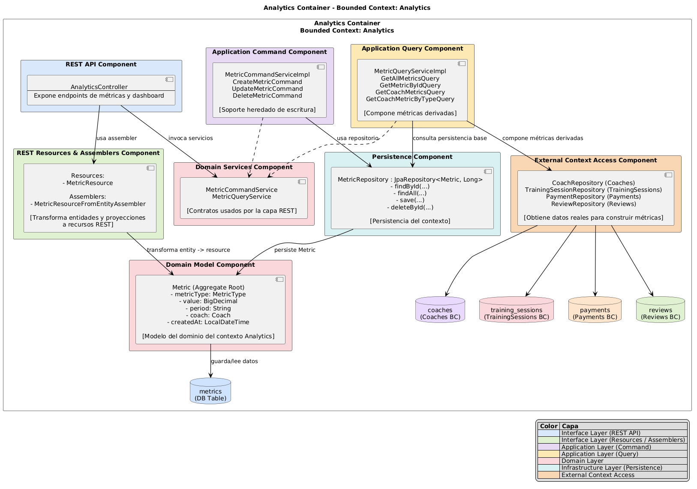

**Relaciones entre componentes:**
- la consulta del coach autenticado compone datos de varios contextos;
- `MetricRepository` sostiene el soporte persistido;
- los assemblers exponen el resultado al frontend.

#### 2.6.8.6. Bounded Context Software Architecture Code Level Diagrams

##### 2.6.8.6.1. Bounded Context Domain Layer Class Diagrams

**Descripcion:**  
El diagrama UML de **Analytics** muestra `Metric` y `MetricType`, asi como los comandos y queries del contexto.

**Diagrama UML de clases (Domain Layer):**

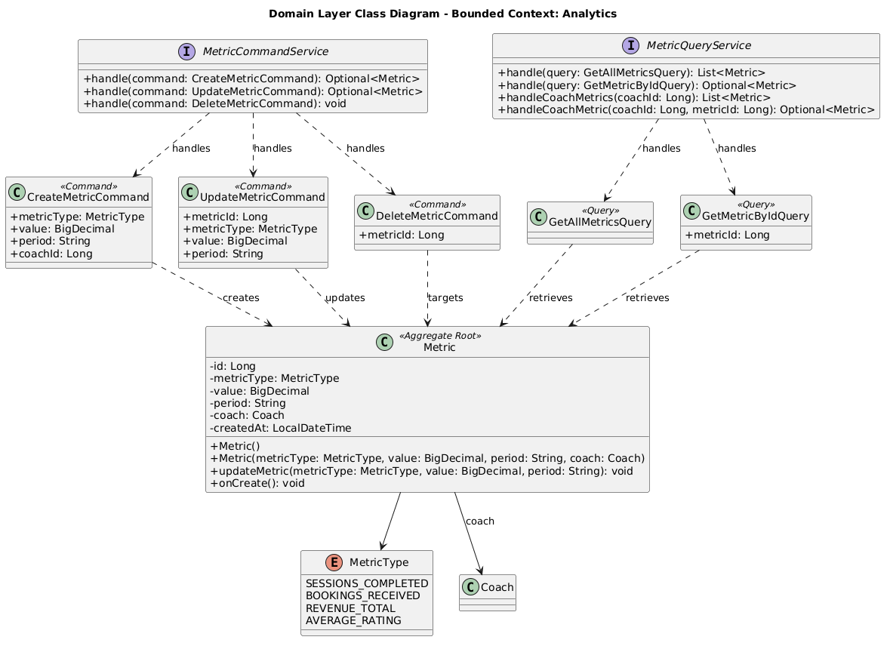

**Relaciones principales del modelo**
- `Metric` es el aggregate root persistido;
- `Metric` referencia a `Coach`;
- `MetricType` clasifica la metrica.

**Observaciones**
- el diagrama representa bien la parte persistida, pero el valor principal del contexto se encuentra en `MetricQueryServiceImpl`.

##### 2.6.8.6.2. Bounded Context Database Design Diagram

**Descripcion**  
El ERD de **Analytics** muestra la tabla `metrics` vinculada a `coaches`.

**Diagrama de base de datos (ERD)**

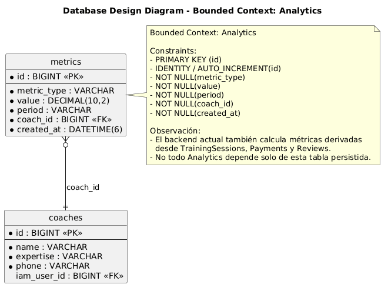

**Tablas y atributos**

Tabla `metrics`
- `id`
- `metric_type`
- `value`
- `period`
- `coach_id`
- `created_at`

**Constraints**
- primary key en `id`;
- foreign key `coach_id -> coaches.id`;
- `metric_type`, `value`, `period`, `coach_id` y `created_at` son obligatorios.

**Relaciones entre tablas**
- `coaches (1) ---- (*) metrics`

**Observaciones**
- el modelo relacional representa solo una parte del comportamiento real del contexto.

---

### 2.6.9. Bounded Context: Matches

El bounded context **Matches** representa la capacidad social del sistema para crear partidos y permitir que otros usuarios se unan. Su proposito es coordinar encuentros deportivos organizados por un usuario en una cancha determinada. La entidad principal del contexto es `Match`.

Este contexto se relaciona con **Users** y **Courts**, ya que requiere un creador funcional y una cancha para alojar el partido.

#### 2.6.9.1. Domain Layer

##### a) Entity / Aggregate Root: `Match`

**Paquete:** `com.upc.courtly.matches.domain.model.aggregates`

**Atributos:**
- `id`
- `title`
- `description`
- `dateTime`
- `status`
- `maxPlayers`
- `currentPlayers`
- `court`
- `createdBy`
- `participants`
- `createdAt`

**Metodos:**
- constructor;
- `updateMatch(...)`
- `hasParticipant(...)`
- `join(...)`
- `recomputeStatus()`
- `onCreate()`

##### b) Referencias externas del dominio

**`Court`** desde `Courts`  
Cancha del partido.

**`UserProfile`** desde `Users`  
Creador y participantes.

##### c) Value Objects

**`MatchStatus`**
- `OPEN`
- `FULL`
- `CANCELLED`
- `COMPLETED`

##### d) Commands del dominio

**`CreateMatchCommand`**
- `title`
- `description`
- `dateTime`
- `status`
- `maxPlayers`
- `currentPlayers`
- `courtId`
- `createdById`

**`UpdateMatchCommand`**
- `matchId`
- `title`
- `description`
- `dateTime`
- `status`
- `maxPlayers`

**`JoinMatchCommand`**
- `matchId`
- `userId`

**`DeleteMatchCommand`**
- `matchId`

##### e) Queries del dominio

**`GetAllMatchesQuery`**

**`GetMatchByIdQuery`**
- `matchId`

##### f) Domain Services

**`MatchCommandService`**
- create
- update
- join
- delete

**`MatchQueryService`**
- get all
- get by id

##### g) Repository

**`MatchRepository`**
- `save(...)`
- `findById(...)`
- `findAll()`
- `deleteById(...)`

Adicionalmente, usa `@EntityGraph` para cargar participantes, cancha y creador.

##### h) Reglas de negocio identificadas

**Reglas implementadas actualmente:**
- la cancha debe existir;
- el creador debe existir;
- `maxPlayers` debe ser al menos 2;
- el partido se crea con estado `OPEN` y `currentPlayers = 1`;
- el creador se agrega como participante;
- no se puede reducir `maxPlayers` por debajo del numero actual de participantes;
- `join()` evita unirse dos veces y recalcula el estado.

**Observaciones de mejora:**
- no se identifica validacion de horario conflictivo con bookings o training sessions;
- el estado `COMPLETED` no presenta un flujo de cierre automatizado.

#### 2.6.9.2. Interface Layer

##### a) `MatchesController`

**Endpoints expuestos:**
- `POST /api/v1/matches`
- `GET /api/v1/matches`
- `GET /api/v1/matches/{id}`
- `PUT /api/v1/matches/{id}`
- `POST /api/v1/matches/{id}/join`
- `DELETE /api/v1/matches/{id}`

##### b) Resources / DTOs

**`MatchResource`**
- `id`
- `title`
- `description`
- `dateTime`
- `status`
- `maxPlayers`
- `currentPlayers`
- `createdAt`
- `court`
- `createdBy`
- `participants`

**`CreateMatchResource`**
- `title`
- `description`
- `dateTime`
- `status`
- `maxPlayers`
- `currentPlayers`
- `courtId`
- `createdById`

**`UpdateMatchResource`**
- `title`
- `description`
- `dateTime`
- `status`
- `maxPlayers`

##### c) Assemblers

**`MatchResourceFromEntityAssembler`**

**`CreateMatchCommandFromResourceAssembler`**

**`UpdateMatchCommandFromResourceAssembler`**

##### d) Responsabilidad de la capa de interfaz

Expone la creacion de partidos, su consulta, actualizacion y la union de participantes.

#### 2.6.9.3. Application Layer

##### a) Command Services / Command Handlers

**`MatchCommandServiceImpl`**

**Dependencias:**
- `MatchRepository`
- `CourtRepository`
- `UserProfileRepository`

##### b) Query Services / Query Handlers

**`MatchQueryServiceImpl`**
- lista y detalle.

##### c) Flujos principales del negocio

**Flujo de creacion**
1. Se valida cancha y creador.
2. Se fuerza estado `OPEN`.
3. El creador queda como primer participante.

**Flujo de union**
1. Se recupera el partido.
2. Se recupera el usuario participante.
3. `join(...)` valida la operacion y recalcula el estado.

##### d) Observaciones de la capa de aplicacion

El contexto ya tiene un comportamiento social real, aunque todavia no se integra con pagos ni reservas de cancha.

#### 2.6.9.4. Infrastructure Layer

##### a) Repositorios de persistencia

`MatchRepository` utiliza `@EntityGraph` para consultas enriquecidas.

##### b) Persistencia de entidades

`Match` se persiste en `matches` y la coleccion `participants` se materializa mediante una tabla intermedia.

##### c) Diseno de persistencia

**Tabla principal:** `matches`

**Columnas principales:**
- `id`
- `title`
- `description`
- `date_time`
- `status`
- `max_players`
- `current_players`
- `court_id`
- `created_by_user_id`
- `created_at`

**Tabla asociativa:** `match_participants`

##### d) Integracion con otros bounded contexts

Depende de `Courts` y `Users`.

##### e) Configuracion tecnica relevante

No se identifica configuracion propia.

##### f) Limitaciones de infraestructura

No se identifica control de concurrencia explicito para el join de participantes.

#### 2.6.9.5. Bounded Context Software Architecture Component Level Diagrams

**Descripcion:**  
El diagrama de componentes de **Matches** presenta un contexto que combina CRUD con una operacion especifica de negocio: unirse a un partido.

**Componentes principales:**
- REST API Component
- REST Resources and Assemblers Component
- Domain Services Component
- Application Command Component
- Application Query Component
- Domain Model Component
- Persistence Component
- External Context Access Component

**Diagrama de componentes propuesto:**

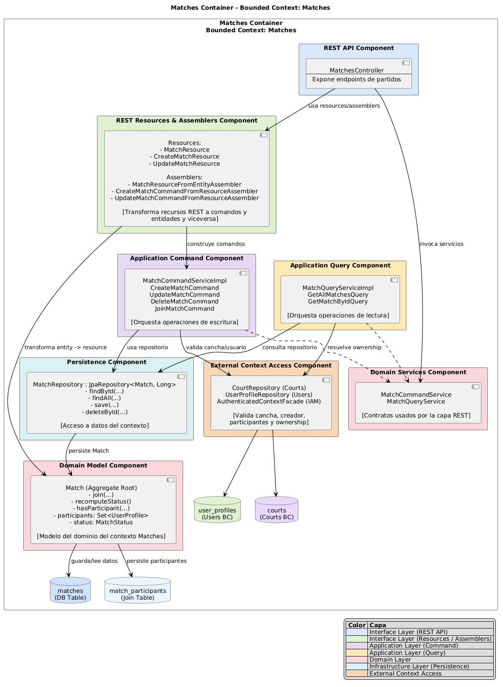

**Relaciones entre componentes:**
- el command service valida creador y cancha;
- el agregado maneja participantes y estado;
- el repository persiste el partido y su tabla intermedia.

#### 2.6.9.6. Bounded Context Software Architecture Code Level Diagrams

##### 2.6.9.6.1. Bounded Context Domain Layer Class Diagrams

**Descripcion:**  
El diagrama UML de **Matches** muestra a `Match` como agregado raiz y el enum `MatchStatus`.

**Diagrama UML de clases (Domain Layer):**

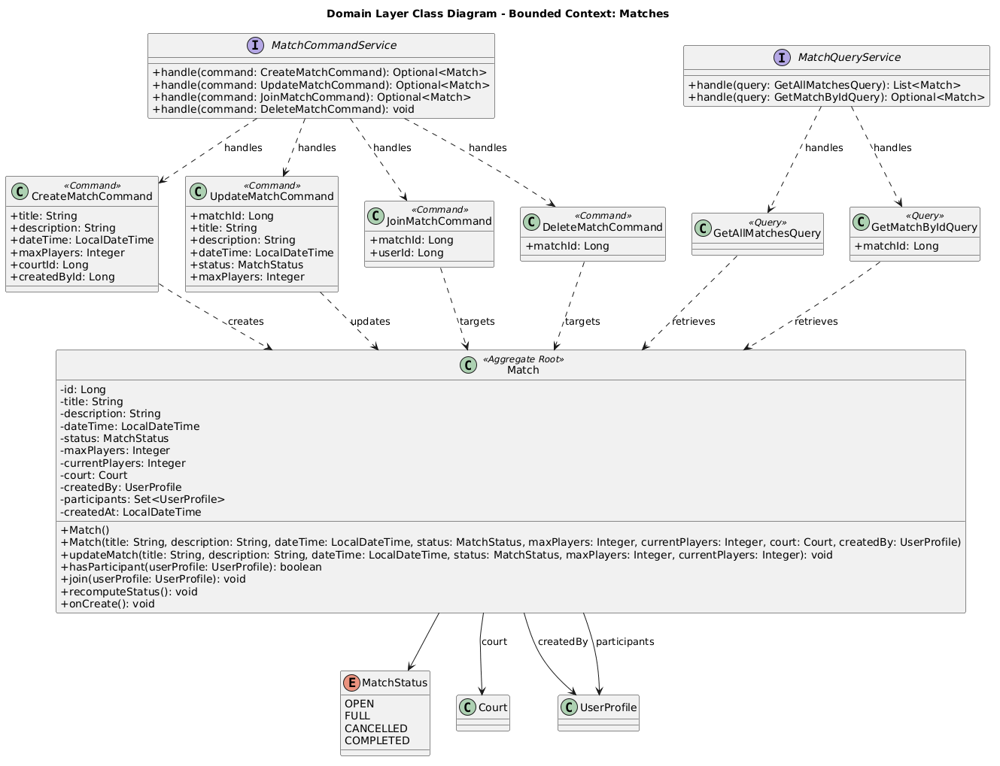

**Relaciones principales del modelo**
- `Match` referencia a `Court`, `createdBy` y `participants`;
- `MatchStatus` controla la apertura o cierre operativo del partido.

**Observaciones**
- el agregado concentra bien la logica de participacion.

##### 2.6.9.6.2. Bounded Context Database Design Diagram

**Descripcion**  
El ERD de **Matches** representa la tabla `matches` y la tabla de union `match_participants`.

**Diagrama de base de datos (ERD)**


**Tablas y atributos**

Tabla `matches`
- `id`
- `title`
- `description`
- `date_time`
- `status`
- `max_players`
- `current_players`
- `court_id`
- `created_by_user_id`
- `created_at`

Tabla `match_participants`
- `match_id`
- `user_profile_id`

**Constraints**
- primary key en `matches.id`;
- foreign key `court_id -> courts.id`;
- foreign key `created_by_user_id -> user_profiles.id`.

**Relaciones entre tablas**
- `courts (1) ---- (*) matches`
- `user_profiles (1) ---- (*) matches` como creador
- `matches (*) ---- (*) user_profiles` como participantes

**Observaciones**
- el modelo relacional soporta adecuadamente la participacion multiple en partidos.

---

### 2.6.10. Bounded Context: Notifications

El bounded context **Notifications** representa la capacidad del sistema de informar eventos relevantes al usuario funcional. Su proposito es almacenar notificaciones derivadas de operaciones de negocio como reservas, sesiones, pagos y habilitacion de reseñas. La entidad principal del contexto es `Notification`.

Este contexto se relaciona transversalmente con **Users**, **Bookings**, **Payments**, **TrainingSessions** y **Reviews**.

#### 2.6.10.1. Domain Layer

##### a) Entity / Aggregate Root: `Notification`

**Paquete:** `com.upc.courtly.notifications.domain.model.aggregates`

**Atributos:**
- `id`
- `title`
- `message`
- `type`
- `isRead`
- `relatedEntityType`
- `relatedEntityId`
- `user`
- `createdAt`

**Metodos:**
- constructor;
- `updateNotification(...)`
- `markAsRead()`
- `onCreate()`

##### b) Referencias externas del dominio

**`UserProfile`** desde `Users`  
Destinatario de la notificacion.

##### c) Value Objects

**`NotificationType`**
- `BOOKING_CREATED`
- `BOOKING_CONFIRMED`
- `BOOKING_CANCELLED`
- `TRAINING_SESSION_REQUESTED`
- `TRAINING_SESSION_ACCEPTED`
- `TRAINING_SESSION_REJECTED`
- `TRAINING_SESSION_CANCELLED`
- `PAYMENT_CONFIRMED`
- `REVIEW_ENABLED`

##### d) Commands del dominio

**`CreateNotificationCommand`**
- `title`
- `message`
- `type`
- `isRead`
- `relatedEntityType`
- `relatedEntityId`
- `userId`

**`UpdateNotificationCommand`**
- `notificationId`
- `title`
- `message`
- `type`
- `isRead`
- `relatedEntityType`
- `relatedEntityId`

**`MarkNotificationAsReadCommand`**
- `notificationId`

**`DeleteNotificationCommand`**
- `notificationId`

##### e) Queries del dominio

**`GetAllNotificationsQuery`**

**`GetNotificationByIdQuery`**
- `notificationId`

**`GetNotificationsByUserIdQuery`**
- `userId`

**`CountUnreadNotificationsByUserIdQuery`**
- `userId`

##### f) Domain Services

**`NotificationCommandService`**
- create
- update
- mark as read
- delete

**`NotificationQueryService`**
- get all
- get by id
- get by user
- count unread

##### g) Repository

**`NotificationRepository`**
- `save(...)`
- `findById(...)`
- `findAll()`
- `deleteById(...)`
- `findByUserIdOrderByCreatedAtDesc(...)`
- `countByUserIdAndIsReadFalse(...)`

##### h) Reglas de negocio identificadas

**Reglas implementadas actualmente:**
- las notificaciones se crean desde eventos del negocio;
- el controller bloquea la creacion y actualizacion manual con `405 Method Not Allowed`;
- el usuario solo puede leer, marcar o eliminar sus propias notificaciones.

**Observaciones de mejora:**
- el dominio aun conserva `CreateNotificationCommand` y `UpdateNotificationCommand`, aunque la interfaz publica ya no permite crear ni editar manualmente;
- no se identifica un mecanismo asincrono de publicacion de eventos.

#### 2.6.10.2. Interface Layer

##### a) `NotificationsController`

**Endpoints expuestos:**
- `POST /api/v1/notifications` -> no permitido manualmente
- `GET /api/v1/notifications`
- `GET /api/v1/notifications/{id}`
- `GET /api/v1/notifications/users/{userId}`
- `GET /api/v1/notifications/me`
- `GET /api/v1/notifications/users/{userId}/unread-count`
- `GET /api/v1/notifications/me/unread-count`
- `PUT /api/v1/notifications/{id}` -> no permitido manualmente
- `POST /api/v1/notifications/{id}/read`
- `DELETE /api/v1/notifications/{id}`

##### b) Resources / DTOs

**`NotificationResource`**
- `id`
- `title`
- `message`
- `type`
- `isRead`
- `relatedEntityType`
- `relatedEntityId`
- `createdAt`
- `user`

**`NotificationCountResource`**
- `userId`
- `unreadCount`

**`UpdateNotificationResource`**
- `title`
- `message`
- `type`
- `isRead`
- `relatedEntityType`
- `relatedEntityId`

##### c) Assemblers

**`NotificationResourceFromEntityAssembler`**

**`UpdateNotificationCommandFromResourceAssembler`**

##### d) Responsabilidad de la capa de interfaz

Exponer la consulta de notificaciones del usuario autenticado y habilitar operaciones de lectura, marcado como leida y eliminacion, evitando la manipulacion manual de eventos de negocio.

#### 2.6.10.3. Application Layer

##### a) Command Services / Command Handlers

**`NotificationCommandServiceImpl`**

**Dependencias:**
- `NotificationRepository`
- `UserProfileRepository`

##### b) Query Services / Query Handlers

**`NotificationQueryServiceImpl`**

**Dependencias:**
- `NotificationRepository`

##### c) Flujos principales del negocio

**Flujo de consulta de notificaciones propias**
1. Se obtiene el `UserProfile` autenticado.
2. Se buscan sus notificaciones ordenadas por fecha descendente.

**Flujo de marcado como leida**
1. Se valida ownership de la notificacion.
2. Se ejecuta `markAsRead()`.
3. Se persiste el cambio.

##### d) Observaciones de la capa de aplicacion

El bounded context esta orientado a consumo de eventos y no a escritura manual desde cliente.

#### 2.6.10.4. Infrastructure Layer

##### a) Repositorios de persistencia

`NotificationRepository` agrega busqueda por usuario y conteo de no leidas.

##### b) Persistencia de entidades

`Notification` se persiste en `notifications` y referencia a `user_profiles`.

##### c) Diseno de persistencia

**Tabla principal:** `notifications`

**Columnas:**
- `id`
- `title`
- `message`
- `type`
- `is_read`
- `related_entity_type`
- `related_entity_id`
- `user_id`
- `created_at`

##### d) Integracion con otros bounded contexts

El contexto recibe eventos o datos desde `Bookings`, `Payments`, `TrainingSessions` y `Reviews`, aunque la materializacion se realiza mediante llamadas directas a repositorio.

##### e) Configuracion tecnica relevante

No se identifica configuracion propia.

##### f) Limitaciones de infraestructura

No existe un bus de eventos ni colas asincronas; la notificacion se persiste de forma directa y sin desacoplamiento infrastructural fuerte.

#### 2.6.10.5. Bounded Context Software Architecture Component Level Diagrams

**Descripcion:**  
El diagrama de componentes de **Notifications** muestra un contexto transversal, centrado en persistir eventos legibles para el usuario final.

**Componentes principales:**
- REST API Component
- REST Resources and Assemblers Component
- Domain Services Component
- Application Command Component
- Application Query Component
- Domain Model Component
- Persistence Component
- External Context Access Component

**Diagrama de componentes propuesto:**


**Relaciones entre componentes:**
- el controller protege acceso por ownership;
- el command service marca como leida o elimina;
- el repository organiza las consultas por usuario.

#### 2.6.10.6. Bounded Context Software Architecture Code Level Diagrams

##### 2.6.10.6.1. Bounded Context Domain Layer Class Diagrams

**Descripcion:**  
El diagrama de clases de **Notifications** muestra el agregado `Notification` y el enum `NotificationType`.

**Diagrama UML de clases (Domain Layer):**


**Relaciones principales del modelo**
- `Notification` es el aggregate root;
- `Notification` referencia a `UserProfile`;
- `NotificationType` clasifica el evento emitido.

**Observaciones**
- el dominio conserva soporte CRUD, aunque la interfaz actual ya restringe la escritura manual.

##### 2.6.10.6.2. Bounded Context Database Design Diagram

**Descripcion**  
El ERD de **Notifications** representa la tabla `notifications` y su relacion con `user_profiles`.

**Diagrama de base de datos (ERD)**


**Tablas y atributos**

Tabla `notifications`
- `id`
- `title`
- `message`
- `type`
- `is_read`
- `related_entity_type`
- `related_entity_id`
- `user_id`
- `created_at`

**Constraints**
- primary key en `id`;
- foreign key `user_id -> user_profiles.id`;
- `title`, `message`, `type`, `is_read`, `user_id` y `created_at` son obligatorios.

**Relaciones entre tablas**
- `user_profiles (1) ---- (*) notifications`

**Observaciones**
- `related_entity_type` y `related_entity_id` permiten enlazar la notificacion con una operacion del negocio.

---

### 2.6.11. Bounded Context: IAM

El bounded context **IAM** representa la capa de identidad y control de acceso del sistema. Su proposito es gestionar usuarios autenticables, roles, login, registro, generacion de JWT y resolucion del contexto autenticado. La entidad principal es `User`, acompanada de `Role` y del enum `Roles`.

Este contexto se relaciona con **Users** y **Coaches**, ya que ambos vinculan su identidad de negocio con una cuenta `User`.

#### 2.6.11.1. Domain Layer

##### a) Entity / Aggregate Root: `User`

**Paquete:** `com.upc.courtly.iam.domain.model.aggregates`

**Atributos:**
- `id`
- `username`
- `password`
- `roles`

**Metodos identificados:**
- constructores;
- `addRole(...)`
- `addRoles(...)`

##### b) Referencias externas del dominio

No se identifican referencias externas directas dentro del agregado `User`.

##### c) Value Objects

**`Roles`**
- `ROLE_USER`
- `ROLE_INSTRUCTOR`
- `ROLE_ADMIN`

##### d) Commands del dominio

**`SignUpCommand`**
- `username`
- `password`
- `roles`

**`SignInCommand`**
- `username`
- `password`

**`SeedRolesCommand`**

##### e) Queries del dominio

**`GetAllUsersQuery`**

**`GetUserByIdQuery`**
- `userId`

**`GetUserByUsernameQuery`**
- `username`

**`GetAllRolesQuery`**

**`GetRoleByNameQuery`**
- `roleName`

##### f) Domain Services

**`UserCommandService`**
- sign up
- sign in

**`UserQueryService`**
- get all users
- get user by id
- get user by username

**`RoleCommandService`**
- seed roles

**`RoleQueryService`**
- get all roles
- get role by name

##### g) Repository

**`UserRepository`**
- `save(...)`
- `findById(...)`
- `findAll()`
- `findByUsername(...)`
- `existsByUsername(...)`

**`RoleRepository`**
- `save(...)`
- `findAll()`
- `findByName(...)`

##### h) Reglas de negocio identificadas

**Reglas implementadas actualmente:**
- el username debe ser unico;
- si no se indican roles en el registro, se asigna `ROLE_USER`;
- el password se almacena hasheado;
- el login valida credenciales y devuelve token JWT;
- los roles del enum se siembran si faltan;
- el contexto autenticado se resuelve transversalmente para otros bounded contexts.

**Observaciones de mejora:**
- no se identifica refresh token;
- no se identifica recuperacion de cuenta o rotacion de credenciales;
- la identidad de negocio del usuario vive fuera de IAM, en `Users` y `Coaches`.

#### 2.6.11.2. Interface Layer

##### a) Controllers principales

**`AuthenticationController`**
- `POST /api/v1/authentication/sign-in`
- `POST /api/v1/authentication/sign-up`

**`UsersController`**
- `GET /api/v1/users`
- `GET /api/v1/users/{userId}`

**`RolesController`**
- `GET /api/v1/roles`

##### b) Resources / DTOs

**`SignUpResource`**
- `username`
- `password`
- `roles`

**`SignInResource`**
- `username`
- `password`

**`AuthenticatedUserResource`**
- `id`
- `username`
- `token`

**`UserResource`**
- `id`
- `username`
- `roles`

**`RoleResource`**
- `id`
- `name`

##### c) Assemblers

**`SignUpCommandFromResourceAssembler`**

**`SignInCommandFromResourceAssembler`**

**`AuthenticatedUserResourceFromEntityAssembler`**

**`UserResourceFromEntityAssembler`**

**`RoleResourceFromEntityAssembler`**

##### d) Responsabilidad de la capa de interfaz

Exponer autenticacion, registro y consultas administrativas de usuarios y roles.

#### 2.6.11.3. Application Layer

##### a) Command Services / Command Handlers

**`UserCommandServiceImpl`**

**Dependencias:**
- `UserRepository`
- `RoleRepository`
- `HashingService`
- `TokenService`

**Operaciones:**
- registro;
- inicio de sesion.

**`RoleCommandServiceImpl`**
- seeding de roles.

##### b) Query Services / Query Handlers

**`UserQueryServiceImpl`**
- usuarios por id, username o lista.

**`RoleQueryServiceImpl`**
- roles por nombre o lista.

##### c) Flujos principales del negocio

**Flujo de registro**
1. Se recibe `SignUpResource`.
2. Se valida unicidad de username.
3. Se resuelven roles o se asigna `ROLE_USER`.
4. Se hashea el password.
5. Se persiste el usuario.

**Flujo de login**
1. Se recibe `SignInResource`.
2. Se valida username y password.
3. Se genera token JWT.
4. Se devuelve `AuthenticatedUserResource`.

##### d) Observaciones de la capa de aplicacion

IAM concentra la seguridad basica del sistema y provee el soporte de autenticacion para el resto de bounded contexts.

#### 2.6.11.4. Infrastructure Layer

##### a) Repositorios de persistencia

`UserRepository` y `RoleRepository` gestionan usuarios y roles.

##### b) Persistencia de entidades

`User` se persiste en `users`, `Role` en `roles` y la asociacion many-to-many en `user_roles`.

##### c) Diseno de persistencia

**Tablas principales:**
- `users`
- `roles`
- `user_roles`

##### d) Integracion con otros bounded contexts

El contexto se integra con `Users` y `Coaches` mediante `iam_user_id`, y transversalmente mediante `AuthenticatedContextFacade`.

##### e) Configuracion tecnica relevante

Se identifican componentes de seguridad como:
- `BCryptHashingService`
- `TokenServiceImpl`
- `BearerAuthorizationRequestFilter`
- `UserDetailsServiceImpl`
- `WebSecurityConfiguration`

##### f) Limitaciones de infraestructura

No se identifica soporte nativo de refresh token ni revocacion persistida de sesiones.

#### 2.6.11.5. Bounded Context Software Architecture Component Level Diagrams

**Descripcion:**  
El diagrama de componentes de **IAM** muestra el conjunto de controladores, servicios de dominio y componentes de infraestructura de seguridad que sostienen autenticacion y autorizacion.

**Componentes principales:**
- REST API Component
- REST Resources and Assemblers Component
- Domain Services Component
- Application Command Component
- Application Query Component
- Domain Model Component
- Persistence Component
- Security Infrastructure Component

**Diagrama de componentes propuesto:**


**Relaciones entre componentes:**
- `AuthenticationController` usa assemblers y command services;
- el command service usa hashing y token service;
- usuarios y roles se persisten por repositorio JPA;
- la seguridad transversal se resuelve mediante el filtro bearer y el facade autenticado.

#### 2.6.11.6. Bounded Context Software Architecture Code Level Diagrams

##### 2.6.11.6.1. Bounded Context Domain Layer Class Diagrams

**Descripcion:**  
El diagrama UML de **IAM** muestra `User`, `Role` y el enum `Roles`, junto con los comandos y queries de autenticacion y administracion.

**Diagrama UML de clases (Domain Layer):**


**Relaciones principales del modelo**
- `User` es el aggregate root;
- `User` mantiene una relacion many-to-many con `Role`;
- `Role` utiliza el enum `Roles`.

**Observaciones**
- IAM resuelve identidad tecnica y control de acceso, no la identidad funcional del negocio.

##### 2.6.11.6.2. Bounded Context Database Design Diagram

**Descripcion**  
El ERD de **IAM** representa `users`, `roles` y `user_roles`.

**Diagrama de base de datos (ERD)**


**Tablas y atributos**

Tabla `users`
- `id`
- `username`
- `password`

Tabla `roles`
- `id`
- `name`

Tabla `user_roles`
- `user_id`
- `role_id`

**Constraints**
- primary key en `users.id` y `roles.id`;
- unicidad de `username`;
- foreign keys en `user_roles`.

**Relaciones entre tablas**
- `users (*) ---- (*) roles` mediante `user_roles`

**Observaciones**
- el modelo relacional soporta correctamente la asignacion multiple de roles.

---

### 2.6.12. Bounded Context: TrainingSessions

El bounded context **TrainingSessions** representa la capacidad principal del sistema para gestionar sesiones con entrenador. Su proposito es coordinar una operacion mas rica que una reserva simple, integrando jugador, coach, cancha, disponibilidad, horario, precio y estado de negocio. La entidad principal y agregado raiz del contexto es `TrainingSession`.

Este contexto se relaciona de forma directa con **Users**, **Coaches**, **Courts**, **Availabilities**, **Bookings**, **Payments**, **Notifications** y **Reviews**. Por ello, constituye uno de los bounded contexts mas importantes del sistema, ya que articula el flujo mas completo de Courtly.

#### 2.6.12.1. Domain Layer

La Domain Layer del bounded context **TrainingSessions** contiene las clases que modelan el nucleo de la sesion con entrenador y las reglas de negocio asociadas a su ciclo de vida.

##### a) Entity / Aggregate Root: `TrainingSession`

**Nombre de la clase:** `TrainingSession`  
**Paquete:** `com.upc.courtly.trainingsessions.domain.model.aggregates`

**Proposito:**  
Representa la sesion completa entre un jugador y un entrenador, asociada a una cancha y a una disponibilidad concreta.

**Atributos:**
- `id: Long`
- `player: UserProfile`
- `coach: Coach`
- `court: Court`
- `availability: Availability`
- `startTime: LocalDateTime`
- `endTime: LocalDateTime`
- `status: TrainingSessionStatus`
- `price: BigDecimal`
- `rejectionReason: String`
- `cancellationReason: String`
- `createdAt: LocalDateTime`
- `acceptedAt: LocalDateTime`
- `cancelledAt: LocalDateTime`
- `completedAt: LocalDateTime`

**Metodos:**
- `TrainingSession(UserProfile player, Coach coach, Court court, Availability availability, LocalDateTime startTime, LocalDateTime endTime, BigDecimal price)`
- `accept()`
- `reject(String rejectionReason)`
- `cancel(String cancellationReason)`
- `complete()`
- `onCreate()`

**Relaciones:**
- una sesion pertenece a un solo jugador;
- una sesion pertenece a un solo coach;
- una sesion utiliza una sola cancha;
- una sesion consume una sola disponibilidad.

##### b) Referencias externas del dominio

###### `UserProfile`
**Bounded context de origen:** `Users`  
Representa al jugador que solicita la sesion.

###### `Coach`
**Bounded context de origen:** `Coaches`  
Representa al entrenador que recibe, acepta o rechaza la solicitud.

###### `Court`
**Bounded context de origen:** `Courts`  
Representa la cancha donde se desarrolla la sesion.

###### `Availability`
**Bounded context de origen:** `Availabilities`  
Representa el slot horario del entrenador.

##### c) Value Objects

**`TrainingSessionStatus`**
- `PENDING`
- `ACCEPTED`
- `REJECTED`
- `CANCELLED`
- `COMPLETED`

No se identifica un value object adicional para el rango horario.

##### d) Commands del dominio

**`CreateTrainingSessionCommand`**
- `playerId`
- `coachId`
- `courtId`
- `availabilityId`
- `startTime`
- `endTime`
- `price`

**`AcceptTrainingSessionCommand`**
- `trainingSessionId`

**`RejectTrainingSessionCommand`**
- `trainingSessionId`
- `reason`

**`CancelTrainingSessionCommand`**
- `trainingSessionId`
- `reason`

**`CompleteTrainingSessionCommand`**
- `trainingSessionId`

**`DeleteTrainingSessionCommand`**
- `trainingSessionId`

##### e) Queries del dominio

**`GetAllTrainingSessionsQuery`**  
No contiene atributos.

**`GetTrainingSessionByIdQuery`**
- `trainingSessionId`

##### f) Domain Services

**`TrainingSessionCommandService`**
- create
- accept
- reject
- cancel
- complete
- delete

**`TrainingSessionQueryService`**
- get all
- get by id

##### g) Repository

**`TrainingSessionRepository`**
- `save(...)`
- `findById(...)`
- `findAll()`
- `deleteById(...)`
- `existsOverlappingCourtAssignment(...)`

##### h) Reglas de negocio identificadas

**Reglas implementadas actualmente:**
- el jugador, coach, cancha y disponibilidad deben existir;
- la disponibilidad debe pertenecer al coach indicado;
- la disponibilidad debe estar en estado `AVAILABLE`;
- no se permite crear una sesion si existe un booking solapado en la misma cancha con estados `PENDING_PAYMENT` o `CONFIRMED`;
- no se permite crear o aceptar una sesion si existe otra training session solapada con estados `ACCEPTED` o `COMPLETED`;
- la sesion se crea inicialmente en estado `PENDING`;
- solo una sesion `PENDING` puede ser aceptada o rechazada;
- al aceptar la sesion, la disponibilidad pasa a `RESERVED`;
- al cancelar una sesion con disponibilidad reservada, la disponibilidad vuelve a `AVAILABLE`;
- solo una sesion `ACCEPTED` puede completarse;
- al completarse, se habilita la reseña mediante notificacion `REVIEW_ENABLED`.

**Observaciones de mejora:**
- no se identifica una politica de reprogramacion formal;
- no se identifica una politica automatica de expiracion para solicitudes pendientes.

#### 2.6.12.2. Interface Layer

La Interface Layer del bounded context **TrainingSessions** expone los endpoints REST del flujo de sesiones con entrenador.

##### a) `TrainingSessionsController`

**Paquete:** `com.upc.courtly.trainingsessions.interfaces.rest`

**Endpoints expuestos:**
- `POST /api/v1/training-sessions`
- `GET /api/v1/training-sessions`
- `GET /api/v1/training-sessions/{id}`
- `POST /api/v1/training-sessions/{id}/accept`
- `POST /api/v1/training-sessions/{id}/reject`
- `POST /api/v1/training-sessions/{id}/cancel`
- `POST /api/v1/training-sessions/{id}/complete`
- `DELETE /api/v1/training-sessions/{id}`

##### b) Resources / DTOs

**`TrainingSessionResource`**
- `id`
- `startTime`
- `endTime`
- `status`
- `price`
- `player`
- `coach`
- `court`
- `availabilityId`

**`CreateTrainingSessionResource`**
- `playerId`
- `coachId`
- `courtId`
- `availabilityId`
- `startTime`
- `endTime`
- `price`

**`TrainingSessionActionResource`**
- `reason`

##### c) Assemblers

**`TrainingSessionResourceFromEntityAssembler`**  
Convierte la entidad `TrainingSession` a `TrainingSessionResource`.

**`CreateTrainingSessionCommandFromResourceAssembler`**  
Convierte el resource de creacion al comando correspondiente.

##### d) Responsabilidad de la capa de interfaz

La interfaz recibe la solicitud inicial del jugador, expone el detalle de la sesion y canaliza las acciones del entrenador o del sistema sobre la sesion.

#### 2.6.12.3. Application Layer

La Application Layer coordina el ciclo de vida completo de la sesion y sus integraciones con otros bounded contexts.

##### a) Command Services / Command Handlers

**`TrainingSessionCommandServiceImpl`**

**Dependencias:**
- `TrainingSessionRepository`
- `UserProfileRepository`
- `CoachRepository`
- `CourtRepository`
- `AvailabilityRepository`
- `BookingRepository`
- `NotificationRepository`

**Operaciones que maneja:**
- crear una nueva sesion;
- aceptar una sesion pendiente;
- rechazar una sesion pendiente;
- cancelar una sesion;
- completar una sesion aceptada;
- eliminar una sesion.

##### b) Query Services / Query Handlers

**`TrainingSessionQueryServiceImpl`**

**Dependencias:**
- `TrainingSessionRepository`

**Operaciones:**
- obtener todas las sesiones;
- obtener una sesion por id.

##### c) Flujos principales del negocio

**Flujo de creacion**
1. El jugador envia `CreateTrainingSessionResource`.
2. Se valida existencia de jugador, coach, cancha y disponibilidad.
3. Se valida que la disponibilidad pertenezca al coach y este disponible.
4. Se validan conflictos contra bookings y training sessions existentes.
5. Se crea la sesion en estado `PENDING`.
6. Se emiten notificaciones al coach y al jugador.

**Flujo de aceptacion**
1. El coach acepta una sesion pendiente.
2. Se vuelven a validar conflictos de cancha.
3. La sesion pasa a `ACCEPTED`.
4. La disponibilidad cambia a `RESERVED`.
5. Se notifica al jugador.

**Flujo de rechazo**
1. El coach rechaza una sesion `PENDING`.
2. Se registra la razon.
3. La sesion pasa a `REJECTED`.
4. Se notifica al jugador.

**Flujo de cancelacion**
1. Se cancela la sesion.
2. Si la disponibilidad estaba reservada, vuelve a `AVAILABLE`.
3. Se registra la razon de cancelacion.
4. Se notifica al jugador.

**Flujo de completado**
1. Solo una sesion `ACCEPTED` puede completarse.
2. La sesion pasa a `COMPLETED`.
3. Se emite `REVIEW_ENABLED`.

##### d) Observaciones de la capa de aplicacion

La capa de aplicacion contiene la mayor riqueza de negocio del sistema y articula coherentemente otros bounded contexts. Aun asi, no se identifica una orquestacion basada en eventos asincronos.

#### 2.6.12.4. Infrastructure Layer

La Infrastructure Layer del bounded context **TrainingSessions** contiene la persistencia de la sesion y las consultas auxiliares para detectar conflictos operativos.

##### a) Repositorios de persistencia

**`TrainingSessionRepository`**
- `save(...)`
- `findById(...)`
- `findAll()`
- `deleteById(...)`
- `existsOverlappingCourtAssignment(...)`

##### b) Persistencia de entidades

La entidad `TrainingSession` se persiste con relaciones hacia `UserProfile`, `Coach`, `Court` y `Availability`, y con columnas de auditoria temporal asociadas a aceptacion, cancelacion y completado.

##### c) Diseno de persistencia

**Tabla principal:** `training_sessions`

**Columnas identificadas:**
- `id`
- `player_user_id`
- `coach_id`
- `court_id`
- `availability_id`
- `start_time`
- `end_time`
- `status`
- `price`
- `rejection_reason`
- `cancellation_reason`
- `created_at`
- `accepted_at`
- `cancelled_at`
- `completed_at`

##### d) Integracion con otros bounded contexts

La infraestructura del contexto depende de:
- `Users`, para el jugador;
- `Coaches`, para el entrenador;
- `Courts`, para la cancha;
- `Availabilities`, para el slot reservado;
- `Bookings`, para validar conflictos de cancha;
- `Notifications`, para persistir eventos al usuario.

##### e) Configuracion tecnica relevante

No se identifica configuracion tecnica propia del contexto.

##### f) Limitaciones de infraestructura

No se identifican mecanismos de locking pesimista u optimista explicitos para aceptacion concurrente de sesiones sobre la misma disponibilidad.

#### 2.6.12.5. Bounded Context Software Architecture Component Level Diagrams

**Descripcion:**  
El Component Diagram del bounded context **TrainingSessions** representa la descomposicion del contenedor backend responsable de gestionar sesiones con entrenador. Arquitectonicamente, el contexto esta compuesto por un controller REST, transformadores de recursos, servicios de aplicacion para comandos y consultas, el agregado de dominio `TrainingSession`, la persistencia JPA y un conjunto de accesos a bounded contexts externos que permiten validar actores, disponibilidad, conflictos de cancha y eventos operativos.

**Componentes principales:**

- **TrainingSessions REST API Component**  
  Expone los endpoints HTTP del flujo de sesion con entrenador mediante `TrainingSessionsController`.

- **TrainingSession Transformation Component**  
  Agrupa los assemblers y resources utilizados para transformar datos entre la capa REST y la capa de aplicacion.

- **TrainingSession Command Processing Component**  
  Implementado por `TrainingSessionCommandServiceImpl`, coordina las operaciones de creacion, aceptacion, rechazo, cancelacion, completado y eliminacion.

- **TrainingSession Query Processing Component**  
  Implementado por `TrainingSessionQueryServiceImpl`, gestiona las operaciones de lectura.

- **TrainingSession Domain Component**  
  Reune el agregado `TrainingSession`, sus comandos, queries y el enum `TrainingSessionStatus`.

- **TrainingSession Persistence Component**  
  Encapsula la persistencia mediante `TrainingSessionRepository`.

- **External Context Access Component**  
  Representa la dependencia hacia `Users`, `Coaches`, `Courts`, `Availabilities`, `Bookings` y `Notifications`.

**Diagrama de componentes propuesto:**


**Relaciones entre componentes:**
- el controller invoca command y query services;
- los assemblers construyen los comandos del dominio;
- el command service valida entidades externas y conflictos operativos;
- el repository persiste el agregado `TrainingSession`;
- el acceso externo materializa la coordinacion transversal del flujo.

#### 2.6.12.6. Bounded Context Software Architecture Code Level Diagrams

En esta subseccion se presentan los diagramas a nivel de codigo del bounded context **TrainingSessions**, enfocados en la estructura interna del dominio y en la persistencia relacional que soporta la sesion con entrenador.

##### 2.6.12.6.1. Bounded Context Domain Layer Class Diagrams

**Descripcion:**  
El diagrama de clases del Domain Layer muestra a `TrainingSession` como agregado principal, su relacion con `UserProfile`, `Coach`, `Court` y `Availability`, asi como los comandos y el enum `TrainingSessionStatus`.

**Diagrama UML de clases (Domain Layer):**


**Relaciones principales del modelo**
- `TrainingSession` es el aggregate root del contexto.
- `TrainingSession` referencia a `UserProfile` como jugador.
- `TrainingSession` referencia a `Coach`.
- `TrainingSession` referencia a `Court`.
- `TrainingSession` referencia a `Availability`.
- `TrainingSessionCommandService` define las operaciones de escritura.
- `TrainingSessionQueryService` define las operaciones de lectura.

**Observaciones**

El modelo del dominio es el mas rico del backend actual, ya que integra actores, recursos y estados de negocio en una sola operacion. Constituye el principal diferenciador funcional del sistema frente a una reserva simple.

##### 2.6.12.6.2. Bounded Context Database Design Diagram

**Descripcion**  
El diagrama de base de datos del bounded context **TrainingSessions** representa la estructura relacional de la tabla `training_sessions` y sus referencias hacia jugadores, coaches, canchas y disponibilidades.

**Diagrama de base de datos (ERD)**


**Tablas y atributos**

Tabla `training_sessions`

- `id`: identificador unico de la sesion
- `player_user_id`: referencia al jugador
- `coach_id`: referencia al entrenador
- `court_id`: referencia a la cancha
- `availability_id`: referencia a la disponibilidad usada
- `start_time`: fecha y hora de inicio
- `end_time`: fecha y hora de fin
- `status`: estado de la sesion
- `price`: precio pactado de la sesion
- `rejection_reason`: motivo de rechazo, si aplica
- `cancellation_reason`: motivo de cancelacion, si aplica
- `created_at`: fecha de creacion
- `accepted_at`: fecha de aceptacion
- `cancelled_at`: fecha de cancelacion
- `completed_at`: fecha de finalizacion

**Constraints esperados**

- primary key en `id`
- foreign key `player_user_id -> user_profiles.id`
- foreign key `coach_id -> coaches.id`
- foreign key `court_id -> courts.id`
- foreign key `availability_id -> availabilities.id`
- `player_user_id`, `coach_id`, `court_id`, `availability_id`, `start_time`, `end_time`, `status`, `price` y `created_at` son obligatorios

**Relaciones entre tablas**

- `user_profiles (1) ---- (*) training_sessions`
- `coaches (1) ---- (*) training_sessions`
- `courts (1) ---- (*) training_sessions`
- `availabilities (1) ---- (0..1) training_sessions` desde la perspectiva operativa del slot consumido

**Observaciones**

El modelo relacional es consistente con el flujo de negocio del backend. No obstante, la prevencion de conflictos de horario y la gestion del estado de la disponibilidad se realiza principalmente desde la capa de aplicacion.

# Capítulo III: Solution UI/UX Design

## 3.1. Product design

### 3.1.1. Style Guidelines

Con el objetivo de asegurar coherencia visual y comunicacional en todos los puntos de contacto con los usuarios, el equipo define una guía de estilo centralizada como base para organizar y reutilizar recursos comunes como assets, tipografías, colores y componentes visuales. Esta guía permite mantener una presentación consistente, enfocada y alineada con la identidad deportiva, moderna y tecnológica de Courtly, facilitando el trabajo colaborativo del equipo de diseño y desarrollo.

#### 3.1.1.1. General Style Guidelines

Courtly emplea un diseño moderno orientado a la accesibilidad, simplicidad visual y facilidad de uso. La identidad visual del proyecto busca transmitir dinamismo, organización y confianza, manteniendo una estética tecnológica relacionada con el entorno deportivo y la gestión digital de reservas.

**Paleta de colores:**  
La selección de colores fue definida considerando el público objetivo de Courtly y la necesidad de generar una experiencia visual moderna, clara y deportiva.

- Azul marino - `#0F172A`. Utilizado como color principal de fondos, navbar y secciones destacadas. Representa estabilidad, confianza y profesionalismo.
- Verde lima - `#A3E635`. Empleado para botones principales, llamados a la acción y elementos interactivos importantes. Este color transmite energía, actividad y dinamismo.
- Verde azulado (Teal) - `#14B8A6`. Utilizado en tarjetas, detalles visuales y elementos secundarios para aportar equilibrio visual y modernidad.
- Blanco - `#F8FAFC`. Color principal para textos sobre fondos oscuros y áreas limpias de contenido, priorizando legibilidad.
- Gris claro - `#CBD5E1`. Utilizado para textos secundarios, descripciones y separadores visuales.
- Gris oscuro - `#1E293B`. Aplicado en bloques de contenido, cards y secciones con contraste suave.

**Tipografía:**  
La tipografía principal utilizada en Courtly es **Inter**, seleccionada por su alta legibilidad en interfaces digitales y su apariencia moderna y minimalista. Esta fuente permite mantener claridad visual tanto en dispositivos móviles como web, facilitando la lectura de información relacionada con reservas, entrenadores y partidos.

**Escala tipográfica**
- Base: 16px
- Ratio: 1.25
- Interlineado: 1.5
- Pesos:
  - Regular (400)
  - Medium (500)
  - SemiBold (600)
  - Bold (700)
  - ExtraBold (800)

**Nomenclatura**
- H1 / 48px / Inter ExtraBold
- H2 / 36px / Inter Bold
- H3 / 28px / Inter SemiBold
- Subtitle / 20px / Inter Medium
- Body / 16px / Inter Regular
- Caption / 14px / Inter Regular

**Spacing y composición:**  
La interfaz utiliza espaciados amplios y consistentes para mantener una lectura clara y una distribución visual ordenada. Se prioriza el uso de layouts limpios, tarjetas modulares y separación visual entre bloques de contenido para mejorar la experiencia del usuario.

**Tono de comunicación:**  
Courtly utiliza un tono moderno, cercano y profesional. La comunicación busca ser clara y accesible para deportistas, entrenadores y usuarios generales, manteniendo un equilibrio entre un lenguaje casual y confiable.

**Branding e identidad visual:**  
La identidad visual de Courtly representa organización deportiva, conexión entre usuarios y tecnología aplicada al deporte. El branding utiliza elementos modernos, colores vibrantes y componentes minimalistas para transmitir una experiencia digital dinámica y profesional.

#### 3.1.1.2. Web Style Guidelines

La experiencia web de Courtly está diseñada para presentar la propuesta de valor de la plataforma de manera clara, moderna y visualmente atractiva. La Landing Page prioriza una navegación sencilla, una correcta jerarquía visual y una adaptación responsiva para distintos tamaños de pantalla.

- **Diseño responsivo:** La interfaz se adapta correctamente a pantallas de escritorio, tabletas y dispositivos móviles, manteniendo una experiencia consistente.

- **Navegación clara:** La barra de navegación superior permite acceder rápidamente a las principales secciones informativas de la Landing Page.

- **Llamados a la acción visibles:** Los botones principales utilizan colores de alto contraste para dirigir al usuario hacia acciones importantes como conocer funcionalidades o descargar la aplicación móvil.

- **Hover effects:** Los elementos interactivos presentan cambios visuales sutiles al pasar el cursor para reforzar la sensación de interacción.

- **Animaciones suaves:** Se emplean transiciones ligeras para mejorar la experiencia visual sin sobrecargar la interfaz.

- **Organización modular:** El contenido se distribuye en secciones y tarjetas visuales que facilitan la lectura y comprensión de la información.

- **Consistencia visual:** Se mantiene el uso uniforme de colores, tipografías, espaciados y componentes gráficos para reforzar la identidad visual de Courtly.

#### 3.1.1.3. Mobile Style Guidelines

La experiencia móvil de Courtly está diseñada para priorizar rapidez, accesibilidad y facilidad de uso en pantallas reducidas. La interfaz mantiene la identidad visual definida para Courtly, adaptando los componentes y la distribución del contenido para ofrecer una navegación cómoda e intuitiva desde dispositivos móviles.

- **Diseño mobile-first:** La estructura visual prioriza la correcta visualización e interacción en smartphones, asegurando una experiencia fluida y optimizada.

- **Navegación simplificada:** Los elementos de navegación se adaptan mediante menús compactos y accesos rápidos para facilitar el recorrido del usuario en pantallas pequeñas.

- **Botones y áreas táctiles amplias:** Los componentes interactivos están diseñados con tamaños adecuados para mejorar la precisión táctil y la accesibilidad.

- **Contenido jerarquizado:** La información se organiza verticalmente, priorizando los elementos más importantes para evitar saturación visual.

- **Optimización visual:** Se reducen elementos innecesarios y se utilizan espacios consistentes para mejorar legibilidad y rendimiento visual en dispositivos móviles.

- **Consistencia entre plataformas:** La aplicación móvil mantiene los mismos colores, tipografías y estilos visuales utilizados en la experiencia web, garantizando coherencia en toda la identidad de Courtly.

### 3.1.2. Information Architecture

En esta sección se definen las decisiones de arquitectura de información que orientan la organización del contenido en las experiencias web y móviles de Courtly. El objetivo es que los visitantes y usuarios comprendan la plataforma con facilidad, encuentren la información que necesitan sin esfuerzo y recorran sus funcionalidades de manera clara, ordenada e intuitiva.

#### 3.1.2.1. Organization Systems

Se establecen las siguientes decisiones para organizar el contenido de Courtly de manera clara y fácil de recorrer para los usuarios.

##### Visual Hierarchy

Se aplicará una jerarquía visual clara en las principales vistas de la plataforma, priorizando las acciones más relevantes:

- Reservar cancha
- Buscar entrenador
- Organizar partido
- Ver reservas

El tamaño de los títulos, el contraste de color, los botones principales y la distribución de las tarjetas permitirán guiar la atención del usuario hacia las acciones de mayor importancia.

##### Sequential Organization

En procesos clave se utilizará una organización secuencial, permitiendo que el usuario complete acciones paso a paso de manera ordenada. Esto se aplicará en:

- Registro de usuario
- Registro de entrenador
- Reserva de cancha
- Confirmación de pago

Ejemplo del proceso de reserva de cancha:

1. Seleccionar deporte.
2. Elegir ubicación o cancha disponible.
3. Seleccionar fecha y horario.
4. Revisar detalles de la reserva.
5. Confirmar la reserva.

##### Matrix Organization

Para la visualización de canchas y entrenadores disponibles se aplicará una organización matricial mediante tarjetas comparables entre sí. Este modelo permitirá al usuario comparar opciones según:

- Ubicación
- Precio
- Disponibilidad
- Valoración
- Tipo de deporte
- Nivel del entrenador

De esta manera, el usuario podrá evaluar distintas alternativas antes de tomar una decisión.

##### Esquemas de categorización

Según el tipo de contenido, Courtly utilizará diferentes esquemas de categorización:

- Por tópicos: deportes, canchas, entrenadores, reservas y partidos.
- Por audiencia: jugadores y entrenadores independientes.
- Cronológico: reservas próximas, horarios disponibles y partidos programados.
- Alfabético: listados extensos de entrenadores, canchas o distritos.

Estos esquemas permiten organizar la información de acuerdo con las distintas formas en que los usuarios buscan y consumen contenido dentro de la plataforma.


#### 3.1.2.2. Labelling Systems

La representación de los datos en Courtly busca ser clara, breve e intuitiva, evitando términos ambiguos que puedan generar confusión en los visitantes y usuarios. Para ello, se emplearán etiquetas simples, orientadas a acciones concretas y relacionadas directamente con el contexto deportivo de la plataforma.

##### Principios de etiquetado

- Utilizar el mínimo número de palabras posible.
- Priorizar términos comunes dentro del ámbito deportivo.
- Mantener consistencia en nombres de secciones, botones y filtros.
- Usar etiquetas orientadas a la acción cuando el usuario deba realizar una tarea.
- Evitar términos técnicos que no sean necesarios para el usuario final.

##### Etiquetas principales propuestas

| Área | Etiqueta asignada | Propósito |
|---|---|---|
| Inicio | "Inicio" | Presentar la propuesta principal de Courtly. |
| Características | "Características" | Mostrar las funcionalidades principales de la plataforma. |
| Beneficios | "Beneficios" | Explicar el valor que Courtly ofrece a sus usuarios. |
| Funcionamiento | "Cómo funciona" | Explicar el proceso de uso de la aplicación. |
| Equipo | "Equipo" | Presentar a los integrantes responsables del proyecto. |
| Testimonios | "Testimonios" | Mostrar opiniones o validaciones de usuarios. |
| Descarga | "Descargar" | Dirigir al usuario hacia la descarga o futura disponibilidad de la aplicación móvil. |

##### Etiquetas para filtros

Las etiquetas de filtros utilizarán palabras simples para facilitar la búsqueda y comparación de resultados:

- "Deporte" para clasificar canchas, entrenadores o partidos.
- "Ubicación" para filtrar por distrito o zona.
- "Fecha" para seleccionar el día de la reserva.
- "Horario" para elegir disponibilidad.
- "Precio" para comparar costos.
- "Valoración" para ordenar por reseñas o calificaciones.
- "Nivel" para clasificar entrenadores según experiencia.

Estas etiquetas permiten que los usuarios identifiquen rápidamente el contenido disponible y comprendan la relación entre las secciones principales, las acciones que pueden realizar y los datos que se muestran dentro de la plataforma.

#### 3.1.2.3. SEO Tags and Meta Tags

Para optimizar la visibilidad y accesibilidad de Courtly en motores de búsqueda, se establecen los siguientes SEO Tags y Meta Tags para la experiencia web. Además, se consideran elementos ASO para una futura publicación de la aplicación móvil en tiendas digitales.

##### SEO Tags y Meta Tags

| Página | Title | Meta Description | Meta Keywords | Author |
|---|---|---|---|---|
| Landing Page | Courtly \| Reserva. Juega. Disfruta. | Courtly te permite buscar y reservar canchas deportivas, conectar con entrenadores independientes y organizar tus partidos desde una sola plataforma. | Courtly, reserva de canchas, entrenadores deportivos, partidos deportivos, app deportiva, deporte amateur | Equipo Courtly |
| Mobile Application - Home | Courtly \| Inicio | Accede a tus reservas, partidos, canchas y entrenadores desde la pantalla principal de Courtly. | Courtly, inicio, reservas deportivas, canchas deportivas, entrenadores, partidos | Equipo Courtly |
| Mobile Application - Perfil Usuario | Courtly \| Mi perfil | Gestiona tus datos personales, historial de reservas y preferencias dentro de la aplicación móvil. | Courtly, perfil usuario, historial de reservas, preferencias deportivas | Equipo Courtly |
| Mobile Application - Reservas | Courtly \| Mis reservas | Consulta y administra tus reservas deportivas activas, próximas o finalizadas desde Courtly. | Courtly, mis reservas, reserva de canchas, gestión de reservas deportivas | Equipo Courtly |


| Elemento ASO | Valor |
|---|---|
| App Title | Courtly |
| App Subtitle | Reserva canchas y conecta con entrenadores |
| App Keywords | canchas deportivas, reservas, entrenadores, partidos, deporte, Courtly |
| App Description | Courtly es una aplicación móvil que permite reservar canchas deportivas, conectar con entrenadores independientes y organizar partidos de manera rápida, simple y segura. |

#### 3.1.2.4. Searching Systems

Para mejorar la capacidad de búsqueda dentro de Courtly, se implementarán sistemas de búsqueda claros, rápidos e intuitivos que permitan a los usuarios encontrar canchas deportivas, entrenadores y reservas de manera eficiente. Estas decisiones buscan evitar que los usuarios se sientan desorientados frente al volumen de información disponible y facilitar una experiencia de navegación más organizada.

##### Tipos de búsqueda ofrecidos

- **Búsqueda global:**

  - Disponible en las principales vistas de la plataforma.
  - Permite buscar canchas, entrenadores y partidos deportivos desde un único punto de acceso.
  - Incluye sugerencias automáticas relacionadas con deportes, ubicaciones o nombres registrados dentro de la plataforma.

- **Filtros de búsqueda:**

  - **Deporte** (fútbol, vóley, básquet, tenis, entre otros).
  - **Ubicación** (distrito o zona).
  - **Disponibilidad horaria**.
  - **Precio**.
  - **Valoración**.
  - **Nivel del entrenador**.

- **Búsqueda específica:**
  - Por nombre de cancha.
  - Por nombre de entrenador.
  - Por ubicación deportiva.

##### Presentación de resultados

- **Resultados dinámicos:** el contenido se actualizará automáticamente al aplicar filtros o realizar búsquedas.

- **Visualización mediante tarjetas:** cada resultado se mostrará en cards organizadas que incluirán:
  - Imagen principal.
  - Nombre.
  - Categoría o deporte.
  - Ubicación.
  - Valoración promedio.
  - Acción principal (reservar o visualizar).

- **Resultados ordenables:** los usuarios podrán ordenar resultados según:
  - relevancia
  - precio
  - valoración
  - disponibilidad

Con este sistema, Courtly busca ofrecer búsquedas rápidas, comparaciones claras y filtros relevantes que permitan a los usuarios encontrar fácilmente la información o experiencia deportiva que necesitan.

#### 3.1.2.5. Navigation Systems

El sistema de navegación de Courtly está diseñado para guiar a los usuarios de manera clara, rápida e intuitiva a través de la plataforma, permitiéndoles acceder fácilmente a las principales funcionalidades relacionadas con reservas deportivas, entrenadores y organización de partidos.

##### Principios de navegación

- **Navegación principal fija:** la barra de navegación superior permanecerá visible durante el recorrido del usuario para facilitar el acceso constante a las secciones más importantes.

- **Accesos rápidos:** las principales secciones estarán disponibles mediante accesos visibles y directos, como características, beneficios, funcionamiento, equipo, testimonios y descarga.

- **Navegación progresiva:** las acciones principales se presentarán de manera ordenada y progresiva para facilitar el recorrido del usuario a través de la información y funcionalidades de Courtly.

- **Pistas visuales:** se utilizarán colores, botones destacados, estados activos e íconos para indicar ubicación, interacción y acciones disponibles dentro de la plataforma.

- **Jerarquía visual clara:** las secciones principales y llamadas a la acción tendrán mayor prioridad visual para orientar la atención del usuario hacia las tareas más relevantes.

##### Flujo de navegación en la Landing Page

1. El visitante accede a la Landing Page.
2. Puede recorrer rápidamente las principales secciones informativas de Courtly.
3. Se presentan llamados a la acción orientados a conocer la propuesta de valor y descargar la aplicación móvil.
4. El usuario puede acceder a información sobre características, beneficios, funcionamiento, equipo y testimonios.
5. Finalmente, puede seleccionar la opción de descarga, la cual lo dirigirá a la sección correspondiente o a las tiendas digitales cuando la aplicación esté publicada.

##### Flujo de navegación en la Mobile Application

1. El usuario accede a la aplicación móvil.
2. Desde el menú principal puede ingresar a Inicio, Canchas, Entrenadores, Partidos, Reservas y Perfil.
3. En la sección de canchas, puede buscar, filtrar y reservar espacios deportivos disponibles.
4. En entrenadores, puede explorar perfiles, visualizar información relevante y contactar entrenadores independientes.
5. Desde reservas, puede visualizar reservas activas, próximas o finalizadas.
6. En partidos, puede organizar encuentros deportivos o unirse a partidos existentes.
7. En perfil, puede gestionar información personal, historial de reservas y preferencias de cuenta.

La navegación móvil prioriza accesos rápidos, organización clara del contenido y una experiencia intuitiva adaptada a dispositivos táctiles.

### 3.1.3. Landing Page UI Design

En esta sección se presenta la propuesta visual del Landing Page de Courtly. El diseño organiza las secciones principales de la página, como inicio, características, beneficios, funcionamiento, equipo, testimonios y descarga, siguiendo los lineamientos de color, tipografía, espaciado y navegación definidos previamente. La propuesta busca que el visitante comprenda rápidamente el valor de Courtly y pueda identificar la acción principal: descargar la aplicación móvil.

#### 3.1.3.1. Landing Page Wireframe

Los wireframes muestran la estructura inicial del Landing Page en Desktop Web Browser y Mobile Web Browser. En estas vistas se representa la distribución de los bloques de contenido, la ubicación del menú, los botones principales, las tarjetas informativas y el footer, sin aplicar todavía imágenes ni estilos visuales finales. Esto permite evidenciar la organización del contenido y la adaptación responsiva de la página.

##### Desktop Web Browser

###### Home


###### Features


###### Benefits


###### How it works


###### Team


###### Testimonials


###### CTA and Footer


##### Mobile Web Browser

###### Home


###### Features


###### Benefits


###### How it works


###### Team


###### Testimonials


###### CTA and Footer


#### 3.1.3.2. Landing Page Mock-up

Los mock-ups muestran la versión visual final del Landing Page en Desktop Web Browser y Mobile Web Browser. En estas vistas se aplican los colores, tipografía, imágenes, botones, tarjetas y componentes definidos para Courtly, manteniendo una presentación coherente con la identidad deportiva y tecnológica de la marca.

##### Desktop Web Browser

###### Home


###### Features


###### Benefits


###### How it works


###### Team


###### Testimonials


###### CTA and Footer


##### Mobile Web Browser

###### Home


###### Features


###### Benefits


###### How it works


###### Team


###### Testimonials


###### CTA and Footer


### 3.1.4. Mobile Applications UX/UI Design

En esta sección se presenta la propuesta de diseño UX/UI para la aplicación móvil Courtly, producto desarrollado por la startup Mova. La aplicación está orientada a facilitar la búsqueda y reserva de canchas deportivas, la contratación de entrenadores independientes, la organización de partidos y la gestión de pagos, reseñas y notificaciones desde un entorno móvil.

La propuesta visual y de interacción se desarrolla considerando los dos segmentos objetivo definidos para el proyecto: deportistas aficionados y entrenadores independientes. Para los deportistas, la aplicación busca reducir la dificultad de encontrar canchas disponibles, realizar reservas confiables y organizar actividades deportivas de forma rápida. Para los entrenadores, la solución permite publicar disponibilidad, gestionar solicitudes de entrenamiento, revisar pagos y fortalecer su reputación profesional dentro de la plataforma.

El diseño de la aplicación se encuentra alineado con los User Goals identificados en el Impact Mapping, tales como buscar canchas fácilmente, reservar y pagar rápidamente, participar en experiencias deportivas sociales, publicar disponibilidad, gestionar solicitudes y visualizar métricas. A partir de estos objetivos, se construyen los wireframes, wireflows, mock-ups, user flow diagrams y prototipos interactivos que permiten representar la experiencia completa del usuario en Courtly.

#### 3.1.4.1. Mobile Applications Wireframes

Los wireframes de Courtly representan la estructura inicial de las pantallas de la aplicación móvil. En esta etapa se prioriza la organización de la información, la ubicación de componentes, la jerarquía visual y la navegación básica entre pantallas, sin enfocarse todavía en colores, imágenes finales o detalles gráficos avanzados.

Estos wireframes permiten validar que cada pantalla responda a los objetivos principales de los usuarios. Para el segmento de deportistas aficionados, se consideran pantallas relacionadas con el registro, inicio de sesión, búsqueda de canchas, detalle de cancha, creación de reserva, pago, partidos, reseñas, notificaciones y perfil. Para el segmento de entrenadores independientes, se incluyen pantallas orientadas a la publicación de disponibilidad, gestión de solicitudes, revisión de pagos, visualización de métricas, reseñas recibidas y edición del perfil profesional.

La elaboración de estos wireframes toma como referencia los principios de diseño inclusivo, arquitectura de información y navegación simple, permitiendo que los usuarios puedan completar sus tareas principales con la menor fricción posible.

**Wireframes del segmento Deportistas Aficionados**

Login / Registro


Dashboard del deportista (Notificaciones)


Busqueda de Canchas (Detalle, reserva y pago)


Busqueda de entrenadores (Reseñas y Reserva)


Busqueda y creacion de partidos


**Wireframes del segmento Entrenadores Independientes**

Login / Registro


Dashboard del entrenador


Disponibilidad del entrenador


Solicitudes de entrenamiento


Pagos recibidos


Métricas del entrenador


Reseñas recibidas


Perfil profesional


#### 3.1.4.2. Mobile Applications Wireflow Diagrams

Los wireflow diagrams representan la conexión entre los wireframes de la aplicación móvil. A diferencia de los wireframes individuales, los wireflows permiten visualizar cómo el usuario avanza de una pantalla a otra para cumplir un objetivo específico dentro de Courtly.

Cada wireflow fue desarrollado a partir de los User Goals definidos en el Impact Mapping. Esto permite asegurar que los flujos respondan a necesidades reales de los segmentos objetivo y que exista coherencia entre las pantallas, las acciones del usuario y los módulos funcionales de la aplicación.

Para el segmento de deportistas aficionados, se consideran flujos como búsqueda y reserva de cancha, pago de reserva, creación o unión a partidos, valoración de servicios y gestión del perfil. Para el segmento de entrenadores independientes, se consideran flujos como publicación de disponibilidad, gestión de solicitudes de entrenamiento, visualización de pagos, revisión de métricas y fortalecimiento de reputación mediante reseñas.

**Wireflow 1: Registro e inicio de sesión**

Este wireflow muestra el proceso mediante el cual un usuario accede a Courtly, ya sea registrando una nueva cuenta o iniciando sesión con una cuenta existente. Este flujo es necesario para permitir el acceso a funcionalidades personalizadas como reservas, pagos, perfil, notificaciones y gestión de sesiones.


**Wireflow 2: Búsqueda y reserva de cancha**

Este wireflow representa el recorrido del deportista aficionado para buscar una cancha disponible, aplicar filtros, revisar el detalle del servicio, seleccionar fecha y horario, crear la reserva y continuar con el proceso de pago. Este flujo responde al User Goal de buscar canchas fácilmente y reservar de manera rápida.


**Wireflow 3: Pago de reserva**

Este wireflow muestra el proceso de pago dentro de la aplicación. El usuario revisa el resumen de la reserva, selecciona un método de pago, confirma la operación y recibe la confirmación correspondiente. 


**Wireflow 4: Crear o unirse a un partido**

Este wireflow representa el flujo social de la aplicación, donde el deportista puede crear un partido, definir cancha, fecha, hora e invitar a otros jugadores. Asimismo, contempla la posibilidad de unirse a un partido disponible creado por otro usuario.


**Wireflow 5: Publicar disponibilidad del entrenador**

Este wireflow muestra cómo el entrenador independiente publica sus horarios disponibles dentro de la plataforma. El flujo inicia desde el dashboard del entrenador, continúa con la selección de días y horarios, y finaliza con la disponibilidad publicada para que los deportistas puedan solicitar sesiones.


#### 3.1.4.3. Mobile Applications Mock-ups

Los mock-ups de Courtly representan la versión visual de alta fidelidad de la aplicación móvil. A diferencia de los wireframes, en esta etapa se incorporan los elementos gráficos finales, como colores, tipografía, botones, cards, imágenes, formularios, iconografía, espaciado y estilos visuales definidos para la identidad del producto.

La propuesta visual busca transmitir una experiencia moderna, clara y confiable. Para ello, se utilizan componentes visuales orientados a facilitar la toma de decisiones del usuario, como tarjetas de canchas, filtros de búsqueda, botones de acción principal, estados de reserva, confirmaciones de pago, reseñas y paneles informativos para entrenadores.

En el caso del segmento de deportistas aficionados, los mock-ups permiten visualizar el proceso completo de búsqueda, reserva, pago y participación en actividades deportivas. En el caso de los entrenadores independientes, los mock-ups muestran herramientas para gestionar disponibilidad, solicitudes, pagos, métricas y reputación profesional.

**Mock-ups del segmento Deportistas Aficionados**

Login / Registro


Dashboard del deportista (Notificaciones)


Busqueda de Canchas (Detalle, reserva y pago)


Busqueda de entrenadores (Reseñas y Reserva)


Busqueda y creacion de partidos


**Mock-ups del segmento Entrenadores Independientes**

Login / Registro


Dashboard del entrenador


Disponibilidad del entrenador


Solicitudes de entrenamiento


Pagos recibidos


Métricas del entrenador


Reseñas recibidas


Perfil profesional


Los mock-ups evidencian la aplicación de principios de diseño inclusivo, ya que presentan una navegación clara, etiquetas comprensibles, botones visibles, agrupación lógica de información y retroalimentación visual para acciones importantes como reservar, pagar, publicar disponibilidad o aceptar una solicitud.

#### 3.1.4.4. Mobile Applications User Flow Diagrams

Los User Flow Diagrams presentan la secuencia lógica de acciones y decisiones que realiza el usuario para completar un objetivo dentro de Courtly. Estos diagramas se desarrollan a partir de los User Goals del Impact Mapping y son consistentes con los wireflows y mock-ups previamente presentados.

Cada User Flow considera la ruta esperada o happy path, así como rutas alternativas o unhappy paths, relacionadas con situaciones como falta de disponibilidad, errores de validación, pago rechazado, usuario no autenticado o solicitudes rechazadas. Esto permite representar de forma más completa la experiencia real del usuario dentro de la aplicación.

**User Flow 1: Reservar una cancha**

Este flujo representa el proceso que sigue un deportista aficionado para encontrar una cancha disponible y realizar una reserva. El usuario inicia sesión, accede al módulo de búsqueda, aplica filtros, revisa el detalle de la cancha, selecciona fecha y horario, confirma la reserva y realiza el pago.

**Happy path**:
Inicio → Iniciar sesión → Buscar cancha → Aplicar filtros → Ver detalle de cancha → Seleccionar horario → Crear reserva → Pagar → Reserva confirmada.

**Unhappy paths**:
Si no hay disponibilidad, el usuario modifica los filtros.
Si el pago es rechazado, el usuario selecciona otro método de pago.
Si faltan datos, el sistema solicita completar la información requerida.


**User Flow 2**: Crear o unirse a un partido

Este flujo representa la experiencia social del deportista dentro de Courtly. El usuario puede crear un partido, definir los datos principales e invitar jugadores, o también unirse a un partido disponible creado por otro usuario.

**Happy path**:
Inicio → Acceder a partidos → Crear partido → Completar datos → Invitar jugadores → Confirmar partido creado.

**Unhappy paths**:
Si faltan datos obligatorios, el sistema muestra una validación.
Si no se invitan jugadores, el usuario puede guardar el partido sin invitaciones.
Si el partido ya no tiene cupos, el sistema informa que no es posible unirse.


**User Flow 3**: Solicitar una sesión con entrenador

Este flujo muestra cómo el deportista puede revisar entrenadores disponibles, consultar su perfil, seleccionar un horario y enviar una solicitud de entrenamiento.

**Happy path**:
Inicio → Ver entrenadores → Seleccionar entrenador → Revisar perfil y disponibilidad → Elegir horario → Enviar solicitud → Solicitud registrada.

**Unhappy paths**:
Si el entrenador no tiene disponibilidad, el usuario vuelve a la lista de entrenadores.
Si la cancha seleccionada no está disponible, el sistema solicita elegir otra opción.
Si ocurre un error en la solicitud, el usuario puede reintentar.


**User Flow 4: Publicar disponibilidad como entrenador**

Este flujo representa el proceso mediante el cual el entrenador independiente publica sus horarios disponibles en la plataforma para recibir solicitudes de entrenamiento.

**Happy path**:
Inicio → Iniciar sesión como entrenador → Ir a disponibilidad → Seleccionar día y horario → Guardar disponibilidad → Disponibilidad publicada.

**Unhappy paths**:
Si faltan datos, el sistema solicita completar la información.
Si el entrenador cancela la acción, vuelve al dashboard.


**User Flow 5: Gestionar solicitud de entrenamiento**

Este flujo muestra cómo el entrenador revisa y gestiona solicitudes recibidas. El entrenador puede aceptar, rechazar o completar una sesión, actualizando el estado correspondiente dentro de la aplicación.

**Happy path**:
Inicio → Dashboard entrenador → Ver solicitudes → Seleccionar solicitud → Aceptar sesión → Sesión confirmada → Completar sesión.

**Unhappy paths**:
Si el entrenador rechaza la solicitud, el sistema notifica al deportista.
Si la sesión es cancelada, el estado se actualiza en la aplicación.
Si ocurre un error al actualizar, el sistema permite reintentar la acción.


#### 3.1.4.5. Mobile Applications Prototyping

En esta sección se presenta el prototipo interactivo de Courtly, desarrollado con el objetivo de simular la navegación y la interacción del usuario dentro de la aplicación móvil. El prototipo permite validar que las pantallas diseñadas respondan correctamente a los User Goals definidos y que los principales flujos puedan completarse de manera clara y ordenada.

El prototipo incluye funcionalidades representativas para los dos segmentos objetivo. En el caso de los deportistas aficionados, se simulan flujos como registro, inicio de sesión, búsqueda de canchas, reserva, pago, creación de partidos, solicitud de entrenadores, reseñas y notificaciones. En el caso de los entrenadores independientes, se simulan flujos como publicación de disponibilidad, gestión de solicitudes, revisión de pagos, consulta de métricas y visualización de reseñas.

Las decisiones de interacción se basan en criterios de simplicidad, navegación directa, reducción de pasos innecesarios, claridad en las acciones principales y consistencia entre pantallas. Además, se busca que cada flujo entregue retroalimentación al usuario, especialmente en acciones críticas como confirmar una reserva, realizar un pago, aceptar una solicitud o publicar disponibilidad.

Herramienta utilizada para el prototipo: HTML, CSS y JavaScript 

Enlace al prototipo interactivo: https://aplicaciones-moviles-3248.github.io/mock-up/

**Captura del prototipo**


**Video demostrativo del prototipo**

Como evidencia de la interacción y navegación, se incluye un video demostrativo donde se recorren los principales flujos de la aplicación. Este video muestra cómo un deportista puede buscar y reservar una cancha, realizar un pago y participar en actividades deportivas, así como la forma en que un entrenador puede publicar disponibilidad y gestionar solicitudes de entrenamiento.

Enlace del video en Microsoft Stream: [**link**](https://upcedupe-my.sharepoint.com/:v:/g/personal/u202214572_upc_edu_pe/IQB08wqDX5MbS7iv8QfPZnw6AW7t4J4xc51MRgK7qStfUsE?nav=eyJyZWZlcnJhbEluZm8iOnsicmVmZXJyYWxBcHAiOiJTdHJlYW1XZWJBcHAiLCJyZWZlcnJhbFZpZXciOiJTaGFyZURpYWxvZy1MaW5rIiwicmVmZXJyYWxBcHBQbGF0Zm9ybSI6IldlYiIsInJlZmVycmFsTW9kZSI6InZpZXcifX0%3D&e=a5AUI4)

Screenshot del video demostrativo: 


Flujos demostrados en el video:

- Registro e inicio de sesión.
- Búsqueda y reserva de cancha.
- Pago de reserva.
- Creación o unión a partido.
- Solicitud de sesión con entrenador.
- Publicación de disponibilidad del entrenador.
- Gestión de solicitudes de entrenamiento.
- Visualización de pagos, métricas y reseñas.

# Capítulo IV: Product Implementation & Validation

## 4.1. Software Configuration Management

### 4.1.1. Software Development Environment Configuration

El backend de Courtly se desarrolla utilizando un entorno completamente configurado basado en **Java 21** y **Spring Boot 3.5.7**, lo que garantiza acceso a las características más modernas del lenguaje y del framework. La configuración del entorno de desarrollo está optimizada para permitir tanto desarrollo local como deploy en producción de manera eficiente y consistente.

#### Tecnologías Base

- **Lenguaje de Programación:** Java 21 LTS (Long-Term Support), proporcionando mejoras significativas en performance, nueva sintaxis y características de seguridad.
- **Framework Web:** Spring Boot 3.5.7 con Spring Web, permitiendo construcción rápida de APIs REST escalables.
- **Build Tool:** Maven 3.9.5 con Maven Wrapper, facilitando que cualquier miembro del equipo compile el proyecto sin necesidad de Maven global instalado.
- **IDE Recomendada:** IntelliJ IDEA Community o Eclipse, ambas con soporte completo para Spring Boot y Java 21.

#### Configuración de Base de Datos

El proyecto soporta dos bases de datos relacional:

**Desarrollo Local:**
- **Motor:** MySQL 5.7+
- **Ubicación:** `jdbc:mysql://localhost:3306/courtly`
- **Credenciales por defecto:** usuario `root`, contraseña configurada en `application-local.properties`
- **DDL:** Hibernate genera automáticamente las tablas (modo `update`)

**Producción (Render):**
- **Motor:** PostgreSQL 12+
- **Ubicación:** Proporcionada por Render mediante variable `DATABASE_URL`
- **DDL:** Hibernate genera automáticamente las tablas (modo `update`)

#### Estrategia de Configuración

El proyecto utiliza perfiles de Spring Boot (`spring.profiles.active`) para gestionar configuraciones por entorno:

**Perfil `local` (desarrollo):**
- Archivo: `application-local.properties`
- BD: MySQL local
- Logs: `show_sql=true` habilitado
- JWT: Secret en claro (solo para desarrollo)

**Perfil `production` (Render):**
- Archivo: `application.properties` (por defecto)
- BD: PostgreSQL desde variable `DATABASE_URL`
- Logs: `show_sql=false`
- JWT: Secret generado automáticamente

#### Dependencias Principales

- **Spring Data JPA:** Para acceso a datos y persistencia.
- **Spring Security:** Para autenticación y autorización con JWT.
- **Spring Validation:** Para validación de entidades.
- **Lombok:** Para reducir boilerplate (getters, setters, constructores).
- **PostgreSQL Driver:** Para conexión a BD en producción.
- **MySQL Connector:** Para conexión a BD en desarrollo local.
- **SpringDoc OpenAPI (Swagger):** Para documentación automática de APIs (`/api/v1/swagger-ui.html`).

#### Herramientas de Desarrollo

- **Maven Wrapper:** Incluido en el repositorio, elimina la necesidad de instalar Maven globalmente (`./mvnw clean package`).
- **Spring Boot DevTools:** Activa reinicio automático durante desarrollo.
- **Java Extensions (VSCode):** Pack de extensiones para desarrollo en VS Code.

#### Archivo de Configuración Principal (`application.properties`)

```properties
spring.application.name=courtly
spring.profiles.active=${SPRING_PROFILES_ACTIVE:prod}
server.port=${PORT:8080}

# Datasource
spring.datasource.url=${DATABASE_URL}
spring.datasource.driver-class-name=org.postgresql.Driver

# JPA Configuration
spring.jpa.show-sql=true
spring.jpa.hibernate.ddl-auto=update
spring.jpa.open-in-view=true
spring.jpa.database-platform=org.hibernate.dialect.PostgreSQLDialect

# Naming Strategy
spring.jpa.hibernate.naming.physical-strategy=com.upc.courtly.shared.infrastructure.persistence.jpa.configuration.strategy.SnakeCaseWithPluralizedTablePhysicalNamingStrategy
```

---

### 4.1.2. Source Code Management

El equipo de Courtly utiliza **GitHub** como plataforma centralizada de control de versiones, implementando una estructura de ramas clara que facilita la colaboración, el código review y la integración continua.

#### Estrategia de Ramas

El proyecto sigue el modelo **Git Flow** simplificado:

**Rama Principal:**
- **`master`:** Rama de producción. Solo recibe cambios estables y testeados. Todos los deploys a Render se realizan desde esta rama.

**Rama de Integración:**
- **`develop`:** Rama de integración donde convergen las features completadas. Representa el estado siguiente al master.

**Ramas de Características:**
- **`feature/bounded-context-name`:** Cada feature o bounded context se desarrolla en su propia rama.
  - Ejemplo: `feature/courts-management`, `feature/bookings-reservation`, `feature/user-authentication`
  - Se ramifica desde `develop`
  - Se merge a `develop` tras completar y pasar validación

**Ramas de Correcciones:**
- **`bugfix/description`:** Para correcciones de bugs identificados en `develop`.

#### Convenciones de Commits

Todos los commits siguen la siguiente estructura:

```
<tipo>(<scope>): <descripción>

<cuerpo detallado si aplica>
```

**Tipos de Commit:**
- `feat:` Nueva funcionalidad
- `fix:` Corrección de bug
- `refactor:` Cambio de código que no añade funcionalidad ni corrige bugs
- `docs:` Cambios en documentación
- `test:` Adición o modificación de pruebas
- `chore:` Cambios en build, dependencias o configuración

**Ejemplos:**
```
feat(courts): agregar validación de disponibilidad de canchas
fix(auth): corregir token JWT expirado en endpoints
refactor(payments): simplificar lógica de cálculo de tarifas
```

#### Estructura del Repositorio

```
backend/
├── .git/              # Historial de Git
├── .github/workflows/ # GitHub Actions para CI/CD
├── pom.xml            # Configuración de Maven
├── mvnw               # Maven Wrapper (Unix)
├── mvnw.cmd           # Maven Wrapper (Windows)
├── Dockerfile         # Configuración multi-stage para build
├── render.yaml        # Configuración de deploy en Render
└── src/
    ├── main/
    │   ├── java/com/upc/courtly/
    │   │   ├── analytics/        # Bounded Context
    │   │   ├── availabilities/
    │   │   ├── bookings/
    │   │   ├── coaches/
    │   │   ├── courts/
    │   │   ├── iam/
    │   │   ├── matches/
    │   │   ├── notifications/
    │   │   ├── payments/
    │   │   ├── reviews/
    │   │   ├── shared/           # Código compartido
    │   │   ├── trainingsessions/
    │   │   ├── users/
    │   │   └── CourtlyApplication.java
    │   └── resources/
    │       ├── application.properties
    │       ├── application-local.properties
    │       └── sql/
    └── test/              # Pruebas unitarias e integración
```

#### Archivo `.gitignore`

El proyecto excluye automáticamente:
- `/target/` - Artefactos compilados
- `.idea/` - Configuración IDE IntelliJ
- `*.iml` - Proyecto IntelliJ
- `.vscode/` - Configuración VS Code
- `/.mvn/wrapper/maven-wrapper.jar` - JAR del wrapper
- Archivos de sistema y temporales

#### Políticas de Colaboración

- **Code Review:** Todo cambio en `develop` requiere al menos 1 approval antes del merge.
- **Branch Protection:** `master` está protegida y no permite pushes directos; requiere PR desde `develop`.
- **Commits:** Se utilizan meaningful commit messages para facilitar trazabilidad y auditoría.
- **Pull Requests:** Descripción clara del cambio, referencias a issues y justificación técnica.

#### Herramientas Complementarias

- **GitHub Issues:** Seguimiento de bugs, features y tareas.
- **GitHub Projects:** Gestión de sprint y backlog visual.
- **GitHub Actions:** CI/CD automático (compilación, tests, deploy).

---

### 4.1.3. Source Code Style Guide & Conventions

Para mantener consistencia, calidad y legibilidad del código, el proyecto Courtly implementa un conjunto de convenciones de estilo enfocadas en la arquitectura de capas, la nambración clara y la separación de responsabilidades inherentes a Domain-Driven Design.

#### Estructura de Paquetes

Cada bounded context sigue la misma estructura de capas:

```
com.upc.courtly.{bounded-context}/
├── domain/
│   ├── model/
│   │   ├── aggregates/      # Root aggregates (ej: Court, Booking, User)
│   │   ├── commands/        # Objetos de comando
│   │   ├── queries/         # Objetos de consulta
│   │   ├── entities/        # Entidades (no raíces)
│   │   ├── valueobjects/    # Value Objects (enums, structs lógicos)
│   │   └── events/          # Eventos de dominio
│   └── services/            # Domain Services (interfaces)
├── application/
│   ├── internal/
│   │   ├── commandservices/ # Implementación de command handlers
│   │   ├── queryservices/   # Implementación de query handlers
│   │   └── eventhandlers/   # Manejo de eventos (si aplica)
│   └── dto/                 # DTOs de aplicación (si aplica)
├── infrastructure/
│   ├── persistence/
│   │   └── jpa/
│   │       ├── repositories/    # Implementación de repos (Spring Data JPA)
│   │       ├── entities/        # Mapeo JPA de agregados
│   │       └── configuration/   # Config de JPA/Hibernate
│   └── messaging/           # Adaptadores de mensajería (eventos, queues)
└── interfaces/
    └── rest/
        ├── {BoundedContextNameController}.java
        ├── resources/           # DTOs de REST (request/response)
        └── transform/           # Assemblers (Entity ↔ Resource)
```

#### Convenciones de Nombrado

##### Clases

- **Aggregates:** `{NounPhrase}` (ej: `Court`, `Booking`, `User`)
- **Value Objects:** `{Description}` (ej: `CourtStatus`, `PaymentMethod`, `BookingState`)
- **Commands:** `{VerbPhrase}Command` (ej: `CreateCourtCommand`, `UpdatePricingCommand`, `CancelBookingCommand`)
- **Queries:** `{VerbPhrase}Query` (ej: `GetAllCourtsQuery`, `GetCourtByIdQuery`, `FindAvailableSlotsQuery`)
- **Services:** `{Domain}{VerbPhrase}Service` (ej: `CourtCommandService`, `BookingQueryService`)
- **Repositories:** `{EntityName}Repository` (ej: `CourtRepository`, `BookingRepository`)
- **Controllers:** `{BoundedContextName}Controller` (ej: `CourtsController`, `BookingsController`)
- **DTOs:** `{Purpose}Resource` o `{Purpose}DTO` (ej: `CreateCourtResource`, `CourtResponseDTO`)
- **Assemblers:** `{Entity}From{Resource}Assembler` (ej: `CourtResourceFromEntityAssembler`, `CreateCourtCommandFromResourceAssembler`)

##### Métodos

- Usar nombres descriptivos en inglés, con verbo + sustantivo
- `get{Property}()`, `set{Property}()` para getters/setters
- `create{Entity}()`, `update{Entity}()`, `delete{Entity}()` para CRUD
- `handle(Command)` o `handle(Query)` para handlers
- `validate{Constraint}()` para validaciones

#### Código Fuente

##### Espaciado y Formato

- **Indentación:** 4 espacios (NO tabs)
- **Longitud máxima de línea:** 120 caracteres
- **Llaves:** Estilo Java estándar (apertura en la misma línea)

```java
public class CourtController {
    @PostMapping
    public ResponseEntity<CourtResource> createCourt(@RequestBody CreateCourtResource resource) {
        // ...
    }
}
```

##### Importes

- Usar importes explícitos (no usar `import com.example.*;`)
- Ordenar alfabéticamente: java.* → javax.* → org.* → com.upc.*

##### Anotaciones

- Una anotación por línea (excepto anotaciones simples como `@Override`)
- Spring: `@RestController`, `@Service`, `@Repository`, `@Component`
- Validation: `@NotNull`, `@NotBlank`, `@Valid`, `@Size`
- JPA: `@Entity`, `@Table`, `@Column`, `@Id`, `@GeneratedValue`

```java
@Entity
@Table(name = "courts")
@Builder
@Data
public class Court {
    
    @Id
    @GeneratedValue(strategy = GenerationType.IDENTITY)
    private Long id;
    
    @Column(nullable = false)
    private String name;
}
```

##### Comentarios y Documentación

- Usar **JavaDoc** para métodos públicos de APIs
- Comentarios en línea solo para lógica compleja
- Comentarios sobre el **qué**, no sobre el **cómo** obvio

```java
/**
 * Crea una nueva cancha y la publica en el sistema.
 * 
 * @param command contiene los datos de la cancha a crear
 * @return la cancha creada si la validación es exitosa
 */
public Optional<Court> handle(CreateCourtCommand command) {
    // ...
}
```

##### Validación y Errores

- Usar **Spring Validation** con anotaciones en DTOs
- Lanzar excepciones significativas con mensajes claros
- No devolver `null`; preferir `Optional<T>`

```java
@NotNull(message = "El nombre de la cancha es obligatorio")
@NotBlank(message = "El nombre no puede estar vacío")
private String name;
```

#### DTOs y Resources

- **CreateXyzResource:** Para crear nuevas entidades (solo propiedades editables)
- **UpdateXyzResource:** Para actualizar entidades
- **XyzResponseDTO o XyzResource:** Para devolver entidades

```java
public class CreateCourtResource {
    @NotBlank
    private String name;
    
    @NotNull
    private String location;
    
    @NotNull
    @DecimalMin("10.0")
    private BigDecimal pricePerHour;
}
```

#### Patrones de Arquitectura

##### Command/Query Separation (CQRS)

- **Commands:** Operaciones que cambian estado (Create, Update, Delete)
- **Queries:** Operaciones de lectura (Get, List, Search)

```java
// Command
public class CreateCourtCommand {
    public String name;
    public Location location;
    // ...
}

// Query
public class GetAllCourtsQuery {
    public String sportType;
    public String city;
    // ...
}
```

##### Assemblers para Transformación

```java
public class CourtResourceFromEntityAssembler {
    public static CourtResource toResourceFromEntity(Court entity) {
        return CourtResource.builder()
            .id(entity.getId())
            .name(entity.getName())
            // ...
            .build();
    }
}
```

##### Inyección de Dependencias

Usar constructor injection (preferido sobre field injection):

```java
@RestController
public class CourtController {
    private final CourtCommandService courtCommandService;
    private final CourtQueryService courtQueryService;
    
    public CourtController(CourtCommandService courtCommandService, 
                          CourtQueryService courtQueryService) {
        this.courtCommandService = courtCommandService;
        this.courtQueryService = courtQueryService;
    }
}
```

#### Herramientas de Linting y Formato

Se recomienda usar:
- **Checkstyle:** Validar consistencia de estilo
- **SonarQube:** Análisis de calidad de código
- **Prettier:** Formateo automático (si aplica en plugins IDE)

#### Versionado de API

- Usar versionado explícito en URLs: `/api/v1/courts`
- Mantener compatibilidad hacia atrás en versiones antiguas
- Deprecar versiones siguiendo HTTP standards

---

### 4.1.4. Software Deployment Configuration

La estrategia de deployment de Courtly utiliza **Render** como plataforma PaaS (Platform as a Service), aprovechando Docker para containerización reproducible y deployments consistentes entre ambientes.

#### Estrategia de Containerización

El proyecto utiliza un **Dockerfile multi-stage** que optimiza el tamaño final de la imagen:

**Stage 1 - Build:**
```dockerfile
FROM maven:3.9.5-eclipse-temurin-21 AS build
WORKDIR /workspace
COPY mvnw .
COPY .mvn .mvn
COPY pom.xml .
COPY src ./src
RUN chmod +x mvnw && ./mvnw -B -DskipTests clean package
```

- Maven compila el proyecto
- Se saltan tests para acelerar el build
- Genera JAR en `target/`

**Stage 2 - Runtime:**
```dockerfile
FROM eclipse-temurin:21-jre
WORKDIR /app
COPY --from=build /workspace/target/*.jar /app/app.jar
EXPOSE 8080
ENTRYPOINT ["sh","-c","java -Dserver.port=$PORT -jar /app/app.jar"]
```

- Imagen base: Eclipse Temurin JRE 21 (más pequeña que JDK)
- Copia solo el JAR compilado (arquitectura limpia)
- Expone puerto 8080
- Acepta variable `$PORT` de Render en tiempo de ejecución

#### Configuración en Render (`render.yaml`)

```yaml
databases:
  - name: courtly-db
    databaseName: courtly
    user: courtly
    plan: free
    region: oregon

services:
  - type: web
    name: courtly-api
    runtime: docker
    plan: free
    region: oregon
    branch: master
    dockerfilePath: Dockerfile
    envVars:
      - key: JAVA_VERSION
        value: 21
      - key: SPRING_PROFILES_ACTIVE
        value: production
      - key: DATABASE_URL
        fromDatabase:
          name: courtly-db
          property: connectionString
      - key: AUTHORIZATION_JWT_SECRET
        generateValue: true
      - key: AUTHORIZATION_JWT_EXPIRATION_DAYS
        value: 7
```

**Componentes:**

- **Base de datos:** PostgreSQL gratuita en Oregon
- **Servicio web:** Rama `master`, Dockerfile en raíz, plan free
- **Variables de entorno:**
  - `SPRING_PROFILES_ACTIVE=production`: Activa perfil de producción
  - `DATABASE_URL`: Inyectada automáticamente por Render
  - `AUTHORIZATION_JWT_SECRET`: Generada automáticamente
  - `AUTHORIZATION_JWT_EXPIRATION_DAYS`: 7 días de validez

#### Flujo de Deployment

1. **Commit a master:** El código se pushea a la rama `master` en GitHub
2. **Render detecta cambio:** Webhook de GitHub notifica a Render
3. **Build Docker:** Render ejecuta el Dockerfile multi-stage
4. **Compilación Maven:** Se compila el proyecto en el Stage 1
5. **Creación de imagen:** Se genera la imagen Docker optimizada
6. **Push a registry:** Imagen se almacena en registro de Render
7. **Deploy:** Nueva versión se despliega en el contenedor
8. **Health check:** Render verifica que la aplicación responde en `/actuator/health`

#### Variables de Entorno en Producción

| Variable | Valor | Origen |
|----------|-------|--------|
| `SPRING_PROFILES_ACTIVE` | `production` | render.yaml |
| `DATABASE_URL` | `jdbc:postgresql://...` | Render (PostgreSQL) |
| `SERVER_PORT` | `PORT` (variable Render) | Render |
| `AUTHORIZATION_JWT_SECRET` | Generado automáticamente | Render |
| `AUTHORIZATION_JWT_EXPIRATION_DAYS` | `7` | render.yaml |

#### Monitoreo y Logs

Render proporciona:
- **Logs en tiempo real:** Accesibles desde dashboard de Render
- **Métricas:** CPU, memoria, requests
- **Health checks:** Validación automática `/actuator/health`
- **Alertas:** Notificaciones de caídas o errores

#### Estrategia de Rollback

Si el deploy falla:
1. Render mantiene la versión anterior activa
2. Permite redeployar desde cualquier commit anterior
3. Base de datos persiste (no se afecta)

#### Base de Datos en Producción

- **Motor:** PostgreSQL (12+)
- **Plan:** Free (Render)
- **Ubicación:** Oregon, USA
- **Backup:** Render maneja automáticamente backups diarios
- **Scalability:** Si el plan free se agota, es fácil migrar a tier pagado

#### Consideraciones de Seguridad

- **HTTPS:** Render proporciona certificado SSL automáticamente
- **JWT:** Token con expiración de 7 días
- **CORS:** Configurado en Spring (si es necesario ampliar a múltiples orígenes)
- **Variables sensibles:** Nunca en código; siempre via variables de entorno

#### Proceso de Actualización de Dependencias

Cuando se actualiza una dependencia:
1. Cambiar versión en `pom.xml`
2. Commit con mensaje descriptivo
3. Push a rama `feature/*` → PR a `develop`
4. En PR: ejecutar compilación local para validar
5. Merge a `develop` tras review
6. Merge a `master` cuando se lista para producción
7. Render detecta cambio y redeploya automáticamente

---

## 4.2. Landing Page & Mobile Application Implementation
### 4.2.1. Sprint 1
#### 4.2.1.1. Sprint Planning 1

<div>
  <table border="1" cellspacing="0" cellpadding="8" width="100%">
    <tr>
      <td align="left" "><strong>Sprint #</strong></td>
      <td align="left">Sprint 1</td>
    </tr>
    <tr>
      <td align="left" ><strong>Sprint Planning Background</strong></td>
      <td align="left">Despliegue e implementación de Landing Page de Courtly</td>
    </tr>
    <tr>
      <td align="left" ><strong>Date</strong></td>
      <td align="left">2026-05-13</td>
    </tr>
    <tr>
      <td align="left" ><strong>Time</strong></td>
      <td align="left">10:00 AM - 12:00 PM</td>
    </tr>
    <tr>
      <td align="left" ><strong>Location</strong></td>
      <td align="left">Sala de reuniones virtual - Discord</td>
    </tr>
    <tr>
      <td align="left" ><strong>Prepared By</strong></td>
      <td align="left">Camilla Espinoza, Équipo de Producto</td>
    </tr>
    <tr>
      <td align="left" ><strong>Attendees (to planning meeting)</strong></td>
      <td align="left">Camilla Espinoza, Juan Carlos Angulo, Eduardo Chacaliaza, Fabricio Quispe, Pedro Nanfuñay</td>
    </tr>
    <tr>
      <td align="left" ><strong>Sprint 0 - 1 Review Summary</strong></td>
      <td align="left">Análisis completo de requerimientos de landing page finalizado. Definición de 8 user stories con criterios de aceptación. Product Backlog priorizado y validado. Preparación técnica completada con stack definido (HTML5, CSS3, JavaScript).</td>
    </tr>
    <tr>
      <td align="left"><strong>Sprint 0 - 1 Retrospective Summary</strong></td>
      <td align="left">Fortalezas: Colaboración efectiva, alineación de objetivos. Oportunidades: Automatizar testing responsive, crear componentes reutilizables. Acciones: Implementar testing suite, establecer guía de estilo, mejorar documentación técnica.</td>
    </tr>
    <tr>
      <td align="left" ><strong>Sprint Goal & User Stories</strong></td>
      <td align="left"></td>
    </tr>
    <tr>
      <td align="left" ><strong>Sprint 1 Goal</strong></td>
      <td align="left">Desplegar Landing Page de Courtly con navegación responsiva, soporte multiidioma, carousel interactivo y CTA optimizadas. Garantizar experiencia fluida en desktop/móviles, documentación legal completa y accesibilidad WCAG 2.1 AA.</td>
    </tr>
    <tr>
      <td align="left" ><strong>Sprint 1 Velocity</strong></td>
      <td align="left">20 Story Points (capacidad del sprint basada en histórico del equipo y disponibilidad de recursos)</td>
    </tr>
    <tr>
      <td align="left"><strong>Sum of Story Points</strong></td>
      <td align="left">16 Story Points (LP01: 2 + LP02: 3 + LP03: 2 + LP04: 2 + LP05: 3 + LP06: 2 + LP07: 1 + LP08: 1)</td>
    </tr>
  </table>
</div>

#### 4.2.1.2. Sprint Backlog 1

<div>
  <table border="1" cellspacing="0" cellpadding="8" width="100%">
    <tr>
      <td align="center" colspan="8" ><strong>Sprint #</strong></td>
    </tr>
    <tr>
      <td align="center" colspan="8" >Sprint 1</td>
    </tr>
    <tr>
      <td align="center" colspan="4" ><strong>User Story</strong></td>
      <td align="center" colspan="4" <strong>Work-Item / Task</strong></td>
    </tr>
    <tr>
      <th  text-align: center;">Id</th>
      <th >Title</th>
      <th  text-align: center;">Id</th>
      <th >Title</th>
      <th >Description</th>
      <th  text-align: center;">Estimation (Hours)</th>
      <th ">Assigned To</th>
      <th  text-align: center;">Status</th>
    </tr>
    <tr>
      <td align="center">LP01</td>
      <td>Navegar por la landing page mediante el menú de navegación</td>
      <td align="center">T-01</td>
      <td>Implementar componente de navegación responsiva</td>
      <td>Desarrollar barra de navegación con soporte para dispositivos móviles y escritorio, incluyendo menú hamburguesa y transiciones suaves.</td>
      <td align="center">6</td>
      <td>Juan Carlos Angulo</td>
      <td align="center">In Progress</td>
    </tr>
    <tr>
      <td align="center">LP01</td>
      <td>Navegar por la landing page mediante el menú de navegación</td>
      <td align="center">T-02</td>
      <td>Integrar smooth scrolling entre secciones</td>
      <td>Agregar funcionalidad de desplazamiento suave a las secciones principales (Inicio, Características, Beneficios, Equipo, Testimonios).</td>
      <td align="center">4</td>
      <td>Pedro Nanfuñay</td>
      <td align="center">To-Review</td>
    </tr>
    <tr>
      <td align="center">LP02</td>
      <td>Visualizar carousel de héroe con diferentes propuestas de valor</td>
      <td align="center">T-03</td>
      <td>Crear carousel de secciones héroe</td>
      <td>Implementar carousel con múltiples slides (jugadores/entrenadores) con controles de navegación y transiciones automáticas.</td>
      <td align="center">8</td>
      <td>Camilla Espinoza</td>
      <td align="center">In Progress</td>
    </tr>
    <tr>
      <td align="center">LP02</td>
      <td>Visualizar carousel de héroe con diferentes propuestas de valor</td>
      <td align="center">T-04</td>
      <td>Agregar imágenes y contenido a slides</td>
      <td>Integrar imágenes, títulos, descripciones y botones CTA específicos para cada persona (jugador/entrenador).</td>
      <td align="center">4</td>
      <td>Fabricio Quispe</td>
      <td align="center">To-Review</td>
    </tr>
    <tr>
      <td align="center">LP03</td>
      <td>Cambiar el idioma de la landing page</td>
      <td align="center">T-05</td>
      <td>Implementar sistema de cambio de idioma</td>
      <td>Desarrollar selector de idioma (ES/EN) en header con soporte para enrutamiento dinámico de contenido según idioma seleccionado.</td>
      <td align="center">6</td>
      <td>Eduardo Chacaliaza</td>
      <td align="center">In Progress</td>
    </tr>
    <tr>
      <td align="center">LP03</td>
      <td>Cambiar el idioma de la landing page</td>
      <td align="center">T-06</td>
      <td>Persistir preferencia de idioma</td>
      <td>Guardar selección de idioma en localStorage para mantener preferencia en futuras visitas del usuario.</td>
      <td align="center">3</td>
      <td>Pedro Nanfuñay</td>
      <td align="center">Todo</td>
    </tr>
    <tr>
      <td align="center">LP04</td>
      <td>Descargar la aplicación móvil desde la landing page</td>
      <td align="center">T-07</td>
      <td>Crear botones de descarga en header y sección héroe</td>
      <td>Integrar botones "Descargar" en header y sección héroe con enlaces a App Store y Google Play según SO detectado.</td>
      <td align="center">4</td>
      <td>Camilla Espinoza</td>
      <td align="center">In Progress</td>
    </tr>
    <tr>
      <td align="center">LP04</td>
      <td>Descargar la aplicación móvil desde la landing page</td>
      <td align="center">T-08</td>
      <td>Validar redirecciones a tiendas de apps</td>
      <td>Probar y validar que los enlaces redirigen correctamente a App Store y Google Play según el dispositivo detectado.</td>
      <td align="center">2</td>
      <td>Juan Carlos Angulo</td>
      <td align="center">Todo</td>
    </tr>
    <tr>
      <td align="center">LP05</td>
      <td>Ver testimonios de usuarios en la landing page</td>
      <td align="center">T-09</td>
      <td>Crear sección de testimonios con carousel</td>
      <td>Implementar sección de testimonios con carousel responsive mostrando foto, nombre, rol y testimonial de usuarios.</td>
      <td align="center">8</td>
      <td>Fabricio Quispe</td>
      <td align="center">In Progress</td>
    </tr>
    <tr>
      <td align="center">LP05</td>
      <td>Ver testimonios de usuarios en la landing page</td>
      <td align="center">T-10</td>
      <td>Agregar contenido de testimonios</td>
      <td>Integrar datos de testimonios (mínimo 3) con información auténtica de usuarios y experiencias con Courtly.</td>
      <td align="center">3</td>
      <td>Eduardo Chacaliaza</td>
      <td align="center">Todo</td>
    </tr>
    <tr>
      <td align="center">LP06</td>
      <td>Ver información del equipo de Courtly</td>
      <td align="center">T-11</td>
      <td>Diseñar sección de equipo con perfiles</td>
      <td>Crear sección de equipo mostrando foto, nombre, rol y descripción profesional de cada miembro del equipo Mova.</td>
      <td align="center">6</td>
      <td>Pedro Nanfuñay</td>
      <td align="center">In Progress</td>
    </tr>
    <tr>
      <td align="center">LP06</td>
      <td>Ver información del equipo de Courtly</td>
      <td align="center">T-12</td>
      <td>Integrar links a redes profesionales</td>
      <td>Agregar enlaces a LinkedIn u otros perfiles profesionales de miembros del equipo si están disponibles.</td>
      <td align="center">2</td>
      <td>Camilla Espinoza</td>
      <td align="center">Todo</td>
    </tr>
    <tr>
      <td align="center">LP07</td>
      <td>Acceder a la política de privacidad desde la landing page</td>
      <td align="center">T-13</td>
      <td>Crear enlace a página de privacidad en footer</td>
      <td>Agregar link en footer a página de política de privacidad con redirección a documento completo.</td>
      <td align="center">2</td>
      <td>Juan Carlos Angulo</td>
      <td align="center">In Progress</td>
    </tr>
    <tr>
      <td align="center">LP07</td>
      <td>Acceder a la política de privacidad desde la landing page</td>
      <td align="center">T-14</td>
      <td>Validar contenido y estructura de documento</td>
      <td>Revisar que la página de privacidad contenga información clara y actualizada sobre protección de datos.</td>
      <td align="center">1</td>
      <td>Eduardo Chacaliaza</td>
      <td align="center">Todo</td>
    </tr>
    <tr>
      <td align="center">LP08</td>
      <td>Acceder a los términos de servicio desde la landing page</td>
      <td align="center">T-15</td>
      <td>Crear enlace a página de términos en footer</td>
      <td>Agregar link en footer a página de términos de servicio con redirección a documento completo.</td>
      <td align="center">2</td>
      <td>Fabricio Quispe</td>
      <td align="center">In Progress</td>
    </tr>
    <tr>
      <td align="center">LP08</td>
      <td>Acceder a los términos de servicio desde la landing page</td>
      <td align="center">T-16</td>
      <td>Validar contenido y estructura de documento</td>
      <td>Revisar que la página de términos contenga información completa sobre condiciones de uso y limitaciones.</td>
      <td align="center">1</td>
      <td>Pedro Nanfuñay</td>
      <td align="center">Todo</td>
    </tr>
  </table>
</div>

#### 4.2.1.3. Development Evidence for Sprint Review

En este primer Sprint se ha desarrollado la implementación de la Landing Page y del Backend, donde se han aplicado commits que evidencian el proceso de desarrollo de ambos artefactos:

**Landing Page:**

| Repository | Branch | Commit Id | Commit Message | Commit Message Body | Commited on (Date) |
| ---------- | ------ | --------- | -------------- | ------------------- | ------------------ |
| Aplicaciones-Moviles-3248/landing-page | main | 2292580 | Initial commit | add initial commit | 11/05/2026 |
| Aplicaciones-Moviles-3248/landing-page | main | e8edf91 | feat(landing-page): add Courtly landing page | add initial structure of landing page | 11/05/2026 |
| Aplicaciones-Moviles-3248/landing-page | main | 70e556a | docs(readme): add landing page documentation | add documentation of landing page | 11/05/2026 |
| Aplicaciones-Moviles-3248/landing-page | main | 97dfd30 | refactor(landing-page): remove pricing plans section | remove the princing plans section | 11/05/2026 |
| Aplicaciones-Moviles-3248/landing-page | main | 5de0ebe | refactor(landing-page): replace plans links with app download cta | replace the links with app download cta | 11/05/2026 |


**Backend:**

| Repository | Branch | Commit Id | Commit Message | Commit Message Body | Commited on (Date) |
| ---------- | ------ | --------- | -------------- | ------------------- | ------------------ |
| Aplicaciones-Moviles-3248/backend | main | 6fe60a4 | prepare render deploy | prepare the repository for deploy in render | 10/05/2026 |
| Aplicaciones-Moviles-3248/backend | main | a5c26b3 | fix lombok build | fix plugins of lombok | 10/05/2026 |
| Aplicaciones-Moviles-3248/backend | main | 55db9f4 | fix postgres render config | fix the postgres database config for render | 10/05/2026 |
| Aplicaciones-Moviles-3248/backend | feature/reglas-negocio | 48d2373 | Refactor backend business flows, harden security, and stabilize local/test setup | refactor the business flows in backend | 10/05/2026 |


#### 4.2.1.4. Testing Suite Evidence for Sprint Review

En esta sección se presenta el conjunto de pruebas automatizadas desarrolladas para validar el Web Services de Courtly. Estas pruebas fueron organizadas en tres niveles: Unit Tests, Integration Tests y Acceptance Tests bajo enfoque BDD. El objetivo fue asegurar la correcta implementación de comportamientos clave relacionados con autenticación, gestión de canchas, reservas y notificaciones, acorde a los User Stories definidos para el sprint.

**Unit Test:** <br>
Los **Unit Test** validan el comportamiento interno de clases de dominio y servicios aislados. Para ello se emplearon JUnit 5 y Mockito, permitiendo verificar reglas de negocio, creación de objetos, actualizaciones de estado y resolución de dependencias sin necesidad de levantar el contexto completo de la aplicación.

Se implementaron pruebas para la clase `Metric`, verificando la correcta creación y actualización de métricas del sistema; pruebas para la clase `Booking`, validando los cambios de estado de una reserva (confirmada, cancelada y completada); y pruebas para `UserDetailsServiceImpl`, asegurando la correcta carga de usuarios autenticados y el manejo de excepciones cuando el usuario no existe. Estas pruebas se relacionan principalmente con las User Stories de autenticación y gestión de reservas, permitiendo validar la lógica de negocio de forma aislada.


**Integration Test:** <br>
Los **Integration Tests** validan el funcionamiento de los controladores REST y su interacción con los servicios del dominio, asegurando respuestas correctas para los principales endpoints expuestos por el backend.

Se implementaron pruebas de integración para `AuthenticationController`, validando los endpoints de registro e inicio de sesión; para `CourtsController`, comprobando operaciones CRUD relacionadas con las canchas; para `BookingsController`, validando la creación, consulta y cancelación de reservas; y para `NotificationsController`, verificando la recuperación de notificaciones y el conteo de mensajes no leídos. Estas pruebas permitieron asegurar el correcto funcionamiento de los Web Services expuestos por la API y su integración con las diferentes capas del sistema.


**Acceptance Test:** <br>
Finalmente, los **Acceptance Tests** se implementaron bajo BDD utilizando Cucumber y el lenguaje Gherkin. En cada archivo .feature se presentan escenarios de negocio asociados a User Stories específicas del sprint. Los archivos Steps contienen la lógica de automatización y la ejecución de las peticiones sobre la API. Con ello se logra una validación funcional del sistema desde la perspectiva del usuario final.

En el archivo `authentication.feature` se valida los procesos de registro e inicio de sesión de usuarios (USM01, USM02); `courts.feature` verifica la creación y consulta de canchas (USM03, USM04); `bookings.feature` valida la creación, consulta y cancelación de reservas (USM06, USM20); mientras que `notifications.feature` comprueba la recuperación de notificaciones y el conteo de notificaciones no leídas (USM18, USM19).


A continuación, se presentan los commits relacionados al desarrollo de los tests del sprint:

| Repository | Branch | Commit Id | Commit Message | Commit Message Body | Commited on (Date) |
| ---------- | ------ | --------- | -------------- | ------------------- | ------------------ |
| Aplicaciones-Moviles-3248/backend | feature/unit-tests | 0a61358 | feat(unit-tests): add unit tests for metric aggregate. | Implemented unit tests for metric aggregate of analytics bounded context | 12/05/2026 |
| Aplicaciones-Moviles-3248/backend | feature/unit-tests | 8378d14 | feat(unit-tests): add unit tests for user details service implement. | Implemented unit tests for user details service implement of iam bounded context | 12/05/2026 |
| Aplicaciones-Moviles-3248/backend | feature/unit-tests | 33edd2a | feat(unit-tests): add unit tests for booking. | Implemented unit tests for boooking of bookings bounded context | 12/05/2026 |
| Aplicaciones-Moviles-3248/backend | feature/integration-tests | f60d193 | feat(integration-tests): add integration tests for authentication service. | Implemented integration tests for authentication service of iam bounded context | 12/05/2026 |
| Aplicaciones-Moviles-3248/backend | feature/integration-tests | b01f080 | feat(integration-tests): add integration tests for court service. | Implemented integration tests for court service of courts bounded context | 12/05/2026 |
| Aplicaciones-Moviles-3248/backend | feature/integration-tests | 4535952 | feat(integration-tests): add integration tests for booking service. | Implemented integration tests for booking service of bookings bounded context | 12/05/2026 |
| Aplicaciones-Moviles-3248/backend | feature/integration-tests | 87788d3 | feat(integration-tests): add integration tests for notification service. | Implemented integration tests for notification service of notifications bounded context | 12/05/2026 |
| Aplicaciones-Moviles-3248/backend | feature/acceptance-tests | b11724a | feat(acceptance-tests): add acceptance tests for iam bounded context. | Implemented acceptance tests for iam bounded context | 12/05/2026 |
| Aplicaciones-Moviles-3248/backend | feature/acceptance-tests | 1cef226 | feat(acceptance-tests): add acceptance tests for courts bounded context. | Implemented acceptance tests for courts bounded context | 12/05/2026 |
| Aplicaciones-Moviles-3248/backend | feature/acceptance-tests | 14662d0 | feat(acceptance-tests): add acceptance tests for bookings bounded context. | Implemented acceptance tests for bookings bounded context | 12/05/2026 |
| Aplicaciones-Moviles-3248/backend | feature/acceptance-tests | 50df461 | feat(acceptance-tests): add acceptance tests for notifications bounded context. | Implemented acceptance tests for notifications bounded context | 12/05/2026 |


#### 4.2.1.5. Execution Evidence for Sprint Review

En el Sprint 1 se desplegó la primera versión de la Landing Page de Courtly, implementando vistas que permitan exponer la información más relevante para captar la atención de nuestros usuarios. A continuación, se presentan las evidencias:

**Inicio:** Muestra el logo de la marca, una navegación clara y un botón de "Descargar" en un color llamativo para guiar al usuario. Presenta la propuesta de valor principal con una imagen atractiva y un texto impactante, capturando la atención del visitante de inmediato.


**Características:** Se detallan las principales características y funciones que obtendrán los usuarios al utilizar la plataforma.


**Beneficios:** Se detallan los beneficios para cada segmento objetivo con el fin de resolver sus problemas de forma efectiva.


**Cómo funciona:** Se detalla el flujo que sigue la aplicación para ambos tipos de público, describiendo los pasos de manera simple y fácil de entender para los usuarios.


**Equipo:** Se presentan los perfiles de los miembros del equipo de desarrollo. Así como, nuestra misión y visión como startup.


**Testimonios:** Se muestran las opiniones positivas realizadas por usuarios que ya hayan utilizado la aplicación, actuando como prueba social para validar la calidad del producto o servicio.


---

#### 4.2.1.6. Services Documentation Evidence for Sprint Review

En esta seccion se presenta la evidencia de documentacion de Web Services elaborada para el Sprint mediante OpenAPI/Swagger. El trabajo realizado permitio registrar los endpoints principales del backend de Courtly/MatchPoint, validar su sintaxis de llamada, identificar los parametros requeridos y documentar ejemplos de request y response utilizando datos de muestra.

Como resultado del Sprint, la documentacion de servicios facilita que el equipo pueda inspeccionar, probar y validar las operaciones del backend desde Swagger UI. Esta evidencia tambien permite mantener trazabilidad entre los bounded contexts implementados, los endpoints expuestos y las capturas de interaccion utilizadas para sustentar la revision del Sprint.

- **Repositorio de Web Services:** [https://github.com/Aplicaciones-Moviles-3248/backend](https://github.com/Aplicaciones-Moviles-3248/backend)
- **Documentacion OpenAPI desplegada:** [https://courtly-backend.onrender.com/swagger-ui/index.html](https://courtly-backend.onrender.com/swagger-ui/index.html)
- **Commit del backend utilizado:** `6fe60a4`

### Resumen de endpoints documentados

| Bounded Context | Verbo HTTP | Sintaxis de llamada | Accion implementada | Documentacion |
|---|---:|---|---|---|
| Bookings | POST | `/api/v1/bookings` | Crear reserva | [Swagger UI](https://courtly-backend.onrender.com/swagger-ui/index.html) |
| Bookings | GET | `/api/v1/bookings` | Listar reservas | [Swagger UI](https://courtly-backend.onrender.com/swagger-ui/index.html) |
| Bookings | GET | `/api/v1/bookings/{id}` | Obtener reserva por identificador | [Swagger UI](https://courtly-backend.onrender.com/swagger-ui/index.html) |
| Bookings | PUT | `/api/v1/bookings/{id}` | Actualizar reserva | [Swagger UI](https://courtly-backend.onrender.com/swagger-ui/index.html) |
| Bookings | DELETE | `/api/v1/bookings/{id}` | Eliminar reserva | [Swagger UI](https://courtly-backend.onrender.com/swagger-ui/index.html) |
| Payments | POST | `/api/v1/payments` | Registrar pago | [Swagger UI](https://courtly-backend.onrender.com/swagger-ui/index.html) |
| Payments | GET | `/api/v1/payments/{id}` | Obtener pago por identificador | [Swagger UI](https://courtly-backend.onrender.com/swagger-ui/index.html) |
| Coaches | POST | `/api/v1/coaches` | Crear coach | [Swagger UI](https://courtly-backend.onrender.com/swagger-ui/index.html) |
| Coaches | GET | `/api/v1/coaches` | Listar coaches | [Swagger UI](https://courtly-backend.onrender.com/swagger-ui/index.html) |
| Coaches | GET | `/api/v1/coaches/{id}` | Obtener coach por identificador | [Swagger UI](https://courtly-backend.onrender.com/swagger-ui/index.html) |
| Coaches | PUT | `/api/v1/coaches/{id}` | Actualizar coach | [Swagger UI](https://courtly-backend.onrender.com/swagger-ui/index.html) |
| Coaches | DELETE | `/api/v1/coaches/{id}` | Eliminar coach | [Swagger UI](https://courtly-backend.onrender.com/swagger-ui/index.html) |
| Courts | POST | `/api/v1/courts` | Registrar cancha | [Swagger UI](https://courtly-backend.onrender.com/swagger-ui/index.html) |
| Courts | GET | `/api/v1/courts` | Listar canchas | [Swagger UI](https://courtly-backend.onrender.com/swagger-ui/index.html) |
| Courts | GET | `/api/v1/courts/{id}` | Obtener cancha por identificador | [Swagger UI](https://courtly-backend.onrender.com/swagger-ui/index.html) |
| Courts | PUT | `/api/v1/courts/{id}` | Actualizar cancha | [Swagger UI](https://courtly-backend.onrender.com/swagger-ui/index.html) |
| Courts | DELETE | `/api/v1/courts/{id}` | Eliminar cancha | [Swagger UI](https://courtly-backend.onrender.com/swagger-ui/index.html) |
| Availabilities | POST | `/api/v1/availabilities` | Crear disponibilidad | [Swagger UI](https://courtly-backend.onrender.com/swagger-ui/index.html) |
| Availabilities | GET | `/api/v1/availabilities` | Listar disponibilidades | [Swagger UI](https://courtly-backend.onrender.com/swagger-ui/index.html) |
| Availabilities | GET | `/api/v1/availabilities/{id}` | Obtener disponibilidad por identificador | [Swagger UI](https://courtly-backend.onrender.com/swagger-ui/index.html) |
| Availabilities | PUT | `/api/v1/availabilities/{id}` | Actualizar disponibilidad | [Swagger UI](https://courtly-backend.onrender.com/swagger-ui/index.html) |
| Availabilities | DELETE | `/api/v1/availabilities/{id}` | Eliminar disponibilidad | [Swagger UI](https://courtly-backend.onrender.com/swagger-ui/index.html) |
| Matches | POST | `/api/v1/matches` | Crear partido | [Swagger UI](https://courtly-backend.onrender.com/swagger-ui/index.html) |
| Matches | GET | `/api/v1/matches` | Listar partidos | [Swagger UI](https://courtly-backend.onrender.com/swagger-ui/index.html) |
| Matches | GET | `/api/v1/matches/{id}` | Obtener partido por identificador | [Swagger UI](https://courtly-backend.onrender.com/swagger-ui/index.html) |
| Matches | PUT | `/api/v1/matches/{id}` | Actualizar partido | [Swagger UI](https://courtly-backend.onrender.com/swagger-ui/index.html) |
| Matches | DELETE | `/api/v1/matches/{id}` | Eliminar partido | [Swagger UI](https://courtly-backend.onrender.com/swagger-ui/index.html) |
| Notifications | POST | `/api/v1/notifications` | Crear notificacion | [Swagger UI](https://courtly-backend.onrender.com/swagger-ui/index.html) |
| Notifications | GET | `/api/v1/notifications` | Listar notificaciones | [Swagger UI](https://courtly-backend.onrender.com/swagger-ui/index.html) |
| Notifications | GET | `/api/v1/notifications/{id}` | Obtener notificacion por identificador | [Swagger UI](https://courtly-backend.onrender.com/swagger-ui/index.html) |
| Notifications | PUT | `/api/v1/notifications/{id}` | Actualizar notificacion | [Swagger UI](https://courtly-backend.onrender.com/swagger-ui/index.html) |
| Notifications | DELETE | `/api/v1/notifications/{id}` | Eliminar notificacion | [Swagger UI](https://courtly-backend.onrender.com/swagger-ui/index.html) |
| Analytics | POST | `/api/v1/analytics` | Crear metrica | [Swagger UI](https://courtly-backend.onrender.com/swagger-ui/index.html) |
| Analytics | GET | `/api/v1/analytics` | Listar metricas | [Swagger UI](https://courtly-backend.onrender.com/swagger-ui/index.html) |
| Analytics | GET | `/api/v1/analytics/{id}` | Obtener metrica por identificador | [Swagger UI](https://courtly-backend.onrender.com/swagger-ui/index.html) |
| Analytics | PUT | `/api/v1/analytics/{id}` | Actualizar metrica | [Swagger UI](https://courtly-backend.onrender.com/swagger-ui/index.html) |
| Analytics | DELETE | `/api/v1/analytics/{id}` | Eliminar metrica | [Swagger UI](https://courtly-backend.onrender.com/swagger-ui/index.html) |
| IAM / Authentication | POST | `/api/v1/auth/sign-up` | Registrar usuario | [Swagger UI](https://courtly-backend.onrender.com/swagger-ui/index.html) |
| IAM / Authentication | POST | `/api/v1/auth/sign-in` | Iniciar sesion | [Swagger UI](https://courtly-backend.onrender.com/swagger-ui/index.html) |
| IAM / Users | GET | `/api/v1/users` | Listar usuarios registrados | [Swagger UI](https://courtly-backend.onrender.com/swagger-ui/index.html) |
| IAM / Roles | GET | `/api/v1/roles` | Listar roles disponibles | [Swagger UI](https://courtly-backend.onrender.com/swagger-ui/index.html) |
| User Profiles | POST | `/api/v1/user-profiles` | Crear perfil de usuario | [Swagger UI](https://courtly-backend.onrender.com/swagger-ui/index.html) |
| User Profiles | GET | `/api/v1/user-profiles` | Listar perfiles de usuario | [Swagger UI](https://courtly-backend.onrender.com/swagger-ui/index.html) |
| User Profiles | GET | `/api/v1/user-profiles/{id}` | Obtener perfil por identificador | [Swagger UI](https://courtly-backend.onrender.com/swagger-ui/index.html) |
| User Profiles | PUT | `/api/v1/user-profiles/{id}` | Actualizar perfil de usuario | [Swagger UI](https://courtly-backend.onrender.com/swagger-ui/index.html) |
| User Profiles | DELETE | `/api/v1/user-profiles/{id}` | Eliminar perfil de usuario | [Swagger UI](https://courtly-backend.onrender.com/swagger-ui/index.html) |

---

### Bookings

#### Endpoint: POST /api/v1/bookings

**Accion implementada:** crear una reserva asociando un usuario con una cancha durante un intervalo de tiempo.

**Parametros:** body con `startTime` (`LocalDateTime`), `endTime` (`LocalDateTime`), `userId` (`Long`) y `courtId` (`Long`).

**Example Request:**

```json
{
  "startTime": "2026-05-10T10:00:00",
  "endTime": "2026-05-10T11:00:00",
  "userId": 9,
  "courtId": 2
}
```

**Example Response:**

```json
{
  "id": 1,
  "startTime": "2026-05-10T10:00:00",
  "endTime": "2026-05-10T11:00:00",
  "user": {
    "id": 9,
    "name": "Juan Perez"
  },
  "court": {
    "id": 2,
    "name": "Cancha Central"
  }
}
```

**Explicacion del response:** el servicio retorna la reserva creada con su identificador, horario registrado y las relaciones principales embebidas: usuario y cancha.

**Captura:** 

#### Endpoint: GET /api/v1/bookings

**Accion implementada:** obtener el listado de reservas registradas.

**Parametros:** no requiere parametros.

**Example Response:**

```json
[
  {
    "id": 1,
    "startTime": "2026-05-10T10:00:00",
    "endTime": "2026-05-10T11:00:00",
    "user": {
      "id": 9,
      "name": "Juan Perez"
    },
    "court": {
      "id": 2,
      "name": "Cancha Central"
    }
  }
]
```

**Explicacion del response:** el servicio retorna un arreglo de reservas. Cada elemento contiene el identificador de la reserva, el rango horario y los objetos resumidos de usuario y cancha.

**Captura:** 

#### Endpoint: GET /api/v1/bookings/{id}

**Accion implementada:** consultar una reserva especifica por identificador.

**Parametros:** `id` en path (`Long`).

**Example Response:**

```json
{
  "id": 1,
  "startTime": "2026-05-10T10:00:00",
  "endTime": "2026-05-10T11:00:00",
  "user": {
    "id": 9,
    "name": "Juan Perez"
  },
  "court": {
    "id": 2,
    "name": "Cancha Central"
  }
}
```

**Explicacion del response:** el servicio retorna la informacion de una reserva individual, incluyendo los datos resumidos de las entidades relacionadas.

**Captura:** 

#### Endpoint: PUT /api/v1/bookings/{id}

**Accion implementada:** actualizar los datos de una reserva existente.

**Parametros:** `id` en path (`Long`) y body con los campos actualizables de la reserva.

**Example Request:**

```json
{
  "startTime": "2026-05-10T10:00:00",
  "endTime": "2026-05-10T11:00:00"
}
```

**Example Response:**

```json
{
  "id": 1,
  "startTime": "2026-05-10T10:00:00",
  "endTime": "2026-05-10T11:00:00",
  "user": {
    "id": 9,
    "name": "Juan Perez"
  },
  "court": {
    "id": 2,
    "name": "Cancha Central"
  }
}
```

**Explicacion del response:** el servicio retorna la reserva luego de aplicar la actualizacion.

**Captura:** 

#### Endpoint: DELETE /api/v1/bookings/{id}

**Accion implementada:** eliminar una reserva por identificador.

**Parametros:** `id` en path (`Long`).

**Example Response:** no se documenta cuerpo de respuesta porque la evidencia disponible corresponde a la operacion ejecutada desde Swagger.

**Captura:** 

---

### Payments

#### Endpoint: POST /api/v1/payments

**Accion implementada:** registrar un pago asociado a un usuario.

**Parametros:** body con `amount` (`Number`) y `userId` (`Long`).

**Example Request:**

```json
{
  "amount": 35.5,
  "userId": 9
}
```

**Example Response:**

```json
{
  "id": 1,
  "amount": 35.5,
  "paymentDate": "2026-05-12T02:07:07.621294452",
  "status": "PENDING",
  "user": {
    "id": 9,
    "name": "Juan Perez"
  }
}
```

**Explicacion del response:** el servicio retorna el pago creado, el monto registrado, la fecha de pago, el estado inicial y el usuario asociado.

**Captura:** 

#### Endpoint: GET /api/v1/payments/{id}

**Accion implementada:** obtener un pago especifico por identificador.

**Parametros:** `id` en path (`Long`).

**Example Response:**

```json
{
  "id": 1,
  "amount": 35.5,
  "paymentDate": "2026-05-12T02:07:07.621294452",
  "status": "PENDING",
  "user": {
    "id": 9,
    "name": "Juan Perez"
  }
}
```

**Explicacion del response:** el servicio retorna el detalle del pago y el usuario relacionado.

**Captura:** 

---

### Coaches

#### Endpoint: POST /api/v1/coaches

**Accion implementada:** crear un entrenador dentro del sistema.

**Parametros:** body con `name` (`String`), `expertise` (`String`) y `phone` (`String`).

**Example Request:**

```json
{
  "name": "Ana Torres",
  "expertise": "Tenis",
  "phone": "+51 999 123 456"
}
```

**Example Response:**

```json
{
  "id": 2,
  "name": "Ana Torres",
  "expertise": "Tenis",
  "phone": "+51 999 123 456"
}
```

**Explicacion del response:** el servicio retorna el coach creado con su identificador, nombre, especialidad y telefono.

**Captura:** 

#### Endpoint: GET /api/v1/coaches

**Accion implementada:** listar los entrenadores registrados.

**Parametros:** no requiere parametros.

**Example Response:**

```json
[
  {
    "id": 1,
    "name": "beto",
    "expertise": "beto",
    "phone": "123456789"
  },
  {
    "id": 2,
    "name": "Ana Torres",
    "expertise": "Tenis",
    "phone": "+51 999 123 456"
  }
]
```

**Explicacion del response:** el servicio retorna un arreglo de coaches con sus datos principales.

**Captura:** 

#### Endpoint: GET /api/v1/coaches/{id}

**Accion implementada:** obtener un coach especifico por identificador.

**Parametros:** `id` en path (`Long`).

**Example Response:**

```json
{
  "id": 2,
  "name": "Ana Torres",
  "expertise": "Tenis",
  "phone": "+51 999 123 456"
}
```

**Explicacion del response:** el servicio retorna el detalle del coach solicitado.

**Captura:** 

#### Endpoint: PUT /api/v1/coaches/{id}

**Accion implementada:** actualizar los datos de un coach existente.

**Parametros:** `id` en path (`Long`) y body con `name`, `expertise` y `phone`.

**Example Request:**

```json
{
  "name": "Ana Torres",
  "expertise": "Tenis",
  "phone": "+51 999 123 456"
}
```

**Example Response:**

```json
{
  "id": 2,
  "name": "Ana Torres",
  "expertise": "Tenis",
  "phone": "+51 999 123 456"
}
```

**Explicacion del response:** el servicio retorna el coach luego de aplicar la actualizacion.

**Captura:** 

#### Endpoint: DELETE /api/v1/coaches/{id}

**Accion implementada:** eliminar un coach por identificador.

**Parametros:** `id` en path (`Long`).

**Example Response:** no se documenta cuerpo de respuesta porque la evidencia disponible corresponde a la operacion ejecutada desde Swagger.

**Captura:** 

---

### Courts

#### Endpoint: POST /api/v1/courts

**Accion implementada:** registrar una cancha disponible en la plataforma.

**Parametros:** body con `name` (`String`), `location` (`String`) y `type` (`String`).

**Example Request:**

```json
{
  "name": "Cancha Central",
  "location": "Lima",
  "type": "Padel"
}
```

**Example Response:**

```json
{
  "id": 1,
  "name": "Cancha Central",
  "location": "Lima",
  "type": "Padel"
}
```

**Explicacion del response:** el servicio retorna la cancha creada con su identificador, nombre, ubicacion y tipo.

**Captura:** 

#### Endpoint: GET /api/v1/courts

**Accion implementada:** listar las canchas registradas.

**Parametros:** no requiere parametros.

**Example Response:**

```json
[
  {
    "id": 1,
    "name": "Cancha Central",
    "location": "Lima",
    "type": "Padel"
  }
]
```

**Explicacion del response:** el servicio retorna un arreglo de canchas con sus datos principales.

**Captura:** 

#### Endpoint: GET /api/v1/courts/{id}

**Accion implementada:** obtener una cancha por identificador.

**Parametros:** `id` en path (`Long`).

**Example Response:**

```json
{
  "id": 1,
  "name": "Cancha Central",
  "location": "Lima",
  "type": "Padel"
}
```

**Explicacion del response:** el servicio retorna la cancha solicitada con sus atributos principales.

**Captura:** 

#### Endpoint: PUT /api/v1/courts/{id}

**Accion implementada:** actualizar los datos de una cancha.

**Parametros:** `id` en path (`Long`) y body con `name`, `location` y `type`.

**Example Request:**

```json
{
  "name": "Cancha Central",
  "location": "Lima",
  "type": "Padel"
}
```

**Example Response:**

```json
{
  "id": 1,
  "name": "Cancha Central",
  "location": "Lima",
  "type": "Padel"
}
```

**Explicacion del response:** el servicio retorna la cancha actualizada.

**Captura:** 

#### Endpoint: DELETE /api/v1/courts/{id}

**Accion implementada:** eliminar una cancha por identificador.

**Parametros:** `id` en path (`Long`).

**Example Response:** no se documenta cuerpo de respuesta porque la evidencia disponible corresponde a la operacion ejecutada desde Swagger.

**Captura:** 

---

### Availabilities

#### Endpoint: POST /api/v1/availabilities

**Accion implementada:** crear una disponibilidad horaria para un coach.

**Parametros:** body con `date` (`LocalDate`), `startTime` (`LocalTime`), `endTime` (`LocalTime`), `status` (`String`) y `coachId` (`Long`).

**Example Request:**

```json
{
  "date": "2026-05-12",
  "startTime": "14:00:00",
  "endTime": "15:00:00",
  "status": "AVAILABLE",
  "coachId": 3
}
```

**Example Response:**

```json
{
  "id": 1,
  "date": "2026-05-12",
  "startTime": "14:00:00",
  "endTime": "15:00:00",
  "status": "AVAILABLE",
  "createdAt": "2026-05-12T02:29:41.770962",
  "coach": {
    "id": 3,
    "name": "Ana Torres"
  }
}
```

**Explicacion del response:** el servicio retorna la disponibilidad creada, su estado, fecha de creacion y el coach asociado como objeto resumido.

**Captura:** 

#### Endpoint: GET /api/v1/availabilities

**Accion implementada:** listar las disponibilidades registradas.

**Parametros:** no requiere parametros.

**Example Response:**

```json
[
  {
    "id": 1,
    "date": "2026-05-12",
    "startTime": "14:00:00",
    "endTime": "15:00:00",
    "status": "AVAILABLE",
    "createdAt": "2026-05-12T02:29:41.770962",
    "coach": {
      "id": 3,
      "name": "Ana Torres"
    }
  }
]
```

**Explicacion del response:** el servicio retorna un arreglo de disponibilidades con fecha, rango horario, estado y coach asociado.

**Captura:** 

#### Endpoint: GET /api/v1/availabilities/{id}

**Accion implementada:** obtener una disponibilidad especifica por identificador.

**Parametros:** `id` en path (`Long`).

**Example Response:**

```json
{
  "id": 1,
  "date": "2026-05-12",
  "startTime": "14:00:00",
  "endTime": "15:00:00",
  "status": "AVAILABLE",
  "createdAt": "2026-05-12T02:29:41.770962",
  "coach": {
    "id": 3,
    "name": "Ana Torres"
  }
}
```

**Explicacion del response:** el servicio retorna el detalle de una disponibilidad y la informacion resumida del coach.

**Captura:** 

#### Endpoint: PUT /api/v1/availabilities/{id}

**Accion implementada:** actualizar una disponibilidad existente.

**Parametros:** `id` en path (`Long`) y body con `date`, `startTime`, `endTime`, `status` y `coachId`.

**Example Request:**

```json
{
  "date": "2026-05-12",
  "startTime": "14:00:00",
  "endTime": "15:00:00",
  "status": "AVAILABLE",
  "coachId": 3
}
```

**Example Response:**

```json
{
  "id": 1,
  "date": "2026-05-12",
  "startTime": "14:00:00",
  "endTime": "15:00:00",
  "status": "AVAILABLE",
  "createdAt": "2026-05-12T02:29:41.770962",
  "coach": {
    "id": 3,
    "name": "Ana Torres"
  }
}
```

**Explicacion del response:** el servicio retorna la disponibilidad luego de aplicar la actualizacion.

**Captura:** 

#### Endpoint: DELETE /api/v1/availabilities/{id}

**Accion implementada:** eliminar una disponibilidad por identificador.

**Parametros:** `id` en path (`Long`).

**Example Response:** no se documenta cuerpo de respuesta porque la evidencia disponible corresponde a la operacion ejecutada desde Swagger.

**Captura:** 

---

### Matches

#### Endpoint: POST /api/v1/matches

**Accion implementada:** crear un partido programado dentro de una cancha y asociado a un usuario creador.

**Parametros:** body con `title` (`String`), `description` (`String`), `dateTime` (`OffsetDateTime`), `status` (`String`), `maxPlayers` (`Integer`), `currentPlayers` (`Integer`), `courtId` (`Long`) y `createdById` (`Long`).

**Example Request:**

```json
{
  "title": "Partido amistoso",
  "description": "Partido de practica con amigos",
  "dateTime": "2026-05-12T14:00:00Z",
  "status": "SCHEDULED",
  "maxPlayers": 10,
  "currentPlayers": 0,
  "courtId": 2,
  "createdById": 3
}
```

**Explicacion del request:** el payload registra los datos funcionales del partido y relaciona la cancha y el usuario creador mediante identificadores.

**Captura:** 

#### Endpoint: GET /api/v1/matches

**Accion implementada:** listar los partidos registrados.

**Parametros:** no requiere parametros.

**Example Response:** no se proporciono JSON real de response para esta operacion en la evidencia disponible.

**Explicacion del response:** esta operacion permite consultar los partidos disponibles desde la documentacion OpenAPI.

**Captura:** .

#### Endpoint: GET /api/v1/matches/{id}

**Accion implementada:** obtener un partido especifico por identificador.

**Parametros:** `id` en path (`Long`).

**Example Response:** no se proporciono JSON real de response para esta operacion en la evidencia disponible.

**Explicacion del response:** esta operacion permite consultar el detalle de un partido registrado.

**Captura:** .

#### Endpoint: PUT /api/v1/matches/{id}

**Accion implementada:** actualizar un partido existente.

**Parametros:** `id` en path (`Long`). No se proporciono payload real de actualizacion en la evidencia disponible.

**Example Response:** 
```json
{
  "title": "Partido amistoso",
  "description": "Partido de práctica con amigos - horario actualizado",
  "dateTime": "2026-05-12T14:00:00Z",
  "status": "SCHEDULED",
  "maxPlayers": 10,
  "currentPlayers": 0,
  "courtId": 2,
  "createdById": 3
}
```

**Explicacion del response:** esta operacion permite modificar los datos de un partido desde Swagger UI.

**Captura:** .

#### Endpoint: DELETE /api/v1/matches/{id}

**Accion implementada:** eliminar un partido por identificador.

**Parametros:** `id` en path (`Long`).

**Example Response:** no se documenta cuerpo de respuesta porque no se proporciono payload real para esta operacion.

**Explicacion del response:** esta operacion permite retirar un partido registrado.

**Captura:** .

---

### Notifications

#### Endpoint: POST /api/v1/notifications

**Accion implementada:** crear una notificacion para un usuario.

**Parametros:** body con `title` (`String`), `message` (`String`), `type` (`String`), `isRead` (`Boolean`) y `userId` (`Long`).

**Example Request:**

```json
{
  "title": "Nuevo partido disponible",
  "message": "Se ha programado un nuevo partido en tu cancha favorita",
  "type": "INFO",
  "isRead": false,
  "userId": 9
}
```

**Example Response:**

```json
{
  "id": 1,
  "title": "Nuevo partido disponible",
  "message": "Se ha programado un nuevo partido en tu cancha favorita",
  "type": "INFO",
  "isRead": false,
  "createdAt": "2026-05-12T03:09:40.277684842",
  "user": {
    "id": 9,
    "name": "Juan Perez"
  }
}
```

**Explicacion del response:** el servicio retorna la notificacion creada, su estado de lectura, fecha de creacion y el usuario asociado.

**Captura:** 

#### Endpoint: GET /api/v1/notifications

**Accion implementada:** listar las notificaciones registradas.

**Parametros:** no requiere parametros.

**Example Response:**

```json
[
  {
    "id": 1,
    "title": "Nuevo partido disponible",
    "message": "Se ha programado un nuevo partido en tu cancha favorita",
    "type": "INFO",
    "isRead": false,
    "createdAt": "2026-05-12T03:09:40.277684842",
    "user": {
      "id": 9,
      "name": "Juan Perez"
    }
  }
]
```

**Explicacion del response:** el servicio retorna un arreglo de notificaciones con los datos de mensaje, estado de lectura y usuario asociado.

**Captura:** 

#### Endpoint: GET /api/v1/notifications/{id}

**Accion implementada:** obtener una notificacion por identificador.

**Parametros:** `id` en path (`Long`).

**Example Response:**

```json
{
  "id": 1,
  "title": "Nuevo partido disponible",
  "message": "Se ha programado un nuevo partido en tu cancha favorita",
  "type": "INFO",
  "isRead": false,
  "createdAt": "2026-05-12T03:09:40.277684842",
  "user": {
    "id": 9,
    "name": "Juan Perez"
  }
}
```

**Explicacion del response:** el servicio retorna el detalle de una notificacion y el usuario destinatario.

**Captura:** 

#### Endpoint: PUT /api/v1/notifications/{id}

**Accion implementada:** actualizar una notificacion existente.

**Parametros:** `id` en path (`Long`) y body con los campos de notificacion.

**Example Request:**

```json
{
  "title": "Nuevo partido disponible",
  "message": "Se ha programado un nuevo partido en tu cancha favorita",
  "type": "INFO",
  "isRead": false,
  "userId": 9
}
```

**Example Response:**

```json
{
  "id": 1,
  "title": "Nuevo partido disponible",
  "message": "Se ha programado un nuevo partido en tu cancha favorita",
  "type": "INFO",
  "isRead": false,
  "createdAt": "2026-05-12T03:09:40.277684842",
  "user": {
    "id": 9,
    "name": "Juan Perez"
  }
}
```

**Explicacion del response:** el servicio retorna la notificacion luego de aplicar la actualizacion.

**Captura:** 

#### Endpoint: DELETE /api/v1/notifications/{id}

**Accion implementada:** eliminar una notificacion por identificador.

**Parametros:** `id` en path (`Long`).

**Example Response:** no se documenta cuerpo de respuesta porque la evidencia disponible corresponde a la operacion ejecutada desde Swagger.

**Captura:** 

---

### Analytics

#### Endpoint: POST /api/v1/analytics

**Accion implementada:** crear una metrica asociada a un coach.

**Parametros:** body con `metricType` (`String`), `value` (`Number`), `period` (`String`) y `coachId` (`Long`).

**Example Request:**

```json
{
  "metricType": "PARTICIPATION",
  "value": 5,
  "period": "2026-05",
  "coachId": 5
}
```

**Explicacion del request:** el payload registra el tipo de metrica, su valor, el periodo evaluado y el identificador del coach relacionado.

**Captura:** 

#### Endpoint: GET /api/v1/analytics

**Accion implementada:** listar las metricas registradas.

**Parametros:** no requiere parametros.

**Example Response:** no se proporciono JSON real de response para esta operacion en la evidencia disponible.

**Explicacion del response:** esta operacion permite consultar el conjunto de metricas disponibles para analisis.

**Captura:** 

#### Endpoint: GET /api/v1/analytics/{id}

**Accion implementada:** obtener una metrica especifica por identificador.

**Parametros:** `id` en path (`Long`).

**Example Response:** no se proporciono JSON real de response para esta operacion en la evidencia disponible.

**Explicacion del response:** esta operacion permite revisar el detalle de una metrica registrada.

**Captura:** 

#### Endpoint: PUT /api/v1/analytics/{id}

**Accion implementada:** actualizar una metrica existente.

**Parametros:** `id` en path (`Long`). No se proporciono payload real de actualizacion en la evidencia disponible.

**Example Response:** 
```json
{
  "metricType": "PARTICIPATION",
  "value": 8,
  "period": "2026-05",
  "coachId": 5
}
```
**Explicacion del response:** esta operacion permite modificar la informacion de una metrica documentada en Swagger UI.

**Captura:** 

#### Endpoint: DELETE /api/v1/analytics/{id}

**Accion implementada:** eliminar una metrica por identificador.

**Parametros:** `id` en path (`Long`).

**Example Response:** no se documenta cuerpo de respuesta porque no se proporciono payload real para esta operacion.

**Explicacion del response:** esta operacion permite retirar una metrica registrada.

**Captura:** 

---

### IAM / Authentication / Users

#### Endpoint: POST /api/v1/auth/sign-up

**Accion implementada:** registrar una nueva cuenta de usuario.

**Parametros:** no se proporciono JSON real de request para esta operacion en la evidencia disponible.

**Example Response:** 
```json
{
  "username": "pedro",
  "password": "pedro",
  "roles": ["ROLE_USER"]
}
```
**Explicacion del response:** esta operacion forma parte del flujo de autenticacion y permite crear credenciales de acceso para un usuario.

**Captura:** .

#### Endpoint: POST /api/v1/auth/sign-in

**Accion implementada:** iniciar sesion con credenciales de usuario.

**Parametros:** no se proporciono JSON real de request para esta operacion en la evidencia disponible.

**Example Response:** 
```json
{
  "username": "pocho1",
  "password": "pocho1"
}
```
**Explicacion del response:** esta operacion permite autenticar al usuario y habilitar el acceso a recursos protegidos del backend.

**Captura:** .

#### Endpoint: GET /api/v1/users

**Accion implementada:** listar los usuarios registrados y sus roles asignados.

**Parametros:** no requiere parametros.

**Example Response:**

```json
[
  {
    "id": 1,
    "username": "admin",
    "roles": [
      "ROLE_ADMIN"
    ]
  },
  {
    "id": 2,
    "username": "pedro",
    "roles": [
      "ROLE_USER"
    ]
  },
  {
    "id": 3,
    "username": "pocho",
    "roles": [
      "ROLE_ADMIN"
    ]
  },
  {
    "id": 4,
    "username": "pocho1",
    "roles": [
      "ROLE_ADMIN"
    ]
  }
]
```

**Explicacion del response:** el servicio retorna un arreglo de usuarios. Cada usuario incluye su identificador, nombre de usuario y roles asignados como arreglo de strings.

**Captura:** 


---

### User Profiles

#### Endpoint: POST /api/v1/user-profiles

**Accion implementada:** crear un perfil de usuario con informacion de contacto.

**Parametros:** body con `name` (`String`), `email` (`String`) y `phone` (`String`).

**Example Request:**

```json
{
  "name": "Juan Perez",
  "email": "juan@gmail.com",
  "phone": "+51999123456"
}
```

**Example Response:**

```json
{
  "id": 8,
  "name": "Juan Perez",
  "email": "juan@gmail.com",
  "phone": "+51999123456"
}
```

**Explicacion del response:** el servicio retorna el perfil creado con identificador, nombre, correo y telefono.

**Captura:** 

#### Endpoint: GET /api/v1/user-profiles

**Accion implementada:** listar los perfiles de usuario registrados.

**Parametros:** no requiere parametros.

**Example Response:**

```json
[
  {
    "id": 8,
    "name": "Juan Perez",
    "email": "juan@gmail.com",
    "phone": "+51999123456"
  }
]
```

**Explicacion del response:** el servicio retorna un arreglo de perfiles con datos de contacto.

**Captura:** 

#### Endpoint: GET /api/v1/user-profiles/{id}

**Accion implementada:** obtener un perfil de usuario por identificador.

**Parametros:** `id` en path (`Long`).

**Example Response:**

```json
{
  "id": 8,
  "name": "Juan Perez",
  "email": "juan@gmail.com",
  "phone": "+51999123456"
}
```

**Explicacion del response:** el servicio retorna el perfil solicitado con sus datos de contacto.

**Captura:** 

#### Endpoint: PUT /api/v1/user-profiles/{id}

**Accion implementada:** actualizar los datos de un perfil de usuario.

**Parametros:** `id` en path (`Long`) y body con `name`, `email` y `phone`.

**Example Request:**

```json
{
  "name": "Juan Perez",
  "email": "juan@gmail.com",
  "phone": "+51999123456"
}
```

**Example Response:**

```json
{
  "id": 8,
  "name": "Juan Perez",
  "email": "juan@gmail.com",
  "phone": "+51999123456"
}
```

**Explicacion del response:** el servicio retorna el perfil actualizado.

**Captura:** 

#### Endpoint: DELETE /api/v1/user-profiles/{id}

**Accion implementada:** eliminar un perfil de usuario por identificador.

**Parametros:** `id` en path (`Long`).

**Example Response:** no se documenta cuerpo de respuesta porque la evidencia disponible corresponde a la operacion ejecutada desde Swagger.

**Captura:** 

#### 4.2.1.7. Software Deployment Evidence for Sprint Review

En este Sprint se realizaron actividades de despliegue orientadas al producto **Web Services** del proyecto Courtly. El proceso de deployment incluyó la preparación del repositorio del backend, la integración de cambios mediante pull requests, la configuración del entorno de ejecución en la plataforma cloud **Render**, la definición de variables de entorno necesarias para producción y la validación del servicio desplegado mediante una URL pública y la documentación OpenAPI disponible en Swagger UI.

Para este Sprint, el despliegue del backend permitió contar con una versión accesible del servicio en la nube, facilitando la validación de endpoints, la revisión funcional del sistema y la verificación del correcto funcionamiento de la API fuera del entorno local. Asimismo, se dejó configurada la base necesaria para la automatización y continuidad del deployment en siguientes iteraciones del proyecto.

### Backend / Web Services Deployment

El backend del proyecto fue desplegado utilizando **Render** como proveedor cloud. Para ello, se trabajó sobre el repositorio remoto del backend en GitHub, donde se preparó la estructura necesaria para el despliegue, incluyendo archivos de configuración como `Dockerfile` y `render.yaml`, así como ajustes orientados a la ejecución en entorno productivo.

Repositorio del backend: [https://github.com/Aplicaciones-Moviles-3248/backend](https://github.com/Aplicaciones-Moviles-3248/backend)  
Servicio desplegado: `courtly-backend.onrender.com`  
Swagger UI desplegado: [https://courtly-backend.onrender.com/swagger-ui/index.html](https://courtly-backend.onrender.com/swagger-ui/index.html)

### Evidencia del proceso realizado

#### 1. Preparación e integración del backend en GitHub

Como parte del proceso de deployment, se gestionó el backend desde el repositorio remoto en GitHub. En esta etapa se consolidaron cambios relacionados con la estabilización del backend, la seguridad y la configuración necesaria para el despliegue en producción. También se observa el uso de pull requests como mecanismo de integración de cambios antes de reflejarlos en la rama principal.

**Explicación:**  
Esta etapa fue importante porque permitió centralizar el código fuente del backend y dejar trazabilidad de los cambios asociados a la preparación del despliegue. Además, la integración mediante pull requests ayudó a ordenar el flujo de trabajo antes de publicar el servicio en la nube.

**Captura:** 


#### 2. Preparación del repositorio para deployment

Para el despliegue del backend en Render, se utilizó directamente el repositorio remoto en GitHub. Todos los archivos fuente y dependencias necesarias ya estaban presentes en el repositorio, lo que permitió que Render compilara y ejecutara el backend automáticamente.

**Explicación:**  
La preparación del repositorio consistió en mantener el código limpio, actualizado y con la estructura necesaria para que Render pudiera reconocer y desplegar la aplicación sin necesidad de configuraciones adicionales. Esto facilitó el paso del proyecto desde el entorno local al entorno de producción en la nube.

**Captura:**  


#### 3. Configuración del servicio en Render

El backend fue configurado en Render como servicio desplegable en la nube. Para ello, se registró la aplicación, se enlazó con el repositorio del backend y se definieron los parámetros necesarios para la ejecución del servicio en producción. Esta configuración permitió publicar una URL accesible externamente para consumir la API.

**Explicación:**  
La configuración en Render fue el paso que permitió pasar del repositorio fuente a un servicio ejecutándose en internet. Esto representa la evidencia principal del deployment del backend durante el Sprint.

**Captura:** 


#### 4. Definición de variables de entorno

Como parte del deployment, se configuraron variables de entorno necesarias para el correcto funcionamiento del backend en producción. Entre ellas se incluyeron la clave JWT para autenticación, la URL de base de datos y el perfil activo de Spring para producción.

Variables configuradas en Render:
- `AUTHORIZATION_JWT_SECRET`
- `DATABASE_URL`
- `SPRING_PROFILES_ACTIVE=prod`

**Explicación:**  
Estas variables permitieron desacoplar información sensible del código fuente y asegurar que el backend se ejecutara con la configuración adecuada en el entorno cloud. Esto es especialmente importante para seguridad, conexión a base de datos y activación del perfil de producción.

**Captura:**  


#### 5. Validación del servicio desplegado mediante URL pública

Una vez configurado el deployment, se verificó que el backend estuviera accesible mediante una URL pública en Render. Esta validación permitió confirmar que el servicio ya no dependía del entorno local y podía ser consumido desde internet.

URL pública del backend:  
`https://courtly-backend.onrender.com`

**Explicación:**  
La disponibilidad de una URL pública constituye evidencia directa de que el backend fue desplegado satisfactoriamente en la nube y quedó disponible para pruebas y consumo externo.

**Captura:** 


#### 6. Validación funcional mediante Swagger UI

Como parte de la evidencia de deployment, se verificó que la documentación OpenAPI del backend estuviera disponible en línea mediante Swagger UI. Esto permitió comprobar que los endpoints del sistema quedaron publicados correctamente y podían ser inspeccionados desde el entorno desplegado.

URL de Swagger UI:  
`https://courtly-backend.onrender.com/swagger-ui/index.html`

**Explicación:**  
La disponibilidad de Swagger UI en el entorno desplegado valida no solo que la aplicación está activa, sino también que sus endpoints pueden ser consultados y probados desde una interfaz web de documentación, lo cual resulta muy útil para Sprint Review y validación técnica.

**Captura:**


### Resultado del deployment del backend

Como resultado del trabajo realizado durante este Sprint, el backend de Courtly quedó desplegado exitosamente en Render, con acceso mediante URL pública y documentación Swagger disponible en línea. Además, se configuraron correctamente los recursos básicos de producción, incluyendo variables de entorno y archivos de deployment, dejando una base sólida para la continuidad del proyecto y futuras iteraciones del proceso de despliegue.

### Landing Page Deployment

En este Sprint también se realizaron actividades de despliegue orientadas al producto **Landing Page** del proyecto Courtly. El proceso de deployment incluyó la gestión del repositorio en GitHub, la integración de cambios mediante ramas de trabajo y pull requests, y la publicación final del sitio utilizando **GitHub Pages** como plataforma de hosting estático.

A diferencia del backend, el despliegue del Landing Page no requirió servicios cloud de ejecución, variables de entorno, contenedores ni configuración de build avanzada, debido a que se trata de una aplicación estática desarrollada con HTML, CSS y JavaScript. La publicación mediante GitHub Pages permitió contar con una versión accesible públicamente desde una URL estable, facilitando la validación visual, funcional y responsive del sitio web en un entorno real.

Repositorio del Landing Page: [https://github.com/Aplicaciones-Moviles-3248/landing-page](https://github.com/Aplicaciones-Moviles-3248/landing-page)  
URL pública del Landing Page: [https://aplicaciones-moviles-3248.github.io/landing-page/](https://aplicaciones-moviles-3248.github.io/landing-page/)

### Evidencia del proceso realizado para Landing Page

#### 1. Creación y gestión del repositorio en GitHub

Como parte del proceso de deployment, se trabajó con un repositorio remoto en GitHub destinado al Landing Page del proyecto. En esta etapa se centralizó el código fuente del sitio, así como los recursos visuales y archivos necesarios para su publicación.

**Explicación:**  
La creación y organización del repositorio permitió mantener trazabilidad sobre el desarrollo del Landing Page y asegurar una base estructurada para su publicación posterior mediante GitHub Pages.

**Captura:** 

#### 2. Desarrollo e integración del Landing Page

El desarrollo del Landing Page se realizó directamente en la rama principal (main) del repositorio. Todos los cambios se consolidaron en esta rama, lo que permitió que el sitio estuviera listo para ser desplegado sin necesidad de flujos de trabajo basados en ramas adicionales.

**Explicación:**  
Trabajar directamente sobre la rama principal simplificó el proceso de integración y publicación del Landing Page, asegurando que la versión final del sitio reflejara todos los cambios implementados por el equipo de forma inmediata y coherente.

**Captura:** 

#### 3. Commits realizados durante la implementación

Durante el Sprint se registraron commits asociados al desarrollo y ajuste del Landing Page, reflejando la evolución del trabajo realizado antes del despliegue final.

**Explicación:**  
Los commits constituyen evidencia de avance incremental y permiten identificar las contribuciones realizadas sobre el Landing Page antes de su publicación.

**Captura:** 

#### 4. Configuración de GitHub Pages

Una vez integrado el trabajo a la rama `main`, se configuró GitHub Pages para publicar automáticamente el contenido del proyecto desde la carpeta raíz del repositorio.

**Explicación:**  
La configuración de GitHub Pages permitió transformar el repositorio en un sitio web accesible públicamente, sin necesidad de utilizar plataformas externas como Render, Vercel o Netlify.

**Captura:** 

#### 5. Validación del despliegue mediante URL pública

Como parte de la evidencia de deployment, se verificó que el Landing Page estuviera accesible correctamente mediante una URL pública generada por GitHub Pages.

URL pública del Landing Page:  
`https://aplicaciones-moviles-3248.github.io/landing-page/`

**Explicación:**  
La disponibilidad de una URL pública confirma que el sitio fue desplegado exitosamente y que puede ser visualizado desde un entorno externo al desarrollo local.

**Captura:** 

#### 6. Validación funcional y visual del Landing Page desplegado

Finalmente, se comprobó que el Landing Page desplegado mostrara correctamente su estructura, contenido visual, diseño responsive y propósito informativo orientado a la presentación de la aplicación móvil Courtly.

**Explicación:**  
Esta validación permitió confirmar que el despliegue no solo fue exitoso a nivel técnico, sino también funcional y visual, garantizando que la landing page cumpla su propósito de presentación del producto.

**Captura:** 

### Tecnologías y herramientas utilizadas en el deployment del Landing Page

Para el despliegue del Landing Page se utilizaron las siguientes herramientas:

- GitHub
- GitHub Desktop
- GitHub Pages

No fue necesario utilizar:

- Render
- Vercel
- Netlify
- Firebase
- Railway
- Docker
- `render.yaml`
- Workflows CI/CD
- Variables de entorno
- Start command
- Build command

### Resultado del deployment del Landing Page

Como resultado del trabajo realizado durante este Sprint, el Landing Page de Courtly quedó desplegado exitosamente mediante GitHub Pages, con acceso a través de una URL pública y funcionamiento estable en navegador. Asimismo, se evidenció un flujo de trabajo ordenado basado en ramas de funcionalidad, pull requests y merge hacia `main`, permitiendo que el despliegue se realizara automáticamente tras la integración final de cambios.

---

#### 4.2.1.8. Team Collaboration Insights during Sprint

En esta sección se presentan los principales hallazgos sobre la colaboración del equipo durante el Sprint, tomando como base la evidencia observable en GitHub, la distribución funcional de responsabilidades y la integración de entregables del proyecto. Durante este periodo, el equipo trabajó sobre tres repositorios principales: `backend`, `landing-page` y `REPORT`. La colaboración del Sprint no solo se reflejó en commits y actividad técnica visible en GitHub, sino también en la validación funcional, organización del contenido, revisión de avances y consolidación de evidencias para Sprint Review.

La interpretación de la colaboración debe considerar una característica importante de este Sprint: tanto el backend como la landing page partieron de artefactos previamente construidos y reutilizados, por lo que la actividad visible de subida y consolidación en GitHub quedó concentrada en un integrante. En cambio, el trabajo colectivo del equipo se reflejó con mayor claridad en la organización del repositorio del informe, en la asignación distribuida de bounded contexts y en la preparación conjunta de la documentación, despliegue y validación del producto.

### Integrantes del equipo

- **U202317692 – Angulo Abud, Juan Carlos**
- **U202324129 – Chacaliza Minaya, Eduardo Fabian**
- **U202214572 – Espinoza Vivas, Camilla Leonor**
- **U202215462 – Nanfuñay Liza, Pedro Jesús**
- **U202320442 – Quispe Barzola, Fabricio Fabian**

### Distribución funcional del trabajo durante el Sprint

La colaboración del equipo se organizó tanto por productos como por bounded contexts y secciones del informe. En el trabajo técnico de Web Services, la distribución funcional fue la siguiente:

- **Fabricio Fabian Quispe Barzola:** Bookings y Analytics.
- **Juan Carlos Angulo Abud:** Courts y Availabilities.
- **Eduardo Fabian Chacaliza Minaya:** Users, Notifications e IAM.
- **Camilla Leonor Espinoza Vivas:** Reviews y Coaches.
- **Pedro Jesús Nanfuñay Liza:** Matches y Payments.

Adicionalmente, la organización del informe y del avance del proyecto muestra que los capítulos y subcapítulos fueron repartidos entre todos los integrantes, lo que evidencia participación distribuida en la construcción del entregable global del Sprint.

### Evidencia general de repositorios del Sprint

Durante el Sprint se trabajó con tres repositorios dentro de la organización del proyecto:

- **backend**
- **landing-page**
- **REPORT**

**Interpretación:**  
La existencia de estos tres repositorios evidencia la separación del trabajo por producto digital. El repositorio `backend` concentró el trabajo relacionado con Web Services, `landing-page` agrupó la implementación del sitio de presentación del producto, y `REPORT` reunió la elaboración colaborativa del documento e integración de evidencias del Sprint. Esta organización permitió diferenciar claramente los espacios de trabajo técnico y documental.


### Colaboración en el repositorio backend

En el caso del repositorio `backend`, la evidencia visible en GitHub muestra una participación técnica centralizada, principalmente porque el backend reutilizado fue consolidado y publicado por un solo integrante. Esto explica por qué la actividad de commits, branches y merges no aparece distribuida de forma homogénea entre los cinco miembros.

Sin embargo, esto no implica ausencia de colaboración del resto del equipo. La participación colectiva en backend se expresó en la definición y validación de bounded contexts, revisión de endpoints, documentación de servicios, análisis funcional del despliegue y preparación de evidencias para Sprint Review. La división funcional de bounded contexts muestra que el trabajo del backend sí estuvo conceptualmente repartido entre todos los integrantes, aunque la publicación técnica del repositorio haya sido centralizada.

**Interpretación:**  
Los analíticos del repositorio backend deben interpretarse considerando el contexto del Sprint. La centralización de commits responde al proceso de reutilización y subida del backend, no necesariamente a una falta de apoyo del resto del equipo. En este caso, GitHub evidencia con claridad la consolidación técnica, mientras que la colaboración funcional se observa mejor en la distribución de módulos y en la documentación generada a partir del backend.

**Capturas :**


### Colaboración en el repositorio landing-page

En el repositorio `landing-page` ocurre una situación similar. La subida del trabajo fue realizada por un integrante, por lo que la evidencia de commits visibles en GitHub no muestra una distribución uniforme del trabajo entre todos los miembros del equipo. Esto debe explicarse de forma transparente en la interpretación del Sprint.

Aun así, el producto Landing Page forma parte del trabajo colectivo porque fue revisado, validado y articulado con el resto de entregables del proyecto. Además, las decisiones sobre estilo, arquitectura de información, contenido y consistencia con la propuesta general del producto fueron parte de un trabajo coordinado entre los miembros del equipo, aunque la consolidación final en el repositorio haya sido realizada por una sola persona.

**Interpretación:**  
La actividad de GitHub en landing page representa la consolidación del producto en el repositorio, pero no refleja por sí sola toda la participación del equipo en diseño, validación y adaptación del contenido. Por ello, los analíticos de este repositorio deben leerse junto con la evidencia del informe y del resto de decisiones del Sprint.

**Capturas :**


### Colaboración en el repositorio REPORT

El repositorio `REPORT` constituye la evidencia más clara de trabajo colaborativo distribuido durante este Sprint. A diferencia de backend y landing page, este repositorio concentró la elaboración directa del informe, la organización de capítulos, la integración de capturas, la redacción de análisis y la consolidación de la evidencia necesaria para Sprint Review.

La distribución de capítulos y subcapítulos muestra participación de todos los miembros del equipo en distintas partes del entregable, incluyendo componentes de diseño, desarrollo, documentación, validación y colaboración. Esta repartición permite sustentar que el trabajo colectivo del Sprint no estuvo limitado a la codificación, sino que también abarcó la preparación integral del producto académico y técnico.

**Interpretación:**  
Los analíticos del repositorio REPORT son especialmente relevantes porque reflejan la integración real del trabajo del equipo durante el Sprint. Aquí es donde puede observarse con mayor claridad la colaboración transversal entre miembros, ya que el informe reúne la evidencia de landing page, backend, despliegue, testing, ejecución y documentación del proyecto.

**Capturas :**


### Pull requests, ramas y consolidación del trabajo

La evidencia de pull requests y ramas en GitHub ayuda a interpretar la forma en que el equipo integró cambios antes de consolidarlos en la rama principal. En backend, por ejemplo, se observa el uso de ramas y pull requests para integrar cambios relacionados con refactorización, endurecimiento de seguridad, estabilización del entorno local y preparación del despliegue. Este patrón sugiere que el repositorio no solo fue usado como almacenamiento final, sino también como espacio de integración técnica del trabajo realizado.

**Interpretación:**  
La presencia de ramas y pull requests refuerza la idea de que el equipo siguió una dinámica de colaboración organizada, aun cuando algunos repositorios presenten centralización en la publicación técnica. La integración mediante PRs permite evidenciar revisión y control de cambios como parte del proceso del Sprint.

**Captura :**  


### Análisis general de la colaboración del Sprint

A partir de la evidencia disponible, el equipo interpreta la colaboración del Sprint de la siguiente manera:

- La implementación visible en GitHub no se distribuyó de forma idéntica en todos los repositorios.
- En `backend` y `landing-page`, la actividad técnica observable quedó más concentrada por tratarse de artefactos reutilizados y posteriormente consolidados en sus respectivos repositorios.
- En `REPORT`, la participación fue más ampliamente distribuida y muestra con mayor claridad la colaboración real del equipo.
- La distribución funcional del trabajo por bounded contexts y capítulos confirma que todos los integrantes asumieron responsabilidades concretas durante el Sprint.

En consecuencia, el equipo concluye que la colaboración del Sprint debe entenderse desde una perspectiva integral: no únicamente desde el número de commits por repositorio, sino también desde la asignación de responsabilidades, la validación cruzada de entregables, la integración de evidencias y la consolidación del producto para Sprint Review.

### Conclusión

Durante este Sprint, el trabajo colaborativo del equipo se manifestó tanto en la implementación técnica como en la organización del entregable final. Aunque la evidencia visible de commits en `backend` y `landing-page` estuvo centralizada por la naturaleza de reutilización y consolidación de esos productos, la participación del equipo sí se reflejó en la distribución funcional de bounded contexts, en la construcción del informe, en la revisión de evidencias y en la preparación conjunta del Sprint Review. Por ello, los analíticos de GitHub fueron interpretados considerando el contexto real del trabajo realizado, permitiendo una lectura más precisa y honesta de la colaboración del equipo.

### 4.2.2. Sprint 2
#### 4.2.2.1. Sprint Planning 2

<div>
  <table border="1" cellspacing="0" cellpadding="8" width="100%">
    <tr>
      <td align="left" "><strong>Sprint #</strong></td>
      <td align="left">Sprint 2</td>
    </tr>
    <tr>
      <td align="left" ><strong>Sprint Planning Background</strong></td>
      <td align="left">Implementación del flujo principal móvil de reservas y gestión inicial de usuarios en Courtly.</td>
    </tr>
    <tr>
      <td align="left" ><strong>Date</strong></td>
      <td align="left">2026-06-13</td>
    </tr>
    <tr>
      <td align="left" ><strong>Time</strong></td>
      <td align="left">10:00 AM - 12:00 PM</td>
    </tr>
    <tr>
      <td align="left" ><strong>Location</strong></td>
      <td align="left">Sala de reuniones virtual - Discord</td>
    </tr>
    <tr>
      <td align="left" ><strong>Prepared By</strong></td>
      <td align="left">Fabricio Quispe, Equipo de Producto</td>
    </tr>
    <tr>
      <td align="left" ><strong>Attendees (to planning meeting)</strong></td>
      <td align="left">Camilla Espinoza, Juan Carlos Angulo, Eduardo Chacaliaza, Fabricio Quispe, Pedro Nanfuñay</td>
    </tr>
    <tr>
      <td align="left" ><strong>Sprint 1 - 2 Review Summary</strong></td>
      <td align="left">Landing Page implementada y desplegada con navegación responsiva, carousel principal, soporte multiidioma, botones de descarga, testimonios, sección de equipo y enlaces legales. Se validó la base visual y técnica del producto para continuar con la aplicación móvil.</td>
    </tr>
    <tr>
      <td align="left"><strong>Sprint 1 - 2 Retrospective Summary</strong></td>
      <td align="left">Fortalezas: mejor organización del equipo, avance visible en la presentación del producto y mayor claridad en el backlog. Oportunidades: mejorar la división por bounded contexts, documentar mejor las evidencias técnicas y distribuir tareas según dependencias funcionales. Acciones: priorizar el flujo principal móvil, asignar historias por contexto y mantener evidencias por user story.</td>
    </tr>
    <tr>
      <td align="left" ><strong>Sprint Goal & User Stories</strong></td>
      <td align="left"></td>
    </tr>
    <tr>
      <td align="left" ><strong>Sprint 2 Goal</strong></td>
      <td align="left">Implementar el flujo principal móvil de Courtly, permitiendo a jugadores y entrenadores acceder a la plataforma, gestionar información básica, consultar canchas disponibles, realizar reservas, procesar pagos iniciales y cancelar operaciones según las reglas del sistema.</td>
    </tr>
    <tr>
      <td align="left" ><strong>Sprint 2 Velocity</strong></td>
      <td align="left">54 Story Points</td>
    </tr>
    <tr>
      <td align="left"><strong>Sum of Story Points</strong></td>
      <td align="left">54 Story Points (USM01: 3 + USM02: 3 + USM11: 3 + USM21: 3 + USM19: 2 + USM12: 3 + USM03: 5 + USM04: 5 + USM05: 3 + USM13: 5 + USM06: 8 + USM07: 8 + USM20: 3)</td>
    </tr>
  </table>
</div>

#### 4.2.2.2. Sprint Backlog 2

<div>
  <table border="1" cellspacing="0" cellpadding="8" width="100%">
    <tr>
      <td align="center" colspan="8" ><strong>Sprint #</strong></td>
    </tr>
    <tr>
      <td align="center" colspan="8" >Sprint 2</td>
    </tr>
    <tr>
      <td align="center" colspan="4" ><strong>User Story</strong></td>
      <td align="center" colspan="4" <strong>Work-Item / Task</strong></td>
    </tr>
    <tr>
      <th  text-align: center;">Id</th>
      <th >Title</th>
      <th  text-align: center;">Id</th>
      <th >Title</th>
      <th >Description</th>
      <th  text-align: center;">Estimation (Hours)</th>
      <th ">Assigned To</th>
      <th  text-align: center;">Status</th>
    </tr>
    <tr>
      <td align="center">USM01</td>
      <td>Registrar cuenta de jugador en Courtly</td>
      <td align="center">T-17</td>
      <td>Implementar formulario móvil de registro de jugador</td>
      <td>Construir la pantalla de registro para jugadores con campos obligatorios, validaciones de formato y mensajes de error asociados.</td>
      <td align="center">5</td>
      <td>Eduardo Chacaliaza</td>
      <td align="center">In Progress</td>
    </tr>
    <tr>
      <td align="center">USM01</td>
      <td>Registrar cuenta de jugador en Courtly</td>
      <td align="center">T-18</td>
      <td>Integrar registro de jugador con backend IAM</td>
      <td>Conectar el formulario con el endpoint de registro, manejar correo duplicado, respuesta exitosa y evidencia de pruebas funcionales.</td>
      <td align="center">4</td>
      <td>Eduardo Chacaliaza</td>
      <td align="center">Todo</td>
    </tr>
    <tr>
      <td align="center">USM02</td>
      <td>Iniciar sesión como jugador</td>
      <td align="center">T-19</td>
      <td>Desarrollar pantalla móvil de inicio de sesión para jugador</td>
      <td>Implementar la interfaz de acceso con validación de credenciales, estados de carga y mensajes para credenciales inválidas.</td>
      <td align="center">4</td>
      <td>Eduardo Chacaliaza</td>
      <td align="center">In Progress</td>
    </tr>
    <tr>
      <td align="center">USM02</td>
      <td>Iniciar sesión como jugador</td>
      <td align="center">T-20</td>
      <td>Persistir sesión del jugador en la aplicación</td>
      <td>Gestionar token de autenticación, almacenamiento seguro y redirección a la pantalla principal cuando la sesión se mantiene vigente.</td>
      <td align="center">5</td>
      <td>Eduardo Chacaliaza</td>
      <td align="center">To-Review</td>
    </tr>
    <tr>
      <td align="center">USM11</td>
      <td>Registrar cuenta de entrenador</td>
      <td align="center">T-21</td>
      <td>Crear formulario de registro profesional de entrenador</td>
      <td>Implementar campos personales y profesionales requeridos para el registro de entrenador, incluyendo validaciones de datos obligatorios.</td>
      <td align="center">5</td>
      <td>Eduardo Chacaliaza</td>
      <td align="center">In Progress</td>
    </tr>
    <tr>
      <td align="center">USM11</td>
      <td>Registrar cuenta de entrenador</td>
      <td align="center">T-22</td>
      <td>Conectar registro de entrenador con servicios IAM y Coaches</td>
      <td>Integrar la creación de cuenta con el backend, controlar correo existente y habilitar el perfil profesional al finalizar el registro.</td>
      <td align="center">5</td>
      <td>Eduardo Chacaliaza</td>
      <td align="center">Todo</td>
    </tr>
    <tr>
      <td align="center">USM21</td>
      <td>Iniciar sesión como entrenador</td>
      <td align="center">T-23</td>
      <td>Implementar acceso móvil para entrenador</td>
      <td>Construir el flujo de inicio de sesión para entrenadores y dirigir al panel profesional según el rol autenticado.</td>
      <td align="center">4</td>
      <td>Eduardo Chacaliaza</td>
      <td align="center">In Progress</td>
    </tr>
    <tr>
      <td align="center">USM21</td>
      <td>Iniciar sesión como entrenador</td>
      <td align="center">T-24</td>
      <td>Validar sesión persistente por rol</td>
      <td>Verificar que la sesión de entrenador se conserve correctamente y que los errores de autenticación mantengan al usuario en la pantalla de acceso.</td>
      <td align="center">4</td>
      <td>Eduardo Chacaliaza</td>
      <td align="center">To-Review</td>
    </tr>
    <tr>
      <td align="center">USM19</td>
      <td>Editar perfil personal</td>
      <td align="center">T-25</td>
      <td>Implementar edición de perfil personal</td>
      <td>Crear pantalla de edición de datos personales con carga de información actual, validaciones y estados de actualización.</td>
      <td align="center">4</td>
      <td>Fabricio Quispe</td>
      <td align="center">Todo</td>
    </tr>
    <tr>
      <td align="center">USM19</td>
      <td>Editar perfil personal</td>
      <td align="center">T-26</td>
      <td>Integrar persistencia de cambios de perfil</td>
      <td>Conectar la edición con el contexto Users del backend y validar que los datos modificados permanezcan al volver a ingresar.</td>
      <td align="center">3</td>
      <td>Fabricio Quispe</td>
      <td align="center">In Progress</td>
    </tr>
    <tr>
      <td align="center">USM12</td>
      <td>Actualizar perfil profesional</td>
      <td align="center">T-27</td>
      <td>Construir pantalla de perfil profesional de entrenador</td>
      <td>Implementar edición de especialidad, descripción, experiencia y datos visibles para los jugadores dentro del perfil profesional.</td>
      <td align="center">5</td>
      <td>Eduardo Chacaliaza</td>
      <td align="center">In Progress</td>
    </tr>
    <tr>
      <td align="center">USM12</td>
      <td>Actualizar perfil profesional</td>
      <td align="center">T-28</td>
      <td>Validar publicación de perfil actualizado</td>
      <td>Integrar la actualización con el bounded context Coaches y registrar evidencias de visualización pública con los datos recientes.</td>
      <td align="center">4</td>
      <td>Eduardo Chacaliaza</td>
      <td align="center">To-Review</td>
    </tr>
    <tr>
      <td align="center">USM03</td>
      <td>Buscar canchas por ubicación</td>
      <td align="center">T-29</td>
      <td>Implementar búsqueda móvil por ubicación</td>
      <td>Crear la vista de búsqueda de canchas con ingreso o selección de ubicación y estados para resultados disponibles o inexistentes.</td>
      <td align="center">6</td>
      <td>Fabricio Quispe</td>
      <td align="center">In Progress</td>
    </tr>
    <tr>
      <td align="center">USM03</td>
      <td>Buscar canchas por ubicación</td>
      <td align="center">T-30</td>
      <td>Conectar catálogo de canchas con backend Courts</td>
      <td>Consumir servicios de canchas por ubicación y mostrar nombre, ubicación, precio y disponibilidad en el listado de resultados.</td>
      <td align="center">6</td>
      <td>Fabricio Quispe</td>
      <td align="center">Todo</td>
    </tr>
    <tr>
      <td align="center">USM04</td>
      <td>Filtrar canchas por deporte, precio y horario</td>
      <td align="center">T-31</td>
      <td>Desarrollar filtros de deporte, precio y horario</td>
      <td>Implementar controles de filtrado en la app móvil para actualizar la búsqueda según deporte, rango de precio y horario disponible.</td>
      <td align="center">6</td>
      <td>Fabricio Quispe</td>
      <td align="center">In Progress</td>
    </tr>
    <tr>
      <td align="center">USM04</td>
      <td>Filtrar canchas por deporte, precio y horario</td>
      <td align="center">T-32</td>
      <td>Validar filtrado combinado con disponibilidad</td>
      <td>Integrar filtros con Courts y Availabilities, verificando resultados consistentes cuando se aplican múltiples condiciones simultáneas.</td>
      <td align="center">6</td>
      <td>Fabricio Quispe</td>
      <td align="center">To-Review</td>
    </tr>
    <tr>
      <td align="center">USM05</td>
      <td>Ver detalle de cancha</td>
      <td align="center">T-33</td>
      <td>Crear vista móvil de detalle de cancha</td>
      <td>Diseñar e implementar la pantalla de detalle con información ampliada, precio, ubicación, características y disponibilidad.</td>
      <td align="center">5</td>
      <td>Fabricio Quispe</td>
      <td align="center">In Progress</td>
    </tr>
    <tr>
      <td align="center">USM05</td>
      <td>Ver detalle de cancha</td>
      <td align="center">T-34</td>
      <td>Manejar estados de horarios disponibles y no disponibles</td>
      <td>Mostrar horarios configurados, informar ausencia de disponibilidad y registrar evidencias visuales de ambos estados.</td>
      <td align="center">4</td>
      <td>Fabricio Quispe</td>
      <td align="center">Todo</td>
    </tr>
    <tr>
      <td align="center">USM13</td>
      <td>Publicar disponibilidad de horarios</td>
      <td align="center">T-35</td>
      <td>Implementar gestión de disponibilidad del entrenador</td>
      <td>Crear interfaz para que el entrenador registre, edite y guarde horarios disponibles desde su panel móvil.</td>
      <td align="center">7</td>
      <td>Camilla Espinoza</td>
      <td align="center">In Progress</td>
    </tr>
    <tr>
      <td align="center">USM13</td>
      <td>Publicar disponibilidad de horarios</td>
      <td align="center">T-36</td>
      <td>Publicar disponibilidad para consulta de jugadores</td>
      <td>Integrar Availabilities con Coaches para que los horarios guardados se visualicen correctamente en el perfil consultado por jugadores.</td>
      <td align="center">6</td>
      <td>Camilla Espinoza</td>
      <td align="center">Todo</td>
    </tr>
    <tr>
      <td align="center">USM06</td>
      <td>Reservar cancha desde Courtly</td>
      <td align="center">T-37</td>
      <td>Construir flujo móvil de reserva de cancha</td>
      <td>Implementar selección de cancha, fecha, horario y resumen previo a la confirmación de la reserva.</td>
      <td align="center">8</td>
      <td>Pedro Nanfuñay</td>
      <td align="center">In Progress</td>
    </tr>
    <tr>
      <td align="center">USM06</td>
      <td>Reservar cancha desde Courtly</td>
      <td align="center">T-38</td>
      <td>Integrar creación de reserva y control de horario ocupado</td>
      <td>Conectar el flujo con Bookings, validar disponibilidad antes de confirmar y manejar errores cuando el horario ya fue tomado.</td>
      <td align="center">8</td>
      <td>Pedro Nanfuñay</td>
      <td align="center">To-Review</td>
    </tr>
    <tr>
      <td align="center">USM07</td>
      <td>Pagar reserva desde la aplicación</td>
      <td align="center">T-39</td>
      <td>Implementar flujo inicial de pago de reserva</td>
      <td>Crear pantalla de pago para reservas pendientes, incluyendo método de pago, monto, confirmación y estado de procesamiento.</td>
      <td align="center">8</td>
      <td>Juan Carlos Angulo</td>
      <td align="center">In Progress</td>
    </tr>
    <tr>
      <td align="center">USM07</td>
      <td>Pagar reserva desde la aplicación</td>
      <td align="center">T-40</td>
      <td>Registrar estados de pago y comprobante</td>
      <td>Integrar Payments para actualizar estados PENDING, COMPLETED y FAILED, y mostrar confirmación o rechazo de la operación.</td>
      <td align="center">8</td>
      <td>Juan Carlos Angulo</td>
      <td align="center">Todo</td>
    </tr>
    <tr>
      <td align="center">USM20</td>
      <td>Cancelar una reserva o sesión registrada</td>
      <td align="center">T-41</td>
      <td>Implementar acción móvil de cancelación</td>
      <td>Agregar opción de cancelar reservas o sesiones activas, con confirmación previa y mensajes de resultado para el usuario.</td>
      <td align="center">5</td>
      <td>Pedro Nanfuñay</td>
      <td align="center">In Progress</td>
    </tr>
    <tr>
      <td align="center">USM20</td>
      <td>Cancelar una reserva o sesión registrada</td>
      <td align="center">T-42</td>
      <td>Validar reglas de cancelación y liberación de disponibilidad</td>
      <td>Integrar Bookings con reglas de cancelación, actualizar estado cancelado y verificar que el horario vuelva a quedar disponible cuando corresponda.</td>
      <td align="center">5</td>
      <td>Pedro Nanfuñay</td>
      <td align="center">To-Review</td>
    </tr>
  </table>
</div>

---

#### 4.2.2.3. Development Evidence for Sprint Review

En el Sprint 2 se desarrolló la implementación y despliegue de la primera versión del Mobile Application para Deportistas y Coaches, donde se han aplicado commits que evidencian el proceso de desarrollo en ambos artefactos:

**Mobile Application - Deportistas:**

<div>
  <table border="1" cellspacing="0" cellpadding="8" width="100%">
    <tr>
      <td align="left" "><strong>Repository</strong></td>
      <td align="left"><strong>Branch</strong></td>
      <td align="left"><strong>Commit Id</strong></td>
      <td align="left"><strong>Commit Message</strong></td>
      <td align="left"><strong>Commit Message Body</strong></td>
      <td align="left"><strong>Commited on (Date)</strong></td>
    </tr>
    <tr>
      <td align="left">Aplicaciones-Moviles-3248/courtly_mobile_app</td>
      <td align="left">main</td>
      <td align="left">b92dad2e9e0bf7da59ced3c1877f7834e6cd15d2</td>
      <td align="left">feat: add Courtly mobile app initial implementation</td>
      <td align="left">Implement the initial structure of Courtly mobile app</td>
      <td align="left">14/06/2026</td>
    </tr>
    <tr>
      <td align="left">Aplicaciones-Moviles-3248/courtly_mobile_app</td>
      <td align="left">feature/iam</td>
      <td align="left">ea69c1cf69cb91096b3f35a3e934cb89bf48979f</td>
      <td align="left">feat(iam): apuntar ApiClient al backend desplegado con override por dart-define</td>
      <td align="left">Connect the backend url to api client in mobile app</td>
      <td align="left">22/06/2026</td>
    </tr>
    <tr>
      <td align="left">Aplicaciones-Moviles-3248/courtly_mobile_app</td>
      <td align="left">feature/iam</td>
      <td align="left">9dfc32e801cefde0bebd0040147ff93e962a927b</td>
      <td align="left">feat(iam): persistir la sesion completa y exponer su estado</td>
      <td align="left">Allows the authentication for users</td>
      <td align="left">22/06/2026</td>
    </tr>
    <tr>
      <td align="left">Aplicaciones-Moviles-3248/courtly_mobile_app</td>
      <td align="left">feature/iam</td>
      <td align="left">716efeda1f59789d100dc38283a3d382e7a83e61</td>
      <td align="left">feat(iam): agregar bootstrap de sesion al iniciar la app</td>
      <td align="left">Allows a user's session to persist</td>
      <td align="left">22/06/2026</td>
    </tr>
    <tr>
      <td align="left">Aplicaciones-Moviles-3248/courtly_mobile_app</td>
      <td align="left">feature/iam</td>
      <td align="left">8fca19a0d2fc0358186f3358cf7ce423f395087c</td>
      <td align="left">test(iam): agregar pruebas unitarias y de widget para IAM</td>
      <td align="left">Implement unit and widget tests for IAM bounded context</td>
      <td align="left">22/06/2026</td>
    </tr>
    <tr>
      <td align="left">Aplicaciones-Moviles-3248/courtly_mobile_app</td>
      <td align="left">feature/payments</td>
      <td align="left">6bff24e89d8f936fafd26c47b686eee80bc59235</td>
      <td align="left">feat(payments): agregar capas de dominio y aplicacion de pagos</td>
      <td align="left">Implement the domain and application layer for payments bounded context</td>
      <td align="left">22/06/2026</td>
    </tr>
    <tr>
      <td align="left">Aplicaciones-Moviles-3248/courtly_mobile_app</td>
      <td align="left">feature/payments</td>
      <td align="left">5c5e3a88b0e6aa9163eb1a726acd159ce22408ba</td>
      <td align="left">feat(payments): agregar capa de infraestructura de pagos</td>
      <td align="left">Implement the infrastructure layer for payments bounded context</td>
      <td align="left">22/06/2026</td>
    </tr>
    <tr>
      <td align="left">Aplicaciones-Moviles-3248/courtly_mobile_app</td>
      <td align="left">feature/payments</td>
      <td align="left">cb8ed8895c1d8c25b1558bf9fdd6218daa03cf3d</td>
      <td align="left">feat(payments): agregar pantalla Mis pagos y registro de pago</td>
      <td align="left">Implement screens for register and view payments</td>
      <td align="left">22/06/2026</td>
    </tr>
    <tr>
      <td align="left">Aplicaciones-Moviles-3248/courtly_mobile_app</td>
      <td align="left">feature/payments</td>
      <td align="left">87b7c3e2fe5cc60f3be47d4c653983af6e0abe22</td>
      <td align="left">test(payments): agregar pruebas unitarias y de widget de pagos</td>
      <td align="left">Implement unit and widget tests for payments bounded context</td>
      <td align="left">22/06/2026</td>
    </tr>
    <tr>
      <td align="left">Aplicaciones-Moviles-3248/courtly_mobile_app</td>
      <td align="left">main</td>
      <td align="left">5fea75fecbad22529dd137e5e550efcb11526e36</td>
      <td align="left">feat(mobile): implement player users and courts flows</td>
      <td align="left">Implement the main mobile flows for the amateur athletes segment</td>
      <td align="left">23/06/2026</td>
    </tr>
    <tr>
      <td align="left">Aplicaciones-Moviles-3248/courtly_mobile_app</td>
      <td align="left">feature/bookings</td>
      <td align="left">dacc918980b3748ff3eaa04a96721c2456ddf83c</td>
      <td align="left">feat(bookings): add domain layer for bookings bounded context.</td>
      <td align="left">Implement the domain layer for bookings bounded context</td>
      <td align="left">23/06/2026</td>
    </tr>
    <tr>
      <td align="left">Aplicaciones-Moviles-3248/courtly_mobile_app</td>
      <td align="left">feature/bookings</td>
      <td align="left">73396987cec12e9a81eac5dc7d0679654363b2c9</td>
      <td align="left">feat(bookings): add application layer for bookings bounded context.</td>
      <td align="left">Implement the application layer for bookings bounded context</td>
      <td align="left">23/06/2026</td>
    </tr>
    <tr>
      <td align="left">Aplicaciones-Moviles-3248/courtly_mobile_app</td>
      <td align="left">feature/bookings</td>
      <td align="left">91a6c03432dd3eac012e6693b8e088a4f84259bd</td>
      <td align="left">feat(bookings): add infrastructure layer for bookings bounded context.</td>
      <td align="left">Implement the infrastructure layer for bookings bounded context</td>
      <td align="left">23/06/2026</td>
    </tr>
    <tr>
      <td align="left">Aplicaciones-Moviles-3248/courtly_mobile_app</td>
      <td align="left">feature/bookings</td>
      <td align="left">0140e5db0371260880eb6618a417200d4976f747</td>
      <td align="left">feat(bookings): add application layer for bookings bounded context.</td>
      <td align="left">Implement the application layer for bookings bounded context</td>
      <td align="left">24/06/2026</td>
    </tr>
    <tr>
      <td align="left">Aplicaciones-Moviles-3248/courtly_mobile_app</td>
      <td align="left">feature/bookings</td>
      <td align="left">17bc25d7a7326b280e188f9fbeded15b81dd3172</td>
      <td align="left">feat(bookings): add unit and widget tests for bookings bounded context.</td>
      <td align="left">Implement unit and widget tests for bookings bounded context</td>
      <td align="left">24/06/2026</td>
    </tr>
    <tr>
      <td align="left">Aplicaciones-Moviles-3248/courtly_mobile_app</td>
      <td align="left">develop</td>
      <td align="left">7b01cfa9abad1e697bf421b794d784a39373b269</td>
      <td align="left">merge(iam): integrar bounded context IAM en develop</td>
      <td align="left">Integrate IAM bounded context to develop branch</td>
      <td align="left">24/06/2026</td>
    </tr>
    <tr>
      <td align="left">Aplicaciones-Moviles-3248/courtly_mobile_app</td>
      <td align="left">develop</td>
      <td align="left">5205a7e08607b11b4952746b8076c1ba5a97a224</td>
      <td align="left">merge(payments): integrar bounded context Payments en develop</td>
      <td align="left">Integrate Payments bounded context to develop branch</td>
      <td align="left">24/06/2026</td>
    </tr>
    <tr>
      <td align="left">Aplicaciones-Moviles-3248/courtly_mobile_app</td>
      <td align="left">develop</td>
      <td align="left">1fb918dd15c3af55291e0fde688d5c6bcba2ad09</td>
      <td align="left">merge(main): integrar courts/sign-in actualizados de main en develop</td>
      <td align="left">Integrate courts and sign-in update functions to develop branch</td>
      <td align="left">24/06/2026</td>
    </tr>
    <tr>
      <td align="left">Aplicaciones-Moviles-3248/courtly_mobile_app</td>
      <td align="left">develop</td>
      <td align="left">7f49633b478416d022cb0d9a140edacb31e45200</td>
      <td align="left">feat(http): ApiClient resiliente con timeout y reintentos ante cold start</td>
      <td align="left">Resilience toward timeout and cold start</td>
      <td align="left">24/06/2026</td>
    </tr>
    <tr>
      <td align="left">Aplicaciones-Moviles-3248/courtly_mobile_app</td>
      <td align="left">develop</td>
      <td align="left">4c9679c7f38d0bb9f46fba0176d961633eb00bba</td>
      <td align="left">fix(iam): mensajes de error que distinguen conectividad de credenciales</td>
      <td align="left">Write error messages for app connection</td>
      <td align="left">24/06/2026</td>
    </tr>
    <tr>
      <td align="left">Aplicaciones-Moviles-3248/courtly_mobile_app</td>
      <td align="left">develop</td>
      <td align="left">9c291bdd6ecfaf7a3992b81ebfd9c2d4a8181afc</td>
      <td align="left">test(http): pruebas de resiliencia del ApiClient</td>
      <td align="left">Implement test for api client resilience</td>
      <td align="left">24/06/2026</td>
    </tr>
    <tr>
      <td align="left">Aplicaciones-Moviles-3248/courtly_mobile_app</td>
      <td align="left">develop</td>
      <td align="left">35a026586bc243352922809ed1fb92a4243bfed6</td>
      <td align="left">ci: agregar workflow de CI (analyze, test y build) para Flutter</td>
      <td align="left">Add CI workflow for Flutter</td>
      <td align="left">24/06/2026</td>
    </tr>
    <tr>
      <td align="left">Aplicaciones-Moviles-3248/courtly_mobile_app</td>
      <td align="left">develop</td>
      <td align="left">fd9da81f76dc0fa671261c8db67c0afa518c1ac7</td>
      <td align="left">merge(http): resiliencia de cold start, mensajes y CI en develop</td>
      <td align="left">Implement changes about cold start, messages and CI in develop branch</td>
      <td align="left">24/06/2026</td>
    </tr>
  </table>
</div>

<br>

**Mobile Application - Coaches:**

<div>
  <table border="1" cellspacing="0" cellpadding="8" width="100%">
    <tr>
      <td align="left" "><strong>Repository</strong></td>
      <td align="left"><strong>Branch</strong></td>
      <td align="left"><strong>Commit Id</strong></td>
      <td align="left"><strong>Commit Message</strong></td>
      <td align="left"><strong>Commit Message Body</strong></td>
      <td align="left"><strong>Commited on (Date)</strong></td>
    </tr>
    <tr>
      <td align="left">Aplicaciones-Moviles-3248/courtly_coaches_app</td>
      <td align="left">main</td>
      <td align="left">e54ff0e798eaba26be719cdb92a4a5a0f48426ec</td>
      <td align="left">feat: implement Courtly coaches Android app</td>
      <td align="left">Implement coaches android app for coaches</td>
      <td align="left">24/06/2026</td>
    </tr>
    <tr>
      <td align="left">Aplicaciones-Moviles-3248/courtly_mobile_app</td>
      <td align="left">feature/availabilities</td>
      <td align="left">dd86dba47d8c61b614faddcf26d59fbdc1fa864f</td>
      <td align="left">feat(coaches): add availabilities bounded context and coach agenda UI</td>
      <td align="left">Implement coache's planner and availabilities bounded context</td>
      <td align="left">24/06/2026</td>
    </tr>
  </table>
</div>

---

#### 4.2.2.4. Execution Evidence for Sprint Review

En el Sprint 2 se ejecutó la primera versión funcional de la Mobile Application de Courtly conectada al backend desplegado, validando los flujos del segmento de entrenadores: autenticación, gestión de disponibilidad, estados de las sesiones de entrenamiento, partidos y perfil. A continuación, se presentan las evidencias capturadas sobre la aplicación en ejecución:

**Inicio de sesión:** Pantalla de autenticación de Courtly para jugadores y entrenadores, alineada al backend actual y con soporte para iniciar sesión y crear cuenta. La captura evidencia además el manejo de errores de conectividad: ante un cold start del backend, la aplicación no se detiene, sino que informa al usuario con un mensaje claro, demostrando la resiliencia del cliente HTTP frente a reintentos y timeouts.


**Agenda del entrenador (estado inicial):** Vista de la Agenda del entrenador sin bloques cargados. El encabezado resume las métricas en cero (Total, Disponibles y Reservados) y se muestra el estado vacío, que invita al entrenador a crear su primer bloque para que los jugadores puedan visualizar su disponibilidad en Courtly.


**Agenda del entrenador (bloque creado):** Resultado de la operación de creación de un bloque de disponibilidad. Tras registrar el horario, las métricas se actualizan y aparece la sección de horarios con el detalle del bloque (fecha, rango horario, estado Disponible y entrenador asociado). Cada bloque expone las acciones Editar y Eliminar, completando el ciclo CRUD de la disponibilidad.


**Estados de la sesión de entrenamiento:** Gestión del ciclo de vida de una sesión de entrenamiento. La pantalla lista las solicitudes con su contexto (jugador, especialidad, club, fecha y descripción) y refleja sus distintos estados: Completada para sesiones finalizadas, Pendiente para solicitudes que el entrenador puede Aceptar o Rechazar, y Aceptada para las solicitudes confirmadas.


**Partidos:** Vista de Partidos, donde el usuario consulta sus próximos partidos y actividades. Se muestra el estado vacío con su mensaje guía, integrado en la navegación inferior de la aplicación.


**Perfil del entrenador:** Pantalla Mi perfil del entrenador, que muestra los datos profesionales recuperados desde el backend (rol, nombre, especialidad, teléfono y usuario). Desde la sección Gestionar perfil se accede a la edición de los datos del entrenador.


**Edición de perfil:** Formulario Editar perfil que permite actualizar los datos profesionales del entrenador (nombre completo, especialidad y teléfono) y persistir los cambios. La captura muestra la edición del campo Teléfono con validación de entrada numérica.


---

#### 4.2.2.5. Software Deployment Evidence for Sprint Review

En este Sprint se realizaron actividades de despliegue y preparación de entornos orientadas principalmente a la **aplicación móvil de Courtly** y a su integración con los servicios backend previamente desplegados. A diferencia del Sprint 1, donde el esfuerzo de deployment estuvo centrado en la publicación inicial del backend en Render y del Landing Page mediante GitHub Pages, en este Sprint el trabajo se enfocó en preparar el entorno móvil, validar la ejecución de la aplicación en Android Studio, configurar las dependencias necesarias para el consumo de servicios externos y comprobar que la aplicación pueda conectarse con los Web Services del proyecto.

El proceso de deployment del Sprint 2 no consistió únicamente en publicar una nueva URL pública, sino en asegurar que el producto móvil pueda ejecutarse correctamente en un entorno de desarrollo controlado, preparado para pruebas funcionales y futuras integraciones. Para ello, se configuró el proyecto Android/Kotlin, se validó la ejecución desde Android Studio, se prepararon los recursos necesarios para la conexión con el backend y se comprobó el flujo inicial de ejecución de la aplicación Courtly.

Asimismo, se mantuvo como base el backend desplegado en Render, utilizado como punto de integración para los módulos móviles implementados durante este Sprint, especialmente aquellos relacionados con autenticación, gestión de usuarios, entrenadores, canchas, disponibilidad, reservas, pagos y cancelaciones.

### Mobile Application Deployment Preparation

Durante el Sprint 2, el equipo preparó el proyecto móvil de Courtly para su ejecución en Android Studio. Esta preparación permitió validar que la aplicación pueda compilarse, instalarse y ejecutarse en un entorno Android, lo cual representa un paso necesario para la revisión funcional del producto móvil durante el Sprint Review.

El proyecto móvil fue trabajado utilizando Android Studio como entorno principal de desarrollo, Kotlin como lenguaje de programación y Gradle como sistema de construcción. A nivel funcional, este Sprint permitió avanzar sobre el flujo principal de la aplicación, incluyendo la gestión de acceso de jugadores y entrenadores, edición de perfiles, búsqueda y detalle de canchas, gestión de disponibilidad, reservas, pagos y cancelaciones.

### Evidencia del proceso realizado

#### 1. Configuración del proyecto móvil en Android Studio

Como primer paso, se abrió y configuró el proyecto móvil de Courtly dentro de Android Studio. Esta actividad permitió validar que la estructura del proyecto, los archivos Gradle, los paquetes principales y los recursos de la aplicación estuvieran correctamente reconocidos por el entorno de desarrollo.

**Explicación:**
Esta configuración fue necesaria para asegurar que el equipo pudiera trabajar sobre una base estable del producto móvil. Al contar con el proyecto correctamente cargado en Android Studio, fue posible continuar con la implementación de pantallas, navegación e integración con servicios backend.

**Captura:**


#### 2. Sincronización de dependencias y configuración Gradle

Luego de abrir el proyecto en Android Studio, se realizó la sincronización de dependencias mediante Gradle. Esta etapa permitió validar que las librerías, plugins y configuraciones necesarias para compilar la aplicación estuvieran correctamente instaladas.

**Explicación:**
La sincronización Gradle es una actividad importante dentro del deployment móvil, ya que permite preparar la aplicación para su construcción y ejecución. En este Sprint, esta configuración permitió asegurar que el proyecto pueda compilar sin errores relacionados con dependencias o configuración del entorno.

**Captura:**


#### 3. Configuración del dispositivo de ejecución Android

Para validar la ejecución de la aplicación móvil, se configuró un dispositivo Android desde Android Studio. Esta validación pudo realizarse mediante un emulador Android o un dispositivo físico conectado al entorno de desarrollo.

**Explicación:**
La configuración del dispositivo de ejecución permitió comprobar que la aplicación podía instalarse y ejecutarse en un entorno Android realista. Este paso es importante porque el producto principal del Sprint 2 corresponde a la aplicación móvil, por lo que era necesario validar su comportamiento fuera del editor de código.

**Captura:**


#### 4. Compilación de la aplicación móvil

Una vez configurado el entorno, se realizó la compilación del proyecto móvil. Esta actividad permitió verificar que el código implementado durante el Sprint 2 podía ser construido correctamente y que no existían errores críticos que impidieran la generación de la aplicación.

**Explicación:**
La compilación exitosa representa una evidencia técnica de que el proyecto móvil se encuentra preparado para ejecución y pruebas. Además, permite detectar errores de configuración, dependencias faltantes o problemas de compatibilidad antes de realizar la validación funcional.

**Captura:**


#### 5. Ejecución de la aplicación móvil Courtly

Después de compilar el proyecto, se ejecutó la aplicación móvil Courtly desde Android Studio. Esta ejecución permitió validar que la aplicación iniciara correctamente y mostrara las pantallas principales correspondientes al avance del Sprint 2.

**Explicación:**
La ejecución de la aplicación representa una evidencia directa del deployment local del producto móvil. En esta etapa se comprobó que el flujo inicial de la app estuviera disponible para pruebas y revisión, incluyendo las pantallas asociadas al acceso, navegación principal y funcionalidades implementadas durante el Sprint.

**Captura:**


#### 6. Configuración de conexión con Web Services

Como parte del despliegue móvil, se configuró la aplicación para consumir los servicios backend del proyecto Courtly. Para ello, se utilizó como base el backend desplegado previamente en Render, permitiendo que la aplicación móvil pueda comunicarse con los endpoints necesarios para los flujos implementados.

Backend desplegado:
`https://courtly-backend.onrender.com`

Swagger UI del backend:
`https://courtly-backend.onrender.com/swagger-ui/index.html`

**Explicación:**
Esta configuración permitió conectar el producto móvil con los Web Services del sistema. De esta manera, la aplicación dejó de depender únicamente de datos locales o simulados y quedó preparada para interactuar con el backend en funcionalidades como autenticación, perfiles, canchas, reservas y disponibilidad.

**Captura:**


#### 7. Validación de servicios backend desde Swagger UI

Para asegurar que los servicios utilizados por la aplicación móvil estuvieran disponibles, se revisó la documentación Swagger UI del backend desplegado. Esto permitió validar que los endpoints requeridos para los flujos del Sprint 2 pudieran ser consultados desde un entorno público.

**Explicación:**
La validación mediante Swagger UI permitió confirmar que la aplicación móvil cuenta con un backend accesible para la integración. Esta revisión fue importante para verificar la disponibilidad de servicios relacionados con usuarios, entrenadores, canchas, disponibilidad, reservas y pagos.

**Captura:**


#### 8. Validación del flujo móvil integrado

Finalmente, se validó el flujo principal de la aplicación móvil en el entorno Android configurado. Esta validación incluyó la revisión de pantallas y navegación relacionadas con el Sprint 2, tales como acceso de usuarios, registro, perfil, búsqueda de canchas, detalle de cancha, disponibilidad, reservas, pagos y cancelaciones.

**Explicación:**
Esta validación permitió comprobar que los avances funcionales del Sprint 2 podían ejecutarse desde la aplicación móvil. Además, permitió identificar posibles ajustes de integración, navegación o respuesta visual antes de presentar el incremento en el Sprint Review.

**Captura:**


### Deployment de productos digitales considerados en Sprint 2

Durante este Sprint se consideraron los siguientes productos digitales dentro del proceso de deployment:

| Producto digital | Estado en Sprint 2                                   | Evidencia considerada                                      |
| ---------------- | ---------------------------------------------------- | ---------------------------------------------------------- |
| Landing Page     | Se mantiene desplegada desde Sprint 1                | URL pública mediante GitHub Pages                          |
| Web Services     | Se mantiene desplegado y disponible para integración | URL pública en Render y Swagger UI                         |
| Aplicación móvil | Preparada, compilada y ejecutada en entorno Android  | Android Studio, Gradle y ejecución en dispositivo/emulador |

### Resultado del deployment durante el Sprint 2

Como resultado de las actividades realizadas durante el Sprint 2, la aplicación móvil Courtly quedó preparada para ejecución en Android Studio, con dependencias sincronizadas, compilación validada y ejecución funcional en un entorno Android. Asimismo, se mantuvo la integración con el backend desplegado en Render, permitiendo que los flujos móviles desarrollados durante el Sprint puedan ser conectados progresivamente con los servicios del sistema.

Este proceso permitió consolidar la base técnica para la revisión del incremento móvil en el Sprint Review y dejó preparado el entorno para continuar con integraciones más completas en el siguiente Sprint, especialmente en funcionalidades relacionadas con entrenadores, reservas, pagos, disponibilidad y gestión de sesiones.

---

#### 4.2.2.6. Team Collaboration Insights during Sprint

Durante el Sprint 2, el equipo trabajó de forma coordinada en la implementación del frontend móvil para ambos segmentos del sistema: deportistas aficionados en Flutter y entrenadores en Android. La colaboración se organizó por responsabilidades específicas, con validaciones cruzadas entre integrantes para asegurar consistencia funcional, visual y técnica entre ambos repositorios.

**Integrantes del equipo**
- Juan Carlos Angulo Abud
- Eduardo Fabian Chacaliaza Minaya
- Camilla Leonor Espinoza Vivas
- Pedro Jesús Nanfuñay Liza
- Fabricio Fabian Quispe Barzola

**Distribución general del trabajo**
- Desarrollo del frontend para deportistas aficionados.
- Desarrollo del frontend para entrenadores.
- Ajustes de navegación, autenticación y flujos principales.
- Revisión de interfaz y consistencia entre ambos segmentos.
- Validación de integración con el backend existente.

**Repositorio 1: Deportistas Aficionados - Flutter**
- Repositorio: `https://github.com/Aplicaciones-Moviles-3248/courtly_mobile_app`
- Estadísticas de actividad:
  - Commits: `18`
  - Branches: `6`

**Imagen de actividad del repositorio de deportistas**


**Imagen adicional del repositorio de deportistas**


**Repositorio 2: Entrenadores - Android**
- Repositorio: `https://github.com/Aplicaciones-Moviles-3248/courtly_coaches_app`
- Estadísticas de actividad:
  - Commits: `1`
  - Branches: `2`
  - Pull Requests: `1`

**Imagen de actividad del repositorio de entrenadores**


**Imagen adicional del repositorio de entrenadores**


La evidencia de actividad en ambos repositorios refleja una colaboración constante, con participación distribuida y seguimiento del avance durante el sprint. Esto permitió avanzar de manera ordenada en la construcción de las interfaces móviles y en la validación de los flujos principales de cada segmento.

### 4.2.3. Sprint 3

#### 4.2.3.1. Sprint Planning 3

<div>
  <table border="1" cellspacing="0" cellpadding="8" width="100%">
    <tr>
      <td align="left" "><strong>Sprint #</strong></td>
      <td align="left">Sprint 3</td>
    </tr>
    <tr>
      <td align="left" ><strong>Sprint Planning Background</strong></td>
      <td align="left">Implementación de funcionalidades complementarias de la aplicación móvil de Courtly, enfocadas en la gestión de entrenadores, creación de partidos, pagos, valoraciones, reseñas, notificaciones y estadísticas de rendimiento.</td>
    </tr>
    <tr>
      <td align="left" ><strong>Date</strong></td>
      <td align="left">2026-06-27</td>
    </tr>
    <tr>
      <td align="left" ><strong>Time</strong></td>
      <td align="left">10:00 AM - 12:00 PM</td>
    </tr>
    <tr>
      <td align="left" ><strong>Location</strong></td>
      <td align="left">Sala de reuniones virtual - Discord</td>
    </tr>
    <tr>
      <td align="left" ><strong>Prepared By</strong></td>
      <td align="left">Fabricio Quispe, Equipo de Producto</td>
    </tr>
    <tr>
      <td align="left" ><strong>Attendees (to planning meeting)</strong></td>
      <td align="left">Camilla Espinoza, Juan Carlos Angulo, Eduardo Chacaliaza, Fabricio Quispe, Pedro Nanfuñay</td>
    </tr>
    <tr>
      <td align="left" ><strong>Sprint 2 - 3 Review Summary</strong></td>
      <td align="left">En el Sprint 2 se implementó el flujo principal móvil de Courtly, permitiendo a jugadores y entrenadores registrarse, iniciar sesión, gestionar sus perfiles, buscar canchas, revisar detalles, reservar, pagar y cancelar operaciones dentro de la aplicación. Con ello, se dejó una base funcional para continuar con características más avanzadas de interacción entre usuarios y entrenadores.</td>
    </tr>
    <tr>
      <td align="left"><strong>Sprint 2 - 3 Retrospective Summary</strong></td>
      <td align="left">Fortalezas: se logró consolidar el flujo principal de la aplicación móvil y se avanzó con una mejor asignación de tareas por responsable. Oportunidades: mejorar la integración entre pantallas desarrolladas en Flutter y Android, reforzar las pruebas funcionales y documentar con mayor detalle las evidencias por user story. Acciones: priorizar las funcionalidades de entrenadores, partidos, pagos, notificaciones y valoraciones para completar la experiencia móvil de Courtly.</td>
    </tr>
    <tr>
      <td align="left" ><strong>Sprint Goal & User Stories</strong></td>
      <td align="left">USM08 Valorar una cancha utilizada; USM09 Crear partido con amigos; USM10 Unirse a un partido disponible; USM14 Aceptar o rechazar solicitudes de entrenamiento; USM15 Visualizar pagos recibidos; USM16 Recibir reseñas de jugadores; USM17 Ver estadísticas de rendimiento; USM18 Recibir notificaciones relevantes en la app; USM22 Buscar entrenadores disponibles; USM23 Solicitar una sesión con entrenador; USM24 Pagar una sesión con entrenador aceptada; USM25 Valorar a un entrenador después de una sesión completada; Mejora: Añadir diálogo de Términos y Condiciones.</td>
    </tr>
    <tr>
      <td align="left" ><strong>Sprint 3 Goal</strong></td>
      <td align="left">Implementar funcionalidades avanzadas de la aplicación móvil de Courtly, permitiendo a los usuarios buscar entrenadores, solicitar sesiones, gestionar pagos, crear y unirse a partidos, recibir notificaciones, consultar estadísticas y realizar valoraciones sobre canchas y entrenadores.</td>
    </tr>
    <tr>
      <td align="left" ><strong>Sprint 3 Velocity</strong></td>
      <td align="left">50 Story Points</td>
    </tr>
    <tr>
      <td align="left"><strong>Sum of Story Points</strong></td>
      <td align="left">50 Story Points (USM22: 5 + USM23: 8 + USM14: 5 + USM24: 5 + USM09: 5 + USM10: 3 + USM18: 5 + USM08: 2 + USM25: 2 + USM16: 2 + USM15: 3 + USM17: 5)</td>
    </tr>
  </table>
</div>

#### 4.2.3.2. Sprint Backlog 3

<div>
  <table border="1" cellspacing="0" cellpadding="8" width="100%">
    <tr>
      <td align="center" colspan="8" ><strong>Sprint #</strong></td>
    </tr>
    <tr>
      <td align="center" colspan="8" >Sprint 3</td>
    </tr>
    <tr>
      <td align="center" colspan="4" ><strong>User Story</strong></td>
      <td align="center" colspan="4" <strong>Work-Item / Task</strong></td>
    </tr>
    <tr>
      <th  text-align: center;">Id</th>
      <th >Title</th>
      <th  text-align: center;">Id</th>
      <th >Title</th>
      <th >Description</th>
      <th  text-align: center;">Estimation (Hours)</th>
      <th ">Assigned To</th>
      <th  text-align: center;">Status</th>
    </tr>
    <tr>
      <td align="center">USM08</td>
      <td>Valorar una cancha utilizada</td>
      <td align="center">T-43</td>
      <td>Implementar valoración de cancha utilizada</td>
      <td>Crear la interfaz para que el jugador pueda calificar una cancha después de haber completado una reserva, incluyendo puntuación y comentario.</td>
      <td align="center">4</td>
      <td>Fabricio Quispe</td>
      <td align="center">Todo</td>
    </tr>
    <tr>
      <td align="center">USM09</td>
      <td>Crear partido con amigos</td>
      <td align="center">T-44</td>
      <td>Construir flujo móvil de creación de partido</td>
      <td>Implementar la pantalla para crear un partido, seleccionando deporte, cancha, fecha, horario y cantidad de participantes.</td>
      <td align="center">8</td>
      <td>Juan Carlos Angulo</td>
      <td align="center">Todo</td>
    </tr>
    <tr>
      <td align="center">USM10</td>
      <td>Unirse a un partido disponible</td>
      <td align="center">T-45</td>
      <td>Implementar unión a partidos disponibles</td>
      <td>Permitir que el jugador visualice partidos abiertos y pueda unirse a uno disponible, validando cupos y estado del partido.</td>
      <td align="center">5</td>
      <td>Juan Carlos Angulo</td>
      <td align="center">Todo</td>
    </tr>
    <tr>
      <td align="center">USM14</td>
      <td>Aceptar o rechazar solicitudes de entrenamiento</td>
      <td align="center">T-46</td>
      <td>Gestionar solicitudes de entrenamiento</td>
      <td>Implementar la vista para que el entrenador revise solicitudes recibidas y pueda aceptarlas o rechazarlas desde la aplicación móvil.</td>
      <td align="center">8</td>
      <td>Juan Carlos Angulo</td>
      <td align="center">Todo</td>
    </tr>
    <tr>
      <td align="center">USM15</td>
      <td>Visualizar pagos recibidos</td>
      <td align="center">T-47</td>
      <td>Crear vista de pagos recibidos</td>
      <td>Desarrollar una pantalla para que el entrenador pueda consultar los pagos recibidos por sesiones aceptadas o completadas.</td>
      <td align="center">5</td>
      <td>Fabricio Quispe</td>
      <td align="center">Todo</td>
    </tr>
    <tr>
      <td align="center">USM16</td>
      <td>Recibir reseñas de jugadores</td>
      <td align="center">T-48</td>
      <td>Mostrar reseñas recibidas por el entrenador</td>
      <td>Implementar la visualización de reseñas y comentarios realizados por jugadores luego de una sesión completada con el entrenador.</td>
      <td align="center">4</td>
      <td>Juan Carlos Angulo</td>
      <td align="center">Todo</td>
    </tr>
    <tr>
      <td align="center">USM17</td>
      <td>Ver estadísticas de rendimiento</td>
      <td align="center">T-49</td>
      <td>Implementar estadísticas de rendimiento</td>
      <td>Crear una sección móvil para consultar métricas de rendimiento del usuario, como sesiones, partidos, valoraciones o actividad registrada.</td>
      <td align="center">8</td>
      <td>Pedro Nanfuñay</td>
      <td align="center">Todo</td>
    </tr>
    <tr>
      <td align="center">USM18</td>
      <td>Recibir notificaciones relevantes en la app</td>
      <td align="center">T-50</td>
      <td>Implementar notificaciones relevantes</td>
      <td>Configurar alertas dentro de la aplicación para informar sobre reservas, solicitudes, pagos, partidos y cambios importantes del usuario.</td>
      <td align="center">8</td>
      <td>Pedro Nanfuñay</td>
      <td align="center">Todo</td>
    </tr>
    <tr>
      <td align="center">USM22</td>
      <td>Buscar entrenadores disponibles</td>
      <td align="center">T-51</td>
      <td>Implementar búsqueda de entrenadores</td>
      <td>Crear la vista para que el jugador pueda buscar entrenadores disponibles, visualizando información básica, especialidad y disponibilidad.</td>
      <td align="center">8</td>
      <td>Eduardo Chacaliaza</td>
      <td align="center">Todo</td>
    </tr>
    <tr>
      <td align="center">USM23</td>
      <td>Solicitar una sesión con entrenador</td>
      <td align="center">T-52</td>
      <td>Construir flujo de solicitud de sesión</td>
      <td>Permitir que el jugador solicite una sesión con un entrenador, seleccionando fecha, horario y detalle de la solicitud.</td>
      <td align="center">10</td>
      <td>Camilla Espinoza</td>
      <td align="center">Todo</td>
    </tr>
    <tr>
      <td align="center">USM24</td>
      <td>Pagar una sesión con entrenador aceptada</td>
      <td align="center">T-53</td>
      <td>Implementar pago de sesión aceptada</td>
      <td>Desarrollar el flujo para que el jugador pueda pagar una sesión previamente aceptada por el entrenador, mostrando monto, confirmación y estado del pago.</td>
      <td align="center">8</td>
      <td>Eduardo Chacaliaza</td>
      <td align="center">Todo</td>
    </tr>
    <tr>
      <td align="center">USM25</td>
      <td>Valorar a un entrenador después de una sesión completada</td>
      <td align="center">T-54</td>
      <td>Implementar valoración de entrenador</td>
      <td>Agregar la opción para que el jugador califique al entrenador después de una sesión completada, incluyendo puntuación y comentario.</td>
      <td align="center">4</td>
      <td>Camilla Espinoza</td>
      <td align="center">Todo</td>
    </tr>
    <tr>
      <td align="center">MAM-76</td>
      <td>Mejora: Añadir diálogo de Términos y Condiciones</td>
      <td align="center">T-55</td>
      <td>Agregar diálogo de términos y condiciones</td>
      <td>Implementar un diálogo informativo de términos y condiciones dentro de la aplicación móvil, solicitando aceptación del usuario cuando corresponda.</td>
      <td align="center">3</td>
      <td>Fabricio Quispe</td>
      <td align="center">Todo</td>
    </tr>
  </table>
</div>

#### 4.2.3.3. Development Evidence for Sprint Review

#### 4.2.3.4. Testing Suite Evidence for Sprint Review

#### 4.2.3.5. Execution Evidence for Sprint Review

#### 4.2.3.6. Services Documentation Evidence for Sprint Review

#### 4.2.3.7. Software Deployment Evidence for Sprint Review

Durante el Sprint 3 se consolidó la evidencia de despliegue del producto Courtly, desarrollado por la startup Mova, considerando la validación de la aplicación móvil, el backend desplegado en un entorno público y la landing page informativa. El objetivo principal fue asegurar que los productos digitales puedan ejecutarse, integrarse y presentarse correctamente durante el Sprint Review, evidenciando el estado final de la solución para deportistas aficionados y entrenadores independientes.

###### Deployment scope during Sprint 3

| Product | Deployment / Execution Environment | Purpose | Evidence |
|---|---|---|---|
| Landing Page | GitHub Pages / Vercel / entorno usado por el equipo | Validar acceso público al sitio informativo de Courtly |  |
| Web Services RESTful API | Railway / Render / backend público usado por el equipo | Validar disponibilidad de endpoints y documentación Swagger/OpenAPI |  | |
| Mobile Application - Flutter Player App | Android Studio / Android Emulator / APK debug | Validar ejecución de flujos del deportista aficionado |  |
| Mobile Application - Android Coach App | Android Studio / Android Emulator / APK debug | Validar ejecución de flujos del entrenador |  |

###### Mobile Application Deployment Evidence

La aplicación móvil fue ejecutada en Android Studio mediante un emulador Android o un dispositivo físico, según la disponibilidad del equipo. Para esta validación se realizó la sincronización de dependencias, la compilación del proyecto y la ejecución en modo debug. En el caso de la aplicación Flutter, se consideraron comandos como `flutter pub get`, `flutter run` y `flutter build apk --debug`, con el propósito de comprobar que el proyecto compile correctamente y pueda ser utilizado durante la presentación del Sprint Review.

| Step | Description | Evidence image |
|---|---|---|
| 1. Dependency synchronization | Se verificaron las dependencias del proyecto móvil antes de la ejecución para asegurar que el entorno de desarrollo estuviera correctamente configurado. |  |
| 2. Debug build generation | Se generó una versión debug de la aplicación para validar que el proyecto compile sin errores relevantes. |  |
| 3. Android execution | Se ejecutó la aplicación en Android Emulator o en un dispositivo físico para comprobar la navegación y los flujos principales. |  |
| 4. Backend connection validation | Se verificó que la aplicación consuma correctamente los servicios del backend desplegado durante el Sprint 3. |  |

###### Web Services Deployment Evidence

El backend RESTful API fue validado en un entorno público accesible por internet, permitiendo comprobar su disponibilidad para la integración con las aplicaciones móviles. Para el Sprint 3, el servicio backend se encontró disponible mediante la siguiente URL pública:

https://backend-production-d772.up.railway.app/api/v1/

La documentación Swagger/OpenAPI permitió revisar los endpoints disponibles, métodos HTTP, parámetros requeridos y respuestas generadas por el servidor. Esta API fue utilizada como fuente de datos para las funcionalidades móviles desarrolladas y validadas durante el Sprint 3.

| Evidence | Description | Screenshot |
|---|---|---|
| Backend public URL available | Se verificó que la URL pública del backend responda correctamente desde un navegador o herramienta de pruebas. |  |
| Swagger UI loaded successfully | Se comprobó que la documentación Swagger/OpenAPI cargue correctamente y muestre los endpoints del sistema. |  |
| Endpoint validation from Swagger/Postman/browser | Se validaron endpoints principales mediante Swagger, Postman o navegador para verificar respuestas del servicio. |  |
| Mobile app consuming deployed backend | Se comprobó que la aplicación móvil pueda comunicarse con el backend desplegado para obtener o enviar información. |  |

###### Landing Page Deployment Evidence

La landing page se mantuvo desplegada como producto web informativo de Courtly y sirvió para presentar la propuesta de valor, los segmentos objetivo, los beneficios principales y el acceso a información general del producto. Durante el Sprint 3, se verificó su disponibilidad pública y su coherencia visual con el resto de la solución. En caso de no haberse realizado nuevos cambios funcionales sobre la landing page, la validación se centró en confirmar que el sitio continúe accesible y preparado para ser presentado durante el Sprint Review.


###### Deployment Validation Summary

| Product | Validation performed | Result | Observation |
|---|---|---|---|
| Landing Page | Access through public URL | Successful | The site loads correctly and presents Courtly’s value proposition. |
| RESTful API | Swagger UI and endpoint validation | Successful | The backend is publicly available and supports mobile integration. |
| Flutter Player App | Debug execution on Android | Successful | The app runs and connects to backend services. |
| Android Coach App | Debug execution on Android | Successful | The trainer flow can be executed for Sprint Review. |

###### Sprint 3 Deployment Conclusions

El Sprint 3 permitió consolidar el despliegue y la validación técnica de Courtly, asegurando que los productos digitales estén listos para ser demostrados durante el Sprint Review. El backend público, la ejecución de las aplicaciones móviles y la disponibilidad de la landing page evidencian una solución integrada y coherente, alineada con la entrega final del producto desarrollado por Mova.

#### 4.2.3.8. Team Collaboration Insights during Sprint

Durante el Sprint 3, el equipo continuó trabajando en la evolución de las aplicaciones móviles de Courtly, enfocándose en la integración de funcionalidades pendientes, la mejora de flujos existentes y la validación de la comunicación con el backend. La colaboración se desarrolló principalmente sobre los repositorios `courtly_mobile_app`, `courtly_coaches_app` y `REPORT`, manteniendo una organización basada en responsabilidades funcionales y evidencias de avance en GitHub.

A diferencia de Sprints anteriores, en esta etapa el trabajo se concentró en completar y ajustar funcionalidades móviles ya iniciadas, por lo que la colaboración no solo se refleja en la cantidad de commits, sino también en la revisión de flujos, integración de cambios, resolución de conflictos, validación con backend y consolidación de evidencias para la entrega.

Las estadísticas presentadas corresponden a la actividad visible en GitHub al cierre del Sprint 3. Estos valores permiten observar la evolución de cada repositorio hasta esta iteración, por lo que se interpretan junto con las funcionalidades, ramas, pull requests y evidencias desarrolladas durante el Sprint.

##### Integrantes del equipo

- **U202317692 – Angulo Abud, Juan Carlos**
- **U202324129 – Chacaliza Minaya, Eduardo Fabian**
- **U202214572 – Espinoza Vivas, Camilla Leonor**
- **U202215462 – Nanfuñay Liza, Pedro Jesús**
- **U202320442 – Quispe Barzola, Fabricio Fabian**

##### Distribución general del trabajo

Durante el Sprint 3, el trabajo se organizó de acuerdo con los productos móviles y los bounded contexts priorizados en el backlog. La distribución general permitió que el equipo avance en paralelo sobre distintos flujos de la aplicación, manteniendo la integración con los servicios del backend.

Las principales líneas de trabajo fueron:

- Desarrollo y mejora del frontend móvil para deportistas aficionados en Flutter.
- Desarrollo y mantenimiento del frontend móvil para entrenadores en Android.
- Integración de pantallas móviles con endpoints reales del backend.
- Ajustes en navegación, flujos de usuario y validaciones funcionales.
- Revisión de consistencia visual entre pantallas.
- Preparación de evidencias, capturas y documentación en el repositorio `REPORT`.
- Integración de cambios mediante ramas, commits y pull requests.

**Interpretación:**  
La distribución del trabajo muestra que la colaboración del Sprint no se limitó a una sola funcionalidad, sino que abarcó distintos aspectos del producto móvil. Cada integrante participó desde su responsabilidad asignada, ya sea en implementación, revisión, validación o documentación del avance realizado.

##### Repositorios trabajados durante el Sprint

Durante el Sprint 3, la colaboración del equipo se evidenció principalmente en los siguientes repositorios:

- `courtly_mobile_app`
- `courtly_coaches_app`
- `REPORT`

**Interpretación:**  
El repositorio `courtly_mobile_app` concentró el desarrollo de funcionalidades para la aplicación móvil de deportistas aficionados en Flutter. El repositorio `courtly_coaches_app` mantuvo el trabajo correspondiente a la aplicación orientada a entrenadores. Finalmente, el repositorio `REPORT` permitió consolidar la documentación, capturas, evidencias técnicas e interpretación del avance realizado durante el Sprint.

**Captura:**  


##### Repositorio 1: Deportistas Aficionados - Flutter

- **Repositorio:** `https://github.com/Aplicaciones-Moviles-3248/courtly_mobile_app`
- **Producto:** Aplicación móvil para deportistas aficionados.
- **Tecnología principal:** Flutter.
- **Estadísticas de actividad visible al cierre del Sprint 3:**
  - Commits: `67`
  - Branches: `14`
  - Pull Requests: `6`

En este repositorio se concentró una parte importante del trabajo técnico del Sprint. Se realizaron ajustes e implementaciones relacionadas con funcionalidades móviles para deportistas, incluyendo navegación, consulta de información desde el backend, visualización de datos reales y mejora de flujos asociados a reservas, entrenadores, reseñas y pagos.

**Interpretación:**  
La actividad registrada en `courtly_mobile_app` evidencia el avance del equipo en la consolidación de la aplicación Flutter. Las ramas y commits muestran un trabajo incremental, mientras que los pull requests reflejan el proceso de integración y revisión de cambios antes de consolidarlos en la rama principal. Asimismo, la conexión con endpoints reales permitió reducir el uso de datos simulados y acercar la aplicación a un flujo funcional más completo.

**Imagen principal del repositorio de deportistas**


**Imagen de commits del repositorio de deportistas**


**Imagen de branches del repositorio de deportistas**


**Imagen de pull requests del repositorio de deportistas**


##### Repositorio 2: Entrenadores - Android

- **Repositorio:** `https://github.com/Aplicaciones-Moviles-3248/courtly_coaches_app`
- **Producto:** Aplicación móvil para entrenadores.
- **Tecnología principal:** Android/Kotlin.
- **Estadísticas de actividad visible al cierre del Sprint 3:**
  - Commits: `39`
  - Branches: `10`
  - Pull Requests: `6`

El repositorio `courtly_coaches_app` continuó representando el segmento de entrenadores dentro del ecosistema Courtly. Durante el Sprint, este repositorio permitió mantener separadas las responsabilidades de los usuarios entrenadores respecto a los deportistas aficionados, siguiendo la división funcional definida para el producto.

**Interpretación:**  
La existencia de un repositorio independiente para entrenadores permite que las funcionalidades de este segmento evolucionen de manera separada. Aunque la cantidad de actividad visible puede variar respecto al repositorio Flutter, su rol dentro del Sprint sigue siendo relevante porque sostiene la separación entre ambos tipos de usuarios y permite validar el producto desde dos perspectivas móviles.

**Imagen principal del repositorio de entrenadores**


**Imagen de commits del repositorio de entrenadores**


**Imagen de branches del repositorio de entrenadores**


**Imagen de pull requests del repositorio de entrenadores**


##### Repositorio 3: Reporte del Proyecto

- **Repositorio:** `https://github.com/Aplicaciones-Moviles-3248/REPORT`
- **Producto:** Documentación del proyecto.
- **Estadísticas de actividad visible al cierre del Sprint 3:**
  - Commits: `207`
  - Branches: `18`
  - Pull Requests: `26`

El repositorio `REPORT` fue utilizado para consolidar la documentación del Sprint, integrar capturas, evidencias de ejecución, pruebas, despliegue, colaboración y análisis de los resultados obtenidos. Este repositorio permitió relacionar el trabajo técnico con los entregables requeridos para Sprint Review.

**Interpretación:**  
La actividad en `REPORT` evidencia la colaboración documental del equipo. Aunque los repositorios técnicos muestran la implementación, el reporte permite explicar el contexto de los cambios, registrar evidencias y sustentar el avance del Sprint. Por ello, este repositorio complementa la interpretación de la colaboración más allá del número de commits en código.

**Imagen principal del repositorio REPORT**


**Imagen de commits del repositorio REPORT**


**Imagen de branches del repositorio REPORT**


**Imagen de pull requests del repositorio REPORT**


##### Pull requests, ramas e integración de cambios

Durante el Sprint 3, el equipo utilizó ramas y pull requests para organizar la integración de funcionalidades. Esta dinámica permitió trabajar cambios de forma separada antes de incorporarlos a la rama principal, reduciendo el riesgo de afectar funcionalidades ya existentes.

Además, durante la integración se presentaron conflictos en archivos compartidos, lo cual fue resuelto revisando manualmente las diferencias entre ramas. Estos conflictos se dieron principalmente porque varios integrantes realizaron cambios sobre zonas relacionadas del proyecto, como navegación, modelos o servicios compartidos.

**Interpretación:**  
La presencia de ramas, pull requests y conflictos de integración evidencia un trabajo paralelo real dentro del equipo. La resolución de conflictos permitió conservar avances de distintos integrantes y consolidar una versión integrada del producto. Esto refleja una dinámica colaborativa más cercana a un entorno profesional de desarrollo, donde la integración y revisión de cambios es parte del proceso normal del Sprint.

##### Análisis general de la colaboración del Sprint

A partir de la evidencia disponible, el equipo interpreta la colaboración del Sprint 3 de la siguiente manera:

- La mayor actividad técnica se concentró en los repositorios móviles, especialmente en la aplicación Flutter para deportistas aficionados.
- La colaboración se organizó mediante ramas, commits y pull requests, permitiendo integrar cambios de forma progresiva.
- La documentación en `REPORT` permitió consolidar evidencias y dar trazabilidad al avance del Sprint.
- La participación del equipo no debe interpretarse únicamente por la cantidad de commits, sino también por la revisión funcional, validación de flujos, integración con backend y preparación del entregable.
- La resolución de conflictos permitió integrar cambios realizados en paralelo sin perder funcionalidades previas.
- La separación entre `courtly_mobile_app` y `courtly_coaches_app` ayudó a mantener diferenciados los segmentos de deportistas y entrenadores.

En consecuencia, la colaboración del Sprint debe entenderse desde una perspectiva integral. GitHub evidencia la actividad técnica mediante commits, branches y pull requests, mientras que el repositorio del reporte evidencia la integración documental, el análisis del avance y la preparación de evidencias para Sprint Review.

##### Conclusión

Durante el Sprint 3, el equipo fortaleció su dinámica de colaboración mediante el uso de repositorios separados, ramas por funcionalidad, integración de cambios y documentación de evidencias. El trabajo realizado permitió avanzar en la consolidación de las aplicaciones móviles de Courtly, manteniendo la separación entre deportistas aficionados y entrenadores. Aunque la actividad visible en GitHub puede variar entre repositorios e integrantes, la colaboración se reflejó en la implementación, validación, resolución de conflictos y consolidación del entregable final para Sprint Review.

## 4.3. Validation Interviews

### 4.3.1. Diseño de Entrevistas

Las entrevistas de validación fueron diseñadas con el objetivo de evaluar la comprensión, utilidad percibida y facilidad de uso de los productos digitales desarrollados para Courtly: la Landing Page y las aplicaciones móviles. A diferencia de las entrevistas exploratorias realizadas en etapas anteriores, esta validación se enfoca en comprobar si los usuarios de cada segmento pueden entender la propuesta de valor, reconocer las funcionalidades principales y completar los flujos representativos de la solución.

Para esta etapa se consideran los dos segmentos objetivo definidos para Courtly: deportistas aficionados y entrenadores independientes. Cada entrevista se desarrollará de forma semiestructurada, combinando preguntas abiertas con tareas de navegación sobre el prototipo o aplicación, permitiendo observar tanto la opinión del usuario como su comportamiento real frente a la solución.

#### Diseño de entrevista para el Segmento 1: Deportistas aficionados

**Objetivo de validación:**  
Validar si los deportistas aficionados comprenden la propuesta de Courtly, encuentran atractiva la Landing Page y pueden utilizar la aplicación móvil para buscar canchas, revisar entrenadores, realizar reservas, efectuar pagos y gestionar actividades deportivas.

**Perfil del entrevistado:**  
Personas entre 18 y 40 años que practican deporte de forma recreativa, organizan partidos con amigos, buscan canchas deportivas o tienen interés en contratar entrenadores para mejorar su rendimiento.

**Producto a validar:**  
Landing Page de Courtly y aplicación móvil orientada a jugadores.

**Flujos a validar:**  
Registro e inicio de sesión, búsqueda de canchas, visualización de detalle de cancha, reserva, pago, búsqueda de entrenadores, solicitud de sesión, creación o participación en partidos y revisión del perfil.

**Preguntas de introducción**
1. ¿Con qué frecuencia practicas deporte actualmente?
2. ¿Cómo sueles organizar tus partidos o reservas de cancha?
3. ¿Qué problemas has tenido al buscar o reservar una cancha?
4. ¿Has usado alguna aplicación para reservar espacios deportivos o coordinar partidos?
5. ¿Qué esperas encontrar en una aplicación como Courtly?

**Validación de la Landing Page**
1. Al ver la página principal, ¿entiendes rápidamente qué ofrece Courtly?
2. ¿Qué sección de la Landing Page te pareció más clara o útil?
3. ¿La información sobre beneficios y funcionamiento te genera confianza?
4. ¿El diseño visual te parece adecuado para una aplicación deportiva?
5. ¿Qué información agregarías antes de decidir usar o descargar la aplicación?

**Validación de la aplicación móvil**
1. ¿El proceso de registro e inicio de sesión te parece claro?
2. ¿Puedes identificar fácilmente dónde buscar canchas?
3. ¿La información mostrada en el detalle de una cancha es suficiente para decidir reservar?
4. ¿El flujo para seleccionar horario, reservar y pagar te parece ordenado?
5. ¿Qué tan seguro te sentirías pagando desde la aplicación?
6. ¿La sección de entrenadores te permite comparar opciones con facilidad?
7. ¿El proceso para solicitar una sesión con un entrenador te parece comprensible?
8. ¿La opción de crear o unirse a partidos te resulta útil?
9. ¿Qué parte del flujo te generó mayor duda o fricción?
10. ¿Usarías Courtly en una situación real? ¿Por qué?

**Tareas para el entrevistado**
1. Recorre la Landing Page e identifica qué problema resuelve Courtly.
2. Busca una cancha disponible según ubicación, precio u horario.
3. Revisa el detalle de una cancha y decide si la reservarías.
4. Simula el proceso de reserva y pago.
5. Busca un entrenador y revisa su perfil.
6. Simula la solicitud de una sesión de entrenamiento.
7. Revisa la sección de partidos y explica si la usarías.

**Criterios de observación**
1. Comprensión de la propuesta de valor.
2. Facilidad para ubicar acciones principales.
3. Claridad de etiquetas, botones y navegación.
4. Confianza en la reserva y el pago.
5. Interés real en usar la solución.
6. Dificultades o pasos confusos durante el recorrido.

#### Diseño de entrevista para el Segmento 2: Entrenadores independientes

**Objetivo de validación:**  
Validar si los entrenadores independientes comprenden el valor de Courtly como canal para promocionar sus servicios, gestionar su perfil profesional, publicar disponibilidad, recibir solicitudes, revisar pagos, consultar métricas y fortalecer su reputación mediante reseñas.

**Perfil del entrevistado:**  
Entrenadores personales o profesionales deportivos entre 22 y 45 años que ofrecen servicios de manera independiente, gestionan clientes por redes sociales, WhatsApp o contactos directos, y buscan mejorar su visibilidad y organización.

**Producto a validar:**  
Landing Page de Courtly y aplicación móvil orientada a entrenadores.

**Flujos a validar:**  
Registro e inicio de sesión como entrenador, creación o edición del perfil profesional, publicación de disponibilidad, gestión de solicitudes de entrenamiento, revisión de pagos, visualización de métricas, notificaciones y reseñas.

**Preguntas de introducción**
1. ¿Qué deporte o disciplina enseñas actualmente?
2. ¿Cómo consigues nuevos alumnos o clientes?
3. ¿Cómo organizas tus horarios y sesiones de entrenamiento?
4. ¿Qué problemas tienes al coordinar pagos, horarios o cancelaciones?
5. ¿Qué herramientas digitales utilizas para promocionarte o comunicarte con clientes?

**Validación de la Landing Page**
1. Al ver la Landing Page, ¿queda claro que Courtly también está dirigida a entrenadores?
2. ¿La propuesta de valor para entrenadores te parece atractiva?
3. ¿Qué beneficio te llamó más la atención?
4. ¿La página transmite confianza para registrar tus servicios profesionales?
5. ¿Qué información necesitarías ver antes de crear una cuenta como entrenador?

**Validación de la aplicación móvil**
1. ¿El registro como entrenador solicita información adecuada para crear tu perfil?
2. ¿La pantalla de perfil profesional muestra datos relevantes para que un jugador te elija?
3. ¿El flujo para publicar disponibilidad te parece fácil de entender?
4. ¿La gestión de horarios disponibles responde a tu forma real de trabajar?
5. ¿La pantalla de solicitudes de entrenamiento permite tomar decisiones rápidamente?
6. ¿Aceptar o rechazar una solicitud te parece claro?
7. ¿La información sobre pagos recibidos sería útil para tu gestión diaria?
8. ¿Las métricas presentadas te ayudarían a entender tu rendimiento como entrenador?
9. ¿Las reseñas de alumnos aportarían confianza a tu perfil?
10. ¿Qué funcionalidad consideras indispensable para usar Courtly como herramienta de trabajo?

**Tareas para el entrevistado**
1. Recorre la Landing Page e identifica qué ofrece Courtly a los entrenadores.
2. Simula el registro o inicio de sesión como entrenador.
3. Revisa el perfil profesional y menciona qué información cambiarías o agregarías.
4. Publica un bloque de disponibilidad.
5. Revisa una solicitud de entrenamiento y decide si la aceptarías o rechazarías.
6. Consulta la sección de pagos, métricas o reseñas.
7. Explica si usarías Courtly para gestionar tu actividad profesional.

**Criterios de observación**
1. Comprensión del valor de Courtly para entrenadores.
2. Claridad del proceso de registro profesional.
3. Facilidad para publicar y administrar disponibilidad.
4. Utilidad percibida de solicitudes, pagos, métricas y reseñas.
5. Confianza en la plataforma como canal de captación de clientes.
6. Barreras o preocupaciones para adoptar la aplicación.

#### Estructura general de aplicación de las entrevistas

Cada entrevista tendrá una duración aproximada de 15 a 25 minutos y será aplicada de forma remota o presencial. Primero se realizarán preguntas de contexto para conocer el perfil del entrevistado. Luego se presentará la Landing Page para validar comprensión, confianza y claridad de la propuesta. Finalmente, el usuario recorrerá los flujos principales de la aplicación móvil según su segmento, mientras el equipo observa su comportamiento, dudas, comentarios y dificultades.

La información recolectada será utilizada para registrar hallazgos por segmento, identificar oportunidades de mejora en la experiencia de usuario y evaluar si la solución implementada responde adecuadamente a las necesidades de deportistas aficionados y entrenadores independientes.

### 4.3.2. Registro de Entrevistas
### 4.3.3. Evaluaciones según heurísticas

## Conclusiones y recomendaciones.

### Conclusiones

1. El desarrollo del proyecto COURTLY permitió integrar conceptos clave de ingeniería de software, combinando enfoques ágiles y prácticas de diseño orientado a dominios (DDD), lo que facilitó la organización del sistema en bounded contexts bien definidos y coherentes con el negocio.
2. La aplicación del Impact Mapping evidenció una correcta alineación entre los objetivos del negocio, las necesidades de los usuarios y las funcionalidades del sistema, asegurando que cada feature implementada tenga un propósito claro dentro del valor del producto.
3. La definición estructurada de User Stories permitió capturar de manera efectiva los requerimientos funcionales, facilitando la priorización del Product Backlog y asegurando un desarrollo incremental orientado al usuario.
4. La arquitectura basada en capas (domain, application, infrastructure e interface) contribuyó a mantener una separación clara de responsabilidades, mejorando la mantenibilidad, escalabilidad y comprensión del sistema.
5. La implementación de múltiples bounded contexts permitió desacoplar las responsabilidades del sistema, reduciendo la complejidad y favoreciendo la evolución independiente de cada módulo.
6. El uso de diagramas C4 (contexto, contenedores y componentes) facilitó la visualización de la arquitectura del sistema, permitiendo entender tanto la interacción externa como la estructura interna del backend.
7. La incorporación de prácticas de modelado como UML y ERD fortaleció la definición técnica del sistema, asegurando consistencia entre el diseño lógico y la implementación de la base de datos.
8. El enfoque en la experiencia del usuario, mediante entrevistas, empatía y journey mapping, permitió diseñar una solución centrada en necesidades reales de deportistas y entrenadores.
9. La separación entre autenticación (IAM) y perfil de usuario (Users) demostró una buena práctica de diseño, permitiendo mayor flexibilidad y seguridad en la gestión de identidades.
10. La estructuración del backend como un conjunto de módulos homogéneos facilita la extensibilidad del sistema, permitiendo agregar nuevas funcionalidades sin afectar significativamente las existentes.
11. El uso de herramientas colaborativas como Jira y Teams permitió una adecuada gestión de tareas, seguimiento del progreso y coordinación del equipo.
12. La definición de un MVP claro permitió enfocar los esfuerzos del equipo en funcionalidades clave, evitando la sobrecarga de requisitos innecesarios.
13. La documentación generada durante el proyecto contribuye a la trazabilidad del desarrollo, facilitando futuras mejoras y mantenimiento del sistema.
14. El trabajo en equipo evidenció la importancia de la comunicación constante y la distribución adecuada de responsabilidades para lograr resultados eficientes.
15. En conjunto, el proyecto demuestra la aplicación práctica de conocimientos académicos en un contexto real, fortaleciendo competencias técnicas y profesionales en el desarrollo de soluciones de software.
16. El desarrollo del proyecto COURTLY permitió integrar conceptos clave de ingeniería de software, combinando enfoques ágiles y prácticas de diseño orientado a dominios (DDD), lo que facilitó la organización del sistema en bounded contexts bien definidos.
17. La aplicación del Impact Mapping evidenció una correcta alineación entre los objetivos del negocio, las necesidades de los usuarios y las funcionalidades del sistema.
18. La definición estructurada de User Stories permitió capturar de manera efectiva los requerimientos funcionales, facilitando la priorización del Product Backlog.
19. La arquitectura basada en capas (domain, application, infrastructure e interface) contribuyó a mantener una separación clara de responsabilidades, mejorando la mantenibilidad y escalabilidad.
20. La implementación de múltiples bounded contexts permitió desacoplar las responsabilidades del sistema, reduciendo la complejidad.
21. El uso de diagramas C4 facilitó la visualización de la arquitectura del sistema.
22. La incorporación de prácticas de modelado como UML y ERD fortaleció la definición técnica del sistema.
23. El enfoque en la experiencia del usuario, mediante entrevistas, empatía y journey mapping, permitió diseñar una solución centrada en necesidades reales.
24. La separación entre autenticación (IAM) y perfil de usuario (Users) demostró una buena práctica de diseño.
25. La estructuración del backend como un conjunto de módulos homogéneos facilita la extensibilidad del sistema.
26. El uso de herramientas colaborativas como Jira y Teams permitió una adecuada gestión de tareas.
27. La definición de un MVP claro permitió enfocar los esfuerzos del equipo en funcionalidades clave.
28. La documentación generada durante el proyecto contribuye a la trazabilidad del desarrollo.
29. El trabajo en equipo evidenció la importancia de la comunicación constante y la distribución adecuada de responsabilidades.
30. El proyecto demuestra la aplicación práctica de conocimientos académicos en un contexto real.
31. El AV2 permitió materializar la primera versión funcional del frontend móvil de Courtly para dos segmentos distintos: deportistas aficionados en Flutter y entrenadores en Android.
32. La división del sistema por bounded contexts facilitó organizar mejor el trabajo, reducir acoplamientos y avanzar de forma más clara en cada flujo funcional.
33. La integración con el backend desplegado permitió validar escenarios reales de autenticación, consulta de datos y gestión de información desde las aplicaciones móviles.
34. La implementación de IAM consolidó el flujo de inicio de sesión, persistencia de sesión y control de acceso como base operativa de ambas aplicaciones.
35. El desarrollo de Courts, Users, Bookings y Payments en la app de deportistas permitió construir una experiencia más cercana al flujo principal del producto.
36. La implementación de Coaches y Availabilities en la app Android permitió cubrir la necesidad del entrenador de gestionar su perfil y su agenda de disponibilidad.
37. El trabajo en ambos repositorios evidenció la importancia de adaptar la arquitectura y la interfaz a las particularidades de cada plataforma sin perder consistencia funcional.
38. La entrega fortaleció competencias en consumo de APIs REST, navegación móvil, manejo de estado, persistencia local y organización modular del código.
39. La colaboración del equipo permitió avanzar en paralelo sobre dos artefactos distintos, manteniendo alineación con los objetivos funcionales del sprint.
40. Esta entrega demostró que el proyecto evolucionó de la definición conceptual del dominio hacia la implementación de soluciones móviles concretas y ejecutables.

### Recomendaciones

1. Se recomienda continuar con la evolución del sistema hacia una arquitectura más desacoplada, considerando el uso de microservicios en futuras iteraciones para mejorar la escalabilidad y resiliencia.
2. Es importante implementar mecanismos de seguridad más robustos, como control de acceso basado en roles (RBAC) más detallado y validaciones adicionales en los endpoints críticos.
3. Se sugiere mejorar la integración entre bounded contexts mediante el uso de eventos de dominio o APIs bien definidas, evitando dependencias directas entre módulos.
4. Se recomienda incorporar pruebas automatizadas (unitarias e integradas) para garantizar la calidad del software y reducir errores en producción.
5. Es conveniente optimizar el modelo de datos, especialmente en contextos como payments y bookings, para asegurar una mejor trazabilidad de las transacciones.
6. Se sugiere implementar monitoreo y logging centralizado para identificar problemas de rendimiento y errores en tiempo real.
7. Se recomienda mejorar la experiencia del usuario mediante pruebas de usabilidad y feedback continuo de usuarios reales.
8. Es importante documentar de manera más detallada las APIs mediante herramientas como Swagger/OpenAPI para facilitar la integración con el frontend.
9. Se sugiere evaluar el uso de servicios en la nube para el despliegue del sistema, permitiendo mayor disponibilidad y escalabilidad.
10. Se recomienda fortalecer la gestión del backlog, priorizando funcionalidades en base al valor de negocio y retroalimentación de usuarios.
11. Es conveniente mejorar la gestión de estados en procesos clave como reservas y pagos, asegurando consistencia en el flujo de negocio.
12. Se sugiere implementar mecanismos de cache para mejorar el rendimiento en consultas frecuentes, especialmente en búsquedas de canchas y entrenadores.
13. Se recomienda mantener una estandarización en la estructura de los bounded contexts para facilitar el desarrollo futuro por parte de nuevos integrantes.
14. Es importante continuar fortaleciendo las habilidades técnicas del equipo en áreas como arquitectura de software, cloud computing y desarrollo móvil.
15. Finalmente, se recomienda realizar iteraciones continuas del producto, incorporando nuevas funcionalidades basadas en métricas de uso y necesidades del mercado.
16. Continuar con la evolución hacia una arquitectura más desacoplada, considerando microservicios en futuras iteraciones.
17. Implementar mecanismos de seguridad más robustos, como control de acceso basado en roles (RBAC).
18. Mejorar la integración entre bounded contexts mediante eventos de dominio o APIs bien definidas.
19. Incorporar pruebas automatizadas (unitarias e integradas).
20. Optimizar el modelo de datos, especialmente en payments y bookings.
21. Implementar monitoreo y logging centralizado.
22. Mejorar la experiencia del usuario mediante pruebas de usabilidad.
23. Documentar de manera más detallada las APIs mediante Swagger/OpenAPI.
24. Evaluar el uso de servicios en la nube para el despliegue.
25. Fortalecer la gestión del backlog, priorizando funcionalidades por valor de negocio.
26. Mejorar la gestión de estados en procesos clave como reservas y pagos.
27. Implementar mecanismos de cache para mejorar rendimiento.
28. Mantener una estandarización en la estructura de los bounded contexts.
29. Continuar fortaleciendo las habilidades técnicas del equipo.
30. Realizar iteraciones continuas del producto, incorporando nuevas funcionalidades basadas en métricas de uso.
31. Completar la cobertura funcional de todos los bounded contexts pendientes para evitar que algunos flujos queden solo parcialmente integrados.
32. Unificar criterios de diseño visual y experiencia de usuario entre ambas aplicaciones para reforzar la identidad del producto.
33. Incrementar la cantidad de pruebas unitarias, de integración y de interfaz para reducir riesgos de regresión.
34. Mejorar el manejo de errores de red, timeouts y respuestas vacías para hacer las aplicaciones más robustas en escenarios reales.
35. Estandarizar la estructura interna de los bounded contexts en ambos repositorios para facilitar mantenimiento y escalabilidad.
36. Documentar con más detalle los flujos implementados, las rutas consumidas y las dependencias entre frontend y backend.
37. Incorporar validaciones más estrictas en formularios y entradas de usuario para prevenir inconsistencias en los datos enviados al backend.
38. Fortalecer la estrategia de ramas, merges y evidencia de commits para que la colaboración técnica quede mejor reflejada en GitHub.
39. Validar tempranamente la compatibilidad de cada funcionalidad con el entorno de ejecución objetivo, especialmente entre web, Flutter y Android nativo.
40. Continuar iterando sobre la integración entre bounded contexts para asegurar una experiencia completa, coherente y lista para siguientes entregas

## Video App Validation
## Video About the product
## Video About the team

**AV1**
[**link**](https://upcedupe-my.sharepoint.com/:v:/g/personal/u202214572_upc_edu_pe/IQBp0Rku3Jm_QLhcTDAqpiiGAQ84dUBWLXi-aELkb3xl5Po?nav=eyJyZWZlcnJhbEluZm8iOnsicmVmZXJyYWxBcHAiOiJPbmVEcml2ZUZvckJ1c2luZXNzIiwicmVmZXJyYWxBcHBQbGF0Zm9ybSI6IldlYiIsInJlZmVycmFsTW9kZSI6InZpZXciLCJyZWZlcnJhbFZpZXciOiJNeUZpbGVzTGlua0NvcHkifX0&e=EX2vg6)

**TP**
[**link**](https://upcedupe-my.sharepoint.com/:v:/g/personal/u202214572_upc_edu_pe/IQCehaxPFdq9Tr-SZ-dhRXu_Ab0iCW2NektCLVhA-cATWJ4?nav=eyJyZWZlcnJhbEluZm8iOnsicmVmZXJyYWxBcHAiOiJPbmVEcml2ZUZvckJ1c2luZXNzIiwicmVmZXJyYWxBcHBQbGF0Zm9ybSI6IldlYiIsInJlZmVycmFsTW9kZSI6InZpZXciLCJyZWZlcnJhbFZpZXciOiJNeUZpbGVzTGlua0NvcHkifX0&e=dgp9us)

# Glosario

- **Bounded Context**
Concepto de Domain-Driven Design (DDD) que define un límite dentro del cual un modelo de dominio es válido y consistente. Permite dividir un sistema complejo en módulos independientes con responsabilidades claras.
- **User Story**
Descripción breve de una funcionalidad desde la perspectiva del usuario final, que sigue la estructura “Como [rol], quiero [funcionalidad], para [beneficio]”. Se utiliza para capturar requerimientos en metodologías ágiles.
- **Impact Mapping**
Técnica de planificación estratégica que conecta los objetivos del negocio con los actores, impactos deseados y entregables, asegurando que el desarrollo esté alineado con el valor que se desea generar.
- **Product Backlog**
Lista priorizada de funcionalidades, mejoras y requerimientos del sistema, gestionada durante el desarrollo ágil. Sirve como base para planificar iteraciones o sprints.

# Bibliografía

- Beck, K., Beedle, M., van Bennekum, A., Cockburn, A., Cunningham, W., Fowler, M., & Grenning, J. (2001). Manifesto for Agile Software Development. Agile Alliance.
https://agilemanifesto.org/
- Sommerville, I. (2016). Software engineering (10th ed.). Pearson.
https://www.pearson.com/en-us/subject-catalog/p/software-engineering/P200000003023
- Pressman, R. S., & Maxim, B. R. (2014). Software engineering: A practitioner’s approach (8th ed.). McGraw-Hill Education.
https://www.mheducation.com/highered/product/software-engineering-practitioner-s-approach-pressman-maxim/M9780078022128.html
- Evans, E. (2003). Domain-driven design: Tackling complexity in the heart of software. Addison-Wesley.
https://www.pearson.com/en-us/subject-catalog/p/domain-driven-design/P200000003420
- Fowler, M. (2018). Refactoring: Improving the design of existing code (2nd ed.). Addison-Wesley.
https://martinfowler.com/books/refactoring.html
- Newman, S. (2015). Building microservices: Designing fine-grained systems. O’Reilly Media.
https://www.oreilly.com/library/view/building-microservices/9781491950340/
- Cohn, M. (2004). User stories applied: For agile software development. Addison-Wesley.
https://www.mountaingoatsoftware.com/books/user-stories-applied
- Poppendieck, M., & Poppendieck, T. (2003). Lean software development: An agile toolkit. Addison-Wesley.
https://www.pearson.com/en-us/subject-catalog/p/lean-software-development/P200000003221
- Bass, L., Clements, P., & Kazman, R. (2012). Software architecture in practice (3rd ed.). Addison-Wesley.
https://www.pearson.com/en-us/subject-catalog/p/software-architecture-in-practice/P200000003187
- International Organization for Standardization. (2011). ISO/IEC 25010: Systems and software quality models.
https://www.iso.org/standard/35733.html

# Anexos

Anexo01. Repositorio del reporte [**link**](https://github.com/Aplicaciones-Moviles-3248/REPORT)

Anexo02. Entrevistas [**link**](https://upcedupe-my.sharepoint.com/:v:/g/personal/u202214572_upc_edu_pe/IQDh0efpi-2rSrJaL5-em4T8ATBMyBh-bdU49hsRmGYVLx8?nav=eyJyZWZlcnJhbEluZm8iOnsicmVmZXJyYWxBcHAiOiJPbmVEcml2ZUZvckJ1c2luZXNzIiwicmVmZXJyYWxBcHBQbGF0Zm9ybSI6IldlYiIsInJlZmVycmFsTW9kZSI6InZpZXciLCJyZWZlcnJhbFZpZXciOiJNeUZpbGVzTGlua0NvcHkifX0&e=f3SvAK)

Anexo03. Video about the team [**link**](https://upcedupe-my.sharepoint.com/:v:/g/personal/u202214572_upc_edu_pe/IQBp0Rku3Jm_QLhcTDAqpiiGAQ84dUBWLXi-aELkb3xl5Po?nav=eyJyZWZlcnJhbEluZm8iOnsicmVmZXJyYWxBcHAiOiJPbmVEcml2ZUZvckJ1c2luZXNzIiwicmVmZXJyYWxBcHBQbGF0Zm9ybSI6IldlYiIsInJlZmVycmFsTW9kZSI6InZpZXciLCJyZWZlcnJhbFZpZXciOiJNeUZpbGVzTGlua0NvcHkifX0&e=EX2vg6)

Anexo04. Video de exposición AV1 [**link**](https://upcedupe-my.sharepoint.com/:v:/g/personal/u202214572_upc_edu_pe/IQDEKrJ83AmmRoxrv_PohGrNAfSM3oeYNJlUie_GujuVnSU?nav=eyJyZWZlcnJhbEluZm8iOnsicmVmZXJyYWxBcHAiOiJPbmVEcml2ZUZvckJ1c2luZXNzIiwicmVmZXJyYWxBcHBQbGF0Zm9ybSI6IldlYiIsInJlZmVycmFsTW9kZSI6InZpZXciLCJyZWZlcnJhbFZpZXciOiJNeUZpbGVzTGlua0NvcHkifX0&e=ugyTnh)

Anexo05. Repositorio de Landing-page [**link**](https://github.com/Aplicaciones-Moviles-3248/landing-page)

Anexo06. Landing-page desplegado [**link**](https://aplicaciones-moviles-3248.github.io/landing-page/)

Anexo07. Mock-up movil publicado [**link**](https://aplicaciones-moviles-3248.github.io/mock-up/)

Anexo08. Video del prototipo del mock-up movil [**link**](https://upcedupe-my.sharepoint.com/:v:/g/personal/u202214572_upc_edu_pe/IQB08wqDX5MbS7iv8QfPZnw6AW7t4J4xc51MRgK7qStfUsE?nav=eyJyZWZlcnJhbEluZm8iOnsicmVmZXJyYWxBcHAiOiJTdHJlYW1XZWJBcHAiLCJyZWZlcnJhbFZpZXciOiJTaGFyZURpYWxvZy1MaW5rIiwicmVmZXJyYWxBcHBQbGF0Zm9ybSI6IldlYiIsInJlZmVycmFsTW9kZSI6InZpZXcifX0%3D&e=a5AUI4)

Anexo09. Repositorio del backend [**link**](https://github.com/Aplicaciones-Moviles-3248/backend)

Anexo10. Backend desplegado [**link**](https://courtly-backend.onrender.com/swagger-ui/index.html)

Anexo11. Video About the team [**link**](https://upcedupe-my.sharepoint.com/:v:/g/personal/u202214572_upc_edu_pe/IQCehaxPFdq9Tr-SZ-dhRXu_Ab0iCW2NektCLVhA-cATWJ4?nav=eyJyZWZlcnJhbEluZm8iOnsicmVmZXJyYWxBcHAiOiJPbmVEcml2ZUZvckJ1c2luZXNzIiwicmVmZXJyYWxBcHBQbGF0Zm9ybSI6IldlYiIsInJlZmVycmFsTW9kZSI6InZpZXciLCJyZWZlcnJhbFZpZXciOiJNeUZpbGVzTGlua0NvcHkifX0&e=dgp9us)

Anexo12. Video de exposición TB1 [**link**](https://upcedupe-my.sharepoint.com/:v:/g/personal/u202214572_upc_edu_pe/IQCjxmBE5rnfRpADFcymHqkcAc0T7Rfc3Hh1zZOrVR57EJw?nav=eyJyZWZlcnJhbEluZm8iOnsicmVmZXJyYWxBcHAiOiJPbmVEcml2ZUZvckJ1c2luZXNzIiwicmVmZXJyYWxBcHBQbGF0Zm9ybSI6IldlYiIsInJlZmVycmFsTW9kZSI6InZpZXciLCJyZWZlcnJhbFZpZXciOiJNeUZpbGVzTGlua0NvcHkifX0&e=U74yWE)

Anexo13. Video About the team [**link**](https://upcedupe-my.sharepoint.com/:v:/g/personal/u202214572_upc_edu_pe/IQARjTmK1aD_RpMMN2eFMBlnAXfr9Pap9gSqnjXlAYMSl6Y?nav=eyJyZWZlcnJhbEluZm8iOnsicmVmZXJyYWxBcHAiOiJPbmVEcml2ZUZvckJ1c2luZXNzIiwicmVmZXJyYWxBcHBQbGF0Zm9ybSI6IldlYiIsInJlZmVycmFsTW9kZSI6InZpZXciLCJyZWZlcnJhbFZpZXciOiJNeUZpbGVzTGlua0NvcHkifX0&e=XSD6YK)

Anexo14. Repositorio del app-movil flutter [**link**](https://github.com/Aplicaciones-Moviles-3248/courtly_mobile_app)

Anexo15. Repositorio del app-movil android [**link**](https://github.com/Aplicaciones-Moviles-3248/courtly_coaches_app)

Anexo12. Video de exposición AV2 [**link**](https://upcedupe-my.sharepoint.com/:v:/g/personal/u202214572_upc_edu_pe/IQCDqplZWT49Ro3-8iLcTekjAVMtQHa_UoW-HmcS9oCFIDk?nav=eyJyZWZlcnJhbEluZm8iOnsicmVmZXJyYWxBcHAiOiJPbmVEcml2ZUZvckJ1c2luZXNzIiwicmVmZXJyYWxBcHBQbGF0Zm9ybSI6IldlYiIsInJlZmVycmFsTW9kZSI6InZpZXciLCJyZWZlcnJhbFZpZXciOiJNeUZpbGVzTGlua0NvcHkifX0&e=vVvXyS)
