<!-- Carátula UPC -->

<p align="center">
  
</p>

<h2 align="center">UNIVERSIDAD PERUANA DE CIENCIAS APLICADAS</h2>

<h3 align="center">
INGENIERÍA DE SOFTWARE
</h3>

<p align="center"><strong>PERIODO:</strong> 202610 </p>

<p align="center">
  1ACC0238 - Aplicaciones para Dispositivos Móviles<br>
  <strong>NRC:</strong> 12612<br>
  <strong>Docente:</strong> David Gerardo Quevedo Velazco
</p>

<hr style="width:60%; border:1px solid #ccc;">

<h1 align="center">Informe de Trabajo Final</h1>

<p align="center">
  <strong>Startup:</strong> Movi<br>
  <strong>Producto:</strong> Courtly
</p>

<h3 align="center">Integrantes</h3>

<div align="center" style="line-height: 1.8; text-align: center;">
  <p>U202317692 — Angulo Abud, Juan Carlos</p>

</div>

<br>

<p align="center" style="font-weight: bold;">Abril 2026</p>


<div style="page-break-after: always;"></div>


<!--Registro de versiones-->
<h1 align="left">Registro de versiones del Informe</h1>
</br>
<table border="1" cellpadding="10" cellspacing="0" style="border-collapse: collapse; width: 100%;">
  <tr>
    <td align="center" style="border: 1px solid #ddd; padding: 8px;">Versión</td>
    <td align="center" style="border: 1px solid #ddd; padding: 8px;">Fecha</td>
    <td align="center" style="border: 1px solid #ddd; padding: 8px;">Autores</td>
    <td align="center" style="border: 1px solid #ddd; padding: 8px;">Descripción</td>
  </tr>
  <tr>
    <td style="border: 1px solid #ddd; padding: 8px;">TB1</td>
    <td style="border: 1px solid #ddd; padding: 8px;">11/09/2025</td>
    <td style="border: 1px solid #ddd; padding: 8px;">
      <ul>
        <li>Juan Carlos Angulo</li>
      </ul>
    </td>
    <td style="border: 1px solid #ddd; padding: 8px;">            
      <ul>
        <li>Capítulo I: Presentación </li>
        <li>Capítulo II:  Requirements Development and Software Solution Design </li>
        </ul>
    </td>
  </tr>
</table><br>


<h1>TB1</h1>

<p>Para el desarrollo del informe perteneciente a la entrega TB1, se dividió la implementación de secciones de la siguiente forma para cada integrante del equipo:</p>

<table align="center" border="1" cellpadding="10" cellspacing="0" style="border-collapse: collapse; width: 100%;">
  <tr>
    <td align="center" style="border: 1px solid #ddd; padding: 8px;"><strong>Integrante</strong></td>
    <td align="center" style="border: 1px solid #ddd; padding: 8px;"><strong>Tareas Asignadas</strong></td>
  </tr>
  <tr>
    <td style="border: 1px solid #ddd; padding: 8px;">Juan Carlos Angulo</td>
    <td style="border: 1px solid #ddd; padding: 8px;">
      <ul>
        <li><strong>Capítulo I – Presentación</strong></li>
        <li>1.1 <em>Startup Profile</em></li>
        <li>1.1.1 Descripción de la Startup</li>
        <li>1.1.2 Perfiles de integrantes del equipo</li>
        <li>1.2 <em>Solution Profile</em></li>
        <li>1.2.1 Antecedentes y problemática</li>
        <li>1.2.2 Lean UX Process</li>
        <li>1.2.2.1 Lean UX Problem Statements</li>
        <li>1.2.2.2 Lean UX Assumptions</li>
        <li>1.2.2.3 Lean UX Hypothesis Statements</li>
        <li>1.2.2.4 Lean UX Canvas</li>
        <li>1.3 Segmentos objetivo</li>
      </ul>
    </td>
  </tr>
  <tr>
    <td style="border: 1px solid #ddd; padding: 8px;"></td>
    <td style="border: 1px solid #ddd; padding: 8px;">
      <ul>
        <li><strong>2.1 Competidores</strong></li>
        <li>Análisis competitivo, estrategias y tácticas frente a competidores</li>
        <li><strong>2.2 Entrevistas</strong></li>
        <li>Diseño, registro y análisis de entrevistas</li>
        <li><strong>2.3 Needfinding</strong></li>
        <li>User Personas, User Task Matrix, User Journey Mapping, Empathy Mapping</li>
        <li><strong>2.3.5 Ubiquitous Language</strong></li>
      </ul>
    </td>
  </tr>
  <tr>
    <td style="border: 1px solid #ddd; padding: 8px;"></td>
    <td style="border: 1px solid #ddd; padding: 8px;">
      <ul>
        <li><strong>2.4 Requirements Specification</strong></li>
        <li>User Stories, Impact Mapping, Product Backlog</li>
        <li><strong>2.5 Strategic-Level Domain-Driven Design</strong></li>
        <li>EventStorming (Candidate Context Discovery, Domain Message Flows Modeling, Bounded Context Canvases)</li>
        <li>Context Mapping</li>
      </ul>
    </td>
  </tr>
  <tr>
    <td style="border: 1px solid #ddd; padding: 8px;"></td>
    <td style="border: 1px solid #ddd; padding: 8px;">
      <ul>
        <li><strong>2.5.3 Software Architecture</strong></li>
        <li>Software Architecture Context Level Diagrams</li>
        <li>Software Architecture Container Level Diagrams</li>
        <li>Software Architecture Deployment Diagrams</li>
      </ul>
    </td>
  </tr>
  <tr>
    <td style="border: 1px solid #ddd; padding: 8px;"></td>
    <td style="border: 1px solid #ddd; padding: 8px;">
      <ul>
        <li><strong>2.6 Tactical-Level Domain-Driven Design</strong></li>
        <li>2.6.1–2.6.4 Domain Layer, Interface Layer, Application Layer</li>
        <li>2.6.5–2.6.6 Component, Code y Database Design Diagrams</li>
      </ul>
    </td>
  </tr>
</table>

<h1>TP</h1>

<p>Para el desarrollo del informe perteneciente a la entrega TP (Capítulo III: Product Design), se dividieron las actividades de la siguiente forma:</p>

<table align="center" border="1" cellpadding="10" cellspacing="0" style="border-collapse: collapse; width: 100%;">
  <tr>
    <td align="center" style="border: 1px solid #ddd; padding: 8px;"><strong>Integrante</strong></td>
    <td align="center" style="border: 1px solid #ddd; padding: 8px;"><strong>Tareas Asignadas</strong></td>
  </tr>
  <tr>
    <td style="border: 1px solid #ddd; padding: 8px;">Juan Carlos Angulo</td>
    <td style="border: 1px solid #ddd; padding: 8px;">
      <ul>
        <li><strong>3.1 Product Design</strong> – coordinación de criterios visuales.</li>
        <li><strong>3.1.1 Style Guidelines</strong> – paleta, tipografías, espaciados, botones y estados.</li>
        <li><strong>3.1.2.1 Organization Systems</strong> – mapa del sitio y jerarquías (landing / app).</li>
        <li><strong>3.1.2.2 Labelling Systems</strong> – nomenclaturas y microcopy coherente.</li>
      </ul>
    </td>
  </tr>
  <tr>
    <td style="border: 1px solid #ddd; padding: 8px;"></td>
    <td style="border: 1px solid #ddd; padding: 8px;">
      <ul>
        <li><strong>3.1.2.3 SEO Tags and Meta Tags</strong> – definición de títulos, descripciones y OG tags.</li>
        <li><strong>Accesibilidad</strong> (apoya a 3.1.1 y 3.1.2) – contraste, tamaños mínimos y roles ARIA.</li>
        <li><strong>Design tokens → handoff</strong> a desarrollo (nombres y variables).</li>
      </ul>
    </td>
  </tr>
  <tr>
    <td style="border: 1px solid #ddd; padding: 8px;"></td>
    <td style="border: 1px solid #ddd; padding: 8px;">
      <ul>
        <li><strong>3.1.2 Information Architecture</strong> – consistencia global.</li>
        <li><strong>3.1.2.4 Searching Systems</strong> – diseño del buscador y filtros.</li>
        <li><strong>3.1.2.5 Navigation Systems</strong> – menú, tabs, breadcrumbs y flujo entre vistas.</li>
      </ul>
    </td>
  </tr>
  <tr>
    <td style="border: 1px solid #ddd; padding: 8px;"></td>
    <td style="border: 1px solid #ddd; padding: 8px;">
      <ul>
        <li><strong>3.1.3 Landing Page UI Design</strong></li>
        <li>3.1.3.1 <em>Landing Page Wireframe</em> – estructura y jerarquía.</li>
        <li>3.1.3.2 <em>Landing Page Mock-up</em> – versión visual final.</li>
        <li>Apoyo en <strong>User Flow Diagrams</strong> (3.1.4.4) para coherencia con la landing.</li>
      </ul>
    </td>
  </tr>
  <tr>
    <td style="border: 1px solid #ddd; padding: 8px;"></td>
    <td style="border: 1px solid #ddd; padding: 8px;">
      <ul>
        <li><strong>3.1.4 Mobile Applications UX/UI Design</strong> – ownership general.</li>
        <li>3.1.4.1 <em>Mobile Applications Wireframes</em> – pantallas clave.</li>
        <li>3.1.4.2 <em>Mobile Applications Wireflow Diagrams</em> – navegación completa.</li>
        <li>3.1.4.3 <em>Mobile Applications Mock-ups</em> – estilos y componentes finales.</li>
        <li>3.1.4.4 <em>User Flow Diagrams</em> – recorridos por tareas principales.</li>
        <li>3.1.4.5 <em>Prototyping</em> – interacciones y handoff (link Figma).</li>
      </ul>
    </td>
  </tr>
</table>

<h1>TB2</h1>

<p>Para el desarrollo del informe perteneciente a la entrega TB2 (Capítulo IV: SPRINT), se dividieron las actividades de la siguiente forma:</p>

<table align="center" border="1" cellpadding="10" cellspacing="0" style="border-collapse: collapse; width: 100%;">
  <tr>
    <td align="center" style="border: 1px solid #ddd; padding: 8px;"><strong>Integrante</strong></td>
    <td align="center" style="border: 1px solid #ddd; padding: 8px;"><strong>Tareas Asignadas</strong></td>
  </tr>
  <tr>
    <td style="border: 1px solid #ddd; padding: 8px;">Juan Carlos Angulo</td>
    <td style="border: 1px solid #ddd; padding: 8px;">
      <ul>
        <li><strong>Sprint 2</strong> – Desarrollo del login dentro del frontend de kotlin</li>
        <li><strong>Correccion de errores del TP</strong> – Adaptar el US a la plantilla de los acceptace criteria</li>
      </ul>
    </td>
  </tr>
  <tr>
    <td style="border: 1px solid #ddd; padding: 8px;"></td>
    <td style="border: 1px solid #ddd; padding: 8px;">
      <ul>
        <li><strong>BACKEND</strong> – definicion de crud responsivo</li>
        <li><strong>Sprint 2</strong> Apoya a renzo en el desarorllo del front en kotlin</li>
      </ul>
    </td>
  </tr>
  <tr>
    <td style="border: 1px solid #ddd; padding: 8px;"></td>
    <td style="border: 1px solid #ddd; padding: 8px;">
      <ul>
        <li><strong>FRONTEND</strong> – Desarrollo del frontend en flutter</li>
        <li><strong>PPT</strong> – Desarrollo del PPT</li>
      </ul>
    </td>
  </tr>
  <tr>
    <td style="border: 1px solid #ddd; padding: 8px;"></td>
    <td style="border: 1px solid #ddd; padding: 8px;">
      <ul>
        <li><strong>ABOUT THE PRODUCT</strong>Desarollo del video</li>
        <li>ABOUT THE TEAM<em>Desarollo del video</em> – estructura y jerarquía.</li>
      </ul>
    </td>
  </tr>
  <tr>
    <td style="border: 1px solid #ddd; padding: 8px;"></td>
    <td style="border: 1px solid #ddd; padding: 8px;">
      <ul>
        <li><strong>Desarrollo de parte del frontend en kotlin</strong> Encargado de mejorar el frontend en kotlin para el segmento de empresas</li>
      </ul>
    </td>
  </tr>
</table>


<!--ÍNDICE-->
# Contenido
[Student Outcome](#student-outcome)

[Capítulo I: Introducción](#capítulo-i-introducción)
- [1.1. Startup Profile](#11-startup-profile)
  - [1.1.1. Descripción de la Startup](#111-descripción-de-la-startup)
  - [1.1.2. Perfiles de integrantes del equipo](#112-perfiles-de-integrantes-del-equipo)
- [1.2. Solution Profile](#12-solution-profile)
- [1.2.1 Antecedentes y problemática](#121-antecedentes-y-problemática)
  - [1.2.2 Lean UX Process](#122-lean-ux-process)
  -  [1.2.2.1. Lean UX Problem Statements](#1221-lean-ux-problem-statements)
    - [1.2.2.2. Lean UX Assumptions](#1222-lean-ux-assumptions)
    - [1.2.2.3. Lean UX Hypothesis Statements](#1223-lean-ux-hypothesis-statements)
    - [1.2.2.4. Lean UX Canvas](#1224-lean-ux-canvas)
- [1.3. Segmentos objetivo](#13-segmentos-objetivo)
  
  [Capítulo II: Requirements Elicitation \& Analysis](#capítulo-ii-Requirements-Development-and-Software-Solution-Design)
  - [2.1. Competidores](#21-competidores)
    - [2.1.1. Análisis competitivo](#211-análisis-competitivo)
    - [2.1.2. Estrategias y tácticas frente a competidores](#212-estrategias-y-tácticas-frente-a-competidores)
  - [2.2. Entrevistas](#22-entrevistas)
    - [2.2.1. Diseño de entrevistas](#221-diseño-de-entrevistas)
    - [2.2.2. Registro de entrevistas](#222-registro-de-entrevistas)
    - [2.2.3. Análisis de entrevistas](#223-análisis-de-entrevistas)
  - [2.3. Needfinding](#23-needfinding)
    - [2.3.1. User Personas](#231-user-personas)
    - [2.3.2. User Task Matrix](#232-user-task-matrix)
    - [2.3.3. User Journey Mapping](#233-user-journey-mapping)
    - [2.3.4. Empathy Mapping](#234-empathy-mapping)
    - [2.3.5. Ubiquitous Language](#235-UbiquitousLanguage)
  - [2.4 Requirements specification](#236-Requirements-specification)
- [2.4.1. User Stories](#241-user-stories)  
- [2.4.2. Impact Mapping](#242-impact-mapping)  
- [2.4.3. Product Backlog](#243-product-backlog)  
- [2.5. Strategic-Level Domain-Driven Design](#25-strategic-level-domain-driven-design)  
  - [2.5.1. EventStorming](#251-eventstorming)  
    - [2.5.1.1. Candidate Context Discovery](#2511-candidate-context-discovery)  
    - [2.5.1.2. Domain Message Flows Modeling](#2512-domain-message-flows-modeling)  
    - [2.5.1.3. Bounded Context Canvases](#2513-bounded-context-canvases)  
  - [2.5.2. Context Mapping](#252-context-mapping)  
- [2.5.3. Software Architecture](#253-software-architecture)  
  - [2.5.3.1. Software Architecture Context Level Diagrams](#2531-software-architecture-context-level-diagrams)  
  - [2.5.3.2. Software Architecture Container Level Diagrams](#2532-software-architecture-container-level-diagrams)  
  - [2.5.3.3. Software Architecture Deployment Diagrams](#2533-software-architecture-deployment-diagrams)  
- [2.6. Tactical-Level Domain-Driven Design](#26-tactical-level-domain-driven-design)  
  - [2.6.x. Bounded Context: <Bounded Context Name>](#26x-bounded-context-bounded-context-name)  
    - [2.6.x.1. Domain Layer](#26x1-domain-layer)  
    - [2.6.x.2. Interface Layer](#26x2-interface-layer)  
    - [2.6.x.3. Application Layer](#26x3-application-layer)  
    - [2.6.x.4. Infrastructure Layer](#26x4-infrastructure-layer)  
    - [2.6.x.5. Bounded Context Software Architecture Component Level Diagrams](#26x5-bounded-context-software-architecture-component-level-diagrams)  
    - [2.6.x.6. Bounded Context Software Architecture Code Level Diagrams](#26x6-bounded-context-software-architecture-code-level-diagrams)  
    - [2.6.x.6.1. Bounded Context Domain Layer Class Diagrams](#26x61-bounded-context-domain-layer-class-diagrams)  
    - [2.6.x.6.2. Bounded Context Database Design Diagram](#26x62-bounded-context-database-design-diagram)

[Capítulo III: Solution UI/UX Design](#capítulo-iii-solution-uiux-design)
- [3.1. Product design](#31-product-design)
  - [3.1.1. Style Guidelines](#311-style-guidelines)
    - [3.1.1.1. General Style Guidelines](#3111-general-style-guidelines)
  - [3.1.2. Information Architecture](#312-information-architecture)
    - [3.1.2.1. Organization Systems](#3121-organization-systems)
    - [3.1.2.2. Labelling Systems](#3122-labelling-systems)
    - [3.1.2.3. SEO Tags and Meta Tags](#3123-seo-tags-and-meta-tags)
    - [3.1.2.4. Searching Systems](#3124-searching-systems)
    - [3.1.2.5. Navigation Systems](#3125-navigation-systems)
  - [3.1.3. Landing Page UI Design](#313-landing-page-ui-design)
    - [3.1.3.1. Landing Page Wireframe](#3131-landing-page-wireframe)
    - [3.1.3.2. Landing Page Mock-up](#3132-landing-page-mock-up)
  - [3.1.4. Mobile Applications UX/UI Design](#314-mobile-applications-uxui-design)
    - [3.1.4.1. Mobile Applications Wireframes](#3141-mobile-applications-wireframes)
    - [3.1.4.2. Mobile Applications Wireflow Diagrams](#3142-mobile-applications-wireflow-diagrams)
    - [3.1.4.3. Mobile Applications Mock-ups](#3143-mobile-applications-mock-ups)
    - [3.1.4.4. Mobile Applications User Flow Diagrams](#3144-mobile-applications-user-flow-diagrams)
    - [3.1.4.5. Mobile Applications Prototyping](#3145-mobile-applications-prototyping)

[Capítulo IV: Product Implementation & Validation](#capítulo-iv-product-implementation--validation)
- [4.1. Software Configuration Management](#41-software-configuration-management)
  - [4.1.1. Software Development Environment Configuration](#411-software-development-environment-configuration)
  - [4.1.2. Source Code Management](#412-source-code-management)
  - [4.1.3. Source Code Style Guide & Conventions](#413-source-code-style-guide--conventions)
  - [4.1.4. Software Deployment Configuration](#414-software-deployment-configuration)
- [4.2. Landing Page & Mobile Application Implementation](#42-landing-page--mobile-application-implementation)
  - [4.2.1. Sprint n](#421-sprint-n)
    - [4.2.1.1. Sprint Planning n](#4211-sprint-planning-n)
    - [4.2.1.2. Sprint Backlog n](#4212-sprint-backlog-n)
    - [4.2.1.3. Development Evidence for Sprint Review](#4213-development-evidence-for-sprint-review)
    - [4.2.1.4. Testing Suite Evidence for Sprint Review](#4214-testing-suite-evidence-for-sprint-review)
    - [4.2.1.5. Execution Evidence for Sprint Review](#4215-execution-evidence-for-sprint-review)
    - [4.2.1.6. Services Documentation Evidence for Sprint Review](#4216-services-documentation-evidence-for-sprint-review)
    - [4.2.1.7. Software Deployment Evidence for Sprint Review](#4217-software-deployment-evidence-for-sprint-review)
    - [4.2.1.8. Team Collaboration Insights during Sprint](#4218-team-collaboration-insights-during-sprint)
- [4.3. Validation Interviews](#43-validation-interviews)
  - [4.3.1. Diseño de Entrevistas](#431-diseño-de-entrevistas)
  - [4.3.2. Registro de Entrevistas](#432-registro-de-entrevistas)
  - [4.3.3. Evaluaciones según heurísticas](#433-evaluaciones-según-heurísticas)


<!--STUDENT OUTCOME-->
# Student Outcome
<div style="text-align:center;">
    <table align="center" border="1" cellpadding="8" cellspacing="0" style="border-collapse: collapse; width: 100%;">
        <tr>
            <th style="text-align:center; border: 1px solid #ddd;">Student Outcomes</th>
            <th style="text-align:center; border: 1px solid #ddd;">Acciones realizadas</th>
            <th style="text-align:center; border: 1px solid #ddd;">Conclusiones</th>
        </tr>
        <tr>
            <td style="border: 1px solid #ddd; vertical-align: top;">
                5.c1. Trabaja en equipo para proporcionar liderazgo en forma conjunta
            </td>
            <td style="border: 1px solid #ddd; vertical-align: top;">
                <strong>Juan Carlos Angulo</strong><br>
                TB1:<br>Durante el desarrollo del TB1,<br>
                <strong>TB2:</strong><br>Lideré el<br><br>
                <strong>Integrante 2</strong><br>
                TB1:<br>Durante el desarrollo del TB1<br>
                TP: Durante el desarrollo<br>
                <strong>TB2:</strong><br>Desarrollé las APIs<br><br>
                <strong>Integrante 3</strong><br>
                TB1:<br>Durante el desarrollo<br>
                TP1:<br>Durante esta entrega,<br>
                <strong>TB2:</strong><br>Lideré el<br><br>
                <strong>Integrante 4</strong><br>
                TB1:<br>Durante el TB1<br>
                TP1:<br>En esta fase<br>
                <strong>TB2:</strong><br>Me encargué de<br><br>
                <strong>Integrante 5</strong><br>
                TB1:<br>Durante el TB1,<br>
                <strong>TB2:</strong><br>Me enfoqué
            </td>
            <td style="border: 1px solid #ddd; vertical-align: top;">
                El equipo demostró un efectivo liderazgo conjunto durante el TB1, donde cada miembro asumió responsabilidades compartidas de coordinación y toma de decisiones. Se evidenció una colaboración fluida que abarcó desde aspectos estratégicos y técnicos del proyecto hasta la planificación operativa y distribución de tareas. La comunicación continua, las reuniones regulares y el trabajo colaborativo en el desarrollo de componentes clave como wireframes, mockups, database diagrams y landing page fueron fundamentales. El compromiso colectivo por mantener una sana relación de equipo y la capacidad para resolver conflictos de manera conjunta permitieron lograr consensos efectivos y entregar un trabajo cohesivo y de calidad, demostrando que el liderazgo fue verdaderamente compartido y distribuido entre todos los integrantes.
            </td>
        </tr>
        <tr>
            <td style="border: 1px solid #ddd; vertical-align: top;">
                5.c2. Crea un entorno colaborativo e inclusivo, establece metas, planifica tareas y cumple objetivos
            </td>
            <td style="border: 1px solid #ddd; vertical-align: top;">
                <strong>Juan Carlos Angulo</strong><br>
                TB1: Durante el TB1,<br><br>
                <strong>TB2:</strong><br>Durante el TB2,<br><br>
                <strong>Integrante 2</strong><br>
                TB1:<br>Durante el TB1,<br>
                <strong>TB2:</strong><br>En el TB2,<br><br>
                <strong>Integrante 3</strong><br>
                TB1:<br>En el transcurso del proyecto,<br>
                TP1:<br>En este proceso,<br>
                <strong>TB2:</strong><br>Durante el TB2,<br><br>
                <strong>Integrante 4</strong><br>
                TB1:<br>En el TB1 contribuí<br>
                TP1:<br>A lo largo de esta etapa,<br>
                <strong>TB2:</strong><br>En el TB2,<br><br>
                <strong>Integrante 5</strong><br>
                TB1:<br>Contribuí a crear un entorno<br><br>
                <strong>TP1:</strong><br>En esta entrega, diseñé y<br><br>
                <strong>TB2:</strong><br>Durante el TB2,
            </td>
            <td style="border: 1px solid #ddd; vertical-align: top;">
                El equipo logró mantener un entorno colaborativo e inclusivo mediante la distribución clara de responsabilidades, la coordinación constante y la planificación progresiva de actividades durante las entregas. Cada integrante aportó desde su área de trabajo, lo que permitió avanzar de manera ordenada y alineada con los objetivos del proyecto. La organización de tareas, el seguimiento de avances y la comunicación permanente favorecieron el cumplimiento de metas parciales y la construcción de un proceso de trabajo más estructurado y cooperativo.
            </td>
        </tr>
    </table>
</div>

<!--TODAS LAS SECCIONES A COMPLETAR-->

##  Objetivos SMART

En esta sección, cada miembro del equipo de trabajo formulará al menos dos objetivos SMART que se centren en el desarrollo profesional una vez finalizada su carrera. Estos objetivos deben ser claros, medibles y alcanzables, reflejando cómo cada integrante planea continuar con su crecimiento profesional después de la graduación.

### Miembro 1: [Juan Carlos Angulo]

**Objetivo 1:**   
<br>**Específico:** Obtener certificaciones en Azure y MongoDB, y participar en proyectos reales de monitoreo de infraestructura para empresas medianas y grandes, aplicando conocimientos en C++ y JavaScript para automatización de procesos.  </br>
<br>**Medible:** Conseguir al menos 2 certificaciones técnicas (Azure Fundamentals y MongoDB Developer) y completar 6 meses de experiencia práctica en proyectos de infraestructura antes de graduarme.  </br>
<br>**Alcanzable:** Aprovechar mi experiencia actual en Azure, MongoDB y SQL Server para postular a posiciones de practicante en empresas tecnológicas, dedicando 10 horas semanales al estudio de nuevas tecnologías cloud.  </br>
<br>**Relevante:** La especialización en infraestructura y DevOps es crucial para mi desarrollo profesional en ingeniería de software, permitiéndome contribuir en proyectos que requieren alta disponibilidad y escalabilidad, como el proyecto StayClean que estamos desarrollando.  </br>
<br>**Tiempo:** Lograr las certificaciones en los próximos 8 meses y obtener experiencia práctica antes de finalizar mi carrera universitaria.  </br>
<br></br>
**Objetivo 2:** Liderar la implementación de un sistema de monitoreo y observabilidad empresarial utilizando tecnologías cloud modernas, aplicando mis conocimientos en infraestructura para crear soluciones escalables y eficientes.  
<br>**Específico:** Desarrollar un proyecto personal o profesional que implemente monitoreo en tiempo real usando Azure Monitor, Application Insights y herramientas como Prometheus/Grafana, integrando alertas automáticas y dashboards personalizados para métricas de rendimiento y disponibilidad.  </br>
<br>**Medible:** Completar la implementación de al menos 3 dashboards de monitoreo con métricas clave (CPU, memoria, latencia, errores), configurar 5 tipos de alertas diferentes y lograr una cobertura de monitoreo del 90% en los servicios críticos del sistema.  </br>
<br>**Alcanzable:** Aprovechar mi experiencia actual en Azure y herramientas de monitoreo, dedicando 8 horas semanales al desarrollo del proyecto y utilizando recursos gratuitos de Azure para estudiantes, junto con herramientas open source disponibles.  </br>
<br>**Relevante:** El monitoreo y observabilidad son fundamentales para el éxito de cualquier sistema empresarial moderno, y esta especialización me permitirá aportar valor significativo en proyectos como StayClean, asegurando la confiabilidad y rendimiento óptimo de las aplicaciones.  </br>
<br>**Tiempo:** Desarrollar el proyecto completo en un plazo de 10 meses, con prototipos funcionales cada 3 meses para validar el progreso y recibir feedback continuo.  </br>

---
## Miembro 2: []

### Objetivo 1
**Específico:** Entregar el **MVP funcional de STAYCLEAN** (app móvil + backend básico) con registro/login, registro de residuos (online/offline), mapa de centros de acopio y notificaciones.

**Medible:**  
- Completar **al menos 18 user stories** del backlog priorizado para el MVP.  
- Publicar **beta interna** (TestFlight/Play Console) con **≥ 95% crash-free** y **≤ 1s** de tiempo de respuesta promedio en las APIs principales.  
- Conseguir **mín. 20 feedbacks** de usuarios de prueba y cerrar **≥ 80%** de los hallazgos críticos.

**Alcanzable:** Dedicación de **8–10 h/semana**; uso de stack ya definido (React Native + módulos Kotlin, Node.js, SQLite) y plantillas/DSL de arquitectura ya preparadas.

**Relevante:** Alineado al objetivo del curso y a la visión de **STAYCLEAN**; permite validar el problema y preparar el piloto con empresas.

**Tiempo:** **12 semanas** para MVP (3 sprints de 4 semanas):  
- Sprint 1: Auth + Citizen Waste (online/offline).  
- Sprint 2: Mapa/filtros + Recycling Network + notificaciones.  
- Sprint 3: Endurecimiento, métricas, beta y cierre de hallazgos.

---

### Objetivo 2
**Específico:** **Fortalecer competencias profesionales** para liderar el proyecto: arquitectura (C4/DDD), mobile con **Kotlin/React Native**, y prácticas de entrega continua.

**Medible:**  
- Completar **3 cursos** (1 de React Native avanzado, 1 de Kotlin nativo, 1 de DDD/C4 o arquitectura).  
- Elaborar y subir a repo **la documentación técnica**: 3 diagramas C4 (Context, Containers, Deployment) + sección **DDD táctico** por contextos.  
- Configurar **pipeline CI** (lint, tests, build, distribución interna) con **≥ 70%** de pruebas unitarias en módulos críticos.

**Alcanzable:** Plan de estudio de **6 h/semana** con recursos online y aplicación directa en STAYCLEAN.

**Relevante:** Mejora mi capacidad para liderar técnicamente el proyecto y asegurar calidad y mantenibilidad.

**Tiempo:** **16 semanas** totales:  
- Semanas 1–6: cursos y prácticas guiadas.  
- Semanas 7–12: documentación C4/DDD integrada al repo.  
- Semanas 13–16: CI/CD y aumento de cobertura de tests.


---

### Miembro 3: []

**Objetivo 1:**  
<br>**Específico:** Mejorar mis habilidades en programación, especialmente en lenguajes y herramientas utilizados en inteligencia artificial y desarrollo de videojuegos.</br>
<br>**Medible:** Completar al menos 3 cursos especializados en **Python** para IA y **C#** o **Unity** para videojuegos, aplicando estos conocimientos en al menos un proyecto personal.</br>
<br>**Alcanzable:** Dedicar 4 horas a la semana para aprender de forma autodidacta y participar en proyectos colaborativos donde pueda practicar y mejorar estas habilidades.</br>
<br>**Relevante:** Las habilidades de programación en IA y videojuegos son cruciales para mi desarrollo profesional y me permitirán contribuir en proyectos innovadores que tengan un impacto positivo.</br>
<br>**Tiempo:** Finalizar estos cursos y aplicar lo aprendido en proyectos personales en los próximos 9 meses.</br>
<br></br>
**Objetivo 2:**  
<br>**Específico:** Desarrollar un proyecto de **videojuego accesible** con elementos de inteligencia artificial que pueda ayudar a personas con dificultades cognitivas o de aprendizaje.</br>
<br>**Medible:** Diseñar y lanzar un prototipo de videojuego en el que implemente IA para mejorar la experiencia del usuario, buscando que sea evaluado por al menos 5 personas con experiencias en el área de accesibilidad.</br>
<br>**Alcanzable:** Aprovechar recursos como plataformas de código abierto, herramientas de desarrollo de videojuegos (como Unity) y tutoriales especializados en IA para crear el prototipo.</br>
<br>**Relevante:** Crear videojuegos que ayuden a personas a través de la IA es una manera en la que puedo aportar positivamente a la sociedad, combinando mis intereses con mi deseo de hacer un impacto.</br>
<br>**Tiempo:** Desarrollar el prototipo en los próximos 12 meses, con una versión funcional disponible para evaluación en 15 meses.</br>

---

### Miembro 4: []

**Objetivo 1:**  
<br>**Específico:** Desarrollar experiencia profesional como desarrollador de software en una empresa tecnológica reconocida, participando en proyectos reales de frontend y backend.  
<br>**Medible:** Conseguir un puesto de practicante preprofesional antes de finalizar la carrera y completar al menos 6 meses de experiencia comprobable.  
<br>**Alcanzable:** Cuento con bases sólidas en programación, frameworks modernos (Angular, Vue) y buenas prácticas, lo que me permite aplicar a convocatorias de empresas en el sector.  
<br>**Relevante:** Ganar experiencia laboral me permitirá consolidar mi perfil profesional y aumentar mis oportunidades de empleabilidad al terminar la universidad.  
<br>**Tiempo:** Lograr este objetivo dentro de los próximos 12 meses.  

**Objetivo 2:**  
<br>**Específico:** Obtener una certificación internacional en desarrollo web (por ejemplo, AWS Cloud Practitioner o una certificación en Angular).  
<br>**Medible:** Aprobar al menos un examen de certificación reconocido y obtener el diploma correspondiente.  
<br>**Alcanzable:** Dedicaré entre 6 a 8 horas semanales al estudio, combinando recursos online, cursos especializados y práctica en proyectos personales.  
<br>**Relevante:** La certificación fortalecerá mi CV y me diferenciará frente a otros candidatos al momento de postular a empleos.  
<br>**Tiempo:** Completar la certificación en un plazo de 18 meses tras mi graduación.  

---


### Miembro 5: []


**Objetivo 1:**  
<br>**Específico:** Elaborar los diagramas de arquitectura de software a nivel de **componentes** y **código** para los Bounded Contexts del proyecto, asegurando que reflejen fielmente la estructura del sistema.</br>
<br>**Medible:** Completar al menos 2 diagramas (component level y code level) validados por el equipo y listos para integrarse a la documentación oficial del proyecto.</br>
<br>**Alcanzable:** Utilizar mis conocimientos en UML y C4-Model, junto con herramientas de diagramación disponibles, dedicando tiempo específico cada semana hasta completar los diagramas.</br>
<br>**Relevante:** Estos diagramas son esenciales para que el equipo comprenda la arquitectura del sistema, favoreciendo la correcta implementación y comunicación entre módulos.</br>
<br>**Tiempo:** Finalizar y entregar los diagramas dentro de la fase 2.6.x del proyecto, cumpliendo los plazos establecidos en el cronograma.</br>

<br></br>

**Objetivo 2:**  
<br>**Específico:** Diseñar los diagramas de la **capa de dominio** (clases) y de **base de datos** para los Bounded Contexts, mostrando relaciones, dependencias y estructuras de almacenamiento.</br>
<br>**Medible:** Elaborar al menos 2 diagramas (Domain Layer Class y Database Design) que sean revisados y aprobados por el equipo para su uso en la implementación del sistema.</br>
<br>**Alcanzable:** Basarme en los requerimientos y modelos previos, usando herramientas UML y ERD disponibles, aplicando buenas prácticas de diseño de software.</br>
<br>**Relevante:** Documentar y visualizar la estructura interna del sistema es clave para asegurar la mantenibilidad, escalabilidad y correcta implementación del software.</br>
<br>**Tiempo:** Completar los diagramas durante la fase 2.6.x.6 del proyecto, respetando los tiempos del cronograma general.</br>


---

# Capítulo I: Presentación

## 1.1. Startup Profile

### 1.1.1. Descripción de la Startup

### 1.1.2. Perfiles de integrantes del equipo

---

## 1.2. Solution Profile

### 1.2.1. Antecedentes y problemática

### 1.2.2. Lean UX Process

#### 1.2.2.1. Lean UX Problem Statements

#### 1.2.2.2. Lean UX Assumptions

#### 1.2.2.3. Lean UX Hypothesis Statements

#### 1.2.2.4. Lean UX Canvas

---

## 1.3. Segmentos objetivo

---

# Capítulo II: Requirements Development and Software Solution Design

## 2.1. Competidores

### 2.1.1. Análisis competitivo

### 2.1.2. Estrategias y tácticas frente a competidores

---

## 2.2. Entrevistas

### 2.2.1. Diseño de entrevistas

### 2.2.2. Registro de entrevistas

### 2.2.3. Análisis de entrevistas

---

## 2.3. Needfinding

### 2.3.1. User Personas

### 2.3.2. User Task Matrix

### 2.3.3. User Journey Mapping

### 2.3.4. Empathy Mapping

### 2.3.5. Big Picture EventStorming

### 2.3.6. Ubiquitous Language

---

## 2.4. Requirements specification

### 2.4.1. User Stories

### 2.4.2. Impact Mapping

### 2.4.3. Product Backlog

---

## 2.5. Strategic-Level Domain-Driven Design

### 2.5.1. EventStorming

#### 2.5.1.1. Candidate Context Discovery

#### 2.5.1.2. Domain Message Flows Modeling

#### 2.5.1.3. Bounded Context Canvases

### 2.5.2. Context Mapping

### 2.5.3. Software Architecture

#### 2.5.3.1. Software Architecture Context Level Diagrams

#### 2.5.3.2. Software Architecture Container Level Diagrams

#### 2.5.3.3. Software Architecture Deployment Diagrams

---

## 2.6. Tactical-Level Domain-Driven Design

### 2.6.x. Bounded Context: <Bounded Context Name>

#### 2.6.x.1. Domain Layer

#### 2.6.x.2. Interface Layer

#### 2.6.x.3. Application Layer

#### 2.6.x.4. Infrastructure Layer

#### 2.6.x.5. Bounded Context Software Architecture Component Level Diagrams

#### 2.6.x.6. Bounded Context Software Architecture Code Level Diagrams

##### 2.6.x.6.1. Bounded Context Domain Layer Class Diagrams
**Nombre de la clase:** `Booking`  
**Paquete:** `com.upc.matchpoint.bookings.domain.model.aggregates`  

**Propósito:**  
Representa la entidad principal del bounded context Bookings. Modela una reserva de cancha realizada por un usuario en un intervalo de tiempo específico y constituye el agregado raíz del contexto.

**Atributos:**
- `id: Long` → identificador único de la reserva.
- `startTime: LocalDateTime` → fecha y hora de inicio de la reserva.
- `endTime: LocalDateTime` → fecha y hora de fin de la reserva.
- `user: UserProfile` → referencia al usuario que realiza la reserva.
- `court: Court` → referencia a la cancha reservada.
- `createdAt: LocalDateTime` → fecha y hora de creación automática de la reserva.

**Métodos:**
- `Booking(LocalDateTime startTime, LocalDateTime endTime, UserProfile user, Court court)` → constructor que inicializa una nueva reserva.
- `updateBooking(LocalDateTime startTime, LocalDateTime endTime)` → actualiza los horarios de la reserva.
- `onCreate()` → método de ciclo de vida que asigna automáticamente la fecha de creación mediante `@PrePersist`.

**Relaciones:**
- Una reserva pertenece a un solo `UserProfile`.
- Una reserva pertenece a una sola `Court`.
- Un usuario puede tener múltiples reservas.
- Una cancha puede estar asociada a múltiples reservas a lo largo del tiempo.

##### b) Referencias externas del dominio

Dentro del bounded context Bookings existen referencias a entidades de otros contextos, necesarias para completar la lógica de negocio de la reserva.

###### `UserProfile`
**Bounded context de origen:** `Users`  
**Propósito dentro de Bookings:**  
Representa al usuario funcional que realiza la reserva.

**Atributos relevantes utilizados por Bookings:**
- `id`
- `name`

###### `Court`
**Bounded context de origen:** `Courts`  
**Propósito dentro de Bookings:**  
Representa la cancha que será reservada.

**Atributos relevantes utilizados por Bookings:**
- `id`
- `name`

##### c) Value Objects

En el bounded context **Bookings** no se identifican **Value Objects explícitos** implementados en el código actual. El sistema utiliza tipos primitivos y tipos estándar de Java, como `LocalDateTime`, directamente dentro del agregado `Booking`. Sin embargo, desde una perspectiva de mejora arquitectónica, sería posible introducir objetos de valor para encapsular conceptos como el rango horario de la reserva.

##### d) Commands del dominio

Los comandos del contexto Bookings encapsulan la intención de ejecutar operaciones sobre el agregado `Booking`.

###### `CreateBookingCommand`
**Paquete:** `com.upc.matchpoint.bookings.domain.model.commands`  
**Propósito:**  
Representa la intención de crear una nueva reserva.

**Atributos:**
- `startTime: LocalDateTime`
- `endTime: LocalDateTime`
- `userId: Long`
- `courtId: Long`

###### `UpdateBookingCommand`
**Paquete:** `com.upc.matchpoint.bookings.domain.model.commands`  
**Propósito:**  
Representa la intención de actualizar una reserva existente.

**Atributos:**
- `bookingId: Long`
- `startTime: LocalDateTime`
- `endTime: LocalDateTime`

###### `DeleteBookingCommand`
**Paquete:** `com.upc.matchpoint.bookings.domain.model.commands`  
**Propósito:**  
Representa la intención de eliminar una reserva.

**Atributos:**
- `bookingId: Long`

##### e) Queries del dominio

El contexto también define objetos de consulta para la recuperación de información.

###### `GetAllBookingsQuery`
**Paquete:** `com.upc.matchpoint.bookings.domain.model.queries`  
**Propósito:**  
Representa la intención de obtener todas las reservas del sistema.  
**Atributos:** no contiene atributos.

###### `GetBookingByIdQuery`
**Paquete:** `com.upc.matchpoint.bookings.domain.model.queries`  
**Propósito:**  
Representa la intención de obtener una reserva específica por identificador.

**Atributos:**
- `bookingId: Long`

##### f) Domain Services

El dominio define interfaces de servicio que abstraen la ejecución de comandos y consultas.

###### `BookingCommandService`
**Paquete:** `com.upc.matchpoint.bookings.domain.services`  
**Propósito:**  
Define el contrato para ejecutar operaciones de creación, actualización y eliminación sobre reservas.

**Métodos:**
- `Optional<Booking> handle(CreateBookingCommand command)`
- `Optional<Booking> handle(UpdateBookingCommand command)`
- `void handle(DeleteBookingCommand command)`

###### `BookingQueryService`
**Paquete:** `com.upc.matchpoint.bookings.domain.services`  
**Propósito:**  
Define el contrato para ejecutar operaciones de consulta sobre reservas.

**Métodos:**
- `List<Booking> handle(GetAllBookingsQuery query)`
- `Optional<Booking> handle(GetBookingByIdQuery query)`

##### g) Repository

###### `BookingRepository`
**Paquete:** `com.upc.matchpoint.bookings.infrastructure.persistence.jpa.repositories`  
**Propósito dentro del dominio:**  
Abstraer la persistencia de reservas, permitiendo operaciones de guardado, consulta y eliminación.

**Operaciones disponibles:**
- `save(Booking)`
- `findById(Long)`
- `findAll()`
- `deleteById(Long)`
- `existsById(Long)`

##### h) Reglas de negocio identificadas

**Reglas implementadas actualmente:**
- Una reserva debe estar asociada a un usuario válido.
- Una reserva debe estar asociada a una cancha válida.
- Una reserva debe tener hora de inicio.
- Una reserva debe tener hora de fin.
- La fecha de creación se genera automáticamente.
- La actualización de una reserva solo modifica los horarios.

**Reglas de negocio no implementadas aún:**
- Validación de que `startTime < endTime`.
- Validación de conflictos de horario sobre la misma cancha.
- Validación de reservas en fechas pasadas.
- Validación del horario operativo de la cancha.
- Cancelación lógica con estado.
- Integración con notificaciones o comprobantes.

En conjunto, la Domain Layer de Bookings está correctamente definida en términos estructurales, aunque todavía presenta oportunidades de mejora en la formalización de reglas de negocio más ricas.

---

#### 2.6.1.2. Interface Layer

La Interface Layer del bounded context **Bookings** contiene las clases responsables de exponer las funcionalidades del contexto mediante endpoints REST y de transformar la información entre las estructuras internas del sistema y los recursos consumidos por el frontend móvil.

##### a) `BookingsController`

**Paquete:** `com.upc.matchpoint.bookings.interfaces.rest`  

**Propósito:**  
Exponer los endpoints HTTP para la gestión de reservas. Actúa como punto de entrada del bounded context desde el cliente móvil o cualquier consumidor externo. 

**Dependencias:**
- `BookingCommandService`
- `BookingQueryService`

**Endpoints expuestos:**
- `POST /api/v1/bookings` → crear reserva
- `GET /api/v1/bookings` → obtener todas las reservas
- `GET /api/v1/bookings/{id}` → obtener reserva por id
- `PUT /api/v1/bookings/{id}` → actualizar reserva
- `DELETE /api/v1/bookings/{id}` → eliminar reserva

##### b) Resources / DTOs

###### `BookingResource`
**Paquete:** `com.upc.matchpoint.bookings.interfaces.rest.resources`  

**Propósito:**  
Representar la respuesta de una reserva hacia el frontend.

**Atributos:**
- `id`
- `startTime`
- `endTime`
- `user: UserSummaryResource`
- `court: CourtSummaryResource`

**Estructuras internas resumidas:**
- `UserSummaryResource(Long id, String name)`
- `CourtSummaryResource(Long id, String name)`

###### `CreateBookingResource`
**Propósito:**  
Representar los datos de entrada requeridos para crear una nueva reserva.

**Atributos:**
- `startTime`
- `endTime`
- `userId`
- `courtId`

###### `UpdateBookingResource`
**Propósito:**  
Representar los datos de entrada necesarios para actualizar una reserva existente.

**Atributos:**
- `startTime`
- `endTime`

##### c) Assemblers

###### `BookingResourceFromEntityAssembler`
**Paquete:** `com.upc.matchpoint.bookings.interfaces.rest.transform`  
**Propósito:**  
Transformar una entidad `Booking` del dominio en un `BookingResource` apto para ser enviado al frontend. Además, resume la relación con `UserProfile` y `Court` mostrando únicamente `id` y `name`.

###### `CreateBookingCommandFromResourceAssembler`
**Propósito:**  
Transformar un `CreateBookingResource` en un `CreateBookingCommand`.

###### `UpdateBookingCommandFromResourceAssembler`
**Propósito:**  
Transformar un `UpdateBookingResource`, junto con el identificador de la reserva, en un `UpdateBookingCommand`.

##### d) Responsabilidad de la capa de interfaz

La responsabilidad principal de esta capa es:
- recibir solicitudes del cliente,
- convertir recursos de entrada en comandos o consultas,
- delegar la ejecución a la capa de aplicación,
- y transformar los resultados en recursos de salida adecuados para la aplicación móvil.

---

#### 2.6.1.3. Application Layer

La Application Layer del bounded context **Bookings** coordina los flujos de proceso del negocio. En esta capa se orquestan los comandos y consultas del sistema, conectando la Interface Layer con el Domain Layer y con la infraestructura de persistencia.

Las capacidades principales del contexto son:
- crear una reserva,
- actualizar una reserva,
- eliminar una reserva,
- obtener una reserva por id,
- obtener todas las reservas.

##### a) Command Handlers / Command Services

###### `BookingCommandServiceImpl`
**Paquete:** `com.upc.matchpoint.bookings.application.internal.commandservices`  
**Propósito:**  
Implementar el contrato `BookingCommandService` y ejecutar los casos de uso de escritura del contexto Bookings.

**Dependencias:**
- `BookingRepository`
- `UserProfileRepository`
- `CourtRepository`

**Operaciones que maneja:**

**`handle(CreateBookingCommand command)`**
- valida que el usuario exista,
- valida que la cancha exista,
- crea una nueva entidad `Booking`,
- persiste la reserva en base de datos,
- retorna la reserva creada.

**`handle(UpdateBookingCommand command)`**
- busca la reserva por id,
- actualiza `startTime` y `endTime`,
- guarda el cambio,
- retorna la reserva actualizada si existe.

**`handle(DeleteBookingCommand command)`**
- verifica si la reserva existe,
- la elimina por identificador,
- lanza excepción si no existe.

##### b) Query Handlers / Query Services

###### `BookingQueryServiceImpl`
**Paquete:** `com.upc.matchpoint.bookings.application.internal.queryservices`  
**Propósito:**  
Implementar el contrato `BookingQueryService` y ejecutar los casos de uso de lectura del contexto Bookings.

**Dependencia:**
- `BookingRepository`

**Operaciones que maneja:**

**`handle(GetAllBookingsQuery query)`**
- recupera todas las reservas del sistema mediante `findAll()`,
- devuelve una lista de entidades `Booking`.

**`handle(GetBookingByIdQuery query)`**
- busca una reserva específica por su id,
- devuelve un `Optional<Booking>`.

##### c) Flujos principales del negocio

###### Flujo de creación de reserva
1. El frontend envía un `CreateBookingResource`.
2. La capa de interfaz lo transforma a `CreateBookingCommand`.
3. `BookingCommandServiceImpl` valida la existencia de usuario y cancha.
4. Se construye una instancia de `Booking`.
5. La reserva se persiste mediante `BookingRepository`.
6. El resultado se transforma en `BookingResource` y se retorna al cliente.

###### Flujo de actualización
1. El frontend envía un `UpdateBookingResource`.
2. Se transforma en `UpdateBookingCommand`.
3. `BookingCommandServiceImpl` recupera la reserva existente.
4. Se actualizan los horarios con `updateBooking(...)`.
5. Se guarda la modificación.
6. Se retorna la reserva actualizada.

###### Flujo de consulta
1. El frontend solicita una o varias reservas.
2. El controlador construye el objeto de consulta correspondiente.
3. `BookingQueryServiceImpl` recupera la información desde `BookingRepository`.
4. Los resultados se transforman a `BookingResource`.
5. Se retorna la respuesta al cliente.

###### Flujo de eliminación
1. El frontend solicita eliminar una reserva.
2. Se construye un `DeleteBookingCommand`.
3. `BookingCommandServiceImpl` verifica la existencia del booking.
4. Se elimina la reserva del repositorio.
5. Se devuelve la confirmación de eliminación.

##### d) Observaciones de la capa de aplicación

Aunque esta capa ya implementa correctamente los casos de uso CRUD del bounded context, aún presenta limitaciones funcionales relevantes:
- no valida conflictos de horario,
- no valida reservas en el pasado,
- no valida disponibilidad real de la cancha,
- no incorpora paginación ni filtros en consultas,
- y no publica eventos de dominio.

---

#### 2.6.1.4. Infrastructure Layer

La Infrastructure Layer del bounded context **Bookings** contiene los componentes encargados del acceso a base de datos y de la persistencia de las reservas. En esta capa se materializa el almacenamiento del agregado `Booking` y se soportan las operaciones que ejecuta la aplicación.

##### a) Repositorio de persistencia

###### `BookingRepository`
**Paquete:** `com.upc.matchpoint.bookings.infrastructure.persistence.jpa.repositories`  
**Propósito:**  
Gestionar la persistencia y recuperación de reservas utilizando Spring Data JPA. La implementación concreta es generada automáticamente por el framework al extender `JpaRepository<Booking, Long>`.

**Operaciones disponibles:**
- `save`
- `findById`
- `findAll`
- `deleteById`
- `existsById`

**Observación:**  
No se identifican métodos personalizados de consulta para validaciones avanzadas o búsquedas por rango horario.

##### b) Persistencia de la entidad `Booking`

La entidad `Booking` está mapeada como una entidad JPA con las siguientes características:
- `@Entity`
- `@Table(name = "bookings")`
- `@Id`
- `@GeneratedValue(strategy = GenerationType.IDENTITY)`
- relaciones `@ManyToOne(fetch = FetchType.LAZY)` con `UserProfile` y `Court`
- método `@PrePersist` para inicializar `createdAt` automáticamente.

##### c) Diseño de persistencia

**Tabla principal:** `bookings`

**Columnas identificadas:**
- `id`
- `start_time`
- `end_time`
- `user_id`
- `court_id`
- `created_at`

**Restricciones y relaciones:**
- `id` → Primary Key
- `user_id` → Foreign Key hacia `user_profiles.id`
- `court_id` → Foreign Key hacia `courts.id`
- `start_time`, `end_time`, `user_id`, `court_id`, `created_at` → `NOT NULL`

##### d) Integración con otros bounded contexts

La infraestructura del contexto Bookings depende de:
- `UserProfileRepository` del contexto **Users**, para validar usuarios existentes.
- `CourtRepository` del contexto **Courts**, para validar canchas existentes.

##### e) Configuración técnica relevante

El proyecto utiliza configuración JPA con:
- `spring.jpa.hibernate.ddl-auto=update`
- `spring.jpa.open-in-view=true`

Esto permite que los recursos puedan resolver relaciones LAZY durante la construcción de respuestas, aunque también introduce una dependencia técnica que puede afectar el comportamiento si dicha configuración cambia.

##### f) Limitaciones de la capa de infraestructura

La infraestructura actual cumple con la persistencia básica del contexto, pero aún no incorpora:
- consultas personalizadas para disponibilidad,
- validación de solapamiento de reservas,
- paginación optimizada,
- índices o estrategias de rendimiento adicionales,
- integraciones con servicios externos como pagos o notificaciones.

En consecuencia, la Infrastructure Layer del bounded context Bookings es funcional para el escenario actual, pero todavía puede evolucionar para soportar una operación más robusta y escalable.

#### 2.6.1.5. Bounded Context Software Architecture Component Level Diagrams

**Descripción:**

El Component Diagram del bounded context **Bookings** representa la descomposición del contenedor backend encargado de gestionar las reservas de canchas deportivas. A nivel arquitectónico, este container está conformado por componentes con responsabilidades bien delimitadas dentro del sistema: recepción de solicitudes REST, transformación de datos entre capas, ejecución de comandos y consultas, acceso a persistencia y validación de referencias provenientes de otros bounded contexts como **Users** y **Courts**.

A partir del análisis del código real, se identifican los siguientes componentes principales:

**Componentes principales:**

- **Bookings REST API Component**  
  Expone los endpoints HTTP del bounded context mediante `BookingsController`. Su responsabilidad es recibir solicitudes del frontend, delegar comandos y consultas, y devolver respuestas estructuradas.

- **Booking Transformation Component**  
  Agrupa los assemblers y resources que permiten transformar datos entre la capa de interfaz y la capa de aplicación. Incluye `BookingResourceFromEntityAssembler`, `CreateBookingCommandFromResourceAssembler` y `UpdateBookingCommandFromResourceAssembler`.

- **Booking Command Processing Component**  
  Implementado por `BookingCommandServiceImpl`, se encarga de coordinar las operaciones de escritura del contexto: creación, actualización y eliminación de reservas. Además, valida la existencia del usuario y de la cancha antes de crear una reserva.

- **Booking Query Processing Component**  
  Implementado por `BookingQueryServiceImpl`, gestiona las operaciones de consulta del contexto, como obtener todas las reservas o buscar una reserva por identificador.

- **Booking Domain Component**  
  Representa el núcleo del dominio mediante el agregado `Booking`, junto con los comandos (`CreateBookingCommand`, `UpdateBookingCommand`, `DeleteBookingCommand`) y las queries (`GetAllBookingsQuery`, `GetBookingByIdQuery`).

- **Booking Persistence Component**  
  Encapsula el acceso a persistencia a través de `BookingRepository`, utilizando Spring Data JPA para almacenar y recuperar reservas desde la base de datos relacional.

- **External Context Access Component**  
  Representa la dependencia del bounded context Bookings hacia `UserProfileRepository` del contexto **Users** y `CourtRepository` del contexto **Courts**, utilizados para validar las referencias externas requeridas por la reserva.

---

**Diagrama de componentes propuesto:**

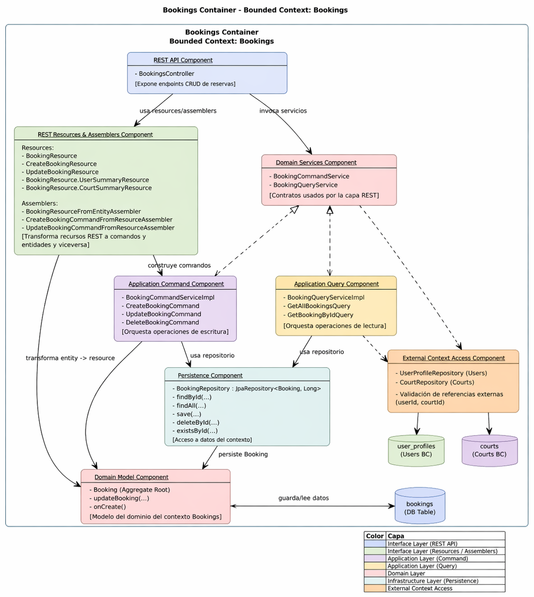

**Relaciones entre componentes:**

- **Bookings REST API Component → Booking Transformation Component**  
  Transforma los datos de entrada y salida entre resources, commands y entidades.

- **Bookings REST API Component → Booking Command Processing Component**  
  Delega operaciones de creación, actualización y eliminación.

- **Bookings REST API Component → Booking Query Processing Component**  
  Delega operaciones de lectura.

- **Booking Command Processing Component → External Context Access Component**  
  Valida la existencia del usuario y de la cancha antes de crear un booking.

- **Booking Command Processing Component → Booking Domain Component**  
  Construye o actualiza la entidad `Booking`.

- **Booking Command Processing Component → Booking Persistence Component**  
  Persiste los cambios del agregado.

- **Booking Query Processing Component → Booking Persistence Component**  
  Recupera reservas desde la base de datos.

- **Booking Persistence Component → bookings**  
  Almacena y consulta la información persistida.

- **External Context Access Component → user_profiles / courts**  
  Accede a los bounded contexts externos para validar relaciones de negocio.

#### 2.6.1.6. Bounded Context Software Architecture Code Level Diagrams

En esta sección se presentan los diagramas a nivel de código del bounded context **Bookings**, los cuales permiten comprender con mayor detalle cómo se implementan los componentes identificados previamente. Este nivel de análisis muestra la estructura interna del dominio y su persistencia, evidenciando las clases, interfaces, atributos, métodos y relaciones que conforman el contexto.

Se incluyen dos representaciones principales:
- El **Class Diagram del Domain Layer**, que describe la estructura del modelo de dominio.
- El **Database Design Diagram**, que representa la persistencia de datos en la base de datos relacional.

---

##### 2.6.1.6.1. Bounded Context Domain Layer Class Diagrams

**Descripción:**

El diagrama de clases del Domain Layer del bounded context **Bookings** presenta el agregado principal `Booking`, junto con sus relaciones hacia entidades externas (`UserProfile` y `Court`), así como las interfaces de servicios y los objetos que representan comandos y consultas.

El diseño evidencia que `Booking` es el núcleo del dominio y que las operaciones del sistema se organizan alrededor de comandos (acciones de escritura) y queries (acciones de lectura).

---

**Diagrama UML de clases (Domain Layer):**

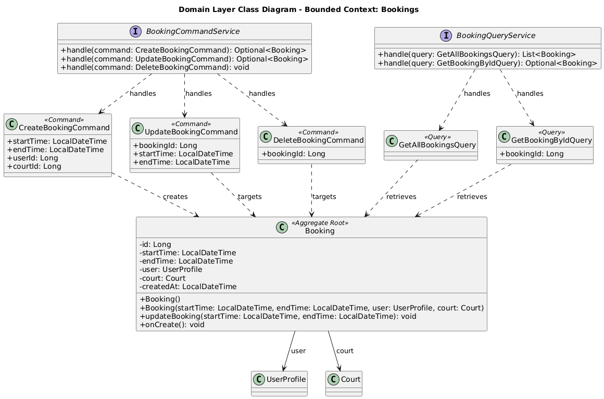

**Relaciones principales del modelo**

- **Booking** es el Aggregate Root del bounded context.
- **Booking** mantiene una relación Many-to-One con **UserProfile**.
- **Booking** mantiene una relación Many-to-One con **Court**.
- **BookingCommandService** define las operaciones de escritura.
- **BookingQueryService** define las operaciones de lectura.
- Los comandos encapsulan acciones de negocio.
- Las queries encapsulan solicitudes de consulta.

**Observaciones**

El modelo de dominio presenta una estructura clara y centrada en el agregado **Booking**. Sin embargo, no se identifican aún value objects ni reglas complejas encapsuladas dentro del dominio, lo que sugiere oportunidades de mejora como la incorporación de validaciones de disponibilidad o control de solapamiento de horarios.

---

##### 2.6.1.6.2. Bounded Context Database Design Diagram

**Descripción**

El diagrama de base de datos del bounded context **Bookings** representa la estructura relacional utilizada para persistir la información de reservas. La tabla principal es **bookings**, la cual mantiene relaciones con las tablas **user_profiles** y **courts**.

**Diagrama de base de datos (ERD)**

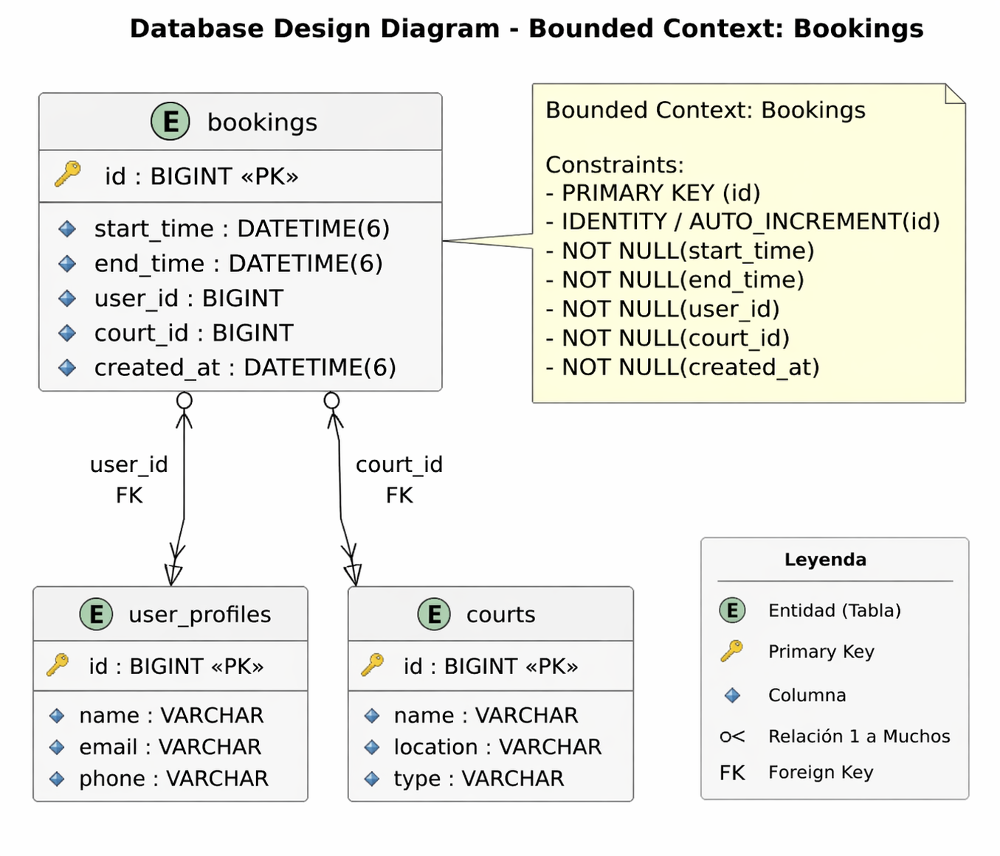

**Tablas y atributos**

Tabla `bookings`

- `id`: identificador único de la reserva (PK)
- `start_time`: fecha y hora de inicio
- `end_time`: fecha y hora de fin
- `user_id`: referencia al usuario (FK)
- `court_id`: referencia a la cancha (FK)
- `created_at`: fecha de creación

Tabla `user_profiles`

- `id`
- `name`
- `email`
- `phone`

Tabla `courts`

- `id`
- `name`
- `location`
- `type`

Constraints

- PRIMARY KEY (`id`) en `bookings`
- FOREIGN KEY (`user_id`) → `user_profiles(id)`
- FOREIGN KEY (`court_id`) → `courts(id)`
- Restricciones NOT NULL en campos críticos

Relaciones entre tablas

- `user_profiles (1)` ──── `(*) bookings`
- `courts (1)` ──── `(*) bookings`

**Observaciones**

El diseño de persistencia es consistente con el modelo de dominio y permite almacenar correctamente las reservas. Sin embargo, actualmente no se implementan restricciones avanzadas como control de solapamiento de horarios o validación de disponibilidad, lo que representa una oportunidad de mejora para fortalecer la lógica de negocio a nivel de base de datos.

---

### 2.6.2. Bounded Context: Payments

#### 2.6.2.1. Domain Layer

**Entities / Aggregates**

```
Payment (Pago - Aggregate Root)
├── paymentId: int → Identificador único de pago
├── amount: Decimal → Cantidad transferida en el pago
├── user: User → Usuario a realizar la transferencia
├── paymentStatus: PaymentStatus → Descripción de la cancha
├── createdAt: DateTime → Fecha de creación

Métodos:
├── createPayment(userId, amount) → Crea un nuevo pago
├── complete() → Marca el pago como COMPLETED
├── fail() → Marca el pago como FAILED
├── cancel() → Marca el pago como CANCELLED
├── getPaymentById(paymentId) → Obtiene un pago realizado por su identificador
```

**Value Objects**

```
PaymentStatus
├── pending: PENDING -> Pago Pendiente (estado inicial)
├── completed: COMPLETED -> Pago completado
├── failed: FAILED → Pago fallido
├── cancelled: CANCELLED → Pago cancelado
```

**Domain Events**

```
PaymentCreated(paymentId, userId, amount, createdAt)
PaymentCompleted(paymentId, status)
PaymentFailed(paymentId, status)
PaymentCancelled(paymentId, status)
```
---

#### 2.6.2.2. Interface Layer

**REST Controllers**

```
PaymentController
├── POST /api/v1/payments → Crear nuevo pago
│   Request: CreatePaymentDTO
│   Response: PaymentResponseDTO
│
└── GET /api/v1/payments/{paymentId} → Obtener pago por identificador
    Response: PaymentResponseDTO
```

**DTOs (Data Transfer Objects)**

```
CreatePaymentDTO
├── userId: Long
└── amount: BigDecimal

PaymentResponseDTO
├── paymentId: Long
├── amount: BigDecimal
├── paymentDate: DateTime
├── status: PaymentStatus
└── user: UserSummaryDTO

UserSummaryDTO
├── userId: Long
└── name: String
```

---

#### 2.6.2.3. Application Layer

**Command Handlers**

```
CreatePaymentCommandHandler
├── Input: CreatePaymentCommand (userId, amount)
├── Validaciones:
│   ├── Verificar que el usuario existe
│   ├── Validar que el monto es mayor a 0
│   └── Validar que el monto no sea nulo
├── Proceso:
│   ├── Obtener UserProfile
│   ├── Crear Payment (estado inicial PENDING)
│   └── Persistir Payment
└── Output: PaymentCreatedEvent


CompletePaymentCommandHandler
├── Input: CompletePaymentCommand (paymentId)
├── Validaciones:
│   ├── Verificar que el pago existe
│   ├── Verificar que el estado es PENDING
│   └── Validar que no esté CANCELLED o FAILED
├── Proceso:
│   ├── Obtener Payment
│   ├── Ejecutar payment.complete()
│   └── Persistir cambios
└── Output: PaymentCompletedEvent


FailPaymentCommandHandler
├── Input: FailPaymentCommand (paymentId)
├── Validaciones:
│   ├── Verificar que el pago existe
│   ├── Verificar que el estado es PENDING
│   └── Validar que no esté COMPLETED
├── Proceso:
│   ├── Obtener Payment
│   ├── Ejecutar payment.fail()
│   └── Persistir cambios
└── Output: PaymentFailedEvent


CancelPaymentCommandHandler
├── Input: CancelPaymentCommand (paymentId)
├── Validaciones:
│   ├── Verificar que el pago existe
│   ├── Verificar que no esté COMPLETED
│   └── Validar reglas de cancelación
├── Proceso:
│   ├── Obtener Payment
│   ├── Ejecutar payment.cancel()
│   └── Persistir cambios
└── Output: PaymentCancelledEvent
```

**Event Handlers**

```
OnPaymentCreatedHandler
├── Escucha: PaymentCreatedEvent
└── Acciones:
    ├── Registrar el pago en el sistema
    ├── Preparar información para frontend
    └── Inicializar estado del pago


OnPaymentCompletedHandler
├── Escucha: PaymentCompletedEvent
└── Acciones:
    ├── Notificar confirmación de pago al usuario
    ├── Actualizar estado visible en frontend
    └── Registrar operación como completada


OnPaymentFailedHandler
├── Escucha: PaymentFailedEvent
└── Acciones:
    ├── Notificar fallo al usuario
    ├── Registrar intento fallido
    └── Permitir reintento de pago


OnPaymentCancelledHandler
├── Escucha: PaymentCancelledEvent
└── Acciones:
    ├── Notificar cancelación al usuario
    ├── Liberar recursos asociados (si aplica)
    └── Registrar cancelación
```

---

#### 2.6.2.4. Infrastructure Layer

**Repositories**

```
PaymentRepository
├── save(payment: Payment) → void
├── findById(paymentId: Long) → Payment
├── findByUserId(userId: Long) → List<Payment>
├── update(payment: Payment) → void
└── delete(paymentId: Long) → void
```

**Adapters**

```
NotificationAdapter
├── sendPaymentConfirmation(user, payment) → void
├── sendPaymentFailureNotification(user, payment) → void
└── sendPaymentCancellationNotification(user, payment) → void
```

**Persistencia**

```
Tabla: payments
├── payment_id (PK, BIGINT, AUTO_INCREMENT)
├── user_id (FK → users.user_id)
├── amount (DECIMAL(10,2), NOT NULL)
├── status (ENUM: PENDING, COMPLETED, FAILED, CANCELLED)
├── created_at (TIMESTAMP, DEFAULT CURRENT_TIMESTAMP)
└── INDEX (user_id, status)
```

---

#### 2.6.2.5. Bounded Context Software Architecture Component Level Diagrams

**Descripción:**

El diagrama de componentes para el Payments Context presenta la descomposición del contenedor en componentes responsables de la gestión del ciclo de vida de los pagos. Estos componentes coordinan la creación, validación, procesamiento y notificación de eventos relacionados con los pagos:

**Diagrama de Componentes:**


**Relaciones entre Componentes:**

- **Payment API → Payment Application Service:** Delega las peticiones del frontend y los DTOs transformados para iniciar el flujo de procesamiento.
- **Payment Application Service → Payment Management:** Usa la lógica de negocio central para orquestar los casos de uso y manejar validaciones de aplicación.
- **Payment Application Service → Repository & Data Access:** Persiste la información del pago directamente después de coordinar el flujo entre capas.
- **Payment Management → Payment Event Handling:** Dispara eventos de dominio cuando ocurre un cambio relevante en el estado del pago (como la creación de un pago PENDING).
- **Payment Event Handling → Notification Adapter:** Notifica al adaptador cuando se requiere enviar confirmaciones, fallos o cancelaciones a servicios externos.
- **Notification Adapter → Notification System:** Envía las alertas finales al usuario a través de canales externos como Email o notificaciones Push.
- **Repository & Data Access → SQLite (Payments):** Accede y persiste toda la información transaccional de los pagos en el motor de base de datos.

---

#### 2.6.2.6. Bounded Context Software Architecture Code Level Diagrams

##### 2.6.2.6.1. Bounded Context Domain Layer Class Diagrams

**Diagrama UML de Clases - Payments Domain Layer**


**Relaciones:**

- Payment * ──────── 1 PaymentStatus (uses): Indica que un pago utiliza un estado específico para definir su situación actual.
- PaymentRepository ◄────────────── Payment (manages): Relación de gestión donde el repositorio se encarga de mediar la persistencia del Agregado.
- PaymentRepositoryImpl ───────────► PaymentRepository (implements): La clase concreta implementa el contrato definido por la interfaz del repositorio.
- Payment ───────────► PaymentCreated (generates): El Agregado genera este evento de dominio al momento de ser instanciado o registrado.
- Payment ───────────► PaymentCompleted (generates): Evento disparado tras una transición de estado exitosa a completado.
- Payment ───────────► PaymentFailed (generates): Evento generado cuando el proceso de pago encuentra un error crítico.
- Payment ───────────► PaymentCancelled (generates): Notifica la anulación del pago por parte del usuario o del sistema.
- Payment * ──────── 1 User (associated with): Vincula cada transacción de pago con un perfil de usuario específico como propietario

---

##### 2.6.2.6.2. Bounded Context Database Design Diagram

**Entity Relationship Diagram (ERD) - Payments**


**Relaciones:**
- users (1) ──── (*) payments: Indica que un usuario puede realizar múltiples pagos, pero cada pago pertenece obligatoriamente a un único usuario.

---

### 2.6.3. Bounded Context: Users

El bounded context **Users** representa la capacidad del sistema encargada de gestionar el perfil funcional de los usuarios del negocio. Su propósito es permitir la creación, consulta, actualización y eliminación de perfiles que contienen la información operativa utilizada por los demás bounded contexts.

Dentro de este contexto, la entidad principal es `UserProfile`, ya que concentra los datos funcionales del usuario, incluyendo nombre, correo electrónico y teléfono. En consecuencia, este bounded context modela la identidad de negocio y no la identidad autenticada, por lo que se complementa con IAM en lugar de duplicarlo.

Este contexto se relaciona de forma directa con los bounded contexts **IAM** y **Notifications**. Con IAM se vincula conceptualmente porque ambos representan a la misma persona desde perspectivas distintas: autenticación versus perfil funcional. Con Notifications se relaciona de forma persistente, ya que cada notificación pertenece a un `UserProfile`. A diferencia de IAM, aquí sí existe una entidad de negocio explícita y utilizada como referencia por otros contextos.

---

#### 2.6.3.1. Domain Layer

La Domain Layer del bounded context **Users** contiene las clases que modelan el núcleo funcional de la gestión de perfiles de usuario, así como los comandos, consultas y contratos de servicios de dominio que soportan sus casos de uso principales. A partir del análisis del código, se identifica que el agregado principal del contexto es `UserProfile`, acompañado por sus comandos, queries y servicios de dominio.

##### a) Entity / Aggregate Root: `UserProfile`

**Nombre de la clase:** `UserProfile`  
**Paquete:** `com.upc.matchpoint.users.domain.model.aggregates`

**Propósito:**  
Representa el perfil funcional de un usuario del sistema. Modela la información operativa que consumen otros bounded contexts.

**Atributos:**
- `id: Long` → identificador único del perfil.
- `name: String` → nombre completo o nombre funcional del usuario.
- `email: String` → correo electrónico único del perfil.
- `phone: String` → número telefónico del usuario.

**Métodos identificados:**
- `UserProfile()` → constructor vacío.
- `UserProfile(String name, String email, String phone)` → constructor con datos principales.
- `updateProfile(String name, String email, String phone)` → actualiza los datos del perfil.

**Relaciones:**
- Un `UserProfile` puede ser referenciado por múltiples notificaciones.
- La relación entre `UserProfile` y `Notification` es de tipo **One-to-Many** desde la perspectiva de Users.

##### b) Value Objects / Enumerations

En el código revisado no se identifican enums ni value objects propios del bounded context `Users`. El modelo se apoya en atributos simples para representar la información del perfil.

##### c) Commands del dominio

Los comandos del contexto Users encapsulan la intención de crear, actualizar y eliminar perfiles de usuario.

###### `CreateUserProfileCommand`
**Paquete:** `com.upc.matchpoint.users.domain.model.commands`

**Propósito:**  
Representa la intención de crear un nuevo perfil de usuario.

**Atributos:**
- `name: String`
- `email: String`
- `phone: String`

###### `UpdateUserProfileCommand`
**Paquete:** `com.upc.matchpoint.users.domain.model.commands`

**Propósito:**  
Representa la intención de modificar un perfil de usuario existente.

**Atributos:**
- `userId: Long`
- `name: String`
- `email: String`
- `phone: String`

###### `DeleteUserProfileCommand`
**Paquete:** `com.upc.matchpoint.users.domain.model.commands`

**Propósito:**  
Representa la intención de eliminar un perfil de usuario existente.

**Atributos:**
- `userId: Long`

##### d) Queries del dominio

El contexto Users define consultas para recuperar perfiles de usuario persistidos.

###### `GetAllUserProfilesQuery`
**Propósito:**  
Representa la intención de obtener todos los perfiles de usuario del sistema.

###### `GetUserProfileByIdQuery`
**Propósito:**  
Representa la intención de obtener un perfil de usuario específico por identificador.

**Atributos:**
- `userId: Long`

##### e) Domain Services

El dominio define servicios que abstraen los casos de uso principales del contexto Users.

###### `UserProfileCommandService`
**Propósito:**  
Define el contrato para ejecutar operaciones de creación, actualización y eliminación.

**Métodos identificados:**
- `handle(CreateUserProfileCommand command)`
- `handle(UpdateUserProfileCommand command)`
- `handle(DeleteUserProfileCommand command)`

###### `UserProfileQueryService`
**Propósito:**  
Define el contrato para recuperar información de perfiles de usuario.

**Métodos identificados:**
- `handle(GetAllUserProfilesQuery query)`
- `handle(GetUserProfileByIdQuery query)`

##### f) Repository

###### `UserProfileRepository`
**Paquete:** `com.upc.matchpoint.users.infrastructure.persistence.jpa.repositories`

**Propósito dentro del dominio:**  
Abstraer la persistencia y recuperación de perfiles de usuario.

**Operaciones identificadas:**
- `save(UserProfile)`
- `findById(Long)`
- `findAll()`
- `findByEmail(String)`
- `existsByEmail(String)`

##### g) Reglas de negocio identificadas

**Reglas implementadas actualmente:**
- El correo electrónico debe ser único al momento de crear un perfil.
- El perfil puede ser actualizado con nuevos datos funcionales.
- El sistema puede listar perfiles existentes.
- El sistema puede obtener un perfil por id.
- El sistema puede eliminar perfiles cuando existen.

**Reglas no implementadas o incompletas:**
- No existe validación de formato de correo más allá de la unicidad.
- No existe validación semántica del teléfono.
- No existe asociación directa con la cuenta autenticada de IAM.
- No existe historial de cambios del perfil.

En conjunto, la Domain Layer de Users es simple y funcional, y actúa como la fuente de verdad del perfil operativo de cada usuario.

---

#### 2.6.3.2. Interface Layer

La Interface Layer del bounded context **Users** contiene las clases responsables de exponer las funcionalidades del contexto mediante endpoints REST y de transformar la información entre las estructuras internas del sistema y los recursos consumidos por el frontend.

##### a) `UserProfilesController`

**Paquete:** `com.upc.matchpoint.users.interfaces.rest`

**Propósito:**  
Exponer los endpoints HTTP relacionados con la administración de perfiles de usuario.

**Endpoints expuestos:**
- `POST /api/v1/user-profiles` → crear perfil.
- `GET /api/v1/user-profiles` → obtener todos los perfiles.
- `GET /api/v1/user-profiles/{id}` → obtener perfil por id.
- `PUT /api/v1/user-profiles/{id}` → actualizar perfil.
- `DELETE /api/v1/user-profiles/{id}` → eliminar perfil.

##### b) Resources / DTOs

###### `CreateUserProfileResource`
**Propósito:**  
Representar los datos de entrada requeridos para crear un perfil de usuario.

**Atributos:**
- `name`
- `email`
- `phone`

###### `UpdateUserProfileResource`
**Propósito:**  
Representar los datos de entrada requeridos para actualizar un perfil de usuario.

**Atributos:**
- `name`
- `email`
- `phone`

###### `UserProfileResource`
**Propósito:**  
Representar la información de un perfil de usuario hacia el frontend.

**Atributos:**
- `id`
- `name`
- `email`
- `phone`

##### c) Assemblers

La capa de interfaz del contexto Users incluye assemblers encargados de transformar datos entre resources, commands y entidades.

**Assemblers identificados:**
- `CreateUserProfileCommandFromResourceAssembler`
- `UpdateUserProfileCommandFromResourceAssembler`
- `UserProfileResourceFromEntityAssembler`

##### d) Responsabilidad de la capa de interfaz

La responsabilidad principal de esta capa es:
- recibir solicitudes del cliente,
- convertir resources de entrada en commands,
- delegar la ejecución a la capa de aplicación,
- y transformar los resultados en resources de salida adecuados para el frontend.

En el caso de Users, esta capa expone la identidad funcional del negocio que luego consumen otros bounded contexts como Notifications.

---

#### 2.6.3.3. Application Layer

La Application Layer del bounded context **Users** coordina los flujos de proceso relacionados con la creación, consulta, actualización y eliminación de perfiles de usuario. En esta capa se orquestan los comandos y consultas del sistema, conectando la Interface Layer con el Domain Layer y con la infraestructura de persistencia.

Las capacidades principales del contexto son:
- crear perfil,
- listar perfiles,
- obtener perfil por id,
- actualizar perfil,
- eliminar perfil.

##### a) Command Handlers / Command Services

###### `UserProfileCommandServiceImpl`

**Paquete:** `com.upc.matchpoint.users.application.internal.commandservices`

**Propósito:**  
Implementar los casos de uso de creación, actualización y eliminación de perfiles de usuario.

**Dependencias:**
- `UserProfileRepository`

**Operaciones que maneja:**

**`handle(CreateUserProfileCommand command)`**
- valida que el correo electrónico no exista,
- crea una nueva entidad `UserProfile`,
- persiste el perfil,
- retorna el perfil creado.

**`handle(UpdateUserProfileCommand command)`**
- busca el perfil por `userId`,
- actualiza los datos funcionales,
- guarda la entidad actualizada,
- retorna el perfil modificado.

**`handle(DeleteUserProfileCommand command)`**
- verifica que el perfil exista,
- elimina el perfil persistido.

##### b) Query Handlers / Query Services

###### `UserProfileQueryServiceImpl`

**Paquete:** `com.upc.matchpoint.users.application.internal.queryservices`

**Propósito:**  
Implementar los casos de uso de lectura sobre perfiles de usuario.

**Dependencias:**
- `UserProfileRepository`

**Operaciones que maneja:**
- `handle(GetAllUserProfilesQuery query)`
- `handle(GetUserProfileByIdQuery query)`

##### c) Event Handlers

En el bounded context **Users** no se identifican event handlers en el código revisado. Esto sugiere que el contexto opera de forma síncrona y centrada en REST, sin automatización basada en eventos de dominio o aplicación.

##### d) Flujos principales del negocio

###### Flujo de creación de perfil
1. El frontend envía un `CreateUserProfileResource`.
2. La capa de interfaz lo transforma a `CreateUserProfileCommand`.
3. `UserProfileCommandServiceImpl` valida que el correo no exista.
4. Se crea una instancia de `UserProfile`.
5. El perfil se persiste mediante `UserProfileRepository`.
6. Se transforma el resultado en `UserProfileResource`.
7. Se retorna la respuesta al cliente.

###### Flujo de consulta de perfiles
1. El cliente solicita la lista o detalle de perfiles.
2. El controlador construye la query correspondiente.
3. `UserProfileQueryServiceImpl` recupera la información desde `UserProfileRepository`.
4. Los resultados se transforman a resources.
5. Se retorna la respuesta.

###### Flujo de actualización de perfil
1. El frontend envía un `UpdateUserProfileResource`.
2. La capa de interfaz lo transforma a `UpdateUserProfileCommand`.
3. `UserProfileCommandServiceImpl` busca el perfil por id.
4. Actualiza los datos funcionales.
5. Persiste el cambio.
6. Retorna el perfil actualizado.

###### Flujo de eliminación de perfil
1. El cliente solicita la eliminación de un perfil.
2. El controlador construye el comando de eliminación.
3. `UserProfileCommandServiceImpl` valida la existencia.
4. El perfil se elimina de la base de datos.
5. Se retorna una respuesta de confirmación.

##### e) Observaciones de la capa de aplicación

La capa de aplicación implementa de forma consistente los casos de uso principales de Users: creación, consulta, actualización y eliminación de perfiles. Su estructura es simple y clara, y mantiene al contexto enfocado en administrar la identidad funcional del usuario con validación de unicidad por correo.

---

#### 2.6.3.4. Infrastructure Layer

La Infrastructure Layer del bounded context **Users** contiene los componentes encargados del acceso a base de datos y de la persistencia de perfiles de usuario. En esta capa se materializa el soporte técnico para almacenar y consultar perfiles funcionales.

##### a) Repositorios de persistencia

###### `UserProfileRepository`

**Paquete:** `com.upc.matchpoint.users.infrastructure.persistence.jpa.repositories`

**Propósito:**  
Gestionar la persistencia y recuperación de perfiles de usuario utilizando Spring Data JPA.

**Operaciones disponibles:**
- `save`
- `findById`
- `findAll`
- `findByEmail`
- `existsByEmail`

##### b) Persistencia de la entidad `UserProfile`

La entidad `UserProfile` está mapeada como una entidad JPA con las siguientes características:
- `@Entity`
- `@Table(name = "user_profiles")`
- restricción de unicidad para `email`

##### c) Integración con otros bounded contexts

Users expone la identidad funcional que consumen otros bounded contexts, especialmente Notifications. La integración se materializa mediante la referencia persistente a `UserProfile`, que permite a otros contextos asociar sus registros con un usuario del negocio.

**Observación importante:**  
No se identificó una fachada ACL específica para Users. El contexto funciona como proveedor del perfil funcional, pero no como integrador activo de otros bounded contexts mediante una interfaz dedicada.

##### d) Limitaciones de la capa de infraestructura

La infraestructura actual cumple con la persistencia básica de perfiles de usuario, pero todavía presenta limitaciones relevantes:
- no existe integración con autenticación de IAM;
- no existe sincronización automática con el registro de cuenta autenticada;
- no existe historial o auditoría avanzada del perfil;
- no existe infraestructura adicional de mensajería o eventos.

En consecuencia, la Infrastructure Layer del bounded context Users es funcional para persistencia de perfiles, pero aún no resuelve la unificación automática entre identidad autenticada e identidad funcional.

---

#### 2.6.3.5. Bounded Context Software Architecture Component Level Diagrams

**Descripción:**

El Component Diagram del bounded context **Users** representa la descomposición del contenedor backend encargado de gestionar perfiles funcionales de usuario. A nivel arquitectónico, este container está conformado por componentes con responsabilidades bien delimitadas: recepción de solicitudes REST, transformación de datos entre capas, ejecución de comandos y consultas, y acceso a persistencia.

A partir del análisis del contexto, se identifican los siguientes componentes principales:

**Componentes principales:**

- **User Profile REST API Component**  
  Expone los endpoints HTTP relacionados con crear, listar, consultar, actualizar y eliminar perfiles.

- **User Profile Transformation Component**  
  Agrupa los assemblers y resources que permiten transformar datos entre la capa de interfaz y la capa de aplicación.

- **User Profile Command Processing Component**  
  Implementado por el servicio de comandos, coordina los casos de uso de creación, actualización y eliminación.

- **User Profile Query Processing Component**  
  Implementado por el servicio de consultas, coordina la lectura de perfiles.

- **User Profile Domain Component**  
  Representa el núcleo del dominio mediante la entidad `UserProfile`, comandos, queries y contratos de servicio.

- **User Profile Persistence Component**  
  Encapsula el acceso a persistencia mediante `UserProfileRepository` usando Spring Data JPA.

**Diagrama de componentes propuesto:**

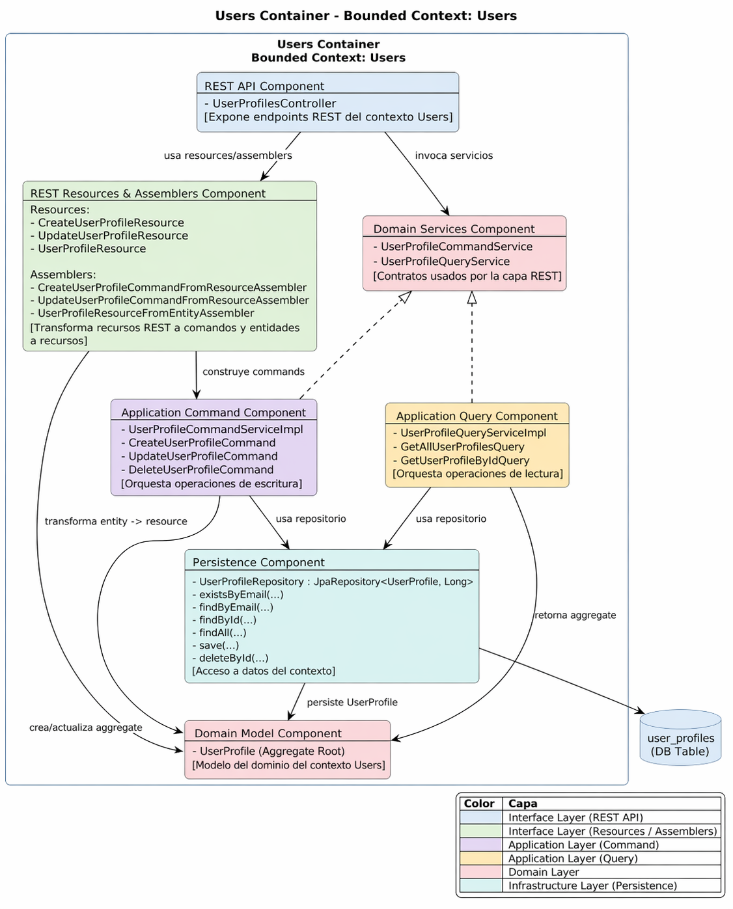

##### Relaciones entre componentes

- **User Profile REST API Component → User Profile Transformation Component**  
  Transforma datos de entrada y salida entre resources, commands y entidades.

- **User Profile REST API Component → User Profile Command Processing Component**  
  Delega operaciones de creación, actualización y eliminación.

- **User Profile REST API Component → User Profile Query Processing Component**  
  Delega operaciones de lectura sobre perfiles.

- **User Profile Command Processing Component → User Profile Domain Component**  
  Construye y actualiza la entidad `UserProfile`.

- **User Profile Command Processing Component → User Profile Persistence Component**  
  Persiste perfiles y consulta su existencia.

- **User Profile Query Processing Component → User Profile Persistence Component**  
  Recupera perfiles desde base de datos.

- **User Profile Transformation Component → User Profile Domain Component**  
  Convierte entidades en resources de salida.

---

#### 2.6.3.6. Bounded Context Software Architecture Code Level Diagrams

En esta sección se presentan los diagramas a nivel de código del bounded context **Users**, los cuales permiten comprender con mayor detalle cómo se implementan los componentes identificados previamente. Este nivel de análisis muestra la estructura interna del dominio y su persistencia, evidenciando las clases, interfaces, atributos, métodos y relaciones que conforman el contexto.

Se incluyen dos representaciones principales:

- el **Class Diagram del Domain Layer**, que describe la estructura del modelo de dominio;
- y el **Database Design Diagram**, que representa la persistencia de datos en la base de datos relacional.

---

##### 2.6.3.6.1. Bounded Context Domain Layer Class Diagrams

**Descripción:**

El diagrama de clases del Domain Layer del bounded context **Users** presenta el agregado principal `UserProfile`, junto con los comandos, queries y servicios de dominio que soportan las operaciones del contexto. El diseño evidencia que `UserProfile` es el núcleo del contexto y que las operaciones del sistema se organizan alrededor de la administración de perfiles funcionales.

**Diagrama UML de clases (Domain Layer):**

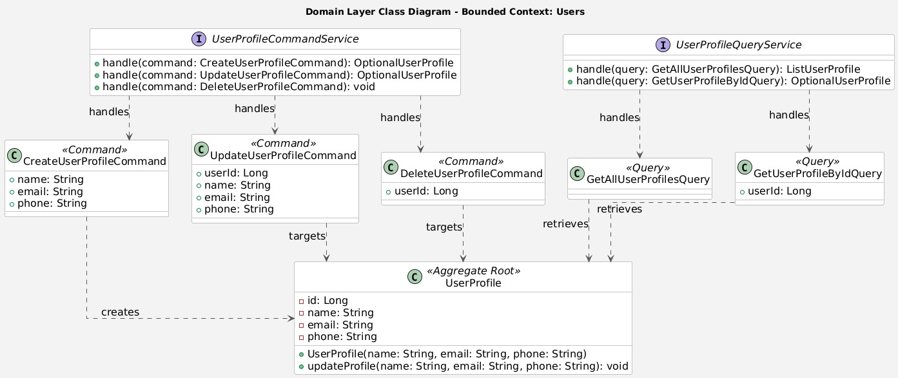

###### Relaciones principales del modelo

- `UserProfile` es el **Aggregate Root** del bounded context.
- `UserProfile` puede ser referenciado por múltiples notificaciones.
- `UserProfileCommandService` define las operaciones de creación, actualización y eliminación.
- `UserProfileQueryService` define las operaciones de lectura de perfiles.
- Los comandos encapsulan acciones de administración de perfiles.
- Las queries encapsulan solicitudes de consulta.

###### Observaciones

El modelo de dominio presenta una estructura simple, clara y centrada en la identidad funcional del usuario. El agregado `UserProfile` encapsula la información operativa mínima que el contexto necesita para representar perfiles consistentes y reutilizables.

---

##### 2.6.3.6.2. Bounded Context Database Design Diagram

**Descripción:**

El diagrama de base de datos del bounded context **Users** representa la estructura relacional utilizada para persistir la información de perfiles de usuario. La tabla principal es `user_profiles`.

**Diagrama de base de datos (ERD):**

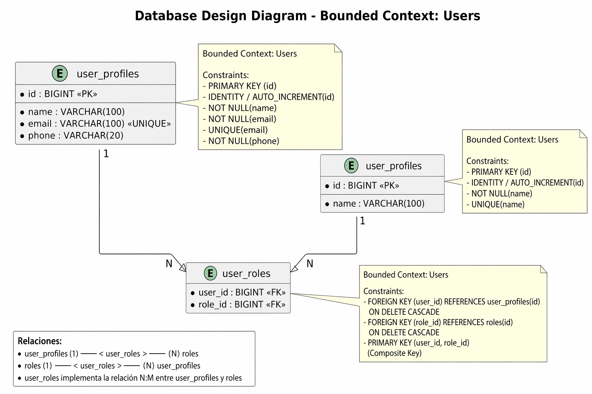

###### Tablas y atributos

###### Tabla `user_profiles`

- `id`: identificador único del perfil (PK)
- `name`: nombre del usuario
- `email`: correo electrónico único
- `phone`: teléfono del usuario

###### Constraints

- `PRIMARY KEY (id)` en `user_profiles`
- `UNIQUE (email)` en `user_profiles`
- restricción de `NOT NULL` en `name`
- restricción de `NOT NULL` en `email`
- restricción de `NOT NULL` en `phone`

###### Relaciones entre tablas

- `user_profiles (1) ──── (*) notifications` mediante la clave foránea definida en Notifications.

###### Observaciones

El diseño de persistencia es consistente con el modelo de dominio y permite almacenar correctamente perfiles funcionales de usuario con una restricción clara de unicidad sobre el correo. La tabla `user_profiles` refleja de manera directa el alcance del contexto y mantiene la persistencia alineada con su responsabilidad de negocio.

---

### 2.6.4. Bounded Context: Coaches

El bounded context **Coaches** representa la capacidad del sistema encargada de gestionar, registrar y consultar la información de entrenadores dentro de la plataforma Courtly. Su propósito es permitir la administración del catálogo de coaches que participan en el ecosistema deportivo digital, almacenando sus datos relevantes y habilitando su uso por otros bounded contexts del sistema. Dentro de este contexto, la entidad principal es `Coach`, ya que concentra la información esencial del entrenador y constituye el agregado raíz del contexto.

Este contexto se relaciona directamente con los bounded contexts **Availabilities**, **Analytics** y **Reviews**, debido a que la información de un coach es utilizada para registrar disponibilidades, asociar métricas de desempeño y recibir reseñas desde otros módulos del sistema. De esta manera, Coaches cumple un rol de catálogo base y de soporte para otros procesos funcionales de Courtly.

#### 2.6.4.1. Domain Layer

La capa de dominio del bounded context **Coaches** contiene las clases que modelan el núcleo del catálogo de entrenadores y las reglas de negocio asociadas a su administración. A partir del análisis de la arquitectura general del backend, se identifica que el agregado principal del contexto es `Coach`, acompañado por comandos, consultas y servicios de dominio que estructuran la lógica interna del módulo.

##### a) Entity / Aggregate Root: `Coach`

**Nombre de la clase:** `Coach`  
**Paquete:** `com.upc.matchpoint.coaches.domain.model.aggregates`

**Propósito:**  
Representa la entidad principal del bounded context Coaches. Modela a un entrenador registrado dentro de Courtly y constituye el agregado raíz del contexto.

**Atributos:**
- `id: Long` → identificador único del coach.
- `name: String` → nombre del entrenador.
- `expertise: String` → especialidad o experiencia del entrenador.
- `phone: String` → número de contacto del entrenador.

**Métodos:**
- `Coach(String name, String expertise, String phone)` → constructor que inicializa un nuevo coach.
- `updateInformation(String name, String expertise, String phone)` → actualiza los datos del entrenador.

**Relaciones:**
- Un coach puede tener múltiples disponibilidades en el bounded context **Availabilities**.
- Un coach puede tener múltiples métricas en el bounded context **Analytics**.
- Un coach puede recibir múltiples reseñas en el bounded context **Reviews** mediante `targetType = COACH` y `targetId`.

##### b) Referencias externas del dominio

Dentro del bounded context Coaches no se identifican referencias obligatorias a otras entidades de dominio para el funcionamiento base del agregado `Coach`. El contexto es relativamente autónomo y actúa como proveedor de datos para otros módulos del sistema.

##### c) Value Objects

No se identifican value objects explícitos implementados en el bounded context **Coaches**. Actualmente, los atributos del agregado `Coach` son tipos simples (`String`, `Long`), sin encapsulación adicional mediante enums o clases de valor.

##### d) Commands del dominio

Los comandos del contexto Coaches encapsulan la intención de ejecutar operaciones de escritura sobre el agregado `Coach`.

###### `CreateCoachCommand`

**Paquete:** `com.upc.matchpoint.coaches.domain.model.commands`

**Propósito:**  
Representa la intención de crear un nuevo entrenador.

**Atributos:**
- `name: String`
- `expertise: String`
- `phone: String`

###### `UpdateCoachCommand`

**Paquete:** `com.upc.matchpoint.coaches.domain.model.commands`

**Propósito:**  
Representa la intención de actualizar un entrenador existente.

**Atributos:**
- `coachId: Long`
- `name: String`
- `expertise: String`
- `phone: String`

###### `DeleteCoachCommand`

**Paquete:** `com.upc.matchpoint.coaches.domain.model.commands`

**Propósito:**  
Representa la intención de eliminar un entrenador.

**Atributos:**
- `coachId: Long`

##### e) Queries del dominio

El contexto también define objetos de consulta para la recuperación de información.

###### `GetAllCoachesQuery`

**Paquete:** `com.upc.matchpoint.coaches.domain.model.queries`

**Propósito:**  
Representa la intención de obtener todos los entrenadores del sistema.

**Atributos:** no contiene atributos.

###### `GetCoachByIdQuery`

**Paquete:** `com.upc.matchpoint.coaches.domain.model.queries`

**Propósito:**  
Representa la intención de obtener un entrenador específico por identificador.

**Atributos:**
- `coachId: Long`

##### f) Domain Services

El dominio define interfaces de servicio que abstraen la ejecución de comandos y consultas.

###### `CoachCommandService`

**Paquete:** `com.upc.matchpoint.coaches.domain.services`

**Propósito:**  
Define el contrato para ejecutar operaciones de creación, actualización y eliminación sobre entrenadores.

**Métodos:**
- `Optional<Coach> handle(CreateCoachCommand command)`
- `Optional<Coach> handle(UpdateCoachCommand command)`
- `void handle(DeleteCoachCommand command)`

###### `CoachQueryService`

**Paquete:** `com.upc.matchpoint.coaches.domain.services`

**Propósito:**  
Define el contrato para ejecutar operaciones de consulta sobre entrenadores.

**Métodos:**
- `List<Coach> handle(GetAllCoachesQuery query)`
- `Optional<Coach> handle(GetCoachByIdQuery query)`

##### g) Repository

###### `CoachRepository`

**Paquete:** `com.upc.matchpoint.coaches.infrastructure.persistence.jpa.repositories`

**Propósito dentro del dominio:**  
Abstraer la persistencia de entrenadores, permitiendo operaciones de guardado, consulta y eliminación.

**Operaciones disponibles:**
- `save(Coach)`
- `findById(Long)`
- `findAll()`
- `deleteById(Long)`
- `existsById(Long)`

##### h) Reglas de negocio identificadas

**Reglas implementadas actualmente:**
- Un coach debe tener obligatoriamente nombre.
- Un coach debe tener obligatoriamente una especialidad o expertise.
- Un coach debe tener obligatoriamente un teléfono.
- El nombre del coach se valida como único al momento de creación.

**Reglas de negocio no implementadas aún:**
- Validación formal del formato del teléfono.
- Separación estructurada de especialidades mediante value objects o enums.
- Asociación directa entre coach y cuenta autenticada del contexto IAM.
- Reglas para disponibilidad automática o asignación de sesiones.
- Reglas de consistencia frente a eliminación cuando existen métricas, reseñas o disponibilidades asociadas.

En conjunto, la Domain Layer de Coaches presenta una estructura simple y clara, apropiada para un contexto de catálogo, aunque todavía puede enriquecerse con validaciones de mayor profundidad y una mejor integración con otros bounded contexts funcionales.

#### 2.6.4.2. Interface Layer

La Interface Layer del bounded context **Coaches** contiene las clases responsables de exponer las funcionalidades del contexto mediante endpoints REST y de transformar la información entre las estructuras internas del sistema y los recursos consumidos por el frontend.

##### a) `CoachesController`

**Paquete:** `com.upc.matchpoint.coaches.interfaces.rest`

**Propósito:**  
Exponer los endpoints HTTP para la gestión de entrenadores. Actúa como punto de entrada del bounded context desde el cliente o cualquier consumidor externo.

**Dependencias:**
- `CoachCommandService`
- `CoachQueryService`

**Endpoints expuestos:**
- `POST /api/v1/coaches` → crear coach
- `GET /api/v1/coaches` → obtener todos los coaches
- `GET /api/v1/coaches/{id}` → obtener coach por id
- `PUT /api/v1/coaches/{id}` → actualizar coach
- `DELETE /api/v1/coaches/{id}` → eliminar coach

##### b) Resources / DTOs

###### `CoachResource`

**Paquete:** `com.upc.matchpoint.coaches.interfaces.rest.resources`

**Propósito:**  
Representar la respuesta de un entrenador hacia el frontend.

**Atributos:**
- `id`
- `name`
- `expertise`
- `phone`

###### `CreateCoachResource`

**Propósito:**  
Representar los datos de entrada requeridos para crear un nuevo entrenador.

**Atributos:**
- `name`
- `expertise`
- `phone`

###### `UpdateCoachResource`

**Propósito:**  
Representar los datos de entrada necesarios para actualizar un entrenador existente.

**Atributos:**
- `name`
- `expertise`
- `phone`

##### c) Assemblers

###### `CoachResourceFromEntityAssembler`

**Paquete:** `com.upc.matchpoint.coaches.interfaces.rest.transform`

**Propósito:**  
Transformar una entidad `Coach` del dominio en un `CoachResource` apto para ser enviado al frontend.

###### `CreateCoachCommandFromResourceAssembler`

**Propósito:**  
Transformar un `CreateCoachResource` en un `CreateCoachCommand`.

###### `UpdateCoachCommandFromResourceAssembler`

**Propósito:**  
Transformar un `UpdateCoachResource`, junto con el identificador del coach, en un `UpdateCoachCommand`.

##### d) Responsabilidad de la capa de interfaz

La responsabilidad principal de esta capa es:
- recibir solicitudes del cliente,
- convertir recursos de entrada en comandos o consultas,
- delegar la ejecución a la capa de aplicación,
- y transformar los resultados en recursos de salida adecuados para el frontend.

#### 2.6.4.3. Application Layer

La Application Layer del bounded context **Coaches** coordina los flujos de proceso del negocio. En esta capa se orquestan los comandos y consultas del sistema, conectando la Interface Layer con el Domain Layer y con la infraestructura de persistencia.

Las capacidades principales del contexto son:
- crear un coach,
- actualizar un coach,
- eliminar un coach,
- obtener un coach por id,
- obtener todos los coaches.

##### a) Command Handlers / Command Services

###### `CoachCommandServiceImpl`

**Paquete:** `com.upc.matchpoint.coaches.application.internal.commandservices`

**Propósito:**  
Implementar el contrato `CoachCommandService` y ejecutar los casos de uso de escritura del contexto Coaches.

**Dependencia:**
- `CoachRepository`

**Operaciones que maneja:**

**`handle(CreateCoachCommand command)`**
- valida reglas de creación,
- crea una nueva entidad `Coach`,
- persiste el entrenador en base de datos,
- retorna el coach creado.

**`handle(UpdateCoachCommand command)`**
- busca el entrenador por id,
- actualiza `name`, `expertise` y `phone`,
- guarda el cambio,
- retorna el coach actualizado si existe.

**`handle(DeleteCoachCommand command)`**
- verifica si el entrenador existe,
- lo elimina por identificador,
- lanza excepción si no existe.

##### b) Query Handlers / Query Services

###### `CoachQueryServiceImpl`

**Paquete:** `com.upc.matchpoint.coaches.application.internal.queryservices`

**Propósito:**  
Implementar el contrato `CoachQueryService` y ejecutar los casos de uso de lectura del contexto Coaches.

**Dependencia:**
- `CoachRepository`

**Operaciones que maneja:**

**`handle(GetAllCoachesQuery query)`**
- recupera todos los entrenadores del sistema mediante `findAll()`,
- devuelve una lista de entidades `Coach`.

**`handle(GetCoachByIdQuery query)`**
- busca un entrenador específico por su id,
- devuelve un `Optional<Coach>`.

##### c) Flujos principales del negocio

###### Flujo de creación de coach
1. El frontend envía un `CreateCoachResource`.
2. La capa de interfaz lo transforma a `CreateCoachCommand`.
3. `CoachCommandServiceImpl` valida la información del entrenador.
4. Se construye una instancia de `Coach`.
5. El coach se persiste mediante `CoachRepository`.
6. El resultado se transforma en `CoachResource` y se retorna al cliente.

###### Flujo de actualización
1. El frontend envía un `UpdateCoachResource`.
2. Se transforma en `UpdateCoachCommand`.
3. `CoachCommandServiceImpl` recupera el coach existente.
4. Se actualizan los datos del entrenador.
5. Se guarda la modificación.
6. Se retorna el coach actualizado.

###### Flujo de consulta
1. El frontend solicita uno o varios entrenadores.
2. El controlador construye el objeto de consulta correspondiente.
3. `CoachQueryServiceImpl` recupera la información desde `CoachRepository`.
4. Los resultados se transforman a `CoachResource`.
5. Se retorna la respuesta al cliente.

###### Flujo de eliminación
1. El frontend solicita eliminar un entrenador.
2. Se construye un `DeleteCoachCommand`.
3. `CoachCommandServiceImpl` verifica la existencia del entrenador.
4. Se elimina el entrenador del repositorio.
5. Se devuelve la confirmación de eliminación.

##### d) Observaciones de la capa de aplicación

Aunque esta capa implementa correctamente los casos de uso CRUD del bounded context, aún presenta limitaciones funcionales relevantes:
- no vincula coaches con cuentas de autenticación del contexto IAM,
- no integra automáticamente métricas, disponibilidades o reseñas,
- no incorpora paginación ni filtros especializados,
- y no implementa validaciones avanzadas sobre formato o consistencia de datos.

Además, no se identifican **Event Handlers** implementados en el contexto Coaches. Todas las operaciones se ejecutan únicamente mediante comandos HTTP.

#### 2.6.4.4. Infrastructure Layer

La Infrastructure Layer del bounded context **Coaches** contiene los componentes encargados del acceso a base de datos y de la persistencia de los entrenadores. En esta capa se materializa el almacenamiento del agregado `Coach` y se soportan las operaciones que ejecuta la aplicación.

##### a) Repositorio de persistencia

###### `CoachRepository`

**Paquete:** `com.upc.matchpoint.coaches.infrastructure.persistence.jpa.repositories`

**Propósito:**  
Gestionar la persistencia y recuperación de entrenadores utilizando Spring Data JPA. La implementación concreta es generada automáticamente por el framework al extender `JpaRepository<Coach, Long>`.

**Operaciones disponibles:**
- `save`
- `findById`
- `findAll`
- `deleteById`
- `existsById`

**Observación:**  
No se identifican métodos personalizados de consulta por especialidad, disponibilidad o reputación.

##### b) Persistencia de la entidad `Coach`

La entidad `Coach` está mapeada como una entidad JPA con las siguientes características:
- `@Entity`
- `@Table(name = "coaches")`
- `@Id`
- `@GeneratedValue(strategy = GenerationType.IDENTITY)`

##### c) Diseño de persistencia

**Tabla principal:** `coaches`

**Columnas identificadas:**
- `id`
- `name`
- `expertise`
- `phone`

**Restricciones y relaciones:**
- `id` → Primary Key
- `name`, `expertise`, `phone` → `NOT NULL`

##### d) Integración con otros bounded contexts

La infraestructura del contexto Coaches es utilizada por:
- `Availability` del contexto **Availabilities**
- `Metric` del contexto **Analytics**
- `Review` del contexto **Reviews** de forma semántica mediante `targetType = COACH`

##### e) Configuración técnica relevante

El proyecto utiliza configuración JPA centralizada y persistencia relacional compartida, con soporte de Spring Data JPA y mapeo de entidades compatible con MySQL.

##### f) Limitaciones de la capa de infraestructura

La infraestructura actual cumple con la persistencia básica del contexto, pero aún no incorpora:
- búsquedas avanzadas por expertise,
- índices especializados,
- integraciones explícitas con perfiles funcionales o autenticación,
- ni reglas de integridad más sofisticadas frente a dependencias externas.

En consecuencia, la Infrastructure Layer del bounded context Coaches es funcional para el escenario actual, aunque todavía puede evolucionar para soportar un catálogo de entrenadores más rico y conectado con la lógica del dominio.

#### 2.6.4.5. Bounded Context Software Architecture Component Level Diagrams

**Descripción:**

El Component Diagram del bounded context **Coaches** representa la descomposición del contenedor backend encargado de gestionar entrenadores. A nivel arquitectónico, este container está conformado por componentes con responsabilidades bien definidas dentro del sistema: recepción de solicitudes REST, transformación de datos entre capas, ejecución de comandos y consultas, y acceso a persistencia.

**Componentes principales:**

- **Coaches REST API Component**  
  Expone los endpoints HTTP del bounded context mediante `CoachesController`.

- **Coach Transformation Component**  
  Agrupa los assemblers y resources que permiten transformar datos entre la capa de interfaz y la capa de aplicación.

- **Coach Command Processing Component**  
  Implementado por `CoachCommandServiceImpl`, coordina las operaciones de creación, actualización y eliminación.

- **Coach Query Processing Component**  
  Implementado por `CoachQueryServiceImpl`, gestiona las operaciones de consulta.

- **Coach Domain Component**  
  Representa el núcleo del dominio mediante el agregado `Coach`, junto con sus comandos y queries.

- **Coach Persistence Component**  
  Encapsula el acceso a persistencia a través de `CoachRepository`.

**Diagrama de componentes propuesto:**


#### 2.6.4.6. Bounded Context Software Architecture Code Level Diagrams

En esta sección se presentan los diagramas a nivel de código del bounded context Coaches, los cuales permiten comprender con mayor detalle cómo se implementan los componentes identificados previamente. Este nivel de análisis muestra la estructura interna del dominio y su persistencia, evidenciando las clases, interfaces, atributos, métodos y relaciones que conforman el contexto.

Se incluyen dos representaciones principales:

- El Class Diagram del Domain Layer, que describe la estructura del modelo de dominio.
- El Database Design Diagram, que representa la persistencia de datos en la base de datos relacional.

##### 2.6.4.6.1. Bounded Context Domain Layer Class Diagrams

**Descripción**

El diagrama de clases del Domain Layer del bounded context Coaches presenta el agregado principal Coach, así como las interfaces de servicios y los objetos que representan comandos y consultas.

**Diagrama UML de clases (Domain Layer)**


##### 2.6.4.6.2. Bounded Context Database Design Diagram

**Descripción**

El diagrama de base de datos del bounded context Coaches representa la estructura relacional utilizada para persistir la información de entrenadores. La tabla principal es coaches.

**Diagrama de base de datos (ERD)**


**Tablas y atributos**

Tabla `coaches`
- `id`: identificador único del entrenador (PK)
- `name`: nombre del coach
- `expertise`: especialidad del coach
- `phone`: teléfono de contacto

Constraints
- PRIMARY KEY (`id`) en `coaches`
- Restricciones NOT NULL en `name`, `expertise`, `phone`

**Observaciones**

El diseño de persistencia del bounded context Coaches es simple y consistente con su rol de catálogo base del sistema. Sin embargo, aún no incorpora restricciones más especializadas, búsquedas por expertise o relaciones explícitas con cuentas autenticadas del sistema.

### 2.6.5. Bounded Context: Court & Venue Management

#### 2.6.5.1. Domain Layer

**Entities / Aggregates**

```
Court (Cancha - Aggregate Root)
├── courtId: int → Identificador único de la cancha
├── ownerId: int → Propietario de la cancha
├── name: String → Nombre de la cancha
├── description: String → Descripción de la cancha
├── location: Location (Value Object)
├── sportType: SportType (Enum) → Tipo de deporte (Fútbol, Tenis, Básquet, etc.)
├── surface: String → Tipo de superficie (Sintética, Grass, Cemento)
├── pricePerHour: double → Precio por hora de uso
├── capacity: int → Capacidad máxima de usuarios
├── amenities: List<Amenity> → Servicios adicionales (estacionamiento, vestuarios, etc.)
├── rating: double → Calificación promedio
├── availability: AvailabilitySchedule (Value Object)
├── images: List<ImageUrl> → Fotos de la cancha
├── state: CourtState (Enum) → Estado (Activa, Inactiva, Bloqueada)
├── createdAt: DateTime → Fecha de creación
├── updatedAt: DateTime → Fecha de última actualización

Métodos:
├── createAvailability(horario) → Crea disponibilidad para horarios específicos
├── updatePricing(newPrice) → Actualiza el precio por hora
├── updateAvailability(slot, available) → Marca un slot como disponible o no
├── blockTime(startTime, endTime, reason) → Bloquea tiempo por mantenimiento
├── publishCourt() → Publica la cancha en la plataforma
├── deactivateCourt() → Desactiva la cancha
└── calculateOccupancy(period) → Calcula porcentaje de ocupación
```

**Value Objects**

```
Location
├── address: String → Dirección completa
├── city: String → Ciudad
├── latitude: double → Latitud
├── longitude: double → Longitud
└── districtCode: String → Código del distrito

AvailabilitySchedule
├── slots: List<TimeSlot>
├── workingHours: WorkingHours (lunes-domingo, hora inicio-fin)
└── exceptions: List<BlockedPeriod> (fechas cerradas, mantenimiento)

TimeSlot
├── date: Date → Fecha específica
├── startTime: Time → Hora de inicio
├── endTime: Time → Hora de finalización
└── isAvailable: boolean → Disponibilidad actual

Amenity
├── amenityId: int
├── name: String (Estacionamiento, Vestuarios, Ducha, Cafetería, etc.)
└── included: boolean
```

**Domain Services**

```
CourtAvailabilityService
├── checkAvailability(courtId, dateTime, duration) → boolean
└── suggestAlternativeSlots(courtId, preferences) → List<TimeSlot>

PricingService
├── calculatePrice(courtId, duration, dayOfWeek) → double
├── applyDiscount(courtId, reservationCount) → double
└── validatePriceRange(price) → boolean

CourtScheduleService
├── generateAvailabilityCalendar(courtId, month) → Calendar
├── publishSchedule(courtId, schedule) → void
└── syncWithReservationSystem(courtId) → void
```

**Domain Events**

```
CourtPublished(courtId, ownerId, timestamp)
CourtDeactivated(courtId, reason, timestamp)
PricingUpdated(courtId, oldPrice, newPrice, timestamp)
AvailabilityUpdated(courtId, slot, isAvailable, timestamp)
TimeBlocked(courtId, startTime, endTime, reason, timestamp)
CourtReviewed(courtId, rating, timestamp)
```

**Enums**

```
SportType: FUTBOL, TENIS, BASQUET, VOLEIBOL, PADEL, BADMINTON, OTRO
CourtState: ACTIVA, INACTIVA, BLOQUEADA, EN_MANTENIMIENTO
```

---

#### 2.6.5.2. Interface Layer

**REST Controllers**

```
CourtController
├── POST /courts → Crear nueva cancha
│   Request: CreateCourtDTO
│   Response: CourtResponseDTO
│
├── GET /courts/{courtId} → Obtener detalles de cancha
│   Response: CourtDetailDTO
│
├── PUT /courts/{courtId} → Actualizar información de cancha
│   Request: UpdateCourtDTO
│   Response: CourtResponseDTO
│
├── GET /courts → Listar canchas (con filtros)
│   Query: ?sport=FUTBOL&city=Lima&page=1
│   Response: PagedCourtDTO
│
├── PATCH /courts/{courtId}/pricing → Actualizar precio
│   Request: UpdatePricingDTO
│   Response: PricingResponseDTO
│
├── PATCH /courts/{courtId}/availability → Actualizar disponibilidad
│   Request: UpdateAvailabilityDTO
│   Response: AvailabilityResponseDTO
│
├── POST /courts/{courtId}/block-time → Bloquear tiempo
│   Request: BlockTimeDTO
│   Response: BlockResponseDTO
│
├── DELETE /courts/{courtId} → Desactivar cancha
│   Response: 204 No 
│
├── GET /courts/{courtId}/calendar → Obtener calendario
│   Query: ?month=2024-04
│   Response: CalendarDTO
│
└── GET /courts/{courtId}/occupancy → Estadísticas de ocupación
    Query: ?period=MONTH
    Response: OccupancyStatisticsDTO
```

**DTOs (Data Transfer Objects)**

```
CreateCourtDTO
├── name: String
├── description: String
├── location: LocationDTO
├── sportType: String
├── surface: String
├── pricePerHour: double
├── capacity: int
├── amenities: List<String>
└── images: List<MultipartFile>

UpdateCourtDTO
├── name: String
├── description: String
├── amenities: List<String>
└── images: List<MultipartFile>

UpdatePricingDTO
├── pricePerHour: double
└── effectiveDate: Date

UpdateAvailabilityDTO
├── workingHours: WorkingHoursDTO
└── exceptions: List<BlockedPeriodDTO>

BlockTimeDTO
├── startTime: DateTime
├── endTime: DateTime
└── reason: String

CourtResponseDTO
├── courtId: int
├── name: String
├── location: LocationDTO
├── sportType: String
├── pricePerHour: double
├── rating: double
├── availability: AvailabilityDTO
└── state: String

CourtDetailDTO
├── (todos los campos de CourtResponseDTO)
├── description: String
├── surface: String
├── capacity: int
├── amenities: List<AmenityDTO>
├── images: List<ImageDTO>
├── owner: CourtOwnerDTO
└── reviews: List<ReviewDTO>

CalendarDTO
├── courtId: int
├── month: String
└── slots: List<SlotDTO>

OccupancyStatisticsDTO
├── courtId: int
├── period: String
├── totalSlots: int
├── bookedSlots: int
├── occupancyPercentage: double
└── revenueEstimate: double
```

---

#### 2.6.5.3. Application Layer

**Command Handlers**

```
CreateCourtCommandHandler
├── Input: CreateCourtCommand (name, location, sportType, pricePerHour, etc.)
├── Validaciones:
│   ├── Verificar que el propietario existe y está activo
│   ├── Validar que la ubicación es válida
│   ├── Validar que el precio está en rango permitido
│   └── Verificar que el usuario no tiene más de N canchas activas
└── Output: CourtCreatedEvent

UpdateCourtCommandHandler
├── Input: UpdateCourtCommand (courtId, updates)
├── Validaciones:
│   ├── Verificar que la cancha existe
│   ├── Verificar que el usuario es propietario
│   └── Validar datos actualizados
└── Output: CourtUpdatedEvent

UpdatePricingCommandHandler
├── Input: UpdatePricingCommand (courtId, newPrice)
├── Validaciones:
│   ├── Precio debe ser > 0
│   ├── No puede cambiar si hay reservas próximas (< 24 horas)
│   └── Verificar permisos del propietario
└── Output: PricingUpdatedEvent

UpdateAvailabilityCommandHandler
├── Input: UpdateAvailabilityCommand (courtId, schedule)
├── Validaciones:
│   ├── Horarios deben ser realistas (06:00 - 23:00)
│   ├── No puede cerrar con reservas activas
│   └── Validar formato de horarios
└── Output: AvailabilityUpdatedEvent

BlockTimeCommandHandler
├── Input: BlockTimeCommand (courtId, startTime, endTime, reason)
├── Validaciones:
│   ├── Verificar que no hay reservas en ese período
│   ├── Bloque no puede ser > 30 días
│   └── Verificar permisos del propietario
└── Output: TimeBlockedEvent

DeactivateCourtCommandHandler
├── Input: DeactivateCourtCommand (courtId, reason)
├── Validaciones:
│   ├── Verificar que no hay reservas activas
│   ├── Cancelar todas las reservas futuras
│   └── Verificar permisos del propietario
└── Output: CourtDeactivatedEvent
```

**Event Handlers**

```
OnCourtPublishedHandler
├── Escucha: CourtPublishedEvent
├── Acciones:
│   ├── Indexar cancha en Search & Discovery Context
│   ├── Enviar confirmación por email al propietario
│   └── Inicializar estadísticas
└── Publica: CourtIndexedEvent

OnPricingUpdatedHandler
├── Escucha: PricingUpdatedEvent
├── Acciones:
│   ├── Notificar a propietario sobre cambio
│   ├── Enviar notificación a deportistas que la siguen
│   └── Actualizar índices de búsqueda
└── Publica: SearchIndexUpdatedEvent

OnAvailabilityUpdatedHandler
├── Escucha: AvailabilityUpdatedEvent
├── Acciones:
│   ├── Sincronizar con Booking & Reservation Context
│   ├── Actualizar calendario de reservas disponibles
│   └── Notificar cambios a usuarios interesados
└── Publica: ReservationAvailabilityChangedEvent

OnTimeBlockedHandler
├── Escucha: TimeBlockedEvent
├── Acciones:
│   ├── Marcar slots como no disponibles
│   ├── Notificar sobre cierre temporal
│   └── Generar recordatorio de reapertura
└── Publica: TimeSlotBlockedEvent
```

---

#### 2.6.5.4. Infrastructure Layer

**Repositories**

```
CourtRepository
├── save(court: Court) → void
├── findById(courtId: int) → Court
├── findByOwnerId(ownerId: int) → List<Court>
├── findBySportType(sportType: SportType) → List<Court>
├── findByLocation(latitude, longitude, radiusKm) → List<Court>
├── update(court: Court) → void
├── delete(courtId: int) → void
└── findAvailableCourts(sportType, date, time, duration) → List<Court>

AvailabilityRepository
├── save(availability: AvailabilitySchedule) → void
├── findByCourtId(courtId: int) → AvailabilitySchedule
├── updateSlot(courtId, slot, available) → void
├── blockTime(courtId, startTime, endTime) → void
└── getCalendar(courtId, month) → Calendar

CourtRatingRepository
├── save(rating: Rating) → void
├── findByCourtId(courtId: int) → List<Rating>
├── calculateAverageRating(courtId: int) → double
└── updateCourtRating(courtId, newAverage) → void
```

**Adapters**

```
ImageStorageAdapter (Cloud Storage: AWS S3 / Google Cloud Storage)
├── uploadImage(file: MultipartFile, courtId: int) → String (URL)
├── deleteImage(imageUrl: String) → void
└── generateThumbnail(imageUrl: String) → String

LocationGeocoder (Google Maps API)
├── geocode(address: String) → Location (lat, lng)
├── reverseGeocode(lat, lng) → Address
└── calculateDistance(lat1, lng1, lat2, lng2) → double

CourtNotificationAdapter
├── sendCourtPublishedEmail(owner, court) → void
├── sendPricingChangeNotification(followers, court, oldPrice, newPrice) → void
└── sendAvailabilityAlert(users, court, newSchedule) → void

SearchIndexAdapter (Elasticsearch / Algolia)
├── indexCourt(court: Court) → void
├── updateIndex(courtId, updates) → void
├── removeCourt(courtId: int) → void
└── searchCourts(filters) → List<CourtSearchResult>
```

**Persistencia**

```
Tabla: courts
├── court_id (PK, INT, AUTO_INCREMENT)
├── owner_id (FK → users.user_id)
├── name (VARCHAR(255), NOT NULL)
├── description (TEXT)
├── address (VARCHAR(500), NOT NULL)
├── city (VARCHAR(100), NOT NULL)
├── latitude (DECIMAL(10,8), NOT NULL)
├── longitude (DECIMAL(11,8), NOT NULL)
├── sport_type (ENUM, NOT NULL)
├── surface (VARCHAR(50))
├── price_per_hour (DECIMAL(10,2), NOT NULL)
├── capacity (INT, NOT NULL)
├── rating (DECIMAL(3,2), DEFAULT 0)
├── state (ENUM, DEFAULT 'ACTIVA')
├── created_at (TIMESTAMP, DEFAULT CURRENT_TIMESTAMP)
├── updated_at (TIMESTAMP, ON UPDATE CURRENT_TIMESTAMP)
└── INDEX (owner_id, state), INDEX (sport_type, city), SPATIAL INDEX (latitude, longitude)

Tabla: court_amenities
├── amenity_id (PK, INT, AUTO_INCREMENT)
├── court_id (FK → courts.court_id)
├── amenity_name (VARCHAR(100))
├── included (BOOLEAN)
└── INDEX (court_id)

Tabla: court_availability
├── availability_id (PK, INT, AUTO_INCREMENT)
├── court_id (FK → courts.court_id, UNIQUE)
├── monday_start (TIME)
├── monday_end (TIME)
├── tuesday_start (TIME)
├── ... (miércoles a domingo)
└── updated_at (TIMESTAMP)

Tabla: court_blocked_periods
├── block_id (PK, INT, AUTO_INCREMENT)
├── court_id (FK → courts.court_id)
├── start_time (DATETIME)
├── end_time (DATETIME)
├── reason (VARCHAR(255))
├── created_at (TIMESTAMP)
└── INDEX (court_id, start_time)

Tabla: court_images
├── image_id (PK, INT, AUTO_INCREMENT)
├── court_id (FK → courts.court_id)
├── image_url (VARCHAR(500))
├── is_primary (BOOLEAN)
└── created_at (TIMESTAMP)

Tabla: court_ratings
├── rating_id (PK, INT, AUTO_INCREMENT)
├── court_id (FK → courts.court_id)
├── user_id (FK → users.user_id)
├── score (INT, CONSTRAINT CHECK (score >= 1 AND score <= 5))
├── comment (TEXT)
├── created_at (TIMESTAMP)
└── INDEX (court_id, created_at)
```

---

#### 2.6.5.5. Bounded Context Software Architecture Component Level Diagrams

**Descripción:**

El diagrama de componentes para el Court & Venue Management Context presenta la descomposición del contenedor en componentes funcionales cohesivos que manejan aspectos específicos del negocio de gestión de canchas:

**Componentes Principales:**

```
┌─────────────────────────────────────────────────────────────┐
│         Court & Venue Management Container                  │
├─────────────────────────────────────────────────────────────┤
│                                                               │
│  ┌──────────────────────────────────────────────────────┐   │
│  │  Court Management Component                          │   │
│  ├──────────────────────────────────────────────────────┤   │
│  │ • Crear/Actualizar canchas                           │   │
│  │ • Gestionar información de canchas                   │   │
│  │ • Validar datos de entrada                           │   │
│  │ • Publicar/Desactivar canchas                        │   │
│  └──────────────────────────────────────────────────────┘   │
│                                                               │
│  ┌──────────────────────────────────────────────────────┐   │
│  │  Availability & Scheduling Component                │   │
│  ├──────────────────────────────────────────────────────┤   │
│  │ • Gestionar disponibilidad por horarios              │   │
│  │ • Bloquear tiempo para mantenimiento                 │   │
│  │ • Generar calendario de disponibilidad               │   │
│  │ • Sincronizar con sistema de reservas                │   │
│  └──────────────────────────────────────────────────────┘   │
│                                                               │
│  ┌──────────────────────────────────────────────────────┐   │
│  │  Pricing & Commerce Component                        │   │
│  ├──────────────────────────────────────────────────────┤   │
│  │ • Gestionar precios por hora                         │   │
│  │ • Aplicar descuentos dinámicos                       │   │
│  │ • Calcular ingresos y estadísticas                   │   │
│  │ • Validar rangos de precios                          │   │
│  └──────────────────────────────────────────────────────┘   │
│                                                               │
│  ┌──────────────────────────────────────────────────────┐   │
│  │  Search & Discovery Component                        │   │
│  ├──────────────────────────────────────────────────────┤   │
│  │ • Indexar canchas en motor de búsqueda               │   │
│  │ • Mantener metadatos para búsqueda                   │   │
│  │ • Optimizar para consultas geoespaciales             │   │
│  │ • Actualizar índices en tiempo real                  │   │
│  └──────────────────────────────────────────────────────┘   │
│                                                               │
│  ┌──────────────────────────────────────────────────────┐   │
│  │  Notification Component                              │   │
│  ├──────────────────────────────────────────────────────┤   │
│  │ • Enviar notificaciones a propietarios                │   │
│  │ • Alertas de cambios de disponibilidad                │   │
│  │ • Recordatorios de eventos importantes                │   │
│  │ • Coordinar con Notification & Communication Context  │   │
│  └──────────────────────────────────────────────────────┘   │
│                                                               │
│  ┌──────────────────────────────────────────────────────┐   │
│  │  Repository & Data Access Component                  │   │
│  ├──────────────────────────────────────────────────────┤   │
│  │ • CourtRepository                                     │   │
│  │ • AvailabilityRepository                              │   │
│  │ • CourtRatingRepository                               │   │
│  │ • Implementación de patrones de persistencia          │   │
│  └──────────────────────────────────────────────────────┘   │
│                                                               │
└─────────────────────────────────────────────────────────────┘
         ↓                           ↓                   ↓
    ┌────────────┐      ┌────────────────┐      ┌──────────────┐
    │   SQLite   │      │  AWS S3 / GCS  │      │   Elasticsearch│
    │  (Courts)  │      │  (Images)      │      │  (Índices)     │
    └────────────┘      └────────────────┘      └──────────────┘
```

**Relaciones entre Componentes:**

- **Court Management ↔ Availability & Scheduling:** Court Management actualiza Availability cuando se publica una cancha
- **Pricing & Commerce → Repository:** Persiste cambios de precios en la base de datos
- **Availability & Scheduling → Search & Discovery:** Notifica cambios de disponibilidad para actualizar índices
- **Notification ← Todos:** Se suscribe a eventos de todos los componentes para enviar notificaciones
- **Repository → Data Store:** Accede y persiste toda la información en SQLite
- **Search & Discovery ↔ Elasticsearch:** Mantiene sincronizado el índice de búsqueda

---

#### 2.6.5.6. Bounded Context Software Architecture Code Level Diagrams

##### 2.6.5.6.1. Bounded Context Domain Layer Class Diagrams

**Diagrama UML de Clases - Court & Venue Management Domain Layer**

```
┌─────────────────────────────┐
│      <<Aggregate>>          │
│         Court               │
├─────────────────────────────┤
│ - courtId: int              │
│ - ownerId: int              │
│ - name: String              │
│ - description: String       │
│ - location: Location        │
│ - sportType: SportType      │
│ - surface: String           │
│ - pricePerHour: double      │
│ - capacity: int             │
│ - amenities: List<Amenity>  │
│ - rating: double            │
│ - availability: AvailSched  │
│ - images: List<ImageUrl>    │
│ - state: CourtState         │
│ - createdAt: DateTime       │
│ - updatedAt: DateTime       │
├─────────────────────────────┤
│ + publishCourt(): void      │
│ + updatePricing(p): void    │
│ + updateAvailability(): void│
│ + blockTime(s,e,r): void    │
│ + deactivateCourt(): void   │
│ + calculateOccupancy(): dbl │
│ + addAmenity(a): void       │
│ + removeAmenity(a): void    │
└────────────────┬────────────┘
                 │
     ┌───────────┴────────────┐
     │                        │
┌────▼──────────────────┐ ┌──▼──────────────────────────┐
│   <<ValueObject>>     │ │  <<ValueObject>>            │
│     Location          │ │  AvailabilitySchedule       │
├───────────────────────┤ ├─────────────────────────────┤
│ - address: String     │ │ - slots: List<TimeSlot>     │
│ - city: String        │ │ - workingHours: WorkHours   │
│ - latitude: double    │ │ - exceptions: List<Block>   │
│ - longitude: double   │ ├─────────────────────────────┤
│ - districtCode: String│ │ + isAvailable(slot): bool   │
├───────────────────────┤ │ + getAvailableSlots(): List │
│ + distance(loc): dbl  │ │ + blockPeriod(s,e): void    │
│ + isValid(): boolean  │ │ + unblockPeriod(s,e): void  │
└───────────────────────┘ └─────────────────────────────┘
          ▲                          ▲
          │                          │
          │ uses                     │ contains
          │                          │
     ┌────┴───────────────┐    ┌────┴─────────────────────┐
     │                    │    │                          │
┌────▼─────────────────┐  │ ┌──▼────────────────────────┐│
│  <<ValueObject>>     │  │ │  <<ValueObject>>          ││
│   TimeSlot           │  │ │   Amenity                 ││
├──────────────────────┤  │ ├──────────────────────────┤│
│ - date: Date         │  │ │ - amenityId: int         ││
│ - startTime: Time    │  │ │ - name: String           ││
│ - endTime: Time      │  │ │ - included: boolean      ││
│ - isAvailable: bool  │  │ ├──────────────────────────┤│
├──────────────────────┤  │ │ + getName(): String      ││
│ + duration(): int    │  │ │ + isIncluded(): bool     ││
│ + overlaps(ts): bool │  │ └──────────────────────────┘│
└──────────────────────┘  └───────────────────────────┘

┌─────────────────────────────┐      ┌────────────────────┐
│   <<Interface>>             │      │   <<Enum>>         │
│   CourtRepository           │      │   SportType        │
├─────────────────────────────┤      ├────────────────────┤
│ + save(c: Court): void      │      │ FUTBOL             │
│ + findById(id): Court       │      │ TENIS              │
│ + findByOwnerId(id): List   │      │ BASQUET            │
│ + update(c: Court): void    │      │ VOLEIBOL           │
│ + delete(id): void          │      │ PADEL              │
│ + findAvailable(): List     │      │ BADMINTON          │
└─────────────────────────────┘      │ OTRO               │
           △                         └────────────────────┘
           │ implements
           │                        ┌────────────────────┐
    ┌──────┴───────┐                │   <<Enum>>         │
    │              │                │   CourtState       │
┌───▼──────────────────────────┐    ├────────────────────┤
│ CourtRepositoryImpl           │    │ ACTIVA             │
├──────────────────────────────┤    │ INACTIVA           │
│ - db: Database               │    │ BLOQUEADA          │
├──────────────────────────────┤    │ EN_MANTENIMIENTO   │
│ + save(c): void              │    └────────────────────┘
│ + findById(id): Court        │
│ + update(c): void            │
│ + delete(id): void           │
└──────────────────────────────┘

┌────────────────────────────────────┐
│   <<Service>>                      │
│   CourtAvailabilityService         │
├────────────────────────────────────┤
│ - courtRepository: CourtRepository │
├────────────────────────────────────┤
│ + checkAvailability(): boolean     │
│ + suggestAlternativeSlots(): List  │
│ + reserveSlot(slot): void          │
│ + releaseSlot(slot): void          │
└────────────────────────────────────┘

Relaciones:
- Court *──────── 1 Location (contains)
- Court *──────── 1 AvailabilitySchedule (contains)
- Court *──────── * Amenity (contains)
- AvailabilitySchedule *──────── * TimeSlot (contains)
- CourtRepository ◄────────────── Court (manages)
- CourtAvailabilityService ───────► CourtRepository (uses)
```

---

##### 2.6.5.6.2. Bounded Context Database Design Diagram

**Entity Relationship Diagram (ERD) - Court & Venue Management**

```
┌──────────────────────────────┐
│         users                │
├──────────────────────────────┤
│ PK user_id (INT)             │
│ name (VARCHAR)               │
│ email (VARCHAR, UNIQUE)      │
│ role (ENUM)                  │
└──────────────────────────────┘
         ▲
         │ FK (owner_id)
         │
┌─────────┴──────────────────────────────┐
│          courts                        │
├────────────────────────────────────────┤
│ PK court_id (INT, AUTO_INCREMENT)      │
│ FK owner_id (INT)                      │
│ name (VARCHAR(255), NOT NULL)          │
│ description (TEXT)                     │
│ address (VARCHAR(500), NOT NULL)       │
│ city (VARCHAR(100), NOT NULL)          │
│ district_code (VARCHAR(20))            │
│ latitude (DECIMAL(10,8), NOT NULL)     │
│ longitude (DECIMAL(11,8), NOT NULL)    │
│ sport_type (ENUM, NOT NULL)            │
│ surface (VARCHAR(50))                  │
│ price_per_hour (DECIMAL(10,2))         │
│ capacity (INT)                         │
│ rating (DECIMAL(3,2), DEFAULT 0)       │
│ state (ENUM, DEFAULT 'ACTIVA')         │
│ created_at (TIMESTAMP)                 │
│ updated_at (TIMESTAMP)                 │
│ UNIQUE KEY (owner_id, name)            │
│ INDEX idx_sport_city (sport_type, city)│
│ SPATIAL INDEX idx_location (lat, lng)  │
└─────────────────────┬────────────────────┘
     ┌────────────────┼────────────────┐
     │                │                │
     │                │                │
┌────▼──────────┐ ┌──▼────────────┐ ┌▼─────────────────┐
│court_amenities│ │court_images    │ │court_availability│
├───────────────┤ ├────────────────┤ ├──────────────────┤
│PK amenity_id  │ │PK image_id     │ │PK availability_id│
│FK court_id    │ │FK court_id     │ │FK court_id (UNIQ)│
│amenity_name   │ │image_url       │ │monday_start (TIM)│
│included (BOOL)│ │is_primary (BOO)│ │monday_end (TIME) │
│               │ │created_at      │ │tuesday_start     │
│               │ │                │ │tuesday_end       │
│               │ │                │ │...wednesday-sun..│
│               │ │                │ │updated_at        │
└───────────────┘ └────────────────┘ └──────────────────┘
     │                │
     │                │
     └────────┬───────┘
              │ FK (court_id)
              │
┌─────────────▼──────────────────┐
│ court_blocked_periods          │
├────────────────────────────────┤
│ PK block_id (INT)              │
│ FK court_id (INT)              │
│ start_time (DATETIME)          │
│ end_time (DATETIME)            │
│ reason (VARCHAR(255))          │
│ created_at (TIMESTAMP)         │
│ CONSTRAINT no_overlapping_blocks│
│ INDEX idx_court_dates          │
└────────────────────────────────┘

┌────────────────────────────────┐
│ court_ratings                  │
├────────────────────────────────┤
│ PK rating_id (INT)             │
│ FK court_id (INT)              │
│ FK user_id (INT)               │
│ score (INT, CHECK 1-5)         │
│ comment (TEXT)                 │
│ created_at (TIMESTAMP)         │
│ UNIQUE (court_id, user_id)     │
│ INDEX idx_court_score          │
└────────────────────────────────┘

Relaciones:
- users (1) ──── (*) courts
- courts (1) ──── (*) court_amenities
- courts (1) ──── (*) court_images
- courts (1) ──── (1) court_availability
- courts (1) ──── (*) court_blocked_periods
- courts (1) ──── (*) court_ratings
- users (1) ──── (*) court_ratings
```

### 2.6.6. Bounded Context: Availabilities

#### 2.6.6.1. Domain Layer

**Entities / Aggregates**

```
Availability (Aggregate Root)
├── id: int → Identificador único de la disponibilidad
├── date: Date → Fecha del bloque horario
├── startTime: Time → Hora de inicio del bloque
├── endTime: Time → Hora de finalización del bloque
├── status: AvailabilityStatus (Enum) → Estado actual
├── coach: Coach (Reference) → Entrenador propietario
├── createdAt: DateTime → Fecha de creación
└── updatedAt: DateTime → Fecha de última actualización

Métodos:
├── isConflictWith(otherAvailability) → boolean
├── getSlotDuration() → int (en minutos)
├── markAsReserved() → void
├── markAsAvailable() → void
├── markAsUnavailable() → void
├── isValidTimeRange() → boolean
├── canBeModified() → boolean
└── overlapsWithDate(date) → boolean
```

**Value Objects**

```
AvailabilityStatus
├── AVAILABLE → Slot disponible para reserva
├── RESERVED → Slot ya reservado por un cliente
└── UNAVAILABLE → Slot bloqueado por el entrenador
```

**Domain Services**

```
AvailabilityScheduleService
├── generateWeeklySchedule(coachId, schedule) → void
├── checkConflicts(coachId, date, startTime, endTime) → List<Availability>
├── suggestAlternativeSlots(coachId, date, duration) → List<Availability>
└── validateAvailabilityRange(startTime, endTime) → boolean

AvailabilityStatusService
├── updateStatusFromBooking(availability, booking) → void
├── releaseSlot(availability) → void
├── markPermanentlyUnavailable(availability, reason) → void
└── syncStatusWithBookings(coachId) → void
```

**Domain Events**

```
AvailabilityCreated(availabilityId, coachId, date, startTime, endTime)
AvailabilityReserved(availabilityId, coachId, bookingId, timestamp)
AvailabilityReleased(availabilityId, coachId, timestamp)
AvailabilityMarkedUnavailable(availabilityId, coachId, reason, timestamp)
SlotDurationCalculated(availabilityId, durationMinutes, timestamp)
ConflictDetected(availabilityId, conflictingSlots[], timestamp)
```

**Enums**

```
AvailabilityStatus: AVAILABLE, RESERVED, UNAVAILABLE
TimeRange: [06:00 - 23:00] (válido solo dentro de este rango)
```

---

#### 2.6.6.2. Interface Layer

**REST Controllers**

```
AvailabilityController
├── POST /api/v1/availabilities → Crear nueva disponibilidad
│   Request: CreateAvailabilityDTO
│   Response: AvailabilityResponseDTO
│
├── GET /api/v1/availabilities → Listar disponibilidades (con filtros)
│   Query: ?coachId=1&date=2024-04-25&status=AVAILABLE
│   Response: PagedAvailabilityDTO
│
├── GET /api/v1/availabilities/{id} → Obtener disponibilidad específica
│   Response: AvailabilityDetailDTO
│
├── PUT /api/v1/availabilities/{id} → Actualizar disponibilidad
│   Request: UpdateAvailabilityDTO
│   Response: AvailabilityResponseDTO
│
├── DELETE /api/v1/availabilities/{id} → Eliminar disponibilidad
│   Response: 204 No 
│
├── GET /api/v1/availabilities/coach/{coachId} → Listar por entrenador
│   Query: ?startDate=2024-04-25&endDate=2024-05-25
│   Response: List<AvailabilityDTO>
│
├── GET /api/v1/availabilities/coach/{coachId}/weekly → Agenda semanal
│   Query: ?week=2024-W17
│   Response: WeeklyScheduleDTO
│
├── PATCH /api/v1/availabilities/{id}/mark-reserved → Marcar como reservado
│   Request: MarkReservedDTO { bookingId }
│   Response: AvailabilityResponseDTO
│
├── PATCH /api/v1/availabilities/{id}/mark-available → Marcar como disponible
│   Request: EmptyRequest
│   Response: AvailabilityResponseDTO
│
└── GET /api/v1/availabilities/coach/{coachId}/conflicts → Detectar conflictos
    Query: ?startDate=2024-04-25
    Response: List<ConflictDTO>
```

**DTOs (Data Transfer Objects)**

```
CreateAvailabilityDTO
├── coachId: int (obligatorio)
├── date: Date (obligatorio)
├── startTime: Time (obligatorio, formato HH:mm)
├── endTime: Time (obligatorio, formato HH:mm)
└── status: String (opcional, default: AVAILABLE)

UpdateAvailabilityDTO
├── date: Date
├── startTime: Time
├── endTime: Time
└── status: String

AvailabilityResponseDTO
├── id: int
├── date: Date
├── startTime: Time
├── endTime: Time
├── status: String
├── durationMinutes: int
├── coach: CoachSummaryDTO { id, name }
└── createdAt: DateTime

AvailabilityDetailDTO
├── (todos los campos de AvailabilityResponseDTO)
├── updatedAt: DateTime
├── canBeModified: boolean
└── relatedBooking: BookingSummaryDTO (si status=RESERVED)

WeeklyScheduleDTO
├── coachId: int
├── weekStart: Date
├── weekEnd: Date
└── slots: List<DayScheduleDTO>

DayScheduleDTO
├── date: Date
├── dayName: String
├── availabilities: List<SlotDTO>

SlotDTO
├── id: int
├── startTime: Time
├── endTime: Time
├── status: String
└── isConflicted: boolean

CoachSummaryDTO
├── id: int
└── name: String

ConflictDTO
├── slot1Id: int
├── slot2Id: int
├── startTime: Time
├── endTime: Time
└── reason: String

MarkReservedDTO
├── bookingId: int → ID de la reserva asociada
└── reservedAt: DateTime

PagedAvailabilityDTO
├── : List<AvailabilityDTO>
├── totalElements: long
├── totalPages: int
├── currentPage: int
└── pageSize: int
```

---

#### 2.6.6.3. Application Layer

**Command Handlers**

```
CreateAvailabilityCommandHandler
├── Input: CreateAvailabilityCommand (coachId, date, startTime, endTime, status)
├── Validaciones:
│   ├── Coach debe existir y estar activo
│   ├── startTime debe ser >= 06:00
│   ├── endTime debe ser <= 23:00
│   ├── startTime < endTime (validación débil, no implementada)
│   └── No validar solapes con otros slots (limitación actual)
├── Acciones:
│   ├── Crear entidad Availability
│   ├── Persistir en repositorio
│   └── Emitir evento AvailabilityCreated
└── Output: AvailabilityCreatedEvent

UpdateAvailabilityCommandHandler
├── Input: UpdateAvailabilityCommand (availabilityId, updates)
├── Validaciones:
│   ├── Availability debe existir
│   ├── Status actual != RESERVED (si está reservado no se puede cambiar)
│   ├── Validar rango horario si se envía
│   └── Verificar que el coach propietario autoriza el cambio
├── Acciones:
│   ├── Actualizar campos (date, startTime, endTime)
│   ├── Mantener integridad de reservas
│   └── Emitir evento AvailabilityUpdated
└── Output: AvailabilityUpdatedEvent

MarkAsReservedCommandHandler
├── Input: MarkAsReservedCommand (availabilityId, bookingId)
├── Validaciones:
│   ├── Availability debe estar en estado AVAILABLE
│   ├── Booking debe existir
│   └── Fechas deben coincidir
├── Acciones:
│   ├── Cambiar status a RESERVED
│   ├── Guardar referencia a booking
│   └── Emitir evento AvailabilityReserved
└── Output: AvailabilityReservedEvent

MarkAsAvailableCommandHandler
├── Input: MarkAsAvailableCommand (availabilityId)
├── Validaciones:
│   ├── Availability debe existir
│   └── Puede ser RESERVED o UNAVAILABLE
├── Acciones:
│   ├── Cambiar status a AVAILABLE
│   ├── Limpiar referencia a booking si existe
│   └── Emitir evento AvailabilityReleased
└── Output: AvailabilityReleasedEvent

MarkAsUnavailableCommandHandler
├── Input: MarkAsUnavailableCommand (availabilityId, reason)
├── Validaciones:
│   ├── Availability debe existir
│   └── No puede estar RESERVED
├── Acciones:
│   ├── Cambiar status a UNAVAILABLE
│   ├── Guardar reason/motivo
│   └── Emitir evento AvailabilityMarkedUnavailable
└── Output: AvailabilityMarkedUnavailableEvent

DeleteAvailabilityCommandHandler
├── Input: DeleteAvailabilityCommand (availabilityId)
├── Validaciones:
│   ├── Availability debe existir
│   └── No puede estar RESERVED
├── Acciones:
│   ├── Eliminar registro
│   └── Emitir evento AvailabilityDeleted
└── Output: AvailabilityDeletedEvent
```

**Event Handlers**

```
OnAvailabilityCreatedHandler
├── Escucha: AvailabilityCreatedEvent
├── Acciones:
│   ├── Notificar al coach que su disponibilidad fue creada
│   ├── Indexar en Search & Discovery para búsquedas futuras
│   └── Actualizar calendario visible en frontend
└── Publica: AvailabilityIndexedEvent

OnAvailabilityReservedHandler
├── Escucha: AvailabilityReservedEvent
├── Acciones:
│   ├── Notificar al coach que su slot fue reservado
│   ├── Actualizar estado en índices de búsqueda
│   ├── Enviar confirmación al usuario que hizo la reserva
│   └── Iniciar proceso de facturación si aplica
└── Publica: SlotReservedConfirmedEvent

OnAvailabilityReleasedHandler
├── Escucha: AvailabilityReleasedEvent
├── Acciones:
│   ├── Revertir a AVAILABLE si fue RESERVED
│   ├── Notificar cambio de estado
│   ├── Actualizar índices de búsqueda
│   └── Generar notificación a usuarios interesados
└── Publica: SlotBecameAvailableEvent

OnBookingCancelledHandler (desde Booking Context)
├── Escucha: BookingCancelledEvent
├── Acciones:
│   ├── Encontrar Availability asociada
│   ├── Cambiar status de RESERVED a AVAILABLE
│   └── Notificar al coach que el slot quedó libre
└── Publica: AvailabilityReleasedEvent
```

---

#### 2.6.6.4. Infrastructure Layer

**Repositories**

```
AvailabilityRepository
├── save(availability: Availability) → void
├── findById(availabilityId: int) → Availability
├── findByCoachId(coachId: int) → List<Availability>
├── findByCoachAndDate(coachId, date) → List<Availability>
├── findByCoachAndDateRange(coachId, startDate, endDate) → List<Availability>
├── findByStatus(status: AvailabilityStatus) → List<Availability>
├── findConflicts(coachId, date, startTime, endTime) → List<Availability>
├── findAvailableSlots(coachId, date) → List<Availability>
├── update(availability: Availability) → void
├── delete(availabilityId: int) → void
└── findByCoachIdAndWeek(coachId, weekNumber) → List<Availability>
```

**Adapters**

```
AvailabilityNotificationAdapter
├── notifyCoachSlotCreated(coach, availability) → void
├── notifyCoachSlotReserved(coach, availability, booking) → void
├── notifyCoachSlotReleased(coach, availability) → void
├── notifyUserSlotAvailable(user, availability, coach) → void
└── sendWeeklyScheduleReminder(coach) → void

AvailabilitySearchIndexAdapter (Elasticsearch)
├── indexAvailability(availability) → void
├── updateIndex(availabilityId, updates) → void
├── removeFromIndex(availabilityId) → void
├── searchAvailableSlots(coachId, date, duration) → List<SearchResult>
└── bulkIndexCoachSchedule(coachId) → void

AvailabilityCalendarAdapter (Google Calendar Integration)
├── syncToCalendar(coach, availability) → void
├── removeFromCalendar(availability) → void
├── getCoachCalendarEvents(coachId, dateRange) → List<CalendarEvent>
└── markBlockedTime(coach, startDate, endDate, reason) → void

ConflictDetectionAdapter
├── detectTimeConflicts(coachId, startTime, endTime, date) → List<Conflict>
├── validateTimeRange(startTime, endTime) → boolean
└── calculateSlotsOverlap(slot1, slot2) → int (duración en minutos)
```

**Persistencia**

```
Tabla: availabilities
├── availability_id (PK, INT, AUTO_INCREMENT)
├── coach_id (FK → coaches.coach_id, NOT NULL)
├── date (DATE, NOT NULL)
├── start_time (TIME, NOT NULL)
├── end_time (TIME, NOT NULL)
├── status (ENUM, DEFAULT 'AVAILABLE')
├── booking_id (FK → bookings.booking_id, NULLABLE)
├── created_at (TIMESTAMP, DEFAULT CURRENT_TIMESTAMP)
├── updated_at (TIMESTAMP, ON UPDATE CURRENT_TIMESTAMP)
├── UNIQUE KEY (coach_id, date, start_time, end_time)
├── INDEX idx_coach_date (coach_id, date)
├── INDEX idx_coach_status (coach_id, status)
├── INDEX idx_date_status (date, status)
└── CONSTRAINT check_time_range (start_time < end_time AND HOUR(start_time) >= 6 AND HOUR(end_time) <= 23)

Tabla: availability_conflicts_log (para auditoría)
├── conflict_id (PK, INT, AUTO_INCREMENT)
├── availability_id1 (FK → availabilities.availability_id)
├── availability_id2 (FK → availabilities.availability_id)
├── conflict_type (VARCHAR, e.g., 'TIME_OVERLAP')
├── detected_at (TIMESTAMP)
└── resolved (BOOLEAN, DEFAULT FALSE)
```

---

#### 2.6.6.5. Bounded Context Software Architecture Component Level Diagrams

**Descripción:**

El diagrama de componentes para el Availabilities Context muestra cómo se organiza la gestión de disponibilidad de coaches:

```
┌─────────────────────────────────────────────────────────────┐
│      Availabilities Container                               │
├─────────────────────────────────────────────────────────────┤
│                                                               │
│  ┌──────────────────────────────────────────────────────┐   │
│  │  Availability Management Component                   │   │
│  ├──────────────────────────────────────────────────────┤   │
│  │ • Crear/Actualizar disponibilidades                  │   │
│  │ • Gestionar duración de slots                        │   │
│  │ • Cambiar estados (AVAILABLE/RESERVED/UNAVAILABLE)   │   │
│  │ • Validar rangos horarios                            │   │
│  └──────────────────────────────────────────────────────┘   │
│                                                               │
│  ┌──────────────────────────────────────────────────────┐   │
│  │  Conflict Detection Component                        │   │
│  ├──────────────────────────────────────────────────────┤   │
│  │ • Detectar solapes de horarios                       │   │
│  │ • Validar integridad de slots                        │   │
│  │ • Sugerir slots alternativos                         │   │
│  │ • Generar reportes de conflictos                     │   │
│  └──────────────────────────────────────────────────────┘   │
│                                                               │
│  ┌──────────────────────────────────────────────────────┐   │
│  │  Schedule Generation Component                       │   │
│  ├──────────────────────────────────────────────────────┤   │
│  │ • Generar agenda semanal/mensual                     │   │
│  │ • Crear bloques horarios recurrentes                 │   │
│  │ • Gestionar excepciones y bloques                    │   │
│  │ • Sincronizar con calendario externo                 │   │
│  └──────────────────────────────────────────────────────┘   │
│                                                               │
│  ┌──────────────────────────────────────────────────────┐   │
│  │  Status Management Component                         │   │
│  ├──────────────────────────────────────────────────────┤   │
│  │ • Actualizar estado de slots                         │   │
│  │ • Sincronizar con reservas (Booking Context)         │   │
│  │ • Liberar slots cuando se cancela reserva            │   │
│  │ • Bloquear slots permanentemente                     │   │
│  └──────────────────────────────────────────────────────┘   │
│                                                               │
│  ┌──────────────────────────────────────────────────────┐   │
│  │  Notification Component                              │   │
│  ├──────────────────────────────────────────────────────┤   │
│  │ • Notificar al coach sobre cambios                   │   │
│  │ • Alertar a usuarios de nuevos slots                 │   │
│  │ • Enviar recordatorios de sesiones próximas          │   │
│  │ • Coordinar con Notification & Communication Context │   │
│  └──────────────────────────────────────────────────────┘   │
│                                                               │
│  ┌──────────────────────────────────────────────────────┐   │
│  │  Repository & Data Access Component                  │   │
│  ├──────────────────────────────────────────────────────┤   │
│  │ • AvailabilityRepository                             │   │
│  │ • Persistencia en base de datos                      │   │
│  │ • Caché de disponibilidades frecuentes               │   │
│  │ • Optimización de queries                            │   │
│  └──────────────────────────────────────────────────────┘   │
│                                                               │
└─────────────────────────────────────────────────────────────┘
         ↓                           ↓                   ↓
    ┌────────────┐      ┌────────────────┐      ┌──────────────┐
    │   SQLite   │      │  Elasticsearch  │      │Google Calendar│
    │(Availabil) │      │  (Índices)      │      │  (Sync)      │
    └────────────┘      └────────────────┘      └──────────────┘
         ↑                                              
         │ Interacción con Booking Context
    ┌────────────┐
    │  Bookings  │
    └────────────┘
```

**Relaciones entre Componentes:**

- **Availability Management ↔ Conflict Detection:** Valida y detecta conflictos antes de persistir
- **Schedule Generation → Availability Management:** Genera slots que luego Availability Management persiste
- **Status Management ← Booking Context:** Escucha cambios en reservas para actualizar estados
- **Notification ← Todos:** Se suscribe a eventos de todos los componentes
- **Repository ← Todos:** Accede a los datos persistidos en SQLite
- **Elasticsearch:** Mantiene índices para búsquedas rápidas de slots disponibles
- **Google Calendar:** Sincroniza la agenda del coach para coordinación externa

---

#### 2.6.6.6. Bounded Context Software Architecture Code Level Diagrams

##### 2.6.6.6.1. Bounded Context Domain Layer Class Diagrams

**Diagrama UML de Clases - Availabilities Domain Layer**

```
┌─────────────────────────────────────┐
│      <<Aggregate>>                  │
│      Availability                   │
├─────────────────────────────────────┤
│ - id: int                           │
│ - date: Date                        │
│ - startTime: Time                   │
│ - endTime: Time                     │
│ - status: AvailabilityStatus        │
│ - coach: Coach (Reference)          │
│ - bookingId: int (nullable)         │
│ - createdAt: DateTime               │
│ - updatedAt: DateTime               │
├─────────────────────────────────────┤
│ + isConflictWith(other): boolean    │
│ + getSlotDuration(): int            │
│ + markAsReserved(): void            │
│ + markAsAvailable(): void           │
│ + markAsUnavailable(): void         │
│ + isValidTimeRange(): boolean       │
│ + canBeModified(): boolean          │
│ + overlapsWithDate(date): boolean   │
└────────────────┬────────────────────┘
                 │
     ┌───────────┴────────────┐
     │                        │
┌────▼──────────────────┐ ┌──▼────────────────────────┐
│   <<ValueObject>>     │ │  <<ValueObject>>          │
│  AvailabilityStatus   │ │  TimeRange                │
├───────────────────────┤ ├───────────────────────────┤
│ - name: String        │ │ - startTime: Time         │
│ - value: String       │ │ - endTime: Time           │
├───────────────────────┤ ├───────────────────────────┤
│ + isAvailable(): bool │ │ + isValid(): boolean      │
│ + isReserved(): bool  │ │ + duration(): int         │
│ + isUnavailable(): bo │ │ + overlaps(range): bool   │
└───────────────────────┘ │ + contains(time): bool    │
          ▲                └───────────────────────────┘
          │                         ▲
          │                         │
          │                    uses │
          │                         │
          ├─────────────────────────┤

┌─────────────────────────────────────┐
│   <<Reference>>                     │
│   Coach                             │
├─────────────────────────────────────┤
│ - id: int                           │
│ - name: String                      │
│ - expertise: String                 │
│ - phone: String                     │
└─────────────────────────────────────┘
          ▲
          │ references
          │
    ┌─────┴──────────┐

┌──────────────────────────────────────┐
│   <<Interface>>                      │
│   AvailabilityRepository             │
├──────────────────────────────────────┤
│ + save(a: Availability): void        │
│ + findById(id: int): Availability    │
│ + findByCoachId(coachId): List       │
│ + findByCoachAndDate(c, d): List     │
│ + findByStatus(status): List         │
│ + findConflicts(c, d, s, e): List    │
│ + update(a: Availability): void      │
│ + delete(id: int): void              │
└──────────────────────────────────────┘
           △
           │ implements
           │
    ┌──────┴───────┐
    │              │
┌───▼───────────────────────────────┐
│ AvailabilityRepositoryImpl         │
├───────────────────────────────────┤
│ - db: Database                    │
├───────────────────────────────────┤
│ + save(a): void                   │
│ + findById(id): Availability      │
│ + findByCoachId(cId): List        │
│ + findByCoachAndDate(c,d): List   │
│ + update(a): void                 │
│ + delete(id): void                │
└───────────────────────────────────┘

┌────────────────────────────────────────┐
│   <<Service>>                          │
│   AvailabilityScheduleService          │
├────────────────────────────────────────┤
│ - availabilityRepository               │
├────────────────────────────────────────┤
│ + generateWeeklySchedule(): void       │
│ + checkConflicts(): List               │
│ + suggestAlternativeSlots(): List      │
│ + validateAvailabilityRange(): boolean │
└────────────────────────────────────────┘

┌─────────────────────────────────────┐
│   <<Service>>                       │
│   AvailabilityStatusService         │
├─────────────────────────────────────┤
│ - availabilityRepository            │
├─────────────────────────────────────┤
│ + updateStatusFromBooking(): void   │
│ + releaseSlot(): void               │
│ + markPermanentlyUnavailable(): v   │
│ + syncStatusWithBookings(): void    │
└─────────────────────────────────────┘

┌────────────────────────────────────────┐
│   <<Enum>>                             │
│   AvailabilityStatus                   │
├────────────────────────────────────────┤
│ AVAILABLE                              │
│ RESERVED                               │
│ UNAVAILABLE                            │
└────────────────────────────────────────┘

Relaciones:
- Availability *───────── 1 Coach (references)
- Availability 1───────── * AvailabilityRepository (persisted by)
- AvailabilityScheduleService ──────► AvailabilityRepository
- AvailabilityStatusService ──────► AvailabilityRepository
- Availability ───────► AvailabilityStatus (has-a)
- Availability ───────► TimeRange (contains)
```

---

##### 2.6.6.6.2. Bounded Context Database Design Diagram

**Entity Relationship Diagram (ERD) - Availabilities**

```
┌──────────────────────────────────┐
│        coaches                    │
├──────────────────────────────────┤
│ PK coach_id (INT)                │
│ name (VARCHAR)                   │
│ expertise (VARCHAR)              │
│ phone (VARCHAR)                  │
└──────────────────────────────────┘
         ▲
         │ FK (coach_id)
         │
┌────────┴───────────────────────────────────────┐
│       availabilities                           │
├────────────────────────────────────────────────┤
│ PK availability_id (INT, AUTO_INCREMENT)       │
│ FK coach_id (INT, NOT NULL)                    │
│ date (DATE, NOT NULL)                          │
│ start_time (TIME, NOT NULL)                    │
│ end_time (TIME, NOT NULL)                      │
│ status (ENUM: AVAILABLE/RESERVED/UNAVAILABLE)  │
│ FK booking_id (INT, NULLABLE)                  │
│ created_at (TIMESTAMP)                         │
│ updated_at (TIMESTAMP)                         │
│ UNIQUE (coach_id, date, start_time, end_time)  │
│ INDEX idx_coach_date (coach_id, date)          │
│ INDEX idx_coach_status (coach_id, status)      │
│ INDEX idx_date_status (date, status)           │
│ CONSTRAINT check_time (start_time < end_time)  │
│ CONSTRAINT check_hours (HOUR >= 6 AND <= 23)   │
└───────────┬────────────────────────────────────┘
            │
            │ FK (booking_id)
            │
┌───────────▼────────────────────────┐
│        bookings                    │
├────────────────────────────────────┤
│ PK booking_id (INT)                │
│ FK user_id (INT)                   │
│ FK court_id (INT)                  │
│ start_time (DATETIME)              │
│ end_time (DATETIME)                │
│ created_at (TIMESTAMP)             │
└────────────────────────────────────┘

┌────────────────────────────────────────┐
│ availability_conflicts_log (auditoría) │
├────────────────────────────────────────┤
│ PK conflict_id (INT)                   │
│ FK availability_id1 (INT)              │
│ FK availability_id2 (INT)              │
│ conflict_type (VARCHAR)                │
│ detected_at (TIMESTAMP)                │
│ resolved (BOOLEAN)                     │
│ FOREIGN KEY (availability_id1) refs    │
│   availabilities.availability_id       │
│ FOREIGN KEY (availability_id2) refs    │
│   availabilities.availability_id       │
└────────────────────────────────────────┘

Relaciones:
- coaches (1) ──── (*) availabilities
- availabilities (*) ──── (1) bookings (reference cuando está RESERVED)
- availabilities (1) ──── (*) availability_conflicts_log
```

### 2.6.7. Bounded Context: Reviews

El bounded context **Reviews** representa la capacidad del sistema encargada de gestionar, registrar, consultar y mantener reseñas dentro de la plataforma Courtly. Su propósito es permitir que los usuarios funcionales del sistema publiquen valoraciones y comentarios sobre entidades reseñables del ecosistema deportivo. Dentro de este contexto, la entidad principal es `Review`, ya que concentra la información esencial de una reseña y establece la relación entre el usuario que la emite, el contenido registrado y el objetivo reseñado.

Este contexto se relaciona directamente con los bounded contexts **Users**, **Courts** y **Coaches**, debido a que cada reseña pertenece a un `UserProfile` y puede estar dirigida semánticamente a una cancha o a un entrenador a través de `targetType` y `targetId`. De esta manera, Reviews cumple un rol de soporte orientado a confianza, reputación y retroalimentación dentro de Courtly.

#### 2.6.7.1. Domain Layer

La capa de dominio del bounded context **Reviews** contiene las clases que modelan el núcleo de la gestión de reseñas y las reglas de negocio asociadas a este proceso. A partir del análisis de la arquitectura general del backend, se identifica que el agregado principal del contexto es `Review`, acompañado por comandos, consultas, un value object representado por un enum y servicios de dominio que estructuran la lógica del contexto.

##### a) Entity / Aggregate Root: `Review`

**Nombre de la clase:** `Review`  
**Paquete:** `com.upc.matchpoint.reviews.domain.model.aggregates`

**Propósito:**  
Representa la entidad principal del bounded context Reviews. Modela una reseña emitida por un usuario funcional sobre un objetivo reseñable del sistema y constituye el agregado raíz del contexto.

**Atributos:**
- `id: Long` → identificador único de la reseña.
- `score: Integer` → calificación otorgada.
- `comment: String` → comentario textual de la reseña.
- `type: String` → clasificación textual adicional de la reseña.
- `targetId: Long` → identificador del recurso reseñado.
- `targetType: ReviewTargetType` → tipo del objetivo reseñado.
- `user: UserProfile` → referencia al perfil de usuario que emite la reseña.
- `createdAt: LocalDateTime` → fecha de creación automática.

**Métodos:**
- `Review(Integer score, String comment, String type, Long targetId, ReviewTargetType targetType, UserProfile user)` → constructor que inicializa una nueva reseña.
- `updateReview(Integer score, String comment, String type)` → actualiza la calificación, comentario y tipo.
- `onCreate()` → método de ciclo de vida que asigna automáticamente la fecha de creación mediante `@PrePersist`.

**Relaciones:**
- Una reseña pertenece a un solo `UserProfile`.
- Un usuario puede registrar múltiples reseñas.
- Una reseña se dirige semánticamente a una `Court` o a un `Coach` usando `targetType` + `targetId`.
- No existe relación JPA directa con `Court` ni con `Coach`.

##### b) Referencias externas del dominio

Dentro del bounded context Reviews existen referencias a entidades de otros contextos, necesarias para completar la lógica del registro de reseñas.

###### `UserProfile`

**Bounded context de origen:** `Users`

**Propósito dentro de Reviews:**  
Representa al usuario funcional que publica la reseña.

**Atributos relevantes utilizados por Reviews:**
- `id`
- `name`

##### c) Value Objects

###### `ReviewTargetType`

**Paquete:** `com.upc.matchpoint.reviews.domain.model.valueobjects`

**Propósito:**  
Enum que encapsula los tipos posibles de destino de una reseña dentro del sistema.

**Valores definidos:**
- `COURT`
- `COACH`

**Rol dentro del dominio:**  
Actúa como value object del objetivo reseñado, restringiendo el conjunto de valores válidos que puede tomar una instancia de `Review`.

##### d) Commands del dominio

Los comandos del contexto Reviews encapsulan la intención de ejecutar operaciones de escritura sobre el agregado `Review`.

###### `CreateReviewCommand`

**Paquete:** `com.upc.matchpoint.reviews.domain.model.commands`

**Propósito:**  
Representa la intención de crear una nueva reseña.

**Atributos:**
- `score: Integer`
- `comment: String`
- `type: String`
- `targetId: Long`
- `targetType: ReviewTargetType`
- `userId: Long`

###### `UpdateReviewCommand`

**Paquete:** `com.upc.matchpoint.reviews.domain.model.commands`

**Propósito:**  
Representa la intención de actualizar una reseña existente.

**Atributos:**
- `reviewId: Long`
- `score: Integer`
- `comment: String`
- `type: String`

###### `DeleteReviewCommand`

**Paquete:** `com.upc.matchpoint.reviews.domain.model.commands`

**Propósito:**  
Representa la intención de eliminar una reseña.

**Atributos:**
- `reviewId: Long`

##### e) Queries del dominio

El contexto también define objetos de consulta para la recuperación de información.

###### `GetAllReviewsQuery`

**Paquete:** `com.upc.matchpoint.reviews.domain.model.queries`

**Propósito:**  
Representa la intención de obtener todas las reseñas del sistema.

**Atributos:** no contiene atributos.

###### `GetReviewByIdQuery`

**Paquete:** `com.upc.matchpoint.reviews.domain.model.queries`

**Propósito:**  
Representa la intención de obtener una reseña específica por identificador.

**Atributos:**
- `reviewId: Long`

##### f) Domain Services

El dominio define interfaces de servicio que abstraen la ejecución de comandos y consultas.

###### `ReviewCommandService`

**Paquete:** `com.upc.matchpoint.reviews.domain.services`

**Propósito:**  
Define el contrato para ejecutar operaciones de creación, actualización y eliminación sobre reseñas.

**Métodos:**
- `Optional<Review> handle(CreateReviewCommand command)`
- `Optional<Review> handle(UpdateReviewCommand command)`
- `void handle(DeleteReviewCommand command)`

###### `ReviewQueryService`

**Paquete:** `com.upc.matchpoint.reviews.domain.services`

**Propósito:**  
Define el contrato para ejecutar operaciones de consulta sobre reseñas.

**Métodos:**
- `List<Review> handle(GetAllReviewsQuery query)`
- `Optional<Review> handle(GetReviewByIdQuery query)`

##### g) Repository

###### `ReviewRepository`

**Paquete:** `com.upc.matchpoint.reviews.infrastructure.persistence.jpa.repositories`

**Propósito dentro del dominio:**  
Abstraer la persistencia de reseñas, permitiendo operaciones de guardado, consulta y eliminación.

**Operaciones disponibles:**
- `save(Review)`
- `findById(Long)`
- `findAll()`
- `deleteById(Long)`
- `existsById(Long)`

##### h) Reglas de negocio identificadas

**Reglas implementadas actualmente:**
- Una reseña debe estar asociada obligatoriamente a un `UserProfile` válido.
- Una reseña debe indicar obligatoriamente un `targetId`.
- Una reseña debe indicar obligatoriamente un `targetType`.
- La fecha de creación se genera automáticamente.
- Una reseña puede actualizar `score`, `comment` y `type`.

**Reglas de negocio no implementadas aún:**
- Validación del rango del `score`.
- Validación de existencia real del `targetId` según `targetType`.
- Prevención de reseñas duplicadas para un mismo usuario y objetivo.
- Restricción para reseñar únicamente luego de una reserva o interacción válida.
- Normalización o validación formal del campo `type`.

En conjunto, la Domain Layer de Reviews se encuentra estructurada de manera clara, aunque todavía presenta oportunidades de mejora importantes en validación semántica y control de integridad del negocio.

#### 2.6.7.2. Interface Layer

La Interface Layer del bounded context **Reviews** contiene las clases responsables de exponer las funcionalidades del contexto mediante endpoints REST y de transformar la información entre las estructuras internas del sistema y los recursos consumidos por el frontend.

##### a) `ReviewsController`

**Paquete:** `com.upc.matchpoint.reviews.interfaces.rest`

**Propósito:**  
Exponer los endpoints HTTP para la gestión de reseñas. Actúa como punto de entrada del bounded context desde el cliente o cualquier consumidor externo.

**Dependencias:**
- `ReviewCommandService`
- `ReviewQueryService`

**Endpoints expuestos:**
- `POST /api/v1/reviews` → crear reseña
- `GET /api/v1/reviews` → obtener todas las reseñas
- `GET /api/v1/reviews/{id}` → obtener reseña por id
- `PUT /api/v1/reviews/{id}` → actualizar reseña
- `DELETE /api/v1/reviews/{id}` → eliminar reseña

##### b) Resources / DTOs

###### `ReviewResource`

**Paquete:** `com.upc.matchpoint.reviews.interfaces.rest.resources`

**Propósito:**  
Representar la respuesta de una reseña hacia el frontend.

**Atributos:**
- `id`
- `score`
- `comment`
- `type`
- `targetId`
- `targetType`
- `createdAt`
- `user: UserSummaryResource`

**Estructuras internas resumidas:**
- `UserSummaryResource(Long id, String name)`

###### `CreateReviewResource`

**Propósito:**  
Representar los datos de entrada requeridos para crear una nueva reseña.

**Atributos:**
- `score`
- `comment`
- `type`
- `targetId`
- `targetType`
- `userId`

###### `UpdateReviewResource`

**Propósito:**  
Representar los datos de entrada necesarios para actualizar una reseña existente.

**Atributos:**
- `score`
- `comment`
- `type`

##### c) Assemblers

###### `ReviewResourceFromEntityAssembler`

**Paquete:** `com.upc.matchpoint.reviews.interfaces.rest.transform`

**Propósito:**  
Transformar una entidad `Review` del dominio en un `ReviewResource` apto para ser enviado al frontend. Además, resume la relación con `UserProfile` mostrando únicamente `id` y `name`.

###### `CreateReviewCommandFromResourceAssembler`

**Propósito:**  
Transformar un `CreateReviewResource` en un `CreateReviewCommand`, convirtiendo además el `targetType` desde string hacia el enum `ReviewTargetType` si corresponde.

###### `UpdateReviewCommandFromResourceAssembler`

**Propósito:**  
Transformar un `UpdateReviewResource`, junto con el identificador de la reseña, en un `UpdateReviewCommand`.

##### d) Responsabilidad de la capa de interfaz

La responsabilidad principal de esta capa es:
- recibir solicitudes del cliente,
- convertir recursos de entrada en comandos o consultas,
- delegar la ejecución a la capa de aplicación,
- y transformar los resultados en recursos de salida adecuados para el frontend.

#### 2.6.7.3. Application Layer

La Application Layer del bounded context **Reviews** coordina los flujos de proceso del negocio. En esta capa se orquestan los comandos y consultas del sistema, conectando la Interface Layer con el Domain Layer y con la infraestructura de persistencia.

Las capacidades principales del contexto son:
- crear una reseña,
- actualizar una reseña,
- eliminar una reseña,
- obtener una reseña por id,
- obtener todas las reseñas.

##### a) Command Handlers / Command Services

###### `ReviewCommandServiceImpl`

**Paquete:** `com.upc.matchpoint.reviews.application.internal.commandservices`

**Propósito:**  
Implementar el contrato `ReviewCommandService` y ejecutar los casos de uso de escritura del contexto Reviews.

**Dependencias:**
- `ReviewRepository`
- `UserProfileRepository`

**Operaciones que maneja:**

**`handle(CreateReviewCommand command)`**
- valida que el usuario exista,
- crea una nueva entidad `Review`,
- persiste la reseña en base de datos,
- retorna la reseña creada.

**`handle(UpdateReviewCommand command)`**
- busca la reseña por id,
- actualiza `score`, `comment` y `type`,
- guarda el cambio,
- retorna la reseña actualizada si existe.

**`handle(DeleteReviewCommand command)`**
- verifica si la reseña existe,
- la elimina por identificador,
- lanza excepción si no existe.

##### b) Query Handlers / Query Services

###### `ReviewQueryServiceImpl`

**Paquete:** `com.upc.matchpoint.reviews.application.internal.queryservices`

**Propósito:**  
Implementar el contrato `ReviewQueryService` y ejecutar los casos de uso de lectura del contexto Reviews.

**Dependencia:**
- `ReviewRepository`

**Operaciones que maneja:**

**`handle(GetAllReviewsQuery query)`**
- recupera todas las reseñas del sistema mediante `findAll()`,
- devuelve una lista de entidades `Review`.

**`handle(GetReviewByIdQuery query)`**
- busca una reseña específica por su id,
- devuelve un `Optional<Review>`.

##### c) Flujos principales del negocio

###### Flujo de creación de reseña
1. El frontend envía un `CreateReviewResource`.
2. La capa de interfaz lo transforma a `CreateReviewCommand`.
3. `ReviewCommandServiceImpl` valida la existencia del usuario funcional.
4. Se construye una instancia de `Review`.
5. La reseña se persiste mediante `ReviewRepository`.
6. El resultado se transforma en `ReviewResource` y se retorna al cliente.

###### Flujo de actualización
1. El frontend envía un `UpdateReviewResource`.
2. Se transforma en `UpdateReviewCommand`.
3. `ReviewCommandServiceImpl` recupera la reseña existente.
4. Se actualizan los datos editables.
5. Se guarda la modificación.
6. Se retorna la reseña actualizada.

###### Flujo de consulta
1. El frontend solicita una o varias reseñas.
2. El controlador construye el objeto de consulta correspondiente.
3. `ReviewQueryServiceImpl` recupera la información desde `ReviewRepository`.
4. Los resultados se transforman a `ReviewResource`.
5. Se retorna la respuesta al cliente.

###### Flujo de eliminación
1. El frontend solicita eliminar una reseña.
2. Se construye un `DeleteReviewCommand`.
3. `ReviewCommandServiceImpl` verifica la existencia de la reseña.
4. Se elimina la reseña del repositorio.
5. Se devuelve la confirmación de eliminación.

##### d) Observaciones de la capa de aplicación

Aunque esta capa implementa correctamente los casos de uso CRUD del bounded context, aún presenta limitaciones funcionales relevantes:
- no valida la existencia real del objetivo reseñado (`Court` o `Coach`),
- no restringe el rango del score,
- no previene reseñas duplicadas,
- no verifica si el usuario tuvo una interacción previa válida con el objetivo,
- y no incorpora paginación ni filtros especializados.

Además, no se identifican **Event Handlers** implementados en el contexto Reviews. Todas las operaciones se ejecutan únicamente mediante comandos HTTP.

#### 2.6.7.4. Infrastructure Layer

La Infrastructure Layer del bounded context **Reviews** contiene los componentes encargados del acceso a base de datos y de la persistencia de las reseñas. En esta capa se materializa el almacenamiento del agregado `Review` y se soportan las operaciones que ejecuta la aplicación.

##### a) Repositorio de persistencia

###### `ReviewRepository`

**Paquete:** `com.upc.matchpoint.reviews.infrastructure.persistence.jpa.repositories`

**Propósito:**  
Gestionar la persistencia y recuperación de reseñas utilizando Spring Data JPA. La implementación concreta es generada automáticamente por el framework al extender `JpaRepository<Review, Long>`.

**Operaciones disponibles:**
- `save`
- `findById`
- `findAll`
- `deleteById`
- `existsById`

**Observación:**  
No se identifican métodos personalizados de consulta por usuario, `targetType`, `targetId` o score.

##### b) Persistencia de la entidad `Review`

La entidad `Review` está mapeada como una entidad JPA con las siguientes características:
- `@Entity`
- `@Table(name = "reviews")`
- `@Id`
- `@GeneratedValue(strategy = GenerationType.IDENTITY)`
- `@Enumerated(EnumType.STRING)` para `targetType`
- relación `@ManyToOne(fetch = FetchType.LAZY)` con `UserProfile`
- método `@PrePersist` para inicializar `createdAt` automáticamente.

##### c) Diseño de persistencia

**Tabla principal:** `reviews`

**Columnas identificadas:**
- `id`
- `score`
- `comment`
- `type`
- `target_id`
- `target_type`
- `user_id`
- `created_at`

**Restricciones y relaciones:**
- `id` → Primary Key
- `user_id` → Foreign Key hacia `user_profiles.id`
- `target_id`, `target_type`, `user_id`, `created_at` → obligatorios
- `score`, `comment`, `type` → persistidos como atributos del registro de reseña.

##### d) Integración con otros bounded contexts

La infraestructura del contexto Reviews depende de:
- `UserProfileRepository` del contexto **Users**, para validar que el usuario exista antes de registrar una reseña.
- `Court` y `Coach` de forma semántica, a través de `targetType` y `targetId`, aunque sin foreign key directa.

##### e) Configuración técnica relevante

El proyecto utiliza configuración JPA centralizada y persistencia relacional compartida. Además, los resources REST resumen la relación con el usuario devolviendo solo `id` y `name`, lo que depende del uso actual de `spring.jpa.open-in-view=true`.

##### f) Limitaciones de la capa de infraestructura

La infraestructura actual cumple con la persistencia básica del contexto, pero aún no incorpora:
- validación referencial estricta hacia canchas o coaches,
- índices especializados por objetivo o usuario,
- consultas optimizadas,
- ni restricciones para prevenir duplicidad de reseñas.

En consecuencia, la Infrastructure Layer del bounded context Reviews es funcional para el escenario actual, pero todavía puede evolucionar para soportar una gestión más robusta de reputación y retroalimentación.

#### 2.6.7.5. Bounded Context Software Architecture Component Level Diagrams

**Descripción:**

El Component Diagram del bounded context **Reviews** representa la descomposición del contenedor backend encargado de gestionar reseñas. A nivel arquitectónico, este container está conformado por componentes con responsabilidades bien definidas dentro del sistema: recepción de solicitudes REST, transformación de datos entre capas, ejecución de comandos y consultas, acceso a persistencia y validación de referencias provenientes del bounded context **Users**.

**Componentes principales:**

- **Reviews REST API Component**  
  Expone los endpoints HTTP del bounded context mediante `ReviewsController`.

- **Review Transformation Component**  
  Agrupa los assemblers y resources que permiten transformar datos entre la capa de interfaz y la capa de aplicación.

- **Review Command Processing Component**  
  Implementado por `ReviewCommandServiceImpl`, coordina las operaciones de escritura del contexto.

- **Review Query Processing Component**  
  Implementado por `ReviewQueryServiceImpl`, gestiona las operaciones de lectura del contexto.

- **Review Domain Component**  
  Representa el núcleo del dominio mediante el agregado `Review`, junto con sus comandos, queries y el value object `ReviewTargetType`.

- **Review Persistence Component**  
  Encapsula el acceso a persistencia a través de `ReviewRepository`.

- **External Context Access Component**  
  Representa la dependencia del bounded context Reviews hacia `UserProfileRepository` del contexto **Users**.

**Diagrama de componentes propuesto:**


#### 2.6.7.6. Bounded Context Software Architecture Code Level Diagrams

En esta sección se presentan los diagramas a nivel de código del bounded context Reviews, los cuales permiten comprender con mayor detalle cómo se implementan los componentes identificados previamente. Este nivel de análisis muestra la estructura interna del dominio y su persistencia, evidenciando las clases, interfaces, atributos, métodos y relaciones que conforman el contexto.

Se incluyen dos representaciones principales:

- El Class Diagram del Domain Layer, que describe la estructura del modelo de dominio.
- El Database Design Diagram, que representa la persistencia de datos en la base de datos relacional.

##### 2.6.7.6.1. Bounded Context Domain Layer Class Diagrams

**Descripción**

El diagrama de clases del Domain Layer del bounded context Reviews presenta el agregado principal Review, junto con su relación hacia la entidad externa UserProfile, así como las interfaces de servicios y los objetos que representan comandos y consultas.

**Diagrama UML de clases (Domain Layer)**


##### 2.6.7.6.2. Bounded Context Database Design Diagram

**Descripción**

El diagrama de base de datos del bounded context Reviews representa la estructura relacional utilizada para persistir la información de reseñas. La tabla principal es reviews, la cual mantiene una relación con la tabla user_profiles.

**Diagrama de base de datos (ERD)**


**Tablas y atributos**

Tabla `reviews`
- `id`: identificador único de la reseña (PK)
- `score`: calificación numérica
- `comment`: comentario textual
- `type`: clasificación textual adicional
- `target_id`: identificador del recurso reseñado
- `target_type`: tipo de objetivo reseñado
- `user_id`: referencia al usuario funcional (FK)
- `created_at`: fecha de creación

Tabla `user_profiles`
- `id`
- `name`
- `email`
- `phone`

Constraints
- PRIMARY KEY (`id`) en reviews
- FOREIGN KEY (`user_id`) → user_profiles(`id`)
- Restricciones obligatorias en `target_id`, `target_type`, `user_id`, `created_at`
Relaciones entre tablas
`user_profiles (1)` ──── `(*) reviews`

**Observaciones**

El diseño de persistencia de Reviews es consistente con el modelo de dominio y con la necesidad de asociar reseñas a usuarios funcionales. Sin embargo, actualmente no se implementan restricciones avanzadas como control de duplicidad, validación del objetivo reseñado o restricciones de rango para el score.

### 2.6.8. Bounded Context: Analytics

El bounded context **Analytics** representa la capacidad del sistema encargada de gestionar, registrar y consultar métricas de desempeño asociadas a entrenadores. Su propósito es permitir el almacenamiento y administración de indicadores cuantitativos vinculados al rendimiento de un coach dentro de la plataforma. Dentro de este contexto, la entidad principal es `Metric`, ya que concentra la información esencial de una métrica y establece la relación entre el valor medido, su tipo, su período y el entrenador asociado.

Este contexto se relaciona directamente con el bounded context **Coaches**, debido a que cada métrica depende de un `Coach`. De esta manera, Analytics cumple un rol de soporte especializado, orientado a la observación y registro del desempeño de entrenadores dentro de Courtly.

---

#### 2.6.8.1. Domain Layer

La capa de dominio del bounded context **Analytics** contiene las clases que modelan el núcleo de la gestión de métricas y las reglas de negocio asociadas a este proceso. A partir del análisis del código, se identifica que el agregado principal del contexto es `Metric`, acompañado por comandos, consultas, un value object representado por un enum y servicios de dominio que estructuran la lógica del contexto.

##### a) Entity / Aggregate Root: `Metric`

**Nombre de la clase:** `Metric`  
**Paquete:** `com.upc.matchpoint.analytics.domain.model.aggregates`

**Propósito:**  
Representa la entidad principal del bounded context Analytics. Modela una métrica de desempeño asociada a un entrenador y constituye el agregado raíz del contexto.

**Atributos:**
- `id: Long` → identificador único de la métrica.
- `metricType: MetricType` → tipo de métrica registrada.
- `value: BigDecimal` → valor numérico de la métrica.
- `period: String` → período de la métrica.
- `coach: Coach` → referencia al entrenador asociado.
- `createdAt: LocalDateTime` → fecha de creación automática de la métrica.

**Métodos:**
- `Metric(MetricType metricType, BigDecimal value, String period, Coach coach)` → constructor que inicializa una nueva métrica.
- `updateMetric(MetricType metricType, BigDecimal value, String period)` → actualiza el tipo, valor y período de la métrica.
- `onCreate()` → método de ciclo de vida que asigna automáticamente la fecha de creación mediante `@PrePersist`.

**Relaciones:**
- Una métrica pertenece a un solo `Coach`.
- Un coach puede tener múltiples métricas registradas a lo largo del tiempo.

##### b) Referencias externas del dominio

Dentro del bounded context Analytics existen referencias a entidades de otros contextos, necesarias para completar la lógica del registro de métricas.

###### `Coach`
**Bounded context de origen:** `Coaches`  
**Propósito dentro de Analytics:**  
Representa al entrenador cuyo desempeño está siendo medido por la métrica.

**Atributos relevantes utilizados por Analytics:**
- `id`
- `name`

##### c) Value Objects

###### `MetricType`
**Paquete:** `com.upc.matchpoint.analytics.domain.model.valueobjects`  

**Propósito:**  
Enum que encapsula los tipos posibles de métricas dentro del sistema.

**Valores definidos:**
- `SESSIONS_COMPLETED`
- `BOOKINGS_RECEIVED`
- `REVENUE_TOTAL`
- `AVERAGE_RATING`

**Rol dentro del dominio:**  
Actúa como value object del tipo de métrica, permitiendo restringir el conjunto de valores válidos que puede tomar una instancia de `Metric`.

##### d) Commands del dominio

Los comandos del contexto Analytics encapsulan la intención de ejecutar operaciones de escritura sobre el agregado `Metric`.

###### `CreateMetricCommand`
**Paquete:** `com.upc.matchpoint.analytics.domain.model.commands`  
**Propósito:**  
Representa la intención de crear una nueva métrica.

**Atributos:**
- `metricType: MetricType`
- `value: BigDecimal`
- `period: String`
- `coachId: Long`

###### `UpdateMetricCommand`
**Paquete:** `com.upc.matchpoint.analytics.domain.model.commands`  
**Propósito:**  
Representa la intención de actualizar una métrica existente.

**Atributos:**
- `metricId: Long`
- `metricType: MetricType`
- `value: BigDecimal`
- `period: String`

###### `DeleteMetricCommand`
**Paquete:** `com.upc.matchpoint.analytics.domain.model.commands`  
**Propósito:**  
Representa la intención de eliminar una métrica.

**Atributos:**
- `metricId: Long`

##### e) Queries del dominio

El contexto también define objetos de consulta para la recuperación de información.

###### `GetAllMetricsQuery`
**Paquete:** `com.upc.matchpoint.analytics.domain.model.queries`  
**Propósito:**  
Representa la intención de obtener todas las métricas del sistema.  
**Atributos:** no contiene atributos.

###### `GetMetricByIdQuery`
**Paquete:** `com.upc.matchpoint.analytics.domain.model.queries`  
**Propósito:**  
Representa la intención de obtener una métrica específica por identificador.

**Atributos:**
- `metricId: Long`

##### f) Domain Services

El dominio define interfaces de servicio que abstraen la ejecución de comandos y consultas.

###### `MetricCommandService`
**Paquete:** `com.upc.matchpoint.analytics.domain.services`  
**Propósito:**  
Define el contrato para ejecutar operaciones de creación, actualización y eliminación sobre métricas.

**Métodos:**
- `Optional<Metric> handle(CreateMetricCommand command)`
- `Optional<Metric> handle(UpdateMetricCommand command)`
- `void handle(DeleteMetricCommand command)`

###### `MetricQueryService`
**Paquete:** `com.upc.matchpoint.analytics.domain.services`  
**Propósito:**  
Define el contrato para ejecutar operaciones de consulta sobre métricas.

**Métodos:**
- `List<Metric> handle(GetAllMetricsQuery query)`
- `Optional<Metric> handle(GetMetricByIdQuery query)`

##### g) Repository

###### `MetricRepository`
**Paquete:** `com.upc.matchpoint.analytics.infrastructure.persistence.jpa.repositories`  
**Propósito dentro del dominio:**  
Abstraer la persistencia de métricas, permitiendo operaciones de guardado, consulta y eliminación.

**Operaciones disponibles:**
- `save(Metric)`
- `findById(Long)`
- `findAll()`
- `deleteById(Long)`
- `existsById(Long)`

##### h) Reglas de negocio identificadas

**Reglas implementadas actualmente:**
- Una métrica debe estar asociada obligatoriamente a un coach válido.
- Una métrica debe tener obligatoriamente un tipo (`MetricType`).
- Una métrica debe tener obligatoriamente un valor numérico.
- Una métrica debe tener obligatoriamente un período.
- La fecha de creación se genera automáticamente.
- Una métrica puede actualizar tipo, valor y período, pero no el coach asociado.

**Reglas de negocio no implementadas aún:**
- Validación de que el valor sea positivo.
- Validación del formato o validez del período.
- Validación de unicidad para evitar duplicados del mismo tipo para el mismo coach y período.
- Cálculo automático de métricas desde otros bounded contexts.
- Auditoría de cambios o historial.
- Alertas por umbrales o comparaciones temporales.

En conjunto, la Domain Layer de Analytics está bien estructurada desde el punto de vista de modelado básico, aunque todavía presenta oportunidades de mejora en la incorporación de reglas más ricas y automatización de cálculo.

---

#### 2.6.8.2. Interface Layer

La Interface Layer del bounded context **Analytics** contiene las clases responsables de exponer las funcionalidades del contexto mediante endpoints REST y de transformar la información entre las estructuras internas del sistema y los recursos consumidos por el frontend.

##### a) `AnalyticsController`

**Paquete:** `com.upc.matchpoint.analytics.interfaces.rest`

**Propósito:**  
Exponer los endpoints HTTP para la gestión de métricas. Actúa como punto de entrada del bounded context desde el cliente o cualquier consumidor externo.

**Dependencias:**
- `MetricCommandService`
- `MetricQueryService`

**Endpoints expuestos:**
- `POST /api/v1/analytics` → crear métrica
- `GET /api/v1/analytics` → obtener todas las métricas
- `GET /api/v1/analytics/{id}` → obtener métrica por id
- `PUT /api/v1/analytics/{id}` → actualizar métrica
- `DELETE /api/v1/analytics/{id}` → eliminar métrica

##### b) Resources / DTOs

###### `MetricResource`
**Paquete:** `com.upc.matchpoint.analytics.interfaces.rest.resources`

**Propósito:**  
Representar la respuesta de una métrica hacia el frontend.

**Atributos:**
- `id`
- `metricType`
- `value`
- `period`
- `createdAt`
- `coach: CoachSummaryResource`

**Estructuras internas resumidas:**
- `CoachSummaryResource(Long id, String name)`

###### `CreateMetricResource`
**Propósito:**  
Representar los datos de entrada requeridos para crear una nueva métrica.

**Atributos:**
- `metricType`
- `value`
- `period`
- `coachId`

###### `UpdateMetricResource`
**Propósito:**  
Representar los datos de entrada necesarios para actualizar una métrica existente.

**Atributos:**
- `metricType`
- `value`
- `period`

##### c) Assemblers

###### `MetricResourceFromEntityAssembler`
**Paquete:** `com.upc.matchpoint.analytics.interfaces.rest.transform`  
**Propósito:**  
Transformar una entidad `Metric` del dominio en un `MetricResource` apto para ser enviado al frontend. Además, resume la relación con `Coach` mostrando únicamente `id` y `name`.

###### `CreateMetricCommandFromResourceAssembler`
**Propósito:**  
Transformar un `CreateMetricResource` en un `CreateMetricCommand`, convirtiendo además el `metricType` desde string hacia el enum `MetricType`.

###### `UpdateMetricCommandFromResourceAssembler`
**Propósito:**  
Transformar un `UpdateMetricResource`, junto con el identificador de la métrica, en un `UpdateMetricCommand`.

##### d) Responsabilidad de la capa de interfaz

La responsabilidad principal de esta capa es:
- recibir solicitudes del cliente,
- convertir recursos de entrada en comandos o consultas,
- delegar la ejecución a la capa de aplicación,
- y transformar los resultados en recursos de salida adecuados para el frontend.

---

#### 2.6.8.3. Application Layer

La Application Layer del bounded context **Analytics** coordina los flujos de proceso del negocio. En esta capa se orquestan los comandos y consultas del sistema, conectando la Interface Layer con el Domain Layer y con la infraestructura de persistencia.

Las capacidades principales del contexto son:
- crear una métrica,
- actualizar una métrica,
- eliminar una métrica,
- obtener una métrica por id,
- obtener todas las métricas.

##### a) Command Handlers / Command Services

###### `MetricCommandServiceImpl`
**Paquete:** `com.upc.matchpoint.analytics.application.internal.commandservices`  
**Propósito:**  
Implementar el contrato `MetricCommandService` y ejecutar los casos de uso de escritura del contexto Analytics.

**Dependencias:**
- `MetricRepository`
- `CoachRepository`

**Operaciones que maneja:**

**`handle(CreateMetricCommand command)`**
- valida que el coach exista,
- crea una nueva entidad `Metric`,
- persiste la métrica en base de datos,
- retorna la métrica creada.

**`handle(UpdateMetricCommand command)`**
- busca la métrica por id,
- actualiza `metricType`, `value` y `period`,
- guarda el cambio,
- retorna la métrica actualizada si existe.

**`handle(DeleteMetricCommand command)`**
- verifica si la métrica existe,
- la elimina por identificador,
- lanza excepción si no existe.

##### b) Query Handlers / Query Services

###### `MetricQueryServiceImpl`
**Paquete:** `com.upc.matchpoint.analytics.application.internal.queryservices`  
**Propósito:**  
Implementar el contrato `MetricQueryService` y ejecutar los casos de uso de lectura del contexto Analytics.

**Dependencia:**
- `MetricRepository`

**Operaciones que maneja:**

**`handle(GetAllMetricsQuery query)`**
- recupera todas las métricas del sistema mediante `findAll()`,
- devuelve una lista de entidades `Metric`.

**`handle(GetMetricByIdQuery query)`**
- busca una métrica específica por su id,
- devuelve un `Optional<Metric>`.

##### c) Flujos principales del negocio

###### Flujo de creación de métrica
1. El frontend envía un `CreateMetricResource`.
2. La capa de interfaz lo transforma a `CreateMetricCommand`.
3. `MetricCommandServiceImpl` valida la existencia del coach.
4. Se construye una instancia de `Metric`.
5. La métrica se persiste mediante `MetricRepository`.
6. El resultado se transforma en `MetricResource` y se retorna al cliente.

###### Flujo de actualización
1. El frontend envía un `UpdateMetricResource`.
2. Se transforma en `UpdateMetricCommand`.
3. `MetricCommandServiceImpl` recupera la métrica existente.
4. Se actualizan los datos con `updateMetric(...)`.
5. Se guarda la modificación.
6. Se retorna la métrica actualizada.

###### Flujo de consulta
1. El frontend solicita una o varias métricas.
2. El controlador construye el objeto de consulta correspondiente.
3. `MetricQueryServiceImpl` recupera la información desde `MetricRepository`.
4. Los resultados se transforman a `MetricResource`.
5. Se retorna la respuesta al cliente.

###### Flujo de eliminación
1. El frontend solicita eliminar una métrica.
2. Se construye un `DeleteMetricCommand`.
3. `MetricCommandServiceImpl` verifica la existencia de la métrica.
4. Se elimina la métrica del repositorio.
5. Se devuelve la confirmación de eliminación.

##### d) Observaciones de la capa de aplicación

Aunque esta capa ya implementa correctamente los casos de uso CRUD del bounded context, aún presenta limitaciones funcionales relevantes:
- no calcula métricas automáticamente desde otros bounded contexts,
- no incorpora paginación ni filtros en consultas,
- no publica eventos de dominio,
- y no implementa validaciones avanzadas sobre valor, período o unicidad.

Además, no se identifican **Event Handlers** implementados en el contexto Analytics. Todas las métricas se crean y actualizan únicamente mediante comandos HTTP.

---

#### 2.6.8.4. Infrastructure Layer

La Infrastructure Layer del bounded context **Analytics** contiene los componentes encargados del acceso a base de datos y de la persistencia de las métricas. En esta capa se materializa el almacenamiento del agregado `Metric` y se soportan las operaciones que ejecuta la aplicación.

##### a) Repositorio de persistencia

###### `MetricRepository`
**Paquete:** `com.upc.matchpoint.analytics.infrastructure.persistence.jpa.repositories`  
**Propósito:**  
Gestionar la persistencia y recuperación de métricas utilizando Spring Data JPA. La implementación concreta es generada automáticamente por el framework al extender `JpaRepository<Metric, Long>`.

**Operaciones disponibles:**
- `save`
- `findById`
- `findAll`
- `deleteById`
- `existsById`

**Observación:**  
No se identifican métodos personalizados de consulta para búsquedas por coach, tipo de métrica o período.

##### b) Persistencia de la entidad `Metric`

La entidad `Metric` está mapeada como una entidad JPA con las siguientes características:
- `@Entity`
- `@Table(name = "metrics")`
- `@Id`
- `@GeneratedValue(strategy = GenerationType.IDENTITY)`
- `@Enumerated(EnumType.STRING)` para `metricType`
- relaciones `@ManyToOne(fetch = FetchType.LAZY)` con `Coach`
- método `@PrePersist` para inicializar `createdAt` automáticamente.

##### c) Diseño de persistencia

**Tabla principal:** `metrics`

**Columnas identificadas:**
- `id`
- `metric_type`
- `value`
- `period`
- `coach_id`
- `created_at`

**Restricciones y relaciones:**
- `id` → Primary Key
- `coach_id` → Foreign Key hacia `coaches.id`
- `metric_type`, `value`, `period`, `coach_id`, `created_at` → `NOT NULL`

##### d) Integración con otros bounded contexts

La infraestructura del contexto Analytics depende de:
- `CoachRepository` del contexto **Coaches**, para validar que el entrenador exista antes de registrar una métrica.

##### e) Configuración técnica relevante

El proyecto utiliza configuración JPA con:
- `spring.jpa.show-sql=true`
- `spring.jpa.hibernate.ddl-auto=update`
- `spring.jpa.open-in-view=true`
- una estrategia de naming físico para convertir nombres camelCase a snake_case pluralizado.

##### f) Limitaciones de la capa de infraestructura

La infraestructura actual cumple con la persistencia básica del contexto, pero aún no incorpora:
- consultas personalizadas por coach, tipo o período,
- búsquedas optimizadas,
- índices adicionales más allá de los implícitos,
- adaptadores explícitos,
- integraciones externas,
- ni mecanismos de cálculo automático de métricas.

En consecuencia, la Infrastructure Layer del bounded context Analytics es funcional para el escenario actual, pero todavía puede evolucionar para soportar un manejo más robusto y especializado de métricas.

---

#### 2.6.8.5. Bounded Context Software Architecture Component Level Diagrams

**Descripción:**

El Component Diagram del bounded context **Analytics** representa la descomposición del contenedor backend encargado de gestionar métricas de desempeño de entrenadores. A nivel arquitectónico, este container está conformado por componentes con responsabilidades bien definidas dentro del sistema: recepción de solicitudes REST, transformación de datos entre capas, ejecución de comandos y consultas, acceso a persistencia y validación de referencias provenientes del bounded context **Coaches**.

**Componentes principales:**

- **Analytics REST API Component**  
  Expone los endpoints HTTP del bounded context mediante `AnalyticsController`. Su responsabilidad es recibir solicitudes del frontend, delegar comandos y consultas, y devolver respuestas estructuradas.

- **Metric Transformation Component**  
  Agrupa los assemblers y resources que permiten transformar datos entre la capa de interfaz y la capa de aplicación. Incluye `MetricResourceFromEntityAssembler`, `CreateMetricCommandFromResourceAssembler` y `UpdateMetricCommandFromResourceAssembler`.

- **Metric Command Processing Component**  
  Implementado por `MetricCommandServiceImpl`, se encarga de coordinar las operaciones de escritura del contexto: creación, actualización y eliminación de métricas. Además, valida la existencia del coach antes de crear una métrica.

- **Metric Query Processing Component**  
  Implementado por `MetricQueryServiceImpl`, gestiona las operaciones de consulta del contexto, como obtener todas las métricas o buscar una métrica por identificador.

- **Metric Domain Component**  
  Representa el núcleo del dominio mediante el agregado `Metric`, junto con los comandos (`CreateMetricCommand`, `UpdateMetricCommand`, `DeleteMetricCommand`), las queries (`GetAllMetricsQuery`, `GetMetricByIdQuery`) y el value object `MetricType`.

- **Metric Persistence Component**  
  Encapsula el acceso a persistencia a través de `MetricRepository`, utilizando Spring Data JPA para almacenar y recuperar métricas desde la base de datos relacional.

- **External Context Access Component**  
  Representa la dependencia del bounded context Analytics hacia `CoachRepository` del contexto **Coaches**, utilizado para validar las referencias externas requeridas por cada métrica.

**Diagrama de componentes propuesto:**

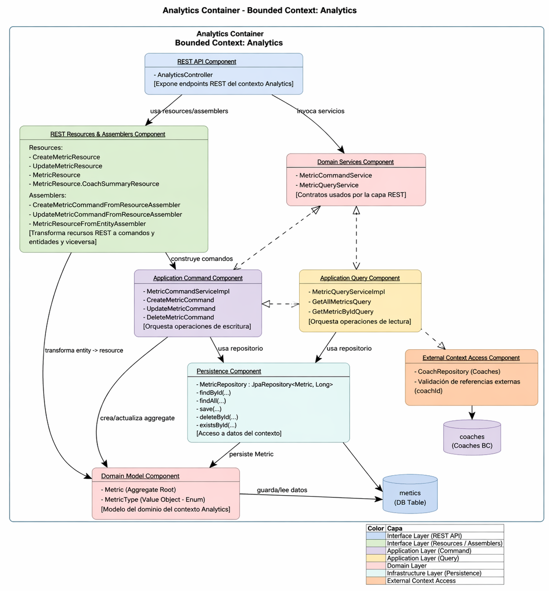

**Relaciones entre componentes**

- **Analytics REST API Component** → **Metric Transformation Component**  
  Transforma los datos de entrada y salida entre resources, commands y entidades.

- **Analytics REST API Component** → **Metric Command Processing Component**  
  Delega operaciones de creación, actualización y eliminación.

- **Analytics REST API Component** → **Metric Query Processing Component**  
  Delega operaciones de lectura.

- **Metric Command Processing Component** → **External Context Access Component**  
  Valida la existencia del coach antes de crear una métrica.

- **Metric Command Processing Component** → **Metric Domain Component**  
  Construye o actualiza la entidad **Metric**.

- **Metric Command Processing Component** → **Metric Persistence Component**  
  Persiste los cambios del agregado.

- **Metric Query Processing Component** → **Metric Persistence Component**  
  Recupera métricas desde la base de datos.

- **Metric Persistence Component** → `metrics`  
  Almacena y consulta la información persistida.

- **External Context Access Component** → `coaches`  
  Accede al bounded context externo para validar relaciones de negocio.

---

#### 2.6.8.6. Bounded Context Software Architecture Code Level Diagrams

En esta sección se presentan los diagramas a nivel de código del bounded context **Analytics**, los cuales permiten comprender con mayor detalle cómo se implementan los componentes identificados previamente. Este nivel de análisis muestra la estructura interna del dominio y su persistencia, evidenciando las clases, interfaces, atributos, métodos y relaciones que conforman el contexto.

Se incluyen dos representaciones principales:

- El **Class Diagram del Domain Layer**, que describe la estructura del modelo de dominio.
- El **Database Design Diagram**, que representa la persistencia de datos en la base de datos relacional.

---

##### 2.6.8.6.1. Bounded Context Domain Layer Class Diagrams

**Descripción**

El diagrama de clases del Domain Layer del bounded context **Analytics** presenta el agregado principal **Metric**, junto con su relación hacia la entidad externa **Coach**, así como las interfaces de servicios y los objetos que representan comandos y consultas.

El diseño evidencia que **Metric** es el núcleo del dominio y que las operaciones del sistema se organizan alrededor de comandos de escritura y queries de lectura.

**Diagrama UML de clases (Domain Layer)**

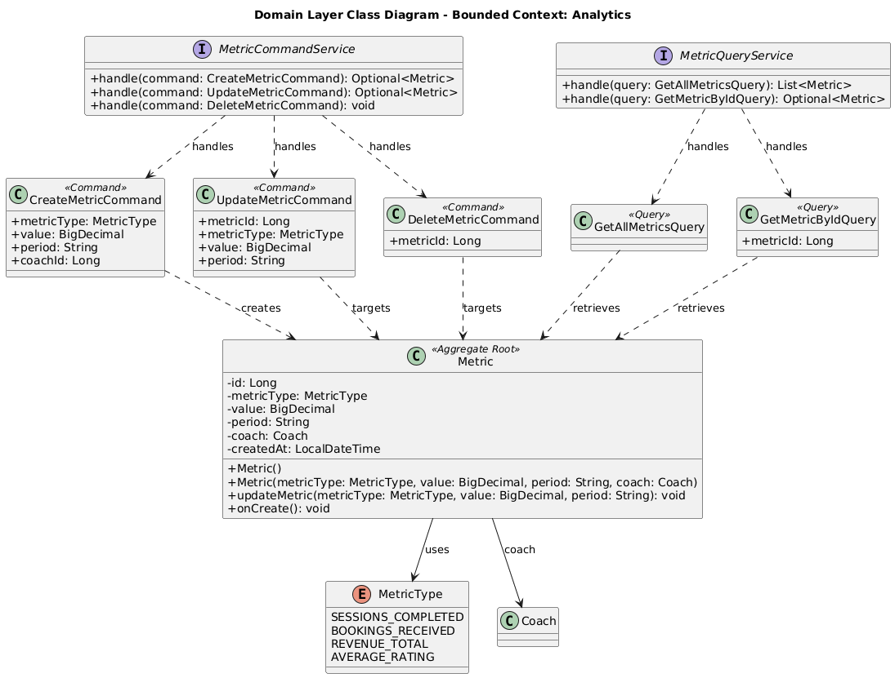

**Relaciones principales del modelo**

- **Metric** es el Aggregate Root del bounded context.
- **Metric** mantiene una relación Many-to-One con **Coach**.
- **MetricType** representa un Value Object del dominio mediante un enum.
- **MetricCommandService** define las operaciones de escritura.
- **MetricQueryService** define las operaciones de lectura.
- Los comandos encapsulan acciones de negocio.
- Las queries encapsulan solicitudes de consulta.

**Observaciones**

El modelo de dominio presenta una estructura clara y centrada en el agregado **Metric**. Sin embargo, no se identifican value objects adicionales para encapsular el período o el valor numérico, ni reglas más complejas relacionadas con validación de unicidad, cálculos automáticos o comparación entre períodos.

---

##### 2.6.8.6.2. Bounded Context Database Design Diagram

**Descripción**

El diagrama de base de datos del bounded context **Analytics** representa la estructura relacional utilizada para persistir la información de métricas. La tabla principal es **metrics**, la cual mantiene una relación con la tabla **coaches**.

**Diagrama de base de datos (ERD):**

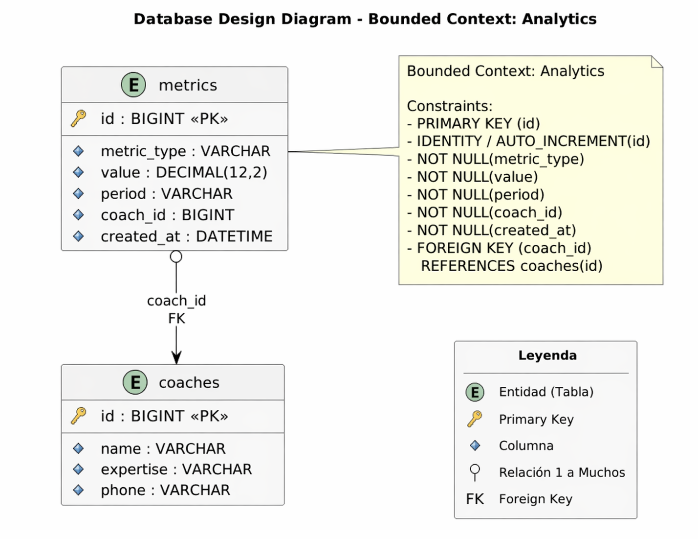

Tablas y atributos

Tabla `metrics`

- `id`: identificador único de la métrica (PK)
- `metric_type`: tipo de métrica almacenado como string
- `value`: valor numérico de la métrica
- `period`: período de la métrica
- `coach_id`: referencia al coach (FK)
- `created_at`: fecha de creación

Tabla `coaches`

- `id`
- `name`
- `expertise`
- `phone`

Constraints

- PRIMARY KEY (`id`) en `metrics`
- FOREIGN KEY (`coach_id`) → `coaches(id)`
- Restricciones NOT NULL en `metric_type`, `value`, `period`, `coach_id`, `created_at`

Relaciones entre tablas

- `coaches (1)` ──── `(*) metrics`

**Observaciones**

El diseño de persistencia es consistente con el modelo de dominio y permite almacenar correctamente las métricas. Sin embargo, actualmente no se implementan restricciones avanzadas como control de duplicidad por tipo, período y coach, ni índices personalizados o mecanismos automáticos de cálculo. Esto representa una oportunidad de mejora para fortalecer la lógica del negocio y la eficiencia del acceso a datos.

---

### 2.6.9. Bounded Context: Matches

El bounded context **Matches** representa la gestión de partidos dentro del sistema. Su propósito es permitir que un usuario funcional del negocio registre, gestione, y participe en partidos.

#### 2.6.9.1. Domain Layer

La capa de dominio del bounded context **Matches** contiene las clases que modelan el núcleo de los partidos organizados dentro de la plataforma, así como las reglas de negocio asociadas a su creación, gestión y participación.

**a. Entity / Aggregate Root:**

**Nombre de la clase:** `Match`

**Paquete:** `com.upc.courtly.matches.domain.model.aggregates`

**Propósito:**
Representa la entidad principal del bounded context Bookings. Modela una reserva de cancha realizada por un usuario en un intervalo de tiempo específico y constituye el agregado raíz del contexto.

**Atributos:**

- `matchId: Long` → Identificador único del partido
- `title: String` → Nombre o título del partido
- `description: String` → Descripción del encuentro
- `dateTime: DateTime` → Fecha y hora del partido
- `status: MatchStatus` → Estado del partido
- `maxPlayers:` int → Número máximo de jugadores
- `currentPlayers:` int → Número actual de jugadores
- `court: Court` → Cancha donde se realizará el partido
- `createdBy: UserProfile` → Usuario que creó el partido
- `createdAt: DateTime` → Fecha de creación

**Métodos:**

- `createMatch(title, description, dateTime, maxPlayers, court, createdBy)` → Crea un nuevo partido en estado OPEN.
- `updateMatch(title, description, dateTime, maxPlayers)` → Permite actualizar la información del partido.
- `cancelMatch()` → Cambia el estado del partido a CANCELLED.
- `completeMatch()` → Marca el partido como COMPLETED.

**Relaciones:**

- Un Match pertenece a una sola Court.
- Un Match pertenece a un solo UserProfile (creador).
- Un Court puede tener múltiples partidos asociados.
- Un usuario puede crear múltiples partidos.

**b. Referencias externas del dominio:**

Dentro del contexto Matches se utilizan entidades provenientes de otros bounded contexts:

**Court**
- Origen: `Court & Venue Management`
- Propósito: Representa la cancha donde se jugará el partido.
- Atributos relevantes:
  - `id`
  - `name`

**UserProfile**
- Origen: `Users`
- Propósito: Representa al usuario que crea el partido.
- Atributos relevantes:
  - `id`
  - `name`

**c. Value Objects:**

`MatchStatus`

Representa el estado del partido dentro del sistema.

- `OPEN` → Partido abierto para unirse
- `FULL` → Partido completo (sin cupos disponibles)
- `CANCELLED` → Partido cancelado
- `COMPLETED` → Partido finalizado

**d. Commands del dominio:**

`CreateMatchCommand`

**Paquete:** `com.upc.courtly.matches.domain.model.commands`

**Propósito:** Representa la intención de crear un nuevo partido.

**Atributos:**

- `title: String`
- `description: String`
- `dateTime: DateTime`
- `maxPlayers: int`
- `courtId: Long`
- `createdById: Long`

`UpdateMatchCommand`

**Paquete:** `com.upc.courtly.matches.domain.model.commands`

**Propósito:** Actualizar un partido existente.

**Atributos:**

- `matchId: Long`
- `title: String`
- `description: String`
- `dateTime: DateTime`
- `maxPlayers: int`

`DeleteMatchCommand`

**Paquete:** `com.upc.courtly.matches.domain.model.commands`

**Propósito:** Eliminar un partido.

**Atributos:**

- `matchId: Long`


**e. Queries del dominio:**

`GetAllMatchesQuery`

**Paquete:** `com.upc.courtly.matches.domain.model.queries`

**Propósito:** Obtener todos los partidos.

**Atributos:**

- `matchId: Long`

**f. Domain Services:**

`MatchCommandService`

**Paquete:** `com.upc.courtly.matches.domain.services`

**Propósito:** Define las operaciones de escritura sobre el agregado Match.

- `handle(CreateMatchCommand)`
- `handle(UpdateMatchCommand)`
- `handle(DeleteMatchCommand)`

`MatchQueryService`

**Propósito:** Define las operaciones de lectura.

- `handle(GetAllMatchesQuery)`
- `handle(GetMatchByIdQuery)`


**g. Repository:**

`MatchRepository`

**Paquete:** com.upc.courtly.matches.infrastructure.persistence.jpa.repositories

**Propósito:** Permite acceder a la persistencia de partidos.

- `save(Match)`
- `findById(Long)`
- `findAll()`
- `deleteById(Long)`


**h. Reglas de negocio identificadas:**

**Reglas implementadas actualmente:**
- Un partido debe estar asociado a una cancha válida
- Un partido debe tener un creador (UserProfile)
- Un partido tiene un estado inicial OPEN
- Se permite CRUD completo sobre partidos

**Reglas de negocio no implementadas (oportunidades de mejora):**
- Validar que currentPlayers <= maxPlayers.
- Cambiar automáticamente el estado a FULL cuando se alcanza el límite.
- Evitar crear partidos en fechas pasadas.
- Validar conflictos de horario en la misma cancha.
- Implementar una tabla de participantes.
- Gestionar la inscripción de jugadores al partido.

---

#### 2.6.9.2. Interface Layer

La Interface Layer del bounded context `Matches` contiene las clases responsables de exponer las funcionalidades relacionadas a los partidos organizados mediante endpoints REST, así como de transformar la información entre el dominio y los recursos consumidos por el frontend móvil.

Esta capa actúa como punto de entrada al sistema, permitiendo que los usuarios creen, consulten, actualicen y eliminen partidos, además de visualizar información relevante como la cancha y los cupos disponibles.

**a. MatchesController:**

**Paquete:** `com.upc.courtly.matches.interfaces.rest`

**Propósito:** Exponer los endpoints HTTP para la gestión de partidos. Funciona como punto de entrada para el frontend (por ejemplo, el feed de partidos abiertos o el formulario de creación).

**Dependencias:**
- `MatchCommandService`
- `MatchQueryService`

**Endpoints expuestos:**
- `POST /api/v1/matches` → crear partido
- `GET /api/v1/matches` → listar partidos
- `GET /api/v1/matches/{id}` → obtener partido por id
- `PUT /api/v1/matches/{id}` → actualizar partido
- `DELETE /api/v1/matches/{id}` → eliminar partido

**b. Resources / DTOs:**

`MatchResource`

**Paquete:** `com.upc.courtly.matches.interfaces.rest.resources`

**Propósito:** Representar la información de un partido que será enviada al frontend.

**Atributos:**

- `matchId`  
- `title` 
- `description`
- `dateTime`  
- `status`  
- `maxPlayers`  
- `currentPlayers`  
- `court: CourtSummaryResource`  
- `createdBy: UserSummaryResource`  

**Estructuras internas resumidas:**

- `CourtSummaryResource(Long id, String name)`
- `UserSummaryResource(Long id, String name)`

`CreateMatchResource`

**Propósito:** Representar los datos necesarios para crear un nuevo partido.

**Atributos:**

- `title`
- `description`
- `dateTime`
- `maxPlayers`
- `courtId`
- `createdById`

`UpdateMatchResource`

**Propósito:** Representar los datos necesarios para actualizar un partido existente.

**Atributos:**

- `title`
- `description`
- `dateTime`
- `maxPlayers`

**c. Assemblers:**

`MatchResourceFromEntityAssembler`

**Paquete:** `com.upc.courtly.matches.interfaces.rest.transform`

**Propósito:** Transformar una entidad `Match` del dominio en un `MatchResource` listo para el frontend. Además, resume las relaciones con `Court` y `UserProfile`, mostrando únicamente id y name.

`CreateMatchCommandFromResourceAssembler`

**Propósito:** Convertir un `CreateMatchResource` en un `CreateMatchCommand`.

`UpdateMatchCommandFromResourceAssembler`

Propósito: Transformar un `UpdateMatchResource`, junto con el `matchId`, en un `UpdateMatchCommand`.

---

#### 2.6.9.3. Application Layer

La Application Layer del bounded context `Matches` coordina los flujos de proceso relacionados a la gestión de partidos organizados. En esta capa se orquestan los comandos y consultas del sistema, conectando la Interface Layer con el Domain Layer y la infraestructura de persistencia.

**Capacidades principales del contexto:**
- Crear un partido
- Actualizar un partido
- Eliminar un partido
- Obtener un partido por id
- Listar partidos disponibles

**a. Command Handlers / Command Services:**

`MatchCommandServiceImpl`

**Paquete:** `com.upc.courtly.matches.application.internal.commandservices`

**Propósito:** Implementar el contrato MatchCommandService y ejecutar los casos de uso de escritura del contexto Matches.

**Dependencias:**
- `MatchRepository`
- `CourtRepository`
- `UserProfileRepository`

**Operaciones que maneja:**

`handle(CreateMatchCommand command)`
- Valida que la cancha (`courtId`) exista.
- Valida que el usuario creador (`createdById`) exista.
- Crea una nueva entidad `Match`.
- Inicializa `currentPlayers` en 1 (creador).
- Establece el estado inicial como `OPEN`.
- Persiste el partido en base de datos.
- Retorna el partido creado.

`handle(UpdateMatchCommand command)`
- Busca el partido por matchId.
- Actualiza `title`, `description`, `dateTime` y `maxPlayers`.
- Guarda los cambios en el repositorio.
- Retorna el partido actualizado.

`handle(DeleteMatchCommand command)`
- Verifica si el partido existe.
- Elimina el partido por `matchId`.
- Lanza excepción si no existe.


**b. Query Handlers / Query Services:**

`MatchQueryServiceImpl`

**Paquete:** `com.upc.courtly.matches.application.internal.queryservices`

**Propósito:** Implementar el contrato `MatchQueryService` y ejecutar los casos de uso de lectura del contexto `Matches`.

**Dependencia:**
- `MatchRepository`

**Operaciones que maneja:**

`handle(GetAllMatchesQuery query)`
- Recupera todos los partidos mediante `findAll()`
- Puede filtrar por estado (`OPEN`, `FULL`, etc.)
- Devuelve una lista de `Match`

`handle(GetMatchByIdQuery query)`
- Busca un partido específico por `matchId`
- Devuelve un `Optional<Match>`

**c. Flujos principales del negocio:**

**Flujo de creación de partido:**
- El frontend envía un `CreateMatchResource`.
- La capa de interfaz lo transforma en `CreateMatchCommand`.
- `MatchCommandServiceImpl` valida la cancha y el usuario.
- Se crea una instancia de `Match`.
- Se inicializa el estado en `OPEN`.
- El partido se persiste mediante `MatchRepository`.
- El resultado se transforma en `MatchResource`.
- Se retorna al cliente.

**Flujo de actualización:**
- El frontend envía un `UpdateMatchResource`.
- Se transforma en `UpdateMatchCommand`.
- `MatchCommandServiceImpl` recupera el partido.
- Se actualizan los datos del partido.
- Se guarda la modificación.
- Se retorna el partido actualizado.

**Flujo de consulta:**
- El frontend solicita uno o varios partidos.
- El controlador construye `GetAllMatchesQuery` o `GetMatchByIdQuery`.
- `MatchQueryServiceImpl` consulta el repositorio.
- Los resultados se transforman en `MatchResource`.
- Se retorna la respuesta al cliente.

**Flujo de eliminación:**
- El frontend solicita eliminar un partido.
- Se construye `DeleteMatchCommand`.
- `MatchCommandServiceImpl` verifica la existencia.
- Se elimina el partido del repositorio.
- Se devuelve la confirmación.

---

#### 2.6.9.4. Infrastructure Layer

La Infrastructure Layer del bounded context `Matches` contiene los componentes encargados del acceso a base de datos y de la persistencia de los partidos organizados. En esta capa se materializa el almacenamiento del agregado `Match` y se soportan las operaciones que ejecuta la aplicación.

**a. Repositorio de persistencia:**

`MatchRepository`

**Paquete:** `com.upc.courtly.matches.infrastructure.persistence.jpa.repositories`

**Propósito:** Gestionar la persistencia y recuperación de partidos utilizando Spring Data JPA. La implementación concreta es generada automáticamente por el framework al extender JpaRepository<Match, Long>.

**Operaciones disponibles:**
- `save`
- `findById`
- `findAll`
- `deleteById`
- `existsById`

**Observación:**

Actualmente no se identifican métodos personalizados como:

- Búsqueda por estado (`findByStatus`)
- Filtros por fecha (`findByDateTime`)
- Búsqueda por cancha (`findByCourtId`)

Esto limita la eficiencia del feed de partidos y las consultas específicas del frontend.


**b. Persistencia de la entidad Match:**

La entidad `Match` está mapeada como una entidad JPA con las siguientes características:

- `@Entity`
- `@Table(name = "matches")`
- `@Id`
- `@GeneratedValue(strategy = GenerationType.IDENTITY)`
- Relaciones `@ManyToOne(fetch = FetchType.LAZY)` con `Court` y `UserProfile`
- Atributo `createdAt` inicializado automáticamente


**c. Diseño de persistencia:**

**Tabla principal:** `matches`

**Columnas:**
- `match_id`
- `title`
- `description`
- `date_time`
- `status`
- `max_players`
- `current_players`
- `court_id`
- `created_by`
- `created_at`

**Restricciones y relaciones:**
- `match_id` → Primary Key
- `court_id` → Foreign Key hacia `courts.id`
- `created_by` → Foreign Key hacia `user_profiles.id`

**Campos obligatorios (NOT NULL):**

- `title`
- `date_time`
- `status`
- `max_players`
- `court_id`
- `created_by`
- `created_at`


**d. Integración con otros bounded contexts**

La infraestructura del bounded context `Matches` depende de:
- `CourtRepository` del bounded context `Courts`, para validar la existencia de la cancha.
- `UserProfileRepository` del bounded context `Users`, para validar el creador del partido.

---

#### 2.6.9.5. Bounded Context Software Architecture Component Level Diagrams

**Descripción:**

El Component Diagram del bounded context `Matches` representa la descomposición del contenedor backend encargado de gestionar los partidos organizados. Este container está compuesto por componentes para cubrir todo el flujo.

**Componentes principales:**

- **Matches REST API Component:** Expone los endpoints HTTP del bounded context mediante `MatchesController`.

**Responsabilidades:**

- Recibir solicitudes del frontend.
- Delegar comandos y consultas.
- Devolver respuestas estructuradas.

- **Match Transformation Component:** Encargado de transformar los datos entre capas.

**Incluye:**

- `MatchResourceFromEntityAssembler`
- `CreateMatchCommandFromResourceAssembler`
- `UpdateMatchCommandFromResourceAssembler`
- `MatchResource`, `CreateMatchResource`, `UpdateMatchResource`

- **Match Command Processing Component:** Implementado por `MatchCommandServiceImpl`.

**Responsabilidades:**

- Crear partidos.
- Actualizar partidos.
- Eliminar partidos.
- Validar existencia de `Court` y `UserProfile`.

- **Match Query Processing Component:** Implementado por `MatchQueryServiceImpl`.

**Responsabilidades:**

- Obtener todos los partidos.
- Obtener partido por `matchId`.
- Soportar consultas del frontend (feed de partidos).

- **Match Domain Component:** Representa el núcleo del dominio.

**Incluye:**

- `Match` (Aggregate Root)
- `MatchStatus`
- Métodos del dominio (creación y actualización del partido)

- **Match Persistence Component:** Encapsula el acceso a base de datos mediante `MatchRepository`.

**Responsabilidades:**

- Persistir partidos
- Recuperar información
- Interactuar con Spring Data JPA / Hibernate

- **External Context Access Component:** Representa la interacción con otros bounded contexts.

**Incluye:**

- `UserProfileRepository` (`Users`)
- `CourtRepository` (`Courts`)

**Responsabilidades:**

- Validar referencias externas necesarias para crear un partido


**Diagrama de Componentes:**


**Relaciones entre componentes:**

- **Matches REST API Component → Match Transformation Component:** Transforma datos entre resources, commands y entidades.
- **Matches REST API Component → Match Command Processing Component:** Ejecuta operaciones de creación, actualización y eliminación.
- **Matches REST API Component → Match Query Processing Component:** Ejecuta operaciones de CRUD.
- **Match Command Processing Component → External Context Access Component:** Valida la existencia de la cancha y del usuario.
- **Match Command Processing Component → Match Domain Component:** Construye o modifica el agregado `Match`.
- **Match Command Processing Component → Match Persistence Component:** Persiste los cambios.
- **Match Query Processing Component → Match Persistence Component:** Recupera datos desde la base de datos.
- **Match Persistence Component → matches:** Gestiona la persistencia en la tabla.
- **External Context Access Component → user_profiles / courts:** Consulta otros bounded contexts para validar relaciones.

---

#### 2.6.9.6. Bounded Context Software Architecture Code Level Diagrams

En esta sección se presentan los diagramas a nivel de código del bounded context Matches, permitiendo entender cómo está construido internamente el dominio y cómo se estructura la persistencia.

##### 2.6.9.6.1. Bounded Context Domain Layer Class Diagrams

El diagrama de clases del Domain Layer del bounded context `Matches` muestra al agregado principal `Match`, que representa un partido organizado dentro del sistema.
Este agregado se relaciona con entidades externas como `Court` y `UserProfile`, y encapsula la información clave del partido como cupos, estado y programación.

Además, se incluyen:

- `MatchStatus` como Value Object (enum).
- Comandos y queries para operaciones del sistema.
- Servicios del dominio para manejar la lógica.

**Diagrama UML de Clases (Domain Layer):**


**Relaciones:**

- `Match` es el Aggregate Root del bounded context.
- `Match` *──────── 1 Court ─► cada partido se organiza en una cancha específica.
- `Match` *──────── 1 UserProfile ─► representa al usuario creador del partido.
- `MatchStatus` representa un Value Object del dominio mediante un enum, encargado de definir el estado del partido (OPEN, FULL, CANCELLED, COMPLETED).
- `MatchCommandService` ───────► `MatchRepository` (uses)
- `MatchQueryService` ───────► `MatchRepository` (uses)

---

##### 2.6.9.6.2. Bounded Context Database Design Diagram

El diagrama de base de datos del bounded context `Matches` representa la estructura relacional utilizada para persistir la información de los partidos organizados.
La tabla principal es `matches`, la cual mantiene relaciones con las tablas `courts` y `user_profiles`, que representan la cancha donde se juega el partido y el usuario creador respectivamente.

**Diagrama de base de datos (ERD):**


**Tablas y atributos:**

**Tabla matches:**
- `match_id`: Identificador único del partido (PK).
- `title`: Título del partido.
- `description`: Descripción del partido.
- `date_time`: Fecha y hora del partido.
- `status`: Estado del partido (OPEN, FULL, CANCELLED, COMPLETED).
- `max_players`: Número máximo de jugadores permitidos.
- `current_players`: Número actual de jugadores inscritos.
- `court_id`: Referencia a la cancha (FK).
- `created_by`: Referencia al usuario creador (FK).
- `created_at`: Fecha de creación.

**Tabla user_profiles:**
- `id`: Identificador del usuario (PK).
- `name`: Nombre del usuario.
- `email`: Correo electrónico.

**Tabla courts:**
- `id:` Identificador de la cancha (PK).
- `name:` Nombre de la cancha.
- `location:` Ubicación de la cancha.

**Constraints:**
- PRIMARY KEY (`match_id`) en `matches`
- FOREIGN KEY (`court_id`) → `courts`(`id`)
- FOREIGN KEY (`created_by`) → `user_profiles`(`id`)
- NOT NULL en `title`, `date_time`, `status`, `max_players`, `court_id`, `created_by`, `created_at`

**Relaciones entre tablas:**
- `user_profiles` (1) ──── (*) `matches`
- `courts` (1) ──── (*) `matches`

---


### 2.6.10. Bounded Context: Notifications

El bounded context **Notifications** representa la capacidad del sistema encargada de gestionar notificaciones persistidas asociadas a un perfil de usuario del bounded context **Users**. Su propósito es permitir la creación, consulta, actualización y eliminación de notificaciones que contienen información como título, mensaje, tipo, estado de lectura y fecha de creación.

Dentro de este contexto, la entidad principal es `Notification`, ya que concentra la información central del mensaje notificado y mantiene la referencia al destinatario funcional mediante `UserProfile`. En consecuencia, este bounded context actúa como un contexto operativo transversal, porque depende del contexto **Users** para identificar a quién pertenece cada notificación.

Este contexto se relaciona conceptualmente con **Users** de forma directa, ya que la entidad `Notification` posee una asociación JPA hacia `users.UserProfile`. A diferencia de IAM, aquí sí existe una relación persistente entre el contexto y la identidad funcional del negocio. Sin embargo, Notifications no administra autenticación ni seguridad; su responsabilidad se limita a la persistencia y exposición de notificaciones por REST.

---

#### 2.6.10.1. Domain Layer

La Domain Layer del bounded context **Notifications** contiene las clases que modelan el núcleo funcional de la administración de notificaciones, así como los comandos, consultas y servicios de dominio que estructuran sus casos de uso principales. A partir del análisis del código, se identifica que el agregado principal del contexto es `Notification`, acompañado por sus comandos, queries y contratos de servicios.

##### a) Entity / Aggregate Root: `Notification`

**Nombre de la clase:** `Notification`  
**Paquete:** `com.upc.matchpoint.notifications.domain.model.aggregates`

**Propósito:**  
Representa la notificación persistida del sistema. Modela el mensaje enviado o almacenado para un `UserProfile` y constituye el agregado principal del contexto.

**Atributos:**
- `id: Long` → identificador único de la notificación.
- `title: String` → título o asunto de la notificación.
- `message: String` → contenido principal del mensaje.
- `type: String` → tipo o categoría de la notificación.
- `isRead: boolean` → indica si la notificación fue leída.
- `user: UserProfile` → perfil de usuario al que pertenece la notificación.
- `createdAt: LocalDateTime` → fecha y hora de creación.

**Métodos identificados:**
- `Notification()` → constructor vacío.
- `Notification(String title, String message, String type, boolean isRead, UserProfile user)` → constructor con datos principales.
- `updateNotification(String title, String message, String type, boolean isRead)` → actualiza los campos editables.
- `onCreate()` → inicializa `createdAt` antes de persistir.

**Relaciones:**
- Una `Notification` pertenece a un único `UserProfile`.
- Un `UserProfile` puede tener muchas `Notification`.
- La relación entre `Notification` y `UserProfile` es de tipo **Many-to-One**.

##### b) Value Objects / Enumerations

En el código revisado no se identifican enums ni value objects propios del bounded context `Notifications`. El atributo `type` se modela como `String`, por lo que la categorización de la notificación queda abierta a la validación externa o a reglas futuras.

##### c) Commands del dominio

Los comandos del contexto Notifications encapsulan la intención de crear, actualizar y eliminar notificaciones.

###### `CreateNotificationCommand`
**Paquete:** `com.upc.matchpoint.notifications.domain.model.commands`

**Propósito:**  
Representa la intención de crear una nueva notificación.

**Atributos:**
- `title: String`
- `message: String`
- `type: String`
- `isRead: boolean`
- `userId: Long`

###### `UpdateNotificationCommand`
**Paquete:** `com.upc.matchpoint.notifications.domain.model.commands`

**Propósito:**  
Representa la intención de modificar una notificación existente.

**Atributos:**
- `notificationId: Long`
- `title: String`
- `message: String`
- `type: String`
- `isRead: boolean`

###### `DeleteNotificationCommand`
**Paquete:** `com.upc.matchpoint.notifications.domain.model.commands`

**Propósito:**  
Representa la intención de eliminar una notificación existente.

**Atributos:**
- `notificationId: Long`

##### d) Queries del dominio

El contexto Notifications define consultas para recuperar notificaciones persistidas.

###### `GetAllNotificationsQuery`
**Propósito:**  
Representa la intención de obtener todas las notificaciones del sistema.

###### `GetNotificationByIdQuery`
**Propósito:**  
Representa la intención de obtener una notificación específica por identificador.

**Atributos:**
- `notificationId: Long`

##### e) Domain Services

El dominio define servicios que abstraen los casos de uso principales del contexto Notifications.

###### `NotificationCommandService`
**Propósito:**  
Define el contrato para ejecutar operaciones de creación, actualización y eliminación.

**Métodos identificados:**
- `handle(CreateNotificationCommand command)`
- `handle(UpdateNotificationCommand command)`
- `handle(DeleteNotificationCommand command)`

###### `NotificationQueryService`
**Propósito:**  
Define el contrato para recuperar información de notificaciones.

**Métodos identificados:**
- `handle(GetAllNotificationsQuery query)`
- `handle(GetNotificationByIdQuery query)`

##### f) Repository

###### `NotificationRepository`
**Paquete:** `com.upc.matchpoint.notifications.infrastructure.persistence.jpa.repositories`

**Propósito dentro del dominio:**  
Abstraer la persistencia y recuperación de notificaciones.

**Operaciones identificadas:**
- `save(Notification)`
- `findById(Long)`
- `findAll()`
- `deleteById(Long)`
- `existsById(Long)`

##### g) Reglas de negocio identificadas

**Reglas implementadas actualmente:**
- Cada notificación queda asociada a un `UserProfile` existente.
- La creación registra automáticamente la fecha `createdAt`.
- La consulta permite listar notificaciones y obtenerlas por id.
- La actualización permite modificar título, mensaje, tipo y estado de lectura.
- La eliminación borra una notificación si existe.

**Reglas no implementadas o incompletas:**
- No existe validación del contenido semántico del atributo `type`.
- No existe filtrado por usuario en la consulta de lectura.
- No existe envío asíncrono o integración con canales externos de notificación.
- No existe expiración, prioridad ni plantilla de notificación.

En conjunto, la Domain Layer de Notifications es simple y funcional, pero está orientada a persistir y administrar notificaciones más que a orquestar un sistema de mensajería completo.

---

#### 2.6.10.2. Interface Layer

La Interface Layer del bounded context **Notifications** contiene las clases responsables de exponer las funcionalidades del contexto mediante endpoints REST y de transformar la información entre las estructuras internas del sistema y los recursos consumidos por el frontend.

##### a) `NotificationsController`

**Paquete:** `com.upc.matchpoint.notifications.interfaces.rest`

**Propósito:**  
Exponer los endpoints HTTP relacionados con la administración de notificaciones.

**Endpoints expuestos:**
- `POST /api/v1/notifications` → crear notificación.
- `GET /api/v1/notifications` → obtener todas las notificaciones.
- `GET /api/v1/notifications/{id}` → obtener notificación por id.
- `PUT /api/v1/notifications/{id}` → actualizar notificación.
- `DELETE /api/v1/notifications/{id}` → eliminar notificación.

##### b) Resources / DTOs

###### `CreateNotificationResource`
**Propósito:**  
Representar los datos de entrada requeridos para crear una notificación.

**Atributos:**
- `title`
- `message`
- `type`
- `isRead`
- `userId`

###### `UpdateNotificationResource`
**Propósito:**  
Representar los datos de entrada requeridos para actualizar una notificación.

**Atributos:**
- `title`
- `message`
- `type`
- `isRead`

###### `NotificationResource`
**Propósito:**  
Representar la información de una notificación hacia el frontend.

**Atributos:**
- `id`
- `title`
- `message`
- `type`
- `isRead`
- `createdAt`
- `user` → resumen con `id` y `name`.

##### c) Assemblers

La capa de interfaz del contexto Notifications incluye assemblers encargados de transformar datos entre resources, commands y entidades.

**Assemblers identificados:**
- `CreateNotificationCommandFromResourceAssembler`
- `UpdateNotificationCommandFromResourceAssembler`
- `NotificationResourceFromEntityAssembler`

##### d) Responsabilidad de la capa de interfaz

La responsabilidad principal de esta capa es:
- recibir solicitudes del cliente,
- convertir resources de entrada en commands,
- delegar la ejecución a la capa de aplicación,
- y transformar los resultados en resources de salida adecuados para el frontend.

En el caso de Notifications, esta capa también refleja explícitamente la dependencia con `UserProfile`, ya que la respuesta expone un resumen del usuario asociado a la notificación.

---

#### 2.6.10.3. Application Layer

La Application Layer del bounded context **Notifications** coordina los flujos de proceso relacionados con la creación, consulta, actualización y eliminación de notificaciones. En esta capa se orquestan los comandos y consultas del sistema, conectando la Interface Layer con el Domain Layer y con la infraestructura de persistencia.

Las capacidades principales del contexto son:
- crear notificación,
- listar notificaciones,
- obtener notificación por id,
- actualizar notificación,
- eliminar notificación.

##### a) Command Handlers / Command Services

###### `NotificationCommandServiceImpl`

**Paquete:** `com.upc.matchpoint.notifications.application.internal.commandservices`

**Propósito:**  
Implementar los casos de uso de creación, actualización y eliminación de notificaciones.

**Dependencias:**
- `NotificationRepository`
- `UserProfileRepository`

**Operaciones que maneja:**

**`handle(CreateNotificationCommand command)`**
- busca el `UserProfile` por `userId`,
- crea una nueva entidad `Notification`,
- persiste la notificación,
- retorna la notificación creada.

**`handle(UpdateNotificationCommand command)`**
- busca la notificación por `notificationId`,
- actualiza los campos editables,
- guarda la entidad actualizada,
- retorna la notificación modificada.

**`handle(DeleteNotificationCommand command)`**
- verifica que la notificación exista,
- elimina la notificación persistida.

##### b) Query Handlers / Query Services

###### `NotificationQueryServiceImpl`

**Paquete:** `com.upc.matchpoint.notifications.application.internal.queryservices`

**Propósito:**  
Implementar los casos de uso de lectura sobre notificaciones.

**Dependencias:**
- `NotificationRepository`

**Operaciones que maneja:**
- `handle(GetAllNotificationsQuery query)`
- `handle(GetNotificationByIdQuery query)`

##### c) Event Handlers

En el bounded context **Notifications** no se identifican event handlers en el código revisado. Esto sugiere que el contexto opera de forma síncrona y centrada en REST, sin automatización basada en eventos de dominio o eventos de aplicación.

##### d) Flujos principales del negocio

###### Flujo de creación de notificación
1. El frontend envía un `CreateNotificationResource`.
2. La capa de interfaz lo transforma a `CreateNotificationCommand`.
3. `NotificationCommandServiceImpl` busca el `UserProfile` asociado.
4. Se crea una instancia de `Notification`.
5. La notificación se persiste mediante `NotificationRepository`.
6. Se transforma el resultado en `NotificationResource`.
7. Se retorna la respuesta al cliente.

###### Flujo de consulta de notificaciones
1. El cliente solicita la lista o detalle de notificaciones.
2. El controlador construye la query correspondiente.
3. `NotificationQueryServiceImpl` recupera la información desde `NotificationRepository`.
4. Los resultados se transforman a resources.
5. Se retorna la respuesta.

###### Flujo de actualización de notificación
1. El frontend envía un `UpdateNotificationResource`.
2. La capa de interfaz lo transforma a `UpdateNotificationCommand`.
3. `NotificationCommandServiceImpl` busca la notificación por id.
4. Actualiza los campos editables.
5. Persiste el cambio.
6. Retorna la notificación actualizada.

###### Flujo de eliminación de notificación
1. El cliente solicita la eliminación de una notificación.
2. El controlador construye el comando de eliminación.
3. `NotificationCommandServiceImpl` valida la existencia.
4. La notificación se elimina de la base de datos.
5. Se retorna una respuesta de confirmación.

##### e) Observaciones de la capa de aplicación

La capa de aplicación implementa de forma coherente los flujos principales de Notifications: creación, consulta, actualización y eliminación. Además, coordina la validación del destinatario y la persistencia de cada notificación, lo que mantiene el comportamiento del contexto simple y enfocado en la administración del mensaje y su estado.

---

#### 2.6.10.4. Infrastructure Layer

La Infrastructure Layer del bounded context **Notifications** contiene los componentes encargados del acceso a base de datos y de la integración técnica con el bounded context **Users** para recuperar perfiles de usuario. En esta capa se materializa el soporte técnico para persistir y leer notificaciones.

##### a) Repositorios de persistencia

###### `NotificationRepository`

**Paquete:** `com.upc.matchpoint.notifications.infrastructure.persistence.jpa.repositories`

**Propósito:**  
Gestionar la persistencia y recuperación de notificaciones utilizando Spring Data JPA.

**Operaciones disponibles:**
- `save`
- `findById`
- `findAll`
- `deleteById`
- `existsById`

##### b) Persistencia de la entidad `Notification`

La entidad `Notification` está mapeada como una entidad JPA con las siguientes características:
- `@Entity`
- `@Table(name = "notifications")`
- `@ManyToOne(fetch = FetchType.LAZY)` con `UserProfile`
- `@JoinColumn(name = "user_id", nullable = false)`
- `@PrePersist` para inicializar la fecha de creación

##### c) Integración con otros bounded contexts

Notifications depende estructuralmente del bounded context **Users** para resolver el perfil funcional asociado a cada notificación. La dependencia se materializa mediante `UserProfileRepository`, lo que permite validar la existencia del usuario receptor antes de persistir la notificación.

**Observación importante:**  
Aunque existe integración directa con `UserProfile`, no se identificó una fachada ACL específica para Notifications. La relación con Users se implementa mediante acceso directo al repositorio del otro bounded context.

##### d) Limitaciones de la capa de infraestructura

La infraestructura actual cumple con la persistencia básica de notificaciones, pero todavía presenta limitaciones relevantes:
- no existe integración con servicios externos de correo, SMS o push;
- no existe una cola de mensajes ni un broker de eventos;
- no existe separación entre notificación persistida y notificación entregada;
- no se modela prioridad, expiración ni plantillas.

En consecuencia, la Infrastructure Layer del bounded context Notifications es funcional para persistencia y consulta, pero todavía no implementa una verdadera infraestructura de mensajería distribuida.

---

#### 2.6.10.5. Bounded Context Software Architecture Component Level Diagrams

**Descripción:**

El Component Diagram del bounded context **Notifications** representa la descomposición del contenedor backend encargado de gestionar notificaciones persistidas para perfiles de usuario. A nivel arquitectónico, este container está conformado por componentes con responsabilidades bien delimitadas: recepción de solicitudes REST, transformación de datos entre capas, ejecución de comandos y consultas, acceso a persistencia y resolución del perfil de usuario destinatario.

A partir del análisis del contexto, se identifican los siguientes componentes principales:

**Componentes principales:**

- **Notification REST API Component**  
  Expone los endpoints HTTP relacionados con crear, listar, consultar, actualizar y eliminar notificaciones.

- **Notification Transformation Component**  
  Agrupa los assemblers y resources que permiten transformar datos entre la capa de interfaz y la capa de aplicación.

- **Notification Command Processing Component**  
  Implementado por el servicio de comandos, coordina los casos de uso de creación, actualización y eliminación.

- **Notification Query Processing Component**  
  Implementado por el servicio de consultas, coordina la lectura de notificaciones.

- **Notification Domain Component**  
  Representa el núcleo del dominio mediante la entidad `Notification`, comandos, queries y contratos de servicio.

- **Notification Persistence Component**  
  Encapsula el acceso a persistencia mediante `NotificationRepository` usando Spring Data JPA.

- **Users Integration Component**  
  Representa la dependencia técnica hacia `UserProfileRepository` del bounded context Users para resolver el perfil destinatario.

**Diagrama de componentes propuesto:**

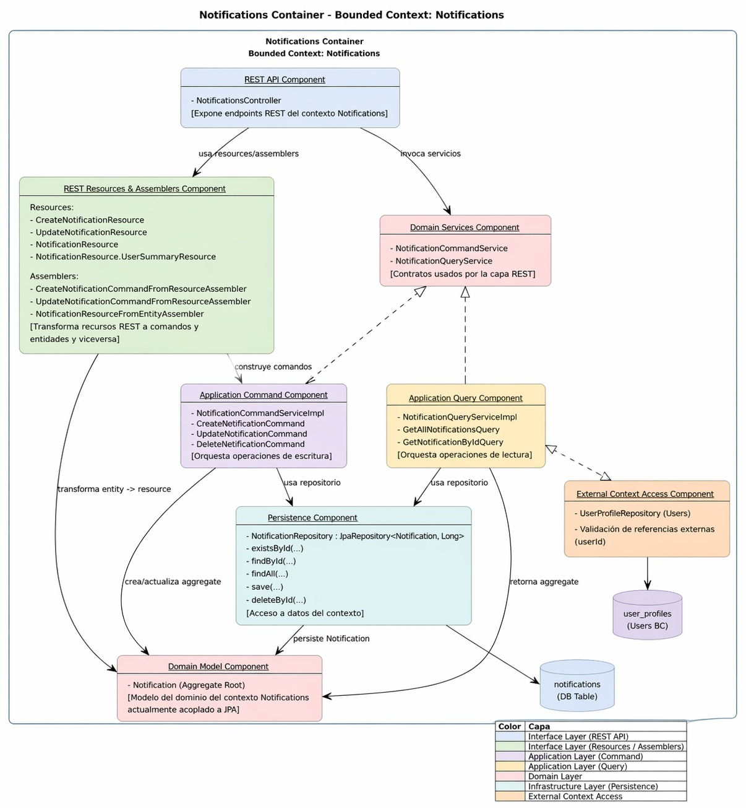

###### Relaciones entre componentes

- **Notification REST API Component → Notification Transformation Component**  
  Transforma datos de entrada y salida entre resources, commands y entidades.

- **Notification REST API Component → Notification Command Processing Component**  
  Delega operaciones de creación, actualización y eliminación.

- **Notification REST API Component → Notification Query Processing Component**  
  Delega operaciones de lectura sobre notificaciones.

- **Notification Command Processing Component → Notification Domain Component**  
  Construye y actualiza la entidad `Notification`.

- **Notification Command Processing Component → Notification Persistence Component**  
  Persiste notificaciones y consulta su existencia.

- **Notification Command Processing Component → Users Integration Component**  
  Valida y resuelve el `UserProfile` asociado a la notificación.

- **Notification Query Processing Component → Notification Persistence Component**  
  Recupera notificaciones desde base de datos.

- **Notification Transformation Component → Notification Domain Component**  
  Convierte entidades en resources de salida.

---

#### 2.6.10.6. Bounded Context Software Architecture Code Level Diagrams

En esta sección se presentan los diagramas a nivel de código del bounded context **Notifications**, los cuales permiten comprender con mayor detalle cómo se implementan los componentes identificados previamente. Este nivel de análisis muestra la estructura interna del dominio y su persistencia, evidenciando las clases, interfaces, atributos, métodos y relaciones que conforman el contexto.

Se incluyen dos representaciones principales:

- el **Class Diagram del Domain Layer**, que describe la estructura del modelo de dominio;
- y el **Database Design Diagram**, que representa la persistencia de datos en la base de datos relacional.

---

##### 2.6.10.6.1. Bounded Context Domain Layer Class Diagrams

**Descripción:**

El diagrama de clases del Domain Layer del bounded context **Notifications** presenta el agregado principal `Notification`, junto con los comandos, queries y servicios de dominio que soportan las operaciones del contexto. El diseño evidencia que `Notification` es el núcleo del contexto y que las operaciones del sistema se organizan alrededor de la administración de notificaciones persistidas.

**Diagrama UML de clases (Domain Layer):**

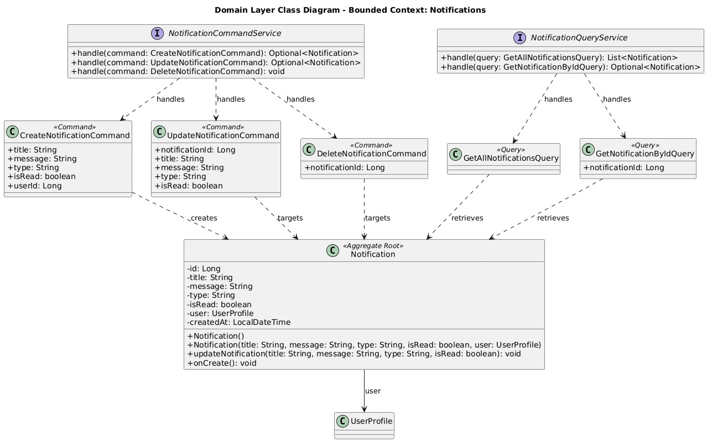

###### Relaciones principales del modelo

- `Notification` es el **Aggregate Root** del bounded context.
- `Notification` mantiene una relación **Many-to-One** con `UserProfile`.
- `NotificationCommandService` define las operaciones de creación, actualización y eliminación.
- `NotificationQueryService` define las operaciones de lectura de notificaciones.
- Los comandos encapsulan acciones de escritura sobre notificaciones.
- Las queries encapsulan solicitudes de consulta.

###### Observaciones

El modelo de dominio presenta una estructura clara y centrada en el agregado `Notification`. La presencia de los campos de estado, tipo, contenido y destinatario permite representar con precisión el ciclo de vida de una notificación dentro del contexto.

---

##### 2.6.10.6.2. Bounded Context Database Design Diagram

**Descripción:**

El diagrama de base de datos del bounded context **Notifications** representa la estructura relacional utilizada para persistir la información de notificaciones. La tabla principal es `notifications`, vinculada mediante una clave foránea con `user_profiles`.

**Diagrama de base de datos (ERD):**

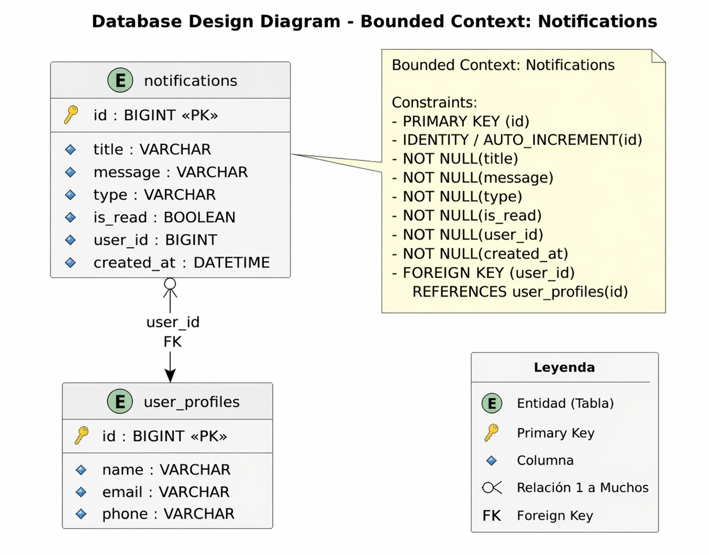

###### Tablas y atributos

###### Tabla `notifications`

- `id`: identificador único de la notificación (PK)
- `title`: título de la notificación
- `message`: contenido de la notificación
- `type`: tipo o categoría de la notificación
- `is_read`: estado de lectura
- `user_id`: referencia al perfil de usuario destinatario
- `created_at`: fecha de creación

###### Tabla `user_profiles`

- `id`: identificador único del perfil de usuario
- `name`: nombre del usuario
- `email`: correo electrónico
- `phone`: teléfono

###### Constraints

- `PRIMARY KEY (id)` en `notifications`
- `FOREIGN KEY (user_id)` → `user_profiles(id)`
- restricción de `NOT NULL` en `title`
- restricción de `NOT NULL` en `message`
- restricción de `NOT NULL` en `type`
- restricción de `NOT NULL` en `is_read`
- restricción de `NOT NULL` en `user_id`
- restricción de `NOT NULL` en `created_at`

###### Relaciones entre tablas

- `user_profiles (1) ──── (*) notifications`

###### Observaciones

El diseño de persistencia es consistente con el modelo de dominio y permite almacenar correctamente notificaciones con su respectivo estado, tipo, fecha de creación y destinatario. La tabla `notifications` resume bien el alcance del contexto y deja preparada la base para futuras extensiones como prioridad, expiración o canales de entrega.

---

### 2.6.11. Bounded Context: IAM

El bounded context **IAM** representa la capacidad del sistema encargada de gestionar la identidad autenticada y el control de acceso dentro de Courtly. Su propósito es permitir el registro de usuarios, la autenticación mediante credenciales y la asignación de roles para autorizar el acceso a las funcionalidades del sistema.

Dentro de este contexto, la entidad principal es `User`, ya que concentra la información esencial de la cuenta autenticable, incluyendo nombre de usuario, contraseña cifrada y roles asignados. En consecuencia, IAM constituye un contexto transversal del sistema, pues provee los mecanismos de seguridad necesarios para el acceso a los demás bounded contexts.

Este contexto se relaciona conceptualmente con **Users**, debido a que ambos representan identidades distintas del mismo actor. Sin embargo, mientras IAM administra la identidad autenticada del sistema, **Users** administra la identidad funcional utilizada por el negocio. En el diseño actual no existe una relación JPA directa entre `iam.User` y `users.UserProfile`, lo que genera una separación entre el proceso de autenticación y la operación de negocio. Como resultado, el login devuelve el identificador de `User`, pero los procesos operativos como reservas, partidos, pagos, reseñas y notificaciones esperan el identificador de `UserProfile`.

---

#### 2.6.11.1. Domain Layer

La Domain Layer del bounded context **IAM** contiene las clases que modelan el núcleo de la autenticación y autorización del sistema, así como las reglas de negocio asociadas a la gestión de usuarios autenticados y roles. A partir del análisis del código, se identifica que el agregado principal del contexto es `User`, acompañado por la entidad `Role`, comandos, consultas, un enum de roles y servicios de dominio que estructuran la lógica del acceso al sistema.

##### a) Entity / Aggregate Root: `User`

**Nombre de la clase:** `User`  
**Paquete:** `com.upc.matchpoint.iam.domain.model.aggregates`

**Propósito:**  
Representa la entidad principal del bounded context IAM. Modela la cuenta autenticable del sistema y constituye el agregado raíz del contexto.

**Atributos:**
- `id: Long` → identificador único del usuario autenticado.
- `username: String` → nombre único de usuario.
- `password: String` → contraseña almacenada en forma cifrada o hasheada.
- `roles: Set<Role>` → conjunto de roles asignados al usuario.

**Métodos identificados:**
- `User()` → constructor vacío.
- `User(String username, String password)` → constructor básico.
- `User(String username, String password, List<Role> roles)` → constructor con roles.
- `addRole(Role role)` → agrega un rol a la cuenta.
- `addRoles(List<Role> roles)` → agrega múltiples roles con validación.

**Relaciones:**
- Un `User` puede tener uno o varios `Role`.
- Un `Role` puede pertenecer a uno o varios `User`.
- La relación entre `User` y `Role` es de tipo **Many-to-Many**.

##### b) Entity: `Role`

**Nombre de la clase:** `Role`  
**Paquete:** `com.upc.matchpoint.iam.domain.model.entities`

**Propósito:**  
Representa los roles del sistema que determinan el nivel general de acceso de un usuario autenticado.

**Atributos:**
- `id: Long` → identificador único del rol.
- `name: Roles` → nombre lógico del rol.

**Métodos relevantes:**
- `getStringName()` → retorna el nombre del rol como texto.
- `getDefaultRole()` → retorna el rol por defecto del sistema.
- `toRoleFromName(String name)` → construye un rol a partir de un nombre.
- `validateRoleSet(List<Role> roles)` → valida el conjunto de roles y asigna un rol por defecto si corresponde.

##### c) Value Objects

###### `Roles`
**Paquete:** `com.upc.matchpoint.iam.domain.model.valueobjects`

**Propósito:**  
Representa el conjunto acotado de roles válidos del sistema mediante una enumeración.

**Valores definidos:**
- `ROLE_USER`
- `ROLE_ADMIN`
- `ROLE_INSTRUCTOR`

**Rol dentro del dominio:**  
Actúa como un value object del dominio, ya que encapsula un conjunto limitado y válido de roles permitidos para la autenticación y autorización.

##### d) Referencias externas del dominio

Dentro del bounded context IAM no se identifican referencias JPA directas hacia otros bounded contexts del negocio. Sin embargo, existe una relación conceptual importante con el bounded context **Users**, dado que ambos representan identidades del mismo actor.

###### `UserProfile`
**Bounded context de origen:** `Users`

**Relación conceptual con IAM:**  
Representa la identidad funcional utilizada por el negocio, distinta de la identidad autenticada de IAM.

**Observación importante:**  
Actualmente no existe una relación JPA ni una vinculación automática entre `User` y `UserProfile`. Esta separación provoca una fricción arquitectónica, ya que luego del proceso de autenticación el frontend obtiene un `userId`, mientras que los procesos operativos requieren un `userProfileId`.

##### e) Commands del dominio

Los comandos del contexto IAM encapsulan la intención de ejecutar operaciones relacionadas con autenticación y administración de cuentas.

###### `SignUpCommand`
**Paquete:** `com.upc.matchpoint.iam.domain.model.commands`

**Propósito:**  
Representa la intención de registrar una nueva cuenta autenticable en el sistema.

**Atributos:**
- `username: String`
- `password: String`
- `roles: List<Role>`

###### `SignInCommand`
**Paquete:** `com.upc.matchpoint.iam.domain.model.commands`

**Propósito:**  
Representa la intención de autenticar un usuario existente mediante credenciales.

**Atributos:**
- `username: String`
- `password: String`

###### `SeedRolesCommand`
**Paquete:** `com.upc.matchpoint.iam.domain.model.commands`

**Propósito:**  
Representa la intención de inicializar los roles base del sistema en la base de datos.

##### f) Queries del dominio

El contexto IAM también define consultas para recuperar información relacionada con usuarios y roles.

###### `GetAllUsersQuery`
**Propósito:**  
Representa la intención de obtener todos los usuarios autenticados del sistema.

###### `GetUserByIdQuery`
**Propósito:**  
Representa la intención de obtener un usuario autenticado por identificador.

**Atributos:**
- `userId: Long`

###### `GetUserByUsernameQuery`
**Propósito:**  
Representa la intención de obtener un usuario autenticado por nombre de usuario.

**Atributos:**
- `username: String`

###### `GetAllRolesQuery`
**Propósito:**  
Representa la intención de obtener todos los roles disponibles del sistema.

###### `GetRoleByNameQuery`
**Propósito:**  
Representa la intención de obtener un rol específico por su nombre lógico.

**Atributos:**
- `name: Roles`

##### g) Domain Services

El dominio define servicios que abstraen los casos de uso principales del contexto IAM.

###### `UserCommandService`
**Propósito:**  
Define el contrato para ejecutar operaciones de registro e inicio de sesión.

**Métodos identificados:**
- `handle(SignUpCommand command)`
- `handle(SignInCommand command)`

###### `UserQueryService`
**Propósito:**  
Define el contrato para recuperar información de usuarios autenticados.

**Métodos identificados:**
- `handle(GetAllUsersQuery query)`
- `handle(GetUserByIdQuery query)`
- `handle(GetUserByUsernameQuery query)`

###### `RoleCommandService`
**Propósito:**  
Define el contrato para ejecutar operaciones de inicialización de roles.

**Métodos identificados:**
- `handle(SeedRolesCommand command)`

###### `RoleQueryService`
**Propósito:**  
Define el contrato para recuperar información de roles del sistema.

**Métodos identificados:**
- `handle(GetAllRolesQuery query)`
- `handle(GetRoleByNameQuery query)`

##### h) Repository

###### `UserRepository`
**Paquete:** `com.upc.matchpoint.iam.infrastructure.persistence.jpa.repositories`

**Propósito dentro del dominio:**  
Abstraer la persistencia y recuperación de usuarios autenticados.

**Operaciones identificadas:**
- `save(User)`
- `findById(Long)`
- `findAll()`
- `findByUsername(String)`
- `existsByUsername(String)`

###### `RoleRepository`
**Paquete:** `com.upc.matchpoint.iam.infrastructure.persistence.jpa.repositories`

**Propósito dentro del dominio:**  
Abstraer la persistencia y recuperación de roles del sistema.

**Operaciones identificadas:**
- `save(Role)`
- `findByName(Roles)`
- `findAll()`
- `existsByName(Roles)`

##### i) Reglas de negocio identificadas

**Reglas implementadas actualmente:**
- El `username` debe ser único al momento del registro.
- La contraseña se almacena hasheada.
- Si no se especifican roles, se asigna `ROLE_USER` por defecto.
- El inicio de sesión genera un token JWT cuando las credenciales son válidas.
- El sistema puede listar usuarios existentes.
- El sistema puede listar los roles disponibles.
- La inicialización de roles crea los roles base solo si estos no existen previamente.

**Reglas no implementadas o incompletas:**
- No existe un enlace automático entre `User` y `UserProfile`.
- No existe sincronización nativa entre el registro de autenticación y la creación del perfil funcional.
- No se resuelve automáticamente el `userProfileId` a partir del login.
- No existe recuperación de contraseña.
- No existe cambio de contraseña.
- No existe bloqueo por intentos fallidos.
- No existe 2FA ni verificación de correo.

En conjunto, la Domain Layer de IAM está bien definida para autenticación y autorización, aunque presenta una limitación importante en su integración con la identidad funcional del negocio.

---

#### 2.6.11.2. Interface Layer

La Interface Layer del bounded context **IAM** contiene las clases responsables de exponer las funcionalidades del contexto mediante endpoints REST y de transformar la información entre las estructuras internas del sistema y los recursos consumidos por el frontend.

##### a) `AuthenticationController`

**Paquete:** `com.upc.matchpoint.iam.interfaces.rest`

**Propósito:**  
Exponer los endpoints HTTP relacionados con autenticación y registro de usuarios.

**Endpoints expuestos:**
- `POST /api/v1/authentication/sign-up` → registrar usuario.
- `POST /api/v1/authentication/sign-in` → iniciar sesión.

##### b) `UsersController`

**Paquete:** `com.upc.matchpoint.iam.interfaces.rest`

**Propósito:**  
Exponer endpoints HTTP para consultas administrativas sobre usuarios autenticados.

**Endpoints expuestos:**
- `GET /api/v1/users` → obtener todos los usuarios.
- `GET /api/v1/users/{id}` → obtener usuario por id.

##### c) `RolesController`

**Paquete:** `com.upc.matchpoint.iam.interfaces.rest`

**Propósito:**  
Exponer endpoints HTTP para consulta de roles del sistema.

**Endpoints expuestos:**
- `GET /api/v1/roles` → obtener todos los roles.

##### d) Resources / DTOs

###### `SignUpResource`
**Propósito:**  
Representar los datos de entrada requeridos para registrar una nueva cuenta.

**Atributos:**
- `username`
- `password`
- `roles`

###### `SignInResource`
**Propósito:**  
Representar las credenciales de entrada para autenticación.

**Atributos:**
- `username`
- `password`

###### `UserResource`
**Propósito:**  
Representar la información de usuarios autenticados para consultas administrativas.

**Atributos:**
- `id`
- `username`
- `roles`

###### `AuthenticatedUserResource`
**Propósito:**  
Representar la respuesta de autenticación enviada al frontend.

**Atributos:**
- `id`
- `username`
- `token`

###### `RoleResource`
**Propósito:**  
Representar los roles del sistema hacia el frontend.

**Atributos:**
- `id`
- `name`

##### e) Assemblers

La capa de interfaz del contexto IAM incluye assemblers encargados de transformar datos entre resources, commands y entidades.

**Assemblers identificados:**
- `SignUpCommandFromResourceAssembler`
- `SignInCommandFromResourceAssembler`
- `UserResourceFromEntityAssembler`
- `AuthenticatedUserResourceFromEntityAssembler`
- `RoleResourceFromEntityAssembler`

##### f) Responsabilidad de la capa de interfaz

La responsabilidad principal de esta capa es:
- recibir solicitudes del cliente,
- convertir resources de entrada en commands o queries,
- delegar la ejecución a la capa de aplicación,
- y transformar los resultados en resources de salida adecuados para el frontend.

En el caso de IAM, esta capa es especialmente importante porque constituye la puerta de entrada del sistema. Sin embargo, aunque resuelve correctamente la autenticación, no proporciona todavía un mecanismo nativo para traducir la identidad autenticada (`User`) hacia la identidad funcional (`UserProfile`) requerida por el resto del negocio.

---

#### 2.6.11.3. Application Layer

La Application Layer del bounded context **IAM** coordina los flujos de proceso relacionados con registro, autenticación y consulta de información de acceso. En esta capa se orquestan los comandos y consultas del sistema, conectando la Interface Layer con el Domain Layer y con la infraestructura de persistencia y seguridad.

Las capacidades principales del contexto son:
- registrar usuario,
- iniciar sesión,
- listar usuarios,
- obtener usuario por id,
- listar roles,
- inicializar roles del sistema al arranque.

##### a) Command Handlers / Command Services

###### `UserCommandServiceImpl`

**Paquete:** `com.upc.matchpoint.iam.application.internal.commandservices`

**Propósito:**  
Implementar los casos de uso de registro e inicio de sesión.

**Dependencias:**
- `UserRepository`
- `RoleRepository`
- `HashingService`
- `TokenService`

**Operaciones que maneja:**

**`handle(SignUpCommand command)`**
- valida que el `username` no exista,
- resuelve los roles o asigna `ROLE_USER` por defecto,
- hashea la contraseña,
- crea una nueva entidad `User`,
- persiste el usuario,
- retorna el usuario creado.

**`handle(SignInCommand command)`**
- busca el usuario por `username`,
- valida la contraseña contra el hash,
- genera un token JWT,
- retorna el usuario autenticado junto con el token.

###### `RoleCommandServiceImpl`

**Paquete:** `com.upc.matchpoint.iam.application.internal.commandservices`

**Propósito:**  
Implementar el caso de uso de inicialización de roles.

**Dependencias:**
- `RoleRepository`

**Operaciones que maneja:**

**`handle(SeedRolesCommand command)`**
- recorre los valores del enum `Roles`,
- verifica si cada rol existe,
- crea y persiste los roles faltantes.

##### b) Query Handlers / Query Services

###### `UserQueryServiceImpl`

**Paquete:** `com.upc.matchpoint.iam.application.internal.queryservices`

**Propósito:**  
Implementar los casos de uso de consulta sobre usuarios autenticados.

**Dependencias:**
- `UserRepository`

**Operaciones que maneja:**
- `handle(GetAllUsersQuery query)`
- `handle(GetUserByIdQuery query)`
- `handle(GetUserByUsernameQuery query)`

###### `RoleQueryServiceImpl`

**Paquete:** `com.upc.matchpoint.iam.application.internal.queryservices`

**Propósito:**  
Implementar los casos de uso de consulta sobre roles.

**Dependencias:**
- `RoleRepository`

**Operaciones que maneja:**
- `handle(GetAllRolesQuery query)`
- `handle(GetRoleByNameQuery query)`

##### c) Event Handlers

###### `ApplicationReadyEventHandler`

**Paquete:** `com.upc.matchpoint.iam.application.internal.eventhandlers`

**Propósito:**  
Escuchar el evento de arranque de la aplicación e inicializar los roles del sistema.

**Evento escuchado:**
- `ApplicationReadyEvent`

**Comportamiento:**
- crea un `SeedRolesCommand`,
- invoca a `RoleCommandService`,
- asegura la existencia de `ROLE_USER`, `ROLE_ADMIN` y `ROLE_INSTRUCTOR`.

##### d) Flujos principales del negocio

###### Flujo de registro
1. El frontend envía un `SignUpResource`.
2. La capa de interfaz lo transforma a `SignUpCommand`.
3. `UserCommandServiceImpl` valida que el `username` sea único.
4. Se resuelven roles o se asigna `ROLE_USER` por defecto.
5. Se hashea la contraseña.
6. Se construye una instancia de `User`.
7. El usuario se persiste mediante `UserRepository`.
8. Se transforma el resultado en `UserResource`.
9. Se retorna la respuesta al cliente.

###### Flujo de autenticación
1. El frontend envía un `SignInResource`.
2. La capa de interfaz lo transforma a `SignInCommand`.
3. `UserCommandServiceImpl` busca el usuario por `username`.
4. Valida la contraseña hasheada.
5. Genera un token JWT.
6. Se transforma el resultado en `AuthenticatedUserResource`.
7. Se retorna la respuesta al cliente.

###### Flujo de consulta de usuarios
1. El cliente solicita la lista o detalle de usuarios.
2. El controlador construye la query correspondiente.
3. `UserQueryServiceImpl` recupera la información desde `UserRepository`.
4. Los resultados se transforman a resources.
5. Se retorna la respuesta.

###### Flujo de consulta de roles
1. El cliente solicita la lista de roles.
2. El controlador construye la query correspondiente.
3. `RoleQueryServiceImpl` recupera la información desde `RoleRepository`.
4. Los resultados se transforman a `RoleResource`.
5. Se retorna la respuesta.

###### Flujo de inicialización de roles
1. La aplicación inicia.
2. `ApplicationReadyEventHandler` escucha `ApplicationReadyEvent`.
3. Se crea un `SeedRolesCommand`.
4. `RoleCommandServiceImpl` inicializa los roles faltantes.

##### e) Observaciones de la capa de aplicación

La capa de aplicación implementa de forma coherente los flujos principales del contexto IAM: registro, inicio de sesión, consulta de usuarios, consulta de roles e inicialización de catálogos base. Su diseño concentra las decisiones de acceso y validación en un conjunto reducido de servicios, lo que facilita mantener reglas de autenticación y autorización bien delimitadas dentro del propio contexto.

---

#### 2.6.11.4. Infrastructure Layer

La Infrastructure Layer del bounded context **IAM** contiene los componentes encargados del acceso a base de datos, persistencia de usuarios y roles, cifrado de contraseñas y generación de tokens de autenticación. En esta capa se materializa el soporte técnico para la identidad autenticada del sistema.

##### a) Repositorios de persistencia

###### `UserRepository`

**Paquete:** `com.upc.matchpoint.iam.infrastructure.persistence.jpa.repositories`

**Propósito:**  
Gestionar la persistencia y recuperación de usuarios autenticados utilizando Spring Data JPA.

**Operaciones disponibles:**
- `save`
- `findById`
- `findAll`
- `findByUsername`
- `existsByUsername`

###### `RoleRepository`

**Paquete:** `com.upc.matchpoint.iam.infrastructure.persistence.jpa.repositories`

**Propósito:**  
Gestionar la persistencia y recuperación de roles del sistema utilizando Spring Data JPA.

**Operaciones disponibles:**
- `save`
- `findAll`
- `findByName`
- `existsByName`

##### b) Persistencia de la entidad `User`

La entidad `User` está mapeada como una entidad JPA con las siguientes características:
- `@Entity`
- `@ManyToMany(fetch = FetchType.EAGER)` con `Role`
- `@JoinTable` para la tabla intermedia de roles
- restricción de unicidad para `username`

##### c) Persistencia de la entidad `Role`

La entidad `Role` está mapeada como una entidad JPA con:
- `@Entity`
- atributo `name` basado en el enum `Roles`

##### d) Servicios técnicos de infraestructura

###### `HashingService`
**Propósito:**  
Abstraer el hashing y validación de contraseñas.

###### `BCryptHashingService`
**Propósito:**  
Implementar el hashing de contraseñas utilizando BCrypt y Spring Security.

###### `TokenService`
**Propósito:**  
Abstraer la generación y validación de tokens.

###### `BearerTokenService`
**Propósito:**  
Extender el servicio de tokens para soporte específico de tokens Bearer.

###### `TokenServiceImpl`
**Propósito:**  
Implementar la generación y validación de JWT.

###### `DataSeeder`
**Propósito:**  
Inicializar datos base del sistema, incluyendo roles y el usuario administrador.

##### e) Diseño de persistencia

**Tablas principales:**
- `users`
- `roles`
- `user_roles`

**Columnas identificadas en `users`:**
- `id`
- `username`
- `password`
- `created_at`
- `updated_at`

**Columnas identificadas en `roles`:**
- `id`
- `name`

**Tabla intermedia `user_roles`:**
- `user_id`
- `role_id`

##### f) Integración con otros bounded contexts

La infraestructura del contexto IAM no depende estructuralmente de los bounded contexts operativos del negocio. Sin embargo, existe una ACL representada por `IamContextFacade`, cuya finalidad es exponer operaciones seguras hacia otros contexts.

**Observación importante:**  
Aunque esta fachada existe, actualmente no está siendo utilizada como parte efectiva del flujo principal del sistema para resolver la integración con `UserProfile`.

##### g) Limitaciones de la capa de infraestructura

La infraestructura actual cumple con la autenticación y autorización básicas del sistema, pero todavía presenta limitaciones relevantes:
- no persiste una relación directa con `UserProfile`;
- no automatiza la creación o vinculación del perfil de negocio al registrarse;
- no expone una infraestructura integrada para resolver identidad autenticada e identidad funcional en una sola operación.

En consecuencia, la Infrastructure Layer del bounded context IAM es funcional para seguridad, pero aún no resuelve de manera completa la integración con la identidad utilizada por los bounded contexts operativos.

---

#### 2.6.11.5. Bounded Context Software Architecture Component Level Diagrams

**Descripción:**

El Component Diagram del bounded context **IAM** representa la descomposición del contenedor backend encargado de gestionar autenticación, autorización y administración básica de usuarios autenticados. A nivel arquitectónico, este container está conformado por componentes con responsabilidades bien delimitadas: recepción de solicitudes REST, transformación de datos entre capas, ejecución de comandos y consultas, acceso a persistencia, generación de tokens y manejo de credenciales.

A partir del análisis del contexto, se identifican los siguientes componentes principales:

**Componentes principales:**

- **Authentication REST API Component**  
  Expone los endpoints HTTP relacionados con sign-up y sign-in.

- **IAM Query REST API Component**  
  Expone endpoints para listar usuarios, obtener usuario por id y listar roles.

- **IAM Transformation Component**  
  Agrupa los assemblers y resources que permiten transformar datos entre la capa de interfaz y la capa de aplicación.

- **Authentication Command Processing Component**  
  Implementado por los servicios de comandos, coordina los casos de uso de registro e inicio de sesión.

- **IAM Query Processing Component**  
  Implementado por los servicios de consulta de usuarios y roles.

- **IAM Domain Component**  
  Representa el núcleo del dominio mediante las entidades `User` y `Role`, junto con comandos, queries y enum de roles.

- **IAM Persistence Component**  
  Encapsula el acceso a persistencia mediante `UserRepository` y `RoleRepository`, usando Spring Data JPA.

- **Security Infrastructure Component**  
  Agrupa servicios técnicos como hashing, autenticación y generación de JWT.

- **IAM ACL / Integration Component**  
  Representa la fachada `IamContextFacade` pensada para exponer funciones del contexto a otros bounded contexts.

---

**Diagrama de componentes propuesto:**

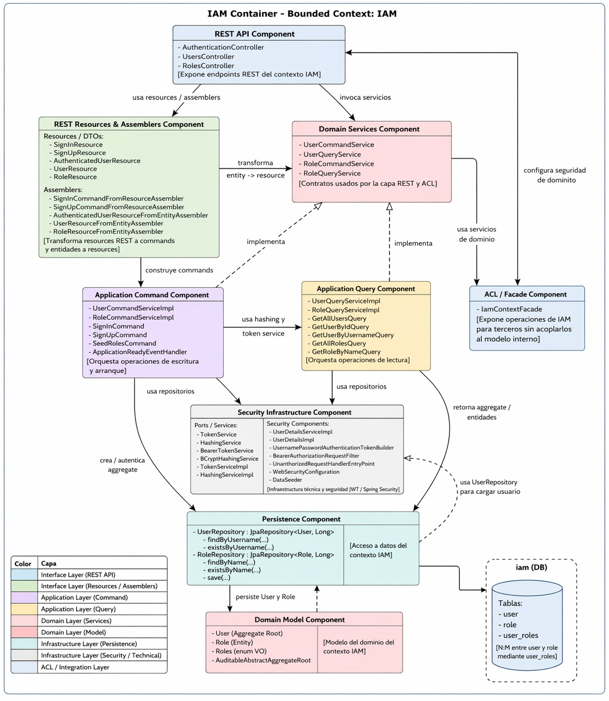

##### Relaciones entre componentes

- **Authentication REST API Component → IAM Transformation Component**  
  Transforma datos de entrada y salida entre resources, commands y entidades.

- **Authentication REST API Component → Authentication Command Processing Component**  
  Delega operaciones de registro e inicio de sesión.

- **IAM Query REST API Component → IAM Query Processing Component**  
  Delega operaciones de lectura sobre usuarios y roles.

- **Authentication Command Processing Component → IAM Domain Component**  
  Construye la entidad `User` y resuelve roles dentro del dominio.

- **Authentication Command Processing Component → IAM Persistence Component**  
  Persiste usuarios y consulta roles.

- **Authentication Command Processing Component → Security Infrastructure Component**  
  Utiliza servicios de hashing, autenticación y generación de token.

- **IAM Query Processing Component → IAM Persistence Component**  
  Recupera usuarios y roles desde base de datos.

- **IAM ACL / Integration Component → Users BC**  
  Representa la integración conceptual con el contexto `Users` para resolver identidad funcional, aunque actualmente no participa activamente del flujo principal.

---

#### 2.6.11.6. Bounded Context Software Architecture Code Level Diagrams

En esta sección se presentan los diagramas a nivel de código del bounded context **IAM**, los cuales permiten comprender con mayor detalle cómo se implementan los componentes identificados previamente. Este nivel de análisis muestra la estructura interna del dominio y su persistencia, evidenciando las clases, interfaces, atributos, métodos y relaciones que conforman el contexto.

Se incluyen dos representaciones principales:

- el **Class Diagram del Domain Layer**, que describe la estructura del modelo de dominio;
- y el **Database Design Diagram**, que representa la persistencia de datos en la base de datos relacional.

---

##### 2.6.11.6.1. Bounded Context Domain Layer Class Diagrams

**Descripción:**

El diagrama de clases del Domain Layer del bounded context **IAM** presenta el agregado principal `User`, junto con la entidad `Role`, el enum `Roles`, las interfaces de servicios del dominio y los objetos que representan comandos y consultas. El diseño evidencia que `User` es el núcleo del contexto y que las operaciones del sistema se organizan alrededor de comandos de autenticación y consultas de usuarios y roles.

**Diagrama UML de clases (Domain Layer):**

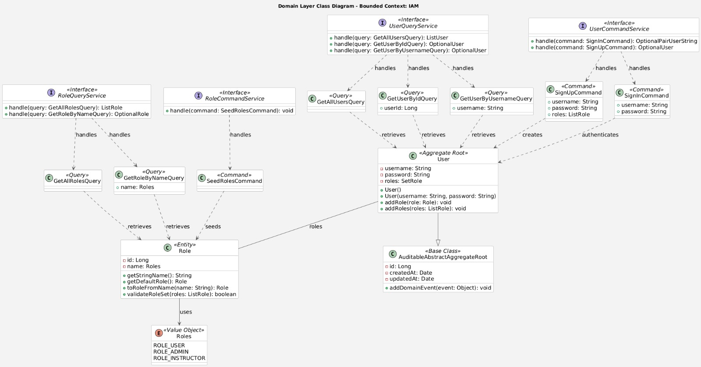

##### Relaciones principales del modelo

- `User` es el **Aggregate Root** del bounded context.
- `User` mantiene una relación **Many-to-Many** con `Role`.
- `Role` utiliza el enum `Roles` como value object.
- `UserCommandService` define las operaciones de registro e inicio de sesión.
- `UserQueryService` define las operaciones de lectura de usuarios.
- `RoleCommandService` define la inicialización de roles.
- `RoleQueryService` define las operaciones de lectura de roles.
- Los comandos encapsulan acciones de autenticación y administración inicial.
- Las queries encapsulan solicitudes de consulta.

##### Observaciones

El modelo de dominio presenta una estructura clara y centrada en el agregado `User`. La separación entre `User`, `Role` y el enum `Roles` mantiene acotado el espacio de autorización del contexto y permite representar de forma consistente las capacidades de autenticación y asignación de permisos.

---

##### 2.6.11.6.2. Bounded Context Database Design Diagram

**Descripción:**

El diagrama de base de datos del bounded context **IAM** representa la estructura relacional utilizada para persistir la información de usuarios autenticados y roles. Las tablas principales son `users` y `roles`, vinculadas mediante una tabla intermedia `user_roles`.

**Diagrama de base de datos (ERD):**

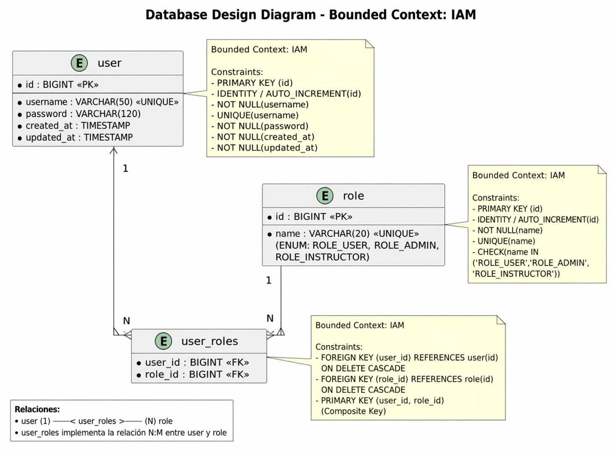
##### Tablas y atributos

###### Tabla `users`

- `id`: identificador único del usuario autenticado (PK)
- `username`: nombre único de usuario
- `password`: contraseña cifrada
- `created_at`: fecha de creación
- `updated_at`: fecha de actualización

###### Tabla `roles`

- `id`: identificador único del rol
- `name`: nombre lógico del rol

###### Tabla `user_roles`

- `user_id`: referencia al usuario autenticado
- `role_id`: referencia al rol asignado

---

##### Constraints

- `PRIMARY KEY (id)` en `users`
- `PRIMARY KEY (id)` en `roles`
- `FOREIGN KEY (user_id)` → `users(id)`
- `FOREIGN KEY (role_id)` → `roles(id)`
- restricción de unicidad en `username`
- restricción de unicidad esperada en `roles.name`

---

##### Relaciones entre tablas

- `users (*) ──── (*) roles` mediante `user_roles`

---

##### Observaciones

El diseño de persistencia es consistente con el modelo de dominio y permite almacenar correctamente cuentas, roles y la tabla intermedia `user_roles`. La estructura de datos refleja un bounded context de seguridad bien normalizado, con una relación clara entre usuarios y privilegios.

---

## 4.2.1.6. Services Documentation Evidence for Sprint Review

En esta seccion se presenta la evidencia de documentacion de Web Services elaborada para el Sprint mediante OpenAPI/Swagger. El trabajo realizado permitio registrar los endpoints principales del backend de Courtly/MatchPoint, validar su sintaxis de llamada, identificar los parametros requeridos y documentar ejemplos de request y response utilizando datos de muestra.

Como resultado del Sprint, la documentacion de servicios facilita que el equipo pueda inspeccionar, probar y validar las operaciones del backend desde Swagger UI. Esta evidencia tambien permite mantener trazabilidad entre los bounded contexts implementados, los endpoints expuestos y las capturas de interaccion utilizadas para sustentar la revision del Sprint.

- **Repositorio de Web Services:** [https://github.com/Aplicaciones-Moviles-3248/backend](https://github.com/Aplicaciones-Moviles-3248/backend)
- **Documentacion OpenAPI desplegada:** [https://courtly-backend.onrender.com/swagger-ui/index.html](https://courtly-backend.onrender.com/swagger-ui/index.html)
- **Commit del backend utilizado:** `6fe60a4`

### Resumen de endpoints documentados

| Bounded Context | Verbo HTTP | Sintaxis de llamada | Accion implementada | Documentacion |
|---|---:|---|---|---|
| Bookings | POST | `/api/v1/bookings` | Crear reserva | [Swagger UI](https://courtly-backend.onrender.com/swagger-ui/index.html) |
| Bookings | GET | `/api/v1/bookings` | Listar reservas | [Swagger UI](https://courtly-backend.onrender.com/swagger-ui/index.html) |
| Bookings | GET | `/api/v1/bookings/{id}` | Obtener reserva por identificador | [Swagger UI](https://courtly-backend.onrender.com/swagger-ui/index.html) |
| Bookings | PUT | `/api/v1/bookings/{id}` | Actualizar reserva | [Swagger UI](https://courtly-backend.onrender.com/swagger-ui/index.html) |
| Bookings | DELETE | `/api/v1/bookings/{id}` | Eliminar reserva | [Swagger UI](https://courtly-backend.onrender.com/swagger-ui/index.html) |
| Payments | POST | `/api/v1/payments` | Registrar pago | [Swagger UI](https://courtly-backend.onrender.com/swagger-ui/index.html) |
| Payments | GET | `/api/v1/payments/{id}` | Obtener pago por identificador | [Swagger UI](https://courtly-backend.onrender.com/swagger-ui/index.html) |
| Coaches | POST | `/api/v1/coaches` | Crear coach | [Swagger UI](https://courtly-backend.onrender.com/swagger-ui/index.html) |
| Coaches | GET | `/api/v1/coaches` | Listar coaches | [Swagger UI](https://courtly-backend.onrender.com/swagger-ui/index.html) |
| Coaches | GET | `/api/v1/coaches/{id}` | Obtener coach por identificador | [Swagger UI](https://courtly-backend.onrender.com/swagger-ui/index.html) |
| Coaches | PUT | `/api/v1/coaches/{id}` | Actualizar coach | [Swagger UI](https://courtly-backend.onrender.com/swagger-ui/index.html) |
| Coaches | DELETE | `/api/v1/coaches/{id}` | Eliminar coach | [Swagger UI](https://courtly-backend.onrender.com/swagger-ui/index.html) |
| Courts | POST | `/api/v1/courts` | Registrar cancha | [Swagger UI](https://courtly-backend.onrender.com/swagger-ui/index.html) |
| Courts | GET | `/api/v1/courts` | Listar canchas | [Swagger UI](https://courtly-backend.onrender.com/swagger-ui/index.html) |
| Courts | GET | `/api/v1/courts/{id}` | Obtener cancha por identificador | [Swagger UI](https://courtly-backend.onrender.com/swagger-ui/index.html) |
| Courts | PUT | `/api/v1/courts/{id}` | Actualizar cancha | [Swagger UI](https://courtly-backend.onrender.com/swagger-ui/index.html) |
| Courts | DELETE | `/api/v1/courts/{id}` | Eliminar cancha | [Swagger UI](https://courtly-backend.onrender.com/swagger-ui/index.html) |
| Availabilities | POST | `/api/v1/availabilities` | Crear disponibilidad | [Swagger UI](https://courtly-backend.onrender.com/swagger-ui/index.html) |
| Availabilities | GET | `/api/v1/availabilities` | Listar disponibilidades | [Swagger UI](https://courtly-backend.onrender.com/swagger-ui/index.html) |
| Availabilities | GET | `/api/v1/availabilities/{id}` | Obtener disponibilidad por identificador | [Swagger UI](https://courtly-backend.onrender.com/swagger-ui/index.html) |
| Availabilities | PUT | `/api/v1/availabilities/{id}` | Actualizar disponibilidad | [Swagger UI](https://courtly-backend.onrender.com/swagger-ui/index.html) |
| Availabilities | DELETE | `/api/v1/availabilities/{id}` | Eliminar disponibilidad | [Swagger UI](https://courtly-backend.onrender.com/swagger-ui/index.html) |
| Matches | POST | `/api/v1/matches` | Crear partido | [Swagger UI](https://courtly-backend.onrender.com/swagger-ui/index.html) |
| Matches | GET | `/api/v1/matches` | Listar partidos | [Swagger UI](https://courtly-backend.onrender.com/swagger-ui/index.html) |
| Matches | GET | `/api/v1/matches/{id}` | Obtener partido por identificador | [Swagger UI](https://courtly-backend.onrender.com/swagger-ui/index.html) |
| Matches | PUT | `/api/v1/matches/{id}` | Actualizar partido | [Swagger UI](https://courtly-backend.onrender.com/swagger-ui/index.html) |
| Matches | DELETE | `/api/v1/matches/{id}` | Eliminar partido | [Swagger UI](https://courtly-backend.onrender.com/swagger-ui/index.html) |
| Notifications | POST | `/api/v1/notifications` | Crear notificacion | [Swagger UI](https://courtly-backend.onrender.com/swagger-ui/index.html) |
| Notifications | GET | `/api/v1/notifications` | Listar notificaciones | [Swagger UI](https://courtly-backend.onrender.com/swagger-ui/index.html) |
| Notifications | GET | `/api/v1/notifications/{id}` | Obtener notificacion por identificador | [Swagger UI](https://courtly-backend.onrender.com/swagger-ui/index.html) |
| Notifications | PUT | `/api/v1/notifications/{id}` | Actualizar notificacion | [Swagger UI](https://courtly-backend.onrender.com/swagger-ui/index.html) |
| Notifications | DELETE | `/api/v1/notifications/{id}` | Eliminar notificacion | [Swagger UI](https://courtly-backend.onrender.com/swagger-ui/index.html) |
| Analytics | POST | `/api/v1/analytics` | Crear metrica | [Swagger UI](https://courtly-backend.onrender.com/swagger-ui/index.html) |
| Analytics | GET | `/api/v1/analytics` | Listar metricas | [Swagger UI](https://courtly-backend.onrender.com/swagger-ui/index.html) |
| Analytics | GET | `/api/v1/analytics/{id}` | Obtener metrica por identificador | [Swagger UI](https://courtly-backend.onrender.com/swagger-ui/index.html) |
| Analytics | PUT | `/api/v1/analytics/{id}` | Actualizar metrica | [Swagger UI](https://courtly-backend.onrender.com/swagger-ui/index.html) |
| Analytics | DELETE | `/api/v1/analytics/{id}` | Eliminar metrica | [Swagger UI](https://courtly-backend.onrender.com/swagger-ui/index.html) |
| IAM / Authentication | POST | `/api/v1/auth/sign-up` | Registrar usuario | [Swagger UI](https://courtly-backend.onrender.com/swagger-ui/index.html) |
| IAM / Authentication | POST | `/api/v1/auth/sign-in` | Iniciar sesion | [Swagger UI](https://courtly-backend.onrender.com/swagger-ui/index.html) |
| IAM / Users | GET | `/api/v1/users` | Listar usuarios registrados | [Swagger UI](https://courtly-backend.onrender.com/swagger-ui/index.html) |
| IAM / Roles | GET | `/api/v1/roles` | Listar roles disponibles | [Swagger UI](https://courtly-backend.onrender.com/swagger-ui/index.html) |
| User Profiles | POST | `/api/v1/user-profiles` | Crear perfil de usuario | [Swagger UI](https://courtly-backend.onrender.com/swagger-ui/index.html) |
| User Profiles | GET | `/api/v1/user-profiles` | Listar perfiles de usuario | [Swagger UI](https://courtly-backend.onrender.com/swagger-ui/index.html) |
| User Profiles | GET | `/api/v1/user-profiles/{id}` | Obtener perfil por identificador | [Swagger UI](https://courtly-backend.onrender.com/swagger-ui/index.html) |
| User Profiles | PUT | `/api/v1/user-profiles/{id}` | Actualizar perfil de usuario | [Swagger UI](https://courtly-backend.onrender.com/swagger-ui/index.html) |
| User Profiles | DELETE | `/api/v1/user-profiles/{id}` | Eliminar perfil de usuario | [Swagger UI](https://courtly-backend.onrender.com/swagger-ui/index.html) |

---

### Bookings

#### Endpoint: POST /api/v1/bookings

**Accion implementada:** crear una reserva asociando un usuario con una cancha durante un intervalo de tiempo.

**Parametros:** body con `startTime` (`LocalDateTime`), `endTime` (`LocalDateTime`), `userId` (`Long`) y `courtId` (`Long`).

**Example Request:**

```json
{
  "startTime": "2026-05-10T10:00:00",
  "endTime": "2026-05-10T11:00:00",
  "userId": 9,
  "courtId": 2
}
```

**Example Response:**

```json
{
  "id": 1,
  "startTime": "2026-05-10T10:00:00",
  "endTime": "2026-05-10T11:00:00",
  "user": {
    "id": 9,
    "name": "Juan Perez"
  },
  "court": {
    "id": 2,
    "name": "Cancha Central"
  }
}
```

**Explicacion del response:** el servicio retorna la reserva creada con su identificador, horario registrado y las relaciones principales embebidas: usuario y cancha.

**Captura:** 

#### Endpoint: GET /api/v1/bookings

**Accion implementada:** obtener el listado de reservas registradas.

**Parametros:** no requiere parametros.

**Example Response:**

```json
[
  {
    "id": 1,
    "startTime": "2026-05-10T10:00:00",
    "endTime": "2026-05-10T11:00:00",
    "user": {
      "id": 9,
      "name": "Juan Perez"
    },
    "court": {
      "id": 2,
      "name": "Cancha Central"
    }
  }
]
```

**Explicacion del response:** el servicio retorna un arreglo de reservas. Cada elemento contiene el identificador de la reserva, el rango horario y los objetos resumidos de usuario y cancha.

**Captura:** 

#### Endpoint: GET /api/v1/bookings/{id}

**Accion implementada:** consultar una reserva especifica por identificador.

**Parametros:** `id` en path (`Long`).

**Example Response:**

```json
{
  "id": 1,
  "startTime": "2026-05-10T10:00:00",
  "endTime": "2026-05-10T11:00:00",
  "user": {
    "id": 9,
    "name": "Juan Perez"
  },
  "court": {
    "id": 2,
    "name": "Cancha Central"
  }
}
```

**Explicacion del response:** el servicio retorna la informacion de una reserva individual, incluyendo los datos resumidos de las entidades relacionadas.

**Captura:** 

#### Endpoint: PUT /api/v1/bookings/{id}

**Accion implementada:** actualizar los datos de una reserva existente.

**Parametros:** `id` en path (`Long`) y body con los campos actualizables de la reserva.

**Example Request:**

```json
{
  "startTime": "2026-05-10T10:00:00",
  "endTime": "2026-05-10T11:00:00"
}
```

**Example Response:**

```json
{
  "id": 1,
  "startTime": "2026-05-10T10:00:00",
  "endTime": "2026-05-10T11:00:00",
  "user": {
    "id": 9,
    "name": "Juan Perez"
  },
  "court": {
    "id": 2,
    "name": "Cancha Central"
  }
}
```

**Explicacion del response:** el servicio retorna la reserva luego de aplicar la actualizacion.

**Captura:** 

#### Endpoint: DELETE /api/v1/bookings/{id}

**Accion implementada:** eliminar una reserva por identificador.

**Parametros:** `id` en path (`Long`).

**Example Response:** no se documenta cuerpo de respuesta porque la evidencia disponible corresponde a la operacion ejecutada desde Swagger.

**Captura:** 

---

### Payments

#### Endpoint: POST /api/v1/payments

**Accion implementada:** registrar un pago asociado a un usuario.

**Parametros:** body con `amount` (`Number`) y `userId` (`Long`).

**Example Request:**

```json
{
  "amount": 35.5,
  "userId": 9
}
```

**Example Response:**

```json
{
  "id": 1,
  "amount": 35.5,
  "paymentDate": "2026-05-12T02:07:07.621294452",
  "status": "PENDING",
  "user": {
    "id": 9,
    "name": "Juan Perez"
  }
}
```

**Explicacion del response:** el servicio retorna el pago creado, el monto registrado, la fecha de pago, el estado inicial y el usuario asociado.

**Captura:** 

#### Endpoint: GET /api/v1/payments/{id}

**Accion implementada:** obtener un pago especifico por identificador.

**Parametros:** `id` en path (`Long`).

**Example Response:**

```json
{
  "id": 1,
  "amount": 35.5,
  "paymentDate": "2026-05-12T02:07:07.621294452",
  "status": "PENDING",
  "user": {
    "id": 9,
    "name": "Juan Perez"
  }
}
```

**Explicacion del response:** el servicio retorna el detalle del pago y el usuario relacionado.

**Captura:** 

---

### Coaches

#### Endpoint: POST /api/v1/coaches

**Accion implementada:** crear un entrenador dentro del sistema.

**Parametros:** body con `name` (`String`), `expertise` (`String`) y `phone` (`String`).

**Example Request:**

```json
{
  "name": "Ana Torres",
  "expertise": "Tenis",
  "phone": "+51 999 123 456"
}
```

**Example Response:**

```json
{
  "id": 2,
  "name": "Ana Torres",
  "expertise": "Tenis",
  "phone": "+51 999 123 456"
}
```

**Explicacion del response:** el servicio retorna el coach creado con su identificador, nombre, especialidad y telefono.

**Captura:** 

#### Endpoint: GET /api/v1/coaches

**Accion implementada:** listar los entrenadores registrados.

**Parametros:** no requiere parametros.

**Example Response:**

```json
[
  {
    "id": 1,
    "name": "beto",
    "expertise": "beto",
    "phone": "123456789"
  },
  {
    "id": 2,
    "name": "Ana Torres",
    "expertise": "Tenis",
    "phone": "+51 999 123 456"
  }
]
```

**Explicacion del response:** el servicio retorna un arreglo de coaches con sus datos principales.

**Captura:** 

#### Endpoint: GET /api/v1/coaches/{id}

**Accion implementada:** obtener un coach especifico por identificador.

**Parametros:** `id` en path (`Long`).

**Example Response:**

```json
{
  "id": 2,
  "name": "Ana Torres",
  "expertise": "Tenis",
  "phone": "+51 999 123 456"
}
```

**Explicacion del response:** el servicio retorna el detalle del coach solicitado.

**Captura:** 

#### Endpoint: PUT /api/v1/coaches/{id}

**Accion implementada:** actualizar los datos de un coach existente.

**Parametros:** `id` en path (`Long`) y body con `name`, `expertise` y `phone`.

**Example Request:**

```json
{
  "name": "Ana Torres",
  "expertise": "Tenis",
  "phone": "+51 999 123 456"
}
```

**Example Response:**

```json
{
  "id": 2,
  "name": "Ana Torres",
  "expertise": "Tenis",
  "phone": "+51 999 123 456"
}
```

**Explicacion del response:** el servicio retorna el coach luego de aplicar la actualizacion.

**Captura:** 

#### Endpoint: DELETE /api/v1/coaches/{id}

**Accion implementada:** eliminar un coach por identificador.

**Parametros:** `id` en path (`Long`).

**Example Response:** no se documenta cuerpo de respuesta porque la evidencia disponible corresponde a la operacion ejecutada desde Swagger.

**Captura:** 

---

### Courts

#### Endpoint: POST /api/v1/courts

**Accion implementada:** registrar una cancha disponible en la plataforma.

**Parametros:** body con `name` (`String`), `location` (`String`) y `type` (`String`).

**Example Request:**

```json
{
  "name": "Cancha Central",
  "location": "Lima",
  "type": "Padel"
}
```

**Example Response:**

```json
{
  "id": 1,
  "name": "Cancha Central",
  "location": "Lima",
  "type": "Padel"
}
```

**Explicacion del response:** el servicio retorna la cancha creada con su identificador, nombre, ubicacion y tipo.

**Captura:** 

#### Endpoint: GET /api/v1/courts

**Accion implementada:** listar las canchas registradas.

**Parametros:** no requiere parametros.

**Example Response:**

```json
[
  {
    "id": 1,
    "name": "Cancha Central",
    "location": "Lima",
    "type": "Padel"
  }
]
```

**Explicacion del response:** el servicio retorna un arreglo de canchas con sus datos principales.

**Captura:** 

#### Endpoint: GET /api/v1/courts/{id}

**Accion implementada:** obtener una cancha por identificador.

**Parametros:** `id` en path (`Long`).

**Example Response:**

```json
{
  "id": 1,
  "name": "Cancha Central",
  "location": "Lima",
  "type": "Padel"
}
```

**Explicacion del response:** el servicio retorna la cancha solicitada con sus atributos principales.

**Captura:** 

#### Endpoint: PUT /api/v1/courts/{id}

**Accion implementada:** actualizar los datos de una cancha.

**Parametros:** `id` en path (`Long`) y body con `name`, `location` y `type`.

**Example Request:**

```json
{
  "name": "Cancha Central",
  "location": "Lima",
  "type": "Padel"
}
```

**Example Response:**

```json
{
  "id": 1,
  "name": "Cancha Central",
  "location": "Lima",
  "type": "Padel"
}
```

**Explicacion del response:** el servicio retorna la cancha actualizada.

**Captura:** 

#### Endpoint: DELETE /api/v1/courts/{id}

**Accion implementada:** eliminar una cancha por identificador.

**Parametros:** `id` en path (`Long`).

**Example Response:** no se documenta cuerpo de respuesta porque la evidencia disponible corresponde a la operacion ejecutada desde Swagger.

**Captura:** 

---

### Availabilities

#### Endpoint: POST /api/v1/availabilities

**Accion implementada:** crear una disponibilidad horaria para un coach.

**Parametros:** body con `date` (`LocalDate`), `startTime` (`LocalTime`), `endTime` (`LocalTime`), `status` (`String`) y `coachId` (`Long`).

**Example Request:**

```json
{
  "date": "2026-05-12",
  "startTime": "14:00:00",
  "endTime": "15:00:00",
  "status": "AVAILABLE",
  "coachId": 3
}
```

**Example Response:**

```json
{
  "id": 1,
  "date": "2026-05-12",
  "startTime": "14:00:00",
  "endTime": "15:00:00",
  "status": "AVAILABLE",
  "createdAt": "2026-05-12T02:29:41.770962",
  "coach": {
    "id": 3,
    "name": "Ana Torres"
  }
}
```

**Explicacion del response:** el servicio retorna la disponibilidad creada, su estado, fecha de creacion y el coach asociado como objeto resumido.

**Captura:** 

#### Endpoint: GET /api/v1/availabilities

**Accion implementada:** listar las disponibilidades registradas.

**Parametros:** no requiere parametros.

**Example Response:**

```json
[
  {
    "id": 1,
    "date": "2026-05-12",
    "startTime": "14:00:00",
    "endTime": "15:00:00",
    "status": "AVAILABLE",
    "createdAt": "2026-05-12T02:29:41.770962",
    "coach": {
      "id": 3,
      "name": "Ana Torres"
    }
  }
]
```

**Explicacion del response:** el servicio retorna un arreglo de disponibilidades con fecha, rango horario, estado y coach asociado.

**Captura:** 

#### Endpoint: GET /api/v1/availabilities/{id}

**Accion implementada:** obtener una disponibilidad especifica por identificador.

**Parametros:** `id` en path (`Long`).

**Example Response:**

```json
{
  "id": 1,
  "date": "2026-05-12",
  "startTime": "14:00:00",
  "endTime": "15:00:00",
  "status": "AVAILABLE",
  "createdAt": "2026-05-12T02:29:41.770962",
  "coach": {
    "id": 3,
    "name": "Ana Torres"
  }
}
```

**Explicacion del response:** el servicio retorna el detalle de una disponibilidad y la informacion resumida del coach.

**Captura:** 

#### Endpoint: PUT /api/v1/availabilities/{id}

**Accion implementada:** actualizar una disponibilidad existente.

**Parametros:** `id` en path (`Long`) y body con `date`, `startTime`, `endTime`, `status` y `coachId`.

**Example Request:**

```json
{
  "date": "2026-05-12",
  "startTime": "14:00:00",
  "endTime": "15:00:00",
  "status": "AVAILABLE",
  "coachId": 3
}
```

**Example Response:**

```json
{
  "id": 1,
  "date": "2026-05-12",
  "startTime": "14:00:00",
  "endTime": "15:00:00",
  "status": "AVAILABLE",
  "createdAt": "2026-05-12T02:29:41.770962",
  "coach": {
    "id": 3,
    "name": "Ana Torres"
  }
}
```

**Explicacion del response:** el servicio retorna la disponibilidad luego de aplicar la actualizacion.

**Captura:** 

#### Endpoint: DELETE /api/v1/availabilities/{id}

**Accion implementada:** eliminar una disponibilidad por identificador.

**Parametros:** `id` en path (`Long`).

**Example Response:** no se documenta cuerpo de respuesta porque la evidencia disponible corresponde a la operacion ejecutada desde Swagger.

**Captura:** 

---

### Matches

#### Endpoint: POST /api/v1/matches

**Accion implementada:** crear un partido programado dentro de una cancha y asociado a un usuario creador.

**Parametros:** body con `title` (`String`), `description` (`String`), `dateTime` (`OffsetDateTime`), `status` (`String`), `maxPlayers` (`Integer`), `currentPlayers` (`Integer`), `courtId` (`Long`) y `createdById` (`Long`).

**Example Request:**

```json
{
  "title": "Partido amistoso",
  "description": "Partido de practica con amigos",
  "dateTime": "2026-05-12T14:00:00Z",
  "status": "SCHEDULED",
  "maxPlayers": 10,
  "currentPlayers": 0,
  "courtId": 2,
  "createdById": 3
}
```

**Explicacion del request:** el payload registra los datos funcionales del partido y relaciona la cancha y el usuario creador mediante identificadores.

**Captura:** 

#### Endpoint: GET /api/v1/matches

**Accion implementada:** listar los partidos registrados.

**Parametros:** no requiere parametros.

**Example Response:** no se proporciono JSON real de response para esta operacion en la evidencia disponible.

**Explicacion del response:** esta operacion permite consultar los partidos disponibles desde la documentacion OpenAPI.

**Captura:** .

#### Endpoint: GET /api/v1/matches/{id}

**Accion implementada:** obtener un partido especifico por identificador.

**Parametros:** `id` en path (`Long`).

**Example Response:** no se proporciono JSON real de response para esta operacion en la evidencia disponible.

**Explicacion del response:** esta operacion permite consultar el detalle de un partido registrado.

**Captura:** .

#### Endpoint: PUT /api/v1/matches/{id}

**Accion implementada:** actualizar un partido existente.

**Parametros:** `id` en path (`Long`). No se proporciono payload real de actualizacion en la evidencia disponible.

**Example Response:** 
```json
{
  "title": "Partido amistoso",
  "description": "Partido de práctica con amigos - horario actualizado",
  "dateTime": "2026-05-12T14:00:00Z",
  "status": "SCHEDULED",
  "maxPlayers": 10,
  "currentPlayers": 0,
  "courtId": 2,
  "createdById": 3
}
```

**Explicacion del response:** esta operacion permite modificar los datos de un partido desde Swagger UI.

**Captura:** .

#### Endpoint: DELETE /api/v1/matches/{id}

**Accion implementada:** eliminar un partido por identificador.

**Parametros:** `id` en path (`Long`).

**Example Response:** no se documenta cuerpo de respuesta porque no se proporciono payload real para esta operacion.

**Explicacion del response:** esta operacion permite retirar un partido registrado.

**Captura:** .

---

### Notifications

#### Endpoint: POST /api/v1/notifications

**Accion implementada:** crear una notificacion para un usuario.

**Parametros:** body con `title` (`String`), `message` (`String`), `type` (`String`), `isRead` (`Boolean`) y `userId` (`Long`).

**Example Request:**

```json
{
  "title": "Nuevo partido disponible",
  "message": "Se ha programado un nuevo partido en tu cancha favorita",
  "type": "INFO",
  "isRead": false,
  "userId": 9
}
```

**Example Response:**

```json
{
  "id": 1,
  "title": "Nuevo partido disponible",
  "message": "Se ha programado un nuevo partido en tu cancha favorita",
  "type": "INFO",
  "isRead": false,
  "createdAt": "2026-05-12T03:09:40.277684842",
  "user": {
    "id": 9,
    "name": "Juan Perez"
  }
}
```

**Explicacion del response:** el servicio retorna la notificacion creada, su estado de lectura, fecha de creacion y el usuario asociado.

**Captura:** 

#### Endpoint: GET /api/v1/notifications

**Accion implementada:** listar las notificaciones registradas.

**Parametros:** no requiere parametros.

**Example Response:**

```json
[
  {
    "id": 1,
    "title": "Nuevo partido disponible",
    "message": "Se ha programado un nuevo partido en tu cancha favorita",
    "type": "INFO",
    "isRead": false,
    "createdAt": "2026-05-12T03:09:40.277684842",
    "user": {
      "id": 9,
      "name": "Juan Perez"
    }
  }
]
```

**Explicacion del response:** el servicio retorna un arreglo de notificaciones con los datos de mensaje, estado de lectura y usuario asociado.

**Captura:** 

#### Endpoint: GET /api/v1/notifications/{id}

**Accion implementada:** obtener una notificacion por identificador.

**Parametros:** `id` en path (`Long`).

**Example Response:**

```json
{
  "id": 1,
  "title": "Nuevo partido disponible",
  "message": "Se ha programado un nuevo partido en tu cancha favorita",
  "type": "INFO",
  "isRead": false,
  "createdAt": "2026-05-12T03:09:40.277684842",
  "user": {
    "id": 9,
    "name": "Juan Perez"
  }
}
```

**Explicacion del response:** el servicio retorna el detalle de una notificacion y el usuario destinatario.

**Captura:** 

#### Endpoint: PUT /api/v1/notifications/{id}

**Accion implementada:** actualizar una notificacion existente.

**Parametros:** `id` en path (`Long`) y body con los campos de notificacion.

**Example Request:**

```json
{
  "title": "Nuevo partido disponible",
  "message": "Se ha programado un nuevo partido en tu cancha favorita",
  "type": "INFO",
  "isRead": false,
  "userId": 9
}
```

**Example Response:**

```json
{
  "id": 1,
  "title": "Nuevo partido disponible",
  "message": "Se ha programado un nuevo partido en tu cancha favorita",
  "type": "INFO",
  "isRead": false,
  "createdAt": "2026-05-12T03:09:40.277684842",
  "user": {
    "id": 9,
    "name": "Juan Perez"
  }
}
```

**Explicacion del response:** el servicio retorna la notificacion luego de aplicar la actualizacion.

**Captura:** 

#### Endpoint: DELETE /api/v1/notifications/{id}

**Accion implementada:** eliminar una notificacion por identificador.

**Parametros:** `id` en path (`Long`).

**Example Response:** no se documenta cuerpo de respuesta porque la evidencia disponible corresponde a la operacion ejecutada desde Swagger.

**Captura:** 

---

### Analytics

#### Endpoint: POST /api/v1/analytics

**Accion implementada:** crear una metrica asociada a un coach.

**Parametros:** body con `metricType` (`String`), `value` (`Number`), `period` (`String`) y `coachId` (`Long`).

**Example Request:**

```json
{
  "metricType": "PARTICIPATION",
  "value": 5,
  "period": "2026-05",
  "coachId": 5
}
```

**Explicacion del request:** el payload registra el tipo de metrica, su valor, el periodo evaluado y el identificador del coach relacionado.

**Captura:** 

#### Endpoint: GET /api/v1/analytics

**Accion implementada:** listar las metricas registradas.

**Parametros:** no requiere parametros.

**Example Response:** no se proporciono JSON real de response para esta operacion en la evidencia disponible.

**Explicacion del response:** esta operacion permite consultar el conjunto de metricas disponibles para analisis.

**Captura:** 

#### Endpoint: GET /api/v1/analytics/{id}

**Accion implementada:** obtener una metrica especifica por identificador.

**Parametros:** `id` en path (`Long`).

**Example Response:** no se proporciono JSON real de response para esta operacion en la evidencia disponible.

**Explicacion del response:** esta operacion permite revisar el detalle de una metrica registrada.

**Captura:** 

#### Endpoint: PUT /api/v1/analytics/{id}

**Accion implementada:** actualizar una metrica existente.

**Parametros:** `id` en path (`Long`). No se proporciono payload real de actualizacion en la evidencia disponible.

**Example Response:** 
```json
{
  "metricType": "PARTICIPATION",
  "value": 8,
  "period": "2026-05",
  "coachId": 5
}
```
**Explicacion del response:** esta operacion permite modificar la informacion de una metrica documentada en Swagger UI.

**Captura:** 

#### Endpoint: DELETE /api/v1/analytics/{id}

**Accion implementada:** eliminar una metrica por identificador.

**Parametros:** `id` en path (`Long`).

**Example Response:** no se documenta cuerpo de respuesta porque no se proporciono payload real para esta operacion.

**Explicacion del response:** esta operacion permite retirar una metrica registrada.

**Captura:** 

---

### IAM / Authentication / Users

#### Endpoint: POST /api/v1/auth/sign-up

**Accion implementada:** registrar una nueva cuenta de usuario.

**Parametros:** no se proporciono JSON real de request para esta operacion en la evidencia disponible.

**Example Response:** 
```json
{
  "username": "pedro",
  "password": "pedro",
  "roles": ["ROLE_USER"]
}
```
**Explicacion del response:** esta operacion forma parte del flujo de autenticacion y permite crear credenciales de acceso para un usuario.

**Captura:** .

#### Endpoint: POST /api/v1/auth/sign-in

**Accion implementada:** iniciar sesion con credenciales de usuario.

**Parametros:** no se proporciono JSON real de request para esta operacion en la evidencia disponible.

**Example Response:** 
```json
{
  "username": "pocho1",
  "password": "pocho1"
}
```
**Explicacion del response:** esta operacion permite autenticar al usuario y habilitar el acceso a recursos protegidos del backend.

**Captura:** .

#### Endpoint: GET /api/v1/users

**Accion implementada:** listar los usuarios registrados y sus roles asignados.

**Parametros:** no requiere parametros.

**Example Response:**

```json
[
  {
    "id": 1,
    "username": "admin",
    "roles": [
      "ROLE_ADMIN"
    ]
  },
  {
    "id": 2,
    "username": "pedro",
    "roles": [
      "ROLE_USER"
    ]
  },
  {
    "id": 3,
    "username": "pocho",
    "roles": [
      "ROLE_ADMIN"
    ]
  },
  {
    "id": 4,
    "username": "pocho1",
    "roles": [
      "ROLE_ADMIN"
    ]
  }
]
```

**Explicacion del response:** el servicio retorna un arreglo de usuarios. Cada usuario incluye su identificador, nombre de usuario y roles asignados como arreglo de strings.

**Captura:** 

#### Endpoint: GET /api/v1/roles

**Accion implementada:** listar los roles disponibles para la gestion de autorizacion.

**Parametros:** no requiere parametros.

**Example Response:** no se proporciono JSON real de response para esta operacion en la evidencia disponible.

**Explicacion del response:** esta operacion permite consultar los roles que pueden asociarse a usuarios dentro del sistema.

**Captura:** No se proporciono captura disponible para esta operacion en `assets/chapter4`.

---

### User Profiles

#### Endpoint: POST /api/v1/user-profiles

**Accion implementada:** crear un perfil de usuario con informacion de contacto.

**Parametros:** body con `name` (`String`), `email` (`String`) y `phone` (`String`).

**Example Request:**

```json
{
  "name": "Juan Perez",
  "email": "juan@gmail.com",
  "phone": "+51999123456"
}
```

**Example Response:**

```json
{
  "id": 8,
  "name": "Juan Perez",
  "email": "juan@gmail.com",
  "phone": "+51999123456"
}
```

**Explicacion del response:** el servicio retorna el perfil creado con identificador, nombre, correo y telefono.

**Captura:** 

#### Endpoint: GET /api/v1/user-profiles

**Accion implementada:** listar los perfiles de usuario registrados.

**Parametros:** no requiere parametros.

**Example Response:**

```json
[
  {
    "id": 8,
    "name": "Juan Perez",
    "email": "juan@gmail.com",
    "phone": "+51999123456"
  }
]
```

**Explicacion del response:** el servicio retorna un arreglo de perfiles con datos de contacto.

**Captura:** 

#### Endpoint: GET /api/v1/user-profiles/{id}

**Accion implementada:** obtener un perfil de usuario por identificador.

**Parametros:** `id` en path (`Long`).

**Example Response:**

```json
{
  "id": 8,
  "name": "Juan Perez",
  "email": "juan@gmail.com",
  "phone": "+51999123456"
}
```

**Explicacion del response:** el servicio retorna el perfil solicitado con sus datos de contacto.

**Captura:** 

#### Endpoint: PUT /api/v1/user-profiles/{id}

**Accion implementada:** actualizar los datos de un perfil de usuario.

**Parametros:** `id` en path (`Long`) y body con `name`, `email` y `phone`.

**Example Request:**

```json
{
  "name": "Juan Perez",
  "email": "juan@gmail.com",
  "phone": "+51999123456"
}
```

**Example Response:**

```json
{
  "id": 8,
  "name": "Juan Perez",
  "email": "juan@gmail.com",
  "phone": "+51999123456"
}
```

**Explicacion del response:** el servicio retorna el perfil actualizado.

**Captura:** 

#### Endpoint: DELETE /api/v1/user-profiles/{id}

**Accion implementada:** eliminar un perfil de usuario por identificador.

**Parametros:** `id` en path (`Long`).

**Example Response:** no se documenta cuerpo de respuesta porque la evidencia disponible corresponde a la operacion ejecutada desde Swagger.

**Captura:** 

## 4.2.1.7. Software Deployment Evidence for Sprint Review

En este Sprint se realizaron actividades de despliegue orientadas al producto **Web Services** del proyecto Courtly. El proceso de deployment incluyó la preparación del repositorio del backend, la integración de cambios mediante pull requests, la configuración del entorno de ejecución en la plataforma cloud **Render**, la definición de variables de entorno necesarias para producción y la validación del servicio desplegado mediante una URL pública y la documentación OpenAPI disponible en Swagger UI.

Para este Sprint, el despliegue del backend permitió contar con una versión accesible del servicio en la nube, facilitando la validación de endpoints, la revisión funcional del sistema y la verificación del correcto funcionamiento de la API fuera del entorno local. Asimismo, se dejó configurada la base necesaria para la automatización y continuidad del deployment en siguientes iteraciones del proyecto.

### Backend / Web Services Deployment

El backend del proyecto fue desplegado utilizando **Render** como proveedor cloud. Para ello, se trabajó sobre el repositorio remoto del backend en GitHub, donde se preparó la estructura necesaria para el despliegue, incluyendo archivos de configuración como `Dockerfile` y `render.yaml`, así como ajustes orientados a la ejecución en entorno productivo.

Repositorio del backend: [https://github.com/Aplicaciones-Moviles-3248/backend](https://github.com/Aplicaciones-Moviles-3248/backend)  
Servicio desplegado: `courtly-backend.onrender.com`  
Swagger UI desplegado: [https://courtly-backend.onrender.com/swagger-ui/index.html](https://courtly-backend.onrender.com/swagger-ui/index.html)

### Evidencia del proceso realizado

#### 1. Preparación e integración del backend en GitHub

Como parte del proceso de deployment, se gestionó el backend desde el repositorio remoto en GitHub. En esta etapa se consolidaron cambios relacionados con la estabilización del backend, la seguridad y la configuración necesaria para el despliegue en producción. También se observa el uso de pull requests como mecanismo de integración de cambios antes de reflejarlos en la rama principal.

**Explicación:**  
Esta etapa fue importante porque permitió centralizar el código fuente del backend y dejar trazabilidad de los cambios asociados a la preparación del despliegue. Además, la integración mediante pull requests ayudó a ordenar el flujo de trabajo antes de publicar el servicio en la nube.

**Captura:** 


#### 2. Preparación del repositorio para deployment

Para el despliegue del backend en Render, se utilizó directamente el repositorio remoto en GitHub. Todos los archivos fuente y dependencias necesarias ya estaban presentes en el repositorio, lo que permitió que Render compilara y ejecutara el backend automáticamente.

**Explicación:**  
La preparación del repositorio consistió en mantener el código limpio, actualizado y con la estructura necesaria para que Render pudiera reconocer y desplegar la aplicación sin necesidad de configuraciones adicionales. Esto facilitó el paso del proyecto desde el entorno local al entorno de producción en la nube.

**Captura:**  


#### 3. Configuración del servicio en Render

El backend fue configurado en Render como servicio desplegable en la nube. Para ello, se registró la aplicación, se enlazó con el repositorio del backend y se definieron los parámetros necesarios para la ejecución del servicio en producción. Esta configuración permitió publicar una URL accesible externamente para consumir la API.

**Explicación:**  
La configuración en Render fue el paso que permitió pasar del repositorio fuente a un servicio ejecutándose en internet. Esto representa la evidencia principal del deployment del backend durante el Sprint.

**Captura:** 


#### 4. Definición de variables de entorno

Como parte del deployment, se configuraron variables de entorno necesarias para el correcto funcionamiento del backend en producción. Entre ellas se incluyeron la clave JWT para autenticación, la URL de base de datos y el perfil activo de Spring para producción.

Variables configuradas en Render:
- `AUTHORIZATION_JWT_SECRET`
- `DATABASE_URL`
- `SPRING_PROFILES_ACTIVE=prod`

**Explicación:**  
Estas variables permitieron desacoplar información sensible del código fuente y asegurar que el backend se ejecutara con la configuración adecuada en el entorno cloud. Esto es especialmente importante para seguridad, conexión a base de datos y activación del perfil de producción.

**Captura:**  


#### 5. Validación del servicio desplegado mediante URL pública

Una vez configurado el deployment, se verificó que el backend estuviera accesible mediante una URL pública en Render. Esta validación permitió confirmar que el servicio ya no dependía del entorno local y podía ser consumido desde internet.

URL pública del backend:  
`https://courtly-backend.onrender.com`

**Explicación:**  
La disponibilidad de una URL pública constituye evidencia directa de que el backend fue desplegado satisfactoriamente en la nube y quedó disponible para pruebas y consumo externo.

**Captura:** 


#### 6. Validación funcional mediante Swagger UI

Como parte de la evidencia de deployment, se verificó que la documentación OpenAPI del backend estuviera disponible en línea mediante Swagger UI. Esto permitió comprobar que los endpoints del sistema quedaron publicados correctamente y podían ser inspeccionados desde el entorno desplegado.

URL de Swagger UI:  
`https://courtly-backend.onrender.com/swagger-ui/index.html`

**Explicación:**  
La disponibilidad de Swagger UI en el entorno desplegado valida no solo que la aplicación está activa, sino también que sus endpoints pueden ser consultados y probados desde una interfaz web de documentación, lo cual resulta muy útil para Sprint Review y validación técnica.

**Captura:**


### Resultado del deployment del backend

Como resultado del trabajo realizado durante este Sprint, el backend de Courtly quedó desplegado exitosamente en Render, con acceso mediante URL pública y documentación Swagger disponible en línea. Además, se configuraron correctamente los recursos básicos de producción, incluyendo variables de entorno y archivos de deployment, dejando una base sólida para la continuidad del proyecto y futuras iteraciones del proceso de despliegue.

### Landing Page Deployment

En este Sprint también se realizaron actividades de despliegue orientadas al producto **Landing Page** del proyecto Courtly. El proceso de deployment incluyó la gestión del repositorio en GitHub, la integración de cambios mediante ramas de trabajo y pull requests, y la publicación final del sitio utilizando **GitHub Pages** como plataforma de hosting estático.

A diferencia del backend, el despliegue del Landing Page no requirió servicios cloud de ejecución, variables de entorno, contenedores ni configuración de build avanzada, debido a que se trata de una aplicación estática desarrollada con HTML, CSS y JavaScript. La publicación mediante GitHub Pages permitió contar con una versión accesible públicamente desde una URL estable, facilitando la validación visual, funcional y responsive del sitio web en un entorno real.

Repositorio del Landing Page: [https://github.com/Aplicaciones-Moviles-3248/landing-page](https://github.com/Aplicaciones-Moviles-3248/landing-page)  
URL pública del Landing Page: [https://aplicaciones-moviles-3248.github.io/landing-page/](https://aplicaciones-moviles-3248.github.io/landing-page/)

### Evidencia del proceso realizado para Landing Page

#### 1. Creación y gestión del repositorio en GitHub

Como parte del proceso de deployment, se trabajó con un repositorio remoto en GitHub destinado al Landing Page del proyecto. En esta etapa se centralizó el código fuente del sitio, así como los recursos visuales y archivos necesarios para su publicación.

**Explicación:**  
La creación y organización del repositorio permitió mantener trazabilidad sobre el desarrollo del Landing Page y asegurar una base estructurada para su publicación posterior mediante GitHub Pages.

**Captura:** 

#### 2. Desarrollo e integración del Landing Page

El desarrollo del Landing Page se realizó directamente en la rama principal (main) del repositorio. Todos los cambios se consolidaron en esta rama, lo que permitió que el sitio estuviera listo para ser desplegado sin necesidad de flujos de trabajo basados en ramas adicionales.

**Explicación:**  
Trabajar directamente sobre la rama principal simplificó el proceso de integración y publicación del Landing Page, asegurando que la versión final del sitio reflejara todos los cambios implementados por el equipo de forma inmediata y coherente.

**Captura:** 

#### 3. Commits realizados durante la implementación

Durante el Sprint se registraron commits asociados al desarrollo y ajuste del Landing Page, reflejando la evolución del trabajo realizado antes del despliegue final.

**Explicación:**  
Los commits constituyen evidencia de avance incremental y permiten identificar las contribuciones realizadas sobre el Landing Page antes de su publicación.

**Captura:** 

#### 4. Configuración de GitHub Pages

Una vez integrado el trabajo a la rama `main`, se configuró GitHub Pages para publicar automáticamente el contenido del proyecto desde la carpeta raíz del repositorio.

**Explicación:**  
La configuración de GitHub Pages permitió transformar el repositorio en un sitio web accesible públicamente, sin necesidad de utilizar plataformas externas como Render, Vercel o Netlify.

**Captura:** 

#### 5. Validación del despliegue mediante URL pública

Como parte de la evidencia de deployment, se verificó que el Landing Page estuviera accesible correctamente mediante una URL pública generada por GitHub Pages.

URL pública del Landing Page:  
`https://aplicaciones-moviles-3248.github.io/landing-page/`

**Explicación:**  
La disponibilidad de una URL pública confirma que el sitio fue desplegado exitosamente y que puede ser visualizado desde un entorno externo al desarrollo local.

**Captura:** 

#### 6. Validación funcional y visual del Landing Page desplegado

Finalmente, se comprobó que el Landing Page desplegado mostrara correctamente su estructura, contenido visual, diseño responsive y propósito informativo orientado a la presentación de la aplicación móvil Courtly.

**Explicación:**  
Esta validación permitió confirmar que el despliegue no solo fue exitoso a nivel técnico, sino también funcional y visual, garantizando que la landing page cumpla su propósito de presentación del producto.

**Captura:** 

### Tecnologías y herramientas utilizadas en el deployment del Landing Page

Para el despliegue del Landing Page se utilizaron las siguientes herramientas:

- GitHub
- GitHub Desktop
- GitHub Pages

No fue necesario utilizar:

- Render
- Vercel
- Netlify
- Firebase
- Railway
- Docker
- `render.yaml`
- Workflows CI/CD
- Variables de entorno
- Start command
- Build command

### Resultado del deployment del Landing Page

Como resultado del trabajo realizado durante este Sprint, el Landing Page de Courtly quedó desplegado exitosamente mediante GitHub Pages, con acceso a través de una URL pública y funcionamiento estable en navegador. Asimismo, se evidenció un flujo de trabajo ordenado basado en ramas de funcionalidad, pull requests y merge hacia `main`, permitiendo que el despliegue se realizara automáticamente tras la integración final de cambios.

---

## 4.2.1.8. Team Collaboration Insights during Sprint

En esta sección se presentan los principales hallazgos sobre la colaboración del equipo durante el Sprint, tomando como base la evidencia observable en GitHub, la distribución funcional de responsabilidades y la integración de entregables del proyecto. Durante este periodo, el equipo trabajó sobre tres repositorios principales: `backend`, `landing-page` y `REPORT`. La colaboración del Sprint no solo se reflejó en commits y actividad técnica visible en GitHub, sino también en la validación funcional, organización del contenido, revisión de avances y consolidación de evidencias para Sprint Review.

La interpretación de la colaboración debe considerar una característica importante de este Sprint: tanto el backend como la landing page partieron de artefactos previamente construidos y reutilizados, por lo que la actividad visible de subida y consolidación en GitHub quedó concentrada en un integrante. En cambio, el trabajo colectivo del equipo se reflejó con mayor claridad en la organización del repositorio del informe, en la asignación distribuida de bounded contexts y en la preparación conjunta de la documentación, despliegue y validación del producto.

### Integrantes del equipo

- **U202317692 – Angulo Abud, Juan Carlos**
- **U202324129 – Chacaliza Minaya, Eduardo Fabian**
- **U202214572 – Espinoza Vivas, Camilla Leonor**
- **U202215462 – Nanfuñay Liza, Pedro Jesús**
- **U202320442 – Quispe Barzola, Fabricio Fabian**

### Distribución funcional del trabajo durante el Sprint

La colaboración del equipo se organizó tanto por productos como por bounded contexts y secciones del informe. En el trabajo técnico de Web Services, la distribución funcional fue la siguiente:

- **Fabricio Fabian Quispe Barzola:** Bookings y Analytics.
- **Juan Carlos Angulo Abud:** Courts y Availabilities.
- **Eduardo Fabian Chacaliza Minaya:** Users, Notifications e IAM.
- **Camilla Leonor Espinoza Vivas:** Reviews y Coaches.
- **Pedro Jesús Nanfuñay Liza:** Matches y Payments.

Adicionalmente, la organización del informe y del avance del proyecto muestra que los capítulos y subcapítulos fueron repartidos entre todos los integrantes, lo que evidencia participación distribuida en la construcción del entregable global del Sprint.

### Evidencia general de repositorios del Sprint

Durante el Sprint se trabajó con tres repositorios dentro de la organización del proyecto:

- **backend**
- **landing-page**
- **REPORT**

**Interpretación:**  
La existencia de estos tres repositorios evidencia la separación del trabajo por producto digital. El repositorio `backend` concentró el trabajo relacionado con Web Services, `landing-page` agrupó la implementación del sitio de presentación del producto, y `REPORT` reunió la elaboración colaborativa del documento e integración de evidencias del Sprint. Esta organización permitió diferenciar claramente los espacios de trabajo técnico y documental.


### Colaboración en el repositorio backend

En el caso del repositorio `backend`, la evidencia visible en GitHub muestra una participación técnica centralizada, principalmente porque el backend reutilizado fue consolidado y publicado por un solo integrante. Esto explica por qué la actividad de commits, branches y merges no aparece distribuida de forma homogénea entre los cinco miembros.

Sin embargo, esto no implica ausencia de colaboración del resto del equipo. La participación colectiva en backend se expresó en la definición y validación de bounded contexts, revisión de endpoints, documentación de servicios, análisis funcional del despliegue y preparación de evidencias para Sprint Review. La división funcional de bounded contexts muestra que el trabajo del backend sí estuvo conceptualmente repartido entre todos los integrantes, aunque la publicación técnica del repositorio haya sido centralizada.

**Interpretación:**  
Los analíticos del repositorio backend deben interpretarse considerando el contexto del Sprint. La centralización de commits responde al proceso de reutilización y subida del backend, no necesariamente a una falta de apoyo del resto del equipo. En este caso, GitHub evidencia con claridad la consolidación técnica, mientras que la colaboración funcional se observa mejor en la distribución de módulos y en la documentación generada a partir del backend.

**Capturas :**


### Colaboración en el repositorio landing-page

En el repositorio `landing-page` ocurre una situación similar. La subida del trabajo fue realizada por un integrante, por lo que la evidencia de commits visibles en GitHub no muestra una distribución uniforme del trabajo entre todos los miembros del equipo. Esto debe explicarse de forma transparente en la interpretación del Sprint.

Aun así, el producto Landing Page forma parte del trabajo colectivo porque fue revisado, validado y articulado con el resto de entregables del proyecto. Además, las decisiones sobre estilo, arquitectura de información, contenido y consistencia con la propuesta general del producto fueron parte de un trabajo coordinado entre los miembros del equipo, aunque la consolidación final en el repositorio haya sido realizada por una sola persona.

**Interpretación:**  
La actividad de GitHub en landing page representa la consolidación del producto en el repositorio, pero no refleja por sí sola toda la participación del equipo en diseño, validación y adaptación del contenido. Por ello, los analíticos de este repositorio deben leerse junto con la evidencia del informe y del resto de decisiones del Sprint.

**Capturas :**


### Colaboración en el repositorio REPORT

El repositorio `REPORT` constituye la evidencia más clara de trabajo colaborativo distribuido durante este Sprint. A diferencia de backend y landing page, este repositorio concentró la elaboración directa del informe, la organización de capítulos, la integración de capturas, la redacción de análisis y la consolidación de la evidencia necesaria para Sprint Review.

La distribución de capítulos y subcapítulos muestra participación de todos los miembros del equipo en distintas partes del entregable, incluyendo componentes de diseño, desarrollo, documentación, validación y colaboración. Esta repartición permite sustentar que el trabajo colectivo del Sprint no estuvo limitado a la codificación, sino que también abarcó la preparación integral del producto académico y técnico.

**Interpretación:**  
Los analíticos del repositorio REPORT son especialmente relevantes porque reflejan la integración real del trabajo del equipo durante el Sprint. Aquí es donde puede observarse con mayor claridad la colaboración transversal entre miembros, ya que el informe reúne la evidencia de landing page, backend, despliegue, testing, ejecución y documentación del proyecto.

**Capturas :**


### Pull requests, ramas y consolidación del trabajo

La evidencia de pull requests y ramas en GitHub ayuda a interpretar la forma en que el equipo integró cambios antes de consolidarlos en la rama principal. En backend, por ejemplo, se observa el uso de ramas y pull requests para integrar cambios relacionados con refactorización, endurecimiento de seguridad, estabilización del entorno local y preparación del despliegue. Este patrón sugiere que el repositorio no solo fue usado como almacenamiento final, sino también como espacio de integración técnica del trabajo realizado.

**Interpretación:**  
La presencia de ramas y pull requests refuerza la idea de que el equipo siguió una dinámica de colaboración organizada, aun cuando algunos repositorios presenten centralización en la publicación técnica. La integración mediante PRs permite evidenciar revisión y control de cambios como parte del proceso del Sprint.

**Captura :**  


### Análisis general de la colaboración del Sprint

A partir de la evidencia disponible, el equipo interpreta la colaboración del Sprint de la siguiente manera:

- La implementación visible en GitHub no se distribuyó de forma idéntica en todos los repositorios.
- En `backend` y `landing-page`, la actividad técnica observable quedó más concentrada por tratarse de artefactos reutilizados y posteriormente consolidados en sus respectivos repositorios.
- En `REPORT`, la participación fue más ampliamente distribuida y muestra con mayor claridad la colaboración real del equipo.
- La distribución funcional del trabajo por bounded contexts y capítulos confirma que todos los integrantes asumieron responsabilidades concretas durante el Sprint.

En consecuencia, el equipo concluye que la colaboración del Sprint debe entenderse desde una perspectiva integral: no únicamente desde el número de commits por repositorio, sino también desde la asignación de responsabilidades, la validación cruzada de entregables, la integración de evidencias y la consolidación del producto para Sprint Review.

### Conclusión

Durante este Sprint, el trabajo colaborativo del equipo se manifestó tanto en la implementación técnica como en la organización del entregable final. Aunque la evidencia visible de commits en `backend` y `landing-page` estuvo centralizada por la naturaleza de reutilización y consolidación de esos productos, la participación del equipo sí se reflejó en la distribución funcional de bounded contexts, en la construcción del informe, en la revisión de evidencias y en la preparación conjunta del Sprint Review. Por ello, los analíticos de GitHub fueron interpretados considerando el contexto real del trabajo realizado, permitiendo una lectura más precisa y honesta de la colaboración del equipo.

---
# Conclusiones

## Conclusiones y recomendaciones.

### Conclusiones

1. El desarrollo del proyecto COURTLY permitió integrar conceptos clave de ingeniería de software, combinando enfoques ágiles y prácticas de diseño orientado a dominios (DDD), lo que facilitó la organización del sistema en bounded contexts bien definidos y coherentes con el negocio.
2. La aplicación del Impact Mapping evidenció una correcta alineación entre los objetivos del negocio, las necesidades de los usuarios y las funcionalidades del sistema, asegurando que cada feature implementada tenga un propósito claro dentro del valor del producto.
3. La definición estructurada de User Stories permitió capturar de manera efectiva los requerimientos funcionales, facilitando la priorización del Product Backlog y asegurando un desarrollo incremental orientado al usuario.
4. La arquitectura basada en capas (domain, application, infrastructure e interface) contribuyó a mantener una separación clara de responsabilidades, mejorando la mantenibilidad, escalabilidad y comprensión del sistema.
5. La implementación de múltiples bounded contexts permitió desacoplar las responsabilidades del sistema, reduciendo la complejidad y favoreciendo la evolución independiente de cada módulo.
6. El uso de diagramas C4 (contexto, contenedores y componentes) facilitó la visualización de la arquitectura del sistema, permitiendo entender tanto la interacción externa como la estructura interna del backend.
7. La incorporación de prácticas de modelado como UML y ERD fortaleció la definición técnica del sistema, asegurando consistencia entre el diseño lógico y la implementación de la base de datos.
8. El enfoque en la experiencia del usuario, mediante entrevistas, empatía y journey mapping, permitió diseñar una solución centrada en necesidades reales de deportistas y entrenadores.
9. La separación entre autenticación (IAM) y perfil de usuario (Users) demostró una buena práctica de diseño, permitiendo mayor flexibilidad y seguridad en la gestión de identidades.
10. La estructuración del backend como un conjunto de módulos homogéneos facilita la extensibilidad del sistema, permitiendo agregar nuevas funcionalidades sin afectar significativamente las existentes.
11. El uso de herramientas colaborativas como Jira y Teams permitió una adecuada gestión de tareas, seguimiento del progreso y coordinación del equipo.
12. La definición de un MVP claro permitió enfocar los esfuerzos del equipo en funcionalidades clave, evitando la sobrecarga de requisitos innecesarios.
13. La documentación generada durante el proyecto contribuye a la trazabilidad del desarrollo, facilitando futuras mejoras y mantenimiento del sistema.
14. El trabajo en equipo evidenció la importancia de la comunicación constante y la distribución adecuada de responsabilidades para lograr resultados eficientes.
15. En conjunto, el proyecto demuestra la aplicación práctica de conocimientos académicos en un contexto real, fortaleciendo competencias técnicas y profesionales en el desarrollo de soluciones de software.

### Recomendaciones

1. Se recomienda continuar con la evolución del sistema hacia una arquitectura más desacoplada, considerando el uso de microservicios en futuras iteraciones para mejorar la escalabilidad y resiliencia.
2. Es importante implementar mecanismos de seguridad más robustos, como control de acceso basado en roles (RBAC) más detallado y validaciones adicionales en los endpoints críticos.
3. Se sugiere mejorar la integración entre bounded contexts mediante el uso de eventos de dominio o APIs bien definidas, evitando dependencias directas entre módulos.
4. Se recomienda incorporar pruebas automatizadas (unitarias e integradas) para garantizar la calidad del software y reducir errores en producción.
5. Es conveniente optimizar el modelo de datos, especialmente en contextos como payments y bookings, para asegurar una mejor trazabilidad de las transacciones.
6. Se sugiere implementar monitoreo y logging centralizado para identificar problemas de rendimiento y errores en tiempo real.
7. Se recomienda mejorar la experiencia del usuario mediante pruebas de usabilidad y feedback continuo de usuarios reales.
8. Es importante documentar de manera más detallada las APIs mediante herramientas como Swagger/OpenAPI para facilitar la integración con el frontend.
9. Se sugiere evaluar el uso de servicios en la nube para el despliegue del sistema, permitiendo mayor disponibilidad y escalabilidad.
10. Se recomienda fortalecer la gestión del backlog, priorizando funcionalidades en base al valor de negocio y retroalimentación de usuarios.
11. Es conveniente mejorar la gestión de estados en procesos clave como reservas y pagos, asegurando consistencia en el flujo de negocio.
12. Se sugiere implementar mecanismos de cache para mejorar el rendimiento en consultas frecuentes, especialmente en búsquedas de canchas y entrenadores.
13. Se recomienda mantener una estandarización en la estructura de los bounded contexts para facilitar el desarrollo futuro por parte de nuevos integrantes.
14. Es importante continuar fortaleciendo las habilidades técnicas del equipo en áreas como arquitectura de software, cloud computing y desarrollo móvil.
15. Finalmente, se recomienda realizar iteraciones continuas del producto, incorporando nuevas funcionalidades basadas en métricas de uso y necesidades del mercado.


## Video App Validation
## Video About the product
## Video About the team

**AV1**
[**link**](https://upcedupe-my.sharepoint.com/:v:/g/personal/u202214572_upc_edu_pe/IQBp0Rku3Jm_QLhcTDAqpiiGAQ84dUBWLXi-aELkb3xl5Po?nav=eyJyZWZlcnJhbEluZm8iOnsicmVmZXJyYWxBcHAiOiJPbmVEcml2ZUZvckJ1c2luZXNzIiwicmVmZXJyYWxBcHBQbGF0Zm9ybSI6IldlYiIsInJlZmVycmFsTW9kZSI6InZpZXciLCJyZWZlcnJhbFZpZXciOiJNeUZpbGVzTGlua0NvcHkifX0&e=EX2vg6)

# Glosario

- **Bounded Context**
Concepto de Domain-Driven Design (DDD) que define un límite dentro del cual un modelo de dominio es válido y consistente. Permite dividir un sistema complejo en módulos independientes con responsabilidades claras.
- **User Story**
Descripción breve de una funcionalidad desde la perspectiva del usuario final, que sigue la estructura “Como [rol], quiero [funcionalidad], para [beneficio]”. Se utiliza para capturar requerimientos en metodologías ágiles.
- **Impact Mapping**
Técnica de planificación estratégica que conecta los objetivos del negocio con los actores, impactos deseados y entregables, asegurando que el desarrollo esté alineado con el valor que se desea generar.
- **Product Backlog**
Lista priorizada de funcionalidades, mejoras y requerimientos del sistema, gestionada durante el desarrollo ágil. Sirve como base para planificar iteraciones o sprints.

# Bibliografía

- Beck, K., Beedle, M., van Bennekum, A., Cockburn, A., Cunningham, W., Fowler, M., & Grenning, J. (2001). Manifesto for Agile Software Development. Agile Alliance.
https://agilemanifesto.org/
- Sommerville, I. (2016). Software engineering (10th ed.). Pearson.
https://www.pearson.com/en-us/subject-catalog/p/software-engineering/P200000003023
- Pressman, R. S., & Maxim, B. R. (2014). Software engineering: A practitioner’s approach (8th ed.). McGraw-Hill Education.
https://www.mheducation.com/highered/product/software-engineering-practitioner-s-approach-pressman-maxim/M9780078022128.html
- Evans, E. (2003). Domain-driven design: Tackling complexity in the heart of software. Addison-Wesley.
https://www.pearson.com/en-us/subject-catalog/p/domain-driven-design/P200000003420
- Fowler, M. (2018). Refactoring: Improving the design of existing code (2nd ed.). Addison-Wesley.
https://martinfowler.com/books/refactoring.html
- Newman, S. (2015). Building microservices: Designing fine-grained systems. O’Reilly Media.
https://www.oreilly.com/library/view/building-microservices/9781491950340/
- Cohn, M. (2004). User stories applied: For agile software development. Addison-Wesley.
https://www.mountaingoatsoftware.com/books/user-stories-applied
- Poppendieck, M., & Poppendieck, T. (2003). Lean software development: An agile toolkit. Addison-Wesley.
https://www.pearson.com/en-us/subject-catalog/p/lean-software-development/P200000003221
- Bass, L., Clements, P., & Kazman, R. (2012). Software architecture in practice (3rd ed.). Addison-Wesley.
https://www.pearson.com/en-us/subject-catalog/p/software-architecture-in-practice/P200000003187
- International Organization for Standardization. (2011). ISO/IEC 25010: Systems and software quality models.
https://www.iso.org/standard/35733.html

# Anexos

Anexo01. Repositorio del reporte [**link**](https://github.com/Aplicaciones-Moviles-3248/REPORT)

Anexo02. Entrevistas [**link**](https://upcedupe-my.sharepoint.com/:v:/g/personal/u202214572_upc_edu_pe/IQDh0efpi-2rSrJaL5-em4T8ATBMyBh-bdU49hsRmGYVLx8?nav=eyJyZWZlcnJhbEluZm8iOnsicmVmZXJyYWxBcHAiOiJPbmVEcml2ZUZvckJ1c2luZXNzIiwicmVmZXJyYWxBcHBQbGF0Zm9ybSI6IldlYiIsInJlZmVycmFsTW9kZSI6InZpZXciLCJyZWZlcnJhbFZpZXciOiJNeUZpbGVzTGlua0NvcHkifX0&e=f3SvAK)

Anexo03. Video about the team [**link**](https://upcedupe-my.sharepoint.com/:v:/g/personal/u202214572_upc_edu_pe/IQBp0Rku3Jm_QLhcTDAqpiiGAQ84dUBWLXi-aELkb3xl5Po?nav=eyJyZWZlcnJhbEluZm8iOnsicmVmZXJyYWxBcHAiOiJPbmVEcml2ZUZvckJ1c2luZXNzIiwicmVmZXJyYWxBcHBQbGF0Zm9ybSI6IldlYiIsInJlZmVycmFsTW9kZSI6InZpZXciLCJyZWZlcnJhbFZpZXciOiJNeUZpbGVzTGlua0NvcHkifX0&e=EX2vg6)

Anexo04. Video de exposición AV1 [**link**](https://upcedupe-my.sharepoint.com/:v:/g/personal/u202214572_upc_edu_pe/IQDEKrJ83AmmRoxrv_PohGrNAfSM3oeYNJlUie_GujuVnSU?nav=eyJyZWZlcnJhbEluZm8iOnsicmVmZXJyYWxBcHAiOiJPbmVEcml2ZUZvckJ1c2luZXNzIiwicmVmZXJyYWxBcHBQbGF0Zm9ybSI6IldlYiIsInJlZmVycmFsTW9kZSI6InZpZXciLCJyZWZlcnJhbFZpZXciOiJNeUZpbGVzTGlua0NvcHkifX0&e=ugyTnh)

##### 2.6.x.6.2. Bounded Context Database Design Diagram
