<!-- Carátula UPC -->

<p align="center">
  
</p>

<h2 align="center">UNIVERSIDAD PERUANA DE CIENCIAS APLICADAS</h2>

<h3 align="center">
INGENIERÍA DE SOFTWARE
</h3>

<p align="center"><strong>PERIODO:</strong> 202610 </p>

<p align="center">
  1ACC0238 - Aplicaciones para Dispositivos Móviles<br>
  <strong>NRC:</strong> 12612<br>
  <strong>Docente:</strong> David Gerardo Quevedo Velazco
</p>

<hr style="width:60%; border:1px solid #ccc;">

<h1 align="center">Informe de Trabajo Final</h1>

<p align="center">
  <strong>Startup:</strong> Movi<br>
  <strong>Producto:</strong> Courtly
</p>

<h3 align="center">Integrantes</h3>

<div align="center" style="line-height: 1.8; text-align: center;">
  <p>U202317692 — Angulo Abud, Juan Carlos</p>

</div>

<br>

<p align="center" style="font-weight: bold;">Abril 2026</p>


<div style="page-break-after: always;"></div>


<!--Registro de versiones-->
<h1 align="left">Registro de versiones del Informe</h1>
</br>
<table border="1" cellpadding="10" cellspacing="0" style="border-collapse: collapse; width: 100%;">
  <tr>
    <td align="center" style="border: 1px solid #ddd; padding: 8px;">Versión</td>
    <td align="center" style="border: 1px solid #ddd; padding: 8px;">Fecha</td>
    <td align="center" style="border: 1px solid #ddd; padding: 8px;">Autores</td>
    <td align="center" style="border: 1px solid #ddd; padding: 8px;">Descripción</td>
  </tr>
  <tr>
    <td style="border: 1px solid #ddd; padding: 8px;">TB1</td>
    <td style="border: 1px solid #ddd; padding: 8px;">11/09/2025</td>
    <td style="border: 1px solid #ddd; padding: 8px;">
      <ul>
        <li>Juan Carlos Angulo</li>
      </ul>
    </td>
    <td style="border: 1px solid #ddd; padding: 8px;">            
      <ul>
        <li>Capítulo I: Presentación </li>
        <li>Capítulo II:  Requirements Development and Software Solution Design </li>
        </ul>
    </td>
  </tr>
</table><br>


<h1>TB1</h1>

<p>Para el desarrollo del informe perteneciente a la entrega TB1, se dividió la implementación de secciones de la siguiente forma para cada integrante del equipo:</p>

<table align="center" border="1" cellpadding="10" cellspacing="0" style="border-collapse: collapse; width: 100%;">
  <tr>
    <td align="center" style="border: 1px solid #ddd; padding: 8px;"><strong>Integrante</strong></td>
    <td align="center" style="border: 1px solid #ddd; padding: 8px;"><strong>Tareas Asignadas</strong></td>
  </tr>
  <tr>
    <td style="border: 1px solid #ddd; padding: 8px;">Juan Carlos Angulo</td>
    <td style="border: 1px solid #ddd; padding: 8px;">
      <ul>
        <li><strong>Capítulo I – Presentación</strong></li>
        <li>1.1 <em>Startup Profile</em></li>
        <li>1.1.1 Descripción de la Startup</li>
        <li>1.1.2 Perfiles de integrantes del equipo</li>
        <li>1.2 <em>Solution Profile</em></li>
        <li>1.2.1 Antecedentes y problemática</li>
        <li>1.2.2 Lean UX Process</li>
        <li>1.2.2.1 Lean UX Problem Statements</li>
        <li>1.2.2.2 Lean UX Assumptions</li>
        <li>1.2.2.3 Lean UX Hypothesis Statements</li>
        <li>1.2.2.4 Lean UX Canvas</li>
        <li>1.3 Segmentos objetivo</li>
      </ul>
    </td>
  </tr>
  <tr>
    <td style="border: 1px solid #ddd; padding: 8px;"></td>
    <td style="border: 1px solid #ddd; padding: 8px;">
      <ul>
        <li><strong>2.1 Competidores</strong></li>
        <li>Análisis competitivo, estrategias y tácticas frente a competidores</li>
        <li><strong>2.2 Entrevistas</strong></li>
        <li>Diseño, registro y análisis de entrevistas</li>
        <li><strong>2.3 Needfinding</strong></li>
        <li>User Personas, User Task Matrix, User Journey Mapping, Empathy Mapping</li>
        <li><strong>2.3.5 Ubiquitous Language</strong></li>
      </ul>
    </td>
  </tr>
  <tr>
    <td style="border: 1px solid #ddd; padding: 8px;"></td>
    <td style="border: 1px solid #ddd; padding: 8px;">
      <ul>
        <li><strong>2.4 Requirements Specification</strong></li>
        <li>User Stories, Impact Mapping, Product Backlog</li>
        <li><strong>2.5 Strategic-Level Domain-Driven Design</strong></li>
        <li>EventStorming (Candidate Context Discovery, Domain Message Flows Modeling, Bounded Context Canvases)</li>
        <li>Context Mapping</li>
      </ul>
    </td>
  </tr>
  <tr>
    <td style="border: 1px solid #ddd; padding: 8px;"></td>
    <td style="border: 1px solid #ddd; padding: 8px;">
      <ul>
        <li><strong>2.5.3 Software Architecture</strong></li>
        <li>Software Architecture Context Level Diagrams</li>
        <li>Software Architecture Container Level Diagrams</li>
        <li>Software Architecture Deployment Diagrams</li>
      </ul>
    </td>
  </tr>
  <tr>
    <td style="border: 1px solid #ddd; padding: 8px;"></td>
    <td style="border: 1px solid #ddd; padding: 8px;">
      <ul>
        <li><strong>2.6 Tactical-Level Domain-Driven Design</strong></li>
        <li>2.6.1–2.6.4 Domain Layer, Interface Layer, Application Layer</li>
        <li>2.6.5–2.6.6 Component, Code y Database Design Diagrams</li>
      </ul>
    </td>
  </tr>
</table>

<h1>TP</h1>

<p>Para el desarrollo del informe perteneciente a la entrega TP (Capítulo III: Product Design), se dividieron las actividades de la siguiente forma:</p>

<table align="center" border="1" cellpadding="10" cellspacing="0" style="border-collapse: collapse; width: 100%;">
  <tr>
    <td align="center" style="border: 1px solid #ddd; padding: 8px;"><strong>Integrante</strong></td>
    <td align="center" style="border: 1px solid #ddd; padding: 8px;"><strong>Tareas Asignadas</strong></td>
  </tr>
  <tr>
    <td style="border: 1px solid #ddd; padding: 8px;">Juan Carlos Angulo</td>
    <td style="border: 1px solid #ddd; padding: 8px;">
      <ul>
        <li><strong>3.1 Product Design</strong> – coordinación de criterios visuales.</li>
        <li><strong>3.1.1 Style Guidelines</strong> – paleta, tipografías, espaciados, botones y estados.</li>
        <li><strong>3.1.2.1 Organization Systems</strong> – mapa del sitio y jerarquías (landing / app).</li>
        <li><strong>3.1.2.2 Labelling Systems</strong> – nomenclaturas y microcopy coherente.</li>
      </ul>
    </td>
  </tr>
  <tr>
    <td style="border: 1px solid #ddd; padding: 8px;"></td>
    <td style="border: 1px solid #ddd; padding: 8px;">
      <ul>
        <li><strong>3.1.2.3 SEO Tags and Meta Tags</strong> – definición de títulos, descripciones y OG tags.</li>
        <li><strong>Accesibilidad</strong> (apoya a 3.1.1 y 3.1.2) – contraste, tamaños mínimos y roles ARIA.</li>
        <li><strong>Design tokens → handoff</strong> a desarrollo (nombres y variables).</li>
      </ul>
    </td>
  </tr>
  <tr>
    <td style="border: 1px solid #ddd; padding: 8px;"></td>
    <td style="border: 1px solid #ddd; padding: 8px;">
      <ul>
        <li><strong>3.1.2 Information Architecture</strong> – consistencia global.</li>
        <li><strong>3.1.2.4 Searching Systems</strong> – diseño del buscador y filtros.</li>
        <li><strong>3.1.2.5 Navigation Systems</strong> – menú, tabs, breadcrumbs y flujo entre vistas.</li>
      </ul>
    </td>
  </tr>
  <tr>
    <td style="border: 1px solid #ddd; padding: 8px;"></td>
    <td style="border: 1px solid #ddd; padding: 8px;">
      <ul>
        <li><strong>3.1.3 Landing Page UI Design</strong></li>
        <li>3.1.3.1 <em>Landing Page Wireframe</em> – estructura y jerarquía.</li>
        <li>3.1.3.2 <em>Landing Page Mock-up</em> – versión visual final.</li>
        <li>Apoyo en <strong>User Flow Diagrams</strong> (3.1.4.4) para coherencia con la landing.</li>
      </ul>
    </td>
  </tr>
  <tr>
    <td style="border: 1px solid #ddd; padding: 8px;"></td>
    <td style="border: 1px solid #ddd; padding: 8px;">
      <ul>
        <li><strong>3.1.4 Mobile Applications UX/UI Design</strong> – ownership general.</li>
        <li>3.1.4.1 <em>Mobile Applications Wireframes</em> – pantallas clave.</li>
        <li>3.1.4.2 <em>Mobile Applications Wireflow Diagrams</em> – navegación completa.</li>
        <li>3.1.4.3 <em>Mobile Applications Mock-ups</em> – estilos y componentes finales.</li>
        <li>3.1.4.4 <em>User Flow Diagrams</em> – recorridos por tareas principales.</li>
        <li>3.1.4.5 <em>Prototyping</em> – interacciones y handoff (link Figma).</li>
      </ul>
    </td>
  </tr>
</table>

<h1>TB2</h1>

<p>Para el desarrollo del informe perteneciente a la entrega TB2 (Capítulo IV: SPRINT), se dividieron las actividades de la siguiente forma:</p>

<table align="center" border="1" cellpadding="10" cellspacing="0" style="border-collapse: collapse; width: 100%;">
  <tr>
    <td align="center" style="border: 1px solid #ddd; padding: 8px;"><strong>Integrante</strong></td>
    <td align="center" style="border: 1px solid #ddd; padding: 8px;"><strong>Tareas Asignadas</strong></td>
  </tr>
  <tr>
    <td style="border: 1px solid #ddd; padding: 8px;">Juan Carlos Angulo</td>
    <td style="border: 1px solid #ddd; padding: 8px;">
      <ul>
        <li><strong>Sprint 2</strong> – Desarrollo del login dentro del frontend de kotlin</li>
        <li><strong>Correccion de errores del TP</strong> – Adaptar el US a la plantilla de los acceptace criteria</li>
      </ul>
    </td>
  </tr>
  <tr>
    <td style="border: 1px solid #ddd; padding: 8px;"></td>
    <td style="border: 1px solid #ddd; padding: 8px;">
      <ul>
        <li><strong>BACKEND</strong> – definicion de crud responsivo</li>
        <li><strong>Sprint 2</strong> Apoya a renzo en el desarorllo del front en kotlin</li>
      </ul>
    </td>
  </tr>
  <tr>
    <td style="border: 1px solid #ddd; padding: 8px;"></td>
    <td style="border: 1px solid #ddd; padding: 8px;">
      <ul>
        <li><strong>FRONTEND</strong> – Desarrollo del frontend en flutter</li>
        <li><strong>PPT</strong> – Desarrollo del PPT</li>
      </ul>
    </td>
  </tr>
  <tr>
    <td style="border: 1px solid #ddd; padding: 8px;"></td>
    <td style="border: 1px solid #ddd; padding: 8px;">
      <ul>
        <li><strong>ABOUT THE PRODUCT</strong>Desarollo del video</li>
        <li>ABOUT THE TEAM<em>Desarollo del video</em> – estructura y jerarquía.</li>
      </ul>
    </td>
  </tr>
  <tr>
    <td style="border: 1px solid #ddd; padding: 8px;"></td>
    <td style="border: 1px solid #ddd; padding: 8px;">
      <ul>
        <li><strong>Desarrollo de parte del frontend en kotlin</strong> Encargado de mejorar el frontend en kotlin para el segmento de empresas</li>
      </ul>
    </td>
  </tr>
</table>


<!--ÍNDICE-->
# Contenido
[Student Outcome](#student-outcome)

[Capítulo I: Introducción](#capítulo-i-introducción)
- [1.1. Startup Profile](#11-startup-profile)
  - [1.1.1. Descripción de la Startup](#111-descripción-de-la-startup)
  - [1.1.2. Perfiles de integrantes del equipo](#112-perfiles-de-integrantes-del-equipo)
- [1.2. Solution Profile](#12-solution-profile)
- [1.2.1 Antecedentes y problemática](#121-antecedentes-y-problemática)
  - [1.2.2 Lean UX Process](#122-lean-ux-process)
  -  [1.2.2.1. Lean UX Problem Statements](#1221-lean-ux-problem-statements)
    - [1.2.2.2. Lean UX Assumptions](#1222-lean-ux-assumptions)
    - [1.2.2.3. Lean UX Hypothesis Statements](#1223-lean-ux-hypothesis-statements)
    - [1.2.2.4. Lean UX Canvas](#1224-lean-ux-canvas)
- [1.3. Segmentos objetivo](#13-segmentos-objetivo)
  
  [Capítulo II: Requirements Elicitation \& Analysis](#capítulo-ii-Requirements-Development-and-Software-Solution-Design)
  - [2.1. Competidores](#21-competidores)
    - [2.1.1. Análisis competitivo](#211-análisis-competitivo)
    - [2.1.2. Estrategias y tácticas frente a competidores](#212-estrategias-y-tácticas-frente-a-competidores)
  - [2.2. Entrevistas](#22-entrevistas)
    - [2.2.1. Diseño de entrevistas](#221-diseño-de-entrevistas)
    - [2.2.2. Registro de entrevistas](#222-registro-de-entrevistas)
    - [2.2.3. Análisis de entrevistas](#223-análisis-de-entrevistas)
  - [2.3. Needfinding](#23-needfinding)
    - [2.3.1. User Personas](#231-user-personas)
    - [2.3.2. User Task Matrix](#232-user-task-matrix)
    - [2.3.3. User Journey Mapping](#233-user-journey-mapping)
    - [2.3.4. Empathy Mapping](#234-empathy-mapping)
    - [2.3.5. Ubiquitous Language](#235-UbiquitousLanguage)
  - [2.4 Requirements specification](#236-Requirements-specification)
- [2.4.1. User Stories](#241-user-stories)  
- [2.4.2. Impact Mapping](#242-impact-mapping)  
- [2.4.3. Product Backlog](#243-product-backlog)  
- [2.5. Strategic-Level Domain-Driven Design](#25-strategic-level-domain-driven-design)  
  - [2.5.1. EventStorming](#251-eventstorming)  
    - [2.5.1.1. Candidate Context Discovery](#2511-candidate-context-discovery)  
    - [2.5.1.2. Domain Message Flows Modeling](#2512-domain-message-flows-modeling)  
    - [2.5.1.3. Bounded Context Canvases](#2513-bounded-context-canvases)  
  - [2.5.2. Context Mapping](#252-context-mapping)  
- [2.5.3. Software Architecture](#253-software-architecture)  
  - [2.5.3.1. Software Architecture Context Level Diagrams](#2531-software-architecture-context-level-diagrams)  
  - [2.5.3.2. Software Architecture Container Level Diagrams](#2532-software-architecture-container-level-diagrams)  
  - [2.5.3.3. Software Architecture Deployment Diagrams](#2533-software-architecture-deployment-diagrams)  
- [2.6. Tactical-Level Domain-Driven Design](#26-tactical-level-domain-driven-design)  
  - [2.6.x. Bounded Context: <Bounded Context Name>](#26x-bounded-context-bounded-context-name)  
    - [2.6.x.1. Domain Layer](#26x1-domain-layer)  
    - [2.6.x.2. Interface Layer](#26x2-interface-layer)  
    - [2.6.x.3. Application Layer](#26x3-application-layer)  
    - [2.6.x.4. Infrastructure Layer](#26x4-infrastructure-layer)  
    - [2.6.x.5. Bounded Context Software Architecture Component Level Diagrams](#26x5-bounded-context-software-architecture-component-level-diagrams)  
    - [2.6.x.6. Bounded Context Software Architecture Code Level Diagrams](#26x6-bounded-context-software-architecture-code-level-diagrams)  
    - [2.6.x.6.1. Bounded Context Domain Layer Class Diagrams](#26x61-bounded-context-domain-layer-class-diagrams)  
    - [2.6.x.6.2. Bounded Context Database Design Diagram](#26x62-bounded-context-database-design-diagram)

[Capítulo III: Solution UI/UX Design](#capítulo-iii-solution-uiux-design)
- [3.1. Product design](#31-product-design)
  - [3.1.1. Style Guidelines](#311-style-guidelines)
    - [3.1.1.1. General Style Guidelines](#3111-general-style-guidelines)
  - [3.1.2. Information Architecture](#312-information-architecture)
    - [3.1.2.1. Organization Systems](#3121-organization-systems)
    - [3.1.2.2. Labelling Systems](#3122-labelling-systems)
    - [3.1.2.3. SEO Tags and Meta Tags](#3123-seo-tags-and-meta-tags)
    - [3.1.2.4. Searching Systems](#3124-searching-systems)
    - [3.1.2.5. Navigation Systems](#3125-navigation-systems)
  - [3.1.3. Landing Page UI Design](#313-landing-page-ui-design)
    - [3.1.3.1. Landing Page Wireframe](#3131-landing-page-wireframe)
    - [3.1.3.2. Landing Page Mock-up](#3132-landing-page-mock-up)
  - [3.1.4. Mobile Applications UX/UI Design](#314-mobile-applications-uxui-design)
    - [3.1.4.1. Mobile Applications Wireframes](#3141-mobile-applications-wireframes)
    - [3.1.4.2. Mobile Applications Wireflow Diagrams](#3142-mobile-applications-wireflow-diagrams)
    - [3.1.4.3. Mobile Applications Mock-ups](#3143-mobile-applications-mock-ups)
    - [3.1.4.4. Mobile Applications User Flow Diagrams](#3144-mobile-applications-user-flow-diagrams)
    - [3.1.4.5. Mobile Applications Prototyping](#3145-mobile-applications-prototyping)

[Capítulo IV: Product Implementation & Validation](#capítulo-iv-product-implementation--validation)
- [4.1. Software Configuration Management](#41-software-configuration-management)
  - [4.1.1. Software Development Environment Configuration](#411-software-development-environment-configuration)
  - [4.1.2. Source Code Management](#412-source-code-management)
  - [4.1.3. Source Code Style Guide & Conventions](#413-source-code-style-guide--conventions)
  - [4.1.4. Software Deployment Configuration](#414-software-deployment-configuration)
- [4.2. Landing Page & Mobile Application Implementation](#42-landing-page--mobile-application-implementation)
  - [4.2.1. Sprint n](#421-sprint-n)
    - [4.2.1.1. Sprint Planning n](#4211-sprint-planning-n)
    - [4.2.1.2. Sprint Backlog n](#4212-sprint-backlog-n)
    - [4.2.1.3. Development Evidence for Sprint Review](#4213-development-evidence-for-sprint-review)
    - [4.2.1.4. Testing Suite Evidence for Sprint Review](#4214-testing-suite-evidence-for-sprint-review)
    - [4.2.1.5. Execution Evidence for Sprint Review](#4215-execution-evidence-for-sprint-review)
    - [4.2.1.6. Services Documentation Evidence for Sprint Review](#4216-services-documentation-evidence-for-sprint-review)
    - [4.2.1.7. Software Deployment Evidence for Sprint Review](#4217-software-deployment-evidence-for-sprint-review)
    - [4.2.1.8. Team Collaboration Insights during Sprint](#4218-team-collaboration-insights-during-sprint)
- [4.3. Validation Interviews](#43-validation-interviews)
  - [4.3.1. Diseño de Entrevistas](#431-diseño-de-entrevistas)
  - [4.3.2. Registro de Entrevistas](#432-registro-de-entrevistas)
  - [4.3.3. Evaluaciones según heurísticas](#433-evaluaciones-según-heurísticas)


<!--STUDENT OUTCOME-->
# Student Outcome
<div style="text-align:center;">
    <table align="center" border="1" cellpadding="8" cellspacing="0" style="border-collapse: collapse; width: 100%;">
        <tr>
            <th style="text-align:center; border: 1px solid #ddd;">Student Outcomes</th>
            <th style="text-align:center; border: 1px solid #ddd;">Acciones realizadas</th>
            <th style="text-align:center; border: 1px solid #ddd;">Conclusiones</th>
        </tr>
        <tr>
            <td style="border: 1px solid #ddd; vertical-align: top;">
                5.c1. Trabaja en equipo para proporcionar liderazgo en forma conjunta
            </td>
            <td style="border: 1px solid #ddd; vertical-align: top;">
                <strong>Juan Carlos Angulo</strong><br>
                TB1:<br>Durante el desarrollo del TB1,<br>
                <strong>TB2:</strong><br>Lideré el<br><br>
                <strong>Integrante 2</strong><br>
                TB1:<br>Durante el desarrollo del TB1<br>
                TP: Durante el desarrollo<br>
                <strong>TB2:</strong><br>Desarrollé las APIs<br><br>
                <strong>Integrante 3</strong><br>
                TB1:<br>Durante el desarrollo<br>
                TP1:<br>Durante esta entrega,<br>
                <strong>TB2:</strong><br>Lideré el<br><br>
                <strong>Integrante 4</strong><br>
                TB1:<br>Durante el TB1<br>
                TP1:<br>En esta fase<br>
                <strong>TB2:</strong><br>Me encargué de<br><br>
                <strong>Integrante 5</strong><br>
                TB1:<br>Durante el TB1,<br>
                <strong>TB2:</strong><br>Me enfoqué
            </td>
            <td style="border: 1px solid #ddd; vertical-align: top;">
                El equipo demostró un efectivo liderazgo conjunto durante el TB1, donde cada miembro asumió responsabilidades compartidas de coordinación y toma de decisiones. Se evidenció una colaboración fluida que abarcó desde aspectos estratégicos y técnicos del proyecto hasta la planificación operativa y distribución de tareas. La comunicación continua, las reuniones regulares y el trabajo colaborativo en el desarrollo de componentes clave como wireframes, mockups, database diagrams y landing page fueron fundamentales. El compromiso colectivo por mantener una sana relación de equipo y la capacidad para resolver conflictos de manera conjunta permitieron lograr consensos efectivos y entregar un trabajo cohesivo y de calidad, demostrando que el liderazgo fue verdaderamente compartido y distribuido entre todos los integrantes.
            </td>
        </tr>
        <tr>
            <td style="border: 1px solid #ddd; vertical-align: top;">
                5.c2. Crea un entorno colaborativo e inclusivo, establece metas, planifica tareas y cumple objetivos
            </td>
            <td style="border: 1px solid #ddd; vertical-align: top;">
                <strong>Juan Carlos Angulo</strong><br>
                TB1: Durante el TB1,<br><br>
                <strong>TB2:</strong><br>Durante el TB2,<br><br>
                <strong>Integrante 2</strong><br>
                TB1:<br>Durante el TB1,<br>
                <strong>TB2:</strong><br>En el TB2,<br><br>
                <strong>Integrante 3</strong><br>
                TB1:<br>En el transcurso del proyecto,<br>
                TP1:<br>En este proceso,<br>
                <strong>TB2:</strong><br>Durante el TB2,<br><br>
                <strong>Integrante 4</strong><br>
                TB1:<br>En el TB1 contribuí<br>
                TP1:<br>A lo largo de esta etapa,<br>
                <strong>TB2:</strong><br>En el TB2,<br><br>
                <strong>Integrante 5</strong><br>
                TB1:<br>Contribuí a crear un entorno<br><br>
                <strong>TP1:</strong><br>En esta entrega, diseñé y<br><br>
                <strong>TB2:</strong><br>Durante el TB2,
            </td>
            <td style="border: 1px solid #ddd; vertical-align: top;">
                El equipo logró mantener un entorno colaborativo e inclusivo mediante la distribución clara de responsabilidades, la coordinación constante y la planificación progresiva de actividades durante las entregas. Cada integrante aportó desde su área de trabajo, lo que permitió avanzar de manera ordenada y alineada con los objetivos del proyecto. La organización de tareas, el seguimiento de avances y la comunicación permanente favorecieron el cumplimiento de metas parciales y la construcción de un proceso de trabajo más estructurado y cooperativo.
            </td>
        </tr>
    </table>
</div>

<!--TODAS LAS SECCIONES A COMPLETAR-->

##  Objetivos SMART

En esta sección, cada miembro del equipo de trabajo formulará al menos dos objetivos SMART que se centren en el desarrollo profesional una vez finalizada su carrera. Estos objetivos deben ser claros, medibles y alcanzables, reflejando cómo cada integrante planea continuar con su crecimiento profesional después de la graduación.

### Miembro 1: [Juan Carlos Angulo]

**Objetivo 1:**   
<br>**Específico:** Obtener certificaciones en Azure y MongoDB, y participar en proyectos reales de monitoreo de infraestructura para empresas medianas y grandes, aplicando conocimientos en C++ y JavaScript para automatización de procesos.  </br>
<br>**Medible:** Conseguir al menos 2 certificaciones técnicas (Azure Fundamentals y MongoDB Developer) y completar 6 meses de experiencia práctica en proyectos de infraestructura antes de graduarme.  </br>
<br>**Alcanzable:** Aprovechar mi experiencia actual en Azure, MongoDB y SQL Server para postular a posiciones de practicante en empresas tecnológicas, dedicando 10 horas semanales al estudio de nuevas tecnologías cloud.  </br>
<br>**Relevante:** La especialización en infraestructura y DevOps es crucial para mi desarrollo profesional en ingeniería de software, permitiéndome contribuir en proyectos que requieren alta disponibilidad y escalabilidad, como el proyecto Courtly que estamos desarrollando.  </br>
<br>**Tiempo:** Lograr las certificaciones en los próximos 8 meses y obtener experiencia práctica antes de finalizar mi carrera universitaria.  </br>
<br></br>
**Objetivo 2:** Liderar la implementación de un sistema de monitoreo y observabilidad empresarial utilizando tecnologías cloud modernas, aplicando mis conocimientos en infraestructura para crear soluciones escalables y eficientes.  
<br>**Específico:** Desarrollar un proyecto personal o profesional que implemente monitoreo en tiempo real usando Azure Monitor, Application Insights y herramientas como Prometheus/Grafana, integrando alertas automáticas y dashboards personalizados para métricas de rendimiento y disponibilidad.  </br>
<br>**Medible:** Completar la implementación de al menos 3 dashboards de monitoreo con métricas clave (CPU, memoria, latencia, errores), configurar 5 tipos de alertas diferentes y lograr una cobertura de monitoreo del 90% en los servicios críticos del sistema.  </br>
<br>**Alcanzable:** Aprovechar mi experiencia actual en Azure y herramientas de monitoreo, dedicando 8 horas semanales al desarrollo del proyecto y utilizando recursos gratuitos de Azure para estudiantes, junto con herramientas open source disponibles.  </br>
<br>**Relevante:** El monitoreo y observabilidad son fundamentales para el éxito de cualquier sistema empresarial moderno, y esta especialización me permitirá aportar valor significativo en proyectos como Courtly, asegurando la confiabilidad y rendimiento óptimo de las aplicaciones.  </br>
<br>**Tiempo:** Desarrollar el proyecto completo en un plazo de 10 meses, con prototipos funcionales cada 3 meses para validar el progreso y recibir feedback continuo.  </br>

---
## Miembro 2: []

### Objetivo 1
**Específico:** Entregar el **MVP funcional de COURTLY** (app móvil + backend básico) con registro/login, búsqueda de canchas, búsqueda de entrenadores, sistema de reservas y notificaciones.

**Medible:**  
- Completar **al menos 18 user stories** del backlog priorizado para el MVP.  
- Publicar **beta interna** (TestFlight/Play Console) con **≥ 95% crash-free** y **≤ 1s** de tiempo de respuesta promedio en las APIs principales.  
- Conseguir **mín. 20 feedbacks** de usuarios de prueba (deportistas y entrenadores) y cerrar **≥ 80%** de los hallazgos críticos.

**Alcanzable:** Dedicación de **8–10 h/semana**; uso de stack ya definido (React Native + módulos Kotlin, Node.js, SQLite) y plantillas/DSL de arquitectura ya preparadas.

**Relevante:** Alineado al objetivo del curso y a la visión de **COURTLY**; permite validar el problema y preparar el piloto con entrenadores y propietarios de canchas.

**Tiempo:** **12 semanas** para MVP (3 sprints de 4 semanas):  
- Sprint 1: Auth + Búsqueda de Canchas y Entrenadores.  
- Sprint 2: Sistema de Reservas + Pagos + Notificaciones.  
- Sprint 3: Sistema de Valoraciones, Endurecimiento, métricas, beta y cierre de hallazgos.

---

### Objetivo 2
**Específico:** **Fortalecer competencias profesionales** para liderar el proyecto: arquitectura (C4/DDD), mobile con **Kotlin/React Native**, y prácticas de entrega continua.

**Medible:**  
- Completar **3 cursos** (1 de React Native avanzado, 1 de Kotlin nativo, 1 de DDD/C4 o arquitectura).  
- Elaborar y subir a repo **la documentación técnica**: 3 diagramas C4 (Context, Containers, Deployment) + sección **DDD táctico** por contextos.  
- Configurar **pipeline CI** (lint, tests, build, distribución interna) con **≥ 70%** de pruebas unitarias en módulos críticos.

**Alcanzable:** Plan de estudio de **6 h/semana** con recursos online y aplicación directa en COURTLY.

**Relevante:** Mejora mi capacidad para liderar técnicamente el proyecto y asegurar calidad y mantenibilidad.

**Tiempo:** **16 semanas** totales:  
- Semanas 1–6: cursos y prácticas guiadas.  
- Semanas 7–12: documentación C4/DDD integrada al repo.  
- Semanas 13–16: CI/CD y aumento de cobertura de tests.


---

### Miembro 3: []

**Objetivo 1:**  
<br>**Específico:** Mejorar mis habilidades en programación, especialmente en lenguajes y herramientas utilizados en inteligencia artificial y desarrollo de videojuegos.</br>
<br>**Medible:** Completar al menos 3 cursos especializados en **Python** para IA y **C#** o **Unity** para videojuegos, aplicando estos conocimientos en al menos un proyecto personal.</br>
<br>**Alcanzable:** Dedicar 4 horas a la semana para aprender de forma autodidacta y participar en proyectos colaborativos donde pueda practicar y mejorar estas habilidades.</br>
<br>**Relevante:** Las habilidades de programación en IA y videojuegos son cruciales para mi desarrollo profesional y me permitirán contribuir en proyectos innovadores que tengan un impacto positivo.</br>
<br>**Tiempo:** Finalizar estos cursos y aplicar lo aprendido en proyectos personales en los próximos 9 meses.</br>
<br></br>
**Objetivo 2:**  
<br>**Específico:** Desarrollar un proyecto de **videojuego accesible** con elementos de inteligencia artificial que pueda ayudar a personas con dificultades cognitivas o de aprendizaje.</br>
<br>**Medible:** Diseñar y lanzar un prototipo de videojuego en el que implemente IA para mejorar la experiencia del usuario, buscando que sea evaluado por al menos 5 personas con experiencias en el área de accesibilidad.</br>
<br>**Alcanzable:** Aprovechar recursos como plataformas de código abierto, herramientas de desarrollo de videojuegos (como Unity) y tutoriales especializados en IA para crear el prototipo.</br>
<br>**Relevante:** Crear videojuegos que ayuden a personas a través de la IA es una manera en la que puedo aportar positivamente a la sociedad, combinando mis intereses con mi deseo de hacer un impacto.</br>
<br>**Tiempo:** Desarrollar el prototipo en los próximos 12 meses, con una versión funcional disponible para evaluación en 15 meses.</br>

---

### Miembro 4: []

**Objetivo 1:**  
<br>**Específico:** Desarrollar experiencia profesional como desarrollador de software en una empresa tecnológica reconocida, participando en proyectos reales de frontend y backend.  
<br>**Medible:** Conseguir un puesto de practicante preprofesional antes de finalizar la carrera y completar al menos 6 meses de experiencia comprobable.  
<br>**Alcanzable:** Cuento con bases sólidas en programación, frameworks modernos (Angular, Vue) y buenas prácticas, lo que me permite aplicar a convocatorias de empresas en el sector.  
<br>**Relevante:** Ganar experiencia laboral me permitirá consolidar mi perfil profesional y aumentar mis oportunidades de empleabilidad al terminar la universidad.  
<br>**Tiempo:** Lograr este objetivo dentro de los próximos 12 meses.  

**Objetivo 2:**  
<br>**Específico:** Obtener una certificación internacional en desarrollo web (por ejemplo, AWS Cloud Practitioner o una certificación en Angular).  
<br>**Medible:** Aprobar al menos un examen de certificación reconocido y obtener el diploma correspondiente.  
<br>**Alcanzable:** Dedicaré entre 6 a 8 horas semanales al estudio, combinando recursos online, cursos especializados y práctica en proyectos personales.  
<br>**Relevante:** La certificación fortalecerá mi CV y me diferenciará frente a otros candidatos al momento de postular a empleos.  
<br>**Tiempo:** Completar la certificación en un plazo de 18 meses tras mi graduación.  

---


### Miembro 5: []


**Objetivo 1:**  
<br>**Específico:** Elaborar los diagramas de arquitectura de software a nivel de **componentes** y **código** para los Bounded Contexts del proyecto, asegurando que reflejen fielmente la estructura del sistema.</br>
<br>**Medible:** Completar al menos 2 diagramas (component level y code level) validados por el equipo y listos para integrarse a la documentación oficial del proyecto.</br>
<br>**Alcanzable:** Utilizar mis conocimientos en UML y C4-Model, junto con herramientas de diagramación disponibles, dedicando tiempo específico cada semana hasta completar los diagramas.</br>
<br>**Relevante:** Estos diagramas son esenciales para que el equipo comprenda la arquitectura del sistema, favoreciendo la correcta implementación y comunicación entre módulos.</br>
<br>**Tiempo:** Finalizar y entregar los diagramas dentro de la fase 2.6.x del proyecto, cumpliendo los plazos establecidos en el cronograma.</br>

<br></br>

**Objetivo 2:**  
<br>**Específico:** Diseñar los diagramas de la **capa de dominio** (clases) y de **base de datos** para los Bounded Contexts, mostrando relaciones, dependencias y estructuras de almacenamiento.</br>
<br>**Medible:** Elaborar al menos 2 diagramas (Domain Layer Class y Database Design) que sean revisados y aprobados por el equipo para su uso en la implementación del sistema.</br>
<br>**Alcanzable:** Basarme en los requerimientos y modelos previos, usando herramientas UML y ERD disponibles, aplicando buenas prácticas de diseño de software.</br>
<br>**Relevante:** Documentar y visualizar la estructura interna del sistema es clave para asegurar la mantenibilidad, escalabilidad y correcta implementación del software.</br>
<br>**Tiempo:** Completar los diagramas durante la fase 2.6.x.6 del proyecto, respetando los tiempos del cronograma general.</br>


---

# Capítulo I: Presentación

## 1.1. Startup Profile  

En un contexto donde el acceso al deporte continúa ganando relevancia como parte del bienestar y la vida cotidiana, surge **Mova**, una startup orientada a desarrollar soluciones digitales que faciliten la práctica deportiva de manera más organizada, accesible y eficiente. La propuesta nace a partir de la necesidad de simplificar procesos que, en la actualidad, suelen ser desordenados o poco confiables, como la búsqueda de canchas disponibles, la coordinación entre jugadores o el acceso a entrenadores confiables.  

Mova busca responder a estas limitaciones mediante el uso de tecnología, permitiendo que los usuarios puedan gestionar sus actividades deportivas de forma más práctica y sin complicaciones. En este sentido, la propuesta incorpora un enfoque centrado en dispositivos móviles, aprovechando la inmediatez y accesibilidad que estos ofrecen en la vida diaria de los usuarios.  

Más allá de digitalizar procesos, **Mova** propone una forma más simple de interactuar con el deporte, adaptándose a las dinámicas actuales y promoviendo una comunidad más conectada y activa.  

### 1.1.1. Descripción de la Startup  

Mova es una startup tecnológica enfocada en el desarrollo de soluciones digitales para el sector deportivo amateur. Su principal producto, **Courtly**, es una aplicación que permite conectar a deportistas con canchas deportivas y entrenadores independientes, facilitando la búsqueda, comparación y reserva de servicios en función de sus necesidades.  

A través de Courtly, los usuarios pueden consultar disponibilidad en tiempo real, acceder a información relevante sobre precios, horarios y características de los servicios, y realizar reservas de manera rápida desde su dispositivo móvil. Asimismo, incorpora funcionalidades que apoyan la organización de partidos, la contratación de entrenadores y la interacción entre usuarios, contribuyendo a una experiencia más completa.  

Por otro lado, la plataforma también brinda valor a los entrenadores independientes, quienes pueden ofrecer sus servicios, aumentar su visibilidad y gestionar reservas y pagos de manera digital y organizada.  

De esta forma, Courtly integra la oferta y la demanda en un solo entorno digital, mientras que Mova se posiciona como una propuesta que impulsa la transformación del deporte amateur a través de soluciones tecnológicas accesibles y eficientes.

### 1.1.2. Perfiles de integrantes del equipo

| Integrantes | Descripción | Conocimientos |
| :---------- | :---------- | :------------ |
| <div style="display: flex; align-items: center;">&nbsp;&nbsp;<br>**Juan Carlos Angulo Abud**<br>u202317692</div> | Estudiante de Ingeniería de Software con experiencia en desarrollo frontend y consumo de APIs. Posee conocimientos en SEO y optimización de interfaces orientadas al usuario. | JavaScript, TypeScript, SEO, desarrollo frontend y consumo de APIs. |
| <div style="display: flex; align-items: center;">&nbsp;&nbsp;<br>**Eduardo Fabián Chacaliaza Minaya**<br>u202324129</div> | Estudiante de Ingeniería de Software, interesado en el desarrollo de aplicaciones y soluciones tecnológicas orientadas al usuario. Se caracteriza por su enfoque analítico y capacidad de adaptación a nuevos entornos de desarrollo. | Conocimientos en desarrollo web, lógica de programación y manejo de herramientas de desarrollo. |
| <div style="display: flex; align-items: center;">&nbsp;&nbsp;<br>**Camilla Leonor Espinoza Vivas**<br>u202214572</div> | Estudiante de Ingeniería de Software interesada en el diseño y desarrollo de soluciones digitales centradas en el usuario. Destaca por su creatividad y organización en el trabajo colaborativo. | Conocimientos en desarrollo de software, diseño de interfaces y herramientas digitales. |
| <div style="display: flex; align-items: center;">&nbsp;&nbsp;<br>**Pedro Jesús Nanfuñay Liza**<br>u202215462</div> | Estudiante de Ingeniería de Software con interés en el desarrollo de sistemas y la resolución de problemas mediante tecnología. Se caracteriza por su responsabilidad y enfoque práctico. | Conocimientos en programación, bases de datos y desarrollo de aplicaciones. |
| <div style="display: flex; align-items: center;">&nbsp;&nbsp;<br>**Fabricio Fabián Quispe Barzola**<br>u202320442</div> | Estudiante de Ingeniería de Software con interés en la creación de soluciones tecnológicas eficientes. Destaca por su disposición al aprendizaje continuo y trabajo en equipo. | Conocimientos en programación, estructuras de datos y desarrollo de aplicaciones. |

## 1.2. Solution Profile 

### 1.2.1. Antecedentes y problemática

#### Antecedentes y problemática

En los últimos años, el interés por el deporte y la actividad física ha crecido de forma constante, consolidándose como una práctica clave para el bienestar físico y mental. Sin embargo, este crecimiento también ha evidenciado diversas limitaciones en la manera en que los deportistas aficionados acceden a espacios deportivos y a servicios de entrenamiento.  

Uno de los principales problemas radica en la dificultad para encontrar canchas disponibles en horarios adecuados, así como entrenadores confiables que se ajusten a las necesidades de los usuarios. En muchos casos, los deportistas dependen de llamadas, mensajes o redes sociales para coordinar, lo que genera desorganización, pérdida de tiempo y experiencias poco confiables.  

Por otro lado, los entrenadores independientes enfrentan dificultades para ofrecer sus servicios de manera estructurada, ya que carecen de herramientas digitales que les permitan gestionar reservas, pagos y su visibilidad frente a potenciales clientes. Esto limita sus oportunidades de crecimiento y profesionalización dentro del entorno deportivo.  

En este contexto, surge la necesidad de una solución que permita centralizar la información, optimizar la gestión de reservas y facilitar la conexión entre deportistas y entrenadores en un solo entorno digital.  

#### What?

Courtly es una aplicación desarrollada por Mova, diseñada para facilitar la búsqueda y reserva de canchas deportivas, así como la conexión con entrenadores independientes de manera rápida y organizada. La solución permite a los usuarios acceder a información actualizada sobre disponibilidad, precios, ubicación y servicios, integrando en una sola plataforma todo el proceso deportivo.  

#### Why?

Porque actualmente existe una gran dificultad para acceder a canchas disponibles y entrenadores confiables de forma rápida, organizada y segura.  
Los usuarios suelen invertir tiempo en coordinar manualmente con diferentes proveedores, enfrentando problemas como falta de respuesta, información desactualizada o reservas no confirmadas.  

#### Where?

Esta problemática se presenta principalmente en zonas urbanas, donde la demanda por espacios deportivos y servicios de entrenamiento es alta y la organización de estos servicios no siempre está digitalizada. Afecta especialmente a usuarios en ciudades de Perú y otras regiones de Latinoamérica con características similares.  

#### When?

La necesidad se evidencia en el día a día de los usuarios, especialmente al momento de organizar partidos o entrenamientos. Asimismo, se intensifica en un contexto donde la inmediatez y el uso de herramientas digitales forman parte del comportamiento habitual de las personas.  

#### Who?

Los principales afectados son los deportistas aficionados, grupos de amigos y equipos amateurs que buscan organizar sus actividades deportivas de manera rápida y confiable.  
Asimismo, se incluyen los entrenadores independientes que requieren herramientas digitales para ofrecer sus servicios, gestionar reservas y aumentar su visibilidad.  

#### How?

Courtly aborda esta problemática mediante una aplicación que permite a los usuarios buscar canchas y entrenadores según su ubicación, disponibilidad y necesidades, consultar información en tiempo real y realizar reservas de manera rápida.  
Al mismo tiempo, ofrece a los entrenadores herramientas para gestionar sus servicios, organizar su agenda y conectar con nuevos clientes, generando una experiencia más eficiente para ambas partes.  

#### How Much?

El impacto de esta problemática se refleja en la pérdida de tiempo al momento de buscar y coordinar reservas, así como en la dificultad de acceder a servicios confiables. Muchos usuarios no logran concretar sus actividades deportivas debido a la falta de disponibilidad confirmada, mientras que los entrenadores pierden oportunidades al no contar con un canal centralizado para ofrecer sus servicios. Esto evidencia una brecha significativa entre la oferta y la demanda que podría optimizarse mediante una solución digital adecuada.

### 1.2.2. Lean UX Process

#### 1.2.2.1. Lean UX Problem Statements

#### Courtly - Solución a la Reserva Deportiva y Conexión con Entrenadores

El acceso a canchas deportivas y entrenadores independientes dentro del entorno amateur se caracteriza actualmente por una oferta fragmentada, procesos poco digitalizados y una gestión poco eficiente. Aunque existen alternativas como redes sociales, contactos directos o grupos informales, estas no logran cubrir completamente las necesidades de los deportistas que buscan disponibilidad inmediata, confianza y organización.

Por un lado, los usuarios enfrentan dificultades para encontrar canchas disponibles en horarios adecuados y entrenadores confiables. Por otro lado, los entrenadores independientes carecen de herramientas digitales que les permitan gestionar sus reservas, pagos y visibilidad de manera organizada, lo que limita su crecimiento.

Las soluciones actuales no ofrecen una plataforma centralizada que integre todo el proceso deportivo: búsqueda, reserva, pago y coordinación. Esto genera desorganización, pérdida de tiempo y oportunidades desaprovechadas para ambos segmentos.

Nuestro producto, Courtly, abordará esta problemática mediante una solución que conecte a deportistas con canchas y entrenadores en un solo entorno digital. Permitirá buscar, reservar y pagar de manera rápida y confiable, mientras que los entrenadores podrán ofrecer sus servicios y gestionar sus reservas de forma sencilla.

Sabremos que hemos tenido éxito cuando los usuarios utilicen la aplicación de forma recurrente para organizar sus actividades deportivas, cuando los entrenadores incrementen su participación en la plataforma, y cuando exista una comunidad activa con altos niveles de retención y satisfacción.

---

#### 1.2.2.2. Lean UX Assumptions

##### Courtly - Información del Producto

##### ¿Quién es el usuario?

Los usuarios de Courtly son principalmente dos grupos:

1. Deportistas aficionados y equipos amateurs que buscan canchas disponibles y entrenadores confiables para organizar sus actividades deportivas.  
2. Entrenadores independientes que desean ofrecer sus servicios, aumentar su visibilidad y gestionar reservas de manera digital.  

##### ¿Dónde encaja nuestro producto, en su trabajo o en su vida?

- Para los deportistas, Courtly se convierte en una herramienta central en su vida deportiva y social, al permitirles organizar partidos y entrenamientos de forma rápida y sin complicaciones.  
- Para los entrenadores, forma parte de su actividad profesional, ayudándoles a conseguir más alumnos, administrar sus horarios y gestionar sus reservas de manera organizada.

##### ¿Qué problema resuelve nuestro producto?

Courtly resuelve la dificultad de encontrar canchas disponibles y entrenadores confiables en un solo lugar.  
Además, soluciona la falta de herramientas digitales que permitan a los entrenadores gestionar sus servicios de forma organizada.  

##### ¿Cuándo y cómo se utiliza nuestro producto?

El producto se utiliza cuando un usuario desea organizar un partido, reservar una cancha o contratar un entrenador.  
Los usuarios acceden a la aplicación, buscan según ubicación, disponibilidad o disciplina, reservan en tiempo real y realizan el pago.  
Los entrenadores utilizan la plataforma para ofrecer sus servicios y gestionar sus reservas.  

##### ¿Qué características son importantes?

- Buscador de canchas y entrenadores con filtros por ubicación, deporte y disponibilidad.  
- Sistema de reservas con confirmación en tiempo real.  
- Perfiles de entrenadores con información y valoraciones.  
- Sistema de pagos integrado.  
- Herramientas básicas para gestionar reservas y disponibilidad.  
- Organización de partidos y entrenamientos.  

##### ¿Cómo debe verse y comportarse nuestro producto?

Courtly debe tener una interfaz clara, intuitiva y dinámica.  
La experiencia debe ser rápida, con navegación sencilla y procesos sin fricción.  
El diseño debe transmitir confianza y permitir que los usuarios completen sus objetivos en pocos pasos.  

---

#### 1.2.2.3. Lean UX Hypothesis Statements

##### Hipótesis 1:

Creemos que el incremento en las reservas se logrará si los deportistas pueden buscar y reservar canchas fácilmente mediante un sistema con filtros.

**Business Outcome**: Incremento en la cantidad de reservas realizadas.  
**Users**: Deportistas aficionados y equipos amateurs.  
**User Outcome**: Mayor facilidad para encontrar canchas y entrenadores disponibles.  
**Feature**: Buscador integrado con filtros y sistema de reservas.  

---

##### Hipótesis 2:

Creemos que crecerá la cantidad de entrenadores en la plataforma si pueden ofrecer sus servicios mediante perfiles visibles.

**Business Outcome**: Aumento en el número de entrenadores registrados y activos.  
**Users**: Entrenadores independientes.  
**User Outcome**: Mayor visibilidad y captación de clientes.  
**Feature**: Perfiles de entrenadores con información y valoraciones.  

---

##### Hipótesis 3:

Creemos que aumentará el uso de la aplicación si los usuarios pueden organizar partidos de forma rápida.

**Business Outcome**: Mayor frecuencia de uso de la aplicación.  
**Users**: Deportistas aficionados.  
**User Outcome**: Facilidad para organizar actividades deportivas.  
**Feature**: Funcionalidad para organizar partidos y entrenamientos.  

---

##### Hipótesis 4:

Creemos que aumentará la confianza en la plataforma si los usuarios pueden ver valoraciones de entrenadores.

**Business Outcome**: Incremento en la retención de usuarios.  
**Users**: Deportistas y entrenadores.  
**User Outcome**: Mayor confianza al seleccionar servicios.  
**Feature**: Sistema de valoraciones y reseñas.  

---

#### 1.2.2.4. Lean UX Canvas


[Enlace al Lean UX Canvas en Miro](https://miro.com/welcomeonboard/d3htMStsWFVEUFhBY1NwdGlFR0RkekZjcHlJMUNKcU9TOVJ1U2E1S3ptSXE2QUMyU2RKYnFhRzZIdzFoZE1oNnFBT3pnbCtLaUZoc1NYRU5LY2FuNEJ2UXV1VEM4OWZ3bExlZWJiN0p4dlprbytlUkUvUytLT2h5Vjk0azB6RXJzVXVvMm53MW9OWFg5bkJoVXZxdFhRPT0hdjE=?share_link_id=265390215415)

## 1.3. Segmentos objetivo

La propuesta de valor de Courtly se dirige a dos segmentos principales dentro del ecosistema deportivo amateur. Estos segmentos han sido definidos considerando tanto las necesidades identificadas en el problema como el contexto actual de digitalización, en el cual el acceso a dispositivos móviles y tecnologías de la información permite la adopción de soluciones digitales para la organización de actividades deportivas.

En el Perú, el acceso a telefonía móvil alcanza a más del 95% de los hogares, lo que evidencia un alto nivel de conectividad y facilita el uso de aplicaciones móviles como principal canal de interacción para este tipo de servicios. Este contexto respalda la viabilidad de Courtly como una solución digital orientada al deporte amateur.

---

### 1. Deportistas aficionados (usuarios en búsqueda de canchas y entrenadores)

Este segmento está conformado principalmente por jóvenes y adultos entre 18 y 40 años que practican deporte de manera recreativa o amateur. En su mayoría, residen en zonas urbanas donde existe mayor disponibilidad de infraestructura deportiva y acceso a servicios digitales.

Incluye a equipos de amigos, comunidades deportivas y personas que organizan partidos de forma regular en su tiempo libre. Asimismo, abarca usuarios interesados en mejorar su rendimiento físico y técnico mediante el apoyo de entrenadores.

Estos usuarios suelen recurrir a herramientas digitales como redes sociales o aplicaciones de mensajería para coordinar sus actividades deportivas, lo que evidencia una necesidad de soluciones más estructuradas, confiables y eficientes. En este contexto, Courtly representa una alternativa que permite centralizar la búsqueda, reserva y organización de actividades deportivas en una sola plataforma.

---

### 2. Entrenadores independientes (proveedores de servicios deportivos)

Este segmento está compuesto por entrenadores personales y profesionales deportivos que ofrecen servicios en disciplinas como fútbol, tenis, pádel, básquet, vóley, entre otros. Generalmente, se trata de trabajadores independientes que gestionan sus actividades de manera autónoma.

En términos demográficos, este grupo está conformado por adultos jóvenes y adultos, usualmente entre 22 y 45 años, que operan principalmente en entornos urbanos donde existe mayor demanda por servicios deportivos personalizados.

Muchos de estos entrenadores utilizan redes sociales o contactos directos para promocionar sus servicios, lo que limita su alcance y dificulta la gestión organizada de sus reservas. En este sentido, requieren herramientas digitales que les permitan aumentar su visibilidad, estructurar su oferta de servicios y facilitar la coordinación con sus clientes.

Courtly responde a esta necesidad al ofrecer un espacio digital donde los entrenadores pueden presentar sus servicios, gestionar reservas y conectar con nuevos usuarios, contribuyendo a reducir la informalidad y mejorar la organización dentro del ecosistema deportivo amateur.

---

<div style="page-break-after:always;"></div>

# Capítulo II: Requirements Development and Software Solution Design

## 2.1. Competidores

En esta sección se identifican y analizan los principales competidores de la startup Mova, a través de su aplicación Courtly, con el objetivo de comprender el entorno competitivo y detectar oportunidades de diferenciación en el mercado de soluciones digitales para la gestión de actividades deportivas.

Se han seleccionado tres competidores relevantes que presentan modelos de negocio similares o parcialmente relacionados con la propuesta de valor de Courtly.

---

### 2.1.1. Análisis competitivo

<table>
  <tr>
    <th colspan="6" align="center">Competitive Analysis Landscape</th>
  </tr>
  <tr>
    <th>¿Por qué llevar a cabo este análisis?</th>
    <th colspan="5" align="center">¿Cómo se posicionan los competidores en el mercado de aplicaciones móviles deportivas y qué oportunidades existen para que Courtly se diferencie mediante una experiencia más rápida, intuitiva y centrada en el usuario?</th>
  </tr>
  <tr>
    <th>Categoría</th>
    <th>Subcategoría</th>
    <th>Courtly (Startup)</th>
    <th>Playtomic</th>
    <th>MATCHi</th>
    <th>RacketPal</th>
  </tr>
  <tr>
    <td></td>
    <td></td>
    <td align="center"></td>
    <td align="center"></td>
    <td align="center"></td>
    <td align="center"></td>
  </tr>
  <tr>
    <td>Perfil</td>
    <td>Overview</td>
    <td>Aplicación móvil orientada a facilitar la búsqueda, reserva y gestión de canchas deportivas en tiempo real, priorizando una experiencia rápida, intuitiva y centrada en el usuario.</td>
    <td>Aplicación móvil global que permite reservar canchas, encontrar jugadores y organizar partidos dentro de una comunidad activa.</td>
    <td>Aplicación móvil enfocada en la reserva de instalaciones deportivas y gestión de actividades para clubes y usuarios.</td>
    <td>Aplicación móvil orientada a conectar jugadores, organizar partidos y descubrir espacios deportivos cercanos.</td>
  </tr>
  <tr>
    <td>Perfil</td>
    <td>Ventaja competitiva / valor</td>
    <td>Experiencia mobile-first optimizada; flujo de reserva rápido; integración de servicios; sistema de reseñas.</td>
    <td>Gran base de usuarios, red internacional de canchas y funcionalidades sociales avanzadas.</td>
    <td>Versatilidad multi-deporte y herramientas de gestión para clubes deportivos.</td>
    <td>Enfoque en comunidad y emparejamiento de jugadores según nivel y ubicación.</td>
  </tr>
  <tr>
    <td>Perfil de Marketing</td>
    <td>Mercado objetivo</td>
    <td>Deportistas urbanos que buscan soluciones rápidas desde el móvil.</td>
    <td>Jugadores de deportes de raqueta a nivel global.</td>
    <td>Clubes deportivos y usuarios que practican distintas disciplinas.</td>
    <td>Deportistas amateurs que buscan compañeros de juego.</td>
  </tr>
  <tr>
    <td>Perfil de Marketing</td>
    <td>Estrategias de marketing</td>
    <td>Posicionamiento en simplicidad; confianza mediante reseñas; enfoque mobile.</td>
    <td>Construcción de comunidad global; alianzas con clubes y centros deportivos.</td>
    <td>Alianzas con clubes; enfoque en gestión integral de actividades.</td>
    <td>Marketing basado en comunidad y engagement entre usuarios.</td>
  </tr>
  <tr>
    <td>Perfil de Producto</td>
    <td>Productos &amp; Servicios</td>
    <td>Reserva de canchas; gestión de reservas; evaluación de servicios.</td>
    <td>Reserva de canchas; organización de partidos; ranking y comunidad.</td>
    <td>Reserva de instalaciones; gestión de membresías; organización de actividades.</td>
    <td>Búsqueda de jugadores; organización de partidos; descubrimiento de canchas.</td>
  </tr>
  <tr>
    <td>Perfil de Producto</td>
    <td>Precios &amp; Costos</td>
    <td>Modelo freemium (gratis + premium).</td>
    <td>Variable según ubicación y club.</td>
    <td>Variable según servicio y club.</td>
    <td>Modelo freemium.</td>
  </tr>
  <tr>
    <td>Perfil de Producto</td>
    <td>Canales de distribución</td>
    <td>Móvil (principal) y web.</td>
    <td>Móvil (iOS y Android).</td>
    <td>Móvil y web.</td>
    <td>Móvil (principal).</td>
  </tr>
  <tr>
    <td>Análisis SWOT</td>
    <td>Fortalezas</td>
    <td>Experiencia mobile-first, flujo de reserva más ágil e integración de servicios, lo que le permite diferenciarse de competidores con mayor complejidad operativa.</td>
    <td>Amplia red global de usuarios y canchas; funciones sociales que fortalecen la comunidad deportiva.</td>
    <td>Herramientas completas para clubes y gestión de actividades deportivas.</td>
    <td>Fuerte enfoque en comunidad y facilidad para encontrar jugadores compatibles.</td>
  </tr>
  <tr>
    <td>Análisis SWOT</td>
    <td>Debilidades</td>
    <td>Baja base inicial de usuarios y dependencia de la disponibilidad de canchas afiliadas.</td>
    <td>Interfaz con mayor complejidad y posibles fricciones en el proceso de reserva.</td>
    <td>Menor enfoque en experiencia del usuario individual; más orientado a organizaciones.</td>
    <td>No integra completamente reservas y pagos en todos los casos.</td>
  </tr>
  <tr>
    <td>Análisis SWOT</td>
    <td>Oportunidades</td>
    <td>Crecimiento del uso de apps móviles y digitalización del deporte amateur.</td>
    <td>Expansión en nuevos mercados y mejora de experiencia de usuario.</td>
    <td>Creciente digitalización de clubes deportivos.</td>
    <td>Expansión de la comunidad y nuevas funcionalidades sociales.</td>
  </tr>
  <tr>
    <td>Análisis SWOT</td>
    <td>Amenazas</td>
    <td>Competidores con mayor posicionamiento y base de usuarios.</td>
    <td>Nuevas apps con mejor experiencia de usuario.</td>
    <td>Soluciones más simples centradas en el usuario final.</td>
    <td>Plataformas integrales que combinen reservas, pagos y comunidad.</td>
  </tr>
</table>

---

#### Análisis e interpretación

El análisis competitivo muestra que el mercado de soluciones deportivas digitales presenta una oferta fragmentada. Por un lado, existen plataformas enfocadas principalmente en la reserva de canchas, como ATC y Serpar; por otro, propuestas especializadas en la contratación de entrenadores, como BuscaEntrenador. Esta fragmentación evidencia que, aunque ya existen alternativas digitales, varias de ellas resuelven solo una parte de la necesidad del usuario.

En ese escenario, Courtly se diferencia al proponer una experiencia centrada en el entorno móvil, con un flujo de búsqueda, reserva y gestión más ágil. Su principal valor competitivo no radica únicamente en ofrecer un servicio digital, sino en integrar funciones relevantes dentro de una experiencia más simple, rápida e intuitiva que la de soluciones con mayor fricción operativa o menor enfoque mobile-first.

Además, el análisis permite identificar una oportunidad clara en contextos donde los usuarios valoran la inmediatez, la facilidad de uso y la confianza al momento de realizar una reserva deportiva. Por ello, la propuesta de Courtly no solo compite por funcionalidad, sino también por calidad de experiencia, aspecto que puede convertirse en su principal ventaja competitiva frente a alternativas más rígidas, parciales o menos orientadas al usuario móvil.

---

### 2.1.2. Estrategias y tácticas frente a competidores

A partir del análisis competitivo realizado, se han definido estrategias y tácticas orientadas a posicionar a Courtly frente a aplicaciones móviles como Playtomic, MATCHi y RacketPal, respondiendo directamente a sus fortalezas, debilidades, oportunidades y amenazas.

---

#### Estrategias

**1. Diferenciación basada en experiencia mobile-first simplificada**

Frente a competidores como Playtomic, que ofrecen múltiples funcionalidades pero con mayor complejidad en la interacción, Courtly se enfocará en una experiencia más simple, rápida e intuitiva, reduciendo fricciones en el proceso de reserva.

---

**2. Generación de confianza mediante sistema de reseñas y transparencia**

Dado que los usuarios valoran recomendaciones y reseñas (identificado en entrevistas), Courtly incorporará valoraciones verificadas, respondiendo a la falta de transparencia presente en algunos competidores y fortaleciendo la confianza en la plataforma.

---

**3. Integración de funciones en una sola plataforma**

A diferencia de apps como RacketPal (enfocadas en comunidad) o MATCHi (orientadas a clubes), Courtly buscará integrar búsqueda, reserva, pagos y evaluación en un solo flujo, reduciendo la fragmentación del mercado.

---

**4. Aprovechamiento del crecimiento del mercado mobile**

Ante la oportunidad del aumento en el uso de aplicaciones móviles, Courtly se posicionará como una solución nativa digital, adaptada al comportamiento mobile-first del usuario moderno.

---

#### Tácticas

**1. Optimización del flujo de reserva en comparación con la competencia**

Se diseñará un proceso de reserva más corto que el de competidores actuales, minimizando pasos y tiempos de carga, lo que permitirá mejorar la conversión de usuarios.

---

**2. Implementación de sistema de reseñas post-servicio**

Se incentivará el feedback después de cada reserva, generando una base de confianza superior a la de plataformas donde la información es limitada o poco estructurada.

---

**3. Alianzas estratégicas para ampliar cobertura**

Se establecerán alianzas con complejos deportivos para competir con la amplia oferta de apps como Playtomic, incrementando la disponibilidad de canchas en la plataforma.

---

**4. Estrategias de retención basadas en experiencia de usuario**

Se aplicarán promociones, descuentos y beneficios dentro de la app para contrarrestar la fidelización de usuarios en plataformas ya posicionadas.

---

**5. Mejora continua basada en feedback del usuario**

Se utilizarán métricas y opiniones de usuarios para iterar el producto rápidamente, superando la lentitud de adaptación presente en algunos competidores.

---

#### Conclusión estratégica

Courtly tiene la oportunidad de posicionarse como una solución competitiva dentro del mercado de aplicaciones deportivas móviles al enfocarse en resolver las principales debilidades identificadas en la competencia: complejidad, fragmentación y falta de experiencia centrada en el usuario.

Al aprovechar el crecimiento del entorno mobile y priorizar simplicidad, confianza e integración de servicios, Courtly puede diferenciarse no solo por funcionalidad, sino por ofrecer una experiencia superior que responda directamente a las necesidades del usuario.

---

## 2.2. Entrevistas

En esta sección se presenta la investigación realizada mediante entrevistas a representantes de los segmentos objetivo de Courtly, con el fin de comprender sus hábitos deportivos, los problemas que enfrentan al organizar actividades y sus expectativas frente a una solución digital. Para ello, se consideraron dos segmentos principales: deportistas aficionados y entrenadores independientes, utilizando entrevistas semiestructuradas que permitieron recopilar tanto información objetiva como subjetiva, como datos demográficos, contexto personal, uso de tecnología, motivaciones, frustraciones y percepción de la propuesta. La información obtenida servirá como base para la construcción de arquetipos de usuario y para las siguientes etapas de análisis y definición de requisitos del proyecto.

---

### 2.2.1. Diseño de entrevistas

### Diseño de entrevistas para el segmento deportistas aficionados

En el caso de los deportistas aficionados, la entrevista fue diseñada para conocer cómo integran el deporte en su vida cotidiana, con qué frecuencia lo practican, cómo organizan actualmente sus partidos o reservas y qué tan cómodos se sienten utilizando herramientas digitales para esas tareas. Asimismo, se buscó identificar factores de confianza, métodos de pago preferidos, dispositivos utilizados y aspectos que podrían incentivar o desalentar el uso de una app como Courtly.

#### Preguntas principales y complementarias para deportistas aficionados

**Bloque 1: Datos demográficos y contexto personal**
- ¿Cómo te llamas?
- ¿Cuántos años tienes y en qué distrito vives actualmente?
- ¿A qué te dedicas hoy en día?
- ¿Vives solo o con tu familia?
- ¿Actualmente tienes pareja o estás soltero?

**Bloque 2: Relación con el deporte**
- ¿Cómo entra el deporte en tu vida?
- ¿Con qué frecuencia sueles practicar deporte actualmente?
- ¿Sueles hacerlo solo o con otras personas?
- ¿Qué es lo que más valoras al practicar deporte?

**Bloque 3: Organización de partidos y reservas**
- Cuando organizan un partido, ¿cómo hacen para conseguir cancha?
- ¿Qué tal te ha funcionado ese proceso?
- ¿Te ha pasado alguna experiencia incómoda al respecto?
- Cuando organizan partidos, ¿prefieres planificar con tiempo o hacerlo de manera más espontánea?
- Cuando eliges una cancha o servicio, ¿qué te genera confianza?

**Bloque 4: Tecnología y canales digitales**
- ¿Desde qué dispositivos sueles hacer estas coordinaciones?
- ¿Qué aplicaciones utilizas normalmente para organizarte?
- ¿Te consideras bueno organizando partidos o usando apps para coordinar?

**Bloque 5: Pagos y percepción de la solución**
- Si existiera una app donde puedas ver disponibilidad en tiempo real, reservar y pagar desde ahí, ¿la usarías?
- ¿Qué tendría que tener esa app para que realmente te sea útil?
- ¿Hay algo que te haría dejar de usar una app así?
- ¿Cómo sueles pagar actualmente cuando alquilas una cancha?
- ¿Te sentirías cómodo pagando dentro de una app?
- ¿Sigues alguna marca o contenido relacionado con el deporte?

#### Justificación del diseño para deportistas aficionados

Estas preguntas fueron seleccionadas porque permiten identificar elementos clave del comportamiento del segmento. Por un lado, recogen información objetiva como edad, distrito, ocupación y composición familiar; por otro, exploran aspectos subjetivos como la motivación para practicar deporte, el nivel de confianza al reservar, la tolerancia a fallos en una plataforma digital y la disposición a realizar pagos desde una aplicación.

Además, este diseño permite reconocer hábitos tecnológicos concretos, como el uso del celular, WhatsApp, Facebook, transferencia o Yape, así como preferencias relacionadas con claridad de precios, confirmación inmediata y seguridad. Todos estos factores son relevantes para definir las características del producto y para construir posteriormente el perfil del usuario aficionado que utilizaría Courtly.

---

### Diseño de entrevistas para el segmento entrenadores independientes

En el caso de los entrenadores independientes, la entrevista fue diseñada para comprender cómo desarrollan actualmente su actividad profesional, qué dificultades enfrentan para conseguir clientela, cómo gestionan sus reservas y qué herramientas utilizan para comunicarse, promocionarse y organizar su trabajo. También se buscó conocer su nivel de confianza en soluciones digitales, sus principales preocupaciones frente a una nueva plataforma y las funcionalidades que considerarían más valiosas dentro de Courtly.

#### Preguntas principales y complementarias para entrenadores independientes

**Bloque 1: Datos demográficos y contexto personal**
- ¿Cuál es tu nombre y apellidos?
- ¿Cuántos años tienes?
- ¿Cuál es tu lugar de nacimiento?

**Bloque 2: Relación con el deporte y contexto laboral**
- ¿Haces deporte a menudo?
- Si la respuesta anterior es sí, ¿dónde?
- ¿Tuviste que alquilar alguna vez una cancha? ¿Fue fácil?
- ¿Qué te motiva a seguir entrenando personas?

**Bloque 3: Captación de clientes y experiencia profesional**
- ¿Cuáles son los principales problemas que se te presentan al momento de conseguir clientela?
- ¿Ya posees una buena cantidad de clientes fieles?
- ¿Intentaste ya promocionarte desde el mundo digital?
- ¿Cómo describirías tu forma de trabajo?

**Bloque 4: Tecnología y comunicación**
- ¿Qué dispositivos utilizas con mayor frecuencia?
- ¿Qué aplicaciones utilizas para comunicarte con clientes?

**Bloque 5: Percepción de Courtly y expectativas**
- ¿Te gustaría ser capaz de promocionarte desde una aplicación fácil de utilizar?
- ¿Cuáles serían tus mayores preocupaciones al momento de ingresar en esta aplicación?
- ¿Qué funciones te gustaría que tenga la aplicación?
- ¿Sigues alguna marca o referente deportivo?

#### Justificación del diseño para entrenadores independientes

El diseño de preguntas para este segmento responde a la necesidad de entender al entrenador no solo como usuario de espacios deportivos, sino también como un actor que busca visibilidad, reputación y herramientas de gestión. Por ello, además de indagar en la dificultad para alquilar canchas, se incorporaron preguntas orientadas a conocer cómo consigue clientes, qué tan dependiente es de recomendaciones, qué tan útil le resulta el entorno digital actual y qué barreras percibe para adoptar una nueva aplicación.

Asimismo, este bloque permite obtener información importante para el diseño del producto, como la necesidad de perfiles profesionales, horarios visibles, pagos integrados, reseñas de alumnos y mayor orden en la coordinación de reservas. En conjunto, estas preguntas ayudan a construir un perfil más completo del entrenador independiente como usuario potencial de Courtly.

---

### Estructura aplicada en el diseño de entrevistas

En ambos segmentos, la estructura de preguntas siguió una lógica progresiva. Primero se abordaron temas personales y contextuales para generar confianza y conocer al entrevistado. Luego se profundizó en su relación con el deporte y en la manera en que actualmente resuelve sus necesidades. Finalmente, se exploró su experiencia con herramientas digitales y su percepción frente a una aplicación como Courtly.

Esta estructura permitió obtener entrevistas más naturales y mejor conectadas con los objetivos del proyecto, evitando preguntas aisladas y facilitando la recolección de información útil tanto para la validación de la problemática como para el diseño posterior de la solución.

---

### 2.2.2. Registro de entrevistas

En esta sección se presentan las entrevistas realizadas a representantes de los segmentos objetivo de **Courtly**. Para cada entrevista se incluye la información general del entrevistado, la evidencia audiovisual correspondiente y un resumen descriptivo de sus respuestas. El propósito de este registro es documentar de manera ordenada los hallazgos obtenidos, de modo que las características identificadas en los futuros arquetipos puedan trazarse directamente a la información recolectada.

---

### Segmento 1: Deportistas aficionados

#### Entrevista N.° 1

- **Nombres y apellidos:** Xin Yu Shi Lin  
- **Edad:** 31 años  
- **Distrito de residencia:** Santiago de Surco  
- **Ocupación:** Analista administrativo en una empresa privada  
- **Estado civil:** Casado  
- **Composición familiar:** Vive con su esposa  
- **Inicio de la entrevista:** 0:03
- **Fin de la entrevista:** 3:50
- **URL del video:** [**https://upcedupe-my.sharepoint.com/:v:/g/personal/u202214572_upc_edu_pe/IQAcAXVrClN-Qrcgko_hCCq1AS3ZsuslsEI5ZdSr1QfK33g?nav=eyJyZWZlcnJhbEluZm8iOnsicmVmZXJyYWxBcHAiOiJPbmVEcml2ZUZvckJ1c2luZXNzIiwicmVmZXJyYWxBcHBQbGF0Zm9ybSI6IldlYiIsInJlZmVycmFsTW9kZSI6InZpZXciLCJyZWZlcnJhbFZpZXciOiJNeUZpbGVzTGlua0NvcHkifX0&e=GUMZlt**](https://upcedupe-my.sharepoint.com/:v:/g/personal/u202214572_upc_edu_pe/IQAcAXVrClN-Qrcgko_hCCq1AS3ZsuslsEI5ZdSr1QfK33g?nav=eyJyZWZlcnJhbEluZm8iOnsicmVmZXJyYWxBcHAiOiJPbmVEcml2ZUZvckJ1c2luZXNzIiwicmVmZXJyYWxBcHBQbGF0Zm9ybSI6IldlYiIsInJlZmVycmFsTW9kZSI6InZpZXciLCJyZWZlcnJhbFZpZXciOiJNeUZpbGVzTGlua0NvcHkifX0&e=GUMZlt)  

#### Registro visual de la entrevista


#### Resumen descriptivo de la entrevista

El entrevistado, Xin Yu Shi Lin, es un deportista aficionado de 31 años que reside en Santiago de Surco y trabaja como analista administrativo en una empresa privada. Comentó que el deporte forma parte de su rutina principalmente como una forma de liberar estrés después del trabajo, por lo que lo asocia más con bienestar personal y recreación que con competencia. Debido a sus responsabilidades laborales, no dispone de mucho tiempo libre y por ello suele practicar deporte solo una o dos veces por semana, sobre todo durante los fines de semana.

En cuanto a la forma en que participa en actividades deportivas, señaló que normalmente juega con amigos del trabajo o del barrio, lo que muestra que su experiencia deportiva está ligada al aspecto social. Cuando deben organizar un partido, indicó que el proceso para conseguir cancha suele depender de que alguien del grupo tenga un contacto previo o de búsquedas en Facebook, tras lo cual se comunican para consultar disponibilidad. Sin embargo, percibe este método como poco confiable, ya que suelen ocurrir demoras en la respuesta, cambios de último momento e incluso cancelaciones inesperadas. Como ejemplo, relató que una vez les cancelaron la reserva el mismo día, lo que obligó a reorganizar todo.

Respecto al uso de tecnología, comentó que realiza estas coordinaciones principalmente desde el celular, lo que confirma que su dispositivo principal de interacción es el smartphone. Las aplicaciones que más utiliza para organizarse son WhatsApp y, en algunas ocasiones, Facebook. También reconoció que no se considera especialmente hábil organizando partidos o usando aplicaciones para coordinar este tipo de actividades, por lo que prefiere que otra persona del grupo se encargue. Aun así, señaló que prefiere planificar con anticipación, especialmente por las exigencias de su trabajo.

Desde el punto de vista de sus motivaciones y expectativas, explicó que lo que más valora al practicar deporte es desestresarse y compartir tiempo con amigos. Al elegir una cancha o servicio, lo que más confianza le genera es que tenga buenas referencias o que alguien conocido ya la haya usado antes. Frente a la idea de Courtly, mostró una disposición positiva, afirmando que sí usaría una aplicación donde pueda ver disponibilidad en tiempo real, reservar y pagar desde un mismo lugar, ya que la consideraría más ordenada y práctica.

Además, indicó que para que una app de este tipo realmente le resulte útil debería ofrecer confirmación inmediata, precios claros y facilidad para reservar. También señaló que dejaría de usar una aplicación si esta no cumple lo que promete o presenta errores frecuentes, lo que revela una baja tolerancia a fallas en la experiencia digital. En relación con pagos, comentó que actualmente suele pagar por transferencia bancaria o Yape, y que sí se sentiría cómodo pagando dentro de una aplicación, siempre que esta sea segura. Finalmente, mencionó que sigue la marca Adidas y algunas páginas de fútbol, lo que muestra afinidad con marcas deportivas reconocidas y contenido relacionado con este ámbito.

#### Características identificadas a partir de la entrevista

- Practica deporte con una frecuencia moderada, principalmente los fines de semana.
- Se relaciona con el deporte como actividad de recreación, desestrés y socialización.
- Usa el celular como dispositivo principal.
- Utiliza WhatsApp y Facebook como principales canales digitales de coordinación.
- Tiene un nivel funcional de uso digital, pero no le gusta asumir el rol de organizador.
- Prefiere procesos planificados con anticipación.
- Valora la confianza, la confirmación inmediata, la claridad de precios y la seguridad en los pagos.
- Muestra disposición a usar una app de reservas si esta realmente simplifica el proceso.
- Tiene afinidad con Adidas y contenido relacionado con fútbol.

---

#### Entrevista N.° 2

- **Nombres y apellidos:** Diego Andrés Rojas Pérez  
- **Edad:** 24 años  
- **Distrito de residencia:** San Miguel  
- **Ocupación:** Estudiante universitario y trabajador de medio tiempo  
- **Estado civil:** Soltero  
- **Composición familiar:** Vive con sus padres y su hermana menor  
- **Inicio de la entrevista:** 0:02
- **Fin de la entrevista:** 5:36 
- **URL del video:** [**https://upcedupe-my.sharepoint.com/:v:/g/personal/u202214572_upc_edu_pe/IQAcAXVrClN-Qrcgko_hCCq1AS3ZsuslsEI5ZdSr1QfK33g?nav=eyJyZWZlcnJhbEluZm8iOnsicmVmZXJyYWxBcHAiOiJPbmVEcml2ZUZvckJ1c2luZXNzIiwicmVmZXJyYWxBcHBQbGF0Zm9ybSI6IldlYiIsInJlZmVycmFsTW9kZSI6InZpZXciLCJyZWZlcnJhbFZpZXciOiJNeUZpbGVzTGlua0NvcHkifX0&e=GUMZlt**](https://upcedupe-my.sharepoint.com/:v:/g/personal/u202214572_upc_edu_pe/IQAw-KNFmXJhTqKMLjiChGgPAc04veNmC5gcOmjD47FyITk?e=VWhzSm&nav=eyJyZWZlcnJhbEluZm8iOnsicmVmZXJyYWxBcHAiOiJTdHJlYW1XZWJBcHAiLCJyZWZlcnJhbFZpZXciOiJTaGFyZURpYWxvZy1MaW5rIiwicmVmZXJyYWxBcHBQbGF0Zm9ybSI6IldlYiIsInJlZmVycmFsTW9kZSI6InZpZXcifX0%3D)

#### Registro visual de la entrevista


#### Resumen descriptivo de la entrevista

El entrevistado, Diego Andrés Rojas Pérez, es un deportista aficionado de 24 años que vive en San Miguel. Actualmente es estudiante universitario y también trabaja medio tiempo, por lo que combina sus actividades académicas y laborales con la práctica deportiva. Comentó que el deporte, especialmente el fútbol, forma parte de su vida desde la etapa escolar y que hoy sigue presente en su rutina como una forma de despejarse, relajarse y mantenerse activo. Suele practicar deporte entre dos y tres veces por semana, dependiendo del tiempo que tenga disponible.

Señaló que casi siempre juega con amigos, lo que muestra que su experiencia deportiva está estrechamente vinculada a la socialización. En cuanto a la organización de partidos, explicó que normalmente buscan opciones de cancha en internet o a partir de recomendaciones de conocidos, y luego se comunican por WhatsApp o llamada para consultar disponibilidad. Sin embargo, percibe este proceso como poco confiable y desordenado, ya que en ocasiones no reciben respuesta, reciben confirmaciones erróneas o descubren al llegar que la cancha ya está ocupada. De hecho, relató una experiencia incómoda en la que él y su grupo perdieron tiempo porque la reserva no fue respetada.

En el ámbito tecnológico, indicó que realiza todas estas coordinaciones desde el celular, lo que confirma que este es su dispositivo principal. Las aplicaciones que utiliza con mayor frecuencia para organizar partidos son WhatsApp y, en algunos casos, Instagram, sobre todo para explorar opciones de canchas. A diferencia de otros usuarios menos participativos en la coordinación, Diego señaló que normalmente él asume el rol de organizar con sus amigos, por lo que se considera bastante acostumbrado a usar aplicaciones y medios digitales para estos fines. También mencionó que suele planificar los partidos de forma más espontánea, ya que muchas veces coordinan el mismo día o un día antes.

Respecto a lo que valora al practicar deporte, comentó que para él lo más importante es pasarla bien con sus amigos, relajarse y mantenerse activo. Cuando debe elegir una cancha o un servicio, afirmó que lo que más confianza le genera son las buenas recomendaciones, que alguien conocido ya la haya usado antes o poder revisar comentarios y fotos. Frente a la propuesta de Courtly, mostró una actitud claramente positiva y señaló que sí utilizaría una aplicación que le permita ver disponibilidad en tiempo real, reservar y pagar desde un mismo lugar, porque lo consideraría mucho más práctico.

Además, precisó que una app de este tipo le resultaría realmente útil si fuera fácil de usar, si mostrara información real, si permitiera consultar la disponibilidad al instante, realizar pagos seguros y ver reseñas de otros usuarios. También mencionó que dejaría de usarla si presentara fallas, si no respetara las reservas o si fuera complicada de utilizar. En cuanto a pagos, señaló que actualmente suele pagar por Yape o en efectivo, y que sí se sentiría cómodo pagando dentro de una app siempre que la perciba como segura y confiable. Finalmente, indicó que sigue marcas deportivas como Nike y Adidas, además de páginas de fútbol en redes sociales, lo que muestra afinidad con contenido deportivo digital y marcas reconocidas del sector.

#### Características identificadas a partir de la entrevista

- Practica deporte con frecuencia moderada, entre dos y tres veces por semana.
- Vincula el deporte con recreación, relajación y socialización.
- Usa el celular como dispositivo principal de coordinación.
- Utiliza WhatsApp e Instagram como canales digitales relacionados con la organización de partidos y búsqueda de opciones.
- Tiene mayor iniciativa organizativa que otros usuarios, ya que suele encargarse de coordinar con su grupo.
- Prefiere coordinar de forma más espontánea, incluso el mismo día o un día antes.
- Valora especialmente la disponibilidad real, la facilidad de uso, las reseñas, la seguridad en el pago y el respeto de las reservas.
- Está dispuesto a usar una app como Courtly si esta reduce el desorden actual del proceso.
- Tiene afinidad con marcas como Nike y Adidas, así como con páginas de fútbol en redes sociales.
---

#### Entrevista N.° 3

- **Nombres y apellidos:** Pedro Luis Medina Vera  
- **Edad:** 20 años  
- **Distrito de residencia:** Los Olivos  
- **Ocupación:** Estudiante universitario  
- **Estado civil:** Soltero  
- **Composición familiar:** Vive con sus padres  
- **Inicio de la entrevista:** 0:00
- **Fin de la entrevista:** 3:20   
- **URL del video:** [**https://upcedupe-my.sharepoint.com/:v:/g/personal/u202214572_upc_edu_pe/IQC8PnGtF0QoRaFQVL26lnA_AdQqgtTECZND01dhyWwSGg4?e=M3UkQa&nav=eyJyZWZlcnJhbEluZm8iOnsicmVmZXJyYWxBcHAiOiJTdHJlYW1XZWJBcHAiLCJyZWZlcnJhbFZpZXciOiJTaGFyZURpYWxvZy1MaW5rIiwicmVmZXJyYWxBcHBQbGF0Zm9ybSI6IldlYiIsInJlZmVycmFsTW9kZSI6InZpZXcifX0%3D**](https://upcedupe-my.sharepoint.com/:v:/g/personal/u202214572_upc_edu_pe/IQC8PnGtF0QoRaFQVL26lnA_AdQqgtTECZND01dhyWwSGg4?e=M3UkQa&nav=eyJyZWZlcnJhbEluZm8iOnsicmVmZXJyYWxBcHAiOiJTdHJlYW1XZWJBcHAiLCJyZWZlcnJhbFZpZXciOiJTaGFyZURpYWxvZy1MaW5rIiwicmVmZXJyYWxBcHBQbGF0Zm9ybSI6IldlYiIsInJlZmVycmFsTW9kZSI6InZpZXcifX0%3D)  

#### Registro visual de la entrevista


#### Resumen descriptivo de la entrevista

El entrevistado, Pedro Luis Medina Vera, es un deportista aficionado de 20 años que reside en Los Olivos y actualmente es estudiante universitario. Mencionó que el deporte forma parte de su vida principalmente como una actividad recreativa, orientada a la diversión y al tiempo libre con amigos. A diferencia de otros perfiles más constantes, su frecuencia de práctica es menor, ya que suele jugar una vez por semana o incluso con menor regularidad, dependiendo de su disponibilidad.

Indicó que siempre practica deporte en grupo, lo que refuerza el carácter social de su participación. En cuanto a la organización de partidos, explicó que muchas veces se coordina de manera espontánea, ya sea buscando canchas en el momento o preguntando directamente en espacios deportivos cercanos. Sin embargo, este método le ha resultado poco eficiente, ya que en varias ocasiones no han encontrado disponibilidad, lo que les ha impedido jugar. Comentó que ha tenido experiencias incómodas en las que, pese a tener intención de jugar, no lograron conseguir una cancha libre.

Desde el punto de vista tecnológico, señaló que utiliza el celular como principal dispositivo para coordinar, y que la aplicación que más emplea es WhatsApp. A diferencia de otros perfiles más activos en la organización, Pedro indicó que no suele encargarse de coordinar partidos, sino que normalmente se suma a lo que organizan otros, lo que evidencia un rol más pasivo dentro del grupo. Asimismo, manifestó que prefiere una organización espontánea, más que una planificación anticipada.

En relación con sus motivaciones, indicó que lo que más valora al practicar deporte es divertirse y pasar el rato, lo que refuerza su perfil recreativo. Al momento de elegir una cancha o servicio, lo que más confianza le genera es que esta sea recomendada por alguien conocido. Frente a la propuesta de Courtly, mostró interés en una aplicación que permita ver disponibilidad en tiempo real, reservar y pagar desde un mismo lugar, ya que considera que esto facilitaría el proceso actual.

Además, señaló que una app de este tipo debería ser rápida y fácil de usar para resultarle realmente útil. También indicó que dejaría de usarla si fuera complicada o si no funcionara correctamente, lo que muestra una baja tolerancia a problemas de usabilidad o fallas técnicas. En cuanto a pagos, mencionó que actualmente utiliza efectivo o Yape, y que se sentiría cómodo realizando pagos dentro de una aplicación. Finalmente, señaló que sigue marcas deportivas como Nike y páginas de fútbol, lo que refleja afinidad con contenido digital deportivo y marcas reconocidas.

#### Características identificadas a partir de la entrevista

- Practica deporte de forma ocasional, generalmente una vez por semana o menos.
- Tiene una motivación principalmente recreativa, enfocada en la diversión y socialización.
- Usa el celular como dispositivo principal.
- Utiliza WhatsApp como principal canal de coordinación.
- Tiene un rol pasivo en la organización de actividades deportivas.
- Prefiere procesos espontáneos en lugar de planificación anticipada.
- Enfrenta problemas frecuentes de disponibilidad de canchas.
- Valora la rapidez, la facilidad de uso y la disponibilidad en tiempo real.
- Está dispuesto a usar una app como Courtly si simplifica el proceso.
- Usa métodos de pago como efectivo y Yape, y acepta pagos digitales.
- Tiene afinidad con marcas como Nike y contenido de fútbol.

---

### Segmento 2: Entrenadores independientes

#### Entrevista N.° 1

- **Nombres y apellidos:** Julio César Falcón Bustamante  
- **Edad:** 28 años  
- **Distrito de residencia:** Carabayllo, Lima  
- **Ocupación:** Entrenador independiente (entrenamientos personalizados)  
- **Estado civil:** **Por completar**  
- **Composición familiar:** Vive con su esposa  
- **Inicio de la entrevista:** 0:00
- **Fin de la entrevista:** 0:00  
- **URL del video:** **Por insertar**  

#### Registro visual de la entrevista


#### Resumen descriptivo de la entrevista

El entrevistado, Julio César Falcón Bustamante, es un entrenador independiente de 28 años, nacido en Carabayllo (Lima), que se dedica a brindar entrenamientos personalizados. Su actividad profesional está directamente vinculada al deporte, ya que lo practica de manera constante no solo como rutina personal, sino también como parte de su trabajo. Comentó que suele realizar entrenamientos tanto en un espacio acondicionado en su hogar como en servicios a domicilio, lo que muestra flexibilidad en su forma de trabajo.

En relación con el uso de espacios deportivos, indicó que ha tenido que alquilar canchas en múltiples ocasiones. Sin embargo, este proceso no siempre resulta sencillo, ya que necesita encontrar lugares que cumplan con ciertos requisitos para poder instalar su equipo de entrenamiento. Esto evidencia una limitación en la disponibilidad y adecuación de espacios para entrenadores independientes.

Respecto a la captación de clientes, señaló que uno de sus principales problemas es la coordinación de horarios y detalles de entrenamiento, lo cual le demanda mucho tiempo. A pesar de ello, mencionó que cuenta con una buena cantidad de clientes fieles, principalmente gracias a recomendaciones de amigos, familiares y vecinos, lo que indica que su crecimiento depende en gran medida del boca a boca.

En el ámbito digital, indicó que ya utiliza plataformas como Instagram y TikTok para promocionarse, trabajando en conjunto con su esposa, lo que le permite mantener visibilidad en redes sociales. No obstante, mostró interés en contar con una aplicación adicional que le permita potenciar su presencia y organización, señalando que una app como Courtly sería un “plus” a las herramientas que ya utiliza.

En cuanto a sus preocupaciones, destacó la importancia de que la aplicación realmente simplifique los procesos de búsqueda, coordinación y gestión, además de considerar la seguridad, tanto a nivel personal como familiar. Sobre las funcionalidades deseadas, mencionó que le gustaría contar con un dashboard con analíticas mensuales, lo que indica interés en herramientas que le permitan evaluar su desempeño y crecimiento dentro de la plataforma.

#### Características identificadas a partir de la entrevista

- Practica deporte de forma constante como parte de su trabajo.
- Ofrece entrenamientos personalizados en casa y a domicilio.
- Ha experimentado dificultades para encontrar espacios adecuados para entrenar.
- Depende principalmente de recomendaciones para conseguir clientes.
- Tiene presencia activa en redes sociales como Instagram y TikTok.
- Busca optimizar la coordinación de horarios y servicios.
- Valora herramientas que le permitan medir su desempeño (dashboard y analíticas).
- Tiene apertura a nuevas plataformas digitales que complementen su trabajo.
- Considera importante la seguridad y la simplicidad de uso en una aplicación.
---

#### Entrevista N.° 2

- **Nombres y apellidos:** Jose Luis Quispe Huaman  
- **Edad:** 29 años  
- **Distrito de residencia:** Lima (Los Olivos / Comas)  
- **Ocupación:** Entrenador independiente  
- **Estado civil:** **Por completar**  
- **Composición familiar:** **Por completar**  
- **Inicio de la entrevista:** 0:00
- **Fin de la entrevista:** 0:00  
- **URL del video:** **Por insertar**  

#### Registro visual de la entrevista


#### Resumen descriptivo de la entrevista

El entrevistado, Jose Luis Quispe Huaman, es un entrenador independiente de 29 años que reside en Lima y desarrolla su actividad principalmente en distritos como Los Olivos y Comas. Señaló que el deporte forma parte fundamental de su vida diaria, ya que entrena todos los días no solo como parte de su trabajo, sino también como un hábito personal que le permite mantenerse activo y dar un buen ejemplo a sus alumnos.

En relación con el uso de espacios deportivos, indicó que ha tenido que alquilar canchas en diversas ocasiones, pero que este proceso suele ser complicado. Comentó que muchas veces enfrenta problemas como falta de respuesta, cambios inesperados en la disponibilidad o desorganización en la coordinación, ya que todo se gestiona a través de llamadas o WhatsApp, lo que vuelve el proceso poco confiable y desordenado. Esto evidencia una fuerte dependencia de canales informales y una falta de sistemas estructurados para la gestión de reservas.

Respecto a la captación de clientes, mencionó que uno de sus principales problemas es la falta de visibilidad, ya que depende en gran medida de recomendaciones. Explicó que, si un cliente potencial no lo conoce o no recibe una referencia, es difícil generar confianza. Además, indicó que no cuenta con un espacio adecuado donde pueda mostrar de forma organizada su experiencia, especialidad, horarios, precios o reseñas de otros alumnos. Aunque tiene algunos clientes recurrentes, señaló que no son completamente constantes, por lo que necesita seguir buscando nuevos clientes de manera continua.

En el ámbito digital, comentó que ha intentado promocionarse mediante redes sociales y estados de WhatsApp, pero con resultados limitados. Indicó que, aunque puede tener cierta visibilidad, no siempre logra convertir ese alcance en reservas reales. En este sentido, mostró interés en una aplicación como Courtly, ya que le permitiría mostrar sus servicios de manera más estructurada, llegar a más personas y proyectar una imagen más profesional.

En cuanto a sus preocupaciones, destacó que una de las principales sería que la aplicación no tenga suficientes usuarios, lo que limitaría las oportunidades de conseguir clientes. También mencionó la importancia de que la app sea segura y fácil de usar. Sobre las funcionalidades deseadas, señaló que le gustaría contar con un perfil completo donde pueda mostrar su experiencia, horarios y reseñas, así como opciones de reservas y pagos integrados.

Desde el punto de vista tecnológico, indicó que utiliza exclusivamente el celular como herramienta principal para su trabajo, ya que le permite coordinar rápidamente con clientes y gestionar su día a día. La aplicación que más utiliza es WhatsApp, debido a su rapidez y facilidad de uso. Además, describió su forma de trabajo como práctica y adaptable, aunque reconoce que carece de herramientas que le permitan organizar mejor sus horarios, reservas y pagos.

Finalmente, señaló que su principal motivación para seguir entrenando es ayudar a otros a mejorar, ver su progreso y generar un impacto positivo en sus alumnos. También mencionó que sigue marcas como Nike y contenido relacionado con entrenamiento y fútbol, lo que demuestra afinidad con el ecosistema deportivo y consumo de contenido digital especializado.

#### Características identificadas a partir de la entrevista

- Practica deporte de manera constante como parte de su trabajo y estilo de vida.
- Trabaja en múltiples ubicaciones (Los Olivos y Comas).
- Depende de canales informales como WhatsApp para coordinar.
- Presenta dificultades en la gestión de reservas y disponibilidad de canchas.
- Tiene baja visibilidad y depende de recomendaciones para captar clientes.
- Usa redes sociales, pero con bajo nivel de conversión a clientes reales.
- Utiliza el celular como único dispositivo de trabajo.
- Tiene una forma de trabajo práctica y adaptable, pero poco estructurada.
- Valora herramientas que le permitan organizar mejor su trabajo (reservas, pagos, horarios).
- Busca proyectar una imagen más profesional.
- Tiene afinidad con marcas como Nike y contenido deportivo digital.

---

#### Entrevista N.° 3

- **Nombres y apellidos:** Cesjhoan Feliu   
- **Edad:** 25 años
- **Distrito de residencia:** Bogotá, Colombia  
- **Ocupación:** Entrenador de pádel  
- **Estado civil:** Casado  
- **Composición familiar:** Vive con su pareja 
- **Inicio de la entrevista:** **Por completar**  
- **URL del video:** **Por insertar**  

#### Registro visual de la entrevista


#### Resumen descriptivo de la entrevista

El entrevistado es un entrenador personal con aproximadamente 4 años de experiencia, especializado en entrenamiento funcional, preparación física para fútbol y rutinas de gimnasio. Su jornada laboral inicia desde las 6:00 a.m. y se extiende hasta la noche, con horarios fragmentados que combinan clases, tiempos de espera y coordinación con alumnos, lo que evidencia una carga operativa intensa y poco optimizada.

Actualmente maneja entre 12 y 15 alumnos activos por semana, combinando clases grupales y personalizadas. Uno de los principales problemas que enfrenta en su día a día es la gestión de espacios deportivos, ya que cuando no cuenta con un lugar fijo debe coordinar manualmente la disponibilidad de canchas. Este proceso implica contactar a múltiples administradores vía WhatsApp, esperar respuestas y luego validar horarios con el cliente, lo que resulta lento, desordenado y poco eficiente.

Además, ha experimentado problemas críticos en reservas, como errores en la asignación de horarios por parte de los administradores, lo que afecta directamente su reputación profesional. En una ocasión, una reserva no fue respetada y tuvo que improvisar la clase en un parque, generando una experiencia negativa para el cliente.

En cuanto a los criterios de selección de espacios, prioriza la **ubicación, la seguridad del lugar y el estado de la infraestructura, además de considerar el precio para no afectar su margen de ganancia. Respecto a la organización de su trabajo, utiliza el calendario del celular y notas físicas, aunque reconoce que este sistema es propenso a errores, especialmente cuando hay cambios o cancelaciones de último momento.

La gestión de cancelaciones también representa un problema importante, ya que si un alumno cancela tarde, el entrenador puede perder el dinero de la cancha o asumir penalidades. En términos de pagos, utiliza métodos digitales como Yape, Plin y transferencias, manejando paquetes de sesiones, aunque considera tedioso el seguimiento manual de pagos y deudas.

Para generar confianza con nuevos clientes, indicó que estos suelen pedir información sobre tarifas, ubicación, fotos o videos de entrenamientos, lo que demuestra la importancia de contar con un perfil profesional bien estructurado. En este sentido, expresó que una de las tareas que más le gustaría eliminar es la búsqueda manual de disponibilidad de canchas, proponiendo como solución ideal un sistema donde pueda ver un calendario y reservar directamente.

Respecto a Courtly, señaló que sus principales preocupaciones serían la retención de pagos dentro de la app y la falta de confiabilidad en las reservas. También indicó que dejaría de usar la aplicación si presenta fallas constantes. En cuanto a funcionalidades deseadas, destacó la importancia de contar con estadísticas como ingresos mensuales, número de clases realizadas y análisis de horarios más demandados, lo que le permitiría mejorar su organización.

Finalmente, mencionó que otro problema relevante es la falta de información previa sobre lo que incluye el alquiler de una cancha, como materiales disponibles, lo que afecta la planificación de sus sesiones.

#### Características identificadas a partir de la entrevista

- Cuenta con experiencia profesional (4 años) como entrenador.
- Maneja múltiples alumnos y horarios fragmentados.
- Depende de WhatsApp para coordinar reservas (proceso ineficiente).
- Presenta problemas frecuentes con disponibilidad y confiabilidad de canchas.
- Ha tenido experiencias negativas que afectan su imagen profesional.
- Usa herramientas básicas (calendario + notas), con riesgo de errores.
- Enfrenta pérdidas económicas por cancelaciones y mala gestión.
- Utiliza pagos digitales (Yape, Plin, transferencias).
- Necesita mejorar el control de ingresos y clientes.
- Valora la automatización de reservas (calendario en tiempo real).
- Busca herramientas de analítica y gestión de negocio.
- Tiene baja tolerancia a fallas técnicas o problemas de confianza.

### 2.2.3. Análisis de entrevistas


En esta sección se presenta el análisis de la información recopilada a partir de las entrevistas realizadas a los segmentos objetivo de Courtly. Nuestro objetivo es identificar patrones comunes tanto en características objetivas como subjetivas, sustentados mediante cuadros y porcentajes, que permitan construir los arquetipos de usuario de manera fundamentada.

---

#### Análisis del Segmento 1: Deportistas aficionados

A partir de las 3 entrevistas realizadas, se identificaron patrones claros en comportamiento, uso de tecnología, motivaciones y problemas actuales al organizar actividades deportivas.

#### 1. Frecuencia de práctica deportiva

| Frecuencia | Cantidad | Porcentaje |
|----------|--------|------------|
| 1 vez por semana o menos | 1 | 33% |
| 1-2 veces por semana | 1 | 33% |
| 2-3 veces por semana | 1 | 33% |

**Análisis:**  
El segmento presenta una práctica deportiva moderada, principalmente concentrada en fines de semana o tiempos libres. Esto evidencia que el deporte no es una actividad principal, sino complementaria a estudios o trabajo.

---

#### 2. Forma de organización de partidos

| Tipo de organización | Cantidad | Porcentaje |
|----------------------|--------|------------|
| Espontánea | 2 | 67% |
| Planificada | 1 | 33% |

**Análisis:**  
La mayoría de usuarios prefiere una organización espontánea, lo que implica la necesidad de soluciones rápidas y en tiempo real.

---

#### 3. Problemas en la reserva de canchas

| Problema identificado | Cantidad | Porcentaje |
|----------------------|--------|------------|
| Falta de disponibilidad | 2 | 67% |
| Desorganización / mala coordinación | 2 | 67% |
| Cancelaciones o errores en reservas | 2 | 67% |

**Análisis:**  
Existe una clara insatisfacción con los métodos actuales, evidenciando un problema estructural en la gestión de reservas.

---

#### 4. Uso de tecnología

| Elemento | Cantidad | Porcentaje |
|----------|--------|------------|
| Uso de celular | 3 | 100% |
| Uso de WhatsApp | 3 | 100% |
| Uso de redes sociales (Facebook/Instagram) | 2 | 67% |

**Análisis:**  
El segmento es completamente mobile-first, con alta dependencia de herramientas informales.

---

#### 5. Rol en la organización

| Rol | Cantidad | Porcentaje |
|-----|--------|------------|
| Organizador activo | 1 | 33% |
| Participante pasivo | 2 | 67% |

**Análisis:**  
La mayoría no quiere encargarse de coordinar, lo que refuerza la necesidad de automatización.

---

#### 6. Factores de confianza

| Factor | Cantidad | Porcentaje |
|--------|--------|------------|
| Recomendaciones | 3 | 100% |
| Reseñas | 2 | 67% |
| Información clara | 2 | 67% |

---

#### 7. Disposición a usar Courtly

| Respuesta | Cantidad | Porcentaje |
|----------|--------|------------|
| Sí usaría la app | 3 | 100% |

---

#### 8. Características más valoradas en la app

- Confirmación inmediata → 67%  
- Facilidad de uso → 100%  
- Disponibilidad en tiempo real → 100%  
- Seguridad en pagos → 100%  

---

### Conclusión del Segmento 1

Los deportistas aficionados presentan un perfil social, recreativo y mobile-first, con una fuerte dependencia de herramientas informales como WhatsApp. El principal problema identificado es la ineficiencia en la reserva de canchas, caracterizada por desorganización, falta de disponibilidad y poca confiabilidad.

Existe una alta disposición a adoptar una solución como Courtly, siempre que esta sea **rápida, simple, confiable y segura**.

---

### Análisis del Segmento 2: Entrenadores independientes

A partir de las entrevistas realizadas, se identificaron patrones relacionados con gestión operativa, captación de clientes y uso de tecnología.

---

#### 1. Experiencia profesional

| Nivel de experiencia | Cantidad | Porcentaje |
|---------------------|--------|------------|
| Más de 3 años | 2 | 67% |
| Variable / no especificado | 1 | 33% |

---

#### 2. Principales problemas identificados

| Problema | Cantidad | Porcentaje |
|----------|--------|------------|
| Coordinación de horarios | 3 | 100% |
| Búsqueda de canchas | 3 | 100% |
| Dependencia de WhatsApp | 3 | 100% |
| Falta de visibilidad | 2 | 67% |
| Problemas en reservas | 2 | 67% |

---

#### 3. Uso de tecnología

| Elemento | Cantidad | Porcentaje |
|----------|--------|------------|
| Uso de celular como principal herramienta | 3 | 100% |
| Uso de WhatsApp | 3 | 100% |
| Uso de redes sociales | 2 | 67% |

---

#### 4. Captación de clientes

| Método | Cantidad | Porcentaje |
|--------|--------|------------|
| Recomendaciones | 3 | 100% |
| Redes sociales | 2 | 67% |

---

#### 5. Gestión del trabajo

| Característica | Cantidad | Porcentaje |
|--------------|--------|------------|
| Uso de herramientas básicas (notas/calendario) | 2 | 67% |
| Falta de sistema organizado | 3 | 100% |

---

#### 6. Problemas económicos

| Problema | Cantidad | Porcentaje |
|----------|--------|------------|
| Pérdidas por cancelaciones | 2 | 67% |
| Dificultad para gestionar pagos | 2 | 67% |

---

#### 7. Disposición a usar Courtly

| Respuesta | Cantidad | Porcentaje |
|----------|--------|------------|
| Sí usaría la app | 3 | 100% |

---

#### 8. Funcionalidades más valoradas

- Reservas automatizadas → 100%  
- Perfil profesional → 100%  
- Pagos integrados → 100%  
- Dashboard / analíticas → 67%  

---

### Conclusión del Segmento 2

Los entrenadores independientes presentan un perfil operativo, multitarea y altamente dependiente del celular, con procesos poco estructurados y basados en herramientas informales como WhatsApp.

El principal problema identificado es la ineficiencia en la gestión de reservas y clientes, lo que impacta directamente en su tiempo, ingresos y reputación profesional.

Existe una clara oportunidad para Courtly de posicionarse como una solución integral que permita:
- centralizar reservas,
- mejorar visibilidad,
- automatizar pagos,
- y optimizar la gestión del negocio.

---

### Conclusión general del análisis

Ambos segmentos coinciden en un punto crítico: la falta de digitalización estructurada en la organización de actividades deportivas.

Mientras los deportistas enfrentan desorden y poca confiabilidad, los entrenadores enfrentan problemas de gestión, tiempo y monetización. Esta coincidencia valida la propuesta de Courtly como una solución que conecta ambos lados del mercado, generando valor mediante eficiencia, confianza y centralización de procesos.

---

## 2.3. Needfinding

### 2.3.1. User Personas

En esta sección se presentan los User Personas definidos a partir del análisis de entrevistas realizada. Estos representan a cada segmento objetivo identificado para nuestra solución: Deportistas Aficionados y Entrenadores Independientes. Con esto, se nos permite comprender mejor las necesidades, comportamientos y motivaciones de los usuarios, facilitando el diseño de una solución alineada a sus expectativas.

**Deportistas Aficionados:**

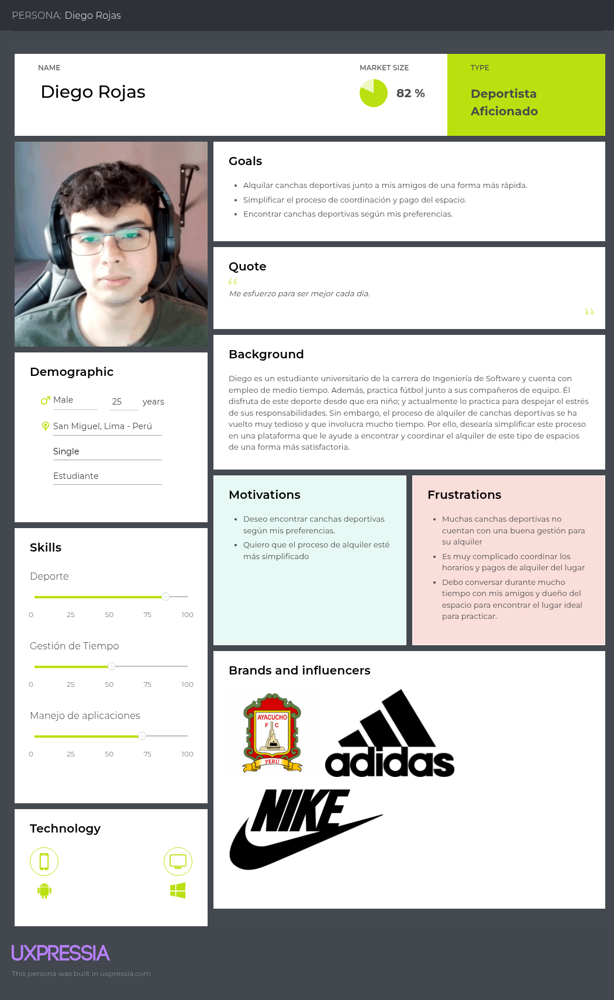

**Entrenadores Independientes:**

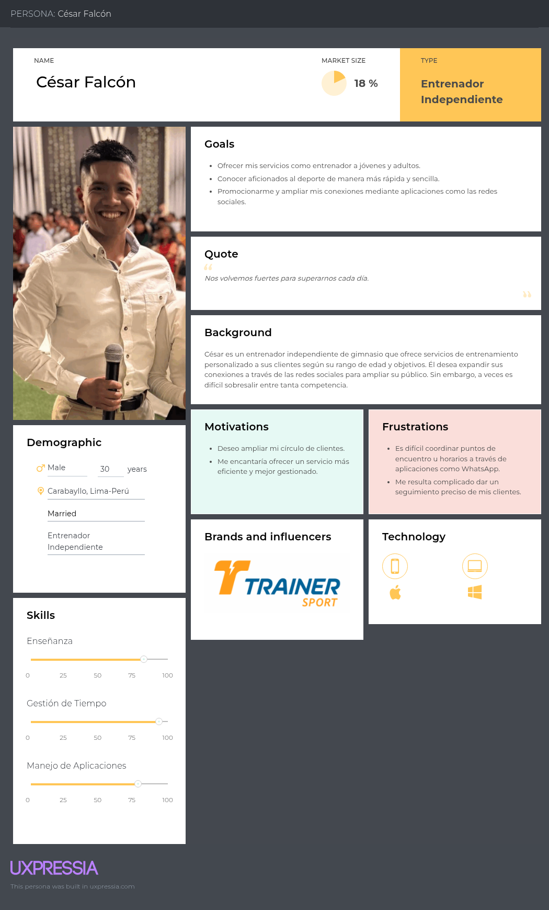

### 2.3.2. User Task Matrix

En esta sección se presenta el User Task Matrix construido a partir de los User Persona, quienes representan a cada segmento objetivo identificado. En este se listan las tareas realizadas por estos usuarios basado en el análisis de entrevistas, cada una fue evaluada según su frecuencia y nivel de importancia para los respectivos perfiles.

| Actividades | Frecuencia (Diego Rojas) | Importancia (Diego Rojas) | Frecuencia (César Falcón) | Importancia (César Falcón) |
| ----------- | ------------------------ | ------------------------- | ------------------------- | -------------------------- |
| Buscar canchas disponibles según la ubicación | Alta | Alta | Media | Media |
| Comparar precios y horarios | Alta | Alta | Baja | Media |
| Reservar espacios deportivos | Alta | Alta | Media | Alta |
| Coordinar partidos o entrenamientos | Alta | Alta | Alta | Alta |
| Evaluar calidad y servicios del espacio deportivo | Media | Alta | Media | Media |
| Coordinar horarios con el dueño | Alta | Alta | Alta | Alta |
| Buscar entrenadores o clases | Media | Alta | Baja | Baja |
| Realizar pago por alquiler | Alta | Alta | Alta | Alta |
| Promocionar servicios deportivos | Baja | Baja | Alta | Alta |
| Gestionar horarios y disponibilidad | Baja | Media | Alta | Alta |
| Administrar clientes/alumnos | Baja | Baja | Alta | Alta |
| Fidelizar o mantener clientes | Baja | Media | Alta | Alta |

**Análisis:**

A partir de la tabla anterior, podemos identificar las tareas más críticas según el rol de cada usuario. Los deportistas aficionados se enfocan en tareas que les permita organizar sus partidos de forma rápida y sin complicaciones con actividades como la búsqueda de canchas, comparar opciones, reservar y coordinar con sus amigos. Por otro lado, los entrenadores independientes están más centrados en coordinar entrenamientos, gestionar horarios, manejar pagos, administrar clientes y promocionar sus servicios. Su necesidad principal es ordenar y hacer crecer su actividad como un negocio.

Ambos coinciden en tareas clave como coordinar actividades, comunicarse y gestionar pagos. Pero la diferencia principal está en el enfoque: mientras unos consumen el servicio, otros lo gestionan y monetizan. Por eso, la solución debe ser rápida y sencilla para unos, pero más completa y organizada para otros.

### 2.3.3. User Journey Mapping

En esta sección se presentan los User Journey Maps donde se describe el proceso actual que siguen nuestros User Personas para lograr su objetivo sin contar aún con una solución tecnológica integrada, mostrando los puntos críticos, emociones, tareas clave y oportunidades de mejora. Estos recorridos nos permiten entender los desafíos que enfrentan los usuarios día a día.

**Deportistas Aficionados:**

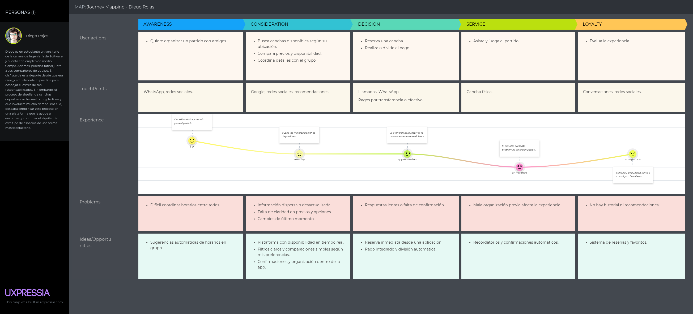

**Entrenadores Independientes:**

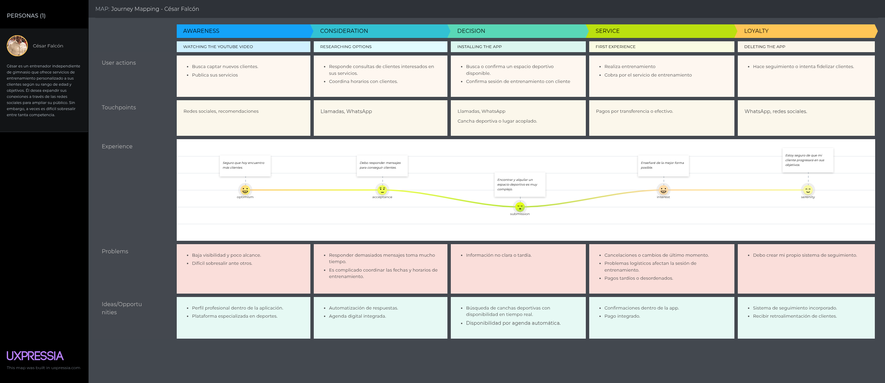

### 2.3.4. Empathy Mapping

En esta sección se presentan los Empathy Mappings. Estos nos ayudarán a comprender las experiencias, emociones y pensamientos que expresan los usuarios de cada segmento objetivo.

**Deportistas Aficionados:**

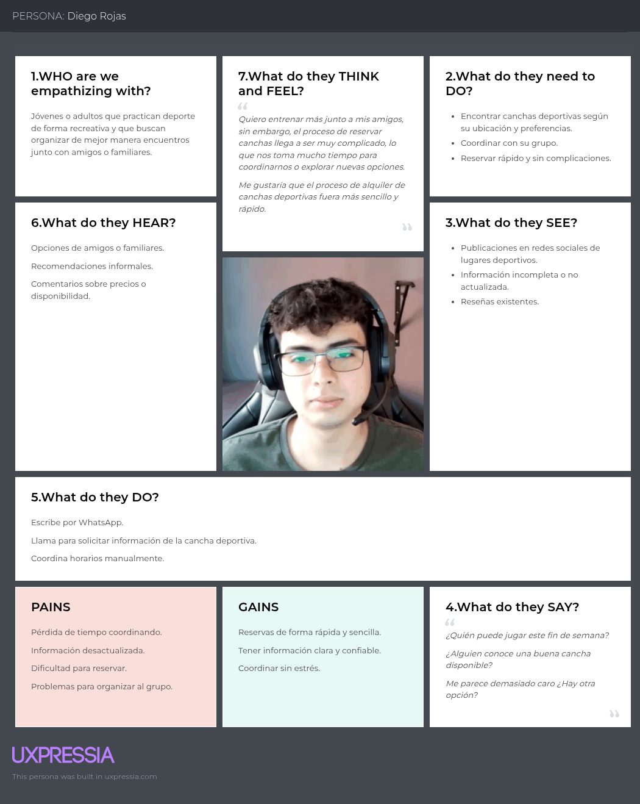

**Entrenadores Independientes:**

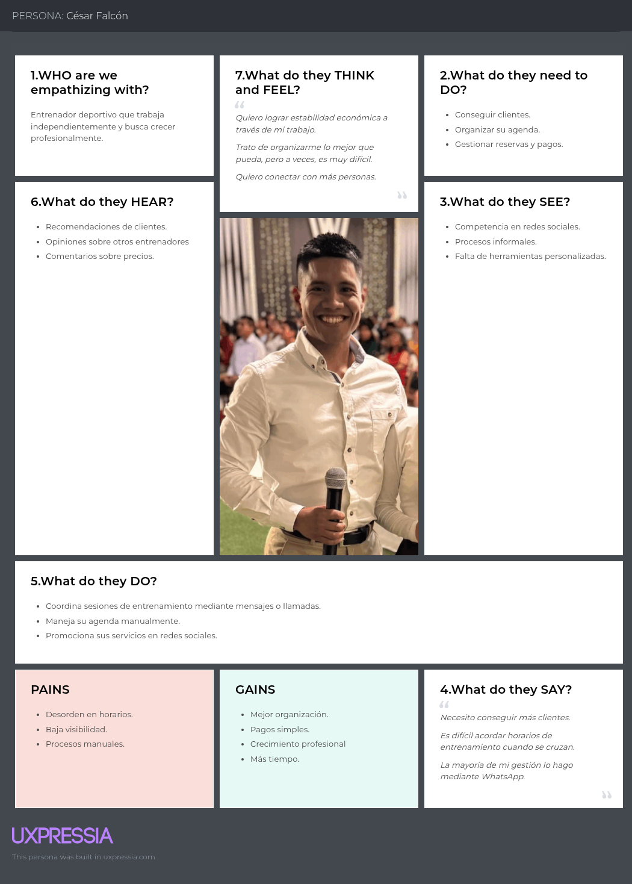

### 2.3.5. Big Picture EventStorming

### 2.3.6. Ubiquitous Language

---

## 2.4. Requirements specification

### 2.4.1. User Stories

| Epic ID | Epic | Descripción |
|---|---|---|
| EP01 | Gestión de cuentas y acceso | Permite a jugadores y entrenadores registrarse, iniciar sesión, cerrar sesión y administrar el acceso seguro a la aplicación móvil Courtly. |
| EP02 | Búsqueda y exploración | Permite a los usuarios buscar canchas y entrenadores mediante filtros relevantes como ubicación, deporte, precio y disponibilidad. |
| EP03 | Reservas y agenda | Permite a los jugadores reservar canchas o sesiones, y a los entrenadores gestionar su disponibilidad y solicitudes recibidas. |
| EP04 | Pagos y suscripciones | Permite procesar pagos dentro de la app y administrar planes o beneficios asociados al uso de Courtly. |
| EP05 | Reseñas y reputación | Permite a los jugadores calificar canchas y entrenadores, fortaleciendo la confianza y transparencia dentro de la plataforma. |
| EP06 | Comunidad y torneos | Permite organizar partidos, unirse a eventos deportivos y participar en torneos desde la aplicación móvil. |
| EP07 | Perfil y notificaciones | Permite a los usuarios administrar su perfil, visualizar su actividad y recibir notificaciones relevantes dentro de la app. |

<div>

  <h2>USM01</h2>
  <table border="1" cellspacing="0" cellpadding="8" width="100%">
    <tr>
      <th>Story ID</th>
      <th>User</th>
      <th>Priority</th>
      <th>Epic</th>
    </tr>
    <tr>
      <td>USM01</td>
      <td>Jugador</td>
      <td>Alta</td>
      <td>EP01</td>
    </tr>
    <tr>
      <th>Title</th>
      <td colspan="3">Registrar cuenta de jugador en Courtly</td>
    </tr>
    <tr>
      <th colspan="4">Description</th>
    </tr>
    <tr>
      <td colspan="4">Como jugador, quiero registrarme en la aplicación móvil Courtly, para acceder a las funcionalidades de búsqueda, reserva y gestión de actividades deportivas.</td>
    </tr>
    <tr>
      <th colspan="4">Acceptance Criteria</th>
    </tr>
    <tr>
      <td colspan="4">
        <b>Escenario 1: Registro exitoso</b><br>
        Given que el jugador se encuentra en la pantalla de registro,<br>
        When completa sus datos obligatorios correctamente y confirma el formulario,<br>
        Then la aplicación crea su cuenta y muestra un mensaje de confirmación.<br><br>
        <b>Escenario 2: Campos obligatorios incompletos</b><br>
        Given que el jugador deja campos requeridos vacíos,<br>
        When intenta registrarse,<br>
        Then la aplicación muestra mensajes de validación y no permite continuar.<br><br>
        <b>Escenario 3: Correo duplicado</b><br>
        Given que el correo ingresado ya existe en la plataforma,<br>
        When el jugador confirma su registro,<br>
        Then la aplicación informa que el correo ya está en uso.
      </td>
    </tr>
  </table>

  <br>

  <h2>USM02</h2>
  <table border="1" cellspacing="0" cellpadding="8" width="100%">
    <tr>
      <th>Story ID</th>
      <th>User</th>
      <th>Priority</th>
      <th>Epic</th>
    </tr>
    <tr>
      <td>USM02</td>
      <td>Jugador</td>
      <td>Alta</td>
      <td>EP01</td>
    </tr>
    <tr>
      <th>Title</th>
      <td colspan="3">Iniciar sesión como jugador</td>
    </tr>
    <tr>
      <th colspan="4">Description</th>
    </tr>
    <tr>
      <td colspan="4">Como jugador, quiero iniciar sesión en Courtly, para acceder rápidamente a mi perfil, reservas y funciones personalizadas.</td>
    </tr>
    <tr>
      <th colspan="4">Acceptance Criteria</th>
    </tr>
    <tr>
      <td colspan="4">
        <b>Escenario 1: Inicio de sesión válido</b><br>
        Given que el jugador ingresa credenciales correctas,<br>
        When pulsa el botón de iniciar sesión,<br>
        Then la aplicación permite el acceso y muestra la pantalla principal.<br><br>
        <b>Escenario 2: Credenciales inválidas</b><br>
        Given que el jugador ingresa datos incorrectos,<br>
        When intenta iniciar sesión,<br>
        Then la aplicación muestra un mensaje de error y mantiene al usuario en la pantalla de acceso.<br><br>
        <b>Escenario 3: Sesión persistente</b><br>
        Given que el jugador inició sesión correctamente,<br>
        When vuelve a abrir la aplicación,<br>
        Then Courtly conserva la sesión mientras siga vigente.
      </td>
    </tr>
  </table>

  <br>

  <h2>USM03</h2>
  <table border="1" cellspacing="0" cellpadding="8" width="100%">
    <tr>
      <th>Story ID</th>
      <th>User</th>
      <th>Priority</th>
      <th>Epic</th>
    </tr>
    <tr>
      <td>USM03</td>
      <td>Jugador</td>
      <td>Alta</td>
      <td>EP02</td>
    </tr>
    <tr>
      <th>Title</th>
      <td colspan="3">Buscar canchas por ubicación</td>
    </tr>
    <tr>
      <th colspan="4">Description</th>
    </tr>
    <tr>
      <td colspan="4">Como jugador, quiero buscar canchas deportivas por ubicación desde la app, para encontrar opciones cercanas y disponibles.</td>
    </tr>
    <tr>
      <th colspan="4">Acceptance Criteria</th>
    </tr>
    <tr>
      <td colspan="4">
        <b>Escenario 1: Búsqueda con resultados</b><br>
        Given que el jugador selecciona una ubicación válida,<br>
        When ejecuta la búsqueda,<br>
        Then la aplicación muestra una lista de canchas relacionadas con esa ubicación.<br><br>
        <b>Escenario 2: Búsqueda sin resultados</b><br>
        Given que no existen canchas disponibles en la zona consultada,<br>
        When el jugador realiza la búsqueda,<br>
        Then la aplicación muestra un mensaje indicando que no hay resultados.<br><br>
        <b>Escenario 3: Visualización del detalle resumido</b><br>
        Given que la búsqueda devuelve canchas disponibles,<br>
        When el jugador revisa la lista,<br>
        Then cada cancha muestra nombre, ubicación, precio y disponibilidad.
      </td>
    </tr>
  </table>

  <br>

  <h2>USM04</h2>
  <table border="1" cellspacing="0" cellpadding="8" width="100%">
    <tr>
      <th>Story ID</th>
      <th>User</th>
      <th>Priority</th>
      <th>Epic</th>
    </tr>
    <tr>
      <td>USM04</td>
      <td>Jugador</td>
      <td>Alta</td>
      <td>EP02</td>
    </tr>
    <tr>
      <th>Title</th>
      <td colspan="3">Filtrar canchas por deporte, precio y horario</td>
    </tr>
    <tr>
      <th colspan="4">Description</th>
    </tr>
    <tr>
      <td colspan="4">Como jugador, quiero aplicar filtros en la búsqueda de canchas, para encontrar la opción que mejor se adapte a mis necesidades.</td>
    </tr>
    <tr>
      <th colspan="4">Acceptance Criteria</th>
    </tr>
    <tr>
      <td colspan="4">
        <b>Escenario 1: Filtrado por deporte</b><br>
        Given que el jugador selecciona un deporte específico,<br>
        When aplica el filtro correspondiente,<br>
        Then la aplicación muestra solo canchas de ese deporte.<br><br>
        <b>Escenario 2: Filtrado por precio</b><br>
        Given que el jugador define un rango de precios,<br>
        When confirma los filtros,<br>
        Then la aplicación actualiza la lista según el rango seleccionado.<br><br>
        <b>Escenario 3: Filtrado combinado</b><br>
        Given que el jugador utiliza filtros de deporte, horario y precio al mismo tiempo,<br>
        When ejecuta la búsqueda,<br>
        Then la aplicación muestra únicamente resultados que cumplan todas las condiciones.
      </td>
    </tr>
  </table>

  <br>

  <h2>USM05</h2>
  <table border="1" cellspacing="0" cellpadding="8" width="100%">
    <tr>
      <th>Story ID</th>
      <th>User</th>
      <th>Priority</th>
      <th>Epic</th>
    </tr>
    <tr>
      <td>USM05</td>
      <td>Jugador</td>
      <td>Alta</td>
      <td>EP03</td>
    </tr>
    <tr>
      <th>Title</th>
      <td colspan="3">Ver detalle de cancha</td>
    </tr>
    <tr>
      <th colspan="4">Description</th>
    </tr>
    <tr>
      <td colspan="4">Como jugador, quiero visualizar el detalle de una cancha, para decidir si se ajusta a lo que necesito antes de reservar.</td>
    </tr>
    <tr>
      <th colspan="4">Acceptance Criteria</th>
    </tr>
    <tr>
      <td colspan="4">
        <b>Escenario 1: Consulta de información completa</b><br>
        Given que el jugador selecciona una cancha desde los resultados,<br>
        When abre la pantalla de detalle,<br>
        Then la aplicación muestra información ampliada de la cancha.<br><br>
        <b>Escenario 2: Visualización de horarios</b><br>
        Given que la cancha tiene horarios configurados,<br>
        When el jugador revisa el detalle,<br>
        Then la aplicación muestra la disponibilidad correspondiente.<br><br>
        <b>Escenario 3: Cancha sin disponibilidad</b><br>
        Given que la cancha no tiene horarios libres,<br>
        When el jugador revisa el detalle,<br>
        Then la aplicación informa que no existen espacios disponibles.
      </td>
    </tr>
  </table>

  <br>

  <h2>USM06</h2>
  <table border="1" cellspacing="0" cellpadding="8" width="100%">
    <tr>
      <th>Story ID</th>
      <th>User</th>
      <th>Priority</th>
      <th>Epic</th>
    </tr>
    <tr>
      <td>USM06</td>
      <td>Jugador</td>
      <td>Alta</td>
      <td>EP03</td>
    </tr>
    <tr>
      <th>Title</th>
      <td colspan="3">Reservar cancha desde Courtly</td>
    </tr>
    <tr>
      <th colspan="4">Description</th>
    </tr>
    <tr>
      <td colspan="4">Como jugador, quiero reservar una cancha desde la app, para asegurar mi espacio de juego en una fecha y hora determinadas.</td>
    </tr>
    <tr>
      <th colspan="4">Acceptance Criteria</th>
    </tr>
    <tr>
      <td colspan="4">
        <b>Escenario 1: Reserva exitosa</b><br>
        Given que el jugador selecciona una cancha y un horario disponible,<br>
        When confirma la reserva,<br>
        Then la aplicación registra la operación y muestra su confirmación.<br><br>
        <b>Escenario 2: Horario ocupado</b><br>
        Given que otro usuario tomó el mismo horario previamente,<br>
        When el jugador intenta confirmar la reserva,<br>
        Then la aplicación informa que el espacio ya no está disponible.<br><br>
        <b>Escenario 3: Resumen antes de confirmar</b><br>
        Given que el jugador está por finalizar la reserva,<br>
        When revisa el paso final del proceso,<br>
        Then la aplicación muestra cancha, fecha, hora y costo.
      </td>
    </tr>
  </table>

  <br>

  <h2>USM07</h2>
  <table border="1" cellspacing="0" cellpadding="8" width="100%">
    <tr>
      <th>Story ID</th>
      <th>User</th>
      <th>Priority</th>
      <th>Epic</th>
    </tr>
    <tr>
      <td>USM07</td>
      <td>Jugador</td>
      <td>Alta</td>
      <td>EP04</td>
    </tr>
    <tr>
      <th>Title</th>
      <td colspan="3">Pagar reserva desde la aplicación</td>
    </tr>
    <tr>
      <th colspan="4">Description</th>
    </tr>
    <tr>
      <td colspan="4">Como jugador, quiero pagar mi reserva desde Courtly, para completar el proceso de forma rápida y segura.</td>
    </tr>
    <tr>
      <th colspan="4">Acceptance Criteria</th>
    </tr>
    <tr>
      <td colspan="4">
        <b>Escenario 1: Pago aprobado</b><br>
        Given que el jugador tiene una reserva pendiente de pago,<br>
        When ingresa un método válido y confirma la operación,<br>
        Then la aplicación procesa el pago y actualiza el estado de la reserva.<br><br>
        <b>Escenario 2: Pago rechazado</b><br>
        Given que ocurre un error durante la transacción,<br>
        When el jugador intenta pagar,<br>
        Then la aplicación muestra el rechazo y mantiene la reserva pendiente según corresponda.<br><br>
        <b>Escenario 3: Confirmación de pago</b><br>
        Given que la operación fue exitosa,<br>
        When el jugador revisa la reserva,<br>
        Then la aplicación muestra el comprobante o confirmación asociada.
      </td>
    </tr>
  </table>

  <br>

  <h2>USM08</h2>
  <table border="1" cellspacing="0" cellpadding="8" width="100%">
    <tr>
      <th>Story ID</th>
      <th>User</th>
      <th>Priority</th>
      <th>Epic</th>
    </tr>
    <tr>
      <td>USM08</td>
      <td>Jugador</td>
      <td>Media</td>
      <td>EP05</td>
    </tr>
    <tr>
      <th>Title</th>
      <td colspan="3">Valorar una cancha utilizada</td>
    </tr>
    <tr>
      <th colspan="4">Description</th>
    </tr>
    <tr>
      <td colspan="4">Como jugador, quiero valorar una cancha después de usarla, para compartir mi experiencia con otros usuarios.</td>
    </tr>
    <tr>
      <th colspan="4">Acceptance Criteria</th>
    </tr>
    <tr>
      <td colspan="4">
        <b>Escenario 1: Reseña publicada</b><br>
        Given que el jugador completó una reserva,<br>
        When registra una calificación y comentario válidos,<br>
        Then la aplicación publica la reseña en el perfil de la cancha.<br><br>
        <b>Escenario 2: Restricción por no haber usado el servicio</b><br>
        Given que el jugador no completó ninguna reserva de esa cancha,<br>
        When intenta valorar el servicio,<br>
        Then la aplicación no permite publicar la reseña.<br><br>
        <b>Escenario 3: Visualización de reseña</b><br>
        Given que la reseña fue registrada correctamente,<br>
        When otros usuarios ingresan al detalle de la cancha,<br>
        Then la aplicación muestra la valoración publicada.
      </td>
    </tr>
  </table>

  <br>

  <h2>USM09</h2>
  <table border="1" cellspacing="0" cellpadding="8" width="100%">
    <tr>
      <th>Story ID</th>
      <th>User</th>
      <th>Priority</th>
      <th>Epic</th>
    </tr>
    <tr>
      <td>USM09</td>
      <td>Jugador</td>
      <td>Media</td>
      <td>EP06</td>
    </tr>
    <tr>
      <th>Title</th>
      <td colspan="3">Crear partido con amigos</td>
    </tr>
    <tr>
      <th colspan="4">Description</th>
    </tr>
    <tr>
      <td colspan="4">Como jugador, quiero crear un partido desde Courtly, para organizar encuentros deportivos con mis amigos o contactos.</td>
    </tr>
    <tr>
      <th colspan="4">Acceptance Criteria</th>
    </tr>
    <tr>
      <td colspan="4">
        <b>Escenario 1: Partido creado correctamente</b><br>
        Given que el jugador completa los datos del partido,<br>
        When confirma la creación,<br>
        Then la aplicación registra el evento y lo muestra en su agenda.<br><br>
        <b>Escenario 2: Datos incompletos</b><br>
        Given que faltan datos obligatorios del partido,<br>
        When el jugador intenta guardarlo,<br>
        Then la aplicación solicita completar la información requerida.<br><br>
        <b>Escenario 3: Invitación a participantes</b><br>
        Given que el partido fue creado,<br>
        When el jugador selecciona contactos para invitar,<br>
        Then la aplicación registra o envía las invitaciones correspondientes.
      </td>
    </tr>
  </table>

  <br>

  <h2>USM10</h2>
  <table border="1" cellspacing="0" cellpadding="8" width="100%">
    <tr>
      <th>Story ID</th>
      <th>User</th>
      <th>Priority</th>
      <th>Epic</th>
    </tr>
    <tr>
      <td>USM10</td>
      <td>Jugador</td>
      <td>Media</td>
      <td>EP06</td>
    </tr>
    <tr>
      <th>Title</th>
      <td colspan="3">Unirse a un partido disponible</td>
    </tr>
    <tr>
      <th colspan="4">Description</th>
    </tr>
    <tr>
      <td colspan="4">Como jugador, quiero unirme a partidos publicados en la plataforma, para participar en actividades deportivas organizadas por otros usuarios.</td>
    </tr>
    <tr>
      <th colspan="4">Acceptance Criteria</th>
    </tr>
    <tr>
      <td colspan="4">
        <b>Escenario 1: Unión exitosa a partido</b><br>
        Given que existe un partido con cupos disponibles,<br>
        When el jugador selecciona la opción de participar,<br>
        Then la aplicación registra su incorporación al evento.<br><br>
        <b>Escenario 2: Partido sin cupos</b><br>
        Given que el partido ya alcanzó su límite de participantes,<br>
        When el jugador intenta unirse,<br>
        Then la aplicación informa que no hay cupos disponibles.<br><br>
        <b>Escenario 3: Confirmación de participación</b><br>
        Given que el jugador se unió correctamente al partido,<br>
        When revisa el detalle del evento,<br>
        Then la aplicación lo muestra dentro de la lista de participantes.
      </td>
    </tr>
  </table>

  <br>

  <h2>USM11</h2>
  <table border="1" cellspacing="0" cellpadding="8" width="100%">
    <tr>
      <th>Story ID</th>
      <th>User</th>
      <th>Priority</th>
      <th>Epic</th>
    </tr>
    <tr>
      <td>USM11</td>
      <td>Entrenador</td>
      <td>Alta</td>
      <td>EP01</td>
    </tr>
    <tr>
      <th>Title</th>
      <td colspan="3">Registrar cuenta de entrenador</td>
    </tr>
    <tr>
      <th colspan="4">Description</th>
    </tr>
    <tr>
      <td colspan="4">Como entrenador, quiero registrarme en Courtly, para ofrecer mis servicios y ser encontrado por jugadores dentro de la plataforma.</td>
    </tr>
    <tr>
      <th colspan="4">Acceptance Criteria</th>
    </tr>
    <tr>
      <td colspan="4">
        <b>Escenario 1: Registro profesional exitoso</b><br>
        Given que el entrenador completa sus datos personales y profesionales correctamente,<br>
        When confirma el registro,<br>
        Then la aplicación crea su cuenta y habilita su perfil profesional.<br><br>
        <b>Escenario 2: Datos profesionales incompletos</b><br>
        Given que faltan campos obligatorios del perfil profesional,<br>
        When intenta registrarse,<br>
        Then la aplicación solicita completar la información faltante.<br><br>
        <b>Escenario 3: Correo ya existente</b><br>
        Given que el correo del entrenador ya está registrado,<br>
        When confirma el formulario,<br>
        Then la aplicación informa que no puede crear una nueva cuenta con ese correo.
      </td>
    </tr>
  </table>

  <br>

  <h2>USM12</h2>
  <table border="1" cellspacing="0" cellpadding="8" width="100%">
    <tr>
      <th>Story ID</th>
      <th>User</th>
      <th>Priority</th>
      <th>Epic</th>
    </tr>
    <tr>
      <td>USM12</td>
      <td>Entrenador</td>
      <td>Alta</td>
      <td>EP07</td>
    </tr>
    <tr>
      <th>Title</th>
      <td colspan="3">Actualizar perfil profesional</td>
    </tr>
    <tr>
      <th colspan="4">Description</th>
    </tr>
    <tr>
      <td colspan="4">Como entrenador, quiero actualizar mi perfil profesional, para mostrar información vigente y atractiva a los jugadores.</td>
    </tr>
    <tr>
      <th colspan="4">Acceptance Criteria</th>
    </tr>
    <tr>
      <td colspan="4">
        <b>Escenario 1: Actualización exitosa</b><br>
        Given que el entrenador accede a su perfil,<br>
        When edita y guarda sus datos correctamente,<br>
        Then la aplicación actualiza la información visible en su perfil.<br><br>
        <b>Escenario 2: Datos inválidos</b><br>
        Given que el entrenador ingresa valores con formato incorrecto,<br>
        When intenta guardar cambios,<br>
        Then la aplicación muestra mensajes de validación.<br><br>
        <b>Escenario 3: Visualización pública actualizada</b><br>
        Given que el perfil fue actualizado con éxito,<br>
        When los jugadores consultan ese perfil,<br>
        Then la aplicación muestra la información más reciente.
      </td>
    </tr>
  </table>

  <br>

  <h2>USM13</h2>
  <table border="1" cellspacing="0" cellpadding="8" width="100%">
    <tr>
      <th>Story ID</th>
      <th>User</th>
      <th>Priority</th>
      <th>Epic</th>
    </tr>
    <tr>
      <td>USM13</td>
      <td>Entrenador</td>
      <td>Alta</td>
      <td>EP03</td>
    </tr>
    <tr>
      <th>Title</th>
      <td colspan="3">Publicar disponibilidad de horarios</td>
    </tr>
    <tr>
      <th colspan="4">Description</th>
    </tr>
    <tr>
      <td colspan="4">Como entrenador, quiero publicar mis horarios disponibles, para que los jugadores puedan reservar sesiones conmigo.</td>
    </tr>
    <tr>
      <th colspan="4">Acceptance Criteria</th>
    </tr>
    <tr>
      <td colspan="4">
        <b>Escenario 1: Agenda publicada</b><br>
        Given que el entrenador configura horarios disponibles,<br>
        When guarda la información,<br>
        Then la aplicación publica esos espacios en su perfil.<br><br>
        <b>Escenario 2: Edición de disponibilidad</b><br>
        Given que el entrenador ya tiene horarios registrados,<br>
        When modifica su agenda y guarda los cambios,<br>
        Then la aplicación actualiza la disponibilidad mostrada.<br><br>
        <b>Escenario 3: Visualización por jugadores</b><br>
        Given que el entrenador tiene disponibilidad activa,<br>
        When un jugador revisa su perfil,<br>
        Then la aplicación muestra los horarios disponibles para reserva.
      </td>
    </tr>
  </table>

  <br>

  <h2>USM14</h2>
  <table border="1" cellspacing="0" cellpadding="8" width="100%">
    <tr>
      <th>Story ID</th>
      <th>User</th>
      <th>Priority</th>
      <th>Epic</th>
    </tr>
    <tr>
      <td>USM14</td>
      <td>Entrenador</td>
      <td>Alta</td>
      <td>EP03</td>
    </tr>
    <tr>
      <th>Title</th>
      <td colspan="3">Aceptar o rechazar solicitudes de entrenamiento</td>
    </tr>
    <tr>
      <th colspan="4">Description</th>
    </tr>
    <tr>
      <td colspan="4">Como entrenador, quiero aceptar o rechazar solicitudes de reserva, para administrar adecuadamente mi tiempo y mi agenda.</td>
    </tr>
    <tr>
      <th colspan="4">Acceptance Criteria</th>
    </tr>
    <tr>
      <td colspan="4">
        <b>Escenario 1: Solicitud aceptada</b><br>
        Given que el entrenador recibe una solicitud pendiente,<br>
        When selecciona la opción de aceptar,<br>
        Then la aplicación cambia el estado de la reserva y notifica al jugador.<br><br>
        <b>Escenario 2: Solicitud rechazada</b><br>
        Given que el entrenador recibe una solicitud pendiente,<br>
        When selecciona la opción de rechazar,<br>
        Then la aplicación actualiza el estado y comunica la decisión al jugador.<br><br>
        <b>Escenario 3: Consulta de solicitudes</b><br>
        Given que existen solicitudes enviadas al entrenador,<br>
        When accede a su bandeja o sección de reservas,<br>
        Then la aplicación muestra el listado de solicitudes pendientes y procesadas.
      </td>
    </tr>
  </table>

  <br>

  <h2>USM15</h2>
  <table border="1" cellspacing="0" cellpadding="8" width="100%">
    <tr>
      <th>Story ID</th>
      <th>User</th>
      <th>Priority</th>
      <th>Epic</th>
    </tr>
    <tr>
      <td>USM15</td>
      <td>Entrenador</td>
      <td>Media</td>
      <td>EP04</td>
    </tr>
    <tr>
      <th>Title</th>
      <td colspan="3">Visualizar pagos recibidos</td>
    </tr>
    <tr>
      <th colspan="4">Description</th>
    </tr>
    <tr>
      <td colspan="4">Como entrenador, quiero visualizar mis pagos recibidos en Courtly, para tener control de mis ingresos dentro de la plataforma.</td>
    </tr>
    <tr>
      <th colspan="4">Acceptance Criteria</th>
    </tr>
    <tr>
      <td colspan="4">
        <b>Escenario 1: Consulta de historial de pagos</b><br>
        Given que el entrenador tiene ingresos registrados,<br>
        When accede a la sección de pagos,<br>
        Then la aplicación muestra su historial de movimientos.<br><br>
        <b>Escenario 2: Detalle de transacción</b><br>
        Given que el entrenador selecciona un pago específico,<br>
        When abre el detalle del movimiento,<br>
        Then la aplicación muestra información ampliada de la operación.<br><br>
        <b>Escenario 3: Sin pagos registrados</b><br>
        Given que el entrenador aún no tiene ingresos asociados,<br>
        When ingresa a la sección de pagos,<br>
        Then la aplicación muestra un mensaje indicando que no hay movimientos.
      </td>
    </tr>
  </table>

  <br>

  <h2>USM16</h2>
  <table border="1" cellspacing="0" cellpadding="8" width="100%">
    <tr>
      <th>Story ID</th>
      <th>User</th>
      <th>Priority</th>
      <th>Epic</th>
    </tr>
    <tr>
      <td>USM16</td>
      <td>Entrenador</td>
      <td>Media</td>
      <td>EP05</td>
    </tr>
    <tr>
      <th>Title</th>
      <td colspan="3">Recibir reseñas de jugadores</td>
    </tr>
    <tr>
      <th colspan="4">Description</th>
    </tr>
    <tr>
      <td colspan="4">Como entrenador, quiero recibir reseñas de mis clientes, para fortalecer mi reputación dentro de Courtly.</td>
    </tr>
    <tr>
      <th colspan="4">Acceptance Criteria</th>
    </tr>
    <tr>
      <td colspan="4">
        <b>Escenario 1: Publicación de reseña</b><br>
        Given que un jugador completó una sesión con el entrenador,<br>
        When registra su valoración,<br>
        Then la aplicación publica la reseña en el perfil del entrenador.<br><br>
        <b>Escenario 2: Reputación actualizada</b><br>
        Given que existen nuevas valoraciones registradas,<br>
        When otros usuarios revisan el perfil del entrenador,<br>
        Then la aplicación refleja la reputación actualizada.<br><br>
        <b>Escenario 3: Restricción de reseña inválida</b><br>
        Given que un usuario no tuvo una reserva válida con el entrenador,<br>
        When intenta publicar una opinión,<br>
        Then la aplicación no permite registrar la reseña.
      </td>
    </tr>
  </table>

  <br>

  <h2>USM17</h2>
  <table border="1" cellspacing="0" cellpadding="8" width="100%">
    <tr>
      <th>Story ID</th>
      <th>User</th>
      <th>Priority</th>
      <th>Epic</th>
    </tr>
    <tr>
      <td>USM17</td>
      <td>Entrenador</td>
      <td>Media</td>
      <td>EP07</td>
    </tr>
    <tr>
      <th>Title</th>
      <td colspan="3">Ver estadísticas de rendimiento</td>
    </tr>
    <tr>
      <th colspan="4">Description</th>
    </tr>
    <tr>
      <td colspan="4">Como entrenador, quiero visualizar estadísticas de mi actividad en la aplicación, para medir mi desempeño y mejorar mis servicios.</td>
    </tr>
    <tr>
      <th colspan="4">Acceptance Criteria</th>
    </tr>
    <tr>
      <td colspan="4">
        <b>Escenario 1: Consulta de métricas</b><br>
        Given que el entrenador accede a su panel de estadísticas,<br>
        When abre la sección correspondiente,<br>
        Then la aplicación muestra indicadores de actividad y rendimiento.<br><br>
        <b>Escenario 2: Datos históricos disponibles</b><br>
        Given que el entrenador tiene actividad previa registrada,<br>
        When revisa sus estadísticas,<br>
        Then la aplicación presenta datos acumulados o resumidos.<br><br>
        <b>Escenario 3: Ausencia de datos</b><br>
        Given que el entrenador todavía no cuenta con historial suficiente,<br>
        When consulta su panel,<br>
        Then la aplicación informa que aún no hay información para mostrar.
      </td>
    </tr>
  </table>

  <br>

  <h2>USM18</h2>
  <table border="1" cellspacing="0" cellpadding="8" width="100%">
    <tr>
      <th>Story ID</th>
      <th>User</th>
      <th>Priority</th>
      <th>Epic</th>
    </tr>
    <tr>
      <td>USM18</td>
      <td>Usuario</td>
      <td>Alta</td>
      <td>EP07</td>
    </tr>
    <tr>
      <th>Title</th>
      <td colspan="3">Recibir notificaciones relevantes en la app</td>
    </tr>
    <tr>
      <th colspan="4">Description</th>
    </tr>
    <tr>
      <td colspan="4">Como usuario, quiero recibir notificaciones relevantes dentro de Courtly, para enterarme oportunamente de cambios, reservas y novedades importantes.</td>
    </tr>
    <tr>
      <th colspan="4">Acceptance Criteria</th>
    </tr>
    <tr>
      <td colspan="4">
        <b>Escenario 1: Notificación por reserva</b><br>
        Given que ocurre un evento relacionado con una reserva del usuario,<br>
        When el sistema registra dicho cambio,<br>
        Then la aplicación envía una notificación correspondiente.<br><br>
        <b>Escenario 2: Notificación por cambio de estado</b><br>
        Given que una solicitud fue aceptada, rechazada o modificada,<br>
        When el sistema actualiza su estado,<br>
        Then la aplicación notifica al usuario afectado.<br><br>
        <b>Escenario 3: Consulta del historial</b><br>
        Given que el usuario accede a la sección de notificaciones,<br>
        When revisa su historial,<br>
        Then la aplicación muestra las notificaciones registradas previamente.
      </td>
    </tr>
  </table>

  <br>

  <h2>USM19</h2>
  <table border="1" cellspacing="0" cellpadding="8" width="100%">
    <tr>
      <th>Story ID</th>
      <th>User</th>
      <th>Priority</th>
      <th>Epic</th>
    </tr>
    <tr>
      <td>USM19</td>
      <td>Usuario</td>
      <td>Media</td>
      <td>EP07</td>
    </tr>
    <tr>
      <th>Title</th>
      <td colspan="3">Editar perfil personal</td>
    </tr>
    <tr>
      <th colspan="4">Description</th>
    </tr>
    <tr>
      <td colspan="4">Como usuario, quiero editar mi perfil personal en Courtly, para mantener actualizada mi información dentro de la aplicación.</td>
    </tr>
    <tr>
      <th colspan="4">Acceptance Criteria</th>
    </tr>
    <tr>
      <td colspan="4">
        <b>Escenario 1: Actualización correcta del perfil</b><br>
        Given que el usuario accede a su perfil,<br>
        When modifica sus datos y guarda los cambios,<br>
        Then la aplicación actualiza su información correctamente.<br><br>
        <b>Escenario 2: Validación de datos erróneos</b><br>
        Given que el usuario ingresa información inválida,<br>
        When intenta guardar los cambios,<br>
        Then la aplicación muestra errores de validación y no registra datos incorrectos.<br><br>
        <b>Escenario 3: Persistencia de datos</b><br>
        Given que el usuario actualizó su perfil exitosamente,<br>
        When vuelve a ingresar posteriormente a la aplicación,<br>
        Then la información modificada permanece almacenada.
      </td>
    </tr>
  </table>

  <br>

  <h2>USM20</h2>
  <table border="1" cellspacing="0" cellpadding="8" width="100%">
    <tr>
      <th>Story ID</th>
      <th>User</th>
      <th>Priority</th>
      <th>Epic</th>
    </tr>
    <tr>
      <td>USM20</td>
      <td>Usuario</td>
      <td>Media</td>
      <td>EP03</td>
    </tr>
    <tr>
      <th>Title</th>
      <td colspan="3">Cancelar una reserva registrada</td>
    </tr>
    <tr>
      <th colspan="4">Description</th>
    </tr>
        <tr>
      <td colspan="4">
        Como usuario, quiero cancelar una reserva registrada desde la aplicación móvil Courtly, para poder liberar el horario reservado cuando ya no pueda asistir.
      </td>
    </tr>
    <tr>
      <th colspan="4">Acceptance Criteria</th>
    </tr>
    <tr>
      <td colspan="4">
        <b>Escenario 1: Cancelación exitosa de reserva</b><br>
        <b>Given</b> que el usuario tiene una reserva activa registrada en Courtly,<br>
        <b>When</b> selecciona la opción de cancelar y confirma la acción dentro del tiempo permitido,<br>
        <b>Then</b> la aplicación cambia el estado de la reserva a cancelada y muestra un mensaje de confirmación.<br><br>
        <b>Escenario 2: Visualización del estado actualizado</b><br>
        <b>Given</b> que el usuario canceló correctamente una reserva,<br>
        <b>When</b> accede al listado de sus reservas,<br>
        <b>Then</b> la aplicación muestra la reserva con estado cancelado.<br><br>
        <b>Escenario 3: Restricción por política de cancelación</b><br>
        <b>Given</b> que la reserva ya no cumple con las reglas de cancelación establecidas,<br>
        <b>When</b> el usuario intenta cancelarla,<br>
        <b>Then</b> la aplicación informa que la cancelación no está permitida.<br><br>
        <b>Escenario 4: Liberación de disponibilidad</b><br>
        <b>Given</b> que una reserva fue cancelada exitosamente,<br>
        <b>When</b> el sistema actualiza la agenda correspondiente,<br>
        <b>Then</b> el horario reservado vuelve a quedar disponible para futuras reservas.
      </td>
    </tr>
  </table>
</div>

### 2.4.2. Impact Mapping

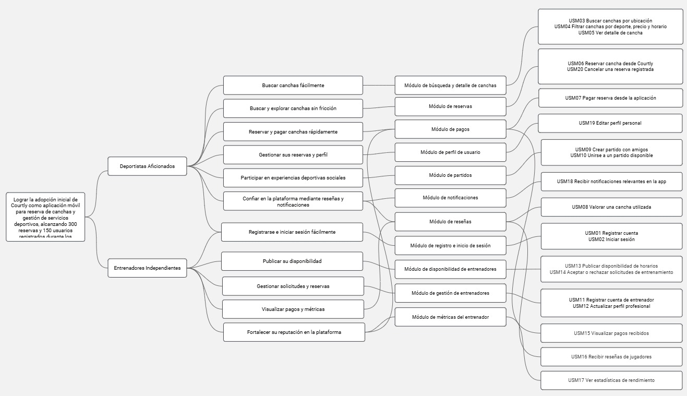

### 2.4.3. Product Backlog

<div>
  <h2>Product Backlog - Courtly</h2>
  <table border="1" cellspacing="0" cellpadding="8" width="100%">
    <tr>
      <th># Orden</th>
      <th>User Story Id</th>
      <th>Título</th>
      <th>Story Points<br>(1 / 2 / 3 / 5 / 8)</th>
    </tr>
    <tr>
      <td>1</td>
      <td>USM03</td>
      <td>Buscar canchas por ubicación</td>
      <td>5</td>
    </tr>
    <tr>
      <td>2</td>
      <td>USM04</td>
      <td>Filtrar canchas por deporte, precio y horario</td>
      <td>5</td>
    </tr>
    <tr>
      <td>3</td>
      <td>USM05</td>
      <td>Ver detalle de cancha</td>
      <td>3</td>
    </tr>
    <tr>
      <td>4</td>
      <td>USM06</td>
      <td>Reservar cancha desde Courtly</td>
      <td>8</td>
    </tr>
    <tr>
      <td>5</td>
      <td>USM07</td>
      <td>Pagar reserva desde la aplicación</td>
      <td>8</td>
    </tr>
    <tr>
      <td>6</td>
      <td>USM13</td>
      <td>Publicar disponibilidad de horarios</td>
      <td>5</td>
    </tr>
    <tr>
      <td>7</td>
      <td>USM14</td>
      <td>Aceptar o rechazar solicitudes de entrenamiento</td>
      <td>5</td>
    </tr>
    <tr>
      <td>8</td>
      <td>USM11</td>
      <td>Registrar cuenta de entrenador</td>
      <td>3</td>
    </tr>
    <tr>
      <td>9</td>
      <td>USM01</td>
      <td>Registrar cuenta de jugador en Courtly</td>
      <td>3</td>
    </tr>
    <tr>
      <td>10</td>
      <td>USM02</td>
      <td>Iniciar sesión como jugador</td>
      <td>3</td>
    </tr>
    <tr>
      <td>11</td>
      <td>USM12</td>
      <td>Actualizar perfil profesional</td>
      <td>3</td>
    </tr>
    <tr>
      <td>12</td>
      <td>USM18</td>
      <td>Recibir notificaciones relevantes en la app</td>
      <td>3</td>
    </tr>
    <tr>
      <td>13</td>
      <td>USM20</td>
      <td>Cancelar una reserva registrada</td>
      <td>3</td>
    </tr>
    <tr>
      <td>14</td>
      <td>USM19</td>
      <td>Editar perfil personal</td>
      <td>2</td>
    </tr>
    <tr>
      <td>15</td>
      <td>USM15</td>
      <td>Visualizar pagos recibidos</td>
      <td>3</td>
    </tr>
    <tr>
      <td>16</td>
      <td>USM08</td>
      <td>Valorar una cancha utilizada</td>
      <td>2</td>
    </tr>
    <tr>
      <td>17</td>
      <td>USM16</td>
      <td>Recibir reseñas de jugadores</td>
      <td>2</td>
    </tr>
    <tr>
      <td>18</td>
      <td>USM09</td>
      <td>Crear partido con amigos</td>
      <td>5</td>
    </tr>
    <tr>
      <td>19</td>
      <td>USM10</td>
      <td>Unirse a un partido disponible</td>
      <td>3</td>
    </tr>
    <tr>
      <td>20</td>
      <td>USM17</td>
      <td>Ver estadísticas de rendimiento</td>
      <td>3</td>
    </tr>
  </table>
</div>

---

## 2.5. Strategic-Level Domain-Driven Design

### 2.5.1. EventStorming

#### Introducción

EventStorming es una técnica colaborativa de modelado del dominio que permite al equipo visualizar y comprender los procesos de negocio a través de eventos que ocurren en el sistema. Para el proyecto Courtly, se realizó una sesión de EventStorming con el objetivo de identificar los eventos clave, los actores principales y los bounded contexts del dominio de reserva de canchas deportivas y conexión con entrenadores. Esta sesión facilitó la comunicación entre los miembros del equipo, permitiendo alinear una visión común del sistema y establecer una base sólida para el diseño de la arquitectura.

La sesión de EventStorming se llevó a cabo considerando los principales flujos de negocio: búsqueda y reserva de canchas, registro de entrenadores, gestión de pagos y sistema de valoraciones. El resultado fue un modelo visual que refleja las interacciones entre los actores principales (Deportistas, Entrenadores, Propietarios de Canchas) en el contexto del ecosistema deportivo amateur.

---

#### 2.5.1.1. Candidate Context Discovery

**Objetivo:**
Identificar y delimitar los contextos acotados (bounded contexts) que estructurarán el sistema Courtly, asegurando que cada contexto posea un propósito claro, un vocabulario ubicuo específico y reglas de negocio bien delimitadas.

**Proceso Realizado:**

La sesión de Candidate Context Discovery se llevó a cabo aplicando las técnicas recomendadas en Domain-Driven Design (DDD), que permitieron descomponer el dominio deportivo amateur en áreas funcionales coherentes y manejables.

1. **Start-with-Value (Comenzar por el Valor):**
   - Se identificaron las áreas de mayor valor de negocio en Courtly:
     - Búsqueda y reserva de canchas disponibles para deportistas
     - Registro y visibilidad de entrenadores independientes
     - Gestión de pagos y transacciones
     - Sistema de valoraciones y confianza entre usuarios

2. **Start-with-Simple (Comenzar con lo Simple):**
   - Se organizó el timeline del proceso en pasos secuenciales y lógicos:
     - **Registro:** Usuario (deportista/entrenador) se registra en la plataforma
     - **Búsqueda:** Usuario busca canchas o entrenadores según sus criterios
     - **Reserva:** Usuario realiza la reserva y pago
     - **Operación:** Realización de la actividad deportiva
     - **Evaluación:** Usuario deja valoración y comentarios
   - Este enfoque permitió agrupar eventos en bloques naturales de negocio.

3. **Look-for-Pivotal-Events (Buscar Eventos Clave):**
   - Se detectaron eventos pivotales que marcan cambios de estado críticos:
     - "Usuario Registrado" → inicio de participación en plataforma
     - "Reserva Confirmada" → cambio en disponibilidad de cancha/entrenador
     - "Pago Procesado" → activación de servicios
     - "Actividad Completada" → habilitación para valoración
     - "Reseña Publicada" → impacto en reputación
   - Estos eventos sirvieron como puntos de corte naturales para separar contextos.

**Bounded Contexts Identificados:**

1. **User Account & Authentication Context (Autenticación e Identidad)**
   - **Propósito:** Gestionar la seguridad, autenticación y perfiles de usuarios
   - **Responsabilidades:** Registro de usuarios, inicio de sesión, gestión de roles (Deportista, Entrenador, Administrador)
   - **Vocabulario:** Usuario, Credencial, Rol, Perfil, Token, Sesión
   - **Justificación:** Base fundamental del sistema que valida y controla el acceso de todos los actores

2. **Court & Venue Management Context (Gestión de Canchas)**
   - **Propósito:** Permitir que propietarios publiquen canchas y gestionen disponibilidad
   - **Responsabilidades:** Registro de canchas, gestión de horarios disponibles, información de servicios e instalaciones
   - **Vocabulario:** Cancha, Deporte, Horario, Disponibilidad, Ubicación, Tarifa
   - **Justificación:** Proporciona la oferta central de servicios deportivos en la plataforma

3. **Booking & Reservation Context (Gestión de Reservas)**
   - **Propósito:** Facilitar el proceso de búsqueda y reserva de canchas y entrenadores
   - **Responsabilidades:** Búsqueda con filtros, creación de reservas, confirmación y cancelación
   - **Vocabulario:** Reserva, Búsqueda, Filtro, Confirmación, Cancelación, Slot de Tiempo
   - **Justificación:** Core del negocio que conecta demanda y oferta de servicios deportivos

4. **Coach & Trainer Context (Gestión de Entrenadores)**
   - **Propósito:** Habilitar que entrenadores independientes ofrezcan sus servicios
   - **Responsabilidades:** Perfil de entrenador, especialidades, horarios disponibles, tarifas
   - **Vocabulario:** Entrenador, Especialidad, Experiencia, Disponibilidad, Tarifa, Certificación
   - **Justificación:** Soporta un segmento clave de usuarios que desean monetizar sus conocimientos

5. **Payment & Billing Context (Gestión de Pagos)**
   - **Propósito:** Procesar pagos y gestionar transacciones de manera segura
   - **Responsabilidades:** Procesamiento de pagos, generación de facturas, conciliación de transacciones
   - **Vocabulario:** Pago, Transacción, Factura, Método de Pago, Monto, Comisión
   - **Justificación:** Crítico para monetizar la plataforma y generar confianza en transacciones

6. **Review & Rating Context (Sistema de Valoraciones)**
   - **Propósito:** Construir confianza mediante valoraciones y reseñas de usuarios
   - **Responsabilidades:** Publicación de reseñas, cálculo de ratings, visualización de historial
   - **Vocabulario:** Reseña, Rating, Calificación, Comentario, Confianza, Historial
   - **Justificación:** Fundamental para establecer confianza entre usuarios en un marketplace

7. **Search & Discovery Context (Búsqueda y Descubrimiento)**
   - **Propósito:** Facilitar el descubrimiento de canchas y entrenadores mediante búsqueda inteligente
   - **Responsabilidades:** Indexación de contenido, búsqueda con filtros, recomendaciones
   - **Vocabulario:** Búsqueda, Filtro, Índice, Resultado, Recomendación, Ubicación
   - **Justificación:** Mejora significativamente la experiencia de usuario al encontrar servicios relevantes

8. **Notification & Communication Context (Notificaciones y Comunicación)**
   - **Propósito:** Facilitar la comunicación entre usuarios y con el sistema
   - **Responsabilidades:** Notificaciones de reservas, recordatorios, comunicación entre usuarios
   - **Vocabulario:** Notificación, Mensaje, Recordatorio, Canal, Preferencia
   - **Justificación:** Asegura que los usuarios se mantengan informados sobre sus reservas y oportunidades

---

#### 2.5.1.2. Domain Message Flows Modeling

**Objetivo:**
Visualizar cómo colaboran los bounded contexts para resolver los casos de negocio de Courtly, asegurando trazabilidad en el flujo de información y claridad en las responsabilidades.

**Técnica Aplicada:**
Se utilizó Domain Storytelling para modelar las interacciones entre actores, contextos y eventos principales. Esta técnica permite describir narrativamente cómo fluye la información entre contextos y qué eventos desencadenan acciones en otros dominios.

**Flujos de Mensajes Modelados:**

**1. Flujo: Deportista Busca y Reserva una Cancha**

```
Deportista (Actor)
     ↓
[Search & Discovery Context] - Recibe comando "BuscarCanchas"
     ├─ Aplica filtros (ubicación, deporte, horario, tarifa)
     ├─ Retorna resultados ordenados por relevancia
     └─ Genera evento "BúsquedaRealizada"
          ↓
[Booking & Reservation Context]
     ├─ Recibe comando "ConfirmarReserva"
     ├─ Valida disponibilidad de slot horario
     ├─ Genera evento "ReservaCreada"
     └─ Notifica a otros contextos
          ├─ Payment & Billing Context
          │   ├─ Procesa pago
          │   └─ Genera evento "PagoProcesado"
          │
          └─ Notification & Communication Context
              ├─ Envía confirmación al deportista
              └─ Notifica al propietario de la cancha
```

**Responsabilidades:**
- **Search & Discovery Context:** Búsqueda y filtrado eficiente
- **Booking & Reservation Context:** Validación y creación de reserva
- **Payment & Billing Context:** Procesamiento seguro de pago
- **Notification & Communication Context:** Confirmaciones a ambas partes

---

**2. Flujo: Entrenador se Registra y Ofrece Servicios**

```
Entrenador Independiente (Actor)
     ↓
[User Account & Authentication Context]
     ├─ Registra credenciales como Entrenador
     └─ Genera evento "UsuarioRegistrado"
          ↓
[Coach & Trainer Context]
     ├─ Crea perfil de entrenador
     ├─ Define especialidades y tarifas
     ├─ Establece horarios disponibles
     ├─ Genera evento "EntrenadorRegistrado"
     └─ Notifica a Search & Discovery Context
          ↓
[Search & Discovery Context]
     ├─ Indexa perfil de entrenador
     ├─ Hace disponible para búsqueda
     └─ Genera evento "EntrenadorIndizado"
```

**Responsabilidades:**
- **User Account & Authentication Context:** Validación de identidad
- **Coach & Trainer Context:** Gestión del perfil y disponibilidad
- **Search & Discovery Context:** Indexación para búsqueda

---

**3. Flujo: Deportista Reserva Sesión con Entrenador**

```
Deportista (Actor)
     ↓
[Search & Discovery Context]
     ├─ Busca por especialidad del entrenador
     └─ Retorna resultados con ratings
          ↓
[Booking & Reservation Context]
     ├─ Recibe comando "ReservarSesion"
     ├─ Valida disponibilidad del entrenador
     ├─ Genera evento "ReservaConEntrenador"
     └─ Coordina con
          ├─ Coach & Trainer Context
          │   ├─ Actualiza disponibilidad
          │   └─ Genera evento "DisponibilidadActualizada"
          │
          ├─ Payment & Billing Context
          │   ├─ Procesa pago a entrenador
          │   └─ Calcula comisión de plataforma
          │
          └─ Notification & Communication Context
              ├─ Notifica al entrenador
              └─ Confirma con deportista
```

**Responsabilidades:**
- **Booking & Reservation Context:** Coordinación de la reserva
- **Coach & Trainer Context:** Actualización de disponibilidad
- **Payment & Billing Context:** Distribución de pagos
- **Notification & Communication Context:** Notificaciones a ambas partes

---

**4. Flujo: Completar Actividad y Publicar Reseña**

```
Deportista y/o Entrenador (Actores)
     ↓
[Booking & Reservation Context]
     ├─ Marca actividad como completada
     └─ Genera evento "ActividadCompletada"
          ↓
[Review & Rating Context]
     ├─ Habilita creación de reseña
     ├─ Recibe comando "PublicarReseña"
     ├─ Valida que la actividad fue completada
     ├─ Genera evento "ReseñaPublicada"
     └─ Notifica a
          ├─ User Account & Authentication Context
          │   └─ Actualiza historial del usuario evaluado
          │
          └─ Notification & Communication Context
              ├─ Notifica al usuario evaluado
              └─ Genera notificación pública de reseña
```

**Responsabilidades:**
- **Booking & Reservation Context:** Marca actividad como completada
- **Review & Rating Context:** Gestión de reseñas y ratings
- **User Account & Authentication Context:** Actualiza reputación
- **Notification & Communication Context:** Notificaciones

---

#### 2.5.1.3. Bounded Context Canvases

**Objetivo:**
Documentar de forma detallada cada bounded context mediante el Bounded Context Canvas, especificando el propósito, las capacidades, las reglas de negocio y las dependencias de cada dominio.

**Proceso de Diseño:**
Se siguió un proceso iterativo para cada canvas que incluyó:
1. **Context Overview Definition:** Definición clara del nombre, propósito y alcance
2. **Business Rules Distillation & Ubiquitous Language Capture:** Extracción de reglas y vocabulario del dominio
3. **Capability Analysis:** Identificación de capacidades técnicas y de negocio
4. **Capability Layering:** Organización jerárquica de capacidades
5. **Dependencies Capture:** Mapeo de dependencias internas y externas
6. **Design Critique:** Validación con stakeholders

---

**Canvas 1: User Account & Authentication Context**

| Elemento | Descripción |
|----------|-------------|
| **Nombre** | User Account & Authentication Context |
| **Propósito** | Proveer autenticación, autorización y gestión de perfiles de usuario para toda la plataforma Courtly |
| **Descripción** | Contexto encargado de validar credenciales, gestionar sesiones seguras y mantener perfiles de usuario con roles diferenciados (Deportista, Entrenador, Administrador) |
| **Actores Principales** | Deportista, Entrenador, Administrador del Sistema |
| **Eventos Principales** | UsuarioRegistrado, SesionIniciada, SesionCerrada, PerfilActualizado, RolAsignado |
| **Comandos** | RegistrarUsuario, IniciarSesion, CerrarSesion, ActualizarPerfil, AsignarRol |
| **Reglas de Negocio** | • Las contraseñas deben cumplir estándares de seguridad (mínimo 8 caracteres)<br>• Las sesiones expiran después de 2 horas de inactividad<br>• Un usuario puede tener un único rol primario<br>• El email debe ser único en el sistema<br>• La validación de email es obligatoria antes de usar la cuenta |
| **Capacidades** | • Registro de usuarios con validación de datos<br>• Autenticación con email/contraseña<br>• Gestión de sesiones y tokens JWT<br>• Control de acceso basado en roles (RBAC)<br>• Recuperación de contraseña<br>• Actualización de perfil |
| **Dependencias** | → Notification & Communication Context (para enviar emails de verificación)<br>→ Review & Rating Context (para gestionar reputación de usuarios) |
| **Vocabulario Ubicuo** | Usuario, Credencial, Rol, Perfil, Token, Sesión, Autenticación, Autorización, Email |

---

**Canvas 2: Court & Venue Management Context**

| Elemento | Descripción |
|----------|-------------|
| **Nombre** | Court & Venue Management Context |
| **Propósito** | Habilitar que propietarios de canchas publiquen, gestionen y actualicen su oferta de servicios |
| **Descripción** | Contexto que permite a propietarios crear perfiles de canchas, gestionar horarios disponibles, precios y características de instalaciones |
| **Actores Principales** | Propietario de Cancha, Administrador de Sede |
| **Eventos Principales** | CanchaPublicada, HorarioActualizado, TarifaModificada, DisponibilidadCambiada, CanchaDesactivada |
| **Comandos** | PublicarCancha, ActualizarHorarios, ModificarTarifa, CambiarDisponibilidad, DesactivarCancha |
| **Reglas de Negocio** | • Una cancha debe tener al menos un deporte asociado<br>• Los horarios disponibles deben estar entre 06:00 y 23:00<br>• La tarifa debe ser mayor a cero<br>• Las modificaciones de disponibilidad se aplican de inmediato<br>• No puede reservarse un horario ya ocupado |
| **Capacidades** | • Registro de canchas con información completa<br>• Gestión de horarios y disponibilidad<br>• Gestión de tarifas y promociones<br>• Visualización de reservas próximas<br>• Estadísticas de ocupación<br>• Gestión de instalaciones y servicios adicionales |
| **Dependencias** | ← User Account & Authentication Context (para autenticación de propietarios)<br>↔ Booking & Reservation Context (para gestionar reservas)<br>→ Search & Discovery Context (para indexación)<br>→ Notification & Communication Context (para cambios de disponibilidad) |
| **Vocabulario Ubicuo** | Cancha, Deporte, Horario, Disponibilidad, Tarifa, Ubicación, Instalación, Reserva |

---

**Canvas 3: Booking & Reservation Context**

| Elemento | Descripción |
|----------|-------------|
| **Nombre** | Booking & Reservation Context |
| **Propósito** | Gestionar el ciclo completo de reservas desde búsqueda hasta confirmación y cancelación |
| **Descripción** | Contexto central que orquesta la creación, validación y gestión de reservas de canchas y entrenadores |
| **Actores Principales** | Deportista, Propietario de Cancha, Entrenador, Sistema de Pagos |
| **Eventos Principales** | ReservaCreada, ReservaConfirmada, PagoAutorizado, ReservaCancelada, ActividadCompletada |
| **Comandos** | CrearReserva, ConfirmarReserva, CancelarReserva, CompletarActividad, ModificarFecha |
| **Reglas de Negocio** | • No pueden crearse reservas retroactivas<br>• Una cancha no puede tener reservas solapadas<br>• El deportista debe estar autenticado para reservar<br>• La cancelación dentro de 24 horas antes de la actividad tiene penalidad<br>• Las reservas se confirman después del pago exitoso<br>• Máximo 5 reservas activas simultáneas por usuario |
| **Capacidades** | • Creación y validación de reservas<br>• Confirmación de disponibilidad en tiempo real<br>• Gestión del ciclo de vida de reservas<br>• Cancelación con políticas de reembolso<br>• Historial de reservas<br>• Notificaciones de cambios |
| **Dependencias** | ← User Account & Authentication Context (para validar usuarios)<br>← Court & Venue Management Context (para validar disponibilidad)<br>← Coach & Trainer Context (para validar disponibilidad de entrenadores)<br>↔ Payment & Billing Context (para procesar pagos)<br>→ Notification & Communication Context (para confirmar)<br>↔ Review & Rating Context (para permitir reseñas) |
| **Vocabulario Ubicuo** | Reserva, Slot Horario, Confirmación, Cancelación, Pago, Depósito, Penalidad, Reembolso |

---

**Canvas 4: Coach & Trainer Context**

| Elemento | Descripción |
|----------|-------------|
| **Nombre** | Coach & Trainer Context |
| **Propósito** | Habilitar que entrenadores independientes ofrezcan y gestionen sus servicios |
| **Descripción** | Contexto que permite a entrenadores crear perfiles profesionales, definir especialidades, horarios y tarifas |
| **Actores Principales** | Entrenador Independiente, Deportista Interesado |
| **Eventos Principales** | EntrenadorRegistrado, EspecialidadDefinida, HorarioPublicado, TarifaEstablecida, EntrenadorDesactivado |
| **Comandos** | CrearPerfilEntrenador, DefinirEspecialidades, PublicarHorarios, EstablecerTarifa, ActualizarExperiencia |
| **Reglas de Negocio** | • Un entrenador debe tener al menos una especialidad<br>• La experiencia debe ser un número positivo (años)<br>• Los horarios deben estar disponibles al menos 7 días a la semana<br>• La tarifa debe ser competitiva (rango: $5-$200 USD por sesión)<br>• Las certificaciones pueden ser opcionales pero aumentan confianza |
| **Capacidades** | • Creación de perfil profesional<br>• Gestión de especialidades y experiencia<br>• Publicación de horarios disponibles<br>• Gestión de tarifas por especialidad<br>• Visualización de sesiones próximas<br>• Estadísticas de ganancias<br>• Gestión de certificaciones |
| **Dependencias** | ← User Account & Authentication Context (para crear cuenta como entrenador)<br>↔ Booking & Reservation Context (para gestionar sesiones)<br>→ Search & Discovery Context (para ser descubible)<br>↔ Payment & Billing Context (para recibir pagos)<br>↔ Review & Rating Context (para construir reputación)<br>→ Notification & Communication Context (para confirmar sesiones) |
| **Vocabulario Ubicuo** | Entrenador, Especialidad, Experiencia, Certificación, Tarifa, Sesión, Horario, Disponibilidad |

---

**Canvas 5: Payment & Billing Context**

| Elemento | Descripción |
|----------|-------------|
| **Nombre** | Payment & Billing Context |
| **Propósito** | Procesar pagos de manera segura y gestionar la distribución de ingresos |
| **Descripción** | Contexto responsable de procesamiento de transacciones, generación de facturas y conciliación de pagos |
| **Actores Principales** | Deportista (pagador), Propietario/Entrenador (receptor), Gateway de Pagos |
| **Eventos Principales** | PagoProcesado, PagoAutorizado, PagoRechazado, FacturaGenerada, ReembolsoProcessado, ComisionCalculada |
| **Comandos** | ProcesarPago, AutorizarTransaccion, GenerarFactura, ProcessarReembolso, CalcularComision |
| **Reglas de Negocio** | • Todas las transacciones deben ser encriptadas con estándar PCI-DSS<br>• La comisión de plataforma es 15% por defecto<br>• Los reembolsos se procesan dentro de 5-7 días hábiles<br>• Los montos mínimos de transacción son $2 USD<br>• Se mantiene historial de transacciones por 7 años<br>• Las facturas son generadas automáticamente para cada pago |
| **Capacidades** | • Procesamiento seguro de pagos<br>• Soporte para múltiples métodos de pago (tarjeta, wallet, transferencia)<br>• Generación automática de facturas<br>• Gestión de reembolsos y devoluciones<br>• Cálculo de comisiones<br>• Conciliación bancaria<br>• Reportes de ingresos<br>• Detección de fraude |
| **Dependencias** | ← Booking & Reservation Context (para obtener monto a cobrar)<br>← User Account & Authentication Context (para validar beneficiarios)<br>→ Notification & Communication Context (para confirmar pagos)<br>→ Servicios Externos: Stripe, PayPal, transferencias bancarias |
| **Vocabulario Ubicuo** | Pago, Transacción, Factura, Comisión, Reembolso, Método de Pago, Gateway, PCI-DSS |

---

**Canvas 6: Review & Rating Context**

| Elemento | Descripción |
|----------|-------------|
| **Nombre** | Review & Rating Context |
| **Propósito** | Construir confianza mediante un sistema de valoraciones y reseñas verificadas |
| **Descripción** | Contexto que gestiona reseñas, ratings y reputación de usuarios basado en actividades completadas |
| **Actores Principales** | Deportista que Revisa, Entrenador Evaluado, Propietario Evaluado |
| **Eventos Principales** | ReseñaPublicada, RatingCalculado, RatingMaliciosoDetectado, ReputacionActualizada, ReseñaEliminada |
| **Comandos** | PublicarReseña, QuitarReseña, ReportarReseñaMaliciosa, CalcularRatingPromedio |
| **Reglas de Negocio** | • Solo pueden reseñar usuarios que completaron la actividad<br>• Las reseñas deben ser publicadas dentro de 30 días de completada la actividad<br>• El rating es un valor 1-5 (no decimales)<br>• Una reseña debe tener mínimo 10 caracteres y máximo 500<br>• Un usuario solo puede reseñar una vez por transacción<br>• Las reseñas no pueden modificarse, solo eliminarse |
| **Capacidades** | • Publicación de reseñas y ratings<br>• Cálculo de rating promedio ponderado<br>• Detección de reseñas anómalas o maliciosas<br>• Visualización de historial de reseñas<br>• Gestión de reportes de contenido inapropiado<br>• Cálculo de confianza de usuario<br>• Filtrado por calidad de reseña |
| **Dependencias** | ← User Account & Authentication Context (para validar usuarios)<br>← Booking & Reservation Context (para verificar actividades completadas)<br>→ Notification & Communication Context (para notificar sobre nuevas reseñas)<br>→ User Account & Authentication Context (para actualizar reputación) |
| **Vocabulario Ubicuo** | Reseña, Rating, Calificación, Comentario, Confianza, Reputación, Historial, Anomalía |

---

**Canvas 7: Search & Discovery Context**

| Elemento | Descripción |
|----------|-------------|
| **Nombre** | Search & Discovery Context |
| **Propósito** | Facilitar el descubrimiento rápido y relevante de canchas y entrenadores |
| **Descripción** | Contexto que mantiene índices optimizados de canchas y entrenadores, permitiendo búsquedas eficientes con múltiples criterios |
| **Actores Principales** | Deportista Buscador, Sistema de Indexación |
| **Eventos Principales** | BúsquedaRealizada, CanchaIndexada, EntrenadorIndexado, ResultadosRetornados, ÍndiceActualizado |
| **Comandos** | BuscarCanchas, BuscarEntrenadores, AplicarFiltros, Recomendar, IndexarContenido |
| **Reglas de Negocio** | • Los resultados se ordenan por relevancia (ubicación, rating, disponibilidad)<br>• Máximo 5km de distancia por defecto sin filtro de ubicación<br>• Solo se muestran canchas y entrenadores con rating >= 3.0<br>• Los índices se actualizan en tiempo real<br>• Se cachean búsquedas frecuentes por 1 hora<br>• Máximo 100 resultados por búsqueda |
| **Capacidades** | • Búsqueda de texto completo<br>• Filtrado por múltiples criterios (ubicación, deporte, precio, horario)<br>• Búsqueda geoespacial<br>• Ordenamiento por relevancia<br>• Recomendaciones personalizadas<br>• Autocomplete de búsquedas<br>• Análisis de tendencias de búsqueda |
| **Dependencias** | ← Court & Venue Management Context (para indexar canchas)<br>← Coach & Trainer Context (para indexar entrenadores)<br>← Review & Rating Context (para incluir ratings)<br>→ Notification & Communication Context (para tracking de búsquedas) |
| **Vocabulario Ubicuo** | Búsqueda, Índice, Filtro, Resultado, Relevancia, Ubicación, Deporte, Recomendación |

---

**Canvas 8: Notification & Communication Context**

| Elemento | Descripción |
|----------|-------------|
| **Nombre** | Notification & Communication Context |
| **Propósito** | Facilitar la comunicación efectiva entre usuarios y del sistema hacia usuarios |
| **Descripción** | Contexto transversal responsable de orquestar notificaciones multi-canal, recordatorios y mensajería entre usuarios |
| **Actores Principales** | Deportista, Entrenador, Sistema de Eventos, Servicios de Email |
| **Eventos Principales** | NotificacionEnviada, ReminderCreado, MensajeEnviado, NotificacionEntregada, NotificacionLeida |
| **Comandos** | EnviarNotificacion, CrearReminder, EnviarMensaje, ActualizarPreferencias, ConfirmarEntrega |
| **Reglas de Negocio** | • Las notificaciones respetan preferencias de usuario (push, email o SMS)<br>• No se envían notificaciones después de las 22:00 ni antes de las 08:00<br>• Los recordatorios de actividades se envían 1 hora antes<br>• El historial de notificaciones se mantiene por 90 días<br>• El usuario puede silenciar notificaciones por contexto<br>• Máximo 3 notificaciones por hora por usuario |
| **Capacidades** | • Sistema de notificaciones multi-canal (push, email, SMS)<br>• Recordatorios automáticos de actividades<br>• Mensajería directa entre usuarios<br>• Preferencias de notificación personalizables<br>• Historial de notificaciones<br>• Análisis de entrega<br>• Integración con Firebase Cloud Messaging |
| **Dependencias** | ↔ Todos los contextos (escucha y envía eventos)<br>→ Servicios Externos: Firebase FCM, SendGrid, Twilio |
| **Vocabulario Ubicuo** | Notificación, Mensaje, Reminder, Canal, Preferencia, Entrega, Leitura |

---

**Notas Sobre los Canvases:**

- Cada canvas ha sido diseñado iterativamente considerando la experiencia del usuario deportista y las necesidades operacionales de entrenadores.
- Las dependencias muestran explícitamente cómo los contextos colaboran para completar flujos de negocio complejos.
- El vocabulario ubicuo de cada contexto ha sido validado con stakeholders (deportistas, entrenadores, propietarios de canchas).
- Los canvases servirán de base para el diseño táctico de la arquitectura en las secciones posteriores (2.6.x).

### 2.5.2. Context Mapping

### 2.5.3. Software Architecture

#### 2.5.3.1. Software Architecture Context Level Diagrams

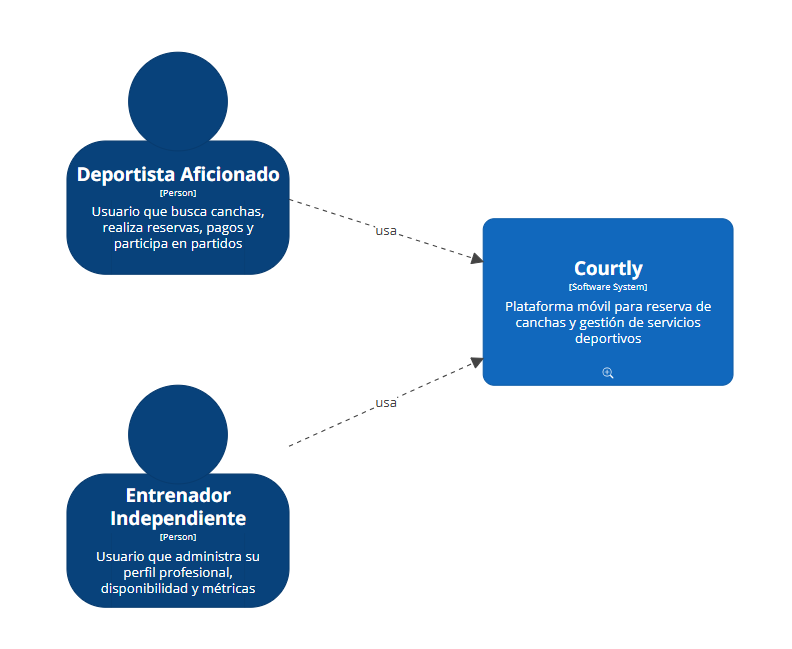

#### 2.5.3.2. Software Architecture Container Level Diagrams

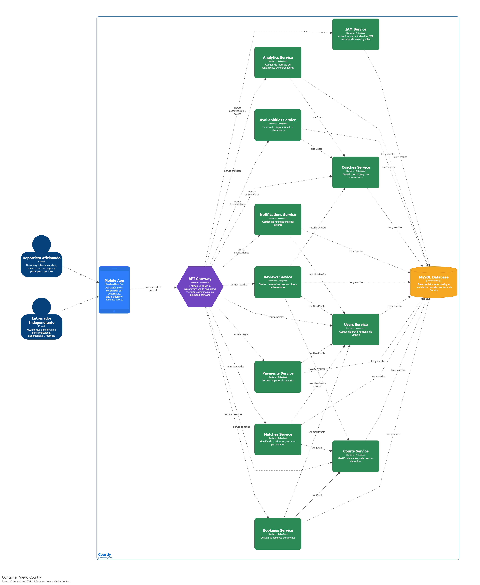

#### 2.5.3.3. Software Architecture Deployment Diagrams

Diagrama de componentes IAM

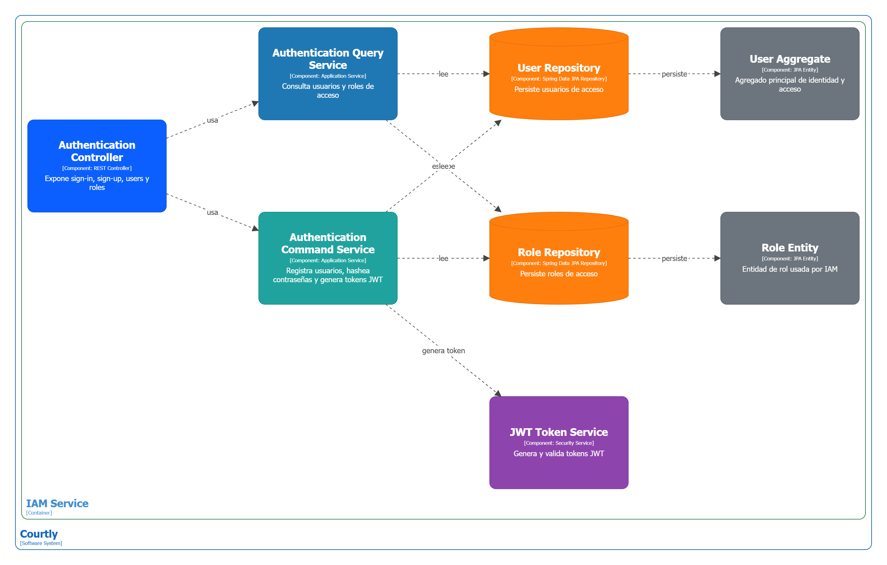

Diagrama de componentes Users


Diagrama de componentes Courts


Diagrama de componentes Booking


Diagrama de componentes Payments

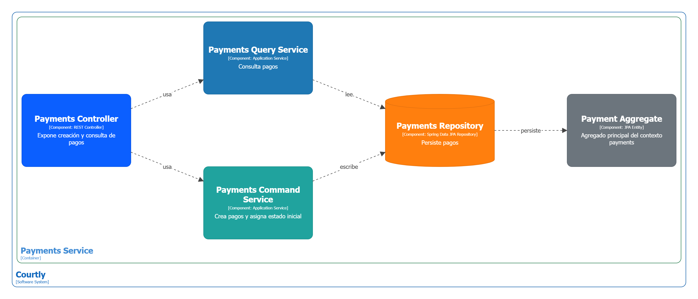

Diagrama de componentes Coaches

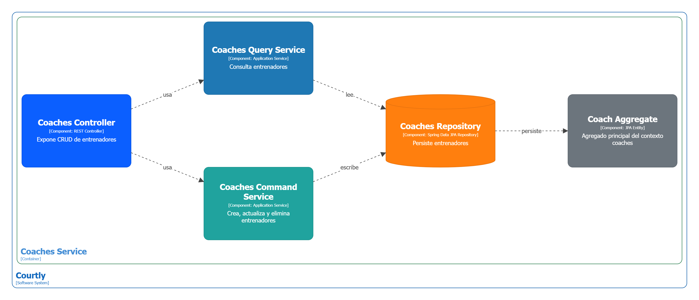

Diagrama de componentes Reviews


Diagrama de componentes Notificacions


Diagrama de componentes Matches


Diagrama de componentes Availabilities


Diagrama de componentes Analytics


---

## 2.6. Tactical-Level Domain-Driven Design

### 2.6.5. Bounded Context: Court & Venue Management (Gestión de Canchas)

#### 2.6.5.1. Domain Layer

**Entities / Aggregates**

```
Court (Cancha - Aggregate Root)
├── courtId: int → Identificador único de la cancha
├── ownerId: int → Propietario de la cancha
├── name: String → Nombre de la cancha
├── description: String → Descripción de la cancha
├── location: Location (Value Object)
├── sportType: SportType (Enum) → Tipo de deporte (Fútbol, Tenis, Básquet, etc.)
├── surface: String → Tipo de superficie (Sintética, Grass, Cemento)
├── pricePerHour: double → Precio por hora de uso
├── capacity: int → Capacidad máxima de usuarios
├── amenities: List<Amenity> → Servicios adicionales (estacionamiento, vestuarios, etc.)
├── rating: double → Calificación promedio
├── availability: AvailabilitySchedule (Value Object)
├── images: List<ImageUrl> → Fotos de la cancha
├── state: CourtState (Enum) → Estado (Activa, Inactiva, Bloqueada)
├── createdAt: DateTime → Fecha de creación
├── updatedAt: DateTime → Fecha de última actualización

Métodos:
├── createAvailability(horario) → Crea disponibilidad para horarios específicos
├── updatePricing(newPrice) → Actualiza el precio por hora
├── updateAvailability(slot, available) → Marca un slot como disponible o no
├── blockTime(startTime, endTime, reason) → Bloquea tiempo por mantenimiento
├── publishCourt() → Publica la cancha en la plataforma
├── deactivateCourt() → Desactiva la cancha
└── calculateOccupancy(period) → Calcula porcentaje de ocupación
```

**Value Objects**

```
Location
├── address: String → Dirección completa
├── city: String → Ciudad
├── latitude: double → Latitud
├── longitude: double → Longitud
└── districtCode: String → Código del distrito

AvailabilitySchedule
├── slots: List<TimeSlot>
├── workingHours: WorkingHours (lunes-domingo, hora inicio-fin)
└── exceptions: List<BlockedPeriod> (fechas cerradas, mantenimiento)

TimeSlot
├── date: Date → Fecha específica
├── startTime: Time → Hora de inicio
├── endTime: Time → Hora de finalización
└── isAvailable: boolean → Disponibilidad actual

Amenity
├── amenityId: int
├── name: String (Estacionamiento, Vestuarios, Ducha, Cafetería, etc.)
└── included: boolean
```

**Domain Services**

```
CourtAvailabilityService
├── checkAvailability(courtId, dateTime, duration) → boolean
└── suggestAlternativeSlots(courtId, preferences) → List<TimeSlot>

PricingService
├── calculatePrice(courtId, duration, dayOfWeek) → double
├── applyDiscount(courtId, reservationCount) → double
└── validatePriceRange(price) → boolean

CourtScheduleService
├── generateAvailabilityCalendar(courtId, month) → Calendar
├── publishSchedule(courtId, schedule) → void
└── syncWithReservationSystem(courtId) → void
```

**Domain Events**

```
CourtPublished(courtId, ownerId, timestamp)
CourtDeactivated(courtId, reason, timestamp)
PricingUpdated(courtId, oldPrice, newPrice, timestamp)
AvailabilityUpdated(courtId, slot, isAvailable, timestamp)
TimeBlocked(courtId, startTime, endTime, reason, timestamp)
CourtReviewed(courtId, rating, timestamp)
```

**Enums**

```
SportType: FUTBOL, TENIS, BASQUET, VOLEIBOL, PADEL, BADMINTON, OTRO
CourtState: ACTIVA, INACTIVA, BLOQUEADA, EN_MANTENIMIENTO
```

---

#### 2.6.5.2. Interface Layer

**REST Controllers**

```
CourtController
├── POST /courts → Crear nueva cancha
│   Request: CreateCourtDTO
│   Response: CourtResponseDTO
│
├── GET /courts/{courtId} → Obtener detalles de cancha
│   Response: CourtDetailDTO
│
├── PUT /courts/{courtId} → Actualizar información de cancha
│   Request: UpdateCourtDTO
│   Response: CourtResponseDTO
│
├── GET /courts → Listar canchas (con filtros)
│   Query: ?sport=FUTBOL&city=Lima&page=1
│   Response: PagedCourtDTO
│
├── PATCH /courts/{courtId}/pricing → Actualizar precio
│   Request: UpdatePricingDTO
│   Response: PricingResponseDTO
│
├── PATCH /courts/{courtId}/availability → Actualizar disponibilidad
│   Request: UpdateAvailabilityDTO
│   Response: AvailabilityResponseDTO
│
├── POST /courts/{courtId}/block-time → Bloquear tiempo
│   Request: BlockTimeDTO
│   Response: BlockResponseDTO
│
├── DELETE /courts/{courtId} → Desactivar cancha
│   Response: 204 No Content
│
├── GET /courts/{courtId}/calendar → Obtener calendario
│   Query: ?month=2024-04
│   Response: CalendarDTO
│
└── GET /courts/{courtId}/occupancy → Estadísticas de ocupación
    Query: ?period=MONTH
    Response: OccupancyStatisticsDTO
```

**DTOs (Data Transfer Objects)**

```
CreateCourtDTO
├── name: String
├── description: String
├── location: LocationDTO
├── sportType: String
├── surface: String
├── pricePerHour: double
├── capacity: int
├── amenities: List<String>
└── images: List<MultipartFile>

UpdateCourtDTO
├── name: String
├── description: String
├── amenities: List<String>
└── images: List<MultipartFile>

UpdatePricingDTO
├── pricePerHour: double
└── effectiveDate: Date

UpdateAvailabilityDTO
├── workingHours: WorkingHoursDTO
└── exceptions: List<BlockedPeriodDTO>

BlockTimeDTO
├── startTime: DateTime
├── endTime: DateTime
└── reason: String

CourtResponseDTO
├── courtId: int
├── name: String
├── location: LocationDTO
├── sportType: String
├── pricePerHour: double
├── rating: double
├── availability: AvailabilityDTO
└── state: String

CourtDetailDTO
├── (todos los campos de CourtResponseDTO)
├── description: String
├── surface: String
├── capacity: int
├── amenities: List<AmenityDTO>
├── images: List<ImageDTO>
├── owner: CourtOwnerDTO
└── reviews: List<ReviewDTO>

CalendarDTO
├── courtId: int
├── month: String
└── slots: List<SlotDTO>

OccupancyStatisticsDTO
├── courtId: int
├── period: String
├── totalSlots: int
├── bookedSlots: int
├── occupancyPercentage: double
└── revenueEstimate: double
```

---

#### 2.6.5.3. Application Layer

**Command Handlers**

```
CreateCourtCommandHandler
├── Input: CreateCourtCommand (name, location, sportType, pricePerHour, etc.)
├── Validaciones:
│   ├── Verificar que el propietario existe y está activo
│   ├── Validar que la ubicación es válida
│   ├── Validar que el precio está en rango permitido
│   └── Verificar que el usuario no tiene más de N canchas activas
└── Output: CourtCreatedEvent

UpdateCourtCommandHandler
├── Input: UpdateCourtCommand (courtId, updates)
├── Validaciones:
│   ├── Verificar que la cancha existe
│   ├── Verificar que el usuario es propietario
│   └── Validar datos actualizados
└── Output: CourtUpdatedEvent

UpdatePricingCommandHandler
├── Input: UpdatePricingCommand (courtId, newPrice)
├── Validaciones:
│   ├── Precio debe ser > 0
│   ├── No puede cambiar si hay reservas próximas (< 24 horas)
│   └── Verificar permisos del propietario
└── Output: PricingUpdatedEvent

UpdateAvailabilityCommandHandler
├── Input: UpdateAvailabilityCommand (courtId, schedule)
├── Validaciones:
│   ├── Horarios deben ser realistas (06:00 - 23:00)
│   ├── No puede cerrar con reservas activas
│   └── Validar formato de horarios
└── Output: AvailabilityUpdatedEvent

BlockTimeCommandHandler
├── Input: BlockTimeCommand (courtId, startTime, endTime, reason)
├── Validaciones:
│   ├── Verificar que no hay reservas en ese período
│   ├── Bloque no puede ser > 30 días
│   └── Verificar permisos del propietario
└── Output: TimeBlockedEvent

DeactivateCourtCommandHandler
├── Input: DeactivateCourtCommand (courtId, reason)
├── Validaciones:
│   ├── Verificar que no hay reservas activas
│   ├── Cancelar todas las reservas futuras
│   └── Verificar permisos del propietario
└── Output: CourtDeactivatedEvent
```

**Event Handlers**

```
OnCourtPublishedHandler
├── Escucha: CourtPublishedEvent
├── Acciones:
│   ├── Indexar cancha en Search & Discovery Context
│   ├── Enviar confirmación por email al propietario
│   └── Inicializar estadísticas
└── Publica: CourtIndexedEvent

OnPricingUpdatedHandler
├── Escucha: PricingUpdatedEvent
├── Acciones:
│   ├── Notificar a propietario sobre cambio
│   ├── Enviar notificación a deportistas que la siguen
│   └── Actualizar índices de búsqueda
└── Publica: SearchIndexUpdatedEvent

OnAvailabilityUpdatedHandler
├── Escucha: AvailabilityUpdatedEvent
├── Acciones:
│   ├── Sincronizar con Booking & Reservation Context
│   ├── Actualizar calendario de reservas disponibles
│   └── Notificar cambios a usuarios interesados
└── Publica: ReservationAvailabilityChangedEvent

OnTimeBlockedHandler
├── Escucha: TimeBlockedEvent
├── Acciones:
│   ├── Marcar slots como no disponibles
│   ├── Notificar sobre cierre temporal
│   └── Generar recordatorio de reapertura
└── Publica: TimeSlotBlockedEvent
```

---

#### 2.6.5.4. Infrastructure Layer

**Repositories**

```
CourtRepository
├── save(court: Court) → void
├── findById(courtId: int) → Court
├── findByOwnerId(ownerId: int) → List<Court>
├── findBySportType(sportType: SportType) → List<Court>
├── findByLocation(latitude, longitude, radiusKm) → List<Court>
├── update(court: Court) → void
├── delete(courtId: int) → void
└── findAvailableCourts(sportType, date, time, duration) → List<Court>

AvailabilityRepository
├── save(availability: AvailabilitySchedule) → void
├── findByCourtId(courtId: int) → AvailabilitySchedule
├── updateSlot(courtId, slot, available) → void
├── blockTime(courtId, startTime, endTime) → void
└── getCalendar(courtId, month) → Calendar

CourtRatingRepository
├── save(rating: Rating) → void
├── findByCourtId(courtId: int) → List<Rating>
├── calculateAverageRating(courtId: int) → double
└── updateCourtRating(courtId, newAverage) → void
```

**Adapters**

```
ImageStorageAdapter (Cloud Storage: AWS S3 / Google Cloud Storage)
├── uploadImage(file: MultipartFile, courtId: int) → String (URL)
├── deleteImage(imageUrl: String) → void
└── generateThumbnail(imageUrl: String) → String

LocationGeocoder (Google Maps API)
├── geocode(address: String) → Location (lat, lng)
├── reverseGeocode(lat, lng) → Address
└── calculateDistance(lat1, lng1, lat2, lng2) → double

CourtNotificationAdapter
├── sendCourtPublishedEmail(owner, court) → void
├── sendPricingChangeNotification(followers, court, oldPrice, newPrice) → void
└── sendAvailabilityAlert(users, court, newSchedule) → void

SearchIndexAdapter (Elasticsearch / Algolia)
├── indexCourt(court: Court) → void
├── updateIndex(courtId, updates) → void
├── removeCourt(courtId: int) → void
└── searchCourts(filters) → List<CourtSearchResult>
```

**Persistencia**

```
Tabla: courts
├── court_id (PK, INT, AUTO_INCREMENT)
├── owner_id (FK → users.user_id)
├── name (VARCHAR(255), NOT NULL)
├── description (TEXT)
├── address (VARCHAR(500), NOT NULL)
├── city (VARCHAR(100), NOT NULL)
├── latitude (DECIMAL(10,8), NOT NULL)
├── longitude (DECIMAL(11,8), NOT NULL)
├── sport_type (ENUM, NOT NULL)
├── surface (VARCHAR(50))
├── price_per_hour (DECIMAL(10,2), NOT NULL)
├── capacity (INT, NOT NULL)
├── rating (DECIMAL(3,2), DEFAULT 0)
├── state (ENUM, DEFAULT 'ACTIVA')
├── created_at (TIMESTAMP, DEFAULT CURRENT_TIMESTAMP)
├── updated_at (TIMESTAMP, ON UPDATE CURRENT_TIMESTAMP)
└── INDEX (owner_id, state), INDEX (sport_type, city), SPATIAL INDEX (latitude, longitude)

Tabla: court_amenities
├── amenity_id (PK, INT, AUTO_INCREMENT)
├── court_id (FK → courts.court_id)
├── amenity_name (VARCHAR(100))
├── included (BOOLEAN)
└── INDEX (court_id)

Tabla: court_availability
├── availability_id (PK, INT, AUTO_INCREMENT)
├── court_id (FK → courts.court_id, UNIQUE)
├── monday_start (TIME)
├── monday_end (TIME)
├── tuesday_start (TIME)
├── ... (miércoles a domingo)
└── updated_at (TIMESTAMP)

Tabla: court_blocked_periods
├── block_id (PK, INT, AUTO_INCREMENT)
├── court_id (FK → courts.court_id)
├── start_time (DATETIME)
├── end_time (DATETIME)
├── reason (VARCHAR(255))
├── created_at (TIMESTAMP)
└── INDEX (court_id, start_time)

Tabla: court_images
├── image_id (PK, INT, AUTO_INCREMENT)
├── court_id (FK → courts.court_id)
├── image_url (VARCHAR(500))
├── is_primary (BOOLEAN)
└── created_at (TIMESTAMP)

Tabla: court_ratings
├── rating_id (PK, INT, AUTO_INCREMENT)
├── court_id (FK → courts.court_id)
├── user_id (FK → users.user_id)
├── score (INT, CONSTRAINT CHECK (score >= 1 AND score <= 5))
├── comment (TEXT)
├── created_at (TIMESTAMP)
└── INDEX (court_id, created_at)
```

---

#### 2.6.5.5. Bounded Context Software Architecture Component Level Diagrams

**Descripción:**

El diagrama de componentes para el Court & Venue Management Context presenta la descomposición del contenedor en componentes funcionales cohesivos que manejan aspectos específicos del negocio de gestión de canchas:

**Componentes Principales:**

```
┌─────────────────────────────────────────────────────────────┐
│         Court & Venue Management Container                  │
├─────────────────────────────────────────────────────────────┤
│                                                               │
│  ┌──────────────────────────────────────────────────────┐   │
│  │  Court Management Component                          │   │
│  ├──────────────────────────────────────────────────────┤   │
│  │ • Crear/Actualizar canchas                           │   │
│  │ • Gestionar información de canchas                   │   │
│  │ • Validar datos de entrada                           │   │
│  │ • Publicar/Desactivar canchas                        │   │
│  └──────────────────────────────────────────────────────┘   │
│                                                               │
│  ┌──────────────────────────────────────────────────────┐   │
│  │  Availability & Scheduling Component                │   │
│  ├──────────────────────────────────────────────────────┤   │
│  │ • Gestionar disponibilidad por horarios              │   │
│  │ • Bloquear tiempo para mantenimiento                 │   │
│  │ • Generar calendario de disponibilidad               │   │
│  │ • Sincronizar con sistema de reservas                │   │
│  └──────────────────────────────────────────────────────┘   │
│                                                               │
│  ┌──────────────────────────────────────────────────────┐   │
│  │  Pricing & Commerce Component                        │   │
│  ├──────────────────────────────────────────────────────┤   │
│  │ • Gestionar precios por hora                         │   │
│  │ • Aplicar descuentos dinámicos                       │   │
│  │ • Calcular ingresos y estadísticas                   │   │
│  │ • Validar rangos de precios                          │   │
│  └──────────────────────────────────────────────────────┘   │
│                                                               │
│  ┌──────────────────────────────────────────────────────┐   │
│  │  Search & Discovery Component                        │   │
│  ├──────────────────────────────────────────────────────┤   │
│  │ • Indexar canchas en motor de búsqueda               │   │
│  │ • Mantener metadatos para búsqueda                   │   │
│  │ • Optimizar para consultas geoespaciales             │   │
│  │ • Actualizar índices en tiempo real                  │   │
│  └──────────────────────────────────────────────────────┘   │
│                                                               │
│  ┌──────────────────────────────────────────────────────┐   │
│  │  Notification Component                              │   │
│  ├──────────────────────────────────────────────────────┤   │
│  │ • Enviar notificaciones a propietarios                │   │
│  │ • Alertas de cambios de disponibilidad                │   │
│  │ • Recordatorios de eventos importantes                │   │
│  │ • Coordinar con Notification & Communication Context  │   │
│  └──────────────────────────────────────────────────────┘   │
│                                                               │
│  ┌──────────────────────────────────────────────────────┐   │
│  │  Repository & Data Access Component                  │   │
│  ├──────────────────────────────────────────────────────┤   │
│  │ • CourtRepository                                     │   │
│  │ • AvailabilityRepository                              │   │
│  │ • CourtRatingRepository                               │   │
│  │ • Implementación de patrones de persistencia          │   │
│  └──────────────────────────────────────────────────────┘   │
│                                                               │
└─────────────────────────────────────────────────────────────┘
         ↓                           ↓                   ↓
    ┌────────────┐      ┌────────────────┐      ┌──────────────┐
    │   SQLite   │      │  AWS S3 / GCS  │      │   Elasticsearch│
    │  (Courts)  │      │  (Images)      │      │  (Índices)     │
    └────────────┘      └────────────────┘      └──────────────┘
```

**Relaciones entre Componentes:**

- **Court Management ↔ Availability & Scheduling:** Court Management actualiza Availability cuando se publica una cancha
- **Pricing & Commerce → Repository:** Persiste cambios de precios en la base de datos
- **Availability & Scheduling → Search & Discovery:** Notifica cambios de disponibilidad para actualizar índices
- **Notification ← Todos:** Se suscribe a eventos de todos los componentes para enviar notificaciones
- **Repository → Data Store:** Accede y persiste toda la información en SQLite
- **Search & Discovery ↔ Elasticsearch:** Mantiene sincronizado el índice de búsqueda

---

#### 2.6.5.6. Bounded Context Software Architecture Code Level Diagrams

##### 2.6.5.6.1. Bounded Context Domain Layer Class Diagrams

**Diagrama UML de Clases - Court & Venue Management Domain Layer**

```
┌─────────────────────────────┐
│      <<Aggregate>>          │
│         Court               │
├─────────────────────────────┤
│ - courtId: int              │
│ - ownerId: int              │
│ - name: String              │
│ - description: String       │
│ - location: Location        │
│ - sportType: SportType      │
│ - surface: String           │
│ - pricePerHour: double      │
│ - capacity: int             │
│ - amenities: List<Amenity>  │
│ - rating: double            │
│ - availability: AvailSched  │
│ - images: List<ImageUrl>    │
│ - state: CourtState         │
│ - createdAt: DateTime       │
│ - updatedAt: DateTime       │
├─────────────────────────────┤
│ + publishCourt(): void      │
│ + updatePricing(p): void    │
│ + updateAvailability(): void│
│ + blockTime(s,e,r): void    │
│ + deactivateCourt(): void   │
│ + calculateOccupancy(): dbl │
│ + addAmenity(a): void       │
│ + removeAmenity(a): void    │
└────────────────┬────────────┘
                 │
     ┌───────────┴────────────┐
     │                        │
┌────▼──────────────────┐ ┌──▼──────────────────────────┐
│   <<ValueObject>>     │ │  <<ValueObject>>            │
│     Location          │ │  AvailabilitySchedule       │
├───────────────────────┤ ├─────────────────────────────┤
│ - address: String     │ │ - slots: List<TimeSlot>     │
│ - city: String        │ │ - workingHours: WorkHours   │
│ - latitude: double    │ │ - exceptions: List<Block>   │
│ - longitude: double   │ ├─────────────────────────────┤
│ - districtCode: String│ │ + isAvailable(slot): bool   │
├───────────────────────┤ │ + getAvailableSlots(): List │
│ + distance(loc): dbl  │ │ + blockPeriod(s,e): void    │
│ + isValid(): boolean  │ │ + unblockPeriod(s,e): void  │
└───────────────────────┘ └─────────────────────────────┘
          ▲                          ▲
          │                          │
          │ uses                     │ contains
          │                          │
     ┌────┴───────────────┐    ┌────┴─────────────────────┐
     │                    │    │                          │
┌────▼─────────────────┐  │ ┌──▼────────────────────────┐│
│  <<ValueObject>>     │  │ │  <<ValueObject>>          ││
│   TimeSlot           │  │ │   Amenity                 ││
├──────────────────────┤  │ ├──────────────────────────┤│
│ - date: Date         │  │ │ - amenityId: int         ││
│ - startTime: Time    │  │ │ - name: String           ││
│ - endTime: Time      │  │ │ - included: boolean      ││
│ - isAvailable: bool  │  │ ├──────────────────────────┤│
├──────────────────────┤  │ │ + getName(): String      ││
│ + duration(): int    │  │ │ + isIncluded(): bool     ││
│ + overlaps(ts): bool │  │ └──────────────────────────┘│
└──────────────────────┘  └───────────────────────────┘

┌─────────────────────────────┐      ┌────────────────────┐
│   <<Interface>>             │      │   <<Enum>>         │
│   CourtRepository           │      │   SportType        │
├─────────────────────────────┤      ├────────────────────┤
│ + save(c: Court): void      │      │ FUTBOL             │
│ + findById(id): Court       │      │ TENIS              │
│ + findByOwnerId(id): List   │      │ BASQUET            │
│ + update(c: Court): void    │      │ VOLEIBOL           │
│ + delete(id): void          │      │ PADEL              │
│ + findAvailable(): List     │      │ BADMINTON          │
└─────────────────────────────┘      │ OTRO               │
           △                         └────────────────────┘
           │ implements
           │                        ┌────────────────────┐
    ┌──────┴───────┐                │   <<Enum>>         │
    │              │                │   CourtState       │
┌───▼──────────────────────────┐    ├────────────────────┤
│ CourtRepositoryImpl           │    │ ACTIVA             │
├──────────────────────────────┤    │ INACTIVA           │
│ - db: Database               │    │ BLOQUEADA          │
├──────────────────────────────┤    │ EN_MANTENIMIENTO   │
│ + save(c): void              │    └────────────────────┘
│ + findById(id): Court        │
│ + update(c): void            │
│ + delete(id): void           │
└──────────────────────────────┘

┌────────────────────────────────────┐
│   <<Service>>                      │
│   CourtAvailabilityService         │
├────────────────────────────────────┤
│ - courtRepository: CourtRepository │
├────────────────────────────────────┤
│ + checkAvailability(): boolean     │
│ + suggestAlternativeSlots(): List  │
│ + reserveSlot(slot): void          │
│ + releaseSlot(slot): void          │
└────────────────────────────────────┘

Relaciones:
- Court *──────── 1 Location (contains)
- Court *──────── 1 AvailabilitySchedule (contains)
- Court *──────── * Amenity (contains)
- AvailabilitySchedule *──────── * TimeSlot (contains)
- CourtRepository ◄────────────── Court (manages)
- CourtAvailabilityService ───────► CourtRepository (uses)
```

---

##### 2.6.5.6.2. Bounded Context Database Design Diagram

**Entity Relationship Diagram (ERD) - Court & Venue Management**

```
┌──────────────────────────────┐
│         users                │
├──────────────────────────────┤
│ PK user_id (INT)             │
│ name (VARCHAR)               │
│ email (VARCHAR, UNIQUE)      │
│ role (ENUM)                  │
└──────────────────────────────┘
         ▲
         │ FK (owner_id)
         │
┌─────────┴──────────────────────────────┐
│          courts                        │
├────────────────────────────────────────┤
│ PK court_id (INT, AUTO_INCREMENT)      │
│ FK owner_id (INT)                      │
│ name (VARCHAR(255), NOT NULL)          │
│ description (TEXT)                     │
│ address (VARCHAR(500), NOT NULL)       │
│ city (VARCHAR(100), NOT NULL)          │
│ district_code (VARCHAR(20))            │
│ latitude (DECIMAL(10,8), NOT NULL)     │
│ longitude (DECIMAL(11,8), NOT NULL)    │
│ sport_type (ENUM, NOT NULL)            │
│ surface (VARCHAR(50))                  │
│ price_per_hour (DECIMAL(10,2))         │
│ capacity (INT)                         │
│ rating (DECIMAL(3,2), DEFAULT 0)       │
│ state (ENUM, DEFAULT 'ACTIVA')         │
│ created_at (TIMESTAMP)                 │
│ updated_at (TIMESTAMP)                 │
│ UNIQUE KEY (owner_id, name)            │
│ INDEX idx_sport_city (sport_type, city)│
│ SPATIAL INDEX idx_location (lat, lng)  │
└─────────────────────┬────────────────────┘
     ┌────────────────┼────────────────┐
     │                │                │
     │                │                │
┌────▼──────────┐ ┌──▼────────────┐ ┌▼─────────────────┐
│court_amenities│ │court_images    │ │court_availability│
├───────────────┤ ├────────────────┤ ├──────────────────┤
│PK amenity_id  │ │PK image_id     │ │PK availability_id│
│FK court_id    │ │FK court_id     │ │FK court_id (UNIQ)│
│amenity_name   │ │image_url       │ │monday_start (TIM)│
│included (BOOL)│ │is_primary (BOO)│ │monday_end (TIME) │
│               │ │created_at      │ │tuesday_start     │
│               │ │                │ │tuesday_end       │
│               │ │                │ │...wednesday-sun..│
│               │ │                │ │updated_at        │
└───────────────┘ └────────────────┘ └──────────────────┘
     │                │
     │                │
     └────────┬───────┘
              │ FK (court_id)
              │
┌─────────────▼──────────────────┐
│ court_blocked_periods          │
├────────────────────────────────┤
│ PK block_id (INT)              │
│ FK court_id (INT)              │
│ start_time (DATETIME)          │
│ end_time (DATETIME)            │
│ reason (VARCHAR(255))          │
│ created_at (TIMESTAMP)         │
│ CONSTRAINT no_overlapping_blocks│
│ INDEX idx_court_dates          │
└────────────────────────────────┘

┌────────────────────────────────┐
│ court_ratings                  │
├────────────────────────────────┤
│ PK rating_id (INT)             │
│ FK court_id (INT)              │
│ FK user_id (INT)               │
│ score (INT, CHECK 1-5)         │
│ comment (TEXT)                 │
│ created_at (TIMESTAMP)         │
│ UNIQUE (court_id, user_id)     │
│ INDEX idx_court_score          │
└────────────────────────────────┘

Relaciones:
- users (1) ──── (*) courts
- courts (1) ──── (*) court_amenities
- courts (1) ──── (*) court_images
- courts (1) ──── (1) court_availability
- courts (1) ──── (*) court_blocked_periods
- courts (1) ──── (*) court_ratings
- users (1) ──── (*) court_ratings
```

---
